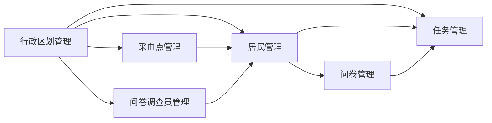

# 濂溪区胃癌筛查信息系统 - 第二阶段开发设计

## 文档说明

本文档是《濂溪区胃癌筛查信息系统设计文档》(three-level-quiz-system.md)的延续,专注于第二阶段"核心功能开发"的详细设计与实施指导。

**关联文档**: three-level-quiz-system.md  
**当前阶段**: 第二阶段 - 核心功能开发  
**前置完成**: 第一阶段基础框架搭建已完成(数据库表结构、示例数据、初始化脚本)  
**预计周期**: 5周

---

## 一、第二阶段总体规划

### 1.1 阶段目标

完成管理后台端的核心业务功能开发,为后续采血业务、筛查结果管理、小程序端开发奠定基础。本阶段聚焦于基础数据管理和核心业务流程,确保数据权限控制和业务规则正确实施。

### 1.2 开发优先级

按照业务依赖关系,开发顺序如下:



**说明**:
- 行政区划管理是所有模块的基础,需要最先完成
- 采血点和问卷调查员管理依赖行政区划数据
- 居民管理需要采血点和调查员数据作为关联
- 问卷管理依赖居民数据
- 任务管理需要区划、居民、问卷等数据支撑进度统计

### 1.3 模块划分

| 模块名称 | 预计工期 | 关键技术点 | 验收标准 |
|---------|---------|-----------|---------|
| 行政区划管理 | 3天 | 树形结构查询、级联选择 | 支持五级区划树形展示和级联查询 |
| 采血点管理 | 2天 | 数据权限过滤、下拉列表 | 区级管理员可管理本区采血点 |
| 问卷调查员管理 | 2天 | 用户关联、绩效统计 | 支持调查员CRUD和绩效查询 |
| 居民管理 | 5天 | 身份证号权限控制、导出 | 采血点管理员不可见身份证号 |
| 问卷管理 | 5天 | JSON动态渲染、评分算法 | 自动判定重点人群准确 |
| 任务管理 | 5天 | 多层级统计、进度汇总 | 支持区级和街道级进度查询 |

---

## 二、后端开发规范

### 2.1 项目结构规范

基于现有项目结构,新增胃癌筛查(gastric cancer)业务模块:

**包结构**:
```
com.javaxiaobear.module.gc
├── controller          # 控制器层
├── domain             # 领域模型层
│   ├── entity         # 实体类
│   ├── vo             # 视图对象
│   └── dto            # 数据传输对象
├── mapper             # 数据访问层接口
├── service            # 业务逻辑层
│   └── impl           # 业务实现类
└── util               # 工具类
```

**Mapper XML位置**:
```
resources/mybatis/gc/
├── GcRegionMapper.xml
├── GcSamplingSiteMapper.xml
├── GcSurveyorMapper.xml
├── GcResidentMapper.xml
├── GcQuestionnaireTemplateMapper.xml
├── GcQuestionnaireRecordMapper.xml
├── GcBloodAppointmentMapper.xml
├── GcTaskMapper.xml
├── GcScreeningResultMapper.xml
├── GcFollowUpMapper.xml
└── GcFollowUpTrackMapper.xml
```

### 2.2 命名规范

**实体类命名**: GcXxx (如GcRegion、GcResident)  
**VO类命名**: XxxVO (如ResidentVO、RegionTreeVO)  
**DTO类命名**: XxxDTO (如ResidentQueryDTO、TaskAssignDTO)  
**Mapper接口命名**: GcXxxMapper  
**Service接口命名**: IGcXxxService  
**Service实现类命名**: GcXxxServiceImpl  
**Controller命名**: GcXxxController

### 2.3 继承基类规范

**实体类继承BaseEntity**:
```
所有实体类需继承com.javaxiaobear.common.core.domain.BaseEntity
BaseEntity包含以下公共字段:
- createBy: 创建人
- createTime: 创建时间
- updateBy: 更新人
- updateTime: 更新时间
- remark: 备注
```

**Service实现类继承ServiceImpl**:
```
使用MyBatis-Plus的ServiceImpl<M, T>作为基类
M: Mapper接口类型
T: 实体类类型
```

### 2.4 数据权限注解规范

参考现有系统的数据权限机制,在Service层方法上添加注解:

**注解位置**: Service实现类的查询方法  
**注解作用**: 根据用户角色自动添加SQL过滤条件

**数据权限过滤规则**:
- 超级管理员: 无过滤,可查看所有数据
- 区级管理员: 过滤条件WHERE district = '当前用户区县'
- 街道/乡镇管理员: 过滤条件WHERE street = '当前用户街道'
- 采血点管理员: 过滤条件WHERE appointment_site_id = '当前用户采血点ID'

### 2.5 响应结果规范

**成功响应**:
```
使用AjaxResult.success()或AjaxResult.success(data)
```

**失败响应**:
```
使用AjaxResult.error()或AjaxResult.error(message)
```

**分页响应**:
```
使用TableDataInfo封装分页结果
包含total总记录数和rows数据列表
```

---

## 三、行政区划管理模块设计

### 3.1 功能概述

提供全国五级行政区划(省、市、区、街道/乡镇、社区/村)的查询和管理功能,支持树形结构展示和级联选择,为其他业务模块提供区划数据基础。

### 3.2 接口设计

#### 3.2.1 查询省列表

**接口路径**: GET /api/gc/region/provinces

**请求参数**: 无

**响应数据**:
| 字段名称 | 字段类型 | 说明 |
|---------|---------|------|
| regionId | Long | 区域ID |
| regionName | String | 省份名称 |
| regionCode | String | 行政区划代码 |

**业务规则**:
- 仅返回region_level = 1的记录
- 按sort_order升序排序
- 仅返回status = 0(正常)的记录

#### 3.2.2 查询市列表

**接口路径**: GET /api/gc/region/cities

**请求参数**:
| 参数名称 | 参数类型 | 必填 | 说明 |
|---------|---------|-----|------|
| provinceId | Long | 是 | 省份ID |

**响应数据**:
| 字段名称 | 字段类型 | 说明 |
|---------|---------|------|
| regionId | Long | 区域ID |
| regionName | String | 城市名称 |
| regionCode | String | 行政区划代码 |

**业务规则**:
- 查询parent_id = provinceId且region_level = 2的记录
- 按sort_order升序排序
- 仅返回status = 0(正常)的记录

#### 3.2.3 查询区列表

**接口路径**: GET /api/gc/region/districts

**请求参数**:
| 参数名称 | 参数类型 | 必填 | 说明 |
|---------|---------|-----|------|
| cityId | Long | 是 | 城市ID |

**响应数据**:
| 字段名称 | 字段类型 | 说明 |
|---------|---------|------|
| regionId | Long | 区域ID |
| regionName | String | 区县名称 |
| regionCode | String | 行政区划代码 |

**业务规则**:
- 查询parent_id = cityId且region_level = 3的记录
- 按sort_order升序排序
- 仅返回status = 0(正常)的记录

#### 3.2.4 查询街道/乡镇列表

**接口路径**: GET /api/gc/region/streets

**请求参数**:
| 参数名称 | 参数类型 | 必填 | 说明 |
|---------|---------|-----|------|
| districtId | Long | 是 | 区县ID |

**响应数据**:
| 字段名称 | 字段类型 | 说明 |
|---------|---------|------|
| regionId | Long | 区域ID |
| regionName | String | 街道/乡镇名称 |
| regionCode | String | 行政区划代码 |

**业务规则**:
- 查询parent_id = districtId且region_level = 4的记录
- 按sort_order升序排序
- 仅返回status = 0(正常)的记录

#### 3.2.5 查询社区/村列表

**接口路径**: GET /api/gc/region/communities

**请求参数**:
| 参数名称 | 参数类型 | 必填 | 说明 |
|---------|---------|-----|------|
| streetId | Long | 是 | 街道/乡镇ID |

**响应数据**:
| 字段名称 | 字段类型 | 说明 |
|---------|---------|------|
| regionId | Long | 区域ID |
| regionName | String | 社区/村名称 |
| regionCode | String | 行政区划代码 |

**业务规则**:
- 查询parent_id = streetId且region_level = 5的记录
- 按sort_order升序排序
- 仅返回status = 0(正常)的记录

#### 3.2.6 查询区划树形结构

**接口路径**: GET /api/gc/region/tree

**请求参数**:
| 参数名称 | 参数类型 | 必填 | 说明 |
|---------|---------|-----|------|
| rootId | Long | 否 | 根节点ID,不传则从省级开始 |
| maxLevel | Integer | 否 | 最大层级,默认5 |

**响应数据**:
| 字段名称 | 字段类型 | 说明 |
|---------|---------|------|
| regionId | Long | 区域ID |
| regionName | String | 区域名称 |
| regionCode | String | 行政区划代码 |
| regionLevel | Integer | 区域层级 |
| parentId | Long | 父级ID |
| children | Array | 子级区域列表 |

**业务规则**:
- 递归查询构建树形结构
- 仅返回status = 0(正常)的记录
- 按sort_order升序排序

#### 3.2.7 查询区划详情

**接口路径**: GET /api/gc/region/{regionId}

**路径参数**:
| 参数名称 | 参数类型 | 必填 | 说明 |
|---------|---------|-----|------|
| regionId | Long | 是 | 区域ID |

**响应数据**:
| 字段名称 | 字段类型 | 说明 |
|---------|---------|------|
| regionId | Long | 区域ID |
| regionName | String | 区域名称 |
| regionCode | String | 行政区划代码 |
| regionLevel | Integer | 区域层级 |
| parentId | Long | 父级ID |
| status | String | 状态 |
| sortOrder | Integer | 排序号 |
| createBy | String | 创建人 |
| createTime | DateTime | 创建时间 |

#### 3.2.8 新增区划

**接口路径**: POST /api/gc/region

**权限要求**: 超级管理员

**请求参数**:
| 参数名称 | 参数类型 | 必填 | 说明 |
|---------|---------|-----|------|
| regionName | String | 是 | 区域名称 |
| regionCode | String | 是 | 行政区划代码(12位) |
| regionLevel | Integer | 是 | 区域层级(1-5) |
| parentId | Long | 否 | 父级ID(省级可为空) |
| sortOrder | Integer | 否 | 排序号,默认0 |

**响应数据**: 成功或失败消息

**业务规则**:
- 验证regionCode唯一性
- 验证regionLevel取值范围(1-5)
- 如果有parentId,验证父级区域存在且层级正确
- 状态默认设置为0(正常)

#### 3.2.9 编辑区划

**接口路径**: PUT /api/gc/region

**权限要求**: 超级管理员

**请求参数**:
| 参数名称 | 参数类型 | 必填 | 说明 |
|---------|---------|-----|------|
| regionId | Long | 是 | 区域ID |
| regionName | String | 是 | 区域名称 |
| sortOrder | Integer | 否 | 排序号 |
| status | String | 否 | 状态 |

**响应数据**: 成功或失败消息

**业务规则**:
- 不允许修改regionCode和regionLevel
- 不允许修改parentId(避免破坏层级关系)

#### 3.2.10 删除区划

**接口路径**: DELETE /api/gc/region/{regionId}

**权限要求**: 超级管理员

**路径参数**:
| 参数名称 | 参数类型 | 必填 | 说明 |
|---------|---------|-----|------|
| regionId | Long | 是 | 区域ID |

**响应数据**: 成功或失败消息

**业务规则**:
- 检查是否存在子级区划,存在则不允许删除
- 检查是否被采血点或调查员引用,存在则不允许删除
- 物理删除记录

### 3.3 数据模型

#### 实体类设计

**类名**: GcRegion

**字段列表**:
| 字段名称 | 字段类型 | 说明 |
|---------|---------|------|
| regionId | Long | 区域ID(主键) |
| regionName | String | 区域名称 |
| regionCode | String | 行政区划代码 |
| regionLevel | Integer | 区域层级(1-5) |
| parentId | Long | 父级ID |
| status | String | 状态(0正常/1停用) |
| sortOrder | Integer | 排序号 |

**继承关系**: 继承BaseEntity

#### VO类设计

**RegionTreeVO**: 区划树形结构视图对象
| 字段名称 | 字段类型 | 说明 |
|---------|---------|------|
| regionId | Long | 区域ID |
| regionName | String | 区域名称 |
| regionCode | String | 行政区划代码 |
| regionLevel | Integer | 区域层级 |
| parentId | Long | 父级ID |
| children | List&lt;RegionTreeVO&gt; | 子级列表 |

### 3.4 前端交互说明

#### 3.4.1 区划树形展示

使用Ant Design Vue的Tree组件展示区划树形结构

**展示要求**:
- 支持懒加载,点击节点时加载下级区划
- 展示层级标识(省/市/区/街道/社区)
- 支持搜索过滤
- 支持展开/折叠

#### 3.4.2 级联选择器

使用Ant Design Vue的Cascader组件实现五级联动

**使用场景**:
- 居民信息录入时选择所属区域
- 采血点管理时选择所属街道
- 任务分配时选择目标区域

**交互流程**:
1. 初始加载省级列表
2. 选择省份后加载市级列表
3. 选择城市后加载区级列表
4. 选择区县后加载街道列表
5. 选择街道后加载社区列表

---

## 四、采血点管理模块设计

### 4.1 功能概述

管理采血点的基本信息,包括名称、位置、负责人等。支持区级管理员管理本区采血点,街道管理员查看本街道采血点。

### 4.2 接口设计

#### 4.2.1 查询采血点列表

**接口路径**: GET /api/gc/sampling-site/list

**请求参数**:
| 参数名称 | 参数类型 | 必填 | 说明 |
|---------|---------|-----|------|
| siteName | String | 否 | 采血点名称(模糊查询) |
| regionId | Long | 否 | 所属区域ID |
| status | String | 否 | 状态(0正常/1停用) |
| pageNum | Integer | 是 | 页码 |
| pageSize | Integer | 是 | 每页条数 |

**响应数据**:
| 字段名称 | 字段类型 | 说明 |
|---------|---------|------|
| siteId | Long | 采血点ID |
| siteName | String | 采血点名称 |
| regionName | String | 所属街道/乡镇名称 |
| address | String | 详细地址 |
| streetManagerName | String | 街道管理员姓名 |
| streetManagerPhone | String | 街道管理员电话 |
| siteManagerName | String | 采血点管理员姓名 |
| siteManagerPhone | String | 采血点管理员电话 |
| status | String | 状态 |
| createTime | DateTime | 创建时间 |

**数据权限**:
- 超级管理员: 查询所有采血点
- 区级管理员: 仅查询本区下属街道的采血点
- 街道管理员: 仅查询本街道的采血点
- 采血点管理员: 仅查询本采血点

#### 4.2.2 查询采血点详情

**接口路径**: GET /api/gc/sampling-site/{siteId}

**路径参数**:
| 参数名称 | 参数类型 | 必填 | 说明 |
|---------|---------|-----|------|
| siteId | Long | 是 | 采血点ID |

**响应数据**: 采血点完整信息

**数据权限**: 同列表查询

#### 4.2.3 新增采血点

**接口路径**: POST /api/gc/sampling-site

**权限要求**: 超级管理员、区级管理员

**请求参数**:
| 参数名称 | 参数类型 | 必填 | 说明 |
|---------|---------|-----|------|
| siteName | String | 是 | 采血点名称 |
| regionId | Long | 是 | 所属街道/乡镇ID |
| address | String | 是 | 详细地址 |
| streetManagerId | Long | 否 | 街道管理员ID |
| streetManagerName | String | 否 | 街道管理员姓名 |
| streetManagerPhone | String | 否 | 街道管理员电话 |
| siteManagerId | Long | 否 | 采血点管理员ID |
| siteManagerName | String | 否 | 采血点管理员姓名 |
| siteManagerPhone | String | 否 | 采血点管理员电话 |

**响应数据**: 成功或失败消息

**业务规则**:
- 验证regionId存在且为街道级别(region_level = 4)
- 状态默认设置为0(正常)
- 区级管理员仅可为本区下属街道创建采血点

#### 4.2.4 编辑采血点

**接口路径**: PUT /api/gc/sampling-site

**权限要求**: 超级管理员、区级管理员

**请求参数**: 同新增,需包含siteId

**响应数据**: 成功或失败消息

**业务规则**:
- 区级管理员仅可编辑本区下属街道的采血点
- 不允许修改所属街道(regionId)

#### 4.2.5 删除采血点

**接口路径**: DELETE /api/gc/sampling-site/{siteId}

**权限要求**: 超级管理员、区级管理员

**路径参数**:
| 参数名称 | 参数类型 | 必填 | 说明 |
|---------|---------|-----|------|
| siteId | Long | 是 | 采血点ID |

**响应数据**: 成功或失败消息

**业务规则**:
- 检查是否有居民预约该采血点,存在则不允许删除
- 区级管理员仅可删除本区下属街道的采血点
- 物理删除记录

#### 4.2.6 查询采血点下拉列表

**接口路径**: GET /api/gc/sampling-site/options

**请求参数**:
| 参数名称 | 参数类型 | 必填 | 说明 |
|---------|---------|-----|------|
| regionId | Long | 否 | 所属街道ID |

**响应数据**:
| 字段名称 | 字段类型 | 说明 |
|---------|---------|------|
| siteId | Long | 采血点ID |
| siteName | String | 采血点名称 |

**业务规则**:
- 仅返回status = 0(正常)的采血点
- 如果传入regionId,则仅返回该街道的采血点
- 数据权限同列表查询

### 4.3 数据模型

#### 实体类设计

**类名**: GcSamplingSite

**字段列表**:
| 字段名称 | 字段类型 | 说明 |
|---------|---------|------|
| siteId | Long | 采血点ID(主键) |
| siteName | String | 采血点名称 |
| regionId | Long | 所属街道/乡镇ID |
| address | String | 详细地址 |
| streetManagerId | Long | 街道管理员ID |
| streetManagerName | String | 街道管理员姓名 |
| streetManagerPhone | String | 街道管理员电话 |
| siteManagerId | Long | 采血点管理员ID |
| siteManagerName | String | 采血点管理员姓名 |
| siteManagerPhone | String | 采血点管理员电话 |
| status | String | 状态(0正常/1停用) |

**继承关系**: 继承BaseEntity

---

## 五、问卷调查员管理模块设计

### 5.1 功能概述

管理问卷调查员的基本信息,包括姓名、性别、所属区域、联系方式等。支持绩效统计查询,展示调查员协助录入的居民数量和问卷完成数量。

### 5.2 接口设计

#### 5.2.1 查询调查员列表

**接口路径**: GET /api/gc/surveyor/list

**请求参数**:
| 参数名称 | 参数类型 | 必填 | 说明 |
|---------|---------|-----|------|
| realName | String | 否 | 真实姓名(模糊查询) |
| regionId | Long | 否 | 所属街道ID |
| status | String | 否 | 状态(0正常/1停用) |
| pageNum | Integer | 是 | 页码 |
| pageSize | Integer | 是 | 每页条数 |

**响应数据**:
| 字段名称 | 字段类型 | 说明 |
|---------|---------|------|
| surveyorId | Long | 调查员ID |
| realName | String | 真实姓名 |
| gender | String | 性别 |
| regionName | String | 所属街道名称 |
| phoneNumber | String | 联系电话 |
| streetManagerName | String | 街道管理员姓名 |
| streetManagerPhone | String | 街道管理员电话 |
| status | String | 状态 |
| createTime | DateTime | 创建时间 |

**数据权限**:
- 超级管理员: 查询所有调查员
- 区级管理员: 仅查询本区下属街道的调查员
- 街道管理员: 仅查询本街道的调查员
- 采血点管理员: 无权查询

#### 5.2.2 查询调查员详情

**接口路径**: GET /api/gc/surveyor/{surveyorId}

**路径参数**:
| 参数名称 | 参数类型 | 必填 | 说明 |
|---------|---------|-----|------|
| surveyorId | Long | 是 | 调查员ID |

**响应数据**: 调查员完整信息

**数据权限**: 同列表查询

#### 5.2.3 新增调查员

**接口路径**: POST /api/gc/surveyor

**权限要求**: 超级管理员、区级管理员、街道管理员

**请求参数**:
| 参数名称 | 参数类型 | 必填 | 说明 |
|---------|---------|-----|------|
| userId | Long | 是 | 关联用户ID |
| realName | String | 是 | 真实姓名 |
| gender | String | 是 | 性别(0男/1女) |
| regionId | Long | 是 | 所属街道ID |
| phoneNumber | String | 是 | 联系电话 |
| streetManagerId | Long | 否 | 街道管理员ID |
| streetManagerPhone | String | 否 | 街道管理员电话 |

**响应数据**: 成功或失败消息

**业务规则**:
- 验证userId唯一性(一个用户仅可关联一个调查员)
- 验证regionId存在且为街道级别(region_level = 4)
- 验证手机号格式
- 状态默认设置为0(正常)
- 区级管理员仅可为本区下属街道创建调查员
- 街道管理员仅可为本街道创建调查员

#### 5.2.4 编辑调查员

**接口路径**: PUT /api/gc/surveyor

**权限要求**: 超级管理员、区级管理员、街道管理员

**请求参数**: 同新增,需包含surveyorId

**响应数据**: 成功或失败消息

**业务规则**:
- 不允许修改userId和regionId
- 区级管理员仅可编辑本区下属街道的调查员
- 街道管理员仅可编辑本街道的调查员

#### 5.2.5 删除调查员

**接口路径**: DELETE /api/gc/surveyor/{surveyorId}

**权限要求**: 超级管理员、区级管理员、街道管理员

**路径参数**:
| 参数名称 | 参数类型 | 必填 | 说明 |
|---------|---------|-----|------|
| surveyorId | Long | 是 | 调查员ID |

**响应数据**: 成功或失败消息

**业务规则**:
- 检查是否有居民关联该调查员,存在则不允许删除
- 区级管理员仅可删除本区下属街道的调查员
- 街道管理员仅可删除本街道的调查员
- 物理删除记录

#### 5.2.6 查询调查员绩效统计

**接口路径**: GET /api/gc/surveyor/performance

**请求参数**:
| 参数名称 | 参数类型 | 必填 | 说明 |
|---------|---------|-----|------|
| regionId | Long | 否 | 所属街道ID |
| startDate | Date | 否 | 开始日期 |
| endDate | Date | 否 | 结束日期 |
| pageNum | Integer | 是 | 页码 |
| pageSize | Integer | 是 | 每页条数 |

**响应数据**:
| 字段名称 | 字段类型 | 说明 |
|---------|---------|------|
| surveyorId | Long | 调查员ID |
| surveyorName | String | 调查员姓名 |
| regionName | String | 所属街道名称 |
| residentCount | Integer | 协助录入居民数 |
| questionnaireCount | Integer | 问卷完成数 |
| focusGroupCount | Integer | 重点人群数 |

**业务规则**:
- 统计调查员协助录入的居民数量(gc_resident表surveyor_id关联)
- 统计调查员协助完成的问卷数量(gc_questionnaire_record表surveyor_id关联)
- 统计其中重点人群数量(is_focus_group = 1)
- 支持按时间范围过滤
- 数据权限同列表查询

### 5.3 数据模型

#### 实体类设计

**类名**: GcSurveyor

**字段列表**:
| 字段名称 | 字段类型 | 说明 |
|---------|---------|------|
| surveyorId | Long | 调查员ID(主键) |
| userId | Long | 关联用户ID |
| realName | String | 真实姓名 |
| gender | String | 性别(0男/1女) |
| regionId | Long | 所属街道ID |
| streetManagerId | Long | 街道管理员ID |
| streetManagerPhone | String | 街道管理员电话 |
| phoneNumber | String | 联系电话 |
| status | String | 状态(0正常/1停用) |

**继承关系**: 继承BaseEntity

#### VO类设计

**SurveyorPerformanceVO**: 调查员绩效视图对象
| 字段名称 | 字段类型 | 说明 |
|---------|---------|------|
| surveyorId | Long | 调查员ID |
| surveyorName | String | 调查员姓名 |
| regionName | String | 所属街道名称 |
| residentCount | Integer | 协助录入居民数 |
| questionnaireCount | Integer | 问卷完成数 |
| focusGroupCount | Integer | 重点人群数 |

---

## 六、开发优先级与依赖关系

### 6.1 第一批开发(第1周)

**行政区划管理模块** - 无依赖,优先开发
- 后端: GcRegion实体类、Mapper、Service、Controller
- 前端: 区划树形展示、级联选择器组件

### 6.2 第二批开发(第2周)

**采血点管理模块** - 依赖行政区划
**问卷调查员管理模块** - 依赖行政区划

- 后端: GcSamplingSite、GcSurveyor实体类、Mapper、Service、Controller
- 前端: 采血点列表页、调查员列表页、绩效统计页

### 6.3 第三批开发(第3-4周)

**居民管理模块** - 依赖行政区划、采血点、调查员
**问卷管理模块** - 依赖居民管理

### 6.4 第四批开发(第5周)

**任务管理模块** - 依赖所有前置模块

---

## 七、测试要点

### 7.1 行政区划管理测试

**功能测试**:
- 五级联动选择正确性
- 树形结构展示完整性
- 增删改查功能正常

**权限测试**:
- 仅超级管理员可新增/编辑/删除区划

### 7.2 采血点管理测试

**功能测试**:
- CRUD功能正常
- 下拉列表数据正确

**权限测试**:
- 区级管理员仅可管理本区采血点
- 街道管理员仅可查看本街道采血点
- 采血点管理员仅可查看本采血点

### 7.3 问卷调查员管理测试

**功能测试**:
- CRUD功能正常
- 绩效统计数据准确

**权限测试**:
- 区级管理员仅可管理本区调查员
- 街道管理员仅可管理本街道调查员

---

## 八、下一步计划

完成本文档涉及的三个基础模块后,继续开发:
1. 居民管理模块(含身份证号权限控制)
2. 问卷管理模块(含重点人群判定算法)
3. 任务管理模块(含多层级进度统计)

这些模块将在后续单独设计文档中详细说明。
