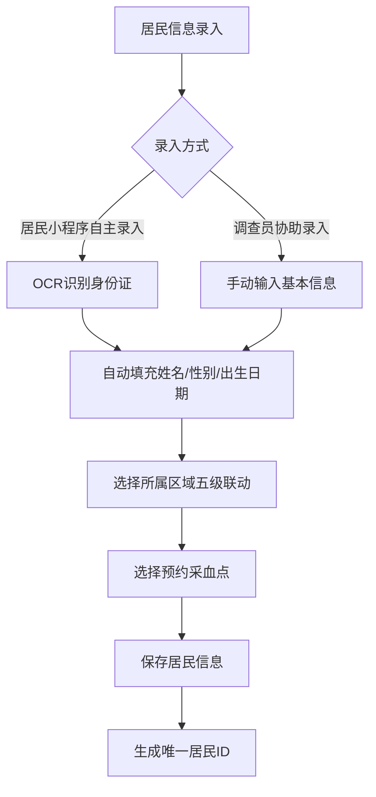
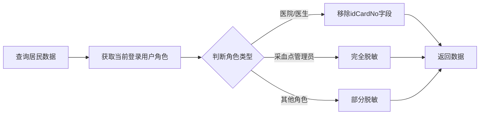
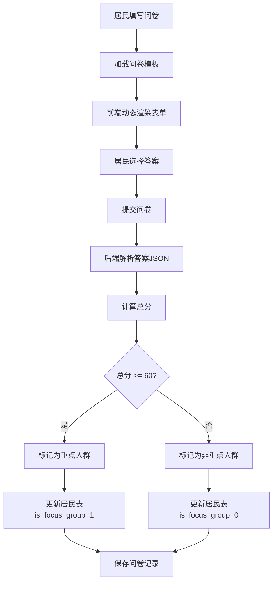
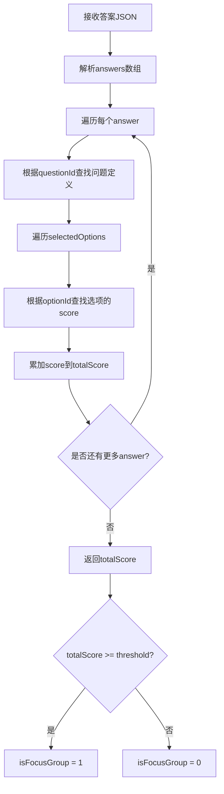
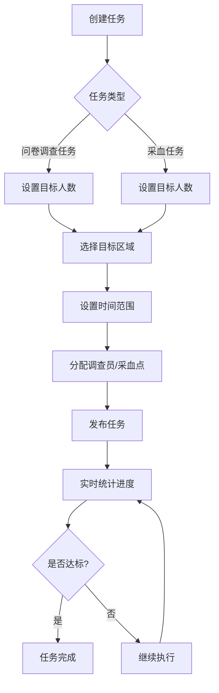

# 濂溪区胃癌筛查信息系统 - 第二阶段核心功能补充设计

## 文档说明

本文档是第二阶段核心功能开发的补充设计文档，专注于居民管理、问卷管理、任务管理三个核心业务模块的详细设计。

**关联文档**: 
- three-level-quiz-system.md（总体设计）
- continue-design-documentation.md（第二阶段基础模块设计）
- gc-project-progress.md（项目进度跟踪）

**前置已完成**:
- 数据库表结构设计与创建
- 行政区划管理模块设计
- 采血点管理模块设计
- 问卷调查员管理模块设计

**本文档涵盖**: 居民管理、问卷管理、任务管理

**预计开发周期**: 3周（15个工作日）

---

## 一、居民管理模块设计

### 1.1 功能概述

居民管理是系统的核心数据模块，负责居民基本信息的录入、查询、修改和导出。本模块的核心特点是实现**字段级权限控制**，确保采血点管理员和第三方医疗机构无法查看居民身份证号，保护个人隐私。

### 1.2 核心业务流程



### 1.3 接口设计

#### 1.3.1 查询居民列表

**接口路径**: GET /api/gc/resident/list

**请求参数**:
| 参数名称 | 参数类型 | 必填 | 说明 |
|---------|---------|-----|------|
| realName | String | 否 | 姓名（模糊查询） |
| idCardNo | String | 否 | 身份证号（精确查询） |
| phoneNumber | String | 否 | 联系电话（精确查询） |
| regionId | Long | 否 | 所属区域ID（任意层级） |
| appointmentSiteId | Long | 否 | 预约采血点ID |
| isFocusGroup | Integer | 否 | 是否重点人群（0否/1是） |
| startDate | Date | 否 | 录入开始日期 |
| endDate | Date | 否 | 录入结束日期 |
| pageNum | Integer | 是 | 页码 |
| pageSize | Integer | 是 | 每页条数 |

**响应数据**:
| 字段名称 | 字段类型 | 说明 |
|---------|---------|------|
| residentId | Long | 居民ID |
| realName | String | 真实姓名 |
| idCardNo | String | 身份证号（脱敏处理） |
| gender | String | 性别 |
| birthDate | Date | 出生日期 |
| age | Integer | 年龄 |
| phoneNumber | String | 联系电话 |
| provinceName | String | 省份 |
| cityName | String | 城市 |
| districtName | String | 区县 |
| streetName | String | 街道/乡镇 |
| communityName | String | 社区/村 |
| appointmentSiteName | String | 预约采血点名称 |
| isFocusGroup | Integer | 是否重点人群 |
| surveyorName | String | 协助录入调查员 |
| createTime | DateTime | 录入时间 |

**数据权限**:
- 超级管理员：查询所有居民
- 区级管理员：仅查询本区居民
- 街道管理员：仅查询本街道居民
- 采血点管理员：仅查询预约本采血点的居民

**字段级权限**:
- 采血点管理员：idCardNo字段返回完全脱敏（如：3***************6）
- 医院/医生角色（预留）：idCardNo字段不返回
- 其他角色：idCardNo字段返回部分脱敏（如：360***********1234）

#### 1.3.2 查询居民详情

**接口路径**: GET /api/gc/resident/{residentId}

**路径参数**:
| 参数名称 | 参数类型 | 必填 | 说明 |
|---------|---------|-----|------|
| residentId | Long | 是 | 居民ID |

**响应数据**: 居民完整信息（字段级权限同列表查询）

**数据权限**: 同列表查询

#### 1.3.3 新增居民

**接口路径**: POST /api/gc/resident

**权限要求**: 所有登录用户（超管、管理员、调查员、居民本人）

**请求参数**:
| 参数名称 | 参数类型 | 必填 | 说明 |
|---------|---------|-----|------|
| realName | String | 是 | 真实姓名 |
| idCardNo | String | 是 | 身份证号（18位） |
| gender | String | 是 | 性别（0男/1女） |
| birthDate | Date | 是 | 出生日期 |
| phoneNumber | String | 是 | 联系电话 |
| provinceId | Long | 是 | 省份ID |
| cityId | Long | 是 | 城市ID |
| districtId | Long | 是 | 区县ID |
| streetId | Long | 是 | 街道/乡镇ID |
| communityId | Long | 是 | 社区/村ID |
| detailAddress | String | 否 | 详细地址 |
| appointmentSiteId | Long | 否 | 预约采血点ID |
| surveyorId | Long | 否 | 协助录入调查员ID |

**响应数据**: 
| 字段名称 | 字段类型 | 说明 |
|---------|---------|------|
| residentId | Long | 新增成功的居民ID |
| message | String | 成功消息 |

**业务规则**:
- 验证身份证号格式（18位，校验码正确）
- 验证身份证号唯一性（同一身份证号不可重复录入）
- 根据身份证号自动解析性别和出生日期，与传入参数对比验证
- 验证手机号格式（11位数字）
- 验证行政区划ID的层级关系正确性
- 如果传入appointmentSiteId，验证采血点属于所选街道
- 如果传入surveyorId，验证调查员属于所选街道
- isFocusGroup默认为0（待问卷评估后更新）
- registrationType设置为居民自主录入或调查员协助录入

#### 1.3.4 编辑居民

**接口路径**: PUT /api/gc/resident

**权限要求**: 超级管理员、区级管理员、街道管理员、调查员（本人录入的）

**请求参数**: 同新增，需包含residentId

**响应数据**: 成功或失败消息

**业务规则**:
- 不允许修改idCardNo（身份证号一旦录入不可修改）
- 区级管理员仅可编辑本区居民
- 街道管理员仅可编辑本街道居民
- 调查员仅可编辑自己协助录入的居民
- 不允许修改isFocusGroup（由问卷评估自动更新）

#### 1.3.5 删除居民

**接口路径**: DELETE /api/gc/resident/{residentId}

**权限要求**: 超级管理员、区级管理员

**路径参数**:
| 参数名称 | 参数类型 | 必填 | 说明 |
|---------|---------|-----|------|
| residentId | Long | 是 | 居民ID |

**响应数据**: 成功或失败消息

**业务规则**:
- 检查是否已填写问卷，存在则不允许删除
- 检查是否已预约采血，存在则不允许删除
- 区级管理员仅可删除本区居民且未填写问卷的
- 物理删除记录

#### 1.3.6 批量导入居民

**接口路径**: POST /api/gc/resident/import

**权限要求**: 超级管理员、区级管理员、街道管理员

**请求参数**:
| 参数名称 | 参数类型 | 必填 | 说明 |
|---------|---------|-----|------|
| file | MultipartFile | 是 | Excel文件 |
| surveyorId | Long | 否 | 协助录入调查员ID |

**响应数据**:
| 字段名称 | 字段类型 | 说明 |
|---------|---------|------|
| successCount | Integer | 成功导入数量 |
| failureCount | Integer | 失败数量 |
| errorMessages | List&lt;String&gt; | 错误信息列表 |

**Excel模板格式**:
| 列名 | 必填 | 说明 |
|-----|-----|------|
| 姓名 | 是 | 真实姓名 |
| 身份证号 | 是 | 18位身份证号 |
| 联系电话 | 是 | 11位手机号 |
| 省份 | 是 | 省级行政区名称 |
| 城市 | 是 | 市级行政区名称 |
| 区县 | 是 | 区县级行政区名称 |
| 街道/乡镇 | 是 | 街道/乡镇名称 |
| 社区/村 | 是 | 社区/村名称 |
| 详细地址 | 否 | 详细地址 |

**业务规则**:
- 逐行解析Excel数据
- 根据行政区名称匹配区划ID
- 验证身份证号唯一性，重复则跳过该行并记录错误
- 自动解析性别和出生日期
- 导入成功后返回成功数量和失败详情

#### 1.3.7 导出居民列表

**接口路径**: POST /api/gc/resident/export

**权限要求**: 超级管理员、区级管理员、街道管理员

**请求参数**: 同查询列表接口

**响应数据**: Excel文件流

**导出字段**:
- 姓名
- 身份证号（根据权限脱敏）
- 性别
- 出生日期
- 年龄
- 联系电话
- 所属区域（省/市/区/街道/社区）
- 详细地址
- 预约采血点
- 是否重点人群
- 协助录入调查员
- 录入时间

**业务规则**:
- 数据权限过滤同列表查询
- 身份证号脱敏规则同列表查询
- 最大导出10000条记录，超出需分批导出

#### 1.3.8 验证身份证号唯一性

**接口路径**: GET /api/gc/resident/checkIdCard

**请求参数**:
| 参数名称 | 参数类型 | 必填 | 说明 |
|---------|---------|-----|------|
| idCardNo | String | 是 | 身份证号 |

**响应数据**:
| 字段名称 | 字段类型 | 说明 |
|---------|---------|------|
| exists | Boolean | 是否已存在 |
| residentId | Long | 如存在，返回居民ID |

**业务规则**:
- 用于居民录入前的实时验证
- 避免重复录入相同身份证号

### 1.4 数据模型

#### 实体类设计

**类名**: GcResident

**字段列表**:
| 字段名称 | 字段类型 | 说明 |
|---------|---------|------|
| residentId | Long | 居民ID（主键） |
| realName | String | 真实姓名 |
| idCardNo | String | 身份证号（唯一） |
| gender | String | 性别（0男/1女） |
| birthDate | Date | 出生日期 |
| phoneNumber | String | 联系电话 |
| provinceId | Long | 省份ID |
| cityId | Long | 城市ID |
| districtId | Long | 区县ID |
| streetId | Long | 街道/乡镇ID |
| communityId | Long | 社区/村ID |
| detailAddress | String | 详细地址 |
| appointmentSiteId | Long | 预约采血点ID |
| surveyorId | Long | 协助录入调查员ID |
| isFocusGroup | Integer | 是否重点人群（0否/1是） |
| registrationType | String | 录入方式（0居民自主/1调查员协助） |

**继承关系**: 继承BaseEntity

#### VO类设计

**ResidentVO**: 居民列表视图对象
| 字段名称 | 字段类型 | 说明 |
|---------|---------|------|
| residentId | Long | 居民ID |
| realName | String | 真实姓名 |
| idCardNo | String | 身份证号（脱敏） |
| gender | String | 性别 |
| birthDate | Date | 出生日期 |
| age | Integer | 年龄（计算） |
| phoneNumber | String | 联系电话 |
| fullRegionName | String | 完整区域名称 |
| appointmentSiteName | String | 预约采血点名称 |
| isFocusGroup | Integer | 是否重点人群 |
| surveyorName | String | 协助录入调查员 |
| createTime | DateTime | 录入时间 |

#### DTO类设计

**ResidentQueryDTO**: 居民查询条件对象
| 字段名称 | 字段类型 | 说明 |
|---------|---------|------|
| realName | String | 姓名（模糊查询） |
| idCardNo | String | 身份证号 |
| phoneNumber | String | 联系电话 |
| regionId | Long | 区域ID |
| appointmentSiteId | Long | 采血点ID |
| isFocusGroup | Integer | 是否重点人群 |
| startDate | Date | 开始日期 |
| endDate | Date | 结束日期 |

**ResidentImportDTO**: 居民导入数据对象
| 字段名称 | 字段类型 | 说明 |
|---------|---------|------|
| realName | String | 姓名 |
| idCardNo | String | 身份证号 |
| phoneNumber | String | 联系电话 |
| provinceName | String | 省份名称 |
| cityName | String | 城市名称 |
| districtName | String | 区县名称 |
| streetName | String | 街道名称 |
| communityName | String | 社区名称 |
| detailAddress | String | 详细地址 |

### 1.5 字段级权限控制实现方案

#### 1.5.1 权限控制策略

**方案选择**: Service层动态脱敏

**实现位置**: GcResidentServiceImpl.desensitizeIdCardNo()方法

**脱敏规则表**:
| 角色 | 脱敏规则 | 示例 |
|-----|---------|------|
| 超级管理员 | 部分脱敏（保留前6位和后4位） | 360***********1234 |
| 区级管理员 | 部分脱敏（保留前6位和后4位） | 360***********1234 |
| 街道管理员 | 部分脱敏（保留前6位和后4位） | 360***********1234 |
| 调查员 | 部分脱敏（保留前6位和后4位） | 360***********1234 |
| 采血点管理员 | 完全脱敏（仅保留首尾） | 3***************6 |
| 医院/医生 | 不返回字段 | null |

#### 1.5.2 实现流程



#### 1.5.3 工具方法设计

**方法签名**: 
```
String desensitizeIdCardNo(String idCardNo, String roleKey)
```

**参数说明**:
- idCardNo: 原始身份证号
- roleKey: 用户角色标识

**返回值**: 脱敏后的身份证号

**脱敏逻辑**:
- roleKey包含"hospital"或"doctor": 返回null
- roleKey包含"sampling_site": 返回首尾脱敏（如3***************6）
- 其他角色: 返回部分脱敏（如360***********1234）

### 1.6 前端交互说明

#### 1.6.1 居民列表页面

**功能要点**:
- 支持多条件组合查询
- 支持分页展示
- 支持批量导出Excel
- 支持查看居民详情
- 支持新增/编辑/删除操作
- 身份证号列根据权限显示脱敏数据

**操作按钮**:
- 新增居民
- 批量导入
- 导出Excel
- 查看详情
- 编辑
- 删除（有限制条件）

#### 1.6.2 居民信息录入表单

**表单分组**:
1. 基本信息：姓名、身份证号、性别、出生日期、联系电话
2. 行政区划：省/市/区/街道/社区（五级联动）
3. 详细地址：街道地址门牌号
4. 采血点选择：下拉选择（可选）
5. 协助录入调查员：下拉选择（可选，仅调查员协助时）

**表单验证**:
- 身份证号格式验证
- 身份证号唯一性验证（实时）
- 手机号格式验证
- 出生日期与身份证号一致性验证
- 性别与身份证号一致性验证

#### 1.6.3 批量导入功能

**交互流程**:
1. 下载Excel模板
2. 填写居民信息
3. 上传Excel文件
4. 后端解析并验证数据
5. 返回导入结果（成功数、失败数、错误详情）
6. 显示导入结果摘要

---

## 二、问卷管理模块设计

### 2.1 功能概述

问卷管理模块负责问卷模板管理和问卷填写记录管理。核心功能包括：
- 问卷模板的创建、编辑、版本管理
- 居民问卷填写（支持JSON动态渲染）
- 问卷答案自动评分
- 重点人群自动判定（评分≥60分）

### 2.2 核心业务流程



### 2.3 接口设计

#### 2.3.1 查询问卷模板列表

**接口路径**: GET /api/gc/questionnaire/template/list

**请求参数**:
| 参数名称 | 参数类型 | 必填 | 说明 |
|---------|---------|-----|------|
| templateName | String | 否 | 模板名称（模糊查询） |
| status | String | 否 | 状态（0正常/1停用） |
| pageNum | Integer | 是 | 页码 |
| pageSize | Integer | 是 | 每页条数 |

**响应数据**:
| 字段名称 | 字段类型 | 说明 |
|---------|---------|------|
| templateId | Long | 模板ID |
| templateName | String | 模板名称 |
| templateCode | String | 模板编码 |
| version | String | 版本号 |
| description | String | 描述 |
| focusGroupThreshold | Integer | 重点人群阈值 |
| status | String | 状态 |
| createTime | DateTime | 创建时间 |

**权限要求**: 超级管理员、区级管理员

#### 2.3.2 查询问卷模板详情

**接口路径**: GET /api/gc/questionnaire/template/{templateId}

**路径参数**:
| 参数名称 | 参数类型 | 必填 | 说明 |
|---------|---------|-----|------|
| templateId | Long | 是 | 模板ID |

**响应数据**:
| 字段名称 | 字段类型 | 说明 |
|---------|---------|------|
| templateId | Long | 模板ID |
| templateName | String | 模板名称 |
| templateCode | String | 模板编码 |
| version | String | 版本号 |
| description | String | 描述 |
| templateContent | JSON | 问卷内容（JSON格式） |
| focusGroupThreshold | Integer | 重点人群阈值 |
| status | String | 状态 |
| createTime | DateTime | 创建时间 |

**权限要求**: 超级管理员、区级管理员

#### 2.3.3 新增问卷模板

**接口路径**: POST /api/gc/questionnaire/template

**权限要求**: 超级管理员

**请求参数**:
| 参数名称 | 参数类型 | 必填 | 说明 |
|---------|---------|-----|------|
| templateName | String | 是 | 模板名称 |
| templateCode | String | 是 | 模板编码（唯一） |
| version | String | 是 | 版本号 |
| description | String | 否 | 描述 |
| templateContent | JSON | 是 | 问卷内容 |
| focusGroupThreshold | Integer | 是 | 重点人群阈值（默认60） |

**响应数据**: 成功或失败消息

**业务规则**:
- 验证templateCode唯一性
- 验证templateContent符合JSON格式
- 验证问卷内容结构正确性
- 状态默认为0（正常）

#### 2.3.4 编辑问卷模板

**接口路径**: PUT /api/gc/questionnaire/template

**权限要求**: 超级管理员

**请求参数**: 同新增，需包含templateId

**响应数据**: 成功或失败消息

**业务规则**:
- 不允许修改templateCode
- 如修改templateContent或focusGroupThreshold，建议创建新版本
- 如已有问卷记录使用该模板，不允许修改评分规则

#### 2.3.5 删除问卷模板

**接口路径**: DELETE /api/gc/questionnaire/template/{templateId}

**权限要求**: 超级管理员

**路径参数**:
| 参数名称 | 参数类型 | 必填 | 说明 |
|---------|---------|-----|------|
| templateId | Long | 是 | 模板ID |

**响应数据**: 成功或失败消息

**业务规则**:
- 检查是否有问卷记录使用该模板，存在则不允许删除
- 物理删除记录

#### 2.3.6 获取有效问卷模板（供填写使用）

**接口路径**: GET /api/gc/questionnaire/template/active

**请求参数**: 无

**响应数据**: 当前有效的问卷模板详情（包含templateContent）

**业务规则**:
- 仅返回status = 0且is_active = 1的模板
- 用于居民端和调查员端加载问卷表单

#### 2.3.7 查询问卷记录列表

**接口路径**: GET /api/gc/questionnaire/record/list

**请求参数**:
| 参数名称 | 参数类型 | 必填 | 说明 |
|---------|---------|-----|------|
| residentName | String | 否 | 居民姓名（模糊查询） |
| idCardNo | String | 否 | 身份证号 |
| regionId | Long | 否 | 所属区域ID |
| isFocusGroup | Integer | 否 | 是否重点人群 |
| startDate | Date | 否 | 填写开始日期 |
| endDate | Date | 否 | 填写结束日期 |
| pageNum | Integer | 是 | 页码 |
| pageSize | Integer | 是 | 每页条数 |

**响应数据**:
| 字段名称 | 字段类型 | 说明 |
|---------|---------|------|
| recordId | Long | 问卷记录ID |
| residentName | String | 居民姓名 |
| idCardNo | String | 身份证号（脱敏） |
| fullRegionName | String | 所属区域 |
| templateName | String | 问卷模板名称 |
| totalScore | Integer | 总分 |
| isFocusGroup | Integer | 是否重点人群 |
| surveyorName | String | 协助填写调查员 |
| fillTime | DateTime | 填写时间 |

**数据权限**:
- 超级管理员：查询所有记录
- 区级管理员：仅查询本区居民的记录
- 街道管理员：仅查询本街道居民的记录
- 调查员：仅查询自己协助填写的记录

**字段级权限**:
- idCardNo字段脱敏规则同居民管理

#### 2.3.8 查询问卷记录详情

**接口路径**: GET /api/gc/questionnaire/record/{recordId}

**路径参数**:
| 参数名称 | 参数类型 | 必填 | 说明 |
|---------|---------|-----|------|
| recordId | Long | 是 | 问卷记录ID |

**响应数据**:
| 字段名称 | 字段类型 | 说明 |
|---------|---------|------|
| recordId | Long | 问卷记录ID |
| residentId | Long | 居民ID |
| residentName | String | 居民姓名 |
| templateId | Long | 模板ID |
| templateName | String | 模板名称 |
| answerContent | JSON | 答案内容（JSON格式） |
| totalScore | Integer | 总分 |
| isFocusGroup | Integer | 是否重点人群 |
| surveyorId | Long | 协助填写调查员ID |
| fillTime | DateTime | 填写时间 |

**数据权限**: 同列表查询

#### 2.3.9 提交问卷

**接口路径**: POST /api/gc/questionnaire/record

**权限要求**: 所有登录用户（居民本人、调查员）

**请求参数**:
| 参数名称 | 参数类型 | 必填 | 说明 |
|---------|---------|-----|------|
| residentId | Long | 是 | 居民ID |
| templateId | Long | 是 | 问卷模板ID |
| answerContent | JSON | 是 | 答案内容（JSON格式） |
| surveyorId | Long | 否 | 协助填写调查员ID |

**响应数据**:
| 字段名称 | 字段类型 | 说明 |
|---------|---------|------|
| recordId | Long | 问卷记录ID |
| totalScore | Integer | 总分 |
| isFocusGroup | Integer | 是否重点人群（0否/1是） |
| message | String | 提示信息 |

**业务规则**:
- 验证residentId存在
- 验证templateId存在且状态正常
- 检查该居民是否已填写问卷，已填写则不允许重复提交
- 解析answerContent，提取所有选中选项的score值
- 计算totalScore = sum(所有选中选项的score)
- 判断isFocusGroup: totalScore >= focusGroupThreshold ? 1 : 0
- 更新gc_resident表的is_focus_group字段
- 保存问卷记录

#### 2.3.10 导出问卷记录

**接口路径**: POST /api/gc/questionnaire/record/export

**权限要求**: 超级管理员、区级管理员、街道管理员

**请求参数**: 同查询列表接口

**响应数据**: Excel文件流

**导出字段**:
- 居民姓名
- 身份证号（脱敏）
- 所属区域
- 问卷模板名称
- 总分
- 是否重点人群
- 协助填写调查员
- 填写时间

**业务规则**:
- 数据权限过滤同列表查询
- 最大导出10000条记录

### 2.4 数据模型

#### 实体类设计

**类名**: GcQuestionnaireTemplate

**字段列表**:
| 字段名称 | 字段类型 | 说明 |
|---------|---------|------|
| templateId | Long | 模板ID（主键） |
| templateName | String | 模板名称 |
| templateCode | String | 模板编码（唯一） |
| version | String | 版本号 |
| description | String | 描述 |
| templateContent | String | 问卷内容（JSON字符串） |
| focusGroupThreshold | Integer | 重点人群阈值 |
| isActive | Integer | 是否启用（0否/1是） |
| status | String | 状态（0正常/1停用） |

**继承关系**: 继承BaseEntity

---

**类名**: GcQuestionnaireRecord

**字段列表**:
| 字段名称 | 字段类型 | 说明 |
|---------|---------|------|
| recordId | Long | 问卷记录ID（主键） |
| residentId | Long | 居民ID |
| templateId | Long | 问卷模板ID |
| answerContent | String | 答案内容（JSON字符串） |
| totalScore | Integer | 总分 |
| isFocusGroup | Integer | 是否重点人群（0否/1是） |
| surveyorId | Long | 协助填写调查员ID |
| fillTime | DateTime | 填写时间 |

**继承关系**: 继承BaseEntity

#### VO类设计

**QuestionnaireRecordVO**: 问卷记录列表视图对象
| 字段名称 | 字段类型 | 说明 |
|---------|---------|------|
| recordId | Long | 问卷记录ID |
| residentName | String | 居民姓名 |
| idCardNo | String | 身份证号（脱敏） |
| fullRegionName | String | 所属区域 |
| templateName | String | 问卷模板名称 |
| totalScore | Integer | 总分 |
| isFocusGroup | Integer | 是否重点人群 |
| surveyorName | String | 协助填写调查员 |
| fillTime | DateTime | 填写时间 |

### 2.5 问卷评分算法设计

#### 2.5.1 问卷模板JSON结构

参考已创建的示例问卷模板（gc_questionnaire_template_sample.sql），问卷JSON结构如下：

```
{
  "sections": [
    {
      "sectionTitle": "基本信息",
      "questions": [
        {
          "questionId": "q1",
          "questionText": "您的年龄是？",
          "questionType": "radio",
          "options": [
            {
              "optionId": "q1_opt1",
              "optionText": "40岁以下",
              "score": 0
            },
            {
              "optionId": "q1_opt2",
              "optionText": "40-49岁",
              "score": 5
            },
            {
              "optionId": "q1_opt3",
              "optionText": "50-59岁",
              "score": 10
            },
            {
              "optionId": "q1_opt4",
              "optionText": "60岁及以上",
              "score": 15
            }
          ]
        }
      ]
    }
  ]
}
```

#### 2.5.2 答案JSON结构

```
{
  "answers": [
    {
      "questionId": "q1",
      "selectedOptions": ["q1_opt3"]
    },
    {
      "questionId": "q2",
      "selectedOptions": ["q2_opt2", "q2_opt3"]
    }
  ]
}
```

#### 2.5.3 评分算法流程



#### 2.5.4 评分算法伪代码

```
calculateScore(templateContent, answerContent):
    totalScore = 0
    
    解析templateContent为JSON对象template
    解析answerContent为JSON对象answer
    
    FOR EACH answerItem IN answer.answers:
        questionId = answerItem.questionId
        selectedOptions = answerItem.selectedOptions
        
        查找template中questionId对应的问题定义question
        
        FOR EACH optionId IN selectedOptions:
            查找question.options中optionId对应的选项option
            totalScore += option.score
    
    RETURN totalScore
```

#### 2.5.5 重点人群判定逻辑

```
判定isFocusGroup:
    IF totalScore >= focusGroupThreshold THEN
        isFocusGroup = 1
    ELSE
        isFocusGroup = 0
    END IF
    
更新居民表:
    UPDATE gc_resident 
    SET is_focus_group = isFocusGroup 
    WHERE resident_id = residentId
```

### 2.6 前端交互说明

#### 2.6.1 问卷填写表单动态渲染

**实现方案**: 前端根据templateContent的JSON结构动态生成表单

**技术选型**: 
- 使用Ant Design Vue的Form组件
- 根据questionType渲染不同表单控件（radio/checkbox/input等）

**交互流程**:
1. 调用获取有效问卷模板接口
2. 解析templateContent的sections和questions
3. 遍历渲染每个section为卡片或分组
4. 遍历渲染每个question为表单项
5. 根据questionType选择合适的控件（Radio/Checkbox/Input）
6. 用户选择答案
7. 提交时构造answerContent的JSON格式
8. 调用提交问卷接口
9. 显示评分结果和是否为重点人群

#### 2.6.2 问卷模板管理页面

**功能要点**:
- 查看问卷模板列表
- 新增问卷模板（支持JSON编辑器）
- 编辑问卷模板
- 启用/停用问卷模板
- 预览问卷模板效果

**JSON编辑器**:
- 使用Monaco Editor或CodeMirror
- 支持JSON格式验证
- 支持语法高亮

#### 2.6.3 问卷记录查看页面

**功能要点**:
- 查询问卷记录列表
- 查看问卷详情（答案回显）
- 导出问卷记录
- 统计重点人群数量和占比

---

## 三、任务管理模块设计

### 3.1 功能概述

任务管理模块负责创建、分配、跟踪问卷调查任务和采血任务。支持按行政区划（区、街道、社区）分配任务，实时统计任务进度，支持多层级数据汇总。

### 3.2 核心业务流程



### 3.3 接口设计

#### 3.3.1 查询任务列表

**接口路径**: GET /api/gc/task/list

**请求参数**:
| 参数名称 | 参数类型 | 必填 | 说明 |
|---------|---------|-----|------|
| taskName | String | 否 | 任务名称（模糊查询） |
| taskType | String | 否 | 任务类型（1问卷/2采血） |
| taskStatus | String | 否 | 任务状态（0草稿/1进行中/2已结束） |
| regionId | Long | 否 | 目标区域ID |
| startDate | Date | 否 | 任务开始日期 |
| endDate | Date | 否 | 任务结束日期 |
| pageNum | Integer | 是 | 页码 |
| pageSize | Integer | 是 | 每页条数 |

**响应数据**:
| 字段名称 | 字段类型 | 说明 |
|---------|---------|------|
| taskId | Long | 任务ID |
| taskName | String | 任务名称 |
| taskCode | String | 任务编号 |
| taskType | String | 任务类型 |
| taskStatus | String | 任务状态 |
| targetRegionName | String | 目标区域名称 |
| targetCount | Integer | 目标人数 |
| completedCount | Integer | 已完成人数 |
| completionRate | BigDecimal | 完成率（%） |
| startDate | Date | 开始日期 |
| endDate | Date | 结束日期 |
| createTime | DateTime | 创建时间 |

**数据权限**:
- 超级管理员：查询所有任务
- 区级管理员：仅查询本区的任务
- 街道管理员：仅查询本街道的任务

#### 3.3.2 查询任务详情

**接口路径**: GET /api/gc/task/{taskId}

**路径参数**:
| 参数名称 | 参数类型 | 必填 | 说明 |
|---------|---------|-----|------|
| taskId | Long | 是 | 任务ID |

**响应数据**:
| 字段名称 | 字段类型 | 说明 |
|---------|---------|------|
| taskId | Long | 任务ID |
| taskName | String | 任务名称 |
| taskCode | String | 任务编号 |
| taskType | String | 任务类型 |
| taskStatus | String | 任务状态 |
| description | String | 任务描述 |
| targetRegionId | Long | 目标区域ID |
| targetRegionName | String | 目标区域名称 |
| targetCount | Integer | 目标人数 |
| completedCount | Integer | 已完成人数 |
| completionRate | BigDecimal | 完成率（%） |
| startDate | Date | 开始日期 |
| endDate | Date | 结束日期 |
| createBy | String | 创建人 |
| createTime | DateTime | 创建时间 |

**数据权限**: 同列表查询

#### 3.3.3 新增任务

**接口路径**: POST /api/gc/task

**权限要求**: 超级管理员、区级管理员

**请求参数**:
| 参数名称 | 参数类型 | 必填 | 说明 |
|---------|---------|-----|------|
| taskName | String | 是 | 任务名称 |
| taskType | String | 是 | 任务类型（1问卷/2采血） |
| description | String | 否 | 任务描述 |
| targetRegionId | Long | 是 | 目标区域ID（区、街道或社区） |
| targetCount | Integer | 是 | 目标人数 |
| startDate | Date | 是 | 开始日期 |
| endDate | Date | 是 | 结束日期 |

**响应数据**:
| 字段名称 | 字段类型 | 说明 |
|---------|---------|------|
| taskId | Long | 任务ID |
| taskCode | String | 任务编号（自动生成） |
| message | String | 成功消息 |

**业务规则**:
- 自动生成taskCode（格式：TASK+年月日+5位序号，如TASK202512150001）
- 验证targetRegionId存在且层级合法（3-5级）
- 验证endDate > startDate
- 验证targetCount > 0
- taskStatus默认为0（草稿）
- completedCount默认为0
- 区级管理员仅可创建本区下属区域的任务

#### 3.3.4 编辑任务

**接口路径**: PUT /api/gc/task

**权限要求**: 超级管理员、区级管理员（创建人）

**请求参数**: 同新增，需包含taskId

**响应数据**: 成功或失败消息

**业务规则**:
- 仅taskStatus = 0（草稿）的任务可编辑
- 不允许修改taskCode和taskType
- 不允许修改targetRegionId（避免统计混乱）
- 区级管理员仅可编辑自己创建的任务

#### 3.3.5 删除任务

**接口路径**: DELETE /api/gc/task/{taskId}

**权限要求**: 超级管理员、区级管理员（创建人）

**路径参数**:
| 参数名称 | 参数类型 | 必填 | 说明 |
|---------|---------|-----|------|
| taskId | Long | 是 | 任务ID |

**响应数据**: 成功或失败消息

**业务规则**:
- 仅taskStatus = 0（草稿）的任务可删除
- 物理删除记录

#### 3.3.6 发布任务

**接口路径**: PUT /api/gc/task/publish/{taskId}

**权限要求**: 超级管理员、区级管理员（创建人）

**路径参数**:
| 参数名称 | 参数类型 | 必填 | 说明 |
|---------|---------|-----|------|
| taskId | Long | 是 | 任务ID |

**响应数据**: 成功或失败消息

**业务规则**:
- 仅taskStatus = 0（草稿）的任务可发布
- 发布后taskStatus = 1（进行中）
- 发布后不可再编辑或删除

#### 3.3.7 结束任务

**接口路径**: PUT /api/gc/task/finish/{taskId}

**权限要求**: 超级管理员、区级管理员（创建人）

**路径参数**:
| 参数名称 | 参数类型 | 必填 | 说明 |
|---------|---------|-----|------|
| taskId | Long | 是 | 任务ID |

**响应数据**: 成功或失败消息

**业务规则**:
- 仅taskStatus = 1（进行中）的任务可结束
- 结束后taskStatus = 2（已结束）

#### 3.3.8 查询任务进度统计

**接口路径**: GET /api/gc/task/progress/{taskId}

**路径参数**:
| 参数名称 | 参数类型 | 必填 | 说明 |
|---------|---------|-----|------|
| taskId | Long | 是 | 任务ID |

**响应数据**:
| 字段名称 | 字段类型 | 说明 |
|---------|---------|------|
| taskId | Long | 任务ID |
| taskName | String | 任务名称 |
| taskType | String | 任务类型 |
| targetRegionName | String | 目标区域名称 |
| targetCount | Integer | 目标人数 |
| completedCount | Integer | 已完成人数 |
| completionRate | BigDecimal | 完成率（%） |
| subRegionProgress | List&lt;SubRegionProgressVO&gt; | 下级区域进度列表 |

**SubRegionProgressVO**:
| 字段名称 | 字段类型 | 说明 |
|---------|---------|------|
| regionId | Long | 区域ID |
| regionName | String | 区域名称 |
| targetCount | Integer | 该区域目标人数 |
| completedCount | Integer | 该区域已完成人数 |
| completionRate | BigDecimal | 完成率（%） |

**业务规则**:
- 根据taskType和targetRegionId统计进度
- 如果targetRegionId为区级（level=3），则统计下属各街道的进度
- 如果targetRegionId为街道级（level=4），则统计下属各社区的进度
- 如果targetRegionId为社区级（level=5），则仅统计该社区进度

#### 3.3.9 查询多层级任务进度汇总

**接口路径**: GET /api/gc/task/summary

**请求参数**:
| 参数名称 | 参数类型 | 必填 | 说明 |
|---------|---------|-----|------|
| regionId | Long | 否 | 区域ID（默认当前用户所属区域） |
| taskType | String | 否 | 任务类型（1问卷/2采血） |
| startDate | Date | 否 | 开始日期 |
| endDate | Date | 否 | 结束日期 |

**响应数据**:
| 字段名称 | 字段类型 | 说明 |
|---------|---------|------|
| regionName | String | 区域名称 |
| totalTargetCount | Integer | 总目标人数 |
| totalCompletedCount | Integer | 总已完成人数 |
| overallCompletionRate | BigDecimal | 总完成率（%） |
| subRegionSummary | List&lt;RegionSummaryVO&gt; | 下级区域汇总列表 |

**RegionSummaryVO**:
| 字段名称 | 字段类型 | 说明 |
|---------|---------|------|
| regionId | Long | 区域ID |
| regionName | String | 区域名称 |
| targetCount | Integer | 目标人数 |
| completedCount | Integer | 已完成人数 |
| completionRate | BigDecimal | 完成率（%） |

**业务规则**:
- 按层级汇总所有任务的进度
- 区级管理员查看本区及下属街道的汇总
- 街道管理员查看本街道及下属社区的汇总
- 支持按时间范围过滤

### 3.4 数据模型

#### 实体类设计

**类名**: GcTask

**字段列表**:
| 字段名称 | 字段类型 | 说明 |
|---------|---------|------|
| taskId | Long | 任务ID（主键） |
| taskName | String | 任务名称 |
| taskCode | String | 任务编号（唯一） |
| taskType | String | 任务类型（1问卷/2采血） |
| taskStatus | String | 任务状态（0草稿/1进行中/2已结束） |
| description | String | 任务描述 |
| targetRegionId | Long | 目标区域ID |
| targetCount | Integer | 目标人数 |
| completedCount | Integer | 已完成人数 |
| startDate | Date | 开始日期 |
| endDate | Date | 结束日期 |

**继承关系**: 继承BaseEntity

#### VO类设计

**TaskProgressVO**: 任务进度视图对象
| 字段名称 | 字段类型 | 说明 |
|---------|---------|------|
| taskId | Long | 任务ID |
| taskName | String | 任务名称 |
| taskType | String | 任务类型 |
| targetRegionName | String | 目标区域名称 |
| targetCount | Integer | 目标人数 |
| completedCount | Integer | 已完成人数 |
| completionRate | BigDecimal | 完成率（%） |
| subRegionProgress | List&lt;SubRegionProgressVO&gt; | 下级区域进度列表 |

**SubRegionProgressVO**: 下级区域进度视图对象
| 字段名称 | 字段类型 | 说明 |
|---------|---------|------|
| regionId | Long | 区域ID |
| regionName | String | 区域名称 |
| targetCount | Integer | 目标人数 |
| completedCount | Integer | 已完成人数 |
| completionRate | BigDecimal | 完成率（%） |

**TaskSummaryVO**: 任务汇总视图对象
| 字段名称 | 字段类型 | 说明 |
|---------|---------|------|
| regionName | String | 区域名称 |
| totalTargetCount | Integer | 总目标人数 |
| totalCompletedCount | Integer | 总已完成人数 |
| overallCompletionRate | BigDecimal | 总完成率（%） |
| subRegionSummary | List&lt;RegionSummaryVO&gt; | 下级区域汇总列表 |

### 3.5 进度统计算法设计

#### 3.5.1 问卷调查任务进度统计

**统计来源**: gc_questionnaire_record表

**统计逻辑**:
```
统计指定区域的问卷完成数量:
    SELECT COUNT(*) AS completedCount
    FROM gc_questionnaire_record qr
    JOIN gc_resident r ON qr.resident_id = r.resident_id
    WHERE r.district_id = targetRegionId (如果是区级任务)
       OR r.street_id = targetRegionId (如果是街道级任务)
       OR r.community_id = targetRegionId (如果是社区级任务)
       AND qr.fill_time BETWEEN task.startDate AND task.endDate
```

**完成率计算**:
```
completionRate = (completedCount / targetCount) * 100
```

#### 3.5.2 采血任务进度统计

**统计来源**: gc_blood_appointment表

**统计逻辑**:
```
统计指定区域的采血完成数量:
    SELECT COUNT(*) AS completedCount
    FROM gc_blood_appointment ba
    JOIN gc_resident r ON ba.resident_id = r.resident_id
    WHERE r.district_id = targetRegionId (如果是区级任务)
       OR r.street_id = targetRegionId (如果是街道级任务)
       OR r.community_id = targetRegionId (如果是社区级任务)
       AND ba.sampling_status = 1 (已采样)
       AND ba.appointment_date BETWEEN task.startDate AND task.endDate
```

#### 3.5.3 多层级进度汇总

**场景**: 区级管理员查看各街道的进度

**汇总逻辑**:
```
查询区级下属所有街道:
    SELECT region_id, region_name 
    FROM gc_region 
    WHERE parent_id = districtId AND region_level = 4
    
FOR EACH 街道:
    统计该街道的completedCount
    计算completionRate
    添加到subRegionProgress列表
    
汇总总计:
    totalTargetCount = SUM(各街道的targetCount)
    totalCompletedCount = SUM(各街道的completedCount)
    overallCompletionRate = (totalCompletedCount / totalTargetCount) * 100
```

### 3.6 前端交互说明

#### 3.6.1 任务列表页面

**功能要点**:
- 支持多条件查询
- 支持分页展示
- 支持查看任务详情
- 支持新增/编辑/删除任务
- 支持发布/结束任务
- 显示任务进度条

**操作按钮**:
- 新增任务
- 查看详情
- 编辑（仅草稿状态）
- 删除（仅草稿状态）
- 发布（仅草稿状态）
- 结束（仅进行中状态）

#### 3.6.2 任务进度统计页面

**展示形式**:
- 使用进度条展示整体完成率
- 使用表格展示下级区域进度明细
- 使用图表展示进度趋势（可选）

**实时刷新**:
- 支持手动刷新
- 可配置自动刷新间隔

#### 3.6.3 任务汇总看板

**展示形式**:
- 卡片式展示总体指标（总目标、总完成、完成率）
- 使用柱状图或饼图展示各区域完成情况对比
- 使用表格展示详细数据

**数据钻取**:
- 点击区域可下钻查看下级区域详情

---

## 四、开发排期规划

### 4.1 第一周：居民管理模块

**工作日1-2**: 后端开发
- 创建GcResident实体类、VO类、DTO类
- 创建GcResidentMapper接口和XML
- 创建GcResidentService和实现类
- 实现字段级权限控制工具方法
- 创建GcResidentController

**工作日3**: 后端开发（续）
- 实现批量导入功能
- 实现导出功能
- 编写单元测试

**工作日4-5**: 前端开发
- 开发居民列表页面
- 开发居民信息录入表单（含五级联动）
- 开发批量导入功能
- 开发导出功能
- 联调测试

### 4.2 第二周：问卷管理模块

**工作日1-2**: 后端开发
- 创建GcQuestionnaireTemplate和GcQuestionnaireRecord实体类
- 创建Mapper接口和XML
- 创建Service和实现类
- 实现问卷评分算法
- 实现重点人群判定逻辑
- 创建Controller

**工作日3**: 后端开发（续）
- 实现问卷记录导出功能
- 编写单元测试

**工作日4-5**: 前端开发
- 开发问卷模板管理页面（含JSON编辑器）
- 开发问卷填写页面（动态渲染）
- 开发问卷记录查看页面
- 联调测试

### 4.3 第三周：任务管理模块

**工作日1-2**: 后端开发
- 创建GcTask实体类、VO类、DTO类
- 创建GcTaskMapper接口和XML
- 创建GcTaskService和实现类
- 实现进度统计算法
- 实现多层级汇总算法
- 创建GcTaskController

**工作日3**: 后端开发（续）
- 编写单元测试
- 性能优化（SQL优化、索引验证）

**工作日4-5**: 前端开发
- 开发任务列表页面
- 开发任务创建/编辑页面
- 开发任务进度统计页面
- 开发任务汇总看板
- 联调测试

---

## 五、技术要点与注意事项

### 5.1 字段级权限控制

**实现关键点**:
- 在Service层的查询方法中统一调用脱敏方法
- 根据当前登录用户的角色动态脱敏
- 确保所有查询接口（列表、详情、导出）都应用脱敏规则

**测试要点**:
- 不同角色查询同一居民，身份证号脱敏程度不同
- 导出Excel时身份证号正确脱敏
- 采血点管理员无法通过接口获取完整身份证号

### 5.2 问卷评分算法

**实现关键点**:
- JSON解析的异常处理
- 问卷模板和答案结构的验证
- 评分逻辑的准确性
- 重点人群阈值的灵活配置

**测试要点**:
- 不同答案组合的评分正确性
- 边界值测试（如总分刚好60分）
- 问卷模板变更后对历史记录的影响

### 5.3 多层级进度统计

**实现关键点**:
- 行政区划层级关系的正确处理
- SQL性能优化（避免N+1查询）
- 数据汇总的准确性
- 完成率的精度控制（保留2位小数）

**测试要点**:
- 不同层级区域的进度统计正确性
- 跨时间范围的进度统计
- 大数据量下的查询性能

### 5.4 数据权限控制

**实现关键点**:
- 在Service层方法上添加数据权限注解
- 根据用户角色自动添加WHERE条件
- 确保所有查询、修改、删除操作都应用权限控制

**测试要点**:
- 区级管理员无法查看其他区的数据
- 街道管理员无法查看其他街道的数据
- 采血点管理员无法查看其他采血点的数据

---

## 六、质量保证

### 6.1 单元测试要求

**覆盖范围**:
- 所有Service层的核心业务方法
- 字段级权限控制方法
- 问卷评分算法
- 进度统计算法

**测试覆盖率目标**: ≥ 80%

### 6.2 接口测试要求

**测试工具**: Postman或Apifox

**测试内容**:
- 所有Controller接口的正常流程
- 参数验证和异常处理
- 数据权限和字段级权限
- 批量操作和导出功能

### 6.3 性能测试要求

**测试场景**:
- 居民列表查询（10000条数据）
- 问卷记录列表查询（10000条数据）
- 任务进度统计（100个街道）
- 导出Excel（10000条数据）

**性能指标**:
- 列表查询响应时间 < 500ms
- 问卷提交响应时间 < 1s
- 导出Excel响应时间 < 5s

---

## 七、风险管理

### 7.1 技术风险

| 风险项 | 影响程度 | 应对措施 |
|-------|---------|---------|
| 字段级权限控制实现复杂 | 中 | 详细设计和充分测试，覆盖所有角色 |
| 问卷评分算法准确性 | 高 | 编写详细单元测试，覆盖各种答案组合 |
| 多层级统计SQL性能 | 中 | 使用索引优化，必要时使用缓存 |
| 批量导入数据验证 | 中 | 逐行验证并记录错误，提供详细反馈 |

### 7.2 业务风险

| 风险项 | 影响程度 | 应对措施 |
|-------|---------|---------|
| 重点人群判定规则变更 | 低 | 问卷模板支持版本管理，阈值可配置 |
| 居民重复录入 | 中 | 身份证号唯一索引，实时验证 |
| 任务进度统计不准确 | 高 | 定时任务同步更新，手动刷新功能 |

---

## 八、后续计划

完成本文档涉及的三个核心模块后，进入第三阶段：

1. 采血预约管理
2. 第三方系统对接
3. 采样状态管理

这些内容将在后续阶段设计文档中详细说明。
