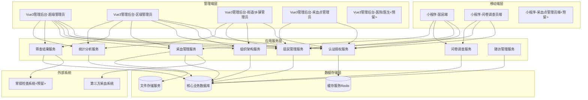
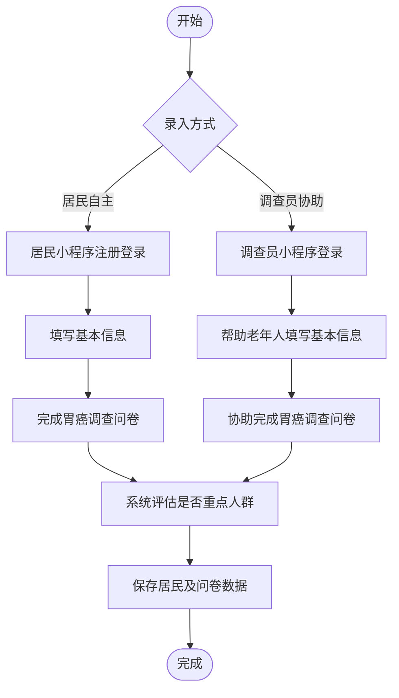
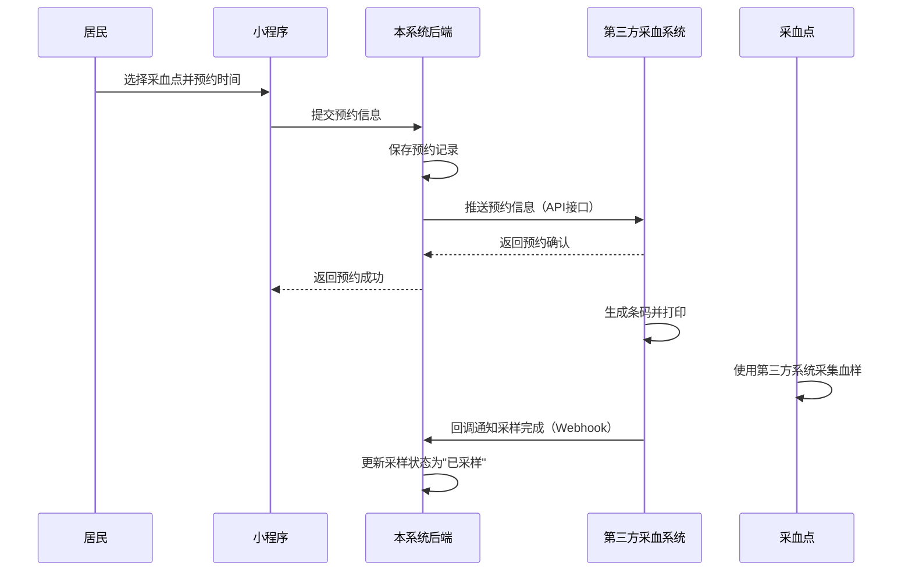
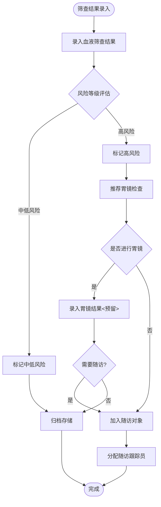

# 濂溪区胃癌筛查信息系统设计文档

## 一、系统概述

### 1.1 业务背景

本系统为九江市濂溪区胃癌早期筛查民生项目的信息化管理平台，支持从问卷调查、采血筛查、胃镜检查到随访管理的全流程业务。系统需满足居民通过小程序自主录入、问卷调查员现场协助、多级管理员任务分配与进度监控、采血点管理、筛查结果管理等核心需求。

### 1.2 系统定位

基于现有项目架构（bear-jia-vue3管理后台、bearjia-admin-backend后端服务、h5 uni-app移动端），新增胃癌筛查业务模块，形成完整的"居民录入-问卷调查-采血预约-筛查结果-随访管理"闭环。系统架构支持全国行政区划扩展，当前实施范围为濂溪区及其下属街道/乡镇和社区/村。

### 1.3 核心目标

- 支持全国省市区街道社区五级行政区划架构，导入国家标准行政区划数据，当前聚焦濂溪区-街道/乡镇-采血点三级管理
- 提供小程序端居民自主录入（支持身份证OCR识别）与问卷调查员协助录入能力
- 通过标准化API接口与第三方采血系统对接，实现采血预约、条码管理、采样状态同步
- 支持问卷及采血任务量分配与进度跟踪
- 实现筛查结果查询、统计分析与随访对象管理
- 按角色精准控制数据权限（如采血点管理员不可查看身份证号）
- 预留胃镜筛查结果维护与医院对接接口

### 1.4 技术架构基础

- 前端管理后台：Vue3 + Vite + Ant Design Vue + Pinia
- 移动端：uni-app + Vue3（支持微信小程序、H5）
- 后端服务：Java + Spring Boot + Maven
- 数据库：MySQL关系型数据库
- 认证授权：基于现有Spring Security + JWT体系

---

## 二、系统架构设计

### 2.1 整体架构图



### 2.2 分层职责说明

#### 移动端层职责
- 居民端：注册登录、个人信息录入、问卷填写、采血点预约、筛查结果查询
- 问卷调查员端：登录认证、协助老年人录入、问卷在线/离线填写、任务进度查看
- 采血点管理员端（预留）：采样状态管理、条码扫描确认

#### 管理端层职责
- 超级管理员：全局数据查看、所有功能权限、系统配置管理
- 区级管理员：本区数据查看、任务分配、采血点管理、问卷调查员管理、居民管理、筛查结果管理
- 街道/乡镇管理员：本辖区数据查看、问卷调查员管理、进度查询
- 采血点管理员：本采血点数据查看、采样状态管理、居民列表查看（不含身份证号）
- 医院/医生（预留）：胃镜筛查结果维护、随访对象管理

#### 应用服务层职责
- 认证授权服务：多角色权限控制、JWT令牌管理、数据权限过滤
- 组织架构服务：五级行政区划管理、采血点管理、问卷调查员管理
- 居民管理服务：居民信息录入、编辑、查询、身份证号权限控制
- 问卷调查服务：问卷模板管理、问卷数据采集、重点人群标记
- 采血管理服务：采血预约信息推送、采样状态同步、与第三方采血系统数据对接
- 筛查结果服务：血液筛查结果录入、胃镜结果维护（预留）、风险等级评估
- 统计分析服务：任务进度统计（问卷/采血）、筛查结果统计、随访对象统计
- 随访管理服务：随访对象名单管理、随访跟踪员分配

---

## 三、核心业务流程

### 3.1 居民录入与问卷调查流程



### 3.2 采血预约与采样流程



### 3.3 筛查结果管理流程



---

## 四、功能模块设计

### 4.1 行政区划管理模块

#### 4.1.1 全国行政区划数据导入

**功能描述**  
系统初始化时，导入国家标准的全国行政区划SQL数据，包括省、市、区/县、街道/乡镇、社区/村五级行政区划信息。

**数据来源**
- 使用民政部公布的最新行政区划代码（GB/T 2260）
- 或采用国家统计局发布的最新统计用区划代码和城乡划分代码
- 推荐使用开源数据库：https://github.com/modood/Administrative-divisions-of-China

**导入方式**
- 方式一：执行预置的SQL脚本文件，直接导入到gc_region表
- 方式二：通过管理后台提供导入功能，上传Excel或CSV文件

**数据结构映射**

| 原始数据字段 | 映射到gc_region表 | 说明 |
|--------------|------------------|------|
| 行政区划代码 | region_code | 12位国标代码 |
| 名称 | region_name | 行政区划名称 |
| 级别 | region_level | 1省/2市/3区/4街道/5社区 |
| 父级代码 | parent_id | 根据父级代码查找对应region_id |

**导入逻辑**
- 按级别从省到社区顺序导入，确保父级记录已存在
- 对于同一行政区划代码，若已存在则跳过或更新
- 初始化时所有区划status默认为0（正常）
- sort_order按行政区划代码顺序生成

**示例SQL脚本结构**

```sql
-- 省级数据示例
INSERT INTO gc_region (region_id, region_name, region_code, region_level, parent_id, status, sort_order, create_by, create_time)
VALUES (1, '江西省', '360000', 1, NULL, '0', 1, 'system', NOW());

-- 市级数据示例
INSERT INTO gc_region (region_id, region_name, region_code, region_level, parent_id, status, sort_order, create_by, create_time)
VALUES (101, '九江市', '360400', 2, 1, '0', 1, 'system', NOW());

-- 区级数据示例
INSERT INTO gc_region (region_id, region_name, region_code, region_level, parent_id, status, sort_order, create_by, create_time)
VALUES (10101, '濂溪区', '360403', 3, 101, '0', 1, 'system', NOW());

-- 街道/乡镇数据示例
INSERT INTO gc_region (region_id, region_name, region_code, region_level, parent_id, status, sort_order, create_by, create_time)
VALUES (1010101, '十里街道', '360403001', 4, 10101, '0', 1, 'system', NOW());
```

**后期维护**
- 支持管理员手动新增/编辑/删除区划（用于补充社区/村级别数据）
- 定期更新全国行政区划数据（建议每年一次）

#### 4.1.2 行政区划查询与管理

**功能描述**  
支持按级别、名称查询行政区划，展示树形结构。

**查询接口**
- 获取省列表：GET /api/gc/region/provinces
- 获取市列表：GET /api/gc/region/cities?provinceId={provinceId}
- 获取区列表：GET /api/gc/region/districts?cityId={cityId}
- 获取街道列表：GET /api/gc/region/streets?districtId={districtId}
- 获取树形结构：GET /api/gc/region/tree?rootId={rootId}

---

### 4.2 居民管理模块

#### 4.2.1 居民信息录入（支持身份证OCR识别）

**功能描述**  
支持居民通过小程序自主录入或问卷调查员协助老年人录入。小程序集成身份证OCR识别功能，自动提取姓名、身份证号、出生日期等信息。

**OCR识别实现方案**

方案一：微信小程序插件市场
- 插件名称：身份证识别、OCR识别等
- 推荐插件：
  - 腾讯云身份证OCR：plugin://wx3c042630f3cdc175/idcard-ocr
  - 阿里云文字识别：plugin://wx4418e3e031e551be/ocr
- 集成方式：在app.json中声明插件，页面中调用插件方法

方案二：微信小程序OCR API
- 使用wx.chooseImage选择身份证照片
- 调用wx.uploadFile上传到后端服务器
- 后端调用第三方OCR服务（腾讯云/阿里云/百度AI）
- 返回识别结果到小程序前端

**推荐方案：使用微信小程序插件市场**

**插件集成步骤**

1. 在小程序app.json中声明插件：
```json
{
  "plugins": {
    "ocr": {
      "version": "1.0.0",
      "provider": "wx3c042630f3cdc175"
    }
  }
}
```

2. 在页面中引入插件组件：
```json
{
  "usingComponents": {
    "ocr-navigator": "plugin://ocr/idcard-ocr"
  }
}
```

3. 页面中使用组件：
```html
<ocr-navigator 
  bind:success="onOcrSuccess" 
  bind:fail="onOcrFail">
  <button>扫描身份证</button>
</ocr-navigator>
```

4. 处理识别结果：
```javascript
onOcrSuccess(e) {
  const result = e.detail;
  // result包含：
  // - name: 姓名
  // - idCardNumber: 身份证号
  // - gender: 性别
  // - nation: 民族
  // - birthday: 出生日期
  // - address: 住址
  
  this.setData({
    'formData.name': result.name,
    'formData.idCardNo': result.idCardNumber,
    'formData.gender': result.gender === '男' ? '0' : '1',
    'formData.birthDate': result.birthday,
    'formData.address': result.address
  });
}
```

**OCR识别后的数据处理**
- 自动填充表单字段
- 支持手动编辑修正
- 根据身份证号自动提取：
  - 出生日期：第7-14位
  - 性别：第17位（奇数男、偶数女）
  - 年龄：根据出生日期计算

**居民基本信息数据结构**

| 字段名称 | 字段类型 | 必填 | 说明 | 数据权限 |
|---------|---------|-----|------|---------|
| residentId | Long | - | 居民ID | 所有角色 |
| name | String | 是 | 姓名 | 所有角色 |
| age | Integer | 是 | 年龄 | 所有角色 |
| gender | String | 是 | 性别（男/女） | 所有角色 |
| idCardNo | String | 是 | 身份证号 | 超级、区级、街道管理员可查看 |
| address | String | 是 | 住址（精确到社区/村） | 所有角色 |
| province | String | 是 | 省份 | 所有角色 |
| city | String | 是 | 城市 | 所有角色 |
| district | String | 是 | 区县 | 所有角色 |
| street | String | 是 | 街道/乡镇 | 所有角色 |
| community | String | 是 | 社区/村 | 所有角色 |
| contactPhone | String | 是 | 联系方式 | 所有角色 |
| isFocusGroup | Boolean | - | 是否重点人群 | 所有角色 |
| surveyorId | Long | - | 问卷调查员ID | 所有角色 |
| appointmentSite | String | - | 预约采样点 | 所有角色 |
| appointmentTime | DateTime | - | 预约采样时间 | 所有角色 |
| samplingStatus | String | - | 采样状态（未采样/已采样） | 所有角色 |
| createTime | DateTime | - | 创建时间 | 所有角色 |

**业务规则**
- 身份证号唯一性校验，不可重复录入
- 居民录入后自动关联到所属街道/社区
- 若未选择采样点，默认为住址所在采样点
- 问卷调查员协助录入时，自动记录调查员信息

**数据权限控制**
- 采血点管理员查看居民列表时，身份证号字段返回空或脱敏
- 医院/医生查看居民详情时，身份证号字段返回空或脱敏
- 其他角色可查看完整身份证号

#### 4.2.2 居民信息编辑

**功能描述**  
支持管理员编辑居民基本信息，医生可增加胃镜筛查信息（预留）。

**编辑权限控制**

| 操作 | 超级管理员 | 区级管理员 | 街道/乡镇管理员 | 采血点管理员 | 医院/医生 |
|-----|-----------|-----------|---------------|------------|----------|
| 编辑基本信息 | √ | √ | × | × | √（预留增加胃镜信息） |
| 删除居民 | √ | √ | × | × | × |

#### 4.2.3 居民列表查询

**功能描述**  
支持按姓名、年龄、性别、住址、筛查结果等条件模糊搜索居民。

**查询条件**
- 姓名：支持模糊搜索
- 年龄范围：最小年龄-最大年龄
- 性别：男/女
- 住址：省/市/区/街道/社区多级联动
- 问卷结果：重点人群/非重点人群
- 采样状态：未采样/已采样
- 血液筛查结果：未检测/中低风险/高风险

**数据权限过滤**
- 超级管理员：查看所有居民
- 区级管理员：仅查看本区居民
- 街道/乡镇管理员：仅查看本辖区居民
- 采血点管理员：仅查看预约本采血点的居民

---

### 4.3 问卷调查模块

#### 4.2.1 胃癌调查问卷设计

**功能描述**  
基于动态问卷模板，居民或调查员填写胃癌风险评估问卷，系统自动判断是否为重点人群。

**问卷模板数据结构**

| 字段名称 | 字段类型 | 说明 |
|---------|---------|------|
| templateId | Long | 模板ID |
| templateName | String | 模板名称（如"濂溪区胃癌筛查问卷V1.0"） |
| version | String | 版本号 |
| sections | Array | 问卷分节 |

**常见问卷题目类型**
- 既往病史：是否有胃溃疡、萎缩性胃炎、胃息肉等
- 家族史：直系亲属是否有胃癌病史
- 生活习惯：吸烟、饮酒、饮食偏好
- 症状：腹痛、消化不良、体重下降等

**重点人群判定规则**  
根据问卷答案中的风险因素累计评分，达到阈值则标记为重点人群。具体规则由业务方提供。

#### 4.2.2 问卷数据采集

**功能描述**  
支持居民小程序端自主填写或问卷调查员协助填写。

**问卷答案数据结构**

| 字段名称 | 字段类型 | 说明 |
|---------|---------|------|
| questionnaireId | Long | 问卷记录ID |
| residentId | Long | 居民ID |
| templateId | Long | 模板ID |
| surveyorId | Long | 调查员ID（协助填写时） |
| answers | JSON | 问卷答案（JSON格式） |
| isFocusGroup | Boolean | 是否重点人群 |
| riskScore | Integer | 风险评分 |
| submitTime | DateTime | 提交时间 |
| createSource | String | 创建来源（居民自填/调查员协助） |

**离线填写支持**  
问卷调查员端支持离线填写，数据暂存本地，待网络恢复后自动同步。

---

### 4.4 问卷及采血任务管理模块

#### 4.3.1 任务量分配

**功能描述**  
超级管理员或区级管理员向各街道/乡镇分配问卷调查和采血筛查任务量。

**任务分配数据结构**

| 字段名称 | 字段类型 | 说明 |
|---------|---------|------|
| taskId | Long | 任务ID |
| taskName | String | 任务名称 |
| taskType | String | 任务类型（questionnaire问卷/blood采血） |
| regionId | Long | 分配区域ID（街道/乡镇） |
| targetCount | Integer | 目标数量 |
| startTime | DateTime | 开始时间 |
| endTime | DateTime | 结束时间 |
| description | String | 任务说明 |
| status | String | 任务状态（草稿/进行中/已结束） |
| createBy | String | 创建人 |
| createTime | DateTime | 创建时间 |

**分配权限**
- 超级管理员：可向任意区域分配任务
- 区级管理员：仅可向本区下属街道/乡镇分配任务

#### 4.3.2 任务进度查询

**功能描述**  
多层级展示任务进度，区级以上呈现街道/乡镇汇总，街道/乡镇级呈现社区/村明细。

**区级进度查询表单**

| 字段名称 | 字段类型 | 说明 |
|---------|---------|------|
| regionName | String | 街道/乡镇名称 |
| questionnaireTarget | Integer | 问卷任务量 |
| questionnaireCompleted | Integer | 问卷已完成量 |
| bloodTarget | Integer | 血液筛查任务量 |
| bloodCompleted | Integer | 血液筛查完成量 |
| completionRate | Decimal | 完成率（%） |

**街道/乡镇级进度查询表单**

| 字段名称 | 字段类型 | 说明 |
|---------|---------|------|
| communityName | String | 社区/村名称 |
| questionnaireTarget | Integer | 问卷任务量 |
| questionnaireCompleted | Integer | 问卷已完成量 |
| bloodTarget | Integer | 血液筛查任务量 |
| bloodCompleted | Integer | 血液筛查完成量 |
| completionRate | Decimal | 完成率（%） |

**数据权限**
- 超级管理员和区级管理员：查看全区所有街道/乡镇进度
- 街道/乡镇管理员：仅查看本辖区社区/村进度

---

### 4.5 采血点管理模块

#### 4.4.1 采血点信息管理

**功能描述**  
管理采血点基本信息，包括名称、位置、负责人、联系方式等。

**采血点数据结构**

| 字段名称 | 字段类型 | 说明 |
|---------|---------|------|
| siteId | Long | 采血点ID |
| siteName | String | 采血点名称 |
| regionId | Long | 所属区域ID（街道/乡镇） |
| address | String | 详细地址 |
| streetManagerId | Long | 街道/乡镇管理员ID |
| streetManagerName | String | 街道/乡镇管理员姓名 |
| streetManagerPhone | String | 街道/乡镇管理员联系方式 |
| siteManagerId | Long | 采血点管理员ID |
| siteManagerName | String | 采血点管理员姓名 |
| siteManagerPhone | String | 采血点管理员联系方式 |
| status | String | 状态（正常/停用） |
| createBy | String | 创建人 |
| createTime | DateTime | 创建时间 |

**管理权限**

| 操作 | 超级管理员 | 区级管理员 | 街道/乡镇管理员 | 采血点管理员 |
|-----|-----------|-----------|---------------|------------|
| 查看所有采血点 | √ | √（仅本区） | √（仅本辖区） | × |
| 新增采血点 | √ | √ | × | × |
| 删除采血点 | √ | √ | × | × |
| 编辑采血点 | √ | √ | × | × |

#### 4.5.2 采血预约管理（与第三方系统对接）

**功能描述**  
居民在小程序端选择采血点并预约采样时间，本系统保存预约记录并通过API接口推送给第三方采血系统。

**采血预约数据结构**

| 字段名称 | 字段类型 | 说明 |
|---------|---------|----- |
| appointmentId | Long | 预约ID |
| residentId | Long | 居民ID |
| siteId | Long | 采血点ID |
| appointmentTime | DateTime | 预约时间 |
| appointmentStatus | String | 预约状态（已预约/已取消/已完成） |
| thirdSystemId | String | 第三方系统预约ID |
| pushStatus | String | 推送状态（待推送/推送中/已推送/推送失败） |
| pushTime | DateTime | 推送时间 |
| createTime | DateTime | 创建时间 |

**业务规则**
- 居民可修改或取消预约，但需提前24小时
- 同一居民同一天仅可预约一次
- 预约满额时提示选择其他时间段
- 预约成功后立即推送给第三方采血系统

#### 4.5.3 与第三方采血系统对接接口

**接口设计原则**
- 采用RESTful风格，使用HTTPS协议
- 使用JSON格式进行数据交换
- 实现接口幂等性，支持重复调用
- 提供完整的错误码和错误描述

**接口一：推送采血预约信息**

接口路径：POST /api/external/blood/appointment

请求参数：

| 字段名称 | 字段类型 | 必填 | 说明 |
|---------|---------|----- |------|
| appointmentId | String | 是 | 本系统预约ID |
| residentName | String | 是 | 居民姓名 |
| idCardNo | String | 是 | 身份证号 |
| gender | String | 是 | 性别 |
| age | Integer | 是 | 年龄 |
| contactPhone | String | 是 | 联系电话 |
| siteCode | String | 是 | 采血点编码 |
| siteName | String | 是 | 采血点名称 |
| appointmentTime | String | 是 | 预约时间(ISO8601格式) |

响应参数：

| 字段名称 | 字段类型 | 说明 |
|---------|---------|----- |
| code | Integer | 响应码(200成功) |
| message | String | 响应消息 |
| data | Object | 响应数据 |
| data.thirdSystemId | String | 第三方系统生成的预约ID |
| data.barcodeNumber | String | 第三方系统生成的条码编号 |
| requestId | String | 请求追踪ID |

**接口二：接收采样状态回调通知**

接口路径：POST /api/gc/blood/callback/sampling-status

请求参数（由第三方系统推送）：

| 字段名称 | 字段类型 | 必填 | 说明 |
|---------|---------|----- |------|
| thirdSystemId | String | 是 | 第三方系统预约ID |
| appointmentId | String | 是 | 本系统预约ID |
| barcodeNumber | String | 是 | 条码编号 |
| samplingStatus | String | 是 | 采样状态(sampled/cancelled) |
| samplingTime | String | 是 | 采样时间 |
| operatorName | String | 否 | 操作人姓名 |

响应参数：

| 字段名称 | 字段类型 | 说明 |
|---------|---------|----- |
| code | Integer | 响应码(200成功) |
| message | String | 响应消息 |
| requestId | String | 请求追踪ID |

**错误码定义**

| 错误码 | 说明 | 处理建议 |
|-------|------|---------|
| 200 | 成功 | - |
| 400 | 请求参数错误 | 检查请求参数格式 |
| 401 | 认证失败 | 检查API Key和签名 |
| 500 | 服务器内部错误 | 稍后重试 |
| 1001 | 预约ID重复 | 检查是否重复推送 |
| 1002 | 采血点不存在 | 检查采血点编码 |
| 1003 | 预约时间已满 | 选择其他时间段 |

**推送重试机制**

- 首次推送失败后，等待30秒进行第二次尝试
- 第二次失败后，等待60秒进行第三次尝试
- 三次均失败，标记为推送失败，通知管理员手动处理
- 支持管理员在后台手动触发重新推送

**推送日志记录**

| 字段名称 | 字段类型 | 说明 |
|---------|---------|----- |
| logId | Long | 日志ID |
| appointmentId | Long | 预约ID |
| requestUrl | String | 请求URL |
| requestBody | Text | 请求体(JSON) |
| responseCode | Integer | 响应码 |
| responseBody | Text | 响应体(JSON) |
| pushStatus | String | 推送状态 |
| retryTimes | Integer | 重试次数 |
| pushTime | DateTime | 推送时间 |
| costTime | Integer | 耗时(毫秒) |

---

### 4.6 问卷调查员管理模块

#### 4.5.1 问卷调查员信息管理

**功能描述**  
管理问卷调查员基本信息，包括姓名、性别、所属区域、联系方式等。

**问卷调查员数据结构**

| 字段名称 | 字段类型 | 说明 |
|---------|---------|------|
| surveyorId | Long | 调查员ID |
| userId | Long | 关联用户表ID |
| realName | String | 真实姓名 |
| gender | String | 性别（男/女） |
| regionId | Long | 所属街道/乡镇ID |
| streetManagerId | Long | 街道/乡镇管理员ID |
| streetManagerPhone | String | 街道/乡镇管理员联系方式 |
| phoneNumber | String | 调查员联系方式 |
| status | String | 状态（正常/停用） |
| createBy | String | 创建人 |
| createTime | DateTime | 创建时间 |

**管理权限**

| 操作 | 超级管理员 | 区级管理员 | 街道/乡镇管理员 | 采血点管理员 |
|-----|-----------|-----------|---------------|------------|
| 查看所有调查员 | √ | √（仅本区） | √（仅本辖区） | × |
| 新增调查员 | √ | √ | √ | × |
| 删除调查员 | √ | √ | √ | × |
| 编辑调查员 | √ | √ | √ | × |

#### 4.5.2 调查员绩效统计

**功能描述**  
统计每个调查员协助录入的居民数量、问卷完成数量等绩效指标。

**调查员绩效数据结构**

| 字段名称 | 字段类型 | 说明 |
|---------|---------|------|
| surveyorId | Long | 调查员ID |
| surveyorName | String | 调查员姓名 |
| regionName | String | 所属街道/乡镇 |
| residentCount | Integer | 协助录入居民数 |
| questionnaireCount | Integer | 问卷完成数 |
| focusGroupCount | Integer | 重点人群数 |

---

### 4.7 筛查结果管理模块

#### 4.6.1 筛查结果查询

**功能描述**  
管理员查询居民的血液筛查结果和胃镜筛查结果（预留）。

**筛查结果数据结构**

| 字段名称 | 字段类型 | 说明 |
|---------|---------|------|
| resultId | Long | 结果ID |
| residentId | Long | 居民ID |
| name | String | 姓名 |
| gender | String | 性别 |
| age | Integer | 年龄 |
| bloodResult | String | 血液筛查结果（未检测/中低风险/高风险） |
| siteId | Long | 所属筛查点ID |
| siteName | String | 所属筛查点名称 |
| gastroscopyResult | String | 胃镜筛查结果（预留） |
| resultDate | DateTime | 结果日期 |

**查询权限**
- 超级管理员和区级管理员：查看所有筛查结果
- 街道/乡镇管理员：仅查看本辖区筛查结果
- 采血点管理员：不可查看筛查结果

#### 4.6.2 胃镜筛查结果维护（预留）

**功能描述**  
医院或医生录入居民的胃镜检查结果，包括检查日期、检查所见、诊断结论等。

**胃镜结果数据结构**

| 字段名称 | 字段类型 | 说明 |
|---------|---------|------|
| gastroscopyId | Long | 胃镜记录ID |
| residentId | Long | 居民ID |
| hospitalId | Long | 医院ID |
| doctorId | Long | 医生ID |
| examDate | Date | 检查日期 |
| findings | Text | 检查所见 |
| diagnosis | String | 诊断结论 |
| recommendation | String | 医嘱建议 |
| createTime | DateTime | 创建时间 |

**操作权限**
- 医院/医生：可新增和编辑胃镜结果
- 超级管理员和区级管理员：仅可查看

#### 4.6.3 筛查结果统计

**功能描述**  
按采血点统计问卷重点人数、非重点人数、血液筛查参与数、各风险等级人数、胃镜检查人数等。

**筛查结果统计数据结构**

| 字段名称 | 字段类型 | 说明 |
|---------|---------|------|
| siteId | Long | 筛查点ID |
| siteName | String | 筛查点名称 |
| focusGroupCount | Integer | 问卷重点人数 |
| nonFocusGroupCount | Integer | 问卷非重点人数 |
| bloodParticipantCount | Integer | 血液筛查参与数 |
| lowRiskCount | Integer | 中低风险人数 |
| highRiskCount | Integer | 高风险人数 |
| gastroscopyCount | Integer | 进行胃镜人数 |

**统计图表**
- 柱状图：各采血点筛查参与人数对比
- 饼图：风险等级分布
- 折线图：每日筛查趋势

---

### 4.8 随访对象管理模块

#### 4.7.1 随访对象名单管理

**功能描述**  
管理需要随访的居民名单，包括血液高风险人群和胃镜异常人群。

**随访对象数据结构**

| 字段名称 | 字段类型 | 说明 |
|---------|---------|------|
| followUpId | Long | 随访记录ID |
| residentId | Long | 居民ID |
| name | String | 姓名 |
| gender | String | 性别 |
| age | Integer | 年龄 |
| address | String | 住址 |
| bloodResult | String | 血液筛查结果 |
| gastroscopyResult | String | 胃镜筛查结果 |
| contactPhone | String | 联系方式 |
| trackerId | Long | 随访跟踪员ID |
| trackerName | String | 随访跟踪员姓名 |
| followUpStatus | String | 随访状态（待随访/随访中/已完成） |
| createTime | DateTime | 创建时间 |

**自动加入规则**
- 血液筛查结果为高风险且未进行胃镜检查
- 胃镜检查结果异常需要持续跟踪

#### 4.7.2 随访跟踪员分配

**功能描述**  
管理员为随访对象分配专属跟踪员，负责定期回访。

**随访跟踪记录数据结构**

| 字段名称 | 字段类型 | 说明 |
|---------|---------|------|
| trackRecordId | Long | 跟踪记录ID |
| followUpId | Long | 随访记录ID |
| trackerId | Long | 跟踪员ID |
| contactDate | Date | 联系日期 |
| contactContent | Text | 联系内容 |
| nextContactDate | Date | 下次联系日期 |
| createTime | DateTime | 创建时间 |

**管理权限**
- 超级管理员和区级管理员：可查看和管理所有随访对象
- 街道/乡镇管理员：可查看本辖区随访对象
- 采血点管理员：可查看本采血点随访对象

---

### 4.9 首页仪表盘模块

#### 4.8.1 数据概览

**功能描述**  
根据用户角色展示不同范围的数据概览，包括问卷完成量、采血完成量、筛查结果分布等。

**超级管理员和区级管理员仪表盘**

展示全部数据（或本区数据）的关键指标：
- 总居民数
- 问卷完成数/目标数
- 采血完成数/目标数
- 重点人群数量
- 高风险人数
- 随访对象数量
- 任务完成率趋势图

**街道/乡镇管理员仪表盘**

展示本街道/乡镇数据的关键指标：
- 本辖区居民数
- 问卷完成数/目标数
- 采血完成数/目标数
- 各社区/村进度对比

**采血点管理员仪表盘**

展示本采血点数据的关键指标：
- 预约人数
- 已采样人数
- 今日预约列表
- 待采样列表

---

## 五、数据权限控制设计

### 5.1 角色权限矩阵

| 功能模块/操作项 | 超级管理员 | 区级管理员 | 街道/乡镇管理员 | 采血点管理员 | 医院/医生（预留） |
|-------------|----------|----------|--------------|------------|---------------|
| **首页仪表盘** | √（全部数据） | √（本区数据） | √（本街道/乡镇数据） | √（本采血点数据） | √（本院胃镜数据） |
| **居民管理** | | | | | |
| 查看居民列表 | √ | √ | √ | √ | √ |
| 查看居民详情（包括身份证号） | √ | √ | √ | × | × |
| 新增/删除居民 | √ | √ | × | × | × |
| 编辑居民基本信息 | √ | √ | × | × | √（预留增加胃镜信息） |
| **问卷/采血量进度管理** | | | | | |
| 问卷及采血任务量分配 | √ | √（仅分配本区） | × | × | × |
| 问卷及采血进度查询 | √ | √（仅呈现本区） | √（仅本辖区） | × | × |
| **采血点管理** | | | | | |
| 查看所有采血点 | √ | √（仅本区） | √（仅本辖区） | × | × |
| 新增或删除采血点 | √ | √ | × | × | × |
| **问卷调查员管理** | | | | | |
| 查看所有问卷调查员 | √ | √（仅本区） | √（仅本辖区） | × | × |
| 新增或删除问卷调查员 | √ | √ | √ | × | × |
| **筛查结果查询及管理** | √ | √ | × | × | √（预留） |
| **随访对象名单管理** | √ | √ | √ | √ | √（预留） |

### 5.2 数据权限过滤规则

**实现机制**  
基于现有系统的数据权限(dataScope)机制，扩展胃癌筛查业务的数据过滤。

**过滤规则**

| 角色 | SQL过滤条件 | 说明 |
|-----|-----------|------|
| 超级管理员 | 无过滤 | 可查看所有数据 |
| 区级管理员 | WHERE district = '濂溪区' | 仅本区数据 |
| 街道/乡镇管理员 | WHERE street = '当前用户所属街道' | 仅本街道/乡镇数据 |
| 采血点管理员 | WHERE appointment_site_id = '当前用户所属采血点ID' | 仅本采血点数据 |

**特殊字段权限**
- 身份证号字段：采血点管理员和医院/医生角色查询时，后端返回null或脱敏字符串
- 联系方式字段：所有角色可查看

---

## 六、数据模型设计

### 6.1 核心数据表

#### 6.1.1 行政区划表 (gc_region)

| 字段名 | 类型 | 长度 | 允许空 | 主键 | 说明 |
|-------|------|------|-------|------|------|
| region_id | BIGINT | - | 否 | 是 | 区域ID |
| region_name | VARCHAR | 100 | 否 | - | 区域名称 |
| region_code | VARCHAR | 20 | 否 | - | 行政区划代码 |
| region_level | TINYINT | - | 否 | - | 区域层级(1省/2市/3区/4街道/5社区) |
| parent_id | BIGINT | - | 是 | - | 父级区域ID |
| status | CHAR | 1 | 否 | - | 状态(0正常/1停用) |
| sort_order | INT | - | 否 | - | 排序号 |
| create_by | VARCHAR | 64 | 否 | - | 创建人 |
| create_time | DATETIME | - | 否 | - | 创建时间 |

**索引设计**
- 主键索引：region_id
- 唯一索引：region_code
- 普通索引：parent_id, region_level

#### 6.1.2 采血点表 (gc_sampling_site)

| 字段名 | 类型 | 长度 | 允许空 | 主键 | 说明 |
|-------|------|------|-------|------|------|
| site_id | BIGINT | - | 否 | 是 | 采血点ID |
| site_name | VARCHAR | 100 | 否 | - | 采血点名称 |
| region_id | BIGINT | - | 否 | - | 所属区域ID（街道/乡镇） |
| address | VARCHAR | 200 | 否 | - | 详细地址 |
| street_manager_id | BIGINT | - | 是 | - | 街道/乡镇管理员ID |
| street_manager_name | VARCHAR | 50 | 是 | - | 街道/乡镇管理员姓名 |
| street_manager_phone | VARCHAR | 11 | 是 | - | 街道/乡镇管理员联系方式 |
| site_manager_id | BIGINT | - | 是 | - | 采血点管理员ID |
| site_manager_name | VARCHAR | 50 | 是 | - | 采血点管理员姓名 |
| site_manager_phone | VARCHAR | 11 | 是 | - | 采血点管理员联系方式 |
| status | CHAR | 1 | 否 | - | 状态(0正常/1停用) |
| create_by | VARCHAR | 64 | 否 | - | 创建人 |
| create_time | DATETIME | - | 否 | - | 创建时间 |

**索引设计**
- 主键索引：site_id
- 普通索引：region_id, status

#### 6.1.3 问卷调查员表 (gc_surveyor)

| 字段名 | 类型 | 长度 | 允许空 | 主键 | 说明 |
|-------|------|------|-------|------|------|
| surveyor_id | BIGINT | - | 否 | 是 | 调查员ID |
| user_id | BIGINT | - | 否 | - | 关联用户表ID |
| real_name | VARCHAR | 50 | 否 | - | 真实姓名 |
| gender | CHAR | 1 | 否 | - | 性别(0男/1女) |
| region_id | BIGINT | - | 否 | - | 所属街道/乡镇ID |
| street_manager_id | BIGINT | - | 是 | - | 街道/乡镇管理员ID |
| street_manager_phone | VARCHAR | 11 | 是 | - | 街道/乡镇管理员联系方式 |
| phone_number | VARCHAR | 11 | 否 | - | 调查员联系方式 |
| status | CHAR | 1 | 否 | - | 状态(0正常/1停用) |
| create_by | VARCHAR | 64 | 否 | - | 创建人 |
| create_time | DATETIME | - | 否 | - | 创建时间 |

**索引设计**
- 主键索引：surveyor_id
- 唯一索引：user_id
- 普通索引：region_id

#### 6.1.4 居民信息表 (gc_resident)

| 字段名 | 类型 | 长度 | 允许空 | 主键 | 说明 |
|-------|------|------|-------|------|------|
| resident_id | BIGINT | - | 否 | 是 | 居民ID |
| name | VARCHAR | 50 | 否 | - | 姓名 |
| age | INT | - | 否 | - | 年龄 |
| gender | CHAR | 1 | 否 | - | 性别(0男/1女) |
| id_card_no | VARCHAR | 18 | 否 | - | 身份证号 |
| address | VARCHAR | 200 | 否 | - | 详细住址 |
| province | VARCHAR | 50 | 否 | - | 省份 |
| city | VARCHAR | 50 | 否 | - | 城市 |
| district | VARCHAR | 50 | 否 | - | 区县 |
| street | VARCHAR | 50 | 否 | - | 街道/乡镇 |
| community | VARCHAR | 50 | 否 | - | 社区/村 |
| contact_phone | VARCHAR | 11 | 否 | - | 联系方式 |
| is_focus_group | TINYINT | - | 否 | - | 是否重点人群(0否/1是) |
| surveyor_id | BIGINT | - | 是 | - | 问卷调查员ID |
| appointment_site_id | BIGINT | - | 是 | - | 预约采样点ID |
| appointment_time | DATETIME | - | 是 | - | 预约采样时间 |
| sampling_status | CHAR | 1 | 否 | - | 采样状态(0未采样/1已采样) |
| barcode_id | BIGINT | - | 是 | - | 条码ID |
| create_source | VARCHAR | 20 | 否 | - | 创建来源(resident居民/surveyor调查员) |
| create_time | DATETIME | - | 否 | - | 创建时间 |

**索引设计**
- 主键索引：resident_id
- 唯一索引：id_card_no
- 普通索引：district, street, community, surveyor_id, appointment_site_id, sampling_status

#### 6.1.5 问卷模板表 (gc_questionnaire_template)

| 字段名 | 类型 | 长度 | 允许空 | 主键 | 说明 |
|-------|------|------|-------|------|------|
| template_id | BIGINT | - | 否 | 是 | 模板ID |
| template_name | VARCHAR | 100 | 否 | - | 模板名称 |
| template_code | VARCHAR | 50 | 否 | - | 模板编码 |
| version | VARCHAR | 20 | 否 | - | 版本号 |
| description | VARCHAR | 500 | 是 | - | 模板说明 |
| focus_threshold | INT | - | 否 | - | 重点人群判定阈值 |
| status | CHAR | 1 | 否 | - | 状态(0草稿/1启用/2停用) |
| create_by | VARCHAR | 64 | 否 | - | 创建人 |
| create_time | DATETIME | - | 否 | - | 创建时间 |

#### 6.1.6 问卷记录表 (gc_questionnaire_record)

| 字段名 | 类型 | 长度 | 允许空 | 主键 | 说明 |
|-------|------|------|-------|------|------|
| record_id | BIGINT | - | 否 | 是 | 问卷记录ID |
| resident_id | BIGINT | - | 否 | - | 居民ID |
| template_id | BIGINT | - | 否 | - | 模板ID |
| surveyor_id | BIGINT | - | 是 | - | 调查员ID（协助填写时） |
| answers | JSON | - | 否 | - | 问卷答案(JSON格式) |
| risk_score | INT | - | 否 | - | 风险评分 |
| is_focus_group | TINYINT | - | 否 | - | 是否重点人群(0否/1是) |
| submit_time | DATETIME | - | 否 | - | 提交时间 |
| create_source | VARCHAR | 20 | 否 | - | 创建来源(resident居民/surveyor调查员) |
| create_time | DATETIME | - | 否 | - | 创建时间 |

**索引设计**
- 主键索引：record_id
- 普通索引：resident_id, template_id, surveyor_id, is_focus_group

#### 6.1.7 条码表 (gc_barcode)

| 字段名 | 类型 | 长度 | 允许空 | 主键 | 说明 |
|-------|------|------|-------|------|------|
| barcode_id | BIGINT | - | 否 | 是 | 条码ID |
| barcode_number | VARCHAR | 50 | 否 | - | 条码编号 |
| resident_id | BIGINT | - | 否 | - | 居民ID |
| site_id | BIGINT | - | 否 | - | 采血点ID |
| print_time | DATETIME | - | 否 | - | 打印时间 |
| print_by | VARCHAR | 64 | 否 | - | 打印人 |
| create_time | DATETIME | - | 否 | - | 创建时间 |

**索引设计**
- 主键索引：barcode_id
- 唯一索引：barcode_number
- 普通索引：resident_id, site_id

#### 6.1.8 任务表 (gc_task)

| 字段名 | 类型 | 长度 | 允许空 | 主键 | 说明 |
|-------|------|------|-------|------|------|
| task_id | BIGINT | - | 否 | 是 | 任务ID |
| task_name | VARCHAR | 100 | 否 | - | 任务名称 |
| task_code | VARCHAR | 50 | 否 | - | 任务编号 |
| task_type | VARCHAR | 20 | 否 | - | 任务类型(questionnaire/blood) |
| region_id | BIGINT | - | 否 | - | 分配区域ID |
| target_count | INT | - | 否 | - | 目标数量 |
| start_time | DATETIME | - | 否 | - | 开始时间 |
| end_time | DATETIME | - | 否 | - | 结束时间 |
| description | VARCHAR | 500 | 是 | - | 任务说明 |
| status | VARCHAR | 20 | 否 | - | 任务状态 |
| create_by | VARCHAR | 64 | 否 | - | 创建人 |
| create_time | DATETIME | - | 否 | - | 创建时间 |

**索引设计**
- 主键索引：task_id
- 唯一索引：task_code
- 普通索引：region_id, task_type, status

#### 6.1.9 筛查结果表 (gc_screening_result)

| 字段名 | 类型 | 长度 | 允许空 | 主键 | 说明 |
|-------|------|------|-------|------|------|
| result_id | BIGINT | - | 否 | 是 | 结果ID |
| resident_id | BIGINT | - | 否 | - | 居民ID |
| site_id | BIGINT | - | 否 | - | 筛查点ID |
| blood_result | VARCHAR | 20 | 是 | - | 血液筛查结果(low_risk/high_risk) |
| blood_result_detail | TEXT | - | 是 | - | 血液筛查详细结果 |
| blood_result_date | DATE | - | 是 | - | 血液筛查日期 |
| gastroscopy_result | VARCHAR | 20 | 是 | - | 胃镜筛查结果(预留) |
| gastroscopy_result_detail | TEXT | - | 是 | - | 胃镜筛查详细结果(预留) |
| gastroscopy_date | DATE | - | 是 | - | 胃镜检查日期(预留) |
| create_time | DATETIME | - | 否 | - | 创建时间 |

**索引设计**
- 主键索引：result_id
- 普通索引：resident_id, site_id, blood_result

#### 6.1.10 随访记录表 (gc_follow_up)

| 字段名 | 类型 | 长度 | 允许空 | 主键 | 说明 |
|-------|------|------|-------|------|------|
| follow_up_id | BIGINT | - | 否 | 是 | 随访记录ID |
| resident_id | BIGINT | - | 否 | - | 居民ID |
| tracker_id | BIGINT | - | 是 | - | 随访跟踪员ID |
| tracker_name | VARCHAR | 50 | 是 | - | 随访跟踪员姓名 |
| follow_up_status | VARCHAR | 20 | 否 | - | 随访状态(pending/ongoing/completed) |
| follow_up_reason | VARCHAR | 200 | 否 | - | 随访原因 |
| create_time | DATETIME | - | 否 | - | 创建时间 |

**索引设计**
- 主键索引：follow_up_id
- 普通索引：resident_id, tracker_id, follow_up_status

#### 6.1.11 随访跟踪记录表 (gc_follow_up_track)

| 字段名 | 类型 | 长度 | 允许空 | 主键 | 说明 |
|-------|------|------|-------|------|------|
| track_record_id | BIGINT | - | 否 | 是 | 跟踪记录ID |
| follow_up_id | BIGINT | - | 否 | - | 随访记录ID |
| tracker_id | BIGINT | - | 否 | - | 跟踪员ID |
| contact_date | DATE | - | 否 | - | 联系日期 |
| contact_content | TEXT | - | 否 | - | 联系内容 |
| next_contact_date | DATE | - | 是 | - | 下次联系日期 |
| create_time | DATETIME | - | 否 | - | 创建时间 |

**索引设计**
- 主键索引：track_record_id
- 普通索引：follow_up_id, tracker_id

### 6.2 数据字典

#### 区域层级 (region_level)

| 值 | 标签 |
|----|------|
| 1 | 省级 |
| 2 | 市级 |
| 3 | 区级 |
| 4 | 街道/乡镇 |
| 5 | 社区/村 |

#### 任务类型 (task_type)

| 值 | 标签 |
|----|------|
| questionnaire | 问卷调查任务 |
| blood | 采血筛查任务 |

#### 任务状态 (task_status)

| 值 | 标签 |
|----|------|
| draft | 草稿 |
| ongoing | 进行中 |
| finished | 已结束 |

#### 采样状态 (sampling_status)

| 值 | 标签 |
|----|------|
| 0 | 未采样 |
| 1 | 已采样 |

#### 血液筛查结果 (blood_result)

| 值 | 标签 |
|----|------|
| not_tested | 未检测 |
| low_risk | 中低风险 |
| high_risk | 高风险 |

#### 随访状态 (follow_up_status)

| 值 | 标签 |
|----|------|
| pending | 待随访 |
| ongoing | 随访中 |
| completed | 已完成 |

---

## 七、技术实现要点

### 7.1 前端技术要点

#### 7.1.1 Vue3管理后台

**组件复用**
- 复用现有BearJiaProTable组件实现居民列表、采血点列表、问卷调查员列表等
- 复用现有权限指令(v-hasPermi)控制按钮权限
- 复用现有字典管理(useDict)加载数据字典

**状态管理**
- 使用Pinia创建gc（gastric cancer）模块store，管理居民、任务、筛查结果等业务状态
- 缓存行政区划树、采血点列表、问卷模板等数据

**路由配置**
- 新增胃癌筛查业务菜单，路径前缀为/gc
- 路由懒加载，按需加载组件

**特殊功能实现**
- 身份证号字段权限控制：根据用户角色动态显示/隐藏
- 条码生成与打印：使用JsBarcode库生成条码图片，调用浏览器打印API
- 多级联动选择：省市区街道社区五级联动组件

#### 7.1.2 uni-app小程序端

**居民端功能**
- 注册登录：手机号验证码登录
- 信息录入：表单填写基本信息
- 问卷填写：动态渲染问卷题目
- 采血预约：日期时间选择器+采血点选择
- 结果查询：展示筛查结果

**问卷调查员端功能**
- 登录认证：账号密码登录
- 协助录入：代老年人填写信息
- 离线填写：本地存储草稿，网络恢复自动同步
- 任务查看：展示已分配任务及完成进度

**本地存储方案**
- 使用uni.setStorageSync/uni.getStorageSync存储草稿数据
- 使用uni.getStorageManager处理离线数据队列

**网络状态监听**
- 使用uni.onNetworkStatusChange监听网络变化
- 网络恢复时自动触发离线数据同步

### 7.2 后端技术要点

#### 7.2.1 数据权限过滤实现

**基于现有DataScope机制扩展**

```
伪代码示例：

// 在Service层查询方法中添加数据权限过滤
public List<Resident> selectResidentList(Resident resident) {
    // 获取当前登录用户
    LoginUser loginUser = SecurityUtils.getLoginUser();
    
    // 根据角色添加数据权限过滤条件
    if (loginUser.hasRole("district_admin")) {
        resident.setDistrict("濂溪区");
    } else if (loginUser.hasRole("street_admin")) {
        resident.setStreet(loginUser.getStreet());
    } else if (loginUser.hasRole("site_admin")) {
        resident.setAppointmentSiteId(loginUser.getSiteId());
    }
    
    return residentMapper.selectResidentList(resident);
}
```

#### 7.2.2 身份证号字段权限控制

**实现方案一：后端过滤**

在Mapper XML中使用条件判断：

```
伪代码示例：

<select id="selectResidentList" resultMap="ResidentResult">
    select resident_id, name, age, gender, 
    <choose>
        <when test="userRole == 'site_admin' or userRole == 'doctor'">
            null as id_card_no,
        </when>
        <otherwise>
            id_card_no,
        </otherwise>
    </choose>
    address, contact_phone
    from gc_resident
    where ...
</select>
```

**实现方案二：ResultMap动态处理**

在查询后对结果集进行处理：

```
伪代码示例：

public List<Resident> selectResidentList(Resident resident) {
    List<Resident> list = residentMapper.selectResidentList(resident);
    
    // 根据角色过滤敏感字段
    LoginUser loginUser = SecurityUtils.getLoginUser();
    if (loginUser.hasRole("site_admin") || loginUser.hasRole("doctor")) {
        list.forEach(r -> r.setIdCardNo(null));
    }
    
    return list;
}
```

#### 7.2.3 与第三方采血系统对接实现

**推送服务封装**

```
伪代码示例：

public class BloodSystemPushService {
    
    @Autowired
    private RestTemplate restTemplate;
    
    @Autowired
    private BloodAppointmentMapper appointmentMapper;
    
    @Autowired
    private PushLogMapper pushLogMapper;
    
    /**
     * 推送采血预约信息
     */
    public void pushAppointment(Long appointmentId) {
        // 查询预约详情
        BloodAppointment appointment = appointmentMapper.selectById(appointmentId);
        
        // 构建请求参数
        JSONObject requestBody = new JSONObject();
        requestBody.put("appointmentId", appointment.getAppointmentId().toString());
        requestBody.put("residentName", appointment.getResidentName());
        requestBody.put("idCardNo", appointment.getIdCardNo());
        // ... 其他字段
        
        // 设置请求头
        HttpHeaders headers = new HttpHeaders();
        headers.setContentType(MediaType.APPLICATION_JSON);
        headers.set("X-API-Key", getApiKey());
        headers.set("X-Timestamp", String.valueOf(System.currentTimeMillis()));
        headers.set("X-Signature", generateSignature(requestBody.toJSONString()));
        
        HttpEntity<String> entity = new HttpEntity<>(requestBody.toJSONString(), headers);
        
        // 记录开始时间
        long startTime = System.currentTimeMillis();
        
        try {
            // 发送请求
            ResponseEntity<String> response = restTemplate.postForEntity(
                getBloodSystemUrl() + "/api/external/blood/appointment",
                entity,
                String.class
            );
            
            // 计算耗时
            long costTime = System.currentTimeMillis() - startTime;
            
            // 解析响应
            JSONObject responseBody = JSON.parseObject(response.getBody());
            
            if (response.getStatusCodeValue() == 200 && responseBody.getInteger("code") == 200) {
                // 推送成功
                appointment.setPushStatus("pushed");
                appointment.setPushTime(new Date());
                appointment.setThirdSystemId(responseBody.getJSONObject("data").getString("thirdSystemId"));
                appointment.setBarcodeNumber(responseBody.getJSONObject("data").getString("barcodeNumber"));
                appointmentMapper.updateById(appointment);
                
                // 记录日志
                savePushLog(appointmentId, requestBody.toJSONString(), 
                    response.getStatusCodeValue(), response.getBody(), 
                    "pushed", 0, costTime);
            } else {
                // 推送失败
                handlePushFailure(appointmentId, requestBody.toJSONString(), 
                    response.getStatusCodeValue(), response.getBody(), costTime);
            }
        } catch (Exception e) {
            // 异常处理
            handlePushException(appointmentId, requestBody.toJSONString(), e, 
                System.currentTimeMillis() - startTime);
        }
    }
    
    /**
     * 处理推送失败，加入重试队列
     */
    private void handlePushFailure(Long appointmentId, String requestBody, 
                                   int statusCode, String responseBody, long costTime) {
        BloodAppointment appointment = appointmentMapper.selectById(appointmentId);
        int retryTimes = appointment.getRetryTimes() == null ? 0 : appointment.getRetryTimes();
        
        if (retryTimes < 3) {
            // 加入重试队列
            appointment.setPushStatus("pending");
            appointment.setRetryTimes(retryTimes + 1);
            appointmentMapper.updateById(appointment);
            
            // 延迟重试
            scheduleRetry(appointmentId, retryTimes + 1);
        } else {
            // 重试次数超限，标记失败
            appointment.setPushStatus("failed");
            appointmentMapper.updateById(appointment);
            
            // 通知管理员
            notifyAdmin(appointmentId);
        }
        
        // 记录日志
        savePushLog(appointmentId, requestBody, statusCode, responseBody, 
            "failed", retryTimes, costTime);
    }
}
```

**回调接口实现**

```
伪代码示例：

@RestController
@RequestMapping("/api/gc/blood/callback")
public class BloodCallbackController {
    
    @Autowired
    private BloodAppointmentService appointmentService;
    
    /**
     * 接收采样状态回调
     */
    @PostMapping("/sampling-status")
    public AjaxResult receiveSamplingStatus(@RequestBody JSONObject params) {
        String thirdSystemId = params.getString("thirdSystemId");
        String appointmentId = params.getString("appointmentId");
        String samplingStatus = params.getString("samplingStatus");
        String samplingTime = params.getString("samplingTime");
        
        // 校验签名（可选）
        // ...
        
        // 查询预约记录
        BloodAppointment appointment = appointmentService.selectByAppointmentId(
            Long.parseLong(appointmentId)
        );
        
        if (appointment == null) {
            return AjaxResult.error("预约记录不存在");
        }
        
        // 更新采样状态
        if ("sampled".equals(samplingStatus)) {
            appointment.setSamplingStatus('1');
            appointment.setSamplingTime(DateUtils.parseDate(samplingTime));
            appointmentService.updateById(appointment);
            
            // 同步更新居民表的采样状态
            residentService.updateSamplingStatus(appointment.getResidentId(), '1');
        }
        
        return AjaxResult.success();
    }
}
```

#### 7.2.4 条码生成服务（已移除，由第三方系统生成）

#### 7.2.5 重点人群自动判定

**判定规则服务**

```
伪代码示例：

public boolean evaluateFocusGroup(QuestionnaireRecord record) {
    // 解析问卷答案
    JSONObject answers = JSON.parseObject(record.getAnswers());
    
    int riskScore = 0;
    
    // 既往病史评分
    if (answers.getBoolean("has_stomach_ulcer")) {
        riskScore += 10;
    }
    if (answers.getBoolean("has_atrophic_gastritis")) {
        riskScore += 15;
    }
    
    // 家族史评分
    if (answers.getBoolean("family_history_cancer")) {
        riskScore += 20;
    }
    
    // 生活习惯评分
    if (answers.getBoolean("smoking")) {
        riskScore += 5;
    }
    if (answers.getBoolean("drinking")) {
        riskScore += 5;
    }
    
    // 保存风险评分
    record.setRiskScore(riskScore);
    
    // 获取判定阈值
    int threshold = getTemplate(record.getTemplateId()).getFocusThreshold();
    
    // 判断是否为重点人群
    return riskScore >= threshold;
}
```

### 7.3 数据统计实现

#### 7.3.1 任务进度统计

**区级进度统计SQL示例**

```
伪代码示例：

SELECT 
    r.region_name AS street_name,
    t1.target_count AS questionnaire_target,
    COUNT(DISTINCT qr.resident_id) AS questionnaire_completed,
    t2.target_count AS blood_target,
    COUNT(DISTINCT re.resident_id) AS blood_completed
FROM gc_region r
LEFT JOIN gc_task t1 ON r.region_id = t1.region_id AND t1.task_type = 'questionnaire'
LEFT JOIN gc_task t2 ON r.region_id = t2.region_id AND t2.task_type = 'blood'
LEFT JOIN gc_questionnaire_record qr ON qr.resident_id IN (
    SELECT resident_id FROM gc_resident WHERE street = r.region_name
)
LEFT JOIN gc_resident re ON re.street = r.region_name AND re.sampling_status = '1'
WHERE r.region_level = 4 AND r.parent_id = ?
GROUP BY r.region_id, r.region_name, t1.target_count, t2.target_count
```

#### 7.3.2 筛查结果统计

**按采血点统计SQL示例**

```
伪代码示例：

SELECT 
    s.site_id,
    s.site_name,
    COUNT(CASE WHEN res.is_focus_group = 1 THEN 1 END) AS focus_group_count,
    COUNT(CASE WHEN res.is_focus_group = 0 THEN 1 END) AS non_focus_group_count,
    COUNT(CASE WHEN res.sampling_status = '1' THEN 1 END) AS blood_participant_count,
    COUNT(CASE WHEN sr.blood_result = 'low_risk' THEN 1 END) AS low_risk_count,
    COUNT(CASE WHEN sr.blood_result = 'high_risk' THEN 1 END) AS high_risk_count,
    COUNT(CASE WHEN sr.gastroscopy_result IS NOT NULL THEN 1 END) AS gastroscopy_count
FROM gc_sampling_site s
LEFT JOIN gc_resident res ON res.appointment_site_id = s.site_id
LEFT JOIN gc_screening_result sr ON sr.resident_id = res.resident_id
WHERE s.region_id = ?
GROUP BY s.site_id, s.site_name
```

---

## 八、部署与扩展

### 8.1 部署架构

**当前阶段（濂溪区实施）**
- 应用服务器：4核8G内存，2台（负载均衡）
- 数据库服务器：8核16G内存，主从架构
- 文件存储服务器：根据条码文件存储需求配置
- Redis缓存服务器：4核8G内存

**扩展阶段（全国推广）**
- 支持多租户隔离，按省/市独立部署
- 数据库分库分表，按行政区划分片
- CDN加速，提升小程序访问速度

### 8.2 扩展性设计

#### 8.2.1 多地区扩展

系统设计支持全国五级行政区划，当前仅使用濂溪区及下属街道/社区数据。未来扩展到其他区县或城市时，只需：
- 导入新的行政区划数据
- 创建新的管理员账号并关联区域
- 调整数据权限过滤条件

#### 8.2.2 胃镜筛查功能扩展

当前预留胃镜筛查结果维护接口，未来正式启用时需：
- 完善胃镜结果数据字段
- 开发医院端管理后台或对接接口
- 实现胃镜结果统计分析
- 完善随访流程与胃镜结果的联动

#### 8.2.3 多问卷模板支持

当前设计支持问卷模板版本管理，未来可扩展：
- 不同地区使用不同问卷模板
- 不同年龄段使用不同问卷模板
- 问卷模板A/B测试

---

## 九、实施计划建议

### 9.1 开发阶段划分

**第一阶段：基础框架搭建（2周）**
- 数据库表结构设计与创建
- 后端服务分层架构搭建
- 前端项目结构初始化
- 基础组件封装

**第二阶段：核心功能开发（5周）**
- 行政区划管理功能
- 采血点管理功能
- 问卷调查员管理功能
- 居民管理功能（含身份证号权限控制）
- 问卷调查功能（含重点人群判定）
- 任务管理与进度统计功能

**第三阶段：采血业务功能（2周）**
- 采血预约功能
- 条码生成打印功能
- 采样状态管理功能

**第四阶段：筛查结果与随访功能（2周）**
- 筛查结果录入与查询
- 筛查结果统计分析
- 随访对象管理功能
- 随访跟踪记录功能

**第五阶段：小程序端开发（3周）**
- 居民端：注册登录、信息录入、问卷填写、采血预约、结果查询
- 问卷调查员端：登录认证、协助录入、离线填写

**第六阶段：测试与优化（2周）**
- 功能测试
- 权限测试（重点测试身份证号权限控制）
- 性能测试
- 用户体验优化

**第七阶段：部署上线（1周）**
- 生产环境部署
- 数据初始化（导入行政区划数据）
- 用户培训
- 正式上线

### 9.2 风险控制

**技术风险**
- 身份证号权限控制复杂度：通过详细测试用例覆盖所有角色场景
- 离线数据同步冲突：设计冲突检测与时间戳优先级机制
- 条码打印兼容性：测试多种浏览器和操作系统

**业务风险**
- 重点人群判定规则变更：设计可配置的评分规则，支持动态调整
- 采血点预约满额：设计预约容量管理与候补机制
- 数据安全与隐私保护：严格权限控制，定期审计日志

### 9.3 验收标准

**功能验收**
- 所有功能模块按设计实现
- 身份证号权限控制符合要求（采血点管理员和医生不可查看）
- 条码生成打印正常
- 重点人群判定准确
- 任务进度统计准确
- 随访对象管理完整

**性能验收**
- 列表查询响应时间<500ms
- 问卷提交响应时间<1s
- 支持并发用户数>200
- 条码生成打印速度<3s

**权限验收**
- 各角色数据权限过滤正确
- 身份证号字段权限控制有效
- 功能菜单权限控制准确
