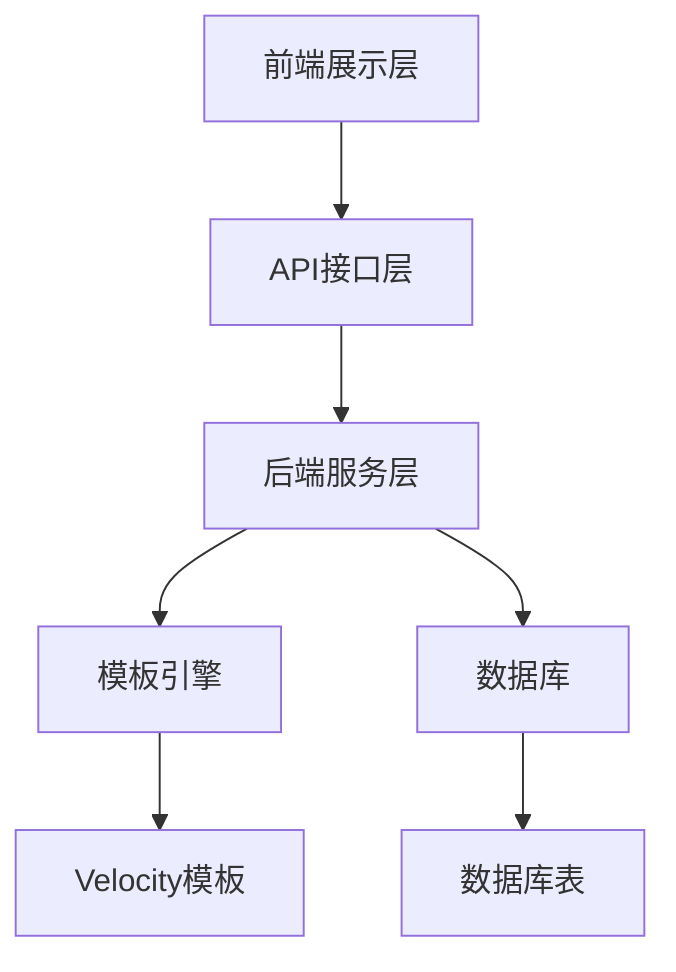
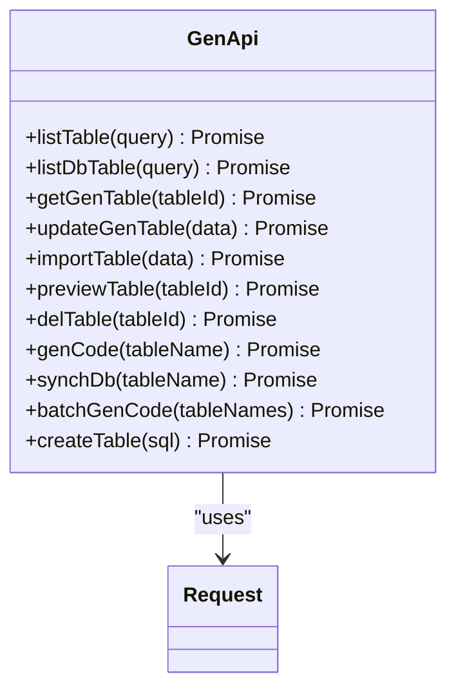
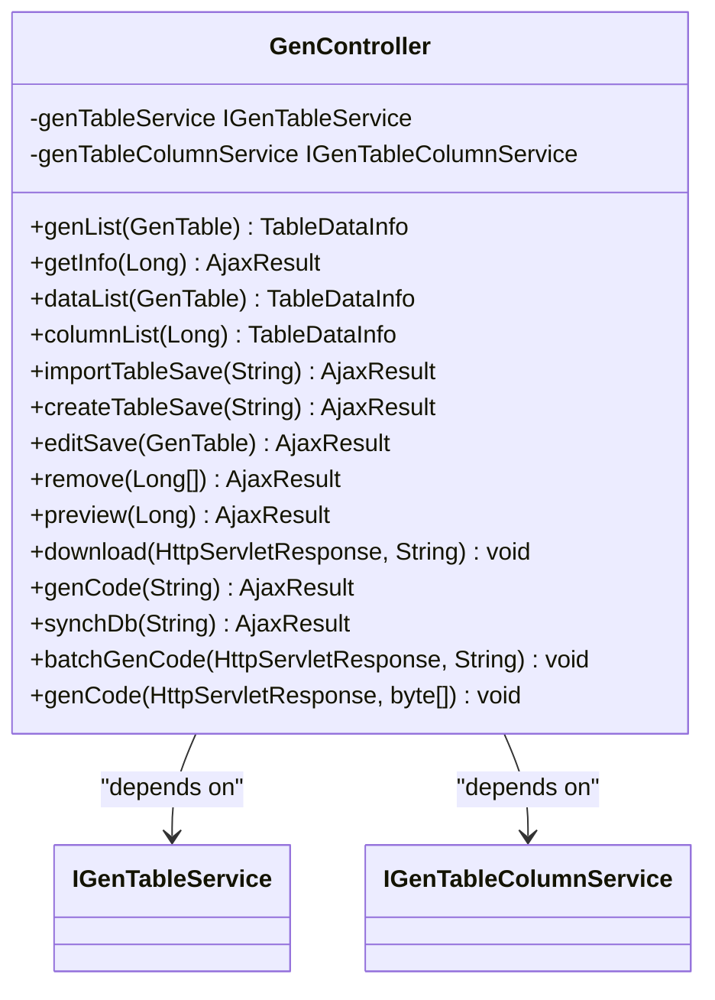
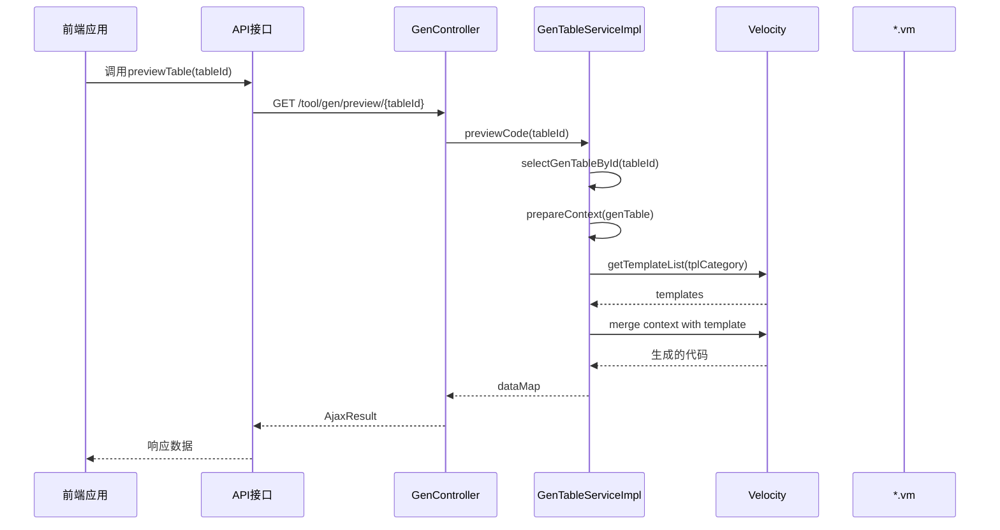
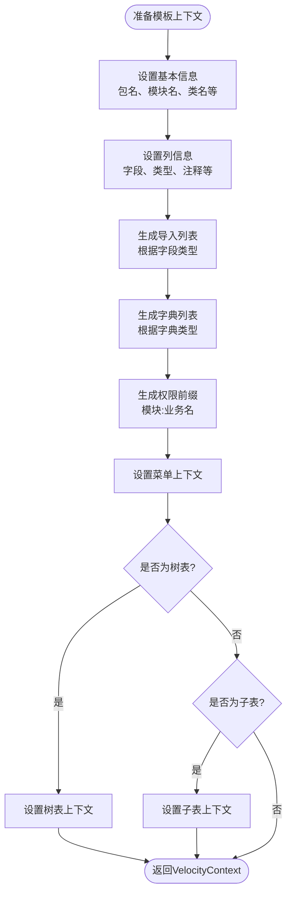
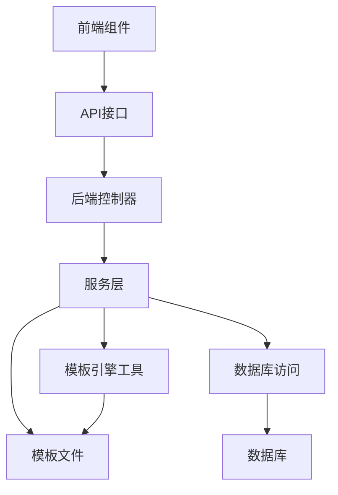

# 系统工具API

<cite>
**本文档引用文件**   
- [gen.js](file://bear-jia-vue3\src\api\tool\gen.js)
- [index.vue](file://bear-jia-vue3\src\views\tool\gen\index.vue)
- [genCodePreview.vue](file://bear-jia-vue3\src\views\tool\gen\genCodePreview.vue)
- [importTables.vue](file://bear-jia-vue3\src\views\tool\gen\importTables.vue)
- [genCodeConfigUpdate.vue](file://bear-jia-vue3\src\views\tool\gen\genCodeConfigUpdate.vue)
- [GenController.java](file://bearjia-admin-backend\src\main\java\com\javaxiaobear\module\tool\gen\controller\GenController.java)
- [GenTableServiceImpl.java](file://bearjia-admin-backend\src\main\java\com\javaxiaobear\module\tool\gen\service\GenTableServiceImpl.java)
- [VelocityUtils.java](file://bearjia-admin-backend\src\main\java\com\javaxiaobear\module\tool\gen\util\VelocityUtils.java)
- [GenUtils.java](file://bearjia-admin-backend\src\main\java\com\javaxiaobear\module\tool\gen\util\GenUtils.java)
- [domain.java.vm](file://bearjia-admin-backend\src\main\resources\vm\java\domain.java.vm)
- [api.js.vm](file://bearjia-admin-backend\src\main\resources\vm\bearjia\api.js.vm)
- [api.js.vm](file://bearjia-admin-backend\src\main\resources\vm\antdv\api.js.vm)
</cite>

## 目录
1. [简介](#简介)
2. [项目结构](#项目结构)
3. [核心组件](#核心组件)
4. [架构概述](#架构概述)
5. [详细组件分析](#详细组件分析)
6. [依赖分析](#依赖分析)
7. [性能考虑](#性能考虑)
8. [故障排除指南](#故障排除指南)
9. [结论](#结论)
10. [附录](#附录) (如有必要)

## 简介
本文档详细描述了系统工具模块的API，重点介绍代码生成功能的前后端交互接口。文档涵盖了代码生成器的所有API端点，包括查询数据库表、预览生成代码、下载生成代码包、导入新表结构等操作。同时，文档解释了API如何与Velocity模板引擎集成，前端如何通过API获取动态生成的代码内容，以及代码生成配置的传递机制（如包名、模块名、作者等元数据）。此外，文档还提供了API的安全控制机制和扩展点说明。

## 项目结构
系统工具模块的代码生成功能分布在前后端两个部分。前端代码位于`bear-jia-vue3`项目中，主要包含API定义、视图组件和业务逻辑；后端代码位于`bearjia-admin-backend`项目中，主要包含控制器、服务层和模板引擎实现。

```mermaid
graph TB
subgraph "前端 (bear-jia-vue3)"
A[API接口] --> B[gen.js]
C[视图组件] --> D[index.vue]
C --> E[genCodePreview.vue]
C --> F[importTables.vue]
C --> G[genCodeConfigUpdate.vue]
A --> C
end
subgraph "后端 (bearjia-admin-backend)"
H[控制器] --> I[GenController.java]
J[服务层] --> K[GenTableServiceImpl.java]
L[工具类] --> M[VelocityUtils.java]
L --> N[GenUtils.java]
O[模板文件] --> P[*.vm]
H --> J
J --> L
J --> O
end
A < --> H
```

**图源**
- [gen.js](file://bear-jia-vue3\src\api\tool\gen.js)
- [index.vue](file://bear-jia-vue3\src\views\tool\gen\index.vue)
- [GenController.java](file://bearjia-admin-backend\src\main\java\com\javaxiaobear\module\tool\gen\controller\GenController.java)
- [GenTableServiceImpl.java](file://bearjia-admin-backend\src\main\java\com\javaxiaobear\module\tool\gen\service\GenTableServiceImpl.java)

**章节源**
- [gen.js](file://bear-jia-vue3\src\api\tool\gen.js)
- [index.vue](file://bear-jia-vue3\src\views\tool\gen\index.vue)
- [GenController.java](file://bearjia-admin-backend\src\main\java\com\javaxiaobear\module\tool\gen\controller\GenController.java)

## 核心组件
系统工具模块的核心组件包括前端API接口、视图组件和后端控制器、服务层。前端通过API接口与后端进行通信，实现代码生成的各种功能。后端通过Velocity模板引擎动态生成代码，并将生成的代码打包下载。

**章节源**
- [gen.js](file://bear-jia-vue3\src\api\tool\gen.js)
- [GenController.java](file://bearjia-admin-backend\src\main\java\com\javaxiaobear\module\tool\gen\controller\GenController.java)
- [GenTableServiceImpl.java](file://bearjia-admin-backend\src\main\java\com\javaxiaobear\module\tool\gen\service\GenTableServiceImpl.java)

## 架构概述
代码生成功能的架构分为三层：前端展示层、API接口层和后端服务层。前端展示层负责用户界面的展示和用户交互；API接口层负责前后端的数据传输；后端服务层负责业务逻辑处理和代码生成。



**图源**
- [gen.js](file://bear-jia-vue3\src\api\tool\gen.js)
- [GenController.java](file://bearjia-admin-backend\src\main\java\com\javaxiaobear\module\tool\gen\controller\GenController.java)
- [GenTableServiceImpl.java](file://bearjia-admin-backend\src\main\java\com\javaxiaobear\module\tool\gen\service\GenTableServiceImpl.java)

## 详细组件分析
### 代码生成API分析
代码生成API提供了完整的代码生成功能，包括查询、预览、生成和导入等操作。

#### 前端API组件


**图源**
- [gen.js](file://bear-jia-vue3\src\api\tool\gen.js)

#### 后端控制器组件


**图源**
- [GenController.java](file://bearjia-admin-backend\src\main\java\com\javaxiaobear\module\tool\gen\controller\GenController.java)

#### 代码生成流程


**图源**
- [gen.js](file://bear-jia-vue3\src\api\tool\gen.js)
- [GenController.java](file://bearjia-admin-backend\src\main\java\com\javaxiaobear\module\tool\gen\controller\GenController.java)
- [GenTableServiceImpl.java](file://bearjia-admin-backend\src\main\java\com\javaxiaobear\module\tool\gen\service\GenTableServiceImpl.java)
- [VelocityUtils.java](file://bearjia-admin-backend\src\main\java\com\javaxiaobear\module\tool\gen\util\VelocityUtils.java)

### 模板引擎集成分析
Velocity模板引擎是代码生成的核心组件，负责根据模板和数据生成最终的代码文件。

#### 模板上下文准备


**图源**
- [VelocityUtils.java](file://bearjia-admin-backend\src\main\java\com\javaxiaobear\module\tool\gen\util\VelocityUtils.java)

#### 模板文件结构
```mermaid
erDiagram
TEMPLATE ||--o{ CATEGORY : "属于"
CATEGORY ||--o{ FILE : "包含"
class TEMPLATE {
名称: 模板引擎
描述: Velocity模板引擎
}
class CATEGORY {
名称: 模板分类
值: crud, tree, sub
}
class FILE {
名称: 模板文件
路径: vm/目录下
}
TEMPLATE }|--{ CATEGORY : "使用"
CATEGORY }|--{ FILE : "包含"
```

**图源**
- [VelocityUtils.java](file://bearjia-admin-backend\src\main\java\com\javaxiaobear\module\tool\gen\util\VelocityUtils.java)
- [vm目录](file://bearjia-admin-backend\src\main\resources\vm)

**章节源**
- [VelocityUtils.java](file://bearjia-admin-backend\src\main\java\com\javaxiaobear\module\tool\gen\util\VelocityUtils.java)
- [GenUtils.java](file://bearjia-admin-backend\src\main\java\com\javaxiaobear\module\tool\gen\util\GenUtils.java)

## 依赖分析
代码生成功能的组件之间存在明确的依赖关系，从前端到后端形成了完整的调用链。



**图源**
- [gen.js](file://bear-jia-vue3\src\api\tool\gen.js)
- [GenController.java](file://bearjia-admin-backend\src\main\java\com\javaxiaobear\module\tool\gen\controller\GenController.java)
- [GenTableServiceImpl.java](file://bearjia-admin-backend\src\main\java\com\javaxiaobear\module\tool\gen\service\GenTableServiceImpl.java)
- [VelocityUtils.java](file://bearjia-admin-backend\src\main\java\com\javaxiaobear\module\tool\gen\util\VelocityUtils.java)

**章节源**
- [gen.js](file://bear-jia-vue3\src\api\tool\gen.js)
- [GenController.java](file://bearjia-admin-backend\src\main\java\com\javaxiaobear\module\tool\gen\controller\GenController.java)
- [GenTableServiceImpl.java](file://bearjia-admin-backend\src\main\java\com\javaxiaobear\module\tool\gen\service\GenTableServiceImpl.java)

## 性能考虑
代码生成功能在性能方面有以下考虑：
1. 使用Velocity模板引擎进行代码生成，避免了复杂的字符串拼接操作
2. 通过批量生成代码接口减少网络请求次数
3. 在服务层对数据进行缓存，减少数据库查询次数
4. 使用流式处理生成zip文件，避免内存溢出

## 故障排除指南
### 常见问题及解决方案
1. **代码生成失败**
   - 检查模板文件是否存在
   - 检查数据库连接是否正常
   - 检查表结构是否正确

2. **预览代码显示异常**
   - 检查前端高亮库是否正确加载
   - 检查API接口返回数据格式是否正确

3. **导入表失败**
   - 检查SQL语句是否符合规范
   - 检查表名是否已存在

**章节源**
- [GenController.java](file://bearjia-admin-backend\src\main\java\com\javaxiaobear\module\tool\gen\controller\GenController.java)
- [GenTableServiceImpl.java](file://bearjia-admin-backend\src\main\java\com\javaxiaobear\module\tool\gen\service\GenTableServiceImpl.java)

## 结论
本文档详细描述了系统工具模块的代码生成API，包括前后端交互接口、模板引擎集成、配置传递机制和安全控制。通过本文档，开发者可以全面了解代码生成功能的实现原理和使用方法，为系统的维护和扩展提供指导。

## 附录
### API端点列表
| 端点 | 方法 | 描述 | 参数 |
|------|------|------|------|
| /tool/gen/list | GET | 查询代码生成列表 | query |
| /tool/gen/db/list | GET | 查询数据库列表 | query |
| /tool/gen/{tableId} | GET | 查询表详细信息 | tableId |
| /tool/gen | PUT | 修改代码生成信息 | data |
| /tool/gen/importTable | POST | 导入表 | tables |
| /tool/gen/preview/{tableId} | GET | 预览生成代码 | tableId |
| /tool/gen/{tableId} | DELETE | 删除表数据 | tableId |
| /tool/gen/genCode/{tableName} | GET | 生成代码（自定义路径） | tableName |
| /tool/gen/synchDb/{tableName} | GET | 同步数据库 | tableName |
| /tool/gen/batchGenCode | GET | 批量生成代码 | tables |
| /tool/gen/createTable | POST | 创建表 | sql |

**章节源**
- [gen.js](file://bear-jia-vue3\src\api\tool\gen.js)
- [GenController.java](file://bearjia-admin-backend\src\main\java\com\javaxiaobear\module\tool\gen\controller\GenController.java)