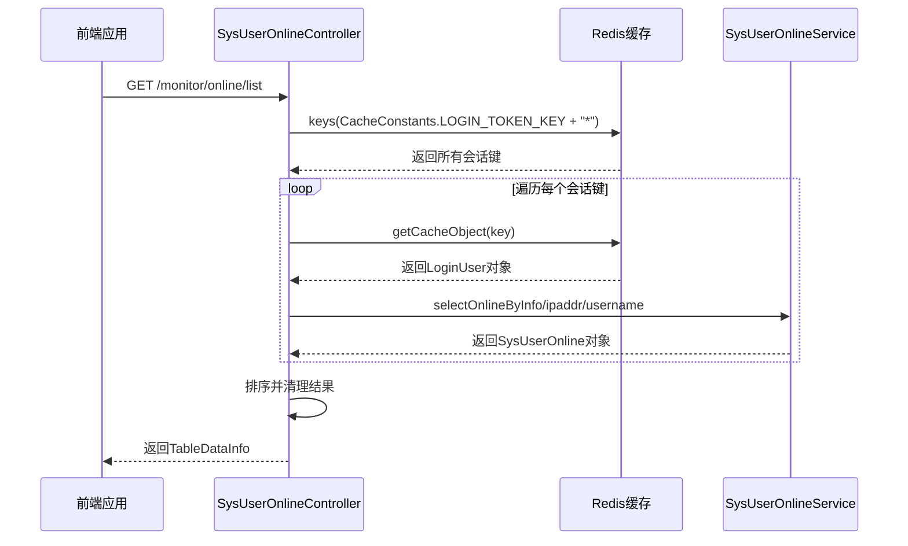
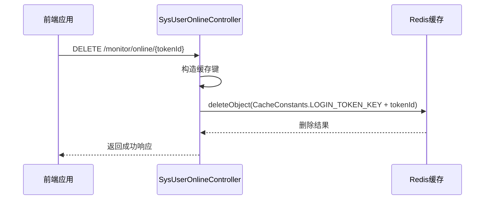
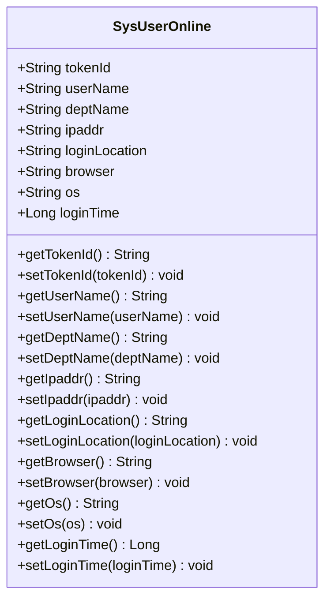
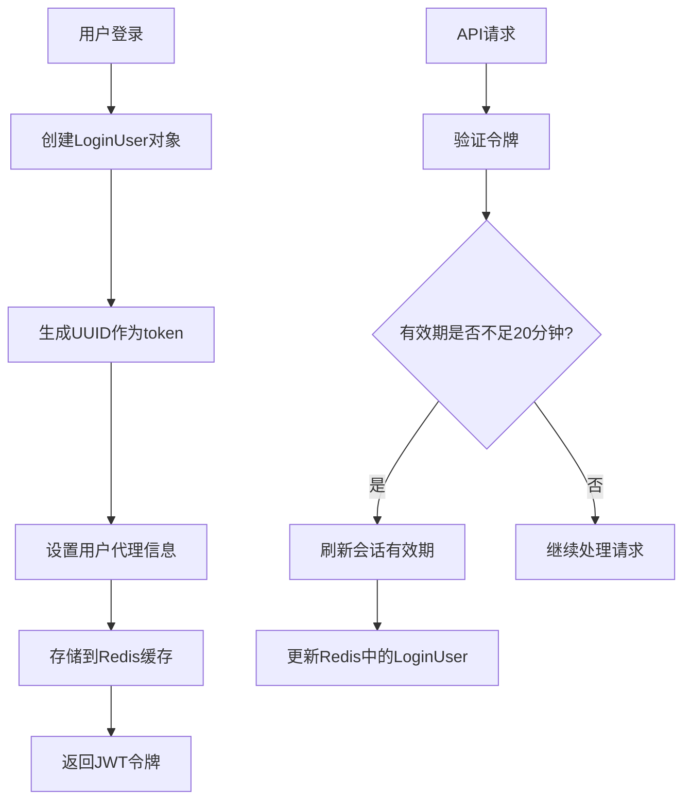
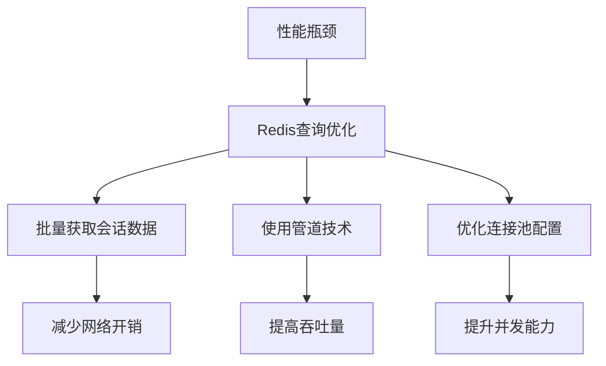
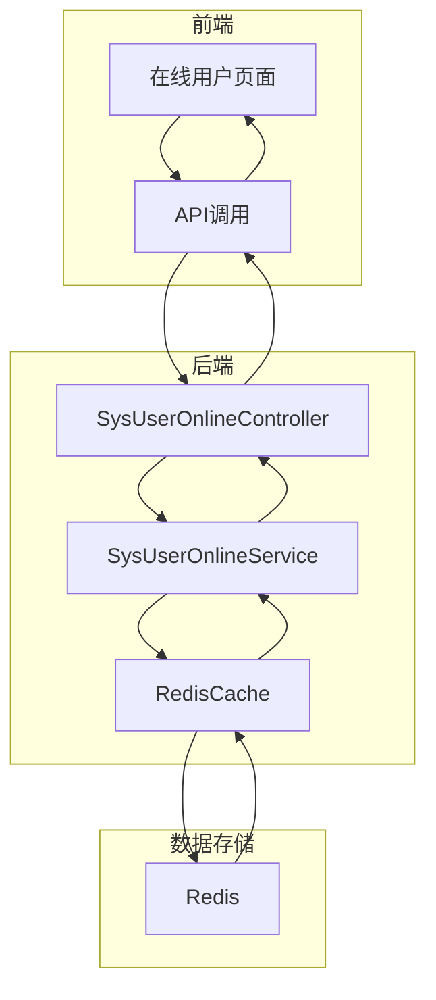

# 在线用户API

<cite>
**本文档引用的文件**
- [SysUserOnlineController.java](file://bearjia-admin-backend/src/main/java/com/javaxiaobear/module/monitor/controller/SysUserOnlineController.java)
- [online.js](file://bear-jia-vue3/src/api/monitor/online.js)
- [index.vue](file://bear-jia-vue3/src/views/monitor/online/index.vue)
- [RedisCache.java](file://bearjia-admin-backend/src/main/java/com/javaxiaobear/base/framework/redis/RedisCache.java)
- [CacheConstants.java](file://bearjia-admin-backend/src/main/java/com/javaxiaobear/base/common/constant/CacheConstants.java)
- [TokenService.java](file://bearjia-admin-backend/src/main/java/com/javaxiaobear/base/framework/security/service/TokenService.java)
- [SysUserOnline.java](file://bearjia-admin-backend/src/main/java/com/javaxiaobear/module/monitor/domain/SysUserOnline.java)
- [SysUserOnlineServiceImpl.java](file://bearjia-admin-backend/src/main/java/com/javaxiaobear/module/system/service/impl/SysUserOnlineServiceImpl.java)
- [application.yml](file://bearjia-admin-backend/src/main/resources/application.yml)
</cite>

## 目录
1. [简介](#简介)
2. [核心接口详解](#核心接口详解)
3. [前端API调用示例](#前端api调用示例)
4. [会话管理机制](#会话管理机制)
5. [性能优化建议](#性能优化建议)
6. [系统架构图](#系统架构图)

## 简介
在线用户API提供了对系统中当前在线用户会话的监控和管理功能。该功能允许管理员查询在线用户列表，并对特定用户执行强制下线操作。系统通过Redis缓存存储用户会话信息，实现了高效的会话管理和实时监控能力。本API主要用于系统监控模块，帮助管理员了解当前系统的用户活动情况，及时发现异常登录行为。

## 核心接口详解

### getOnlineList接口
getOnlineList接口提供了基于IP地址和用户名的分页查询功能，用于获取系统中当前在线用户的列表信息。

该接口通过`/monitor/online/list`端点提供GET请求服务，支持以下查询参数：
- **ipaddr**: 登录IP地址，用于按IP地址过滤在线用户
- **userName**: 用户名称，用于按用户名过滤在线用户

接口实现逻辑如下：
1. 通过RedisCache的keys方法获取所有以`login_tokens:`为前缀的缓存键
2. 遍历这些缓存键，从Redis中获取对应的LoginUser对象
3. 根据查询条件（IP地址、用户名或两者组合）筛选符合条件的在线用户
4. 将筛选结果转换为SysUserOnline对象列表
5. 对结果列表进行逆序排列并移除空值
6. 返回包含分页信息的TableDataInfo对象



**接口来源**
- [SysUserOnlineController.java](file://bearjia-admin-backend/src/main/java/com/javaxiaobear/module/monitor/controller/SysUserOnlineController.java#L41-L70)
- [RedisCache.java](file://bearjia-admin-backend/src/main/java/com/javaxiaobear/base/framework/redis/RedisCache.java#L264-L267)
- [CacheConstants.java](file://bearjia-admin-backend/src/main/java/com/javaxiaobear/base/common/constant/CacheConstants.java#L13)

### forceLogout接口
forceLogout接口用于强制使指定用户下线，通过删除Redis中的会话数据来实现。

该接口通过`/monitor/online/{tokenId}`端点提供DELETE请求服务，其中`tokenId`为要强制下线用户的会话令牌ID。

接口实现逻辑如下：
1. 接收路径参数`tokenId`
2. 构造Redis缓存键：`login_tokens:` + `tokenId`
3. 调用RedisCache的deleteObject方法删除对应的会话数据
4. 返回成功响应



**接口来源**
- [SysUserOnlineController.java](file://bearjia-admin-backend/src/main/java/com/javaxiaobear/module/monitor/controller/SysUserOnlineController.java#L75-L82)
- [CacheConstants.java](file://bearjia-admin-backend/src/main/java/com/javaxiaobear/base/common/constant/CacheConstants.java#L13)

## 前端API调用示例

### API函数定义
前端在`online.js`文件中定义了两个API函数：

```javascript
// 查询在线用户列表
export function list(query) {
  return request({
    url: '/monitor/online/list',
    method: 'get',
    params: query
  })
}

// 强退用户
export function forceLogout(tokenId) {
  return request({
    url: '/monitor/online/' + tokenId,
    method: 'delete'
  })
}
```

**API来源**
- [online.js](file://bear-jia-vue3/src/api/monitor/online.js#L3-L18)

### 页面调用示例
在`index.vue`页面中，通过ProTable组件调用在线用户API：

```javascript
// ProTable配置
const tableApi = {list: list}; // 使用list函数作为数据源
const initialSearchParams = {ipaddr: null, userName: null};

// 搜索字段配置
const searchFields = computed(() => [
  {name: 'ipaddr', label: '登录地址', type: 'input'},
  {name: 'userName', label: '用户名称', type: 'input'},
]);

// 点击强退操作
const clickForceLogout = (row) => {
  BearJiaUtil.confirmOperate('强退', () => {
    forceLogout(row.tokenId)
        .then(() => {
          BearJiaUtil.messageSuccess('强退操作成功。');
          proTableRef.value?.refresh();
        })
        .catch(() => {
        });
  });
};
```

**页面来源**
- [index.vue](file://bear-jia-vue3/src/views/monitor/online/index.vue#L38-L84)

## 会话管理机制

### 在线用户会话数据结构
在线用户会话数据通过SysUserOnline类表示，包含以下关键属性：
- **tokenId**: 会话令牌ID
- **userName**: 用户名称
- **deptName**: 部门名称
- **ipaddr**: 登录IP地址
- **loginLocation**: 登录地点
- **browser**: 浏览器类型
- **os**: 操作系统
- **loginTime**: 登录时间



**数据结构来源**
- [SysUserOnline.java](file://bearjia-admin-backend/src/main/java/com/javaxiaobear/module/monitor/domain/SysUserOnline.java)

### 会话刷新机制
系统通过TokenService实现了会话刷新机制，确保用户会话的有效性：

1. **会话创建**: 用户登录时生成UUID作为token，并设置到LoginUser对象中
2. **缓存存储**: 将LoginUser对象存储到Redis，键名为`login_tokens:` + `token`
3. **有效期管理**: 默认30分钟有效期，配置在application.yml中
4. **自动刷新**: 当会话剩余时间不足20分钟时，自动刷新会话有效期



**会话机制来源**
- [TokenService.java](file://bearjia-admin-backend/src/main/java/com/javaxiaobear/base/framework/security/service/TokenService.java#L147-L154)
- [application.yml](file://bearjia-admin-backend/src/main/resources/application.yml#L98-L99)

## 性能优化建议

### Redis查询优化
针对高并发场景下的性能优化，建议采取以下措施：

1. **批量操作**: 使用Redis的批量操作命令减少网络往返次数
2. **管道技术**: 采用Redis管道技术批量处理多个命令
3. **连接池优化**: 调整Redis连接池配置，提高并发处理能力



### 缓存预热策略
实施缓存预热策略以提高系统响应速度：

1. **启动预热**: 系统启动时预先加载常用数据到缓存
2. **定时预热**: 设置定时任务定期更新热点数据
3. **访问预热**: 根据用户访问模式预测并预加载可能需要的数据

**优化建议来源**
- [RedisCache.java](file://bearjia-admin-backend/src/main/java/com/javaxiaobear/base/framework/redis/RedisCache.java)
- [application.yml](file://bearjia-admin-backend/src/main/resources/application.yml#L83-L90)

## 系统架构图



**架构图来源**
- [SysUserOnlineController.java](file://bearjia-admin-backend/src/main/java/com/javaxiaobear/module/monitor/controller/SysUserOnlineController.java)
- [SysUserOnlineServiceImpl.java](file://bearjia-admin-backend/src/main/java/com/javaxiaobear/module/system/service/impl/SysUserOnlineServiceImpl.java)
- [RedisCache.java](file://bearjia-admin-backend/src/main/java/com/javaxiaobear/base/framework/redis/RedisCache.java)