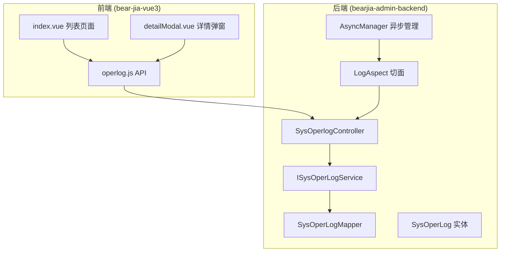
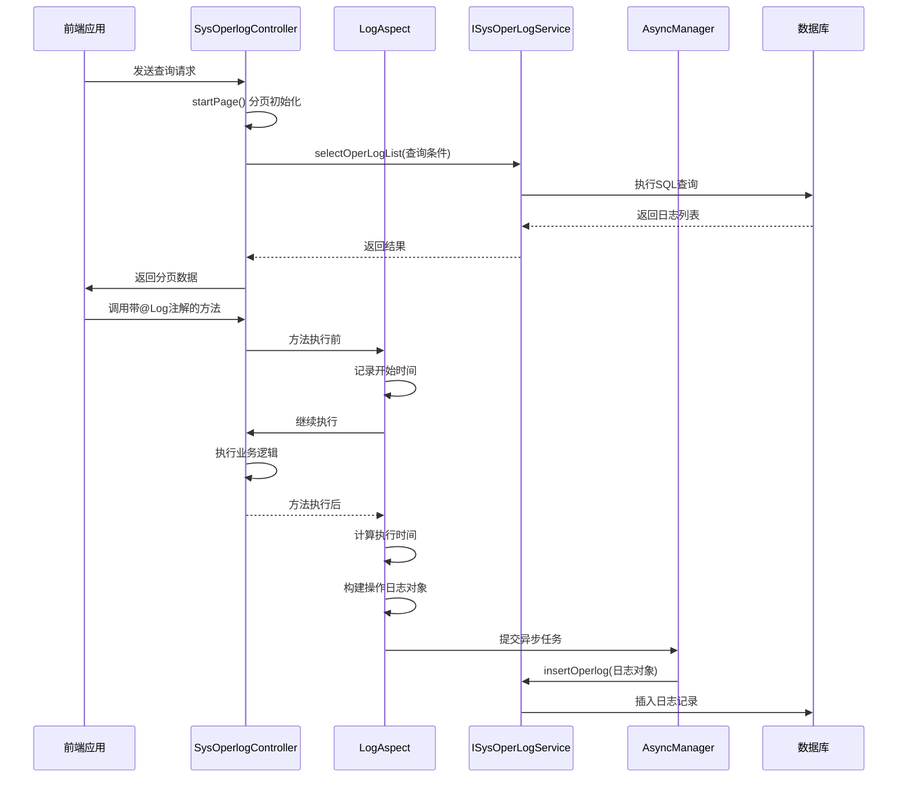
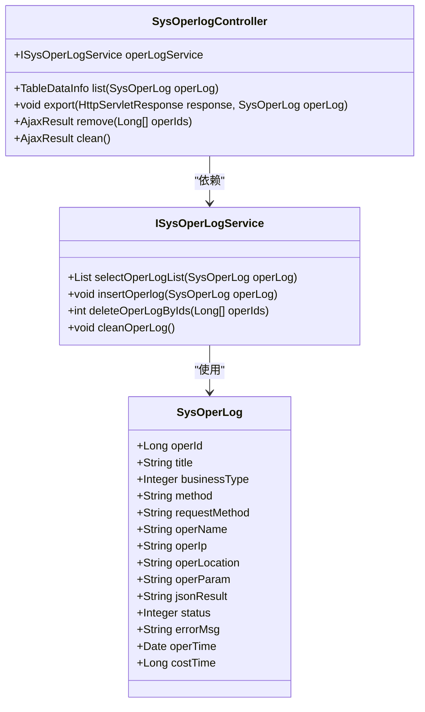
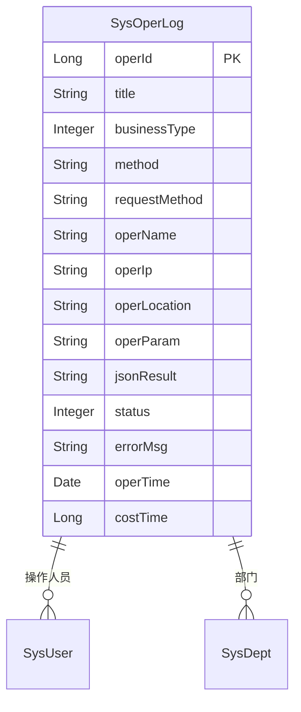
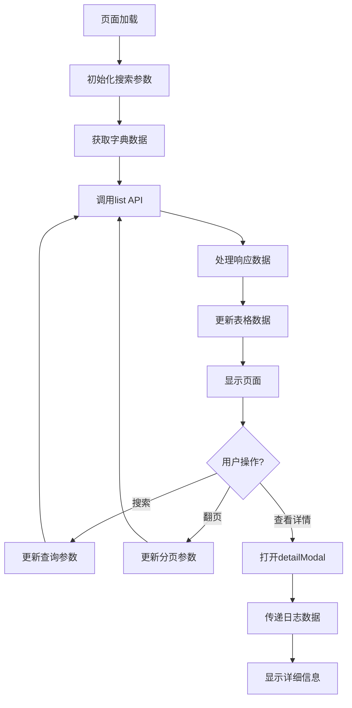
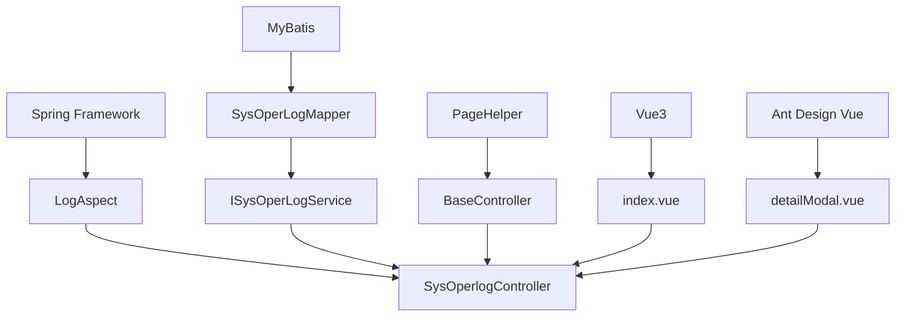

# 操作日志API

<cite>
**本文档引用的文件**   
- [SysOperlogController.java](file://bearjia-admin-backend/src/main/java/com/javaxiaobear/module/monitor/controller/SysOperlogController.java)
- [operlog.js](file://bear-jia-vue3/src/api/monitor/operlog.js)
- [SysOperLog.java](file://bearjia-admin-backend/src/main/java/com/javaxiaobear/module/monitor/domain/SysOperLog.java)
- [LogAspect.java](file://bearjia-admin-backend/src/main/java/com/javaxiaobear/base/framework/aspectj/LogAspect.java)
- [SysOperLogMapper.xml](file://bearjia-admin-backend/src/main/resources/mybatis/monitor/SysOperLogMapper.xml)
- [detailModal.vue](file://bear-jia-vue3/src/views/monitor/operlog/detailModal.vue)
- [index.vue](file://bear-jia-vue3/src/views/monitor/operlog/index.vue)
- [Log.java](file://bearjia-admin-backend/src/main/java/com/javaxiaobear/base/framework/aspectj/lang/annotation/Log.java)
- [AsyncFactory.java](file://bearjia-admin-backend/src/main/java/com/javaxiaobear/base/framework/manager/factory/AsyncFactory.java)
- [AsyncManager.java](file://bearjia-admin-backend/src/main/java/com/javaxiaobear/base/framework/manager/AsyncManager.java)
- [TableSupport.java](file://bearjia-admin-backend/src/main/java/com/javaxiaobear/base/framework/web/page/TableSupport.java)
- [BaseController.java](file://bearjia-admin-backend/src/main/java/com/javaxiaobear/base/framework/web/controller/BaseController.java)
</cite>

## 目录
1. [简介](#简介)
2. [项目结构](#项目结构)
3. [核心组件](#核心组件)
4. [架构概览](#架构概览)
5. [详细组件分析](#详细组件分析)
6. [依赖分析](#依赖分析)
7. [性能考虑](#性能考虑)
8. [故障排除指南](#故障排除指南)
9. [结论](#结论)

## 简介
操作日志系统是企业级应用中至关重要的审计和监控功能，用于记录系统中所有关键操作的详细信息。本系统通过Spring AOP切面编程实现了自动化的日志记录机制，结合@Log注解对控制器方法进行声明式日志管理。系统提供了完整的操作日志查询、导出、删除和清空功能，支持分页查询、多条件过滤（包括操作类型、操作人员、时间范围等）以及详细的日志审计功能。前端通过Vue3和Ant Design Vue组件库构建了用户友好的操作界面，实现了数据的可视化展示和交互操作。

## 项目结构
操作日志功能分布在前后端两个主要模块中。后端位于`bearjia-admin-backend`项目中，采用典型的三层架构：控制器层（Controller）处理HTTP请求，服务层（Service）实现业务逻辑，数据访问层（Mapper）负责数据库操作。前端位于`bear-jia-vue3`项目中，采用模块化设计，`monitor`模块下的`operlog`子模块专门负责操作日志的前端展示和交互。系统通过RESTful API进行前后端通信，实现了前后端分离的架构设计。



**图表来源**
- [operlog.js](file://bear-jia-vue3/src/api/monitor/operlog.js)
- [SysOperlogController.java](file://bearjia-admin-backend/src/main/java/com/javaxiaobear/module/monitor/controller/SysOperlogController.java)
- [ISysOperLogService.java](file://bearjia-admin-backend/src/main/java/com/javaxiaobear/module/monitor/service/ISysOperLogService.java)
- [SysOperLogMapper.java](file://bearjia-admin-backend/src/main/java/com/javaxiaobear/module/monitor/mapper/SysOperLogMapper.java)
- [SysOperLog.java](file://bearjia-admin-backend/src/main/java/com/javaxiaobear/module/monitor/domain/SysOperLog.java)
- [LogAspect.java](file://bearjia-admin-backend/src/main/java/com/javaxiaobear/base/framework/aspectj/LogAspect.java)
- [AsyncManager.java](file://bearjia-admin-backend/src/main/java/com/javaxiaobear/base/framework/manager/AsyncManager.java)

**章节来源**
- [SysOperlogController.java](file://bearjia-admin-backend/src/main/java/com/javaxiaobear/module/monitor/controller/SysOperlogController.java)
- [operlog.js](file://bear-jia-vue3/src/api/monitor/operlog.js)

## 核心组件
操作日志系统的核心组件包括后端的`SysOperlogController`控制器、`LogAspect`切面和`SysOperLog`实体类，以及前端的`operlog.js`API模块和`index.vue`视图组件。`SysOperlogController`提供了操作日志的查询、导出、删除和清空等RESTful接口；`LogAspect`切面通过AOP技术实现了操作日志的自动记录；`SysOperLog`实体类定义了操作日志的数据结构；前端组件则负责用户界面的展示和用户交互的处理。

**章节来源**
- [SysOperlogController.java](file://bearjia-admin-backend/src/main/java/com/javaxiaobear/module/monitor/controller/SysOperlogController.java)
- [LogAspect.java](file://bearjia-admin-backend/src/main/java/com/javaxiaobear/base/framework/aspectj/LogAspect.java)
- [SysOperLog.java](file://bearjia-admin-backend/src/main/java/com/javaxiaobear/module/monitor/domain/SysOperLog.java)
- [operlog.js](file://bear-jia-vue3/src/api/monitor/operlog.js)

## 架构概览
系统采用前后端分离的架构设计，前端通过Vue3框架构建用户界面，后端采用Spring Boot框架提供RESTful API服务。操作日志的记录通过Spring AOP切面实现，当带有@Log注解的方法被调用时，`LogAspect`切面会自动捕获方法执行前后的信息，包括操作类型、操作人员、请求参数等，并通过异步方式将日志信息保存到数据库中。查询功能通过分页机制实现，支持多种查询条件的组合过滤，确保了系统在处理大量日志数据时的性能和响应速度。



**图表来源**
- [SysOperlogController.java](file://bearjia-admin-backend/src/main/java/com/javaxiaobear/module/monitor/controller/SysOperlogController.java)
- [LogAspect.java](file://bearjia-admin-backend/src/main/java/com/javaxiaobear/base/framework/aspectj/LogAspect.java)
- [ISysOperLogService.java](file://bearjia-admin-backend/src/main/java/com/javaxiaobear/module/monitor/service/ISysOperLogService.java)
- [AsyncManager.java](file://bearjia-admin-backend/src/main/java/com/javaxiaobear/base/framework/manager/AsyncManager.java)

## 详细组件分析

### SysOperlogController分析
`SysOperlogController`是操作日志系统的入口点，负责处理所有与操作日志相关的HTTP请求。该控制器提供了四个主要接口：分页查询、导出、删除和清空操作日志。查询接口通过`startPage()`方法初始化分页参数，并调用服务层获取符合查询条件的日志列表；导出接口将查询结果转换为Excel文件；删除接口支持批量删除指定ID的日志记录；清空接口则会清空整个操作日志表。



**图表来源**
- [SysOperlogController.java](file://bearjia-admin-backend/src/main/java/com/javaxiaobear/module/monitor/controller/SysOperlogController.java)
- [ISysOperLogService.java](file://bearjia-admin-backend/src/main/java/com/javaxiaobear/module/monitor/service/ISysOperLogService.java)
- [SysOperLog.java](file://bearjia-admin-backend/src/main/java/com/javaxiaobear/module/monitor/domain/SysOperLog.java)

**章节来源**
- [SysOperlogController.java](file://bearjia-admin-backend/src/main/java/com/javaxiaobear/module/monitor/controller/SysOperlogController.java)

### SysOperLog实体类分析
`SysOperLog`实体类定义了操作日志的数据结构和属性。该类继承自`BaseEntity`，包含了操作日志的所有核心字段，如操作模块、业务类型、请求方法、操作地址、操作详情等。每个字段都通过`@Excel`注解配置了导出到Excel时的显示属性，如列名、数据类型和格式。业务类型字段使用枚举值表示不同的操作类型（新增、修改、删除等），状态字段则记录操作的成功或失败状态。



**图表来源**
- [SysOperLog.java](file://bearjia-admin-backend/src/main/java/com/javaxiaobear/module/monitor/domain/SysOperLog.java)

**章节来源**
- [SysOperLog.java](file://bearjia-admin-backend/src/main/java/com/javaxiaobear/module/monitor/domain/SysOperLog.java)

### LogAspect切面分析
`LogAspect`是操作日志系统的核心组件，通过Spring AOP技术实现了声明式的日志记录。该切面定义了三个通知：`@Before`在方法执行前记录开始时间，`@AfterReturning`在方法成功执行后记录操作日志，`@AfterThrowing`在方法抛出异常时记录错误信息。切面通过`@annotation(controllerLog)`切点表达式捕获所有带有`@Log`注解的方法调用，并根据注解中的配置决定是否记录请求参数和响应结果。

```mermaid
flowchart TD
A[方法调用] --> B{是否有@Log注解?}
B --> |是| C[执行@Before通知]
C --> D[记录开始时间]
D --> E[执行业务方法]
E --> F{方法是否成功?}
F --> |是| G[执行@AfterReturning通知]
F --> |否| H[执行@AfterThrowing通知]
G --> I[构建操作日志对象]
H --> I
I --> J[设置操作结果]
J --> K[提交异步任务]
K --> L[异步保存日志]
L --> M[方法返回]
```

**图表来源**
- [LogAspect.java](file://bearjia-admin-backend/src/main/java/com/javaxiaobear/base/framework/aspectj/LogAspect.java)

**章节来源**
- [LogAspect.java](file://bearjia-admin-backend/src/main/java/com/javaxiaobear/base/framework/aspectj/LogAspect.java)

### 前端operlog.js分析
`operlog.js`是前端操作日志模块的API接口文件，封装了与后端通信的所有HTTP请求。该文件导出了四个主要函数：`list`用于查询操作日志列表，`delOperlog`用于删除单条日志记录，`cleanOperlog`用于清空所有日志，`exportOperlog`用于导出日志数据。所有请求都通过`request`工具函数发送，该函数封装了统一的请求配置、错误处理和身份验证逻辑。

**章节来源**
- [operlog.js](file://bear-jia-vue3/src/api/monitor/operlog.js)

### 前端页面分析
前端操作日志页面由`index.vue`和`detailModal.vue`两个组件构成。`index.vue`负责展示操作日志的列表，支持分页、搜索、导出和删除等操作；`detailModal.vue`则作为弹窗组件，用于展示单条操作日志的详细信息。页面通过`useDict`组合式API获取字典数据，用于将数字类型的业务类型、操作状态等字段转换为可读的文本描述。



**图表来源**
- [index.vue](file://bear-jia-vue3/src/views/monitor/operlog/index.vue)
- [detailModal.vue](file://bear-jia-vue3/src/views/monitor/operlog/detailModal.vue)

**章节来源**
- [index.vue](file://bear-jia-vue3/src/views/monitor/operlog/index.vue)
- [detailModal.vue](file://bear-jia-vue3/src/views/monitor/operlog/detailModal.vue)

## 依赖分析
操作日志系统依赖于多个核心组件和第三方库。后端依赖Spring Framework实现AOP切面和依赖注入，MyBatis作为ORM框架进行数据库操作，PageHelper实现分页功能。前端依赖Vue3框架和Ant Design Vue组件库构建用户界面。系统内部组件之间通过清晰的接口进行通信，控制器依赖服务层，服务层依赖数据访问层，切面依赖异步任务管理器。这种分层架构确保了系统的可维护性和可扩展性。



**图表来源**
- [LogAspect.java](file://bearjia-admin-backend/src/main/java/com/javaxiaobear/base/framework/aspectj/LogAspect.java)
- [SysOperLogMapper.java](file://bearjia-admin-backend/src/main/java/com/javaxiaobear/module/monitor/mapper/SysOperLogMapper.java)
- [BaseController.java](file://bearjia-admin-backend/src/main/java/com/javaxiaobear/base/framework/web/controller/BaseController.java)
- [index.vue](file://bear-jia-vue3/src/views/monitor/operlog/index.vue)
- [detailModal.vue](file://bear-jia-vue3/src/views/monitor/operlog/detailModal.vue)

**章节来源**
- [SysOperlogController.java](file://bearjia-admin-backend/src/main/java/com/javaxiaobear/module/monitor/controller/SysOperlogController.java)
- [ISysOperLogService.java](file://bearjia-admin-backend/src/main/java/com/javaxiaobear/module/monitor/service/ISysOperLogService.java)
- [SysOperLogMapper.java](file://bearjia-admin-backend/src/main/java/com/javaxiaobear/module/monitor/mapper/SysOperLogMapper.java)

## 性能考虑
操作日志系统在设计时充分考虑了性能因素。日志记录采用异步方式，通过`AsyncManager`将日志保存任务提交到线程池中执行，避免了同步记录日志对业务方法性能的影响。查询功能使用MyBatis的动态SQL和PageHelper分页插件，确保了在处理大量日志数据时的查询效率。数据库表设计合理，关键字段如操作时间、操作人员等建立了索引，优化了查询性能。对于海量日志数据，建议采用分库分表策略或集成Elasticsearch等搜索引擎，以进一步提升查询性能。

**章节来源**
- [LogAspect.java](file://bearjia-admin-backend/src/main/java/com/javaxiaobear/base/framework/aspectj/LogAspect.java)
- [AsyncManager.java](file://bearjia-admin-backend/src/main/java/com/javaxiaobear/base/framework/manager/AsyncManager.java)
- [SysOperLogMapper.xml](file://bearjia-admin-backend/src/main/resources/mybatis/monitor/SysOperLogMapper.xml)

## 故障排除指南
在使用操作日志系统时，可能会遇到一些常见问题。如果日志没有被正确记录，首先检查目标方法是否添加了`@Log`注解，然后确认`LogAspect`切面是否被正确加载。如果查询结果不正确，检查查询条件是否正确传递，分页参数是否设置合理。如果导出功能失败，确认服务器是否有足够的磁盘空间，Excel文件大小是否超过限制。对于性能问题，可以通过监控异步任务队列的长度来判断是否存在任务积压，必要时可以调整线程池大小。

**章节来源**
- [LogAspect.java](file://bearjia-admin-backend/src/main/java/com/javaxiaobear/base/framework/aspectj/LogAspect.java)
- [SysOperlogController.java](file://bearjia-admin-backend/src/main/java/com/javaxiaobear/module/monitor/controller/SysOperlogController.java)
- [AsyncManager.java](file://bearjia-admin-backend/src/main/java/com/javaxiaobear/base/framework/manager/AsyncManager.java)

## 结论
操作日志系统通过AOP切面和@Log注解实现了自动化、声明式的日志记录机制，大大简化了日志管理的复杂性。系统提供了完整的日志查询、导出、删除和清空功能，支持多种查询条件的组合过滤，满足了企业级应用的审计需求。前后端分离的架构设计使得系统具有良好的可维护性和可扩展性。通过异步记录日志的方式，确保了业务方法的执行性能不受影响。未来可以考虑集成更强大的搜索和分析功能，如Elasticsearch，以支持对海量日志数据的高效查询和分析。