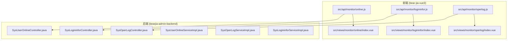
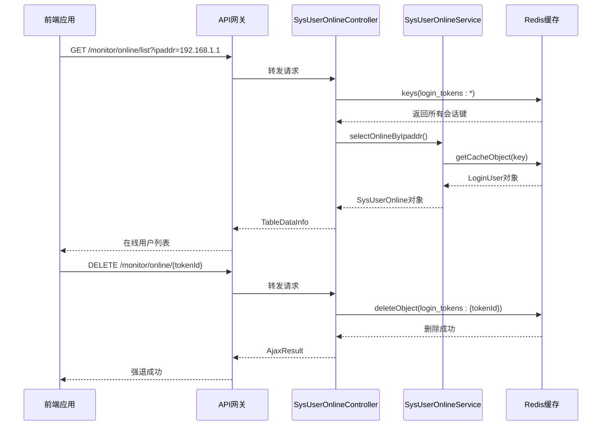
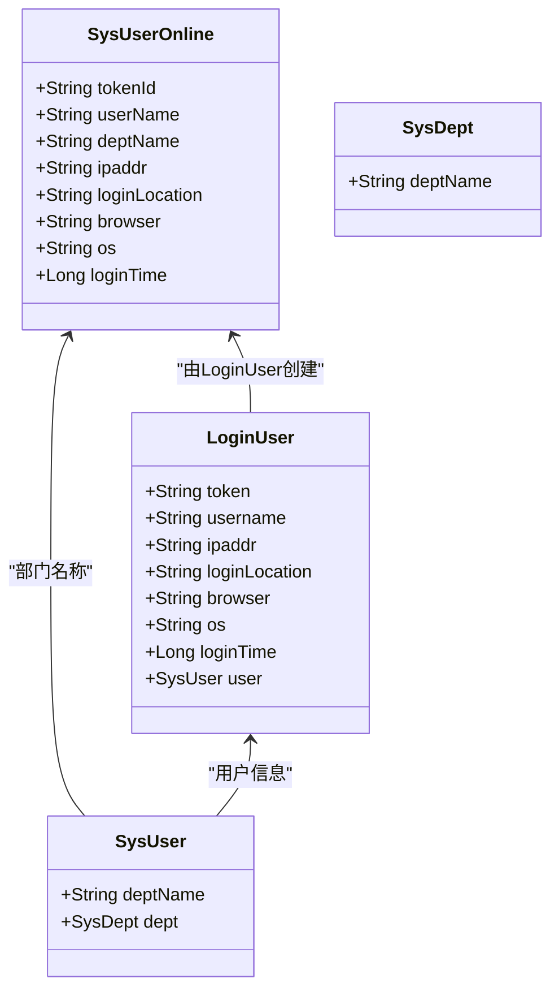
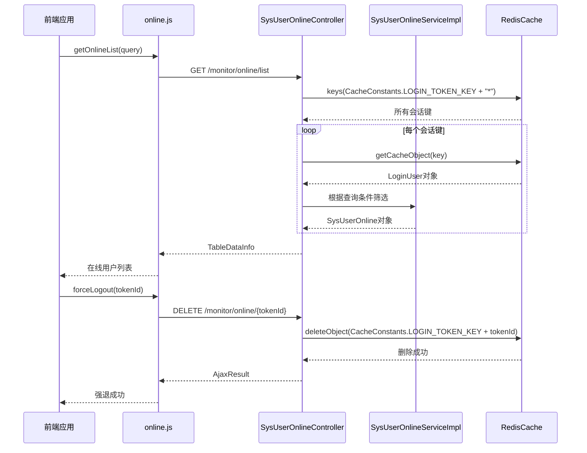
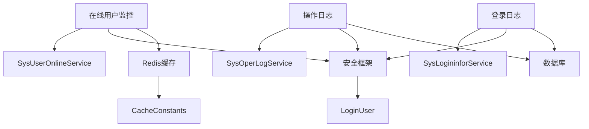

# 日志管理API

<cite>
**本文档引用的文件**   
- [online.js](file://bear-jia-vue3\src\api\monitor\online.js)
- [logininfor.js](file://bear-jia-vue3\src\api\monitor\logininfor.js)
- [operlog.js](file://bear-jia-vue3\src\api\monitor\operlog.js)
- [index.vue](file://bear-jia-vue3\src\views\monitor\online\index.vue)
- [SysUserOnlineController.java](file://bearjia-admin-backend\src\main\java\com\javaxiaobear\module\monitor\controller\SysUserOnlineController.java)
- [SysUserOnlineServiceImpl.java](file://bearjia-admin-backend\src\main\java\com\javaxiaobear\module\system\service\impl\SysUserOnlineServiceImpl.java)
- [ISysUserOnlineService.java](file://bearjia-admin-backend\src\main\java\com\javaxiaobear\module\system\service\ISysUserOnlineService.java)
- [CacheConstants.java](file://bearjia-admin-backend\src\main\java\com\javaxiaobear\base\common\constant\CacheConstants.java)
- [SysUserOnline.java](file://bearjia-admin-backend\src\main\java\com\javaxiaobear\module\monitor\domain\SysUserOnline.java)
- [SysOperLog.java](file://bearjia-admin-backend\src\main\java\com\javaxiaobear\module\monitor\domain\SysOperLog.java)
- [SysLogininfor.java](file://bearjia-admin-backend\src\main\java\com\javaxiaobear\module\monitor\domain\SysLogininfor.java)
</cite>

## 目录
1. [简介](#简介)
2. [项目结构](#项目结构)
3. [核心组件](#核心组件)
4. [架构概述](#架构概述)
5. [详细组件分析](#详细组件分析)
6. [依赖分析](#依赖分析)
7. [性能考虑](#性能考虑)
8. [故障排除指南](#故障排除指南)
9. [结论](#结论)

## 简介
本文档详细描述了日志管理API系统，重点涵盖在线用户监控、登录日志和操作日志三大功能模块。文档深入分析了在线用户管理的核心接口，包括在线用户列表查询和强制下线功能，以及基于IP地址和用户名的过滤查询机制。同时，文档还说明了前端API调用方式、日志查询接口的分页和过滤功能、基于Redis的会话管理机制，以及大规模日志数据查询的性能优化策略。

## 项目结构
日志管理功能分布在前后端两个主要项目中。前端代码位于`bear-jia-vue3`项目中，主要包含API接口定义和视图组件；后端代码位于`bearjia-admin-backend`项目中，实现了业务逻辑和数据访问层。



**图示来源**
- [online.js](file://bear-jia-vue3\src\api\monitor\online.js)
- [logininfor.js](file://bear-jia-vue3\src\api\monitor\logininfor.js)
- [operlog.js](file://bear-jia-vue3\src\api\monitor\operlog.js)
- [SysUserOnlineController.java](file://bearjia-admin-backend\src\main\java\com\javaxiaobear\module\monitor\controller\SysUserOnlineController.java)

**节来源**
- [online.js](file://bear-jia-vue3\src\api\monitor\online.js)
- [logininfor.js](file://bear-jia-vue3\src\api\monitor\logininfor.js)
- [operlog.js](file://bear-jia-vue3\src\api\monitor\operlog.js)

## 核心组件
日志管理系统的三大核心功能模块包括：在线用户监控、登录日志管理和操作日志管理。每个模块都包含相应的前端API接口、视图组件和后端控制器。

**节来源**
- [online.js](file://bear-jia-vue3\src\api\monitor\online.js)
- [logininfor.js](file://bear-jia-vue3\src\api\monitor\logininfor.js)
- [operlog.js](file://bear-jia-vue3\src\api\monitor\operlog.js)

## 架构概述
日志管理系统采用典型的前后端分离架构，前端通过RESTful API与后端进行通信。系统使用Redis作为缓存存储，特别是用于管理在线用户会话。



**图示来源**
- [SysUserOnlineController.java](file://bearjia-admin-backend\src\main\java\com\javaxiaobear\module\monitor\controller\SysUserOnlineController.java)
- [online.js](file://bear-jia-vue3\src\api\monitor\online.js)

## 详细组件分析

### 在线用户管理分析
在线用户管理功能允许系统管理员查看当前在线用户列表，并可以强制下线特定用户。该功能通过前端组件与后端API的协作实现。

#### 对象导向组件：


**图示来源**
- [SysUserOnline.java](file://bearjia-admin-backend\src\main\java\com\javaxiaobear\module\monitor\domain\SysUserOnline.java)
- [SysUserOnlineServiceImpl.java](file://bearjia-admin-backend\src\main\java\com\javaxiaobear\module\system\service\impl\SysUserOnlineServiceImpl.java)

#### API/服务组件：


**图示来源**
- [online.js](file://bear-jia-vue3\src\api\monitor\online.js)
- [SysUserOnlineController.java](file://bearjia-admin-backend\src\main\java\com\javaxiaobear\module\monitor\controller\SysUserOnlineController.java)
- [SysUserOnlineServiceImpl.java](file://bearjia-admin-backend\src\main\java\com\javaxiaobear\module\system\service\impl\SysUserOnlineServiceImpl.java)

**节来源**
- [online.js](file://bear-jia-vue3\src\api\monitor\online.js)
- [index.vue](file://bear-jia-vue3\src\views\monitor\online\index.vue)
- [SysUserOnlineController.java](file://bearjia-admin-backend\src\main\java\com\javaxiaobear\module\monitor\controller\SysUserOnlineController.java)

### 登录日志分析
登录日志功能用于记录用户的登录和登出活动，包括成功和失败的登录尝试。

```mermaid
flowchart TD
A[开始] --> B[前端调用list(query)]
B --> C{查询参数}
C --> |有时间范围| D[后端按时间范围过滤]
C --> |有登录状态| E[后端按状态过滤]
C --> |有用户名| F[后端按用户名过滤]
D --> G[查询数据库]
E --> G
F --> G
G --> H[返回分页结果]
H --> I[前端显示登录日志]
J[前端调用cleanLogininfor()] --> K[后端清空登录日志表]
K --> L[返回操作结果]
M[前端调用exportLogininfor(query)] --> N[后端导出日志数据]
N --> O[返回文件流]
```

**图示来源**
- [logininfor.js](file://bear-jia-vue3\src\api\monitor\logininfor.js)
- [SysLogininfor.java](file://bearjia-admin-backend\src\main\java\com\javaxiaobear\module\monitor\domain\SysLogininfor.java)

**节来源**
- [logininfor.js](file://bear-jia-vue3\src\api\monitor\logininfor.js)

### 操作日志分析
操作日志功能记录系统中所有重要的业务操作，用于审计和故障排查。

```mermaid
flowchart TD
A[开始] --> B[前端调用list(query)]
B --> C{查询参数}
C --> |有操作类型| D[后端按类型过滤]
C --> |有时间范围| E[后端按时间范围过滤]
C --> |有操作者| F[后端按操作者过滤]
D --> G[查询数据库]
E --> G
F --> G
G --> H[返回分页结果]
H --> I[前端显示操作日志]
J[前端调用delOperlog(operId)] --> K[后端删除指定日志]
K --> L[返回操作结果]
M[前端调用cleanOperlog()] --> N[后端清空操作日志表]
N --> O[返回操作结果]
P[前端调用exportOperlog(query)] --> Q[后端导出日志数据]
Q --> R[返回文件流]
```

**图示来源**
- [operlog.js](file://bear-jia-vue3\src\api\monitor\operlog.js)
- [SysOperLog.java](file://bearjia-admin-backend\src\main\java\com\javaxiaobear\module\monitor\domain\SysOperLog.java)

**节来源**
- [operlog.js](file://bear-jia-vue3\src\api\monitor\operlog.js)

## 依赖分析
日志管理系统依赖于多个核心组件和服务，包括Redis缓存、数据库和安全框架。



**图示来源**
- [CacheConstants.java](file://bearjia-admin-backend\src\main\java\com\javaxiaobear\base\common\constant\CacheConstants.java)
- [SysUserOnlineController.java](file://bearjia-admin-backend\src\main\java\com\javaxiaobear\module\monitor\controller\SysUserOnlineController.java)

**节来源**
- [CacheConstants.java](file://bearjia-admin-backend\src\main\java\com\javaxiaobear\base\common\constant\CacheConstants.java)

## 性能考虑
对于大规模日志数据的查询，系统采用了多种性能优化策略：

1. **分页查询**：所有日志列表查询都支持分页，避免一次性加载大量数据。
2. **索引优化**：在数据库的关键字段（如时间戳、用户名、IP地址）上建立索引。
3. **缓存策略**：在线用户数据存储在Redis中，提供快速访问。
4. **异步处理**：日志记录操作可以采用异步方式，避免阻塞主业务流程。
5. **数据归档**：定期将历史日志数据归档到冷存储，保持主表数据量在合理范围。

**节来源**
- [SysUserOnlineController.java](file://bearjia-admin-backend\src\main\java\com\javaxiaobear\module\monitor\controller\SysUserOnlineController.java)
- [operlog.js](file://bear-jia-vue3\src\api\monitor\operlog.js)

## 故障排除指南
当遇到日志管理功能问题时，可以按照以下步骤进行排查：

1. **检查Redis连接**：确保Redis服务正常运行，且应用程序能够连接到Redis。
2. **验证缓存键**：检查`login_tokens:`前缀的键是否存在，以及数据格式是否正确。
3. **查看数据库连接**：确保数据库连接正常，特别是日志表的访问权限。
4. **检查权限配置**：确认当前用户具有`monitor:online:list`和`monitor:online:forceLogout`等必要的权限。
5. **审查日志文件**：查看应用程序日志，寻找可能的错误信息或异常堆栈。

**节来源**
- [SysUserOnlineController.java](file://bearjia-admin-backend\src\main\java\com\javaxiaobear\module\monitor\controller\SysUserOnlineController.java)
- [CacheConstants.java](file://bearjia-admin-backend\src\main\java\com\javaxiaobear\base\common\constant\CacheConstants.java)

## 结论
本文档全面介绍了日志管理API系统的架构和实现细节。系统通过前后端分离的设计，提供了强大的在线用户监控、登录日志和操作日志管理功能。基于Redis的会话管理机制确保了在线用户数据的高效访问，而详细的日志记录功能则为系统审计和故障排查提供了有力支持。通过合理的性能优化策略，系统能够有效处理大规模日志数据的查询需求。