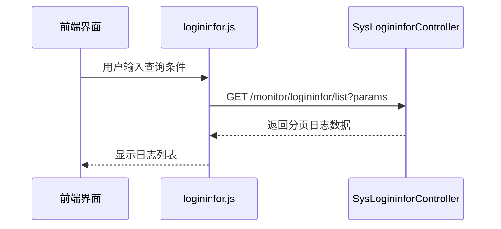
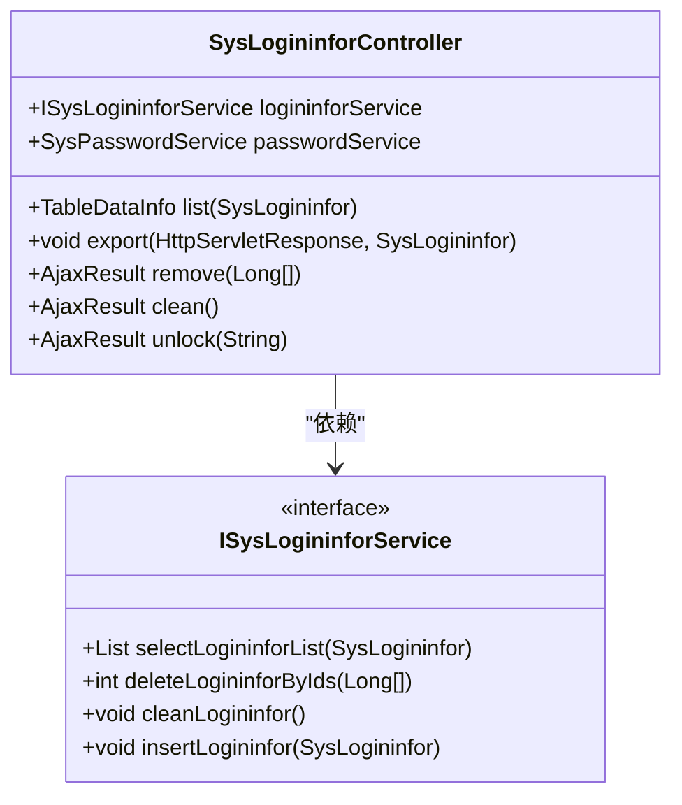
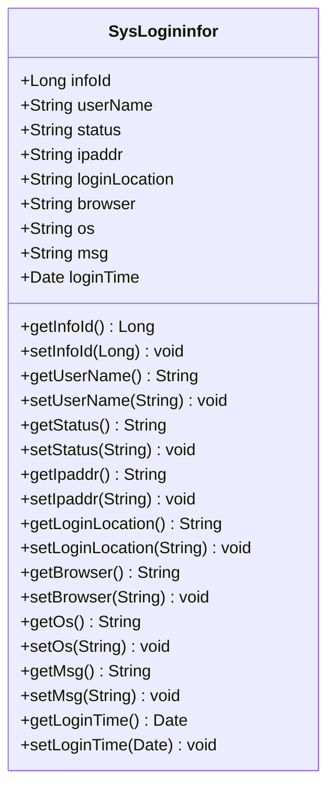
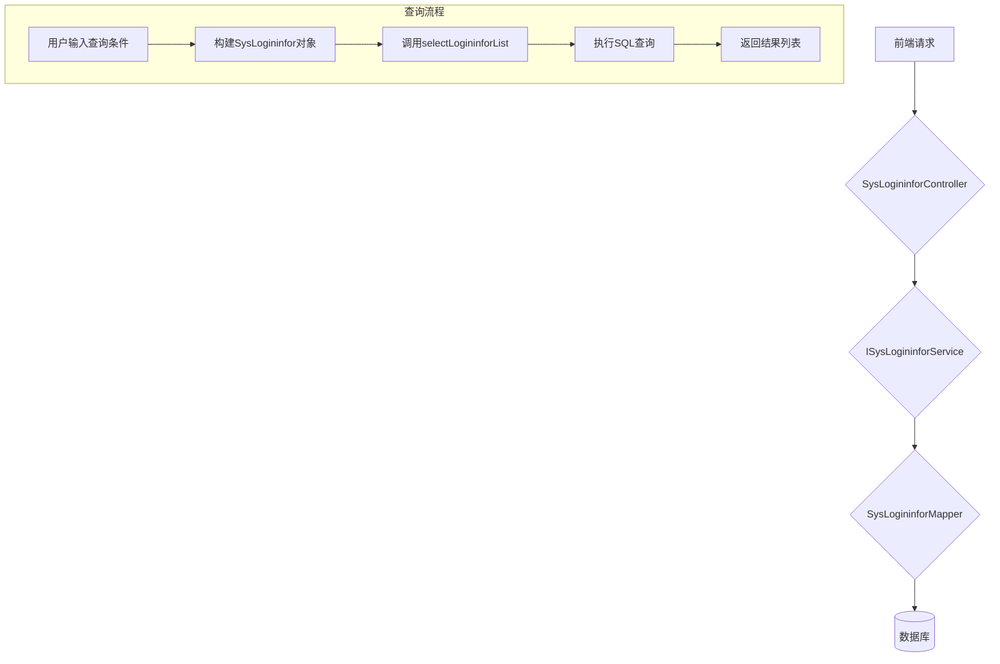
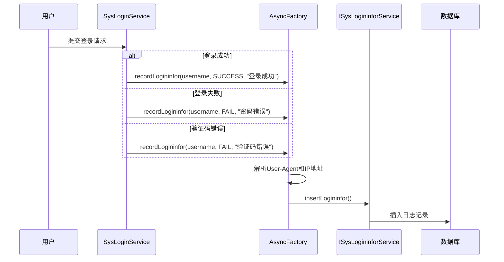
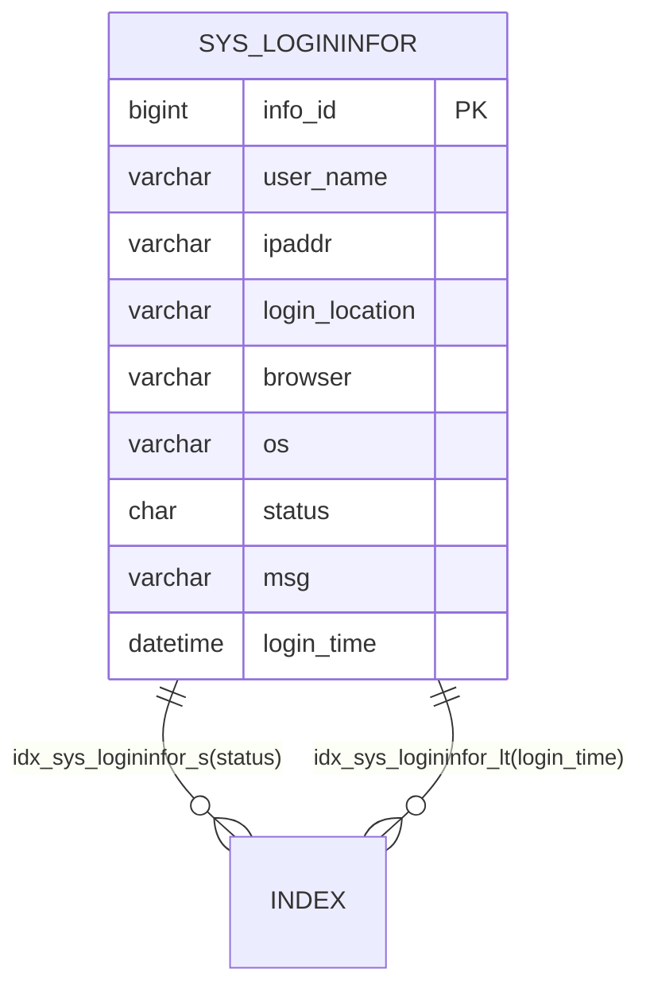
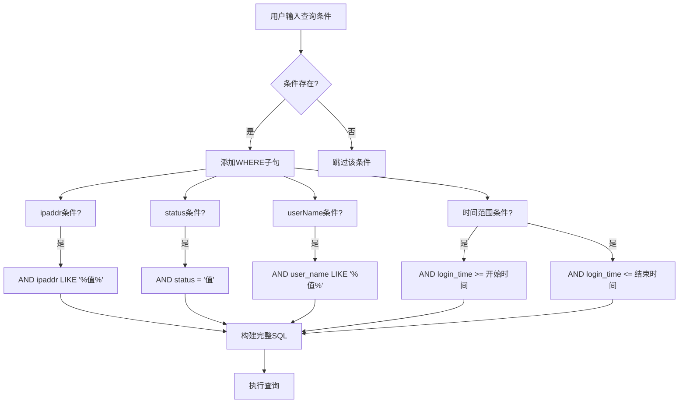
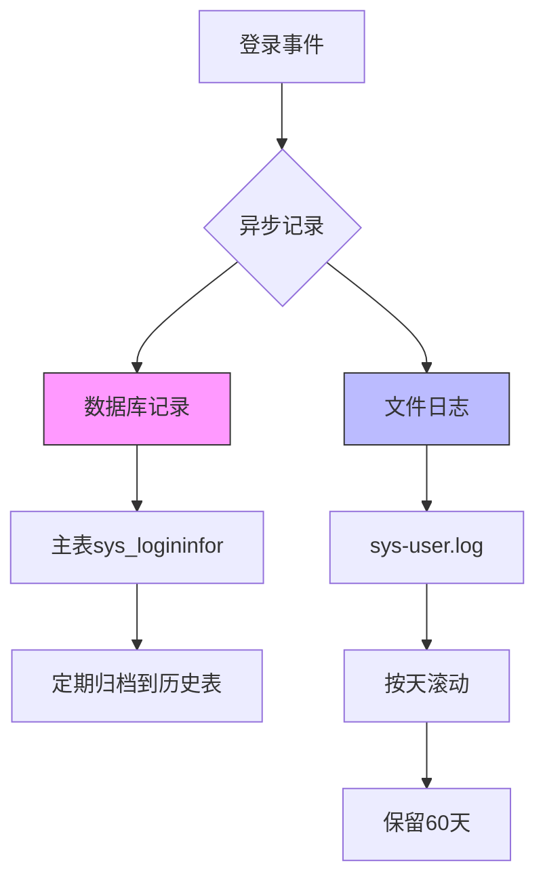

# 登录日志API

<cite>
**本文档引用的文件**
- [logininfor.js](file://bear-jia-vue3\src\api\monitor\logininfor.js)
- [index.vue](file://bear-jia-vue3\src\views\monitor\logininfor\index.vue)
- [detailModal.vue](file://bear-jia-vue3\src\views\monitor\logininfor\detailModal.vue)
- [SysLogininfor.java](file://bearjia-admin-backend\src\main\java\com\javaxiaobear\module\monitor\domain\SysLogininfor.java)
- [SysLogininforController.java](file://bearjia-admin-backend\src\main\java\com\javaxiaobear\module\monitor\controller\SysLogininforController.java)
- [SysLogininforMapper.xml](file://bearjia-admin-backend\src\main\resources\mybatis\monitor\SysLogininforMapper.xml)
- [AsyncFactory.java](file://bearjia-admin-backend\src\main\java\com\javaxiaobear\base\framework\manager\factory\AsyncFactory.java)
- [SysLoginService.java](file://bearjia-admin-backend\src\main\java\com\javaxiaobear\base\framework\security\service\SysLoginService.java)
- [bear_jia.sql](file://bearjia-admin-backend\src\main\resources\sql\bear_jia.sql)
- [logback.xml](file://bearjia-admin-backend\src\main\resources\logback.xml)
</cite>

## 目录
1. [简介](#简介)
2. [前端API调用](#前端api调用)
3. [后端控制器](#后端控制器)
4. [实体类字段说明](#实体类字段说明)
5. [数据访问层](#数据访问层)
6. [日志记录机制](#日志记录机制)
7. [数据库设计与索引](#数据库设计与索引)
8. [日志清理策略](#日志清理策略)
9. [查询条件实现](#查询条件实现)
10. [日志归档方案](#日志归档方案)

## 简介
登录日志API提供了对系统用户登录行为的全面监控和审计功能。该系统记录了所有登录尝试，包括成功和失败的登录，以及验证码错误等场景。通过前端界面和后端服务的协同工作，管理员可以查询、导出和分析登录日志，确保系统的安全性和可追溯性。

**Section sources**
- [index.vue](file://bear-jia-vue3\src\views\monitor\logininfor\index.vue#L1-L100)

## 前端API调用
前端通过`logininfor.js`文件中的`list`函数调用后端API获取登录日志列表。该函数使用GET方法请求`/monitor/logininfor/list`接口，并将查询参数作为请求参数传递。查询参数包括用户账号、IP地址、登录地点、浏览器类型、操作系统、登录状态、提示消息和访问时间范围等。

**Diagram sources**
- [logininfor.js](file://bear-jia-vue3\src\api\monitor\logininfor.js#L4-L9)
- [SysLogininforController.java](file://bearjia-admin-backend\src\main\java\com\javaxiaobear\module\monitor\controller\SysLogininforController.java#L38-L45)

**Section sources**
- [logininfor.js](file://bear-jia-vue3\src\api\monitor\logininfor.js#L1-L35)

## 后端控制器
`SysLogininforController`类负责处理登录日志相关的HTTP请求。它提供了分页查询、导出、删除和清空日志的功能。控制器使用Spring Security的`@PreAuthorize`注解进行权限控制，确保只有具有相应权限的用户才能执行操作。`list`方法处理日志查询请求，通过`startPage()`方法实现分页，并调用服务层获取数据。

**Diagram sources**
- [SysLogininforController.java](file://bearjia-admin-backend\src\main\java\com\javaxiaobear\module\monitor\controller\SysLogininforController.java#L1-L82)
- [ISysLogininforService.java](file://bearjia-admin-backend\src\main\java\com\javaxiaobear\module\monitor\service\ISysLogininforService.java#L1-L40)

**Section sources**
- [SysLogininforController.java](file://bearjia-admin-backend\src\main\java\com\javaxiaobear\module\monitor\controller\SysLogininforController.java#L1-L82)

## 实体类字段说明
`SysLogininfor`实体类定义了登录日志的所有字段。主要字段包括：`infoId`（日志ID）、`userName`（用户账号）、`status`（登录状态，0成功，1失败）、`ipaddr`（登录IP地址）、`loginLocation`（登录地点）、`browser`（浏览器类型）、`os`（操作系统）、`msg`（提示消息）和`loginTime`（访问时间）。这些字段通过Excel注解支持导出功能，日期字段使用JsonFormat注解进行格式化。

**Diagram sources**
- [SysLogininfor.java](file://bearjia-admin-backend\src\main\java\com\javaxiaobear\module\monitor\domain\SysLogininfor.java#L1-L116)

**Section sources**
- [SysLogininfor.java](file://bearjia-admin-backend\src\main\java\com\javaxiaobear\module\monitor\domain\SysLogininfor.java#L1-L116)

## 数据访问层
`SysLogininforMapper`接口定义了对登录日志数据的CRUD操作。对应的`SysLogininforMapper.xml`文件包含了SQL查询语句，实现了基于多条件的动态查询。查询语句支持用户账号、IP地址、登录状态和时间范围的过滤，并按日志ID降序排列。删除操作支持批量删除，清空操作使用TRUNCATE TABLE语句。

**Diagram sources**
- [SysLogininforMapper.java](file://bearjia-admin-backend\src\main\java\com\javaxiaobear\module\monitor\mapper\SysLogininforMapper.java#L1-L42)
- [SysLogininforMapper.xml](file://bearjia-admin-backend\src\main\resources\mybatis\monitor\SysLogininforMapper.xml#L25-L57)

**Section sources**
- [SysLogininforMapper.java](file://bearjia-admin-backend\src\main\java\com\javaxiaobear\module\monitor\mapper\SysLogininforMapper.java#L1-L42)
- [SysLogininforMapper.xml](file://bearjia-admin-backend\src\main\resources\mybatis\monitor\SysLogininforMapper.xml#L25-L57)

## 日志记录机制
系统通过`AsyncFactory.recordLogininfor`方法异步记录登录日志。该方法在用户登录成功、登录失败或验证码错误时被调用。它从HTTP请求中提取User-Agent信息，解析出浏览器和操作系统类型，并通过IP地址服务获取真实的地理位置。日志信息首先写入系统日志文件（sys-user.log），然后封装成`SysLogininfor`对象并持久化到数据库。

**Diagram sources**
- [AsyncFactory.java](file://bearjia-admin-backend\src\main\java\com\javaxiaobear\base\framework\manager\factory\AsyncFactory.java#L37-L81)
- [SysLoginService.java](file://bearjia-admin-backend\src\main\java\com\javaxiaobear\base\framework\security\service\SysLoginService.java#L96-L128)

**Section sources**
- [AsyncFactory.java](file://bearjia-admin-backend\src\main\java\com\javaxiaobear\base\framework\manager\factory\AsyncFactory.java#L37-L81)
- [SysLoginService.java](file://bearjia-admin-backend\src\main\java\com\javaxiaobear\base\framework\security\service\SysLoginService.java#L90-L153)

## 数据库设计与索引
登录日志表`sys_logininfor`在数据库中设计了适当的索引以优化查询性能。表结构包含`idx_sys_logininfor_s`索引（基于`status`字段）和`idx_sys_logininfor_lt`索引（基于`login_time`字段）。这些索引显著提高了按登录状态和时间范围查询的效率，特别是在处理大规模日志数据时。

**Diagram sources**
- [bear_jia.sql](file://bearjia-admin-backend\src\main\resources\sql\bear_jia.sql#L329-L341)

**Section sources**
- [bear_jia.sql](file://bearjia-admin-backend\src\main\resources\sql\bear_jia.sql#L329-L341)

## 日志清理策略
系统提供了两种日志清理方式：批量删除和清空所有日志。批量删除通过`deleteLogininforByIds`方法实现，接受日志ID数组作为参数。清空操作通过`cleanLogininfor`方法实现，使用TRUNCATE TABLE语句快速删除表中所有数据。这两种操作都受到权限控制，只有具有`monitor:logininfor:remove`权限的用户才能执行。

**Section sources**
- [SysLogininforController.java](file://bearjia-admin-backend\src\main\java\com\javaxiaobear\module\monitor\controller\SysLogininforController.java#L64-L72)
- [SysLogininforMapper.xml](file://bearjia-admin-backend\src\main\resources\mybatis\monitor\SysLogininforMapper.xml#L53-L55)

## 查询条件实现
登录日志查询支持多种过滤条件的组合。前端通过`searchFields`配置定义了所有可查询字段，包括用户账号、IP地址、登录地点、浏览器、操作系统、登录状态、提示消息和访问时间范围。后端的MyBatis映射文件使用动态SQL（`<if>`标签）根据提供的参数构建查询条件，实现了灵活的多条件过滤。

**Diagram sources**
- [index.vue](file://bear-jia-vue3\src\views\monitor\logininfor\index.vue#L72-L81)
- [SysLogininforMapper.xml](file://bearjia-admin-backend\src\main\resources\mybatis\monitor\SysLogininforMapper.xml#L27-L42)

**Section sources**
- [index.vue](file://bear-jia-vue3\src\views\monitor\logininfor\index.vue#L72-L81)
- [SysLogininforMapper.xml](file://bearjia-admin-backend\src\main\resources\mybatis\monitor\SysLogininforMapper.xml#L25-L42)

## 日志归档方案
系统采用多层日志归档策略。首先，所有登录日志同时记录到数据库和文件系统。文件日志存储在`sys-user.log`中，并按天滚动归档，保留最近60天的日志文件。其次，数据库中的日志可以根据业务需求定期归档到历史表或数据仓库。对于大规模日志查询，建议使用数据库索引和分页查询，避免一次性加载过多数据影响系统性能。

**Diagram sources**
- [logback.xml](file://bearjia-admin-backend\src\main\resources\logback.xml#L60-L72)
- [bear_jia.sql](file://bearjia-admin-backend\src\main\resources\sql\bear_jia.sql#L329-L341)

**Section sources**
- [logback.xml](file://bearjia-admin-backend\src\main\resources\logback.xml#L60-L72)
- [bear_jia.sql](file://bearjia-admin-backend\src\main\resources\sql\bear_jia.sql#L329-L341)