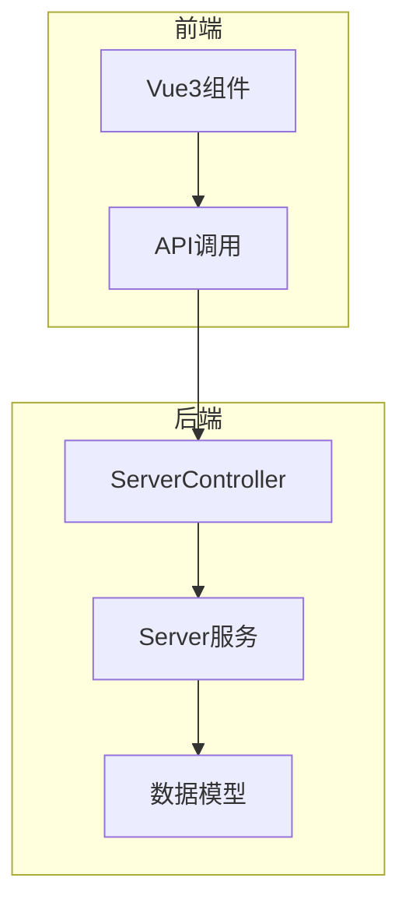
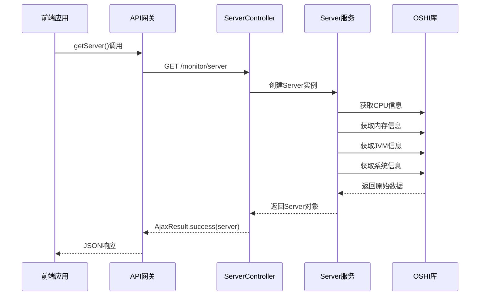
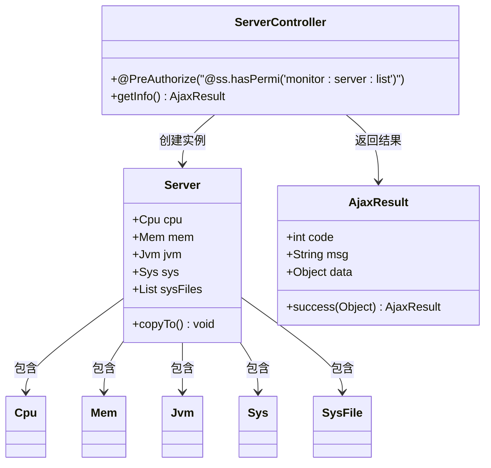
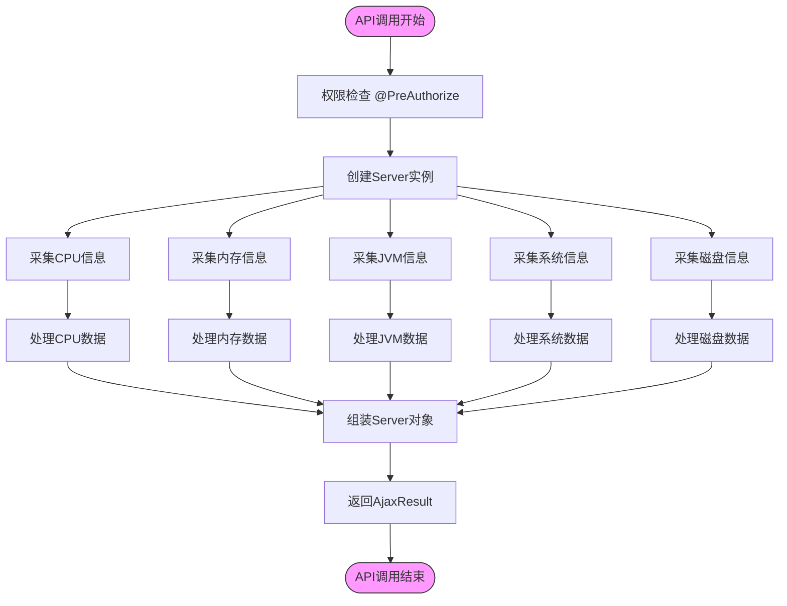
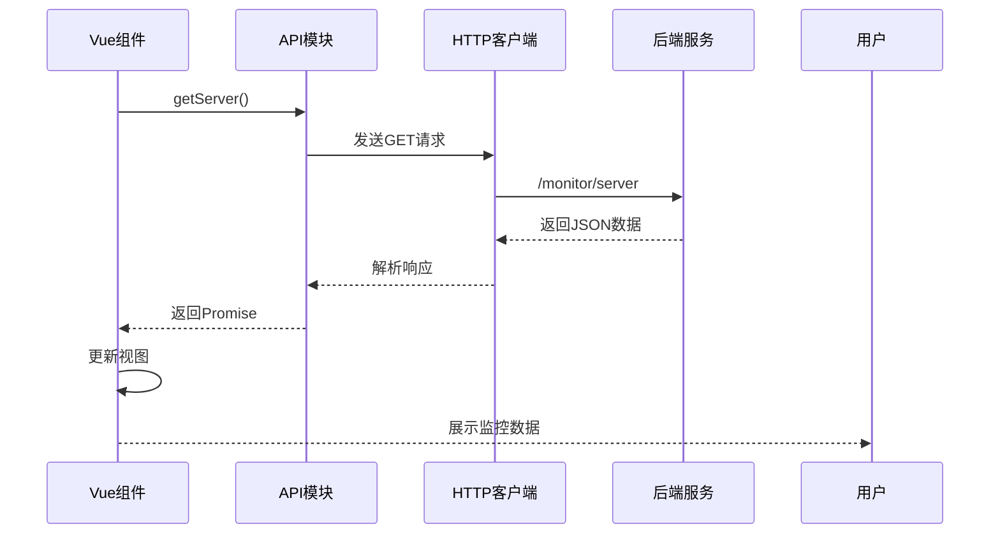
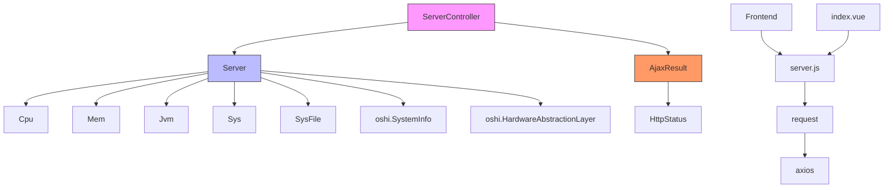

# 服务监控API

<cite>
**本文档引用的文件**
- [ServerController.java](file://bearjia-admin-backend/src/main/java/com/javaxiaobear/module/monitor/controller/ServerController.java)
- [server.js](file://bear-jia-vue3/src/api/monitor/server.js)
- [Server.java](file://bearjia-admin-backend/src/main/java/com/javaxiaobear/base/framework/web/domain/Server.java)
- [Cpu.java](file://bearjia-admin-backend/src/main/java/com/javaxiaobear/base/framework/web/domain/server/Cpu.java)
- [Mem.java](file://bearjia-admin-backend/src/main/java/com/javaxiaobear/base/framework/web/domain/server/Mem.java)
- [Jvm.java](file://bearjia-admin-backend/src/main/java/com/javaxiaobear/base/framework/web/domain/server/Jvm.java)
- [Sys.java](file://bearjia-admin-backend/src/main/java/com/javaxiaobear/base/framework/web/domain/server/Sys.java)
- [SysFile.java](file://bearjia-admin-backend/src/main/java/com/javaxiaobear/base/framework/web/domain/server/SysFile.java)
- [AjaxResult.java](file://bearjia-admin-backend/src/main/java/com/javaxiaobear/base/framework/web/domain/AjaxResult.java)
- [index.vue](file://bear-jia-vue3/src/views/monitor/server/index.vue)
</cite>

## 目录
1. [简介](#简介)
2. [项目结构](#项目结构)
3. [核心组件](#核心组件)
4. [架构概述](#架构概述)
5. [详细组件分析](#详细组件分析)
6. [依赖分析](#依赖分析)
7. [性能考虑](#性能考虑)
8. [故障排除指南](#故障排除指南)
9. [结论](#结论)

## 简介
服务监控API提供了一套完整的服务器状态监控解决方案，能够实时采集和返回服务器的CPU、内存、JVM、系统信息等关键性能指标。该API通过后端ServerController的getInfo()接口实现数据采集，前端通过getServer() API调用获取监控数据。系统采用Spring Security进行权限控制，确保只有授权用户才能访问敏感的服务器信息。监控数据以结构化JSON格式返回，包含详细的性能指标字段，便于前端展示和分析。

## 项目结构
服务监控功能分布在前后端两个主要模块中。后端监控功能位于`bearjia-admin-backend`项目的`module/monitor`包中，包含控制器、服务和数据模型。前端监控功能位于`bear-jia-vue3`项目的`src/views/monitor/server`目录中，包含视图组件和API调用。

**图表来源**
- [ServerController.java](file://bearjia-admin-backend/src/main/java/com/javaxiaobear/module/monitor/controller/ServerController.java#L1-L28)
- [server.js](file://bear-jia-vue3/src/api/monitor/server.js#L1-L9)
- [index.vue](file://bear-jia-vue3/src/views/monitor/server/index.vue#L94-L158)

**章节来源**
- [ServerController.java](file://bearjia-admin-backend/src/main/java/com/javaxiaobear/module/monitor/controller/ServerController.java#L1-L28)
- [server.js](file://bear-jia-vue3/src/api/monitor/server.js#L1-L9)

## 核心组件
服务监控API的核心组件包括后端的ServerController控制器、Server数据模型以及前端的API调用和视图组件。ServerController负责处理HTTP请求并返回服务器状态信息，Server类封装了CPU、内存、JVM等所有监控数据。前端通过API调用获取数据并在视图中展示。整个系统基于Spring Boot框架构建，利用OSHI库获取底层系统信息，确保数据的准确性和实时性。

**章节来源**
- [ServerController.java](file://bearjia-admin-backend/src/main/java/com/javaxiaobear/module/monitor/controller/ServerController.java#L1-L28)
- [Server.java](file://bearjia-admin-backend/src/main/java/com/javaxiaobear/base/framework/web/domain/Server.java#L1-L241)

## 架构概述
服务监控API采用典型的前后端分离架构。前端Vue3应用通过HTTP API调用后端Spring Boot服务，后端服务采集服务器各项性能指标并返回结构化数据。系统使用OSHI（Operating System and Hardware Information）库获取底层硬件和操作系统信息，确保跨平台兼容性。

**图表来源**
- [ServerController.java](file://bearjia-admin-backend/src/main/java/com/javaxiaobear/module/monitor/controller/ServerController.java#L1-L28)
- [Server.java](file://bearjia-admin-backend/src/main/java/com/javaxiaobear/base/framework/web/domain/Server.java#L1-L241)

## 详细组件分析

### ServerController分析
ServerController是服务监控API的后端入口点，负责处理服务器状态信息的请求。该控制器实现了getInfo()方法，通过创建Server实例并调用copyTo()方法来收集所有监控数据。

**图表来源**
- [ServerController.java](file://bearjia-admin-backend/src/main/java/com/javaxiaobear/module/monitor/controller/ServerController.java#L1-L28)
- [Server.java](file://bearjia-admin-backend/src/main/java/com/javaxiaobear/base/framework/web/domain/Server.java#L1-L241)
- [AjaxResult.java](file://bearjia-admin-backend/src/main/java/com/javaxiaobear/base/framework/web/domain/AjaxResult.java#L1-L217)

**章节来源**
- [ServerController.java](file://bearjia-admin-backend/src/main/java/com/javaxiaobear/module/monitor/controller/ServerController.java#L1-L28)

### 数据采集流程分析
服务监控API的数据采集流程涉及多个组件的协同工作，从底层硬件信息采集到上层数据封装。

**图表来源**
- [Server.java](file://bearjia-admin-backend/src/main/java/com/javaxiaobear/base/framework/web/domain/Server.java#L108-L240)
- [Cpu.java](file://bearjia-admin-backend/src/main/java/com/javaxiaobear/base/framework/web/domain/server/Cpu.java#L127-L148)
- [Mem.java](file://bearjia-admin-backend/src/main/java/com/javaxiaobear/base/framework/web/domain/server/Mem.java#L153-L158)
- [Jvm.java](file://bearjia-admin-backend/src/main/java/com/javaxiaobear/base/framework/web/domain/server/Jvm.java#L176-L184)
- [Sys.java](file://bearjia-admin-backend/src/main/java/com/javaxiaobear/base/framework/web/domain/server/Sys.java#L163-L171)

**章节来源**
- [Server.java](file://bearjia-admin-backend/src/main/java/com/javaxiaobear/base/framework/web/domain/Server.java#L108-L240)

### 前端调用分析
前端通过专门的API模块调用服务监控接口，并在视图组件中展示返回的数据。

**图表来源**
- [server.js](file://bear-jia-vue3/src/api/monitor/server.js#L1-L9)
- [index.vue](file://bear-jia-vue3/src/views/monitor/server/index.vue#L94-L158)
- [request.js](file://bear-jia-vue3/src/utils/request.js#L1-L50)

**章节来源**
- [server.js](file://bear-jia-vue3/src/api/monitor/server.js#L1-L9)
- [index.vue](file://bear-jia-vue3/src/views/monitor/server/index.vue#L94-L158)

## 依赖分析
服务监控API依赖于多个核心组件和第三方库，形成了清晰的依赖关系。

**图表来源**
- [ServerController.java](file://bearjia-admin-backend/src/main/java/com/javaxiaobear/module/monitor/controller/ServerController.java#L1-L28)
- [Server.java](file://bearjia-admin-backend/src/main/java/com/javaxiaobear/base/framework/web/domain/Server.java#L1-L241)
- [AjaxResult.java](file://bearjia-admin-backend/src/main/java/com/javaxiaobear/base/framework/web/domain/AjaxResult.java#L1-L217)
- [server.js](file://bear-jia-vue3/src/api/monitor/server.js#L1-L9)

**章节来源**
- [ServerController.java](file://bearjia-admin-backend/src/main/java/com/javaxiaobear/module/monitor/controller/ServerController.java#L1-L28)
- [Server.java](file://bearjia-admin-backend/src/main/java/com/javaxiaobear/base/framework/web/domain/Server.java#L1-L241)

## 性能考虑
服务监控API在设计时考虑了性能优化，通过合理的数据采集频率和传输优化来减少系统开销。建议前端设置合理的轮询间隔（如30秒），避免过于频繁的请求。后端使用OSHI库进行系统信息采集，该库经过优化，对系统性能影响较小。对于大数据量的传输，可以考虑启用GZIP压缩。此外，对于不需要实时更新的静态信息（如服务器名称、操作系统等），前端可以进行本地缓存，减少不必要的API调用。

## 故障排除指南
当服务监控API出现问题时，可以从以下几个方面进行排查：首先检查权限配置，确保用户具有`monitor:server:list`权限；其次检查后端服务是否正常运行，查看相关日志；然后确认OSHI库是否正确加载，特别是在某些特殊操作系统环境下；最后检查网络连接和防火墙设置，确保前后端通信正常。对于数据不准确的问题，可以检查OSHI库的版本兼容性，或查看系统资源占用情况。

**章节来源**
- [ServerController.java](file://bearjia-admin-backend/src/main/java/com/javaxiaobear/module/monitor/controller/ServerController.java#L19-L21)
- [server.js](file://bear-jia-vue3/src/api/monitor/server.js#L1-L9)

## 结论
服务监控API提供了一套完整、安全、高效的服务器状态监控解决方案。通过精心设计的前后端架构和合理的权限控制，系统能够实时采集和展示关键性能指标。API设计遵循RESTful原则，返回结构化的JSON数据，便于前端集成和展示。系统采用OSHI库确保跨平台兼容性，同时通过合理的性能优化措施，最大限度地减少了对被监控系统的影响。该API可广泛应用于各种需要服务器监控的场景，为系统运维提供有力支持。