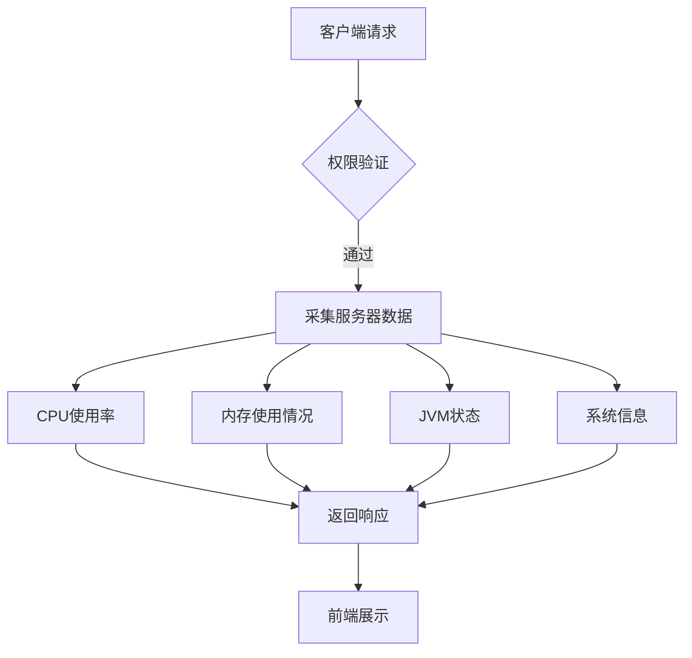
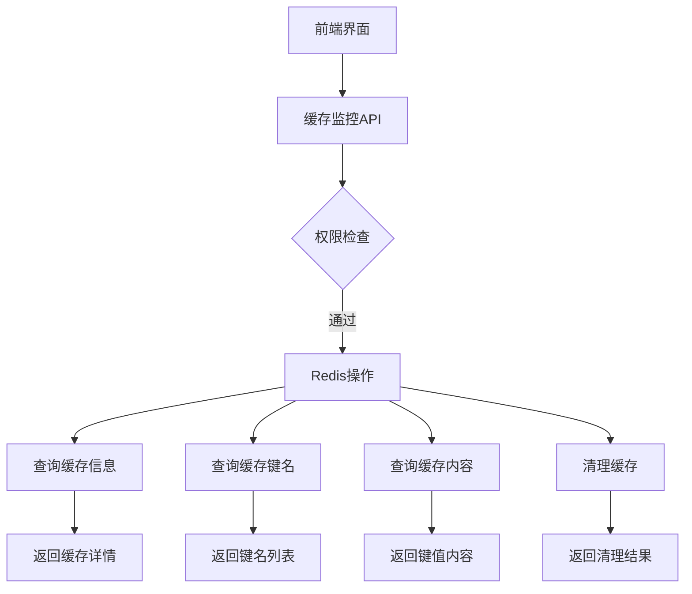
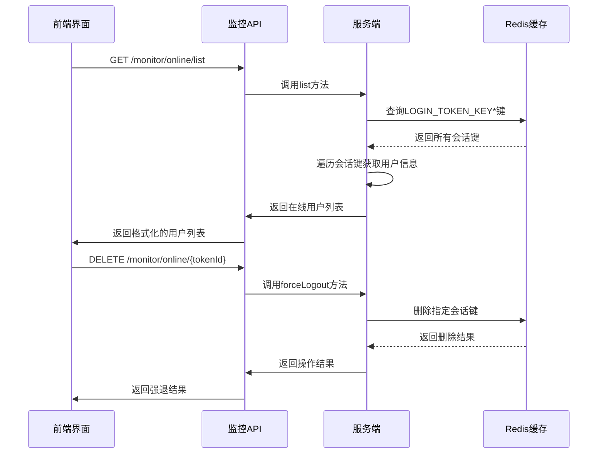
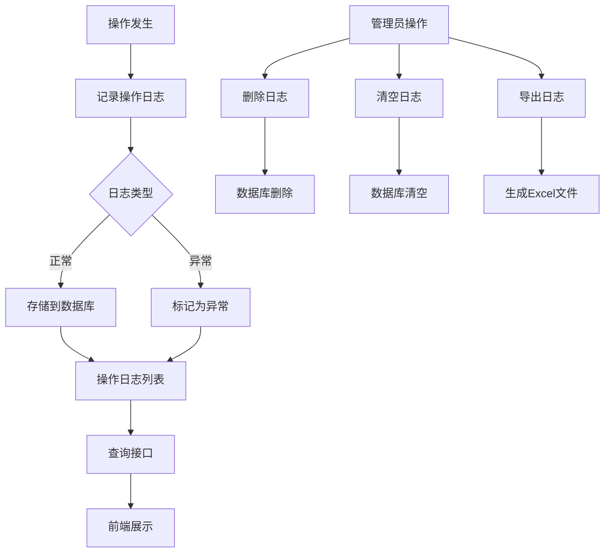
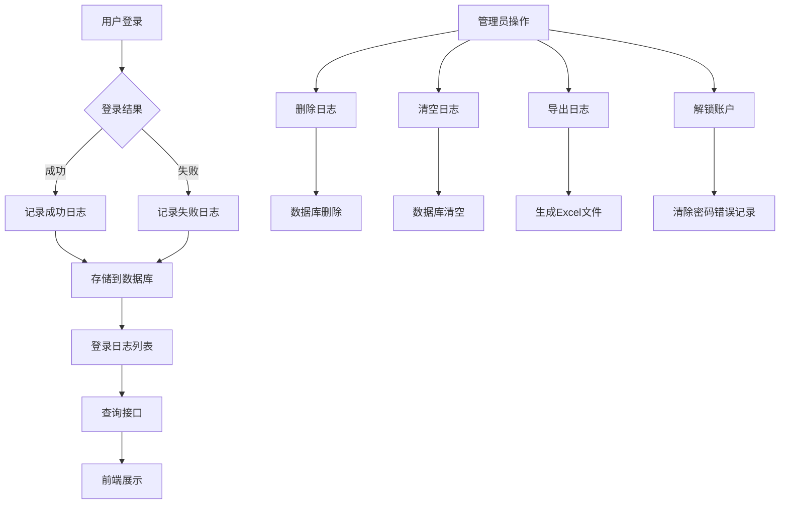
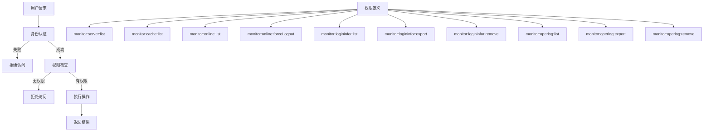
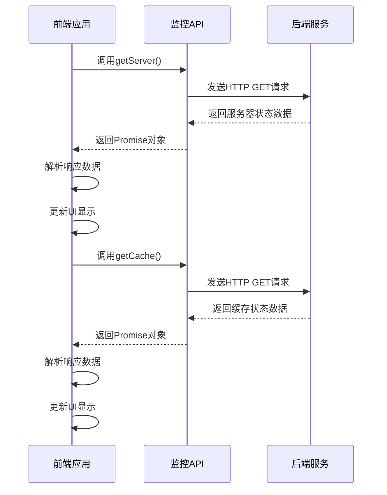

# 系统监控API

<cite>
**本文档引用的文件**   
- [cache.js](file://bear-jia-vue3/src/api/monitor/cache.js)
- [server.js](file://bear-jia-vue3/src/api/monitor/server.js)
- [online.js](file://bear-jia-vue3/src/api/monitor/online.js)
- [logininfor.js](file://bear-jia-vue3/src/api/monitor/logininfor.js)
- [operlog.js](file://bear-jia-vue3/src/api/monitor/operlog.js)
- [CacheController.java](file://bearjia-admin-backend/src/main/java/com/javaxiaobear/module/monitor/controller/CacheController.java)
- [ServerController.java](file://bearjia-admin-backend/src/main/java/com/javaxiaobear/module/monitor/controller/ServerController.java)
- [SysUserOnlineController.java](file://bearjia-admin-backend/src/main/java/com/javaxiaobear/module/monitor/controller/SysUserOnlineController.java)
- [SysLogininforController.java](file://bearjia-admin-backend/src/main/java/com/javaxiaobear/module/monitor/controller/SysLogininforController.java)
- [SysOperlogController.java](file://bearjia-admin-backend/src/main/java/com/javaxiaobear/module/monitor/controller/SysOperlogController.java)
- [index.vue](file://bear-jia-vue3/src/views/monitor/server/index.vue)
- [index.vue](file://bear-jia-vue3/src/views/monitor/online/index.vue)
- [index.vue](file://bear-jia-vue3/src/views/monitor/logininfor/index.vue)
- [index.vue](file://bear-jia-vue3/src/views/monitor/operlog/index.vue)
- [index.vue](file://bear-jia-vue3/src/views/monitor/cache/index.vue)
</cite>

## 目录
1. [系统监控API](#系统监控api)
2. [服务监控](#服务监控)
3. [缓存监控](#缓存监控)
4. [在线用户](#在线用户)
5. [操作日志](#操作日志)
6. [登录日志](#登录日志)
7. [安全访问策略](#安全访问策略)
8. [性能监控接口调用示例](#性能监控接口调用示例)

## 服务监控

服务监控接口提供服务器的实时状态信息，包括CPU、内存、JVM等关键性能指标。该接口通过定时采集服务器数据，为系统管理员提供全面的系统健康状况视图。



**图示来源**
- [server.js](file://bear-jia-vue3/src/api/monitor/server.js#L3-L9)
- [ServerController.java](file://bearjia-admin-backend/src/main/java/com/javaxiaobear/module/monitor/controller/ServerController.java#L19-L27)

**服务监控接口详情**

| 接口名称 | HTTP方法 | URL | 请求参数 | 响应格式 |
|--------|--------|-----|---------|--------|
| 查询服务器详细信息 | GET | /monitor/server | 无 | JSON格式的服务器状态数据，包含CPU、内存、JVM等信息 |

服务状态数据的采集频率为实时采集，每次API调用时都会重新获取最新的服务器状态。返回的结构包含以下主要部分：
- **CPU信息**：CPU使用率、核心数、系统负载等
- **内存信息**：总内存、已用内存、空闲内存、内存使用率
- **JVM信息**：堆内存、非堆内存、GC情况、线程数
- **系统信息**：操作系统、系统架构、运行时间等

**接口调用示例**
```javascript
import { getServer } from '@/api/monitor/server'

// 获取服务器信息
getServer().then(response => {
  console.log('服务器信息:', response.data)
  // 处理服务器数据
})
```

**Section sources**
- [server.js](file://bear-jia-vue3/src/api/monitor/server.js#L3-L9)
- [ServerController.java](file://bearjia-admin-backend/src/main/java/com/javaxiaobear/module/monitor/controller/ServerController.java#L19-L27)
- [index.vue](file://bear-jia-vue3/src/views/monitor/server/index.vue)

## 缓存监控

缓存监控模块提供对Redis缓存的全面监控功能，包括缓存信息查询、缓存键值管理、缓存清理等操作。系统通过RedisTemplate与Redis服务器交互，实现对缓存的精细化管理。



**图示来源**
- [cache.js](file://bear-jia-vue3/src/api/monitor/cache.js)
- [CacheController.java](file://bearjia-admin-backend/src/main/java/com/javaxiaobear/module/monitor/controller/CacheController.java)

**缓存监控接口详情**

| 接口名称 | HTTP方法 | URL | 请求参数 | 响应格式 |
|--------|--------|-----|---------|--------|
| 查询缓存详细信息 | GET | /monitor/cache | 无 | 包含Redis版本、运行模式、客户端数、内存使用等详细信息的JSON对象 |
| 查询缓存名称列表 | GET | /monitor/cache/getNames | 无 | 预定义缓存名称列表，如用户信息、配置信息、数据字典等 |
| 查询缓存键名列表 | GET | /monitor/cache/getKeys/{cacheName} | cacheName: 缓存名称 | 指定缓存名称下的所有键名列表 |
| 查询缓存内容 | GET | /monitor/cache/getValue/{cacheName}/{cacheKey} | cacheName: 缓存名称, cacheKey: 键名 | 指定键名的缓存内容 |
| 清理指定名称缓存 | DELETE | /monitor/cache/clearCacheName/{cacheName} | cacheName: 缓存名称 | 操作结果状态 |
| 清理指定键名缓存 | DELETE | /monitor/cache/clearCacheKey/{cacheKey} | cacheKey: 键名 | 操作结果状态 |
| 清理全部缓存 | DELETE | /monitor/cache/clearCacheAll | 无 | 操作结果状态 |

缓存信息的获取方式基于Redis的INFO命令和KEYS命令，系统通过RedisTemplate执行相应的Redis操作。刷新机制为按需刷新，即每次用户访问缓存监控页面时都会重新获取最新的缓存状态。

**预定义缓存类型**
- 用户信息缓存 (LOGIN_TOKEN_KEY)
- 配置信息缓存 (SYS_CONFIG_KEY)
- 数据字典缓存 (SYS_DICT_KEY)
- 验证码缓存 (CAPTCHA_CODE_KEY)
- 防重提交缓存 (REPEAT_SUBMIT_KEY)
- 限流处理缓存 (RATE_LIMIT_KEY)
- 密码错误次数缓存 (PWD_ERR_CNT_KEY)

**Section sources**
- [cache.js](file://bear-jia-vue3/src/api/monitor/cache.js)
- [CacheController.java](file://bearjia-admin-backend/src/main/java/com/javaxiaobear/module/monitor/controller/CacheController.java#L47-L119)
- [index.vue](file://bear-jia-vue3/src/views/monitor/cache/index.vue)

## 在线用户

在线用户监控功能允许系统管理员查看当前所有在线用户的会话信息，并提供强制下线等管理操作。系统通过Redis存储用户会话信息，实现实时的在线用户监控。



**图示来源**
- [online.js](file://bear-jia-vue3/src/api/monitor/online.js)
- [SysUserOnlineController.java](file://bearjia-admin-backend/src/main/java/com/javaxiaobear/module/monitor/controller/SysUserOnlineController.java)

**在线用户接口详情**

| 接口名称 | HTTP方法 | URL | 请求参数 | 响应格式 |
|--------|--------|-----|---------|--------|
| 查询在线用户列表 | GET | /monitor/online/list | ipaddr: IP地址, userName: 用户名 | 分页的在线用户列表，包含会话编号、登录名称、部门名称、登录地址、登录地点、浏览器、操作系统、登录时间等信息 |
| 强制用户下线 | DELETE | /monitor/online/{tokenId} | tokenId: 会话编号 | 操作结果状态 |

在线用户会话管理API通过查询Redis中以"LOGIN_TOKEN_KEY"为前缀的所有键来获取当前在线用户列表。每个会话键对应一个用户登录信息，系统通过遍历这些键来构建在线用户列表。

**强制下线流程**
1. 管理员在前端界面选择需要强制下线的用户
2. 前端调用forceLogout API，传入用户的tokenId
3. 后端服务从Redis中删除对应的会话键
4. 用户下次请求时因会话失效而被重定向到登录页面

**Section sources**
- [online.js](file://bear-jia-vue3/src/api/monitor/online.js)
- [SysUserOnlineController.java](file://bearjia-admin-backend/src/main/java/com/javaxiaobear/module/monitor/controller/SysUserOnlineController.java#L41-L83)
- [index.vue](file://bear-jia-vue3/src/views/monitor/online/index.vue)

## 操作日志

操作日志模块记录系统中所有重要的业务操作，为系统审计和问题排查提供数据支持。管理员可以通过多种条件查询操作日志，并执行导出、删除等管理操作。



**图示来源**
- [operlog.js](file://bear-jia-vue3/src/api/monitor/operlog.js)
- [SysOperlogController.java](file://bearjia-admin-backend/src/main/java/com/javaxiaobear/module/monitor/controller/SysOperlogController.java)

**操作日志接口详情**

| 接口名称 | HTTP方法 | URL | 请求参数 | 响应格式 |
|--------|--------|-----|---------|--------|
| 查询操作日志列表 | GET | /monitor/operlog/list | title: 系统模块, businessType: 操作类型, operName: 操作人员, status: 操作状态, operTimeRange: 操作时间范围 | 分页的操作日志列表 |
| 删除操作日志 | DELETE | /monitor/operlog/{operIds} | operIds: 日志ID数组 | 删除操作结果 |
| 清空操作日志 | DELETE | /monitor/operlog/clean | 无 | 清空操作结果 |
| 导出操作日志 | POST | /monitor/operlog/export | title: 系统模块, businessType: 操作类型, operName: 操作人员, status: 操作状态, operTimeRange: 操作时间范围 | Excel文件流 |

操作日志查询接口支持多种过滤条件，包括：
- **系统模块**：根据操作所属的系统模块进行过滤
- **操作类型**：根据字典值过滤，如新增、修改、删除、授权等
- **操作人员**：根据操作人员账号进行过滤
- **操作状态**：成功或失败
- **操作时间范围**：支持时间段筛选

**Section sources**
- [operlog.js](file://bear-jia-vue3/src/api/monitor/operlog.js)
- [SysOperlogController.java](file://bearjia-admin-backend/src/main/java/com/javaxiaobear/module/monitor/controller/SysOperlogController.java#L34-L69)
- [index.vue](file://bear-jia-vue3/src/views/monitor/operlog/index.vue)

## 登录日志

登录日志模块记录所有用户的登录活动，包括成功和失败的登录尝试。该功能对于安全审计、异常登录检测和账户管理至关重要。



**图示来源**
- [logininfor.js](file://bear-jia-vue3/src/api/monitor/logininfor.js)
- [SysLogininforController.java](file://bearjia-admin-backend/src/main/java/com/javaxiaobear/module/monitor/controller/SysLogininforController.java)

**登录日志接口详情**

| 接口名称 | HTTP方法 | URL | 请求参数 | 响应格式 |
|--------|--------|-----|---------|--------|
| 查询登录日志列表 | GET | /monitor/logininfor/list | userName: 用户账号, ipaddr: 登录IP地址, loginLocation: 登录地点, browser: 浏览器类型, os: 操作系统, status: 登录状态, msg: 提示消息, loginTimeRange: 访问时间范围 | 分页的登录日志列表 |
| 删除登录日志 | DELETE | /monitor/logininfor/{infoIds} | infoIds: 日志ID数组 | 删除操作结果 |
| 清空登录日志 | DELETE | /monitor/logininfor/clean | 无 | 清空操作结果 |
| 导出登录日志 | POST | /monitor/logininfor/export | 查询参数同列表接口 | Excel文件流 |
| 解锁账户 | GET | /monitor/logininfor/unlock/{userName} | userName: 用户名 | 解锁操作结果 |

登录日志查询接口支持多种过滤条件，包括：
- **用户账号**：根据用户名进行精确或模糊搜索
- **登录IP地址**：根据IP地址进行过滤
- **登录地点**：根据地理位置信息过滤
- **浏览器类型**：根据浏览器标识过滤
- **操作系统**：根据操作系统类型过滤
- **登录状态**：成功或失败
- **提示消息**：包含特定关键词的日志
- **访问时间范围**：支持时间段筛选

**账户解锁功能**
当用户因多次密码错误被锁定时，管理员可以通过调用解锁接口清除该用户的密码错误记录，从而恢复其登录权限。

**Section sources**
- [logininfor.js](file://bear-jia-vue3/src/api/monitor/logininfor.js)
- [SysLogininforController.java](file://bearjia-admin-backend/src/main/java/com/javaxiaobear/module/monitor/controller/SysLogininforController.java#L38-L82)
- [index.vue](file://bear-jia-vue3/src/views/monitor/logininfor/index.vue)

## 安全访问策略

系统监控模块实施严格的安全访问策略，确保只有授权用户才能访问敏感的监控信息。所有监控接口都受到基于角色的访问控制(RBAC)保护。



**图示来源**
- [ServerController.java](file://bearjia-admin-backend/src/main/java/com/javaxiaobear/module/monitor/controller/ServerController.java#L19)
- [CacheController.java](file://bearjia-admin-backend/src/main/java/com/javaxiaobear/module/monitor/controller/CacheController.java#L47)
- [SysUserOnlineController.java](file://bearjia-admin-backend/src/main/java/com/javaxiaobear/module/monitor/controller/SysUserOnlineController.java#L41)
- [SysLogininforController.java](file://bearjia-admin-backend/src/main/java/com/javaxiaobear/module/monitor/controller/SysLogininforController.java#L38)
- [SysOperlogController.java](file://bearjia-admin-backend/src/main/java/com/javaxiaobear/module/monitor/controller/SysOperlogController.java#L34)

**权限控制详情**

| 功能模块 | 权限标识 | 说明 |
|--------|--------|-----|
| 服务监控 | monitor:server:list | 查看服务器状态信息 |
| 缓存监控 | monitor:cache:list | 查看缓存信息、管理缓存 |
| 在线用户列表 | monitor:online:list | 查看在线用户列表 |
| 强制下线 | monitor:online:forceLogout | 强制用户下线 |
| 登录日志列表 | monitor:logininfor:list | 查看登录日志 |
| 登录日志导出 | monitor:logininfor:export | 导出登录日志 |
| 登录日志删除 | monitor:logininfor:remove | 删除登录日志 |
| 操作日志列表 | monitor:operlog:list | 查看操作日志 |
| 操作日志导出 | monitor:operlog:export | 导出操作日志 |
| 操作日志删除 | monitor:operlog:remove | 删除操作日志 |

安全访问策略通过Spring Security的@PreAuthorize注解实现，每个监控接口都有相应的权限要求。系统使用自定义的权限检查器@ss.hasPermi来验证用户是否具有执行特定操作的权限。

**Section sources**
- [ServerController.java](file://bearjia-admin-backend/src/main/java/com/javaxiaobear/module/monitor/controller/ServerController.java#L19)
- [CacheController.java](file://bearjia-admin-backend/src/main/java/com/javaxiaobear/module/monitor/controller/CacheController.java#L47)
- [SysUserOnlineController.java](file://bearjia-admin-backend/src/main/java/com/javaxiaobear/module/monitor/controller/SysUserOnlineController.java#L41)
- [SysLogininforController.java](file://bearjia-admin-backend/src/main/java/com/javaxiaobear/module/monitor/controller/SysLogininforController.java#L38)
- [SysOperlogController.java](file://bearjia-admin-backend/src/main/java/com/javaxiaobear/module/monitor/controller/SysOperlogController.java#L34)

## 性能监控接口调用示例

本节提供性能监控接口的实际调用示例和响应解析方法，帮助开发者正确使用监控API。



**图示来源**
- [server.js](file://bear-jia-vue3/src/api/monitor/server.js)
- [cache.js](file://bear-jia-vue3/src/api/monitor/cache.js)

**服务监控调用示例**

```javascript
import { getServer } from '@/api/monitor/server'

// 获取服务器信息
getServer().then(response => {
  const serverData = response.data
  // 解析CPU信息
  const cpuUsage = serverData.cpu.usedPercent
  const cpuCoreCount = serverData.cpu.cpuNum
  
  // 解析内存信息
  const totalMemory = serverData.mem.total
  const usedMemory = serverData.mem.used
  const memoryUsage = serverData.mem.usage
  
  // 解析JVM信息
  const jvmTotal = serverData.jvm.total
  const jvmUsed = serverData.jvm.used
  const jvmUsage = serverData.jvm.usage
  
  // 解析系统信息
  const systemName = serverData.sys.osName
  const systemArch = serverData.sys.osArch
  const systemIp = serverData.sys.computerIp
  
  // 在UI中显示数据
  updateServerDashboard(cpuUsage, memoryUsage, jvmUsage)
}).catch(error => {
  console.error('获取服务器信息失败:', error)
})
```

**缓存监控调用示例**

```javascript
import { getCache } from '@/api/monitor/cache'

// 获取缓存信息
getCache().then(response => {
  const cacheData = response.data
  
  // 解析Redis基本信息
  const redisVersion = cacheData.info.redis_version
  const redisMode = cacheData.info.redis_mode
  const connectedClients = cacheData.info.connected_clients
  const usedMemory = cacheData.info.used_memory_human
  const usedCpu = parseFloat(cacheData.info.used_cpu_user_children).toFixed(2)
  
  // 解析数据库大小
  const dbSize = cacheData.dbSize
  
  // 解析命令统计
  const commandStats = cacheData.commandStats
  
  // 在UI中显示数据
  updateCacheDashboard(redisVersion, connectedClients, usedMemory, usedCpu)
}).catch(error => {
  console.error('获取缓存信息失败:', error)
})
```

**响应数据解析方法**

1. **检查响应状态**：首先检查response的success字段，确保请求成功
2. **提取数据**：从response.data中提取实际的监控数据
3. **数据转换**：将原始数据转换为适合UI显示的格式
4. **错误处理**：在catch块中处理可能的网络错误或服务器错误
5. **UI更新**：将解析后的数据更新到相应的UI组件中

**最佳实践**
- 使用async/await语法简化异步操作
- 添加适当的加载状态提示
- 实现错误重试机制
- 对敏感数据进行适当的脱敏处理
- 定期轮询获取最新的监控数据

**Section sources**
- [server.js](file://bear-jia-vue3/src/api/monitor/server.js)
- [cache.js](file://bear-jia-vue3/src/api/monitor/cache.js)
- [index.vue](file://bear-jia-vue3/src/views/monitor/server/index.vue)
- [index.vue](file://bear-jia-vue3/src/views/monitor/cache/index.vue)