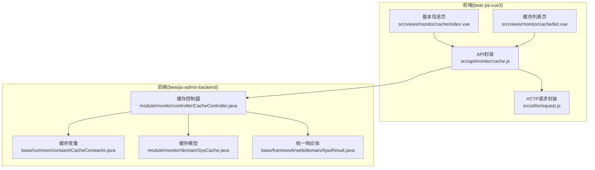
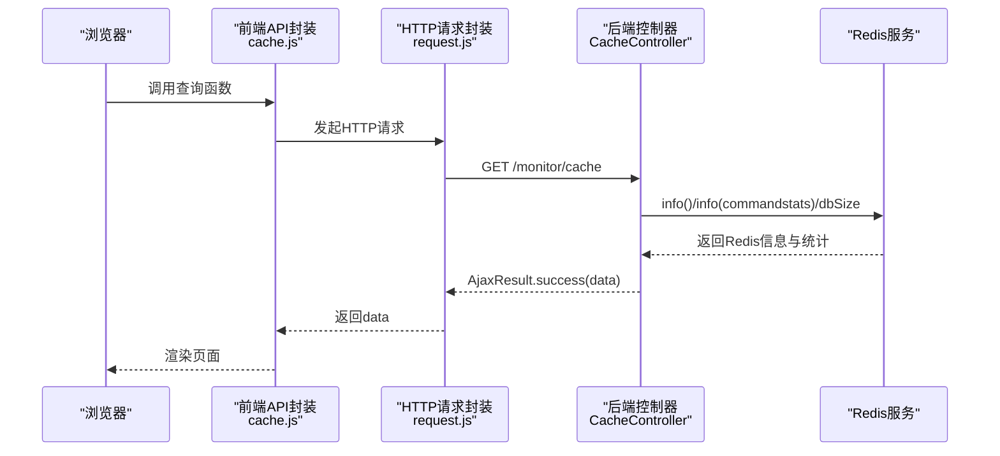
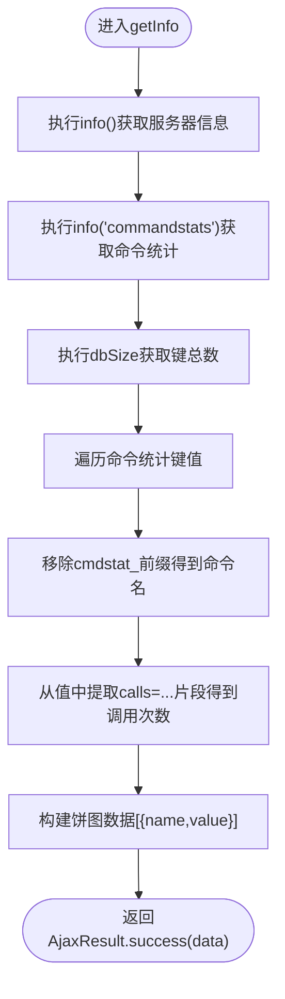
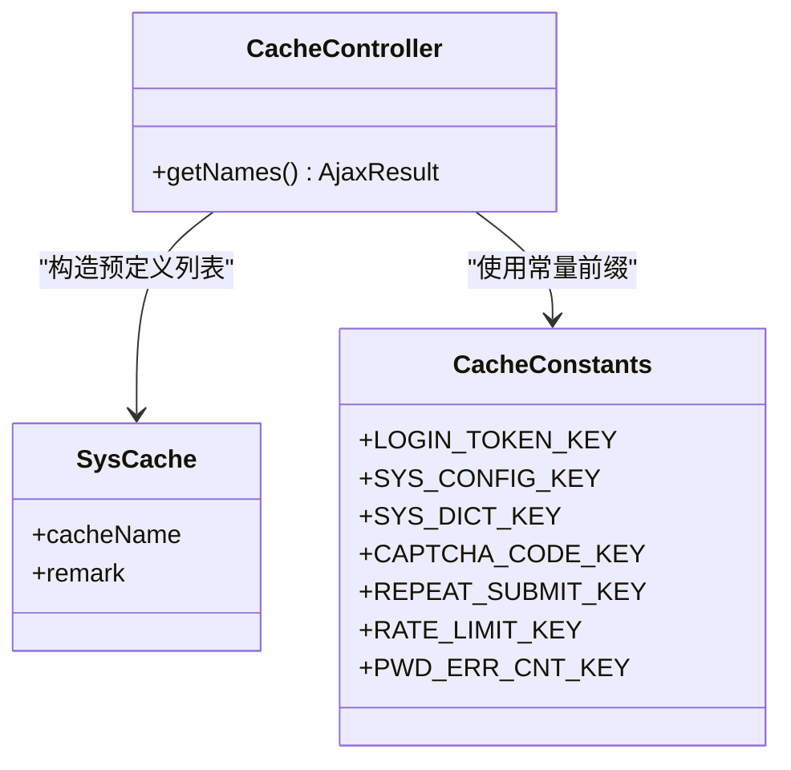
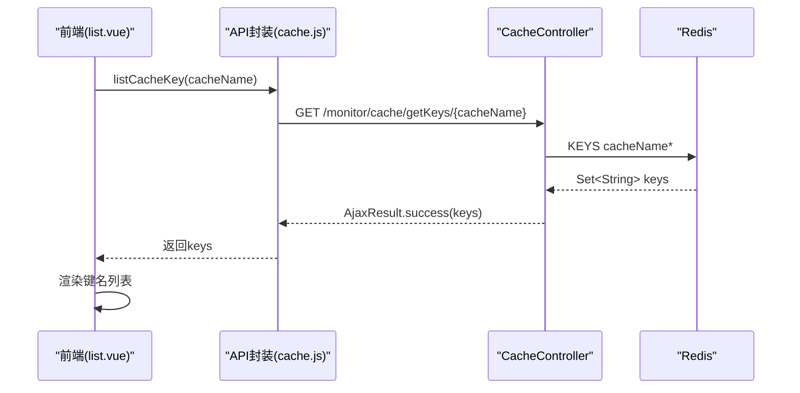
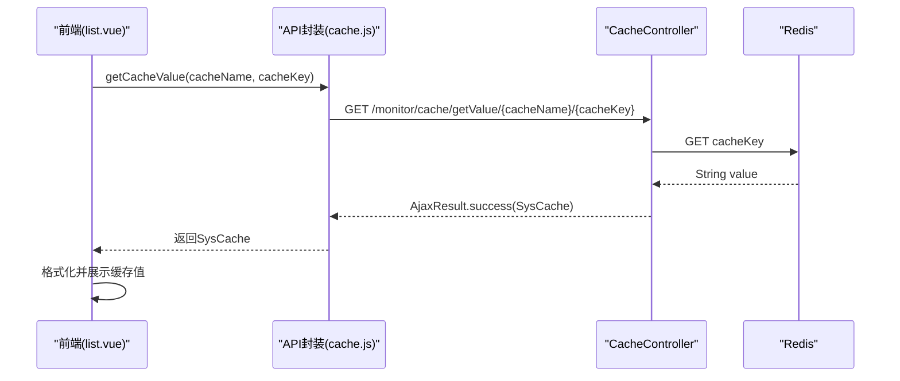
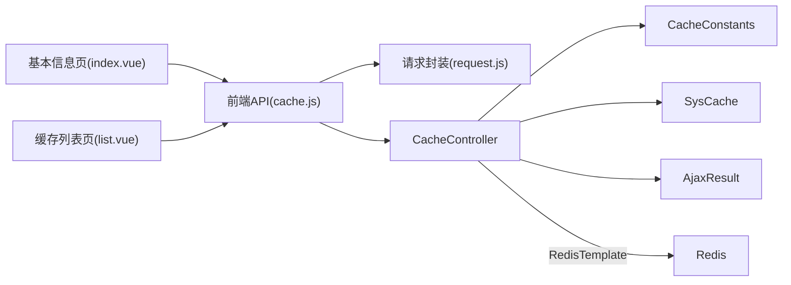

# 缓存查询API

<cite>
**本文引用的文件**
- [cache.js](file://bear-jia-vue3/src/api/monitor/cache.js)
- [index.vue](file://bear-jia-vue3/src/views/monitor/cache/index.vue)
- [list.vue](file://bear-jia-vue3/src/views/monitor/cache/list.vue)
- [CacheController.java](file://bearjia-admin-backend/src/main/java/com/javaxiaobear/module/monitor/controller/CacheController.java)
- [CacheConstants.java](file://bearjia-admin-backend/src/main/java/com/javaxiaobear/base/common/constant/CacheConstants.java)
- [SysCache.java](file://bearjia-admin-backend/src/main/java/com/javaxiaobear/module/monitor/domain/SysCache.java)
- [AjaxResult.java](file://bearjia-admin-backend/src/main/java/com/javaxiaobear/base/framework/web/domain/AjaxResult.java)
- [request.js](file://bear-jia-vue3/src/utils/request.js)
</cite>

## 目录
1. [简介](#简介)
2. [项目结构](#项目结构)
3. [核心组件](#核心组件)
4. [架构总览](#架构总览)
5. [详细组件分析](#详细组件分析)
6. [依赖关系分析](#依赖关系分析)
7. [性能考虑](#性能考虑)
8. [故障排查指南](#故障排查指南)
9. [结论](#结论)
10. [附录](#附录)

## 简介
本文件面向前端与后端开发者，系统性梳理“缓存查询API”的设计与实现，覆盖以下四个查询端点：
- getInfo：获取Redis服务器信息、数据库大小与命令统计
- getNames：返回预定义的缓存类型列表及业务含义
- getKeys：按缓存名称前缀通配符查询键集合
- getValue：按缓存名称与键名获取具体缓存值

同时提供前端API函数getCache、listCacheName、listCacheKey与getCacheValue的使用示例、参数说明、响应数据结构定义与错误处理建议，帮助快速集成与排障。

## 项目结构
该功能在前后端分离架构中分布如下：
- 前端：位于 bear-jia-vue3 工程，包含API封装与两个页面视图（基本信息与缓存列表）
- 后端：位于 bearjia-admin-backend 工程，提供REST接口与Redis交互

图表来源
- [cache.js](file://bear-jia-vue3/src/api/monitor/cache.js#L1-L58)
- [index.vue](file://bear-jia-vue3/src/views/monitor/cache/index.vue#L1-L133)
- [list.vue](file://bear-jia-vue3/src/views/monitor/cache/list.vue#L1-L448)
- [CacheController.java](file://bearjia-admin-backend/src/main/java/com/javaxiaobear/module/monitor/controller/CacheController.java#L1-L120)
- [CacheConstants.java](file://bearjia-admin-backend/src/main/java/com/javaxiaobear/base/common/constant/CacheConstants.java#L1-L45)
- [SysCache.java](file://bearjia-admin-backend/src/main/java/com/javaxiaobear/module/monitor/domain/SysCache.java#L1-L81)
- [AjaxResult.java](file://bearjia-admin-backend/src/main/java/com/javaxiaobear/base/framework/web/domain/AjaxResult.java#L1-L217)
- [request.js](file://bear-jia-vue3/src/utils/request.js#L1-L165)

章节来源
- [cache.js](file://bear-jia-vue3/src/api/monitor/cache.js#L1-L58)
- [index.vue](file://bear-jia-vue3/src/views/monitor/cache/index.vue#L1-L133)
- [list.vue](file://bear-jia-vue3/src/views/monitor/cache/list.vue#L1-L448)
- [CacheController.java](file://bearjia-admin-backend/src/main/java/com/javaxiaobear/module/monitor/controller/CacheController.java#L1-L120)
- [CacheConstants.java](file://bearjia-admin-backend/src/main/java/com/javaxiaobear/base/common/constant/CacheConstants.java#L1-L45)
- [SysCache.java](file://bearjia-admin-backend/src/main/java/com/javaxiaobear/module/monitor/domain/SysCache.java#L1-L81)
- [AjaxResult.java](file://bearjia-admin-backend/src/main/java/com/javaxiaobear/base/framework/web/domain/AjaxResult.java#L1-L217)
- [request.js](file://bear-jia-vue3/src/utils/request.js#L1-L165)

## 核心组件
- 前端API封装：提供四个查询函数与清理函数，统一通过HTTP请求封装层发送请求
- 前端页面视图：
  - 基本信息页：展示Redis基础信息、命令统计饼图与内存使用仪表盘
  - 缓存列表页：展示预定义缓存类型、键名列表与缓存内容详情
- 后端控制器：暴露四个GET端点与三个DELETE端点，基于RedisTemplate访问Redis
- 统一响应体：AjaxResult规范前后端交互的数据结构

章节来源
- [cache.js](file://bear-jia-vue3/src/api/monitor/cache.js#L1-L58)
- [index.vue](file://bear-jia-vue3/src/views/monitor/cache/index.vue#L1-L133)
- [list.vue](file://bear-jia-vue3/src/views/monitor/cache/list.vue#L1-L448)
- [CacheController.java](file://bearjia-admin-backend/src/main/java/com/javaxiaobear/module/monitor/controller/CacheController.java#L1-L120)
- [AjaxResult.java](file://bearjia-admin-backend/src/main/java/com/javaxiaobear/base/framework/web/domain/AjaxResult.java#L1-L217)

## 架构总览
下图展示从浏览器到后端Redis的完整调用链路与数据流向。

图表来源
- [cache.js](file://bear-jia-vue3/src/api/monitor/cache.js#L1-L58)
- [request.js](file://bear-jia-vue3/src/utils/request.js#L1-L165)
- [CacheController.java](file://bearjia-admin-backend/src/main/java/com/javaxiaobear/module/monitor/controller/CacheController.java#L47-L69)

## 详细组件分析

### getInfo 接口：Redis信息、数据库大小与命令统计
- 功能概述
  - 获取Redis服务器信息（版本、运行模式、端口、客户端数、运行时长、内存使用、CPU、AOF/RDB状态等）
  - 获取数据库键总数（dbSize）
  - 解析命令统计（commandStats），提取各命令调用次数，用于可视化展示
- 后端实现要点
  - 使用RedisTemplate执行info()与info("commandstats")，并获取dbSize
  - 遍历commandstats的键集合，按约定格式提取命令名与调用次数，组装为饼图数据
- 前端使用
  - 在基本信息页中调用getCache()，将返回数据绑定到页面组件，渲染命令统计与内存使用
- 命令统计解析逻辑
  - 命令键名形如cmdstat_xxx，值形如calls=...,usec=...
  - 解析步骤：移除前缀cmdstat_得到命令名；从值中截取calls=...片段，提取调用次数
- 响应数据结构
  - data.info：Redis服务器信息键值对
  - data.dbSize：数据库键总数
  - data.commandStats：数组，元素为{name: 命令名, value: 调用次数}

图表来源
- [CacheController.java](file://bearjia-admin-backend/src/main/java/com/javaxiaobear/module/monitor/controller/CacheController.java#L48-L69)
- [index.vue](file://bear-jia-vue3/src/views/monitor/cache/index.vue#L64-L133)

章节来源
- [CacheController.java](file://bearjia-admin-backend/src/main/java/com/javaxiaobear/module/monitor/controller/CacheController.java#L48-L69)
- [index.vue](file://bear-jia-vue3/src/views/monitor/cache/index.vue#L64-L133)

### getNames 接口：预定义缓存类型与业务含义
- 功能概述
  - 返回预定义的缓存类型列表，每个条目包含缓存名称前缀与业务含义说明
- 后端实现要点
  - 在控制器内维护静态列表，初始化多个SysCache对象，包含缓存前缀与备注
  - 使用CacheConstants中定义的常量作为前缀，确保命名一致性
- 前端使用
  - 在缓存列表页调用listCacheName()，渲染表格列“缓存名称”和“备注”
- 响应数据结构
  - data：数组，元素为对象，包含cacheName（前缀）、remark（业务含义）

图表来源
- [CacheController.java](file://bearjia-admin-backend/src/main/java/com/javaxiaobear/module/monitor/controller/CacheController.java#L36-L45)
- [CacheConstants.java](file://bearjia-admin-backend/src/main/java/com/javaxiaobear/base/common/constant/CacheConstants.java#L1-L45)
- [SysCache.java](file://bearjia-admin-backend/src/main/java/com/javaxiaobear/module/monitor/domain/SysCache.java#L1-L81)

章节来源
- [CacheController.java](file://bearjia-admin-backend/src/main/java/com/javaxiaobear/module/monitor/controller/CacheController.java#L36-L45)
- [CacheConstants.java](file://bearjia-admin-backend/src/main/java/com/javaxiaobear/base/common/constant/CacheConstants.java#L1-L45)
- [list.vue](file://bear-jia-vue3/src/views/monitor/cache/list.vue#L157-L194)

### getKeys 接口：通配符查询键集合
- 功能概述
  - 依据传入的缓存名称前缀，查询匹配的所有键名集合
- 后端实现要点
  - 使用redisTemplate.keys(cacheName + "*")进行通配符匹配
  - 返回匹配到的键集合
- 前端使用
  - 在缓存列表页选择某项后，调用listCacheKey(cacheName)，渲染键名列表
- 响应数据结构
  - data：键名字符串数组

图表来源
- [cache.js](file://bear-jia-vue3/src/api/monitor/cache.js#L19-L25)
- [CacheController.java](file://bearjia-admin-backend/src/main/java/com/javaxiaobear/module/monitor/controller/CacheController.java#L78-L84)
- [list.vue](file://bear-jia-vue3/src/views/monitor/cache/list.vue#L247-L264)

章节来源
- [cache.js](file://bear-jia-vue3/src/api/monitor/cache.js#L19-L25)
- [CacheController.java](file://bearjia-admin-backend/src/main/java/com/javaxiaobear/module/monitor/controller/CacheController.java#L78-L84)
- [list.vue](file://bear-jia-vue3/src/views/monitor/cache/list.vue#L247-L264)

### getValue 接口：获取具体缓存键值
- 功能概述
  - 根据缓存名称与键名，获取对应的缓存值
- 后端实现要点
  - 使用opsForValue().get(cacheKey)读取字符串值
  - 将结果封装为SysCache对象，其中cacheName与cacheKey经过前缀与冒号处理，便于前端展示
- 前端使用
  - 在缓存列表页点击某键名后，调用getCacheValue(cacheName, cacheKey)，展示缓存内容详情
- 响应数据结构
  - data：SysCache对象，包含cacheName、cacheKey、cacheValue、remark

图表来源
- [cache.js](file://bear-jia-vue3/src/api/monitor/cache.js#L27-L33)
- [CacheController.java](file://bearjia-admin-backend/src/main/java/com/javaxiaobear/module/monitor/controller/CacheController.java#L86-L93)
- [SysCache.java](file://bearjia-admin-backend/src/main/java/com/javaxiaobear/module/monitor/domain/SysCache.java#L34-L41)
- [list.vue](file://bear-jia-vue3/src/views/monitor/cache/list.vue#L415-L429)

章节来源
- [cache.js](file://bear-jia-vue3/src/api/monitor/cache.js#L27-L33)
- [CacheController.java](file://bearjia-admin-backend/src/main/java/com/javaxiaobear/module/monitor/controller/CacheController.java#L86-L93)
- [SysCache.java](file://bearjia-admin-backend/src/main/java/com/javaxiaobear/module/monitor/domain/SysCache.java#L34-L41)
- [list.vue](file://bear-jia-vue3/src/views/monitor/cache/list.vue#L415-L429)

### 前端API函数使用示例与参数说明
- getCache()
  - 用途：获取Redis信息、数据库大小与命令统计
  - 参数：无
  - 返回：Promise，resolve时包含data字段（见“响应数据结构定义”）
  - 示例路径：[index.vue](file://bear-jia-vue3/src/views/monitor/cache/index.vue#L74-L127)
- listCacheName()
  - 用途：获取预定义缓存类型列表
  - 参数：无
  - 返回：Promise，resolve时包含data为数组
  - 示例路径：[list.vue](file://bear-jia-vue3/src/views/monitor/cache/list.vue#L200-L215)
- listCacheKey(cacheName)
  - 用途：按缓存名称前缀查询键集合
  - 参数：cacheName（字符串，通常来自getNames返回的前缀）
  - 返回：Promise，resolve时包含data为键名数组
  - 示例路径：[list.vue](file://bear-jia-vue3/src/views/monitor/cache/list.vue#L247-L264)
- getCacheValue(cacheName, cacheKey)
  - 用途：获取具体缓存键值
  - 参数：cacheName（字符串）、cacheKey（字符串）
  - 返回：Promise，resolve时包含data为SysCache对象
  - 示例路径：[list.vue](file://bear-jia-vue3/src/views/monitor/cache/list.vue#L415-L429)

章节来源
- [cache.js](file://bear-jia-vue3/src/api/monitor/cache.js#L1-L58)
- [index.vue](file://bear-jia-vue3/src/views/monitor/cache/index.vue#L74-L127)
- [list.vue](file://bear-jia-vue3/src/views/monitor/cache/list.vue#L200-L215)
- [list.vue](file://bear-jia-vue3/src/views/monitor/cache/list.vue#L247-L264)
- [list.vue](file://bear-jia-vue3/src/views/monitor/cache/list.vue#L415-L429)

## 依赖关系分析
- 前端依赖
  - API封装依赖HTTP请求封装（request.js），统一处理鉴权头、参数编码与错误提示
  - 页面视图依赖API封装，完成数据拉取与UI渲染
- 后端依赖
  - 控制器依赖RedisTemplate进行Redis操作
  - 控制器依赖CacheConstants常量保证缓存前缀一致
  - 控制器依赖SysCache模型封装返回数据
  - 控制器依赖AjaxResult统一响应结构

图表来源
- [cache.js](file://bear-jia-vue3/src/api/monitor/cache.js#L1-L58)
- [request.js](file://bear-jia-vue3/src/utils/request.js#L1-L165)
- [index.vue](file://bear-jia-vue3/src/views/monitor/cache/index.vue#L1-L133)
- [list.vue](file://bear-jia-vue3/src/views/monitor/cache/list.vue#L1-L448)
- [CacheController.java](file://bearjia-admin-backend/src/main/java/com/javaxiaobear/module/monitor/controller/CacheController.java#L1-L120)
- [CacheConstants.java](file://bearjia-admin-backend/src/main/java/com/javaxiaobear/base/common/constant/CacheConstants.java#L1-L45)
- [SysCache.java](file://bearjia-admin-backend/src/main/java/com/javaxiaobear/module/monitor/domain/SysCache.java#L1-L81)
- [AjaxResult.java](file://bearjia-admin-backend/src/main/java/com/javaxiaobear/base/framework/web/domain/AjaxResult.java#L1-L217)

章节来源
- [cache.js](file://bear-jia-vue3/src/api/monitor/cache.js#L1-L58)
- [request.js](file://bear-jia-vue3/src/utils/request.js#L1-L165)
- [CacheController.java](file://bearjia-admin-backend/src/main/java/com/javaxiaobear/module/monitor/controller/CacheController.java#L1-L120)
- [CacheConstants.java](file://bearjia-admin-backend/src/main/java/com/javaxiaobear/base/common/constant/CacheConstants.java#L1-L45)
- [SysCache.java](file://bearjia-admin-backend/src/main/java/com/javaxiaobear/module/monitor/domain/SysCache.java#L1-L81)
- [AjaxResult.java](file://bearjia-admin-backend/src/main/java/com/javaxiaobear/base/framework/web/domain/AjaxResult.java#L1-L217)

## 性能考虑
- keys通配符查询
  - Redis的KEYS命令在大数据集上可能阻塞，建议仅在管理界面或低频场景使用
  - 可考虑使用SCAN迭代替代，避免长时间阻塞
- 命令统计解析
  - commandstats键数量有限，解析开销可忽略
- 前端渲染
  - 命令统计饼图与内存仪表盘在首次加载时初始化，后续刷新需注意性能

[本节为通用指导，不直接分析具体文件]

## 故障排查指南
- 401未授权
  - 现象：弹出登录状态过期提示并跳转登录页
  - 原因：缺少有效Token或会话失效
  - 处理：重新登录获取Token，或检查鉴权中间件配置
  - 参考：[request.js](file://bear-jia-vue3/src/utils/request.js#L70-L105)
- 500服务器错误
  - 现象：弹出系统提示，描述错误信息
  - 原因：后端异常或Redis连接失败
  - 处理：查看后端日志，确认Redis服务可用性
  - 参考：[request.js](file://bear-jia-vue3/src/utils/request.js#L88-L101)
- 400/404/403
  - 现象：接口返回非200状态码
  - 原因：权限不足、路径错误或参数缺失
  - 处理：检查路由权限与参数传递
  - 参考：[request.js](file://bear-jia-vue3/src/utils/request.js#L95-L101)
- 命令统计为空
  - 现象：命令统计饼图无数据
  - 原因：Redis未启用commandstats或无历史命令
  - 处理：确认Redis配置与运行时行为
  - 参考：[CacheController.java](file://bearjia-admin-backend/src/main/java/com/javaxiaobear/module/monitor/controller/CacheController.java#L48-L69)
- 键名列表为空
  - 现象：getKeys返回空数组
  - 原因：缓存名称前缀不正确或对应键不存在
  - 处理：核对getNames返回的前缀，确认业务是否写入该前缀的键
  - 参考：[CacheController.java](file://bearjia-admin-backend/src/main/java/com/javaxiaobear/module/monitor/controller/CacheController.java#L78-L84)

章节来源
- [request.js](file://bear-jia-vue3/src/utils/request.js#L70-L105)
- [request.js](file://bear-jia-vue3/src/utils/request.js#L88-L101)
- [request.js](file://bear-jia-vue3/src/utils/request.js#L95-L101)
- [CacheController.java](file://bearjia-admin-backend/src/main/java/com/javaxiaobear/module/monitor/controller/CacheController.java#L48-L69)
- [CacheController.java](file://bearjia-admin-backend/src/main/java/com/javaxiaobear/module/monitor/controller/CacheController.java#L78-L84)

## 结论
本缓存查询API通过清晰的前后端职责划分，实现了对Redis的统一查询与管理能力。后端以CacheController为核心，结合CacheConstants与SysCache，提供稳定的数据结构与业务语义；前端通过API封装与页面视图，直观展示Redis运行状态与缓存内容。建议在生产环境中关注keys命令的性能影响，并完善权限控制与错误处理策略。

[本节为总结性内容，不直接分析具体文件]

## 附录

### 响应数据结构定义
- getInfo
  - data.info：Redis服务器信息键值对
  - data.dbSize：数据库键总数
  - data.commandStats：数组，元素为{name: 命令名, value: 调用次数}
  - 参考：[CacheController.java](file://bearjia-admin-backend/src/main/java/com/javaxiaobear/module/monitor/controller/CacheController.java#L48-L69)
- getNames
  - data：数组，元素为对象，包含cacheName（前缀）、remark（业务含义）
  - 参考：[CacheController.java](file://bearjia-admin-backend/src/main/java/com/javaxiaobear/module/monitor/controller/CacheController.java#L71-L76)
- getKeys
  - data：键名字符串数组
  - 参考：[CacheController.java](file://bearjia-admin-backend/src/main/java/com/javaxiaobear/module/monitor/controller/CacheController.java#L78-L84)
- getValue
  - data：SysCache对象，包含cacheName、cacheKey、cacheValue、remark
  - 参考：[CacheController.java](file://bearjia-admin-backend/src/main/java/com/javaxiaobear/module/monitor/controller/CacheController.java#L86-L93)，[SysCache.java](file://bearjia-admin-backend/src/main/java/com/javaxiaobear/module/monitor/domain/SysCache.java#L34-L41)

### 错误处理建议
- 前端
  - 使用统一的错误提示组件，区分网络错误、超时与业务错误
  - 对401自动登出并跳转登录页
  - 对500弹窗提示并记录日志
  - 参考：[request.js](file://bear-jia-vue3/src/utils/request.js#L70-L123)
- 后端
  - 使用AjaxResult统一返回结构，明确code/msg/data
  - 对Redis异常进行捕获并返回标准错误码
  - 参考：[AjaxResult.java](file://bearjia-admin-backend/src/main/java/com/javaxiaobear/base/framework/web/domain/AjaxResult.java#L1-L217)