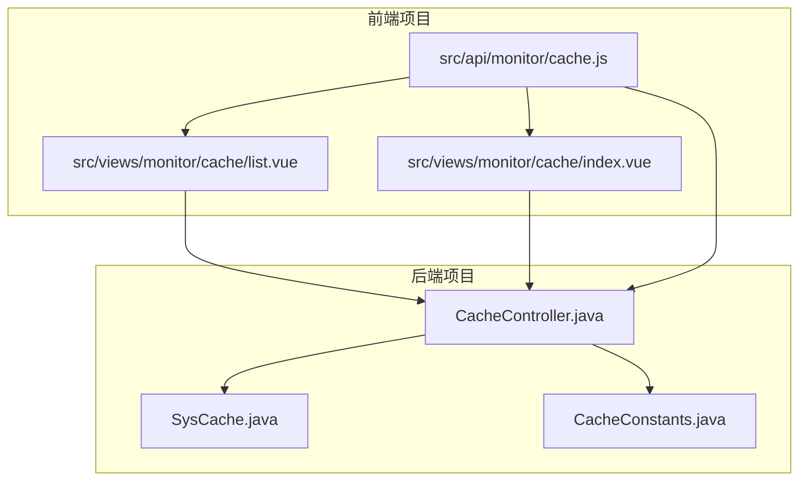
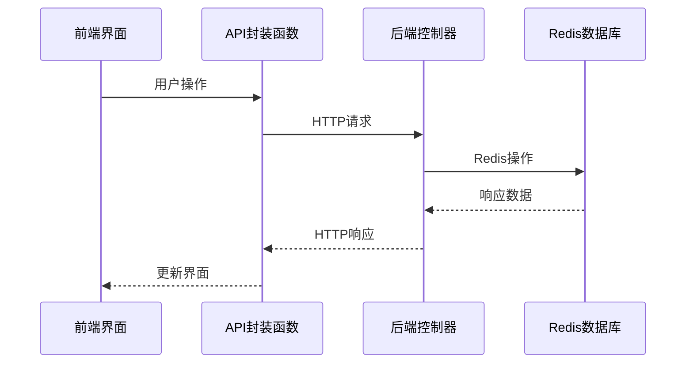
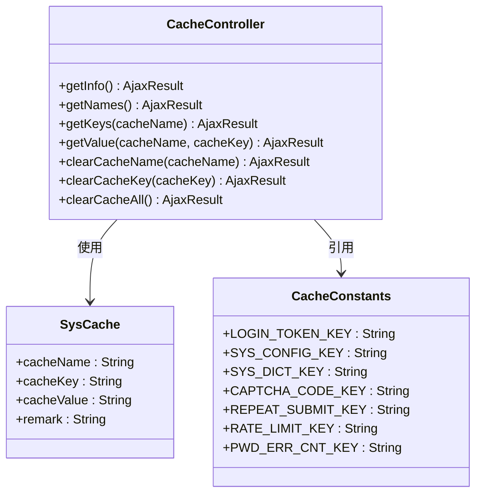
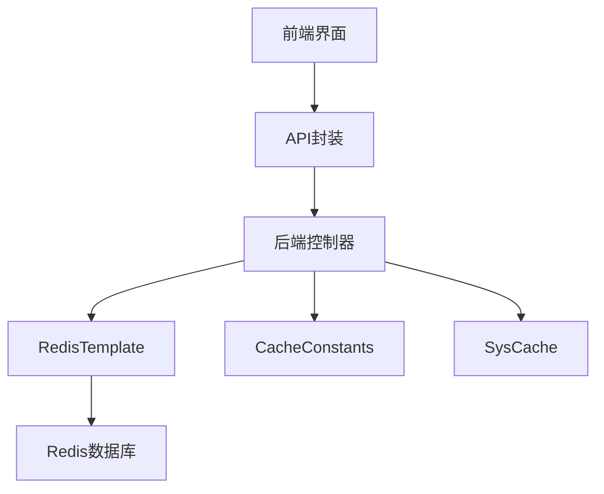

# 缓存监控API

<cite>
**本文档引用文件**  
- [cache.js](file://bear-jia-vue3/src/api/monitor/cache.js)
- [CacheController.java](file://bearjia-admin-backend/src/main/java/com/javaxiaobear/module/monitor/controller/CacheController.java)
- [list.vue](file://bear-jia-vue3/src/views/monitor/cache/list.vue)
- [index.vue](file://bear-jia-vue3/src/views/monitor/cache/index.vue)
- [CacheConstants.java](file://bearjia-admin-backend/src/main/java/com/javaxiaobear/base/common/constant/CacheConstants.java)
- [SysCache.java](file://bearjia-admin-backend/src/main/java/com/javaxiaobear/module/monitor/domain/SysCache.java)
</cite>

## 目录
1. [简介](#简介)
2. [项目结构](#项目结构)
3. [核心组件](#核心组件)
4. [架构概述](#架构概述)
5. [详细组件分析](#详细组件分析)
6. [依赖分析](#依赖分析)
7. [性能考虑](#性能考虑)
8. [故障排除指南](#故障排除指南)
9. [结论](#结论)

## 简介
缓存监控API为系统提供了全面的Redis缓存管理功能，包括缓存信息查询、缓存键管理、缓存清理等操作。该API通过前后端分离架构实现，后端使用Spring Boot和RedisTemplate提供RESTful接口，前端基于Vue3和Ant Design Vue构建用户界面。系统支持对不同类型的缓存进行分类管理，并提供了安全的缓存清理确认机制。

## 项目结构
缓存监控功能分布在前后端两个主要项目中，前端位于`bear-jia-vue3`项目中，后端位于`bearjia-admin-backend`项目中。

**图源**  
- [cache.js](file://bear-jia-vue3/src/api/monitor/cache.js)
- [list.vue](file://bear-jia-vue3/src/views/monitor/cache/list.vue)
- [index.vue](file://bear-jia-vue3/src/views/monitor/cache/index.vue)
- [CacheController.java](file://bearjia-admin-backend/src/main/java/com/javaxiaobear/module/monitor/controller/CacheController.java)

**节源**  
- [cache.js](file://bear-jia-vue3/src/api/monitor/cache.js)
- [list.vue](file://bear-jia-vue3/src/views/monitor/cache/list.vue)
- [index.vue](file://bear-jia-vue3/src/views/monitor/cache/index.vue)
- [CacheController.java](file://bearjia-admin-backend/src/main/java/com/javaxiaobear/module/monitor/controller/CacheController.java)

## 核心组件
缓存监控系统的核心组件包括前端API封装、后端控制器、缓存实体和常量定义。前端通过`cache.js`文件封装了七个主要API调用，分别对应不同的缓存操作。后端`CacheController`提供了相应的RESTful端点，通过RedisTemplate与Redis进行交互。`SysCache`实体类用于封装缓存信息，`CacheConstants`定义了系统中使用的缓存键前缀。

**节源**  
- [cache.js](file://bear-jia-vue3/src/api/monitor/cache.js)
- [CacheController.java](file://bearjia-admin-backend/src/main/java/com/javaxiaobear/module/monitor/controller/CacheController.java)
- [SysCache.java](file://bearjia-admin-backend/src/main/java/com/javaxiaobear/module/monitor/domain/SysCache.java)
- [CacheConstants.java](file://bearjia-admin-backend/src/main/java/com/javaxiaobear/base/common/constant/CacheConstants.java)

## 架构概述
系统采用典型的前后端分离架构，前端通过HTTP请求调用后端API，后端处理请求并与Redis数据库交互。权限控制通过Spring Security的@PreAuthorize注解实现，确保只有具有相应权限的用户才能执行缓存操作。

**图源**  
- [cache.js](file://bear-jia-vue3/src/api/monitor/cache.js)
- [CacheController.java](file://bearjia-admin-backend/src/main/java/com/javaxiaobear/module/monitor/controller/CacheController.java)

## 详细组件分析

### CacheController分析
`CacheController`是后端的核心组件，提供了七个端点用于缓存管理。

#### 端点功能

**图源**  
- [CacheController.java](file://bearjia-admin-backend/src/main/java/com/javaxiaobear/module/monitor/controller/CacheController.java)
- [SysCache.java](file://bearjia-admin-backend/src/main/java/com/javaxiaobear/module/monitor/domain/SysCache.java)
- [CacheConstants.java](file://bearjia-admin-backend/src/main/java/com/javaxiaobear/base/common/constant/CacheConstants.java)

**节源**  
- [CacheController.java](file://bearjia-admin-backend/src/main/java/com/javaxiaobear/module/monitor/controller/CacheController.java)

### 前端API封装分析
前端通过`cache.js`文件封装了后端API，提供了易于使用的函数接口。

#### API封装函数
| 函数名 | 参数 | HTTP方法 | 路径 | 功能描述 |
|-------|------|---------|------|---------|
| getCache | 无 | GET | /monitor/cache | 获取Redis信息 |
| listCacheName | 无 | GET | /monitor/cache/getNames | 获取缓存名称列表 |
| listCacheKey | cacheName | GET | /monitor/cache/getKeys/{cacheName} | 获取指定缓存的键列表 |
| getCacheValue | cacheName, cacheKey | GET | /monitor/cache/getValue/{cacheName}/{cacheKey} | 获取缓存值 |
| clearCacheName | cacheName | DELETE | /monitor/cache/clearCacheName/{cacheName} | 按名称清除缓存 |
| clearCacheKey | cacheKey | DELETE | /monitor/cache/clearCacheKey/{cacheKey} | 按键清除缓存 |
| clearCacheAll | 无 | DELETE | /monitor/cache/clearCacheAll | 清除全部缓存 |

**节源**  
- [cache.js](file://bear-jia-vue3/src/api/monitor/cache.js)

### 缓存类型与键前缀
系统定义了多种缓存类型，每种类型有对应的键前缀和用途。

#### 缓存类型枚举
| 缓存类型 | 键前缀 | 备注 | 用途 |
|--------|-------|------|------|
| 用户信息 | login_tokens: | 用户登录信息 | 存储用户会话和认证信息 |
| 配置信息 | sys_config: | 系统配置 | 存储系统参数配置 |
| 数据字典 | sys_dict: | 数据字典 | 存储系统字典数据 |
| 验证码 | captcha_codes: | 验证码 | 存储用户验证码 |
| 防重提交 | repeat_submit: | 防重提交 | 防止表单重复提交 |
| 限流处理 | rate_limit: | 限流处理 | API请求限流控制 |
| 密码错误次数 | pwd_err_cnt: | 密码错误次数 | 记录用户密码错误次数 |

**节源**  
- [CacheConstants.java](file://bearjia-admin-backend/src/main/java/com/javaxiaobear/base/common/constant/CacheConstants.java)
- [CacheController.java](file://bearjia-admin-backend/src/main/java/com/javaxiaobear/module/monitor/controller/CacheController.java)

## 依赖分析
系统组件之间的依赖关系清晰，前端组件依赖后端API，后端组件依赖Redis和系统常量。

**图源**  
- [cache.js](file://bear-jia-vue3/src/api/monitor/cache.js)
- [CacheController.java](file://bearjia-admin-backend/src/main/java/com/javaxiaobear/module/monitor/controller/CacheController.java)
- [SysCache.java](file://bearjia-admin-backend/src/main/java/com/javaxiaobear/module/monitor/domain/SysCache.java)
- [CacheConstants.java](file://bearjia-admin-backend/src/main/java/com/javaxiaobear/base/common/constant/CacheConstants.java)

**节源**  
- [cache.js](file://bear-jia-vue3/src/api/monitor/cache.js)
- [CacheController.java](file://bearjia-admin-backend/src/main/java/com/javaxiaobear/module/monitor/controller/CacheController.java)

## 性能考虑
缓存监控API在设计时考虑了性能因素，通过合理的缓存策略和查询优化确保系统高效运行。

1. **Redis性能指标**：`getInfo`端点获取Redis的commandstats信息，可用于分析命令执行频率和性能瓶颈。
2. **批量操作**：清除缓存操作使用RedisTemplate的批量删除功能，提高操作效率。
3. **连接复用**：通过RedisTemplate复用连接，减少连接创建开销。
4. **数据过滤**：前端对返回的缓存数据进行格式化和过滤，减少不必要的数据传输。

## 故障排除指南
### 常见问题及解决方案
1. **无法获取缓存信息**
   - 检查Redis服务是否正常运行
   - 验证后端与Redis的连接配置
   - 确认用户具有`monitor:cache:list`权限

2. **缓存清理失败**
   - 检查Redis写权限
   - 验证缓存键名是否正确
   - 查看后端日志获取详细错误信息

3. **前端界面显示异常**
   - 检查API路径是否正确
   - 验证网络连接状态
   - 清除浏览器缓存后重试

**节源**  
- [CacheController.java](file://bearjia-admin-backend/src/main/java/com/javaxiaobear/module/monitor/controller/CacheController.java)
- [cache.js](file://bear-jia-vue3/src/api/monitor/cache.js)

## 结论
缓存监控API提供了一套完整的Redis缓存管理解决方案，涵盖了信息查询、键管理、清理操作等核心功能。系统通过清晰的前后端分离架构和合理的权限控制，确保了缓存管理的安全性和易用性。建议在生产环境中使用时，严格控制缓存清理操作的权限，并在执行清除全部缓存等高风险操作时实施双重确认机制。