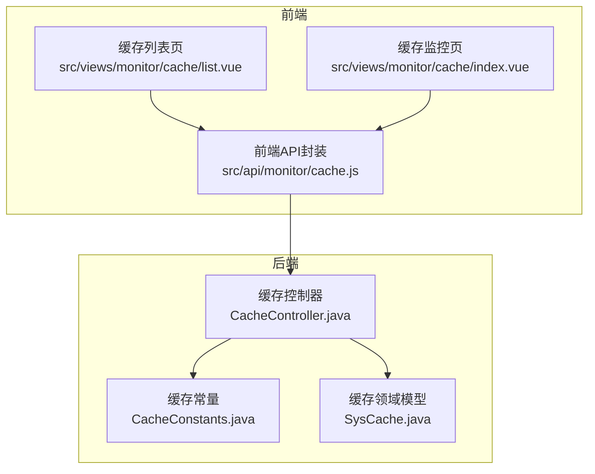
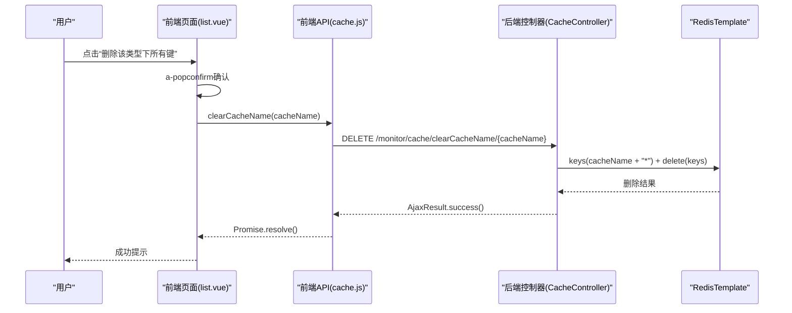
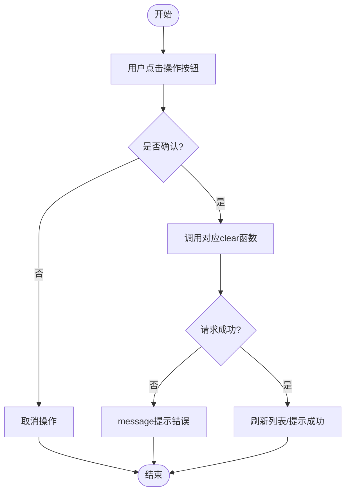
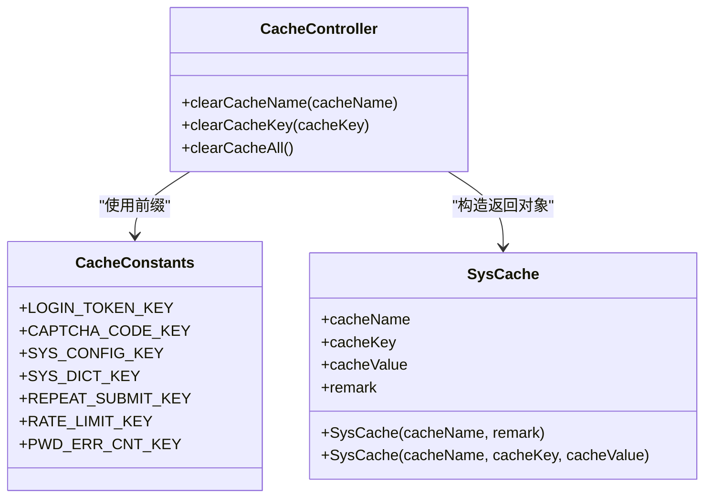
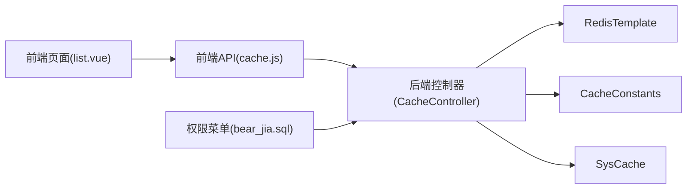

# 缓存管理API

<cite>
**本文引用的文件**
- [CacheController.java](file://bearjia-admin-backend/src/main/java/com/javaxiaobear/module/monitor/controller/CacheController.java)
- [CacheConstants.java](file://bearjia-admin-backend/src/main/java/com/javaxiaobear/base/common/constant/CacheConstants.java)
- [SysCache.java](file://bearjia-admin-backend/src/main/java/com/javaxiaobear/module/monitor/domain/SysCache.java)
- [cache.js](file://bear-jia-vue3/src/api/monitor/cache.js)
- [list.vue](file://bear-jia-vue3/src/views/monitor/cache/list.vue)
- [index.vue](file://bear-jia-vue3/src/views/monitor/cache/index.vue)
- [bear_jia.sql](file://bearjia-admin-backend/src/main/resources/sql/bear_jia.sql)
</cite>

## 目录
1. [简介](#简介)
2. [项目结构](#项目结构)
3. [核心组件](#核心组件)
4. [架构总览](#架构总览)
5. [详细组件分析](#详细组件分析)
6. [依赖关系分析](#依赖关系分析)
7. [性能与安全考量](#性能与安全考量)
8. [故障排查指南](#故障排查指南)
9. [结论](#结论)
10. [附录](#附录)

## 简介
本文件面向前端与后端开发者，系统化梳理缓存管理API，重点覆盖以下三个清理端点：
- clearCacheName：按缓存类型前缀批量删除键
- clearCacheKey：删除单个缓存键
- clearCacheAll：清空整个Redis数据库（高危）

同时强调DELETE请求的安全权限控制（monitor:cache:list）与前端操作确认机制，并给出前端API函数clearCacheName、clearCacheKey、clearCacheAll的调用方式与异常处理建议。结合CacheConstants常量类，解释缓存键前缀命名规范及其在管理操作中的应用。

## 项目结构
缓存管理功能由“前端API封装 + 前端页面 + 后端控制器 + 缓存常量”四部分组成，前后端交互遵循REST风格路径约定。

图表来源
- [cache.js](file://bear-jia-vue3/src/api/monitor/cache.js#L1-L58)
- [list.vue](file://bear-jia-vue3/src/views/monitor/cache/list.vue#L144-L197)
- [index.vue](file://bear-jia-vue3/src/views/monitor/cache/index.vue#L1-L133)
- [CacheController.java](file://bearjia-admin-backend/src/main/java/com/javaxiaobear/module/monitor/controller/CacheController.java#L1-L120)
- [CacheConstants.java](file://bearjia-admin-backend/src/main/java/com/javaxiaobear/base/common/constant/CacheConstants.java#L1-L45)
- [SysCache.java](file://bearjia-admin-backend/src/main/java/com/javaxiaobear/module/monitor/domain/SysCache.java#L1-L82)

章节来源
- [cache.js](file://bear-jia-vue3/src/api/monitor/cache.js#L1-L58)
- [list.vue](file://bear-jia-vue3/src/views/monitor/cache/list.vue#L144-L197)
- [index.vue](file://bear-jia-vue3/src/views/monitor/cache/index.vue#L1-L133)
- [CacheController.java](file://bearjia-admin-backend/src/main/java/com/javaxiaobear/module/monitor/controller/CacheController.java#L1-L120)
- [CacheConstants.java](file://bearjia-admin-backend/src/main/java/com/javaxiaobear/base/common/constant/CacheConstants.java#L1-L45)
- [SysCache.java](file://bearjia-admin-backend/src/main/java/com/javaxiaobear/module/monitor/domain/SysCache.java#L1-L82)

## 核心组件
- 前端API封装：提供clearCacheName、clearCacheKey、clearCacheAll三个DELETE请求方法，统一调用后端REST端点。
- 前端页面：
  - 缓存列表页：提供“删除该类型下所有键”、“删除单个键”的确认弹窗；支持“刷新键名列表”等辅助操作。
  - 缓存监控页：展示Redis基础信息与命令统计，便于评估清理风险。
- 后端控制器：实现三个清理端点，均受权限校验保护；提供查询缓存名称列表、键名列表、键值等辅助能力。
- 缓存常量：定义标准前缀，用于命名规范与类型识别。

章节来源
- [cache.js](file://bear-jia-vue3/src/api/monitor/cache.js#L35-L57)
- [list.vue](file://bear-jia-vue3/src/views/monitor/cache/list.vue#L1-L143)
- [index.vue](file://bear-jia-vue3/src/views/monitor/cache/index.vue#L1-L133)
- [CacheController.java](file://bearjia-admin-backend/src/main/java/com/javaxiaobear/module/monitor/controller/CacheController.java#L71-L120)
- [CacheConstants.java](file://bearjia-admin-backend/src/main/java/com/javaxiaobear/base/common/constant/CacheConstants.java#L1-L45)

## 架构总览
后端通过Spring Security的@PreAuthorize对DELETE端点进行权限拦截，前端通过Ant Design Vue的确认对话框二次防护，形成“后端权限 + 前端确认”的双重保障。

图表来源
- [list.vue](file://bear-jia-vue3/src/views/monitor/cache/list.vue#L46-L56)
- [cache.js](file://bear-jia-vue3/src/api/monitor/cache.js#L35-L41)
- [CacheController.java](file://bearjia-admin-backend/src/main/java/com/javaxiaobear/module/monitor/controller/CacheController.java#L95-L102)

## 详细组件分析

### 后端控制器：清理端点与权限
- clearCacheName：基于路径变量cacheName拼接前缀，使用keys匹配以“*”结尾的键集合，再批量删除。
- clearCacheKey：直接删除单个键。
- clearCacheAll：使用通配符“*”匹配所有键并删除。
- 权限控制：三个DELETE端点均标注@PreAuthorize("@ss.hasPermi('monitor:cache:list'))，确保只有具备monitor:cache:list权限的用户可执行。

章节来源
- [CacheController.java](file://bearjia-admin-backend/src/main/java/com/javaxiaobear/module/monitor/controller/CacheController.java#L95-L119)
- [bear_jia.sql](file://bearjia-admin-backend/src/main/resources/sql/bear_jia.sql#L452-L454)

### 前端API封装：clearCacheName/clearCacheKey/clearCacheAll
- clearCacheName(cacheName)：DELETE /monitor/cache/clearCacheName/{cacheName}
- clearCacheKey(cacheKey)：DELETE /monitor/cache/clearCacheKey/{cacheKey}
- clearCacheAll()：DELETE /monitor/cache/clearCacheAll

章节来源
- [cache.js](file://bear-jia-vue3/src/api/monitor/cache.js#L35-L57)

### 前端页面：操作确认与调用流程
- 删除该类型下所有键：使用a-popconfirm确认，确认后调用clearCacheName并刷新列表。
- 删除单个键：点击键项右侧操作按钮，确认后调用clearCacheKey。
- 清空全部缓存：顶部工具栏提供“清除全部缓存”按钮，确认后调用clearCacheAll。
- 异常处理：捕获Promise异常，统一通过message提示错误信息。

图表来源
- [list.vue](file://bear-jia-vue3/src/views/monitor/cache/list.vue#L14-L23)
- [list.vue](file://bear-jia-vue3/src/views/monitor/cache/list.vue#L46-L56)
- [list.vue](file://bear-jia-vue3/src/views/monitor/cache/list.vue#L236-L245)
- [list.vue](file://bear-jia-vue3/src/views/monitor/cache/list.vue#L272-L289)
- [list.vue](file://bear-jia-vue3/src/views/monitor/cache/list.vue#L420-L441)

章节来源
- [list.vue](file://bear-jia-vue3/src/views/monitor/cache/list.vue#L14-L23)
- [list.vue](file://bear-jia-vue3/src/views/monitor/cache/list.vue#L46-L56)
- [list.vue](file://bear-jia-vue3/src/views/monitor/cache/list.vue#L236-L245)
- [list.vue](file://bear-jia-vue3/src/views/monitor/cache/list.vue#L272-L289)
- [list.vue](file://bear-jia-vue3/src/views/monitor/cache/list.vue#L420-L441)

### 缓存键前缀命名规范与应用
- CacheConstants定义了标准前缀，如登录令牌、验证码、系统配置、字典、防重提交、限流、密码错误次数等。
- 命名规范：统一采用“业务域:用途:”的冒号分隔形式，末尾带冒号，便于clearCacheName按前缀精确匹配。
- 在管理操作中的应用：
  - 前端“缓存名称列表”展示这些前缀，作为清理目标的“类型”。
  - 后端clearCacheName通过cacheName + "*"匹配该类型的全部键。
  - SysCache构造时会去除前缀冒号并剥离前缀，便于展示与理解。

图表来源
- [CacheConstants.java](file://bearjia-admin-backend/src/main/java/com/javaxiaobear/base/common/constant/CacheConstants.java#L1-L45)
- [SysCache.java](file://bearjia-admin-backend/src/main/java/com/javaxiaobear/module/monitor/domain/SysCache.java#L1-L82)
- [CacheController.java](file://bearjia-admin-backend/src/main/java/com/javaxiaobear/module/monitor/controller/CacheController.java#L36-L45)
- [CacheController.java](file://bearjia-admin-backend/src/main/java/com/javaxiaobear/module/monitor/controller/CacheController.java#L95-L119)

章节来源
- [CacheConstants.java](file://bearjia-admin-backend/src/main/java/com/javaxiaobear/base/common/constant/CacheConstants.java#L1-L45)
- [SysCache.java](file://bearjia-admin-backend/src/main/java/com/javaxiaobear/module/monitor/domain/SysCache.java#L29-L40)
- [CacheController.java](file://bearjia-admin-backend/src/main/java/com/javaxiaobear/module/monitor/controller/CacheController.java#L36-L45)

## 依赖关系分析
- 前端依赖
  - cache.js依赖HTTP请求封装模块，向后端发起REST请求。
  - list.vue依赖Ant Design Vue组件库与消息提示，负责UI交互与确认弹窗。
- 后端依赖
  - CacheController依赖RedisTemplate进行键空间操作。
  - 使用CacheConstants与SysCache保证命名规范与返回数据结构一致。
- 权限与菜单
  - bear_jia.sql中为“缓存监控”“缓存列表”菜单配置了monitor:cache:list权限，确保访问控制生效。

图表来源
- [cache.js](file://bear-jia-vue3/src/api/monitor/cache.js#L1-L58)
- [list.vue](file://bear-jia-vue3/src/views/monitor/cache/list.vue#L144-L197)
- [CacheController.java](file://bearjia-admin-backend/src/main/java/com/javaxiaobear/module/monitor/controller/CacheController.java#L1-L120)
- [CacheConstants.java](file://bearjia-admin-backend/src/main/java/com/javaxiaobear/base/common/constant/CacheConstants.java#L1-L45)
- [SysCache.java](file://bearjia-admin-backend/src/main/java/com/javaxiaobear/module/monitor/domain/SysCache.java#L1-L82)
- [bear_jia.sql](file://bearjia-admin-backend/src/main/resources/sql/bear_jia.sql#L452-L454)

章节来源
- [cache.js](file://bear-jia-vue3/src/api/monitor/cache.js#L1-L58)
- [list.vue](file://bear-jia-vue3/src/views/monitor/cache/list.vue#L144-L197)
- [CacheController.java](file://bearjia-admin-backend/src/main/java/com/javaxiaobear/module/monitor/controller/CacheController.java#L1-L120)
- [bear_jia.sql](file://bearjia-admin-backend/src/main/resources/sql/bear_jia.sql#L452-L454)

## 性能与安全考量
- 性能
  - clearCacheName与clearCacheAll使用keys匹配全库键，可能造成阻塞或高负载，建议在低峰期执行或限制匹配范围。
  - clearCacheKey为O(1)删除，性能稳定。
- 安全
  - 后端通过@PreAuthorize("@ss.hasPermi('monitor:cache:list'))严格限制DELETE端点访问。
  - 前端通过a-popconfirm二次确认，避免误删。
  - 建议在生产环境仅授予必要管理员角色此权限，并记录审计日志。

章节来源
- [CacheController.java](file://bearjia-admin-backend/src/main/java/com/javaxiaobear/module/monitor/controller/CacheController.java#L95-L119)
- [list.vue](file://bear-jia-vue3/src/views/monitor/cache/list.vue#L14-L23)
- [bear_jia.sql](file://bearjia-admin-backend/src/main/resources/sql/bear_jia.sql#L452-L454)

## 故障排查指南
- 无权限
  - 现象：DELETE请求被拒绝。
  - 排查：确认当前用户是否具备monitor:cache:list权限；检查菜单配置与角色授权。
- 清理无效
  - 现象：clearCacheName未删除任何键。
  - 排查：确认传入的cacheName是否与CacheConstants定义的前缀一致且末尾带冒号；确认Redis中是否存在该前缀的键。
- 单键删除失败
  - 现象：clearCacheKey未删除。
  - 排查：确认传入的cacheKey是否完整且正确；检查Redis中是否存在该键。
- 全部清理风险
  - 现象：clearCacheAll导致业务中断。
  - 排查：确认执行时机与影响范围；建议先备份或导出关键键值；在低峰期执行。

章节来源
- [CacheController.java](file://bearjia-admin-backend/src/main/java/com/javaxiaobear/module/monitor/controller/CacheController.java#L95-L119)
- [CacheConstants.java](file://bearjia-admin-backend/src/main/java/com/javaxiaobear/base/common/constant/CacheConstants.java#L1-L45)
- [list.vue](file://bear-jia-vue3/src/views/monitor/cache/list.vue#L420-L441)

## 结论
- clearCacheName/clearCacheKey/clearCacheAll三类清理能力分别覆盖“按类型批量清理”“单键清理”“全库清理”，应谨慎使用。
- 前端通过a-popconfirm提供二次确认，后端通过monitor:cache:list权限严格控制，共同降低误操作风险。
- 命名规范以CacheConstants为准，确保清理范围可控、可预期。

## 附录

### 前端API函数调用与异常处理建议
- clearCacheName(cacheName)
  - 调用路径：src/api/monitor/cache.js
  - 行为：DELETE /monitor/cache/clearCacheName/{cacheName}
  - 异常处理：捕获Promise异常，使用消息提示错误，避免静默失败
- clearCacheKey(cacheKey)
  - 调用路径：src/api/monitor/cache.js
  - 行为：DELETE /monitor/cache/clearCacheKey/{cacheKey}
  - 异常处理：同上
- clearCacheAll()
  - 调用路径：src/api/monitor/cache.js
  - 行为：DELETE /monitor/cache/clearCacheAll
  - 异常处理：强烈建议在调用前增加二次确认，捕获异常并提示

章节来源
- [cache.js](file://bear-jia-vue3/src/api/monitor/cache.js#L35-L57)
- [list.vue](file://bear-jia-vue3/src/views/monitor/cache/list.vue#L420-L441)