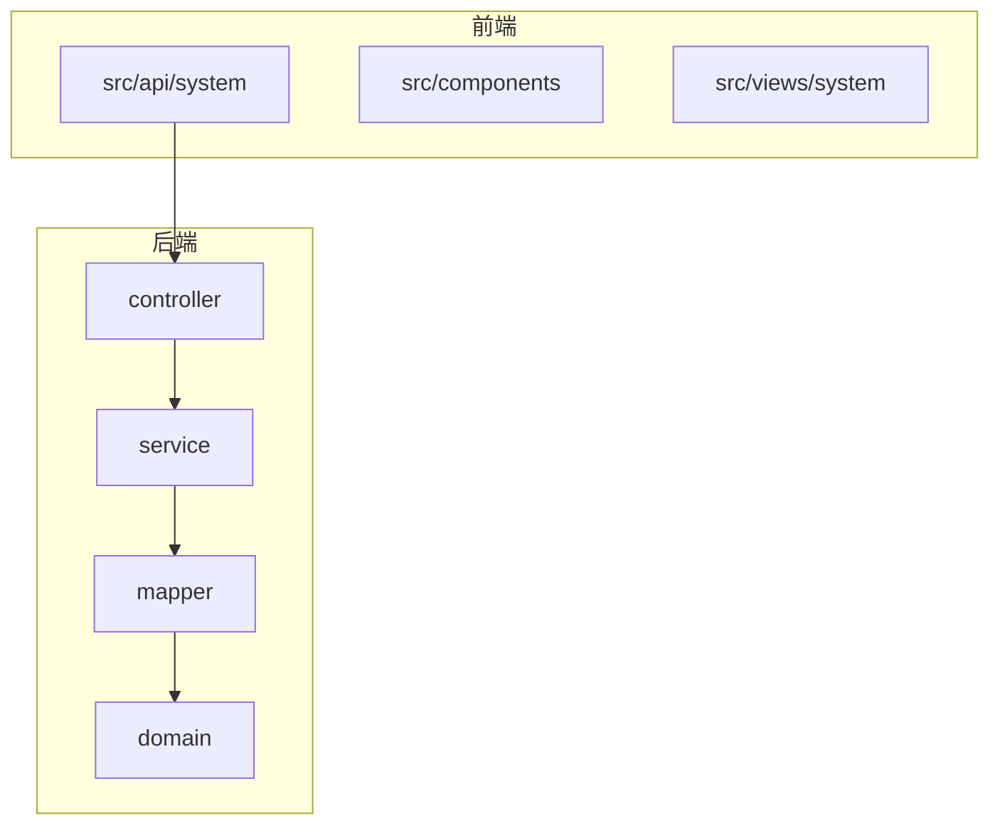
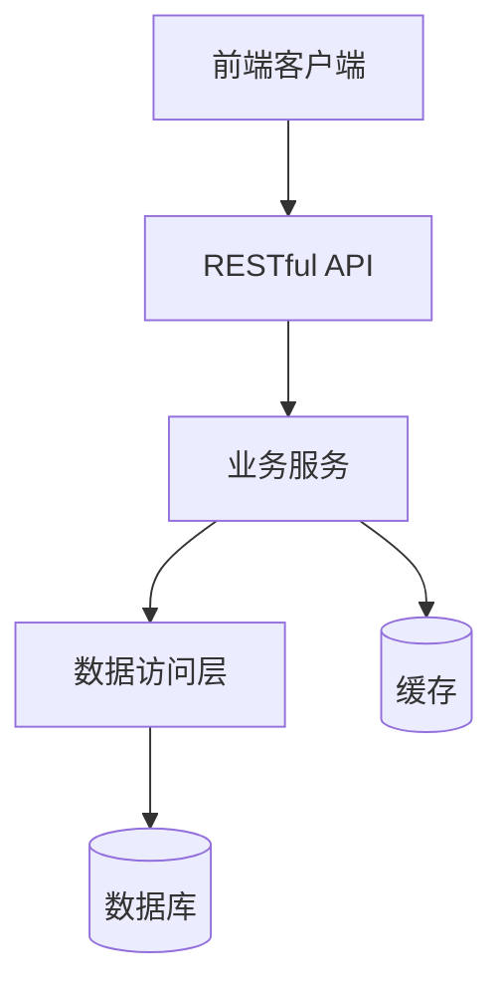
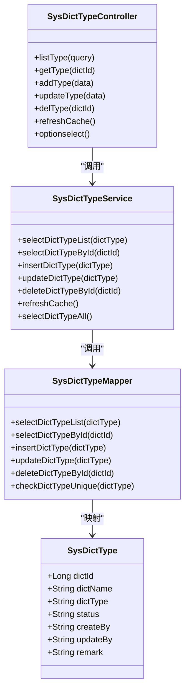
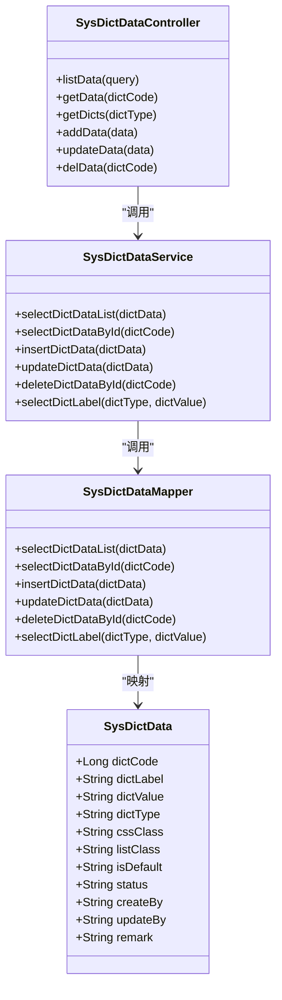
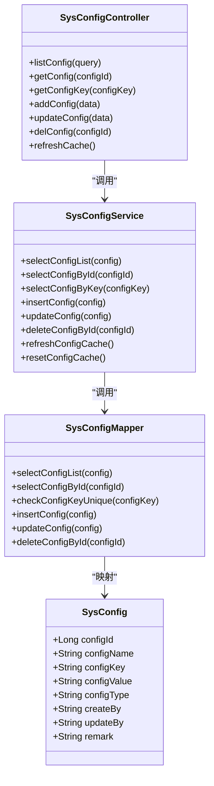
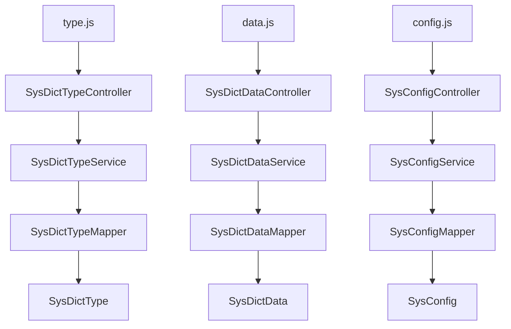

# 字典配置API

<cite>
**本文档中引用的文件**   
- [type.js](file://bear-jia-vue3\src\api\system\dict\type.js)
- [data.js](file://bear-jia-vue3\src\api\system\dict\data.js)
- [config.js](file://bear-jia-vue3\src\api\system\config.js)
- [SysDictTypeMapper.java](file://bearjia-admin-backend\src\main\java\com\javaxiaobear\module\system\mapper\SysDictTypeMapper.java)
- [SysDictDataMapper.java](file://bearjia-admin-backend\src\main\java\com\javaxiaobear\module\system\mapper\SysDictDataMapper.java)
- [SysConfigMapper.java](file://bearjia-admin-backend\src\main\java\com\javaxiaobear\module\system\mapper\SysConfigMapper.java)
- [SysDictTypeController.java](file://bearjia-admin-backend\src\main\java\com\javaxiaobear\module\system\controller\SysDictTypeController.java)
- [SysDictDataController.java](file://bearjia-admin-backend\src\main\java\com\javaxiaobear\module\system\controller\SysDictDataController.java)
- [SysConfigController.java](file://bearjia-admin-backend\src\main\java\com\javaxiaobear\module\system\controller\SysConfigController.java)
</cite>

## 目录
1. [简介](#简介)
2. [项目结构](#项目结构)
3. [核心组件](#核心组件)
4. [架构概述](#架构概述)
5. [详细组件分析](#详细组件分析)
6. [依赖分析](#依赖分析)
7. [性能考虑](#性能考虑)
8. [故障排除指南](#故障排除指南)
9. [结论](#结论)

## 简介
本文档详细描述了字典与配置管理模块的API，涵盖字典类型、字典数据和系统参数的查询、新增、修改、删除、刷新缓存等核心功能。文档记录了每个API端点的HTTP方法、URL路径、请求参数（包括路径参数、查询参数和请求体）、响应数据结构（成功与错误情况）、认证要求（JWT Token）。提供了实际请求示例（如获取字典列表、新增字典类型、修改系统参数等）和响应示例，使用真实字段名和数据类型。说明了分页参数（pageNum、pageSize）的使用规范及默认值。解释了通用错误码在字典和配置管理场景下的具体含义。描述了字典缓存机制和配置热更新的实现原理。包含API调用的最佳实践，例如字典数据的前端缓存与使用。

## 项目结构
项目结构分为前端和后端两部分。前端位于`bear-jia-vue3`目录，包含API定义、组件和视图。后端位于`bearjia-admin-backend`目录，包含控制器、服务、数据访问层和实体类。字典和配置管理相关的API定义在前端`src/api/system`目录下，后端实现位于`src/main/java/com/javaxiaobear/module/system`包中。

**图示来源**
- [type.js](file://bear-jia-vue3\src\api\system\dict\type.js)
- [SysDictTypeController.java](file://bearjia-admin-backend\src\main\java\com\javaxiaobear\module\system\controller\SysDictTypeController.java)

**节来源**
- [type.js](file://bear-jia-vue3\src\api\system\dict\type.js)
- [SysDictTypeController.java](file://bearjia-admin-backend\src\main\java\com\javaxiaobear\module\system\controller\SysDictTypeController.java)

## 核心组件
核心组件包括字典类型管理、字典数据管理和系统参数配置。前端通过API文件调用后端RESTful接口，后端通过控制器、服务和数据访问层处理业务逻辑和数据持久化。字典类型和数据用于系统内的枚举值管理，系统参数用于配置系统行为。

**节来源**
- [type.js](file://bear-jia-vue3\src\api\system\dict\type.js)
- [data.js](file://bear-jia-vue3\src\api\system\dict\data.js)
- [config.js](file://bear-jia-vue3\src\api\system\config.js)

## 架构概述
系统采用前后端分离架构，前端使用Vue3框架，后端使用Spring Boot。API通过HTTP协议通信，使用JWT进行认证。字典和配置数据存储在数据库中，通过MyBatis进行数据访问。系统实现了缓存机制，提高数据读取性能。

**图示来源**
- [SysDictTypeController.java](file://bearjia-admin-backend\src\main\java\com\javaxiaobear\module\system\controller\SysDictTypeController.java)
- [SysDictTypeMapper.java](file://bearjia-admin-backend\src\main\java\com\javaxiaobear\module\system\mapper\SysDictTypeMapper.java)

## 详细组件分析
### 字典类型管理分析
字典类型管理提供对字典类型的增删改查操作，以及刷新缓存功能。前端通过`type.js`中的函数调用后端API，后端通过`SysDictTypeController`处理请求，调用`SysDictTypeService`进行业务逻辑处理，最终通过`SysDictTypeMapper`访问数据库。

#### 类图

**图示来源**
- [SysDictTypeController.java](file://bearjia-admin-backend\src\main\java\com\javaxiaobear\module\system\controller\SysDictTypeController.java)
- [SysDictTypeMapper.java](file://bearjia-admin-backend\src\main\java\com\javaxiaobear\module\system\mapper\SysDictTypeMapper.java)

**节来源**
- [type.js](file://bear-jia-vue3\src\api\system\dict\type.js)
- [SysDictTypeController.java](file://bearjia-admin-backend\src\main\java\com\javaxiaobear\module\system\controller\SysDictTypeController.java)

### 字典数据管理分析
字典数据管理提供对字典数据的增删改查操作。前端通过`data.js`中的函数调用后端API，后端通过`SysDictDataController`处理请求，调用`SysDictDataService`进行业务逻辑处理，最终通过`SysDictDataMapper`访问数据库。

#### 类图

**图示来源**
- [SysDictDataController.java](file://bearjia-admin-backend\src\main\java\com\javaxiaobear\module\system\controller\SysDictDataController.java)
- [SysDictDataMapper.java](file://bearjia-admin-backend\src\main\java\com\javaxiaobear\module\system\mapper\SysDictDataMapper.java)

**节来源**
- [data.js](file://bear-jia-vue3\src\api\system\dict\data.js)
- [SysDictDataController.java](file://bearjia-admin-backend\src\main\java\com\javaxiaobear\module\system\controller\SysDictDataController.java)

### 系统参数管理分析
系统参数管理提供对系统参数的增删改查和刷新缓存操作。前端通过`config.js`中的函数调用后端API，后端通过`SysConfigController`处理请求，调用`SysConfigService`进行业务逻辑处理，最终通过`SysConfigMapper`访问数据库。

#### 类图

**图示来源**
- [SysConfigController.java](file://bearjia-admin-backend\src\main\java\com\javaxiaobear\module\system\controller\SysConfigController.java)
- [SysConfigMapper.java](file://bearjia-admin-backend\src\main\java\com\javaxiaobear\module\system\mapper\SysConfigMapper.java)

**节来源**
- [config.js](file://bear-jia-vue3\src\api\system\config.js)
- [SysConfigController.java](file://bearjia-admin-backend\src\main\java\com\javaxiaobear\module\system\controller\SysConfigController.java)

## 依赖分析
系统组件之间存在明确的依赖关系。前端API依赖后端RESTful接口，后端控制器依赖服务层，服务层依赖数据访问层。这种分层架构确保了关注点分离，提高了代码的可维护性和可测试性。

**图示来源**
- [type.js](file://bear-jia-vue3\src\api\system\dict\type.js)
- [SysDictTypeController.java](file://bearjia-admin-backend\src\main\java\com\javaxiaobear\module\system\controller\SysDictTypeController.java)
- [SysDictTypeMapper.java](file://bearjia-admin-backend\src\main\java\com\javaxiaobear\module\system\mapper\SysDictTypeMapper.java)

**节来源**
- [type.js](file://bear-jia-vue3\src\api\system\dict\type.js)
- [data.js](file://bear-jia-vue3\src\api\system\dict\data.js)
- [config.js](file://bear-jia-vue3\src\api\system\config.js)

## 性能考虑
系统在设计时考虑了性能优化。通过分页查询避免一次性加载大量数据，使用缓存减少数据库访问频率，批量操作减少网络往返次数。字典数据通常在前端缓存，减少重复请求。

## 故障排除指南
常见问题包括API调用失败、数据不一致和缓存未更新。检查JWT令牌是否有效，确认请求参数格式正确，验证数据库连接状态。对于缓存问题，可以调用刷新缓存API强制更新。

**节来源**
- [type.js](file://bear-jia-vue3\src\api\system\dict\type.js)
- [config.js](file://bear-jia-vue3\src\api\system\config.js)

## 结论
字典与配置管理模块提供了完整的CRUD操作和缓存管理功能，通过清晰的分层架构和RESTful API设计，实现了高效的数据管理和配置维护。遵循本文档的指导，可以有效使用和扩展该模块。