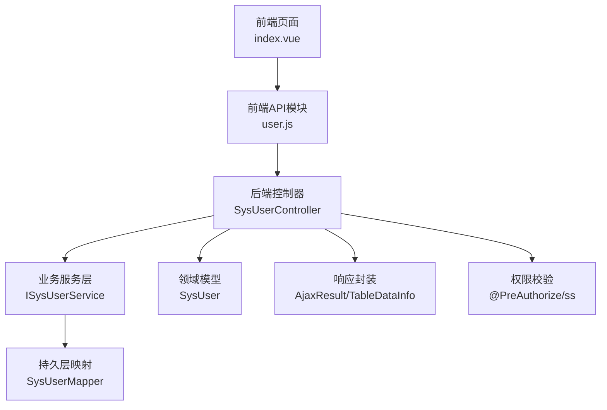
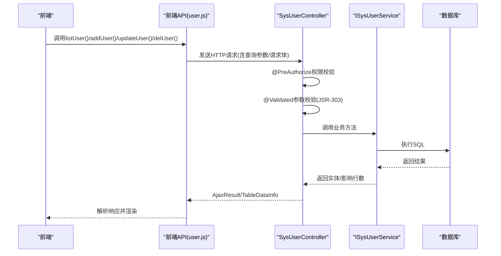
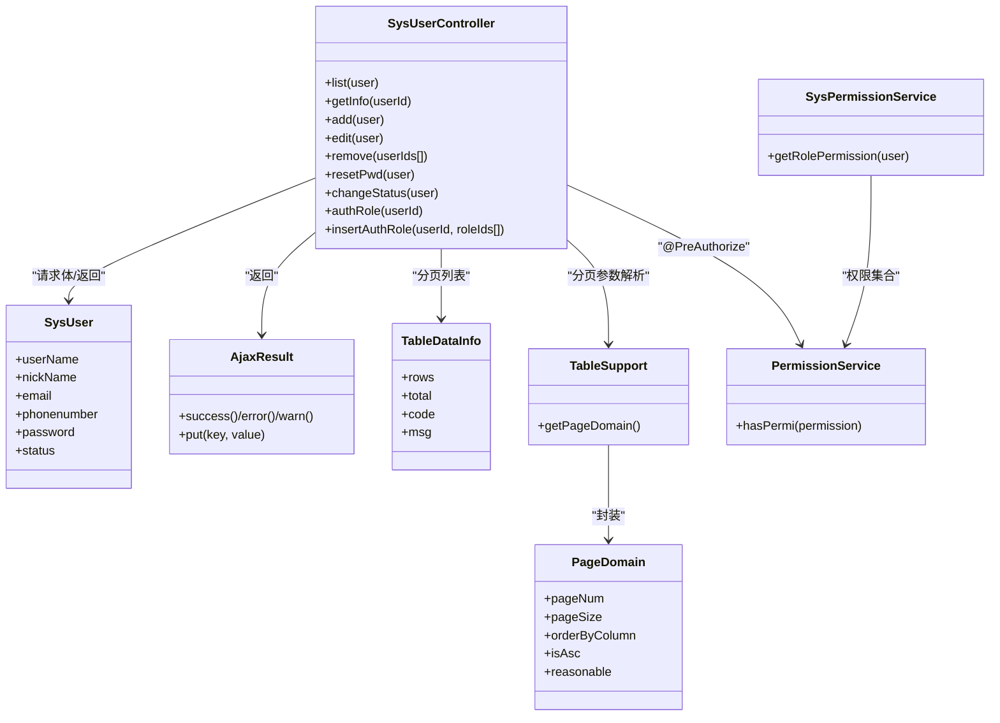

# 用户CRUD操作API

<cite>
**本文引用的文件**
- [SysUserController.java](file://bearjia-admin-backend/src/main/java/com/javaxiaobear/module/system/controller/SysUserController.java)
- [SysUser.java](file://bearjia-admin-backend/src/main/java/com/javaxiaobear/module/system/domain/SysUser.java)
- [AjaxResult.java](file://bearjia-admin-backend/src/main/java/com/javaxiaobear/base/framework/web/domain/AjaxResult.java)
- [TableDataInfo.java](file://bearjia-admin-backend/src/main/java/com/javaxiaobear/base/framework/web/page/TableDataInfo.java)
- [TableSupport.java](file://bearjia-admin-backend/src/main/java/com/javaxiaobear/base/framework/web/page/TableSupport.java)
- [PageDomain.java](file://bearjia-admin-backend/src/main/java/com/javaxiaobear/base/framework/web/page/PageDomain.java)
- [user.js](file://bear-jia-vue3/src/api/system/user.js)
- [index.vue](file://bear-jia-vue3/src/views/system/user/index.vue)
- [PermissionService.java](file://bearjia-admin-backend/src/main/java/com/javaxiaobear/base/framework/security/service/PermissionService.java)
- [SysPermissionService.java](file://bearjia-admin-backend/src/main/java/com/javaxiaobear/base/framework/security/service/SysPermissionService.java)
- [bear_jia.sql](file://bearjia-admin-backend/src/main/resources/sql/bear_jia.sql)
</cite>

## 目录
1. [简介](#简介)
2. [项目结构](#项目结构)
3. [核心组件](#核心组件)
4. [架构总览](#架构总览)
5. [详细组件分析](#详细组件分析)
6. [依赖关系分析](#依赖关系分析)
7. [性能与分页特性](#性能与分页特性)
8. [故障排查指南](#故障排查指南)
9. [结论](#结论)

## 简介
本文件面向前后端开发者，系统性梳理“用户CRUD操作”的完整API规范，覆盖查询、新增、修改、删除等核心能力，并明确权限控制、数据校验、分页机制与错误处理策略。同时给出前端调用示例与常见问题定位方法，帮助快速集成与排障。

## 项目结构
- 后端采用Spring MVC控制器层暴露REST接口，统一返回AjaxResult或TableDataInfo封装结构。
- 前端通过独立API模块封装HTTP请求，配合表格组件完成分页与筛选。

图表来源
- [SysUserController.java](file://bearjia-admin-backend/src/main/java/com/javaxiaobear/module/system/controller/SysUserController.java#L63-L257)
- [user.js](file://bear-jia-vue3/src/api/system/user.js#L1-L130)
- [index.vue](file://bear-jia-vue3/src/views/system/user/index.vue#L124-L177)

章节来源
- [SysUserController.java](file://bearjia-admin-backend/src/main/java/com/javaxiaobear/module/system/controller/SysUserController.java#L63-L257)
- [user.js](file://bear-jia-vue3/src/api/system/user.js#L1-L130)
- [index.vue](file://bear-jia-vue3/src/views/system/user/index.vue#L124-L177)

## 核心组件
- 控制器：SysUserController 提供用户管理的REST接口，统一使用@PreAuthorize进行权限控制。
- 领域模型：SysUser 定义用户字段与JSR-303约束，用于请求体校验。
- 响应封装：
  - AjaxResult：通用结果封装，包含code/msg/data等键。
  - TableDataInfo：分页列表封装，包含rows/total/code/msg。
- 分页支持：TableSupport/ PageDomain 统一封装pageNum/pageSize等分页参数，默认值与合理化策略。
- 权限服务：PermissionService、SysPermissionService 提供权限判断入口与角色权限集合。

章节来源
- [SysUserController.java](file://bearjia-admin-backend/src/main/java/com/javaxiaobear/module/system/controller/SysUserController.java#L63-L257)
- [SysUser.java](file://bearjia-admin-backend/src/main/java/com/javaxiaobear/module/system/domain/SysUser.java#L144-L170)
- [AjaxResult.java](file://bearjia-admin-backend/src/main/java/com/javaxiaobear/base/framework/web/domain/AjaxResult.java#L1-L217)
- [TableDataInfo.java](file://bearjia-admin-backend/src/main/java/com/javaxiaobear/base/framework/web/page/TableDataInfo.java#L1-L85)
- [TableSupport.java](file://bearjia-admin-backend/src/main/java/com/javaxiaobear/base/framework/web/page/TableSupport.java#L1-L57)
- [PageDomain.java](file://bearjia-admin-backend/src/main/java/com/javaxiaobear/base/framework/web/page/PageDomain.java#L1-L67)
- [PermissionService.java](file://bearjia-admin-backend/src/main/java/com/javaxiaobear/base/framework/security/service/PermissionService.java#L1-L42)
- [SysPermissionService.java](file://bearjia-admin-backend/src/main/java/com/javaxiaobear/base/framework/security/service/SysPermissionService.java#L1-L52)

## 架构总览
后端控制器通过Spring MVC接收请求，经权限校验与JSR-303参数校验后，调用业务服务执行数据库操作，最终以AjaxResult或TableDataInfo统一返回。

图表来源
- [SysUserController.java](file://bearjia-admin-backend/src/main/java/com/javaxiaobear/module/system/controller/SysUserController.java#L63-L257)
- [user.js](file://bear-jia-vue3/src/api/system/user.js#L1-L130)

## 详细组件分析

### 用户查询接口
- 端点
  - GET /system/user/list
- 请求参数
  - 查询参数：支持SysUser字段作为过滤条件；分页参数：pageNum、pageSize、orderByColumn、isAsc、reasonable（由TableSupport解析）
- 响应
  - TableDataInfo：包含rows（列表）、total（总数）、code/msg
- 示例
  - 分页查询：GET /system/user/list?pageNum=1&pageSize=10&userName=张三&deptId=100
- 前端调用
  - 前端通过listUser(query)发起请求，ProTable自动拼装分页参数并处理响应

章节来源
- [SysUserController.java](file://bearjia-admin-backend/src/main/java/com/javaxiaobear/module/system/controller/SysUserController.java#L63-L72)
- [TableSupport.java](file://bearjia-admin-backend/src/main/java/com/javaxiaobear/base/framework/web/page/TableSupport.java#L16-L37)
- [TableDataInfo.java](file://bearjia-admin-backend/src/main/java/com/javaxiaobear/base/framework/web/page/TableDataInfo.java#L15-L25)
- [user.js](file://bear-jia-vue3/src/api/system/user.js#L1-L11)
- [index.vue](file://bear-jia-vue3/src/views/system/user/index.vue#L124-L141)

### 用户详情接口
- 端点
  - GET /system/user
  - GET /system/user/{userId}
- 请求参数
  - 路径参数：userId（可选）
- 响应
  - AjaxResult：包含roles/posts/postIds/roleIds及用户数据
- 前端调用
  - getUser(userId)

章节来源
- [SysUserController.java](file://bearjia-admin-backend/src/main/java/com/javaxiaobear/module/system/controller/SysUserController.java#L103-L123)
- [user.js](file://bear-jia-vue3/src/api/system/user.js#L13-L19)

### 新增用户接口
- 端点
  - POST /system/user
- 请求参数
  - 请求体：SysUser（包含用户名、昵称、邮箱、手机号、性别、部门ID等）
- 校验规则
  - JSR-303约束：用户名必填且长度限制、邮箱格式与长度限制、手机号长度限制、XSS防护等
  - 业务校验：用户名/手机号/邮箱唯一性检查
- 响应
  - AjaxResult：成功/失败提示
- 前端调用
  - addUser(data)

章节来源
- [SysUserController.java](file://bearjia-admin-backend/src/main/java/com/javaxiaobear/module/system/controller/SysUserController.java#L125-L148)
- [SysUser.java](file://bearjia-admin-backend/src/main/java/com/javaxiaobear/module/system/domain/SysUser.java#L144-L170)
- [user.js](file://bear-jia-vue3/src/api/system/user.js#L21-L28)

### 修改用户接口
- 端点
  - PUT /system/user
- 请求参数
  - 请求体：SysUser（包含userId等）
- 校验规则
  - JSR-303约束同新增
  - 业务校验：不允许修改管理员自身、数据范围校验、唯一性检查
- 响应
  - AjaxResult
- 前端调用
  - updateUser(data)

章节来源
- [SysUserController.java](file://bearjia-admin-backend/src/main/java/com/javaxiaobear/module/system/controller/SysUserController.java#L150-L174)
- [SysUser.java](file://bearjia-admin-backend/src/main/java/com/javaxiaobear/module/system/domain/SysUser.java#L144-L170)
- [user.js](file://bear-jia-vue3/src/api/system/user.js#L30-L37)

### 删除用户接口
- 端点
  - DELETE /system/user/{userIds}
- 请求参数
  - 路径参数：userIds（可传多个ID，后端接收Long[]）
- 校验规则
  - 不允许删除当前登录用户
- 响应
  - AjaxResult
- 前端调用
  - delUser(userId)

章节来源
- [SysUserController.java](file://bearjia-admin-backend/src/main/java/com/javaxiaobear/module/system/controller/SysUserController.java#L176-L189)
- [user.js](file://bear-jia-vue3/src/api/system/user.js#L39-L45)

### 重置密码接口
- 端点
  - PUT /system/user/resetPwd
- 请求参数
  - 请求体：SysUser（包含userId与新密码）
- 校验规则
  - JSR-303约束与数据范围校验
- 响应
  - AjaxResult
- 前端调用
  - resetUserPwd(userId, password)

章节来源
- [SysUserController.java](file://bearjia-admin-backend/src/main/java/com/javaxiaobear/module/system/controller/SysUserController.java#L191-L204)
- [user.js](file://bear-jia-vue3/src/api/system/user.js#L47-L58)

### 用户状态变更接口
- 端点
  - PUT /system/user/changeStatus
- 请求参数
  - 请求体：SysUser（包含userId与status）
- 响应
  - AjaxResult
- 前端调用
  - changeUserStatus(userId, status)

章节来源
- [SysUserController.java](file://bearjia-admin-backend/src/main/java/com/javaxiaobear/module/system/controller/SysUserController.java#L206-L218)
- [user.js](file://bear-jia-vue3/src/api/system/user.js#L60-L71)

### 授权角色查询与保存
- 端点
  - GET /system/user/authRole/{userId}
  - PUT /system/user/authRole
- 请求参数
  - GET：路径参数userId
  - PUT：请求参数userId、roleIds[]
- 响应
  - AjaxResult（包含user与roles）
- 前端调用
  - getAuthRole(userId)
  - updateAuthRole({userId, roleIds})

章节来源
- [SysUserController.java](file://bearjia-admin-backend/src/main/java/com/javaxiaobear/module/system/controller/SysUserController.java#L220-L246)
- [user.js](file://bear-jia-vue3/src/api/system/user.js#L115-L130)

### 个人信息与头像上传
- 端点
  - GET /system/user/profile
  - PUT /system/user/profile
  - PUT /system/user/profile/updatePwd
  - POST /system/user/profile/avatar
- 请求参数
  - GET/PUT：无特殊参数
  - PUT /profile/updatePwd：params携带oldPassword/newPassword
  - POST /profile/avatar：multipart/form-data
- 响应
  - AjaxResult
- 前端调用
  - getUserProfile()/updateUserProfile()/updateUserPwd()/uploadAvatar()

章节来源
- [SysUserController.java](file://bearjia-admin-backend/src/main/java/com/javaxiaobear/module/system/controller/SysUserController.java#L74-L123)
- [user.js](file://bear-jia-vue3/src/api/system/user.js#L73-L114)

## 依赖关系分析

图表来源
- [SysUserController.java](file://bearjia-admin-backend/src/main/java/com/javaxiaobear/module/system/controller/SysUserController.java#L63-L257)
- [SysUser.java](file://bearjia-admin-backend/src/main/java/com/javaxiaobear/module/system/domain/SysUser.java#L144-L170)
- [AjaxResult.java](file://bearjia-admin-backend/src/main/java/com/javaxiaobear/base/framework/web/domain/AjaxResult.java#L1-L217)
- [TableDataInfo.java](file://bearjia-admin-backend/src/main/java/com/javaxiaobear/base/framework/web/page/TableDataInfo.java#L1-L85)
- [TableSupport.java](file://bearjia-admin-backend/src/main/java/com/javaxiaobear/base/framework/web/page/TableSupport.java#L1-L57)
- [PageDomain.java](file://bearjia-admin-backend/src/main/java/com/javaxiaobear/base/framework/web/page/PageDomain.java#L1-L67)
- [PermissionService.java](file://bearjia-admin-backend/src/main/java/com/javaxiaobear/base/framework/security/service/PermissionService.java#L1-L42)
- [SysPermissionService.java](file://bearjia-admin-backend/src/main/java/com/javaxiaobear/base/framework/security/service/SysPermissionService.java#L1-L52)

## 性能与分页特性
- 分页参数
  - 默认pageNum=1、pageSize=10；可通过TableSupport解析请求参数并设置合理化开关。
- 排序
  - 支持orderByColumn/isAsc组合，后端会转为SQL安全排序表达式。
- 响应结构
  - 列表接口统一返回TableDataInfo，前端可直接绑定rows/total。
- 前端交互
  - index.vue中ProTable自动拼装分页参数并处理不同响应格式（rows/data/数组）。

章节来源
- [TableSupport.java](file://bearjia-admin-backend/src/main/java/com/javaxiaobear/base/framework/web/page/TableSupport.java#L16-L37)
- [PageDomain.java](file://bearjia-admin-backend/src/main/java/com/javaxiaobear/base/framework/web/page/PageDomain.java#L13-L26)
- [TableDataInfo.java](file://bearjia-admin-backend/src/main/java/com/javaxiaobear/base/framework/web/page/TableDataInfo.java#L15-L25)
- [index.vue](file://bear-jia-vue3/src/views/system/user/index.vue#L124-L141)

## 故障排查指南
- 权限不足
  - 现象：返回失败提示
  - 定位：@PreAuthorize注解对应权限字符串，需确保当前用户具备相应权限
  - 参考权限字符串：system:user:list、system:user:add、system:user:edit、system:user:remove、system:user:resetPwd、system:user:query
- 参数校验失败
  - 现象：请求被拦截或返回错误消息
  - 定位：SysUser字段上的JSR-303约束（如用户名必填、邮箱格式、手机号长度等）
- 唯一性冲突
  - 现象：新增/修改时报用户名/手机号/邮箱已存在
  - 定位：后端对用户名/手机号/邮箱进行唯一性检查
- 删除自身账户
  - 现象：返回“当前用户不能删除”
  - 定位：后端禁止删除当前登录用户
- 响应结构不一致
  - 现象：前端解析rows/data失败
  - 定位：确认后端返回TableDataInfo或AjaxResult结构，前端按rows/data/数组三种格式兼容处理

章节来源
- [SysUserController.java](file://bearjia-admin-backend/src/main/java/com/javaxiaobear/module/system/controller/SysUserController.java#L125-L189)
- [SysUser.java](file://bearjia-admin-backend/src/main/java/com/javaxiaobear/module/system/domain/SysUser.java#L144-L170)
- [PermissionService.java](file://bearjia-admin-backend/src/main/java/com/javaxiaobear/base/framework/security/service/PermissionService.java#L27-L40)
- [SysPermissionService.java](file://bearjia-admin-backend/src/main/java/com/javaxiaobear/base/framework/security/service/SysPermissionService.java#L34-L47)
- [bear_jia.sql](file://bearjia-admin-backend/src/main/resources/sql/bear_jia.sql#L461-L463)

## 结论
本文档基于现有代码梳理了用户CRUD的完整API清单、权限控制、数据校验与分页机制，并提供了前后端调用示例与常见问题定位方法。建议在集成时：
- 明确各端点的权限字符串，确保前端按钮与菜单项与后端权限保持一致
- 严格遵循SysUser的JSR-303约束，避免无效请求
- 使用TableDataInfo统一处理分页列表，保证前后端一致的响应结构
- 在删除操作前进行“是否自身账户”的校验，避免业务风险