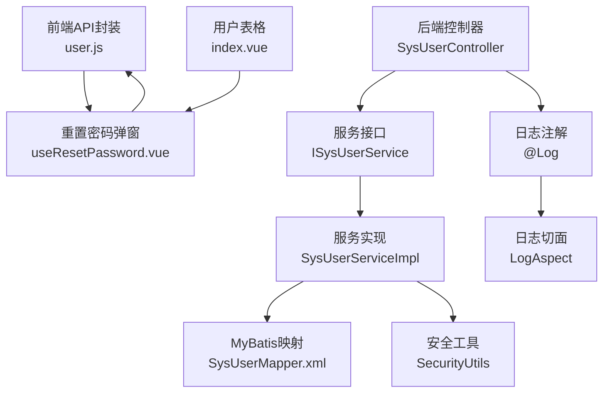
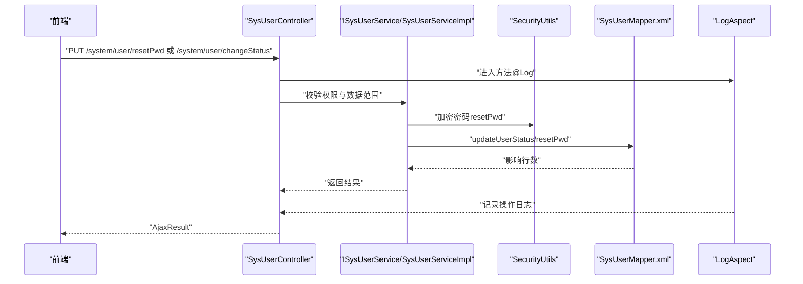
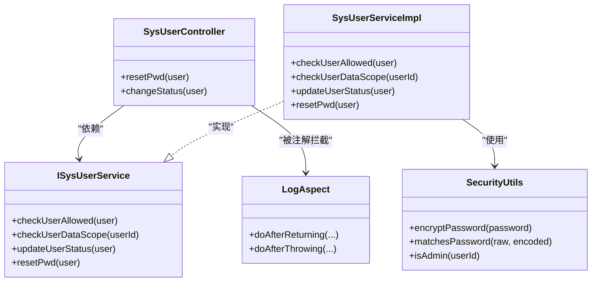

# 用户状态与密码管理API

<cite>
**本文引用的文件**
- [bear-jia-vue3/src/api/system/user.js](file://bear-jia-vue3/src/api/system/user.js)
- [bear-jia-vue3/src/views/system/user/useResetPassword.vue](file://bear-jia-vue3/src/views/system/user/useResetPassword.vue)
- [bear-jia-vue3/src/views/system/log/operlog/useResetPassword.vue](file://bear-jia-vue3/src/views/system/log/operlog/useResetPassword.vue)
- [bear-jia-vue3/src/views/system/user/index.vue](file://bear-jia-vue3/src/views/system/user/index.vue)
- [bear-jia-admin-backend/src/main/java/com/javaxiaobear/module/system/controller/SysUserController.java](file://bear-jia-admin-backend/src/main/java/com/javaxiaobear/module/system/controller/SysUserController.java)
- [bear-jia-admin-backend/src/main/java/com/javaxiaobear/module/system/service/ISysUserService.java](file://bear-jia-admin-backend/src/main/java/com/javaxiaobear/module/system/service/ISysUserService.java)
- [bear-jia-admin-backend/src/main/java/com/javaxiaobear/module/system/service/impl/SysUserServiceImpl.java](file://bear-jia-admin-backend/src/main/java/com/javaxiaobear/module/system/service/impl/SysUserServiceImpl.java)
- [bear-jia-admin-backend/src/main/java/com/javaxiaobear/base/common/utils/SecurityUtils.java](file://bear-jia-admin-backend/src/main/java/com/javaxiaobear/base/common/utils/SecurityUtils.java)
- [bear-jia-admin-backend/src/main/java/com/javaxiaobear/base/framework/aspectj/lang/annotation/Log.java](file://bear-jia-admin-backend/src/main/java/com/javaxiaobear/base/framework/aspectj/lang/annotation/Log.java)
- [bear-jia-admin-backend/src/main/java/com/javaxiaobear/base/framework/aspectj/LogAspect.java](file://bear-jia-admin-backend/src/main/java/com/javaxiaobear/base/framework/aspectj/LogAspect.java)
- [bear-jia-admin-backend/src/main/java/com/javaxiaobear/base/common/enums/UserStatus.java](file://bear-jia-admin-backend/src/main/java/com/javaxiaobear/base/common/enums/UserStatus.java)
- [bear-jia-admin-backend/src/main/resources/mybatis/system/SysUserMapper.xml](file://bear-jia-admin-backend/src/main/resources/mybatis/system/SysUserMapper.xml)
</cite>

## 目录
1. [简介](#简介)
2. [项目结构](#项目结构)
3. [核心组件](#核心组件)
4. [架构总览](#架构总览)
5. [详细组件分析](#详细组件分析)
6. [依赖关系分析](#依赖关系分析)
7. [性能考虑](#性能考虑)
8. [故障排查指南](#故障排查指南)
9. [结论](#结论)
10. [附录](#附录)

## 简介
本文件面向前后端开发者，系统化梳理“用户状态变更”和“密码重置”的API设计与实现，覆盖以下要点：
- 后端接口：PUT /system/user/changeStatus、PUT /system/user/resetPwd
- 请求参数与响应格式、认证与权限要求
- 前端调用函数 resetUserPwd 与 changeUserStatus 的实际使用路径
- 权限校验与数据范围校验：checkUserAllowed、checkUserDataScope
- 密码加密逻辑 SecurityUtils.encryptPassword 在新增与重置中的应用
- 状态修改的业务规则与异常处理（如禁止修改超级管理员）
- 敏感操作日志记录机制（@Log 注解与异步入库）

## 项目结构
围绕用户状态与密码管理的关键文件分布如下：
- 前端API封装与调用：user.js、useResetPassword.vue、index.vue
- 后端控制器与服务：SysUserController、ISysUserService、SysUserServiceImpl
- 安全与日志：SecurityUtils、@Log 注解、LogAspect
- 枚举与持久层：UserStatus、SysUserMapper.xml

图表来源
- [bear-jia-vue3/src/api/system/user.js](file://bear-jia-vue3/src/api/system/user.js#L1-L73)
- [bear-jia-vue3/src/views/system/user/useResetPassword.vue](file://bear-jia-vue3/src/views/system/user/useResetPassword.vue#L1-L88)
- [bear-jia-vue3/src/views/system/user/index.vue](file://bear-jia-vue3/src/views/system/user/index.vue#L1-L231)
- [bear-jia-admin-backend/src/main/java/com/javaxiaobear/module/system/controller/SysUserController.java](file://bear-jia-admin-backend/src/main/java/com/javaxiaobear/module/system/controller/SysUserController.java#L155-L227)
- [bear-jia-admin-backend/src/main/java/com/javaxiaobear/module/system/service/ISysUserService.java](file://bear-jia-admin-backend/src/main/java/com/javaxiaobear/module/system/service/ISysUserService.java#L1-L207)
- [bear-jia-admin-backend/src/main/java/com/javaxiaobear/module/system/service/impl/SysUserServiceImpl.java](file://bear-jia-admin-backend/src/main/java/com/javaxiaobear/module/system/service/impl/SysUserServiceImpl.java#L207-L256)
- [bear-jia-admin-backend/src/main/java/com/javaxiaobear/base/common/utils/SecurityUtils.java](file://bear-jia-admin-backend/src/main/java/com/javaxiaobear/base/common/utils/SecurityUtils.java#L1-L147)
- [bear-jia-admin-backend/src/main/java/com/javaxiaobear/base/framework/aspectj/lang/annotation/Log.java](file://bear-jia-admin-backend/src/main/java/com/javaxiaobear/base/framework/aspectj/lang/annotation/Log.java#L1-L51)
- [bear-jia-admin-backend/src/main/java/com/javaxiaobear/base/framework/aspectj/LogAspect.java](file://bear-jia-admin-backend/src/main/java/com/javaxiaobear/base/framework/aspectj/LogAspect.java#L28-L200)
- [bear-jia-admin-backend/src/main/resources/mybatis/system/SysUserMapper.xml](file://bear-jia-admin-backend/src/main/resources/mybatis/system/SysUserMapper.xml#L173-L205)

章节来源
- [bear-jia-vue3/src/api/system/user.js](file://bear-jia-vue3/src/api/system/user.js#L1-L73)
- [bear-jia-admin-backend/src/main/java/com/javaxiaobear/module/system/controller/SysUserController.java](file://bear-jia-admin-backend/src/main/java/com/javaxiaobear/module/system/controller/SysUserController.java#L155-L227)

## 核心组件
- 前端API封装：提供 resetUserPwd(userId, password) 与 changeUserStatus(userId, status) 两个函数，分别对应后端的“重置密码”和“状态修改”接口。
- 后端控制器：SysUserController 提供 /system/user/resetPwd 与 /system/user/changeStatus 两个PUT端点，并在方法上标注权限注解与日志注解。
- 服务层：ISysUserService 定义 updateUserStatus、resetPwd 等方法；SysUserServiceImpl 实现 checkUserAllowed、checkUserDataScope、updateUserStatus、resetPwd 等。
- 安全工具：SecurityUtils.encryptPassword 用于密码加密；SecurityUtils.isAdmin 用于判断超级管理员。
- 日志切面：@Log 注解与 LogAspect 统一记录操作日志并异步入库。

章节来源
- [bear-jia-vue3/src/api/system/user.js](file://bear-jia-vue3/src/api/system/user.js#L47-L71)
- [bear-jia-admin-backend/src/main/java/com/javaxiaobear/module/system/controller/SysUserController.java](file://bear-jia-admin-backend/src/main/java/com/javaxiaobear/module/system/controller/SysUserController.java#L191-L218)
- [bear-jia-admin-backend/src/main/java/com/javaxiaobear/module/system/service/ISysUserService.java](file://bear-jia-admin-backend/src/main/java/com/javaxiaobear/module/system/service/ISysUserService.java#L139-L171)
- [bear-jia-admin-backend/src/main/java/com/javaxiaobear/module/system/service/impl/SysUserServiceImpl.java](file://bear-jia-admin-backend/src/main/java/com/javaxiaobear/module/system/service/impl/SysUserServiceImpl.java#L207-L256)
- [bear-jia-admin-backend/src/main/java/com/javaxiaobear/base/common/utils/SecurityUtils.java](file://bear-jia-admin-backend/src/main/java/com/javaxiaobear/base/common/utils/SecurityUtils.java#L91-L114)
- [bear-jia-admin-backend/src/main/java/com/javaxiaobear/base/framework/aspectj/lang/annotation/Log.java](file://bear-jia-admin-backend/src/main/java/com/javaxiaobear/base/framework/aspectj/lang/annotation/Log.java#L1-L51)
- [bear-jia-admin-backend/src/main/java/com/javaxiaobear/base/framework/aspectj/LogAspect.java](file://bear-jia-admin-backend/src/main/java/com/javaxiaobear/base/framework/aspectj/LogAspect.java#L28-L200)

## 架构总览
后端采用Spring MVC + MyBatis，控制器负责鉴权与参数接收，服务层完成权限与数据范围校验、业务处理与持久化，日志切面统一记录操作日志。

图表来源
- [bear-jia-admin-backend/src/main/java/com/javaxiaobear/module/system/controller/SysUserController.java](file://bear-jia-admin-backend/src/main/java/com/javaxiaobear/module/system/controller/SysUserController.java#L191-L218)
- [bear-jia-admin-backend/src/main/java/com/javaxiaobear/module/system/service/impl/SysUserServiceImpl.java](file://bear-jia-admin-backend/src/main/java/com/javaxiaobear/module/system/service/impl/SysUserServiceImpl.java#L207-L256)
- [bear-jia-admin-backend/src/main/java/com/javaxiaobear/base/common/utils/SecurityUtils.java](file://bear-jia-admin-backend/src/main/java/com/javaxiaobear/base/common/utils/SecurityUtils.java#L91-L114)
- [bear-jia-admin-backend/src/main/resources/mybatis/system/SysUserMapper.xml](file://bear-jia-admin-backend/src/main/resources/mybatis/system/SysUserMapper.xml#L173-L205)
- [bear-jia-admin-backend/src/main/java/com/javaxiaobear/base/framework/aspectj/LogAspect.java](file://bear-jia-admin-backend/src/main/java/com/javaxiaobear/base/framework/aspectj/LogAspect.java#L28-L200)

## 详细组件分析

### 接口定义与调用

- 重置密码
  - 后端端点：PUT /system/user/resetPwd
  - 请求体字段：userId、password
  - 响应：AjaxResult（通用响应结构）
  - 权限：@PreAuthorize("@ss.hasPermi('system:user:resetPwd')")

- 用户状态修改
  - 后端端点：PUT /system/user/changeStatus
  - 请求体字段：userId、status
  - 响应：AjaxResult（通用响应结构）
  - 权限：@PreAuthorize("@ss.hasPermi('system:user:edit')")

- 前端调用
  - resetUserPwd(userId, password)：封装在 user.js 中，调用 /system/user/resetPwd
  - changeUserStatus(userId, status)：封装在 user.js 中，调用 /system/user/changeStatus
  - 前端弹窗 useResetPassword.vue 调用 resetUserPwd 并进行表单校验与提示

章节来源
- [bear-jia-vue3/src/api/system/user.js](file://bear-jia-vue3/src/api/system/user.js#L47-L71)
- [bear-jia-vue3/src/views/system/user/useResetPassword.vue](file://bear-jia-vue3/src/views/system/user/useResetPassword.vue#L1-L88)
- [bear-jia-admin-backend/src/main/java/com/javaxiaobear/module/system/controller/SysUserController.java](file://bear-jia-admin-backend/src/main/java/com/javaxiaobear/module/system/controller/SysUserController.java#L191-L218)

### 权限与数据范围校验

- checkUserAllowed
  - 作用：禁止对超级管理员用户进行操作
  - 触发：在 resetPwd 与 changeStatus 方法中均先调用该方法
  - 异常：当目标用户为超级管理员时抛出业务异常

- checkUserDataScope
  - 作用：非超级管理员仅能操作其可见范围内的用户
  - 触发：在 resetPwd 与 changeStatus 方法中均先调用该方法
  - 异常：若无权限访问该用户数据则抛出业务异常

- 前端权限
  - 前端通过指令 v-hasPermi 控制按钮显示，间接体现“system:user:resetPwd/system:user:edit”权限需求

章节来源
- [bear-jia-admin-backend/src/main/java/com/javaxiaobear/module/system/service/impl/SysUserServiceImpl.java](file://bear-jia-admin-backend/src/main/java/com/javaxiaobear/module/system/service/impl/SysUserServiceImpl.java#L207-L256)
- [bear-jia-admin-backend/src/main/java/com/javaxiaobear/module/system/controller/SysUserController.java](file://bear-jia-admin-backend/src/main/java/com/javaxiaobear/module/system/controller/SysUserController.java#L191-L218)
- [bear-jia-vue3/src/views/system/user/index.vue](file://bear-jia-vue3/src/views/system/user/index.vue#L1-L231)

### 密码加密逻辑

- SecurityUtils.encryptPassword
  - 用途：将明文密码加密后写入数据库
  - 应用：在 resetPwd 流程中对 password 字段进行加密
  - 匹配：SecurityUtils.matchesPassword 用于匹配旧密码（用于个人中心密码修改）

- 新增与重置时的差异
  - 新增用户时，前端通常不直接传入密码，而是由后端生成或通过其他流程处理
  - 重置密码时，前端传入明文 password，后端调用 SecurityUtils.encryptPassword 加密后再持久化

章节来源
- [bear-jia-admin-backend/src/main/java/com/javaxiaobear/base/common/utils/SecurityUtils.java](file://bear-jia-admin-backend/src/main/java/com/javaxiaobear/base/common/utils/SecurityUtils.java#L91-L114)
- [bear-jia-admin-backend/src/main/java/com/javaxiaobear/module/system/controller/SysUserController.java](file://bear-jia-admin-backend/src/main/java/com/javaxiaobear/module/system/controller/SysUserController.java#L191-L204)

### 状态修改业务规则

- 状态枚举
  - UserStatus.OK("0","正常")
  - UserStatus.DISABLE("1","停用")
  - UserStatus.DELETED("2","删除")

- 状态变更流程
  - 控制器接收 userId、status
  - 服务层执行 checkUserAllowed 与 checkUserDataScope
  - 调用 updateUserStatus 持久化
  - 日志切面记录操作

- 特殊限制
  - 不允许修改超级管理员状态
  - 非超级管理员仅能修改其可见范围内的用户

章节来源
- [bear-jia-admin-backend/src/main/java/com/javaxiaobear/base/common/enums/UserStatus.java](file://bear-jia-admin-backend/src/main/java/com/javaxiaobear/base/common/enums/UserStatus.java#L1-L30)
- [bear-jia-admin-backend/src/main/resources/mybatis/system/SysUserMapper.xml](file://bear-jia-admin-backend/src/main/resources/mybatis/system/SysUserMapper.xml#L198-L200)
- [bear-jia-admin-backend/src/main/java/com/javaxiaobear/module/system/service/impl/SysUserServiceImpl.java](file://bear-jia-admin-backend/src/main/java/com/javaxiaobear/module/system/service/impl/SysUserServiceImpl.java#L207-L256)

### 敏感操作日志记录

- @Log 注解
  - 位置：SysUserController 的 resetPwd 与 changeStatus 方法
  - 字段：title、businessType、operatorType、isSaveRequestData、isSaveResponseData、excludeParamNames

- 日志切面 LogAspect
  - 记录操作人、部门、IP、URL、请求方式、耗时、请求/响应参数（敏感字段排除）
  - 异步入库：通过 AsyncManager 与 AsyncFactory 将日志写入数据库

章节来源
- [bear-jia-admin-backend/src/main/java/com/javaxiaobear/base/framework/aspectj/lang/annotation/Log.java](file://bear-jia-admin-backend/src/main/java/com/javaxiaobear/base/framework/aspectj/lang/annotation/Log.java#L1-L51)
- [bear-jia-admin-backend/src/main/java/com/javaxiaobear/base/framework/aspectj/LogAspect.java](file://bear-jia-admin-backend/src/main/java/com/javaxiaobear/base/framework/aspectj/LogAspect.java#L28-L200)
- [bear-jia-admin-backend/src/main/java/com/javaxiaobear/module/system/controller/SysUserController.java](file://bear-jia-admin-backend/src/main/java/com/javaxiaobear/module/system/controller/SysUserController.java#L191-L218)

### 前端调用示例

- resetUserPwd(userId, password)
  - 路径：bear-jia-vue3/src/api/system/user.js
  - 用法：在 useResetPassword.vue 中打开弹窗、表单校验、调用 resetUserPwd 并提示成功/失败

- changeUserStatus(userId, status)
  - 路径：bear-jia-vue3/src/api/system/user.js
  - 用法：在表格行操作中触发，调用后端接口并刷新表格

章节来源
- [bear-jia-vue3/src/api/system/user.js](file://bear-jia-vue3/src/api/system/user.js#L47-L71)
- [bear-jia-vue3/src/views/system/user/useResetPassword.vue](file://bear-jia-vue3/src/views/system/user/useResetPassword.vue#L1-L88)
- [bear-jia-vue3/src/views/system/user/index.vue](file://bear-jia-vue3/src/views/system/user/index.vue#L1-L231)

## 依赖关系分析

图表来源
- [bear-jia-admin-backend/src/main/java/com/javaxiaobear/module/system/controller/SysUserController.java](file://bear-jia-admin-backend/src/main/java/com/javaxiaobear/module/system/controller/SysUserController.java#L191-L218)
- [bear-jia-admin-backend/src/main/java/com/javaxiaobear/module/system/service/ISysUserService.java](file://bear-jia-admin-backend/src/main/java/com/javaxiaobear/module/system/service/ISysUserService.java#L139-L171)
- [bear-jia-admin-backend/src/main/java/com/javaxiaobear/module/system/service/impl/SysUserServiceImpl.java](file://bear-jia-admin-backend/src/main/java/com/javaxiaobear/module/system/service/impl/SysUserServiceImpl.java#L207-L256)
- [bear-jia-admin-backend/src/main/java/com/javaxiaobear/base/common/utils/SecurityUtils.java](file://bear-jia-admin-backend/src/main/java/com/javaxiaobear/base/common/utils/SecurityUtils.java#L91-L114)
- [bear-jia-admin-backend/src/main/java/com/javaxiaobear/base/framework/aspectj/LogAspect.java](file://bear-jia-admin-backend/src/main/java/com/javaxiaobear/base/framework/aspectj/LogAspect.java#L28-L200)

## 性能考虑
- 日志异步化：通过 LogAspect 与 AsyncFactory 异步入库，避免阻塞主业务线程。
- 参数过滤：日志切面排除敏感字段（如 password），降低日志体积与泄露风险。
- 数据范围校验：checkUserDataScope 限制非超级管理员可见范围，减少不必要的查询与权限判断成本。

[本节为通用建议，无需列出具体文件来源]

## 故障排查指南
- 重置密码失败
  - 检查权限：确保当前用户具备 system:user:resetPwd 权限
  - 检查目标用户：若目标用户为超级管理员，会触发“不允许操作超级管理员用户”
  - 检查数据范围：非超级管理员仅能重置其可见范围内的用户
  - 检查日志：查看操作日志表中对应记录，定位异常原因

- 状态修改失败
  - 检查权限：确保当前用户具备 system:user:edit 权限
  - 检查状态值：确认 status 符合 UserStatus 枚举
  - 检查目标用户：超级管理员状态不可修改

- 密码加密问题
  - 确认后端使用 SecurityUtils.encryptPassword 对密码进行加密
  - 若出现匹配失败，检查前端是否正确传递明文密码

章节来源
- [bear-jia-admin-backend/src/main/java/com/javaxiaobear/module/system/controller/SysUserController.java](file://bear-jia-admin-backend/src/main/java/com/javaxiaobear/module/system/controller/SysUserController.java#L191-L218)
- [bear-jia-admin-backend/src/main/java/com/javaxiaobear/module/system/service/impl/SysUserServiceImpl.java](file://bear-jia-admin-backend/src/main/java/com/javaxiaobear/module/system/service/impl/SysUserServiceImpl.java#L207-L256)
- [bear-jia-admin-backend/src/main/java/com/javaxiaobear/base/common/enums/UserStatus.java](file://bear-jia-admin-backend/src/main/java/com/javaxiaobear/base/common/enums/UserStatus.java#L1-L30)
- [bear-jia-admin-backend/src/main/java/com/javaxiaobear/base/framework/aspectj/LogAspect.java](file://bear-jia-admin-backend/src/main/java/com/javaxiaobear/base/framework/aspectj/LogAspect.java#L28-L200)

## 结论
本文档从接口定义、权限与数据范围校验、密码加密、状态变更规则、日志记录与异常处理等维度，完整呈现了用户状态变更与密码重置的前后端协作流程。通过 checkUserAllowed 与 checkUserDataScope 的双重校验，结合 @Log 注解与日志切面，系统实现了高安全性与可追溯性的操作闭环。

[本节为总结性内容，无需列出具体文件来源]

## 附录

### 接口一览

- 重置密码
  - 方法：PUT
  - 路径：/system/user/resetPwd
  - 请求体：userId、password
  - 权限：system:user:resetPwd
  - 响应：AjaxResult

- 用户状态修改
  - 方法：PUT
  - 路径：/system/user/changeStatus
  - 请求体：userId、status
  - 权限：system:user:edit
  - 响应：AjaxResult

章节来源
- [bear-jia-vue3/src/api/system/user.js](file://bear-jia-vue3/src/api/system/user.js#L47-L71)
- [bear-jia-admin-backend/src/main/java/com/javaxiaobear/module/system/controller/SysUserController.java](file://bear-jia-admin-backend/src/main/java/com/javaxiaobear/module/system/controller/SysUserController.java#L191-L218)