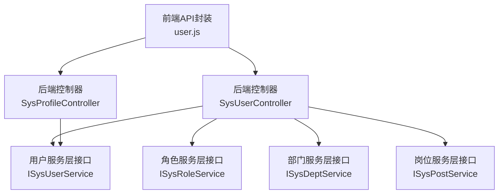
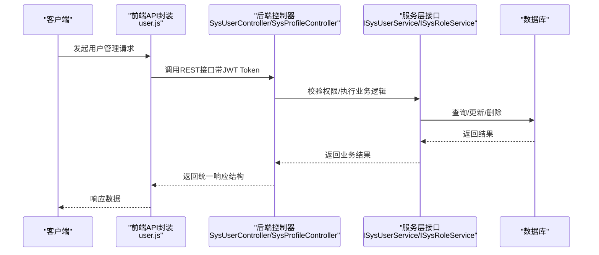
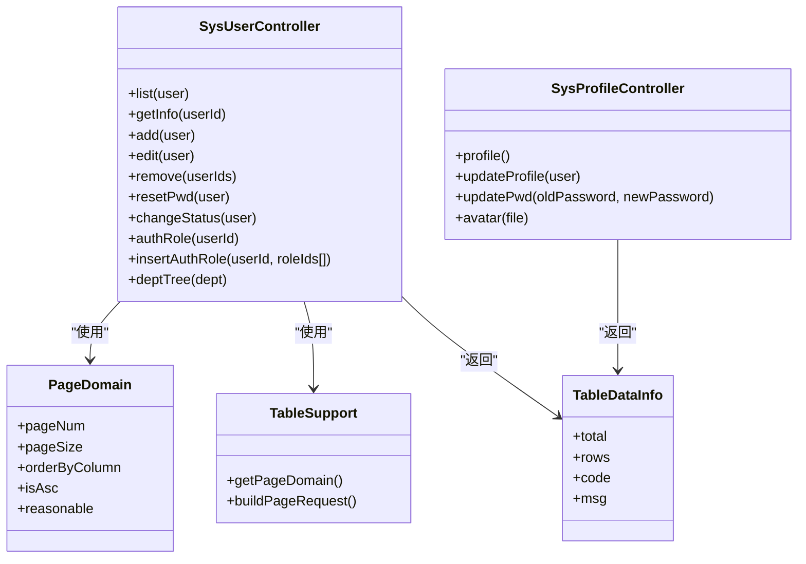

# 用户管理API

<cite>
**本文引用的文件**
- [bear-jia-vue3/src/api/system/user.js](file://bear-jia-vue3/src/api/system/user.js)
- [bearjia-admin-backend/src/main/java/com/javaxiaobear/module/system/controller/SysUserController.java](file://bearjia-admin-backend/src/main/java/com/javaxiaobear/module/system/controller/SysUserController.java)
- [bearjia-admin-backend/src/main/java/com/javaxiaobear/module/system/controller/SysProfileController.java](file://bearjia-admin-backend/src/main/java/com/javaxiaobear/module/system/controller/SysProfileController.java)
- [bearjia-admin-backend/src/main/java/com/javaxiaobear/base/framework/web/page/PageDomain.java](file://bearjia-admin-backend/src/main/java/com/javaxiaobear/base/framework/web/page/PageDomain.java)
- [bearjia-admin-backend/src/main/java/com/javaxiaobear/base/framework/web/page/TableSupport.java](file://bearjia-admin-backend/src/main/java/com/javaxiaobear/base/framework/web/page/TableSupport.java)
- [bearjia-admin-backend/src/main/java/com/javaxiaobear/base/framework/web/page/TableDataInfo.java](file://bearjia-admin-backend/src/main/java/com/javaxiaobear/base/framework/web/page/TableDataInfo.java)
- [bear-jia-vue3/src/utils/errorCode.js](file://bear-jia-vue3/src/utils/errorCode.js)
- [bearjia-admin-backend/src/main/resources/i18n/messages.properties](file://bearjia-admin-backend/src/main/resources/i18n/messages.properties)
- [bear-jia-vue3/src/views/system/user/index.vue](file://bear-jia-vue3/src/views/system/user/index.vue)
- [bear-jia-vue3/src/views/system/user/detailModal.vue](file://bear-jia-vue3/src/views/system/user/detailModal.vue)
- [bear-jia-vue3/src/views/system/user/useResetPassword.vue](file://bear-jia-vue3/src/views/system/user/useResetPassword.vue)
- [bear-jia-vue3/src/views/system/user/addUpdateModal.vue](file://bear-jia-vue3/src/views/system/user/addUpdateModal.vue)
- [bear-jia-vue3/src/views/system/user/profile/index.vue](file://bear-jia-vue3/src/views/system/user/profile/index.vue)
- [bearjia-admin-backend/src/main/resources/sql/bear_jia.sql](file://bearjia-admin-backend/src/main/resources/sql/bear_jia.sql)
</cite>

## 目录
1. [简介](#简介)
2. [项目结构](#项目结构)
3. [核心组件](#核心组件)
4. [架构总览](#架构总览)
5. [详细组件分析](#详细组件分析)
6. [依赖关系分析](#依赖关系分析)
7. [性能考虑](#性能考虑)
8. [故障排查指南](#故障排查指南)
9. [结论](#结论)
10. [附录](#附录)

## 简介
本文件为“用户管理”模块的API文档，覆盖用户查询、新增、修改、删除、状态变更、密码重置、角色分配等核心功能。文档详细说明每个API端点的HTTP方法、URL路径、请求参数（路径参数、查询参数、请求体）、响应数据结构（成功与错误情况）、认证要求（JWT Token），并提供实际请求与响应示例（使用真实字段名与数据类型）。同时说明分页参数pageNum、pageSize的使用规范与默认值，解释通用错误码在用户管理场景下的含义，描述权限控制逻辑（含数据权限过滤），并给出API调用最佳实践（批量操作与敏感操作日志记录）。

## 项目结构
用户管理API由前端Vue3接口封装与后端Spring Boot控制器共同构成：
- 前端：位于bear-jia-vue3/src/api/system/user.js，封装了用户管理相关HTTP请求。
- 后端：位于bearjia-admin-backend/src/main/java/com/javaxiaobear/module/system/controller，包含SysUserController与SysProfileController等控制器，负责用户列表、详情、新增、修改、删除、状态变更、密码重置、角色授权、个人信息维护等业务。

图表来源
- [bear-jia-vue3/src/api/system/user.js](file://bear-jia-vue3/src/api/system/user.js#L1-L131)
- [bearjia-admin-backend/src/main/java/com/javaxiaobear/module/system/controller/SysUserController.java](file://bearjia-admin-backend/src/main/java/com/javaxiaobear/module/system/controller/SysUserController.java#L46-L257)
- [bearjia-admin-backend/src/main/java/com/javaxiaobear/module/system/controller/SysProfileController.java](file://bearjia-admin-backend/src/main/java/com/javaxiaobear/module/system/controller/SysProfileController.java#L31-L138)

章节来源
- [bear-jia-vue3/src/api/system/user.js](file://bear-jia-vue3/src/api/system/user.js#L1-L131)
- [bearjia-admin-backend/src/main/java/com/javaxiaobear/module/system/controller/SysUserController.java](file://bearjia-admin-backend/src/main/java/com/javaxiaobear/module/system/controller/SysUserController.java#L46-L257)
- [bearjia-admin-backend/src/main/java/com/javaxiaobear/module/system/controller/SysProfileController.java](file://bearjia-admin-backend/src/main/java/com/javaxiaobear/module/system/controller/SysProfileController.java#L31-L138)

## 核心组件
- 前端API封装（user.js）：提供用户列表、详情、新增、修改、删除、状态变更、密码重置、个人信息、密码修改、头像上传、授权角色查询与保存等方法。
- 后端控制器（SysUserController）：提供用户管理的REST接口，包含权限注解与业务日志注解，支持分页、导入导出、角色授权等。
- 后端控制器（SysProfileController）：提供个人信息查询、修改、密码重置、头像上传等接口。
- 分页与表格数据结构：PageDomain、TableSupport、TableDataInfo用于统一分页参数解析与响应格式。

章节来源
- [bear-jia-vue3/src/api/system/user.js](file://bear-jia-vue3/src/api/system/user.js#L1-L131)
- [bearjia-admin-backend/src/main/java/com/javaxiaobear/module/system/controller/SysUserController.java](file://bearjia-admin-backend/src/main/java/com/javaxiaobear/module/system/controller/SysUserController.java#L62-L257)
- [bearjia-admin-backend/src/main/java/com/javaxiaobear/module/system/controller/SysProfileController.java](file://bearjia-admin-backend/src/main/java/com/javaxiaobear/module/system/controller/SysProfileController.java#L42-L138)
- [bearjia-admin-backend/src/main/java/com/javaxiaobear/base/framework/web/page/PageDomain.java](file://bearjia-admin-backend/src/main/java/com/javaxiaobear/base/framework/web/page/PageDomain.java#L1-L67)
- [bearjia-admin-backend/src/main/java/com/javaxiaobear/base/framework/web/page/TableSupport.java](file://bearjia-admin-backend/src/main/java/com/javaxiaobear/base/framework/web/page/TableSupport.java#L1-L56)
- [bearjia-admin-backend/src/main/java/com/javaxiaobear/base/framework/web/page/TableDataInfo.java](file://bearjia-admin-backend/src/main/java/com/javaxiaobear/base/framework/web/page/TableDataInfo.java#L1-L85)

## 架构总览
用户管理API采用前后端分离架构，前端通过Axios封装HTTP请求，后端基于Spring MVC提供REST接口，并结合权限注解与业务日志注解实现细粒度的权限控制与审计。

图表来源
- [bear-jia-vue3/src/api/system/user.js](file://bear-jia-vue3/src/api/system/user.js#L1-L131)
- [bearjia-admin-backend/src/main/java/com/javaxiaobear/module/system/controller/SysUserController.java](file://bearjia-admin-backend/src/main/java/com/javaxiaobear/module/system/controller/SysUserController.java#L62-L257)
- [bearjia-admin-backend/src/main/java/com/javaxiaobear/module/system/controller/SysProfileController.java](file://bearjia-admin-backend/src/main/java/com/javaxiaobear/module/system/controller/SysProfileController.java#L42-L138)

## 详细组件分析

### 用户查询（列表）
- HTTP方法：GET
- URL路径：/system/user/list
- 权限要求：需要权限标识 system:user:list
- 请求参数：
  - 查询参数：pageNum、pageSize、orderByColumn、isAsc、reasonable（可选）
  - 支持按用户名、昵称、性别、状态、部门ID等条件过滤（由前端传入）
- 响应数据结构：
  - 成功：包含rows（列表数据）、total（总记录数）、code、msg
  - 错误：包含code、msg
- 示例请求：
  - GET /system/user/list?pageNum=1&pageSize=10&userName=张三
- 示例响应（成功）：
  - {
      "code": 200,
      "msg": "操作成功",
      "rows": [...],
      "total": 120
    }
- 示例响应（错误）：
  - {
      "code": 500,
      "msg": "系统内部错误"
    }

章节来源
- [bear-jia-vue3/src/api/system/user.js](file://bear-jia-vue3/src/api/system/user.js#L1-L11)
- [bearjia-admin-backend/src/main/java/com/javaxiaobear/module/system/controller/SysUserController.java](file://bearjia-admin-backend/src/main/java/com/javaxiaobear/module/system/controller/SysUserController.java#L62-L72)
- [bearjia-admin-backend/src/main/java/com/javaxiaobear/base/framework/web/page/TableSupport.java](file://bearjia-admin-backend/src/main/java/com/javaxiaobear/base/framework/web/page/TableSupport.java#L16-L56)
- [bearjia-admin-backend/src/main/java/com/javaxiaobear/base/framework/web/page/TableDataInfo.java](file://bearjia-admin-backend/src/main/java/com/javaxiaobear/base/framework/web/page/TableDataInfo.java#L1-L85)

### 用户查询（详情）
- HTTP方法：GET
- URL路径：/system/user 或 /system/user/{userId}
- 权限要求：需要权限标识 system:user:query
- 请求参数：
  - 路径参数：userId（可选）
- 响应数据结构：
  - 成功：包含用户基本信息、岗位列表、角色列表、postIds、roleIds等
  - 错误：包含code、msg
- 示例请求：
  - GET /system/user/1001
- 示例响应（成功）：
  - {
      "code": 200,
      "msg": "操作成功",
      "data": {
        "userId": 1001,
        "userName": "zhangsan",
        "nickName": "张三",
        "phonenumber": "13800001111",
        "email": "zhangsan@example.com",
        "status": "0",
        "posts": [...],
        "roles": [...],
        "postIds": [1, 2],
        "roleIds": [101, 102]
      }
    }

章节来源
- [bear-jia-vue3/src/api/system/user.js](file://bear-jia-vue3/src/api/system/user.js#L13-L21)
- [bearjia-admin-backend/src/main/java/com/javaxiaobear/module/system/controller/SysUserController.java](file://bearjia-admin-backend/src/main/java/com/javaxiaobear/module/system/controller/SysUserController.java#L103-L123)

### 用户新增
- HTTP方法：POST
- URL路径：/system/user
- 权限要求：需要权限标识 system:user:add
- 请求参数：
  - 请求体：SysUser对象（用户名、昵称、邮箱、手机号、性别、部门ID、角色ID数组、岗位ID数组等）
- 响应数据结构：
  - 成功：包含code、msg
  - 错误：包含code、msg（如重复账号、手机号、邮箱）
- 示例请求：
  - POST /system/user
  - {
      "userName": "lisi",
      "nickName": "李四",
      "email": "lisi@example.com",
      "phonenumber": "13800002222",
      "deptId": 101,
      "roleIds": [101],
      "password": "123456"
    }
- 示例响应（成功）：
  - {
      "code": 200,
      "msg": "操作成功"
    }

章节来源
- [bear-jia-vue3/src/api/system/user.js](file://bear-jia-vue3/src/api/system/user.js#L22-L30)
- [bearjia-admin-backend/src/main/java/com/javaxiaobear/module/system/controller/SysUserController.java](file://bearjia-admin-backend/src/main/java/com/javaxiaobear/module/system/controller/SysUserController.java#L125-L148)

### 用户修改
- HTTP方法：PUT
- URL路径：/system/user
- 权限要求：需要权限标识 system:user:edit
- 请求参数：
  - 请求体：SysUser对象（需包含userId）
- 响应数据结构：
  - 成功：包含code、msg
  - 错误：包含code、msg（如重复账号、手机号、邮箱）
- 示例请求：
  - PUT /system/user
  - {
      "userId": 1001,
      "nickName": "张三丰",
      "email": "zhangsanfeng@example.com"
    }
- 示例响应（成功）：
  - {
      "code": 200,
      "msg": "操作成功"
    }

章节来源
- [bear-jia-vue3/src/api/system/user.js](file://bear-jia-vue3/src/api/system/user.js#L31-L39)
- [bearjia-admin-backend/src/main/java/com/javaxiaobear/module/system/controller/SysUserController.java](file://bearjia-admin-backend/src/main/java/com/javaxiaobear/module/system/controller/SysUserController.java#L150-L174)

### 用户删除
- HTTP方法：DELETE
- URL路径：/system/user/{userIds}
- 权限要求：需要权限标识 system:user:remove
- 请求参数：
  - 路径参数：userIds（支持多个ID，逗号分隔）
- 响应数据结构：
  - 成功：包含code、msg
  - 错误：包含code、msg（如不允许删除当前用户）
- 示例请求：
  - DELETE /system/user/1001,1002
- 示例响应（成功）：
  - {
      "code": 200,
      "msg": "操作成功"
    }

章节来源
- [bear-jia-vue3/src/api/system/user.js](file://bear-jia-vue3/src/api/system/user.js#L40-L46)
- [bearjia-admin-backend/src/main/java/com/javaxiaobear/module/system/controller/SysUserController.java](file://bearjia-admin-backend/src/main/java/com/javaxiaobear/module/system/controller/SysUserController.java#L176-L189)

### 用户状态变更
- HTTP方法：PUT
- URL路径：/system/user/changeStatus
- 权限要求：需要权限标识 system:user:edit
- 请求参数：
  - 请求体：包含userId与status
- 响应数据结构：
  - 成功：包含code、msg
  - 错误：包含code、msg
- 示例请求：
  - PUT /system/user/changeStatus
  - {
      "userId": 1001,
      "status": "1"
    }
- 示例响应（成功）：
  - {
      "code": 200,
      "msg": "操作成功"
    }

章节来源
- [bear-jia-vue3/src/api/system/user.js](file://bear-jia-vue3/src/api/system/user.js#L60-L72)
- [bearjia-admin-backend/src/main/java/com/javaxiaobear/module/system/controller/SysUserController.java](file://bearjia-admin-backend/src/main/java/com/javaxiaobear/module/system/controller/SysUserController.java#L206-L219)

### 用户密码重置（管理员）
- HTTP方法：PUT
- URL路径：/system/user/resetPwd
- 权限要求：需要权限标识 system:user:resetPwd
- 请求参数：
  - 请求体：包含userId与password
- 响应数据结构：
  - 成功：包含code、msg
  - 错误：包含code、msg
- 示例请求：
  - PUT /system/user/resetPwd
  - {
      "userId": 1001,
      "password": "newPass123"
    }
- 示例响应（成功）：
  - {
      "code": 200,
      "msg": "操作成功"
    }

章节来源
- [bear-jia-vue3/src/api/system/user.js](file://bear-jia-vue3/src/api/system/user.js#L47-L59)
- [bearjia-admin-backend/src/main/java/com/javaxiaobear/module/system/controller/SysUserController.java](file://bearjia-admin-backend/src/main/java/com/javaxiaobear/module/system/controller/SysUserController.java#L191-L205)

### 授权角色查询
- HTTP方法：GET
- URL路径：/system/user/authRole/{userId}
- 权限要求：需要权限标识 system:user:query
- 请求参数：
  - 路径参数：userId
- 响应数据结构：
  - 成功：包含user、roles等
  - 错误：包含code、msg
- 示例请求：
  - GET /system/user/authRole/1001
- 示例响应（成功）：
  - {
      "code": 200,
      "msg": "操作成功",
      "data": {
        "user": { "userId": 1001, "userName": "zhangsan", ... },
        "roles": [ { "roleId": 101, "roleName": "普通用户" }, ... ]
      }
    }

章节来源
- [bear-jia-vue3/src/api/system/user.js](file://bear-jia-vue3/src/api/system/user.js#L115-L122)
- [bearjia-admin-backend/src/main/java/com/javaxiaobear/module/system/controller/SysUserController.java](file://bearjia-admin-backend/src/main/java/com/javaxiaobear/module/system/controller/SysUserController.java#L221-L233)

### 保存授权角色
- HTTP方法：PUT
- URL路径：/system/user/authRole
- 权限要求：需要权限标识 system:user:edit
- 请求参数：
  - 请求体：包含userId与roleIds[]
- 响应数据结构：
  - 成功：包含code、msg
  - 错误：包含code、msg
- 示例请求：
  - PUT /system/user/authRole
  - {
      "userId": 1001,
      "roleIds": [101, 102]
    }
- 示例响应（成功）：
  - {
      "code": 200,
      "msg": "操作成功"
    }

章节来源
- [bear-jia-vue3/src/api/system/user.js](file://bear-jia-vue3/src/api/system/user.js#L123-L131)
- [bearjia-admin-backend/src/main/java/com/javaxiaobear/module/system/controller/SysUserController.java](file://bearjia-admin-backend/src/main/java/com/javaxiaobear/module/system/controller/SysUserController.java#L235-L247)

### 个人信息查询
- HTTP方法：GET
- URL路径：/system/user/profile
- 权限要求：登录用户
- 请求参数：无
- 响应数据结构：
  - 成功：包含用户基本信息、角色组、岗位组
  - 错误：包含code、msg
- 示例请求：
  - GET /system/user/profile
- 示例响应（成功）：
  - {
      "code": 200,
      "msg": "操作成功",
      "data": {
        "userId": 1001,
        "userName": "zhangsan",
        "nickName": "张三",
        "email": "zhangsan@example.com",
        "phonenumber": "13800001111",
        "roleGroup": "普通用户",
        "postGroup": "开发工程师"
      }
    }

章节来源
- [bear-jia-vue3/src/api/system/user.js](file://bear-jia-vue3/src/api/system/user.js#L73-L80)
- [bearjia-admin-backend/src/main/java/com/javaxiaobear/module/system/controller/SysProfileController.java](file://bearjia-admin-backend/src/main/java/com/javaxiaobear/module/system/controller/SysProfileController.java#L42-L53)

### 个人信息修改
- HTTP方法：PUT
- URL路径：/system/user/profile
- 权限要求：登录用户
- 请求参数：
  - 请求体：SysUser对象（昵称、邮箱、手机号、性别等）
- 响应数据结构：
  - 成功：包含code、msg
  - 错误：包含code、msg（如重复手机号、邮箱）
- 示例请求：
  - PUT /system/user/profile
  - {
      "nickName": "张三丰",
      "email": "zhangsanfeng@example.com"
    }
- 示例响应（成功）：
  - {
      "code": 200,
      "msg": "操作成功"
    }

章节来源
- [bear-jia-vue3/src/api/system/user.js](file://bear-jia-vue3/src/api/system/user.js#L81-L89)
- [bearjia-admin-backend/src/main/java/com/javaxiaobear/module/system/controller/SysProfileController.java](file://bearjia-admin-backend/src/main/java/com/javaxiaobear/module/system/controller/SysProfileController.java#L55-L83)

### 个人密码重置
- HTTP方法：PUT
- URL路径：/system/user/profile/updatePwd
- 权限要求：登录用户
- 请求参数：
  - 查询参数：oldPassword、newPassword
- 响应数据结构：
  - 成功：包含code、msg
  - 错误：包含code、msg（如旧密码错误、新旧密码相同）
- 示例请求：
  - PUT /system/user/profile/updatePwd?oldPassword=oldPass123&newPassword=newPass123
- 示例响应（成功）：
  - {
      "code": 200,
      "msg": "操作成功"
    }

章节来源
- [bear-jia-vue3/src/api/system/user.js](file://bear-jia-vue3/src/api/system/user.js#L90-L101)
- [bearjia-admin-backend/src/main/java/com/javaxiaobear/module/system/controller/SysProfileController.java](file://bearjia-admin-backend/src/main/java/com/javaxiaobear/module/system/controller/SysProfileController.java#L85-L113)

### 个人头像上传
- HTTP方法：POST
- URL路径：/system/user/profile/avatar
- 权限要求：登录用户
- 请求参数：
  - 表单参数：avatarfile（文件）
- 响应数据结构：
  - 成功：包含code、msg、imgUrl
  - 错误：包含code、msg
- 示例请求：
  - POST /system/user/profile/avatar（multipart/form-data）
- 示例响应（成功）：
  - {
      "code": 200,
      "msg": "操作成功",
      "data": {
        "imgUrl": "/avatar/20250817/abc.jpg"
      }
    }

章节来源
- [bear-jia-vue3/src/api/system/user.js](file://bear-jia-vue3/src/api/system/user.js#L103-L114)
- [bearjia-admin-backend/src/main/java/com/javaxiaobear/module/system/controller/SysProfileController.java](file://bearjia-admin-backend/src/main/java/com/javaxiaobear/module/system/controller/SysProfileController.java#L114-L137)

### 分页参数与默认值
- 分页参数：
  - pageNum：当前页，默认值为1
  - pageSize：每页记录数，默认值为10
  - orderByColumn：排序字段（可选）
  - isAsc：排序方向（asc/desc，默认asc）
  - reasonable：分页参数合理化（可选）
- 参数解析：
  - 后端通过TableSupport读取pageNum、pageSize等参数并封装为PageDomain
  - 响应统一使用TableDataInfo，包含total、rows、code、msg
- 前端使用：
  - 前端组件通过ProTable自动处理分页参数与响应格式，支持标准分页格式与数组直接返回两种模式

章节来源
- [bearjia-admin-backend/src/main/java/com/javaxiaobear/base/framework/web/page/TableSupport.java](file://bearjia-admin-backend/src/main/java/com/javaxiaobear/base/framework/web/page/TableSupport.java#L16-L56)
- [bearjia-admin-backend/src/main/java/com/javaxiaobear/base/framework/web/page/PageDomain.java](file://bearjia-admin-backend/src/main/java/com/javaxiaobear/base/framework/web/page/PageDomain.java#L1-L67)
- [bearjia-admin-backend/src/main/java/com/javaxiaobear/base/framework/web/page/TableDataInfo.java](file://bearjia-admin-backend/src/main/java/com/javaxiaobear/base/framework/web/page/TableDataInfo.java#L1-L85)
- [bear-jia-vue3/src/views/system/user/index.vue](file://bear-jia-vue3/src/views/system/user/index.vue#L124-L140)

### 权限控制逻辑
- 权限注解：
  - @PreAuthorize("@ss.hasPermi('system:user:list')") 等用于声明式权限校验
- 数据权限过滤：
  - 控制器中调用checkUserDataScope(userId)对用户数据范围进行过滤，防止越权访问
- 菜单与权限：
  - 系统菜单中包含用户新增、修改、删除、重置密码等权限标识，用于前端按钮显隐与后端校验

章节来源
- [bearjia-admin-backend/src/main/java/com/javaxiaobear/module/system/controller/SysUserController.java](file://bearjia-admin-backend/src/main/java/com/javaxiaobear/module/system/controller/SysUserController.java#L62-L72)
- [bearjia-admin-backend/src/main/java/com/javaxiaobear/module/system/controller/SysUserController.java](file://bearjia-admin-backend/src/main/java/com/javaxiaobear/module/system/controller/SysUserController.java#L103-L123)
- [bearjia-admin-backend/src/main/resources/sql/bear_jia.sql](file://bearjia-admin-backend/src/main/resources/sql/bear_jia.sql#L461-L463)

### 通用错误码与错误消息
- 通用错误码映射（前端）：
  - 401：认证失败，无法访问系统资源
  - 403：当前操作没有权限
  - 404：访问资源不存在
  - default：系统未知错误，请反馈给管理员
- 国际化错误消息（后端）：
  - 包含用户不存在/密码错误、验证码错误、手机号/邮箱格式错误、权限不足等提示

章节来源
- [bear-jia-vue3/src/utils/errorCode.js](file://bear-jia-vue3/src/utils/errorCode.js#L1-L7)
- [bearjia-admin-backend/src/main/resources/i18n/messages.properties](file://bearjia-admin-backend/src/main/resources/i18n/messages.properties#L1-L39)

## 依赖关系分析
用户管理API的依赖关系如下：

图表来源
- [bearjia-admin-backend/src/main/java/com/javaxiaobear/module/system/controller/SysUserController.java](file://bearjia-admin-backend/src/main/java/com/javaxiaobear/module/system/controller/SysUserController.java#L62-L257)
- [bearjia-admin-backend/src/main/java/com/javaxiaobear/module/system/controller/SysProfileController.java](file://bearjia-admin-backend/src/main/java/com/javaxiaobear/module/system/controller/SysProfileController.java#L42-L138)
- [bearjia-admin-backend/src/main/java/com/javaxiaobear/base/framework/web/page/PageDomain.java](file://bearjia-admin-backend/src/main/java/com/javaxiaobear/base/framework/web/page/PageDomain.java#L1-L67)
- [bearjia-admin-backend/src/main/java/com/javaxiaobear/base/framework/web/page/TableSupport.java](file://bearjia-admin-backend/src/main/java/com/javaxiaobear/base/framework/web/page/TableSupport.java#L1-L56)
- [bearjia-admin-backend/src/main/java/com/javaxiaobear/base/framework/web/page/TableDataInfo.java](file://bearjia-admin-backend/src/main/java/com/javaxiaobear/base/framework/web/page/TableDataInfo.java#L1-L85)

## 性能考虑
- 分页优化：建议前端使用pageNum与pageSize合理设置，避免一次性加载过多数据；后端分页参数默认值为pageNum=1、pageSize=10，可根据业务调整。
- 批量操作：删除与角色授权等批量操作建议分批提交，避免超时与锁竞争。
- 缓存与日志：头像与个人信息修改后会更新Token缓存，确保前端展示最新数据；所有关键业务均记录业务日志，便于审计与问题定位。

## 故障排查指南
- 认证失败（401）：检查JWT Token是否有效、是否过期。
- 权限不足（403）：确认当前用户是否具备system:user:*相关权限。
- 参数错误：检查请求体或查询参数是否符合SysUser字段约束（如邮箱格式、手机号格式）。
- 业务错误：如重复账号、手机号、邮箱，或不允许删除当前用户等，根据后端提示修复后再试。

章节来源
- [bear-jia-vue3/src/utils/errorCode.js](file://bear-jia-vue3/src/utils/errorCode.js#L1-L7)
- [bearjia-admin-backend/src/main/resources/i18n/messages.properties](file://bearjia-admin-backend/src/main/resources/i18n/messages.properties#L1-L39)
- [bearjia-admin-backend/src/main/java/com/javaxiaobear/module/system/controller/SysUserController.java](file://bearjia-admin-backend/src/main/java/com/javaxiaobear/module/system/controller/SysUserController.java#L125-L148)

## 结论
用户管理API提供了完整的用户生命周期管理能力，涵盖查询、新增、修改、删除、状态变更、密码重置、角色分配与个人信息维护等功能。通过权限注解与数据权限过滤，系统实现了细粒度的安全控制；通过统一的分页与响应结构，保证了前后端交互的一致性与可维护性。建议在生产环境中遵循分页参数规范、批量操作策略与敏感操作日志记录的最佳实践，确保系统的稳定性与安全性。

## 附录

### API调用最佳实践
- 分页参数规范：
  - pageNum默认1，pageSize默认10；排序字段与方向通过orderByColumn与isAsc传递。
- 批量操作：
  - 删除与角色授权支持多ID批量提交；建议分批处理并做好幂等与回滚策略。
- 敏感操作日志：
  - 新增、修改、删除、重置密码、状态变更、头像上传等均记录业务日志，便于审计与追踪。

章节来源
- [bearjia-admin-backend/src/main/java/com/javaxiaobear/base/framework/web/page/TableSupport.java](file://bearjia-admin-backend/src/main/java/com/javaxiaobear/base/framework/web/page/TableSupport.java#L16-L56)
- [bearjia-admin-backend/src/main/java/com/javaxiaobear/module/system/controller/SysUserController.java](file://bearjia-admin-backend/src/main/java/com/javaxiaobear/module/system/controller/SysUserController.java#L176-L219)
- [bearjia-admin-backend/src/main/java/com/javaxiaobear/module/system/controller/SysProfileController.java](file://bearjia-admin-backend/src/main/java/com/javaxiaobear/module/system/controller/SysProfileController.java#L85-L137)