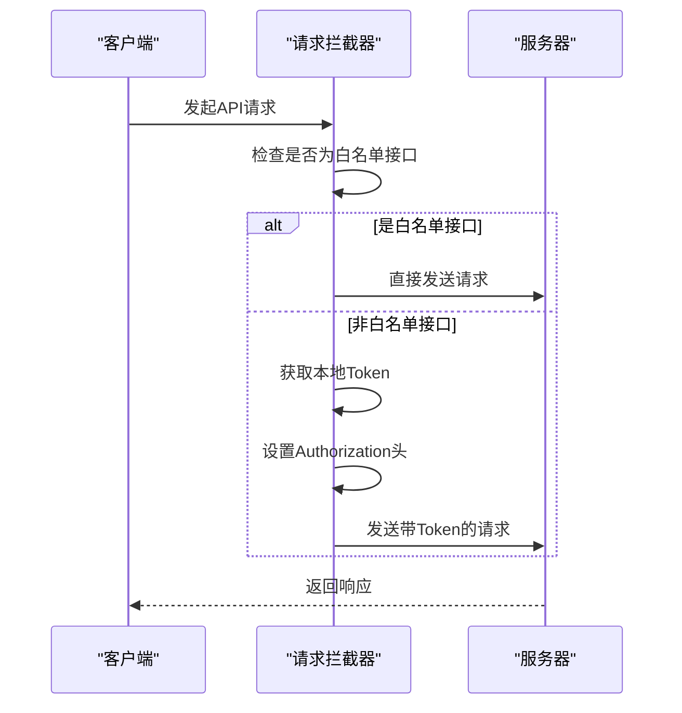
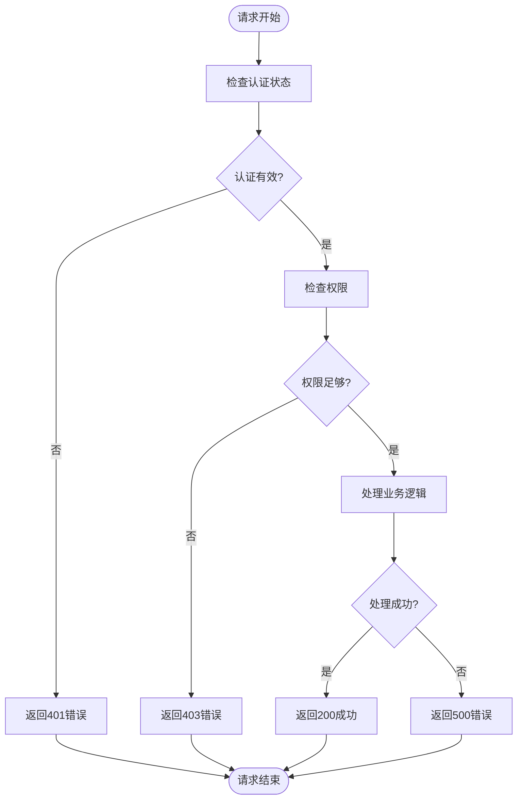
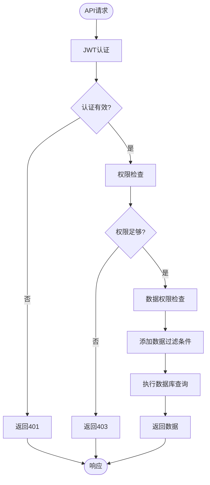
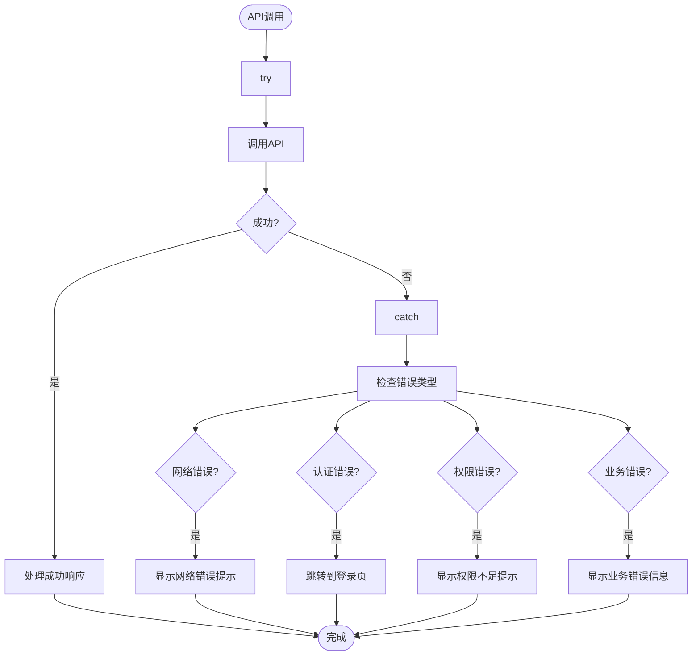

# 系统管理API

<cite>
**本文档引用的文件**   
- [user.js](file://bear-jia-vue3/src/api/system/user.js)
- [role.js](file://bear-jia-vue3/src/api/system/role.js)
- [menu.js](file://bear-jia-vue3/src/api/system/menu.js)
- [dept.js](file://bear-jia-vue3/src/api/system/dept.js)
- [post.js](file://bear-jia-vue3/src/api/system/post.js)
- [type.js](file://bear-jia-vue3/src/api/system/dict/type.js)
- [data.js](file://bear-jia-vue3/src/api/system/dict/data.js)
- [config.js](file://bear-jia-vue3/src/api/system/config.js)
- [request.js](file://bear-jia-vue3/src/utils/request.js)
- [errorCode.js](file://bear-jia-vue3/src/utils/errorCode.js)
- [hasPermi.js](file://bear-jia-vue3/src/directive/permission/hasPermi.js)
- [hasRole.js](file://bear-jia-vue3/src/directive/permission/hasRole.js)
- [auth.js](file://bear-jia-vue3/src/plugins/auth.js)
- [SysUserController.java](file://bearjia-admin-backend/src/main/java/com/javaxiaobear/module/system/controller/SysUserController.java)
- [SysRoleController.java](file://bearjia-admin-backend/src/main/java/com/javaxiaobear/module/system/controller/SysRoleController.java)
- [SysDeptController.java](file://bearjia-admin-backend/src/main/java/com/javaxiaobear/module/system/controller/SysDeptController.java)
- [bear_jia.sql](file://bearjia-admin-backend/src/main/resources/sql/bear_jia.sql)
</cite>

## 目录
1. [简介](#简介)
2. [通用规范](#通用规范)
3. [用户管理](#用户管理)
4. [角色管理](#角色管理)
5. [菜单管理](#菜单管理)
6. [部门管理](#部门管理)
7. [岗位管理](#岗位管理)
8. [字典管理](#字典管理)
9. [配置管理](#配置管理)
10. [权限控制](#权限控制)
11. [最佳实践](#最佳实践)

## 简介
系统管理API提供了一套完整的后台管理功能，涵盖用户、角色、菜单、部门、岗位、字典和配置等核心模块。所有API均采用RESTful风格设计，通过JWT进行身份认证，并实现了细粒度的权限控制。前端通过Vue3框架调用这些API，后端基于Spring Boot实现。

**Section sources**
- [user.js](file://bear-jia-vue3/src/api/system/user.js#L1-L131)
- [role.js](file://bear-jia-vue3/src/api/system/role.js#L1-L112)

## 通用规范
本节说明系统管理API的通用约定，包括分页参数、响应结构、认证要求和错误处理。

### 分页参数
所有列表查询接口均支持分页，使用以下两个参数：
- **pageNum**: 当前页码，从1开始，默认值为1
- **pageSize**: 每页记录数，默认值为10

请求示例：
```
GET /system/user/list?pageNum=1&pageSize=10
```

### 响应数据结构
所有API响应遵循统一格式：

```json
{
  "code": 200,
  "msg": "操作成功",
  "data": {}
}
```

**字段说明：**
- **code**: 响应状态码，200表示成功
- **msg**: 响应消息
- **data**: 响应数据，具体结构根据接口而定

### 认证要求
所有API端点（除登录和验证码外）均需要JWT Token认证。客户端需在请求头中包含Authorization字段：

```
Authorization: Bearer <JWT Token>
```

白名单接口（无需认证）：
- `/captchaImage` - 获取验证码
- `/login` - 用户登录



**Diagram sources**
- [request.js](file://bear-jia-vue3/src/utils/request.js#L18-L36)
- [auth.js](file://bear-jia-vue3/src/plugins/auth.js#L1-L61)

### 通用错误码
系统定义了标准的错误码体系，用于统一错误处理：

| 错误码 | 含义 | 系统管理场景说明 |
|--------|------|----------------|
| 401 | 认证失败 | Token过期或未登录，需重新登录 |
| 403 | 权限不足 | 用户无权执行该操作，检查角色权限 |
| 404 | 资源不存在 | 请求的用户、角色等资源不存在 |
| 500 | 系统错误 | 后端处理异常，联系管理员 |



**Diagram sources**
- [errorCode.js](file://bear-jia-vue3/src/utils/errorCode.js#L1-L7)
- [request.js](file://bear-jia-vue3/src/utils/request.js#L77-L102)

**Section sources**
- [errorCode.js](file://bear-jia-vue3/src/utils/errorCode.js#L1-L7)
- [request.js](file://bear-jia-vue3/src/utils/request.js#L1-L165)

## 用户管理
用户管理API提供用户全生命周期管理功能，包括查询、新增、修改、删除、状态控制和权限分配。

### 获取用户列表
查询用户分页列表。

- **HTTP方法**: GET
- **URL路径**: `/system/user/list`
- **认证要求**: JWT Token
- **权限要求**: `system:user:list`

**查询参数：**
- pageNum: 页码（可选，默认1）
- pageSize: 每页数量（可选，默认10）
- userName: 用户名（可选）
- phonenumber: 手机号（可选）
- status: 用户状态（可选，0正常 1停用）

**响应数据结构：**
```json
{
  "code": 200,
  "msg": "操作成功",
  "data": {
    "rows": [
      {
        "userId": 1,
        "userName": "admin",
        "nickName": "超级管理员",
        "phonenumber": "15888888888",
        "email": "admin@bearjia.com",
        "status": "0",
        "createTime": "2025-08-17 19:48:21"
      }
    ],
    "total": 1
  }
}
```

**请求示例：**
```
GET /system/user/list?pageNum=1&pageSize=10&userName=admin
```

**Section sources**
- [user.js](file://bear-jia-vue3/src/api/system/user.js#L5-L11)
- [SysUserController.java](file://bearjia-admin-backend/src/main/java/com/javaxiaobear/module/system/controller/SysUserController.java#L65-L68)

### 获取用户详情
根据用户ID查询用户详细信息。

- **HTTP方法**: GET
- **URL路径**: `/system/user/{userId}`
- **认证要求**: JWT Token
- **权限要求**: `system:user:query`

**路径参数：**
- userId: 用户ID

**响应数据结构：**
```json
{
  "code": 200,
  "msg": "操作成功",
  "data": {
    "userId": 1,
    "userName": "admin",
    "nickName": "超级管理员",
    "deptId": 103,
    "email": "admin@bearjia.com",
    "phonenumber": "15888888888",
    "sex": "1",
    "status": "0",
    "remark": "管理员",
    "postIds": [1],
    "roleIds": [1]
  }
}
```

**请求示例：**
```
GET /system/user/1
```

**Section sources**
- [user.js](file://bear-jia-vue3/src/api/system/user.js#L14-L19)
- [SysUserController.java](file://bearjia-admin-backend/src/main/java/com/javaxiaobear/module/system/controller/SysUserController.java)

### 新增用户
创建新用户。

- **HTTP方法**: POST
- **URL路径**: `/system/user`
- **认证要求**: JWT Token
- **权限要求**: `system:user:add`

**请求体参数：**
- userName: 用户名（必填）
- nickName: 昵称（必填）
- password: 密码（必填）
- email: 邮箱（可选）
- phonenumber: 手机号（可选）
- sex: 性别（可选，0男 1女 2未知）
- status: 状态（可选，0正常 1停用）
- deptId: 部门ID（必填）
- postIds: 岗位ID数组（可选）
- roleIds: 角色ID数组（可选）

**响应数据结构：**
```json
{
  "code": 200,
  "msg": "操作成功",
  "data": {}
}
```

**请求示例：**
```json
{
  "userName": "zhangsan",
  "nickName": "张三",
  "password": "123456",
  "email": "zhangsan@bearjia.com",
  "phonenumber": "13888888888",
  "sex": "1",
  "status": "0",
  "deptId": 105,
  "postIds": [2],
  "roleIds": [2]
}
```

**Section sources**
- [user.js](file://bear-jia-vue3/src/api/system/user.js#L22-L28)
- [SysUserController.java](file://bearjia-admin-backend/src/main/java/com/javaxiaobear/module/system/controller/SysUserController.java)

### 修改用户
更新用户信息。

- **HTTP方法**: PUT
- **URL路径**: `/system/user`
- **认证要求**: JWT Token
- **权限要求**: `system:user:edit`

**请求体参数：**
- userId: 用户ID（必填）
- userName: 用户名（必填）
- nickName: 昵称（必填）
- email: 邮箱（可选）
- phonenumber: 手机号（可选）
- sex: 性别（可选）
- status: 状态（可选）
- deptId: 部门ID（必填）
- postIds: 岗位ID数组（可选）
- roleIds: 角色ID数组（可选）

**响应数据结构：**
```json
{
  "code": 200,
  "msg": "操作成功",
  "data": {}
}
```

**请求示例：**
```json
{
  "userId": 2,
  "userName": "zhangsan",
  "nickName": "张三",
  "email": "zhangsan_new@bearjia.com",
  "phonenumber": "13888888888",
  "sex": "1",
  "status": "0",
  "deptId": 106,
  "postIds": [3],
  "roleIds": [3]
}
```

**Section sources**
- [user.js](file://bear-jia-vue3/src/api/system/user.js#L31-L37)
- [SysUserController.java](file://bearjia-admin-backend/src/main/java/com/javaxiaobear/module/system/controller/SysUserController.java)

### 删除用户
删除一个或多个用户。

- **HTTP方法**: DELETE
- **URL路径**: `/system/user/{userId}`
- **认证要求**: JWT Token
- **权限要求**: `system:user:remove`

**路径参数：**
- userId: 用户ID（多个ID用逗号分隔）

**响应数据结构：**
```json
{
  "code": 200,
  "msg": "操作成功",
  "data": {}
}
```

**请求示例：**
```
DELETE /system/user/2,3,4
```

**Section sources**
- [user.js](file://bear-jia-vue3/src/api/system/user.js#L40-L45)
- [SysUserController.java](file://bearjia-admin-backend/src/main/java/com/javaxiaobear/module/system/controller/SysUserController.java)

### 重置用户密码
重置指定用户的密码。

- **HTTP方法**: PUT
- **URL路径**: `/system/user/resetPwd`
- **认证要求**: JWT Token
- **权限要求**: `system:user:resetPwd`

**请求体参数：**
- userId: 用户ID（必填）
- password: 新密码（必填）

**响应数据结构：**
```json
{
  "code": 200,
  "msg": "操作成功",
  "data": {}
}
```

**请求示例：**
```json
{
  "userId": 2,
  "password": "newpassword123"
}
```

**Section sources**
- [user.js](file://bear-jia-vue3/src/api/system/user.js#L48-L58)
- [SysUserController.java](file://bearjia-admin-backend/src/main/java/com/javaxiaobear/module/system/controller/SysUserController.java)

### 修改用户状态
启用或禁用用户账户。

- **HTTP方法**: PUT
- **URL路径**: `/system/user/changeStatus`
- **认证要求**: JWT Token
- **权限要求**: `system:user:edit`

**请求体参数：**
- userId: 用户ID（必填）
- status: 状态（必填，0正常 1停用）

**响应数据结构：**
```json
{
  "code": 200,
  "msg": "操作成功",
  "data": {}
}
```

**请求示例：**
```json
{
  "userId": 2,
  "status": "1"
}
```

**Section sources**
- [user.js](file://bear-jia-vue3/src/api/system/user.js#L61-L71)
- [SysUserController.java](file://bearjia-admin-backend/src/main/java/com/javaxiaobear/module/system/controller/SysUserController.java)

## 角色管理
角色管理API提供角色的CRUD操作、数据权限配置和用户授权功能。

### 获取角色列表
查询角色分页列表。

- **HTTP方法**: GET
- **URL路径**: `/system/role/list`
- **认证要求**: JWT Token
- **权限要求**: `system:role:list`

**查询参数：**
- pageNum: 页码（可选，默认1）
- pageSize: 每页数量（可选，默认10）
- roleName: 角色名（可选）
- status: 状态（可选，0正常 1停用）

**响应数据结构：**
```json
{
  "code": 200,
  "msg": "操作成功",
  "data": {
    "rows": [
      {
        "roleId": 1,
        "roleName": "超级管理员",
        "roleKey": "admin",
        "roleSort": 1,
        "status": "0",
        "menuCheckStrictly": true,
        "deptCheckStrictly": true,
        "createTime": "2025-08-17 19:48:21"
      }
    ],
    "total": 1
  }
}
```

**请求示例：**
```
GET /system/role/list?pageNum=1&pageSize=10
```

**Section sources**
- [role.js](file://bear-jia-vue3/src/api/system/role.js#L4-L10)
- [SysRoleController.java](file://bearjia-admin-backend/src/main/java/com/javaxiaobear/module/system/controller/SysRoleController.java)

### 获取角色详情
根据角色ID查询角色详细信息。

- **HTTP方法**: GET
- **URL路径**: `/system/role/{roleId}`
- **认证要求**: JWT Token
- **权限要求**: `system:role:query`

**路径参数：**
- roleId: 角色ID

**响应数据结构：**
```json
{
  "code": 200,
  "msg": "操作成功",
  "data": {
    "roleId": 1,
    "roleName": "超级管理员",
    "roleKey": "admin",
    "roleSort": 1,
    "dataScope": "1",
    "menuCheckStrictly": true,
    "deptCheckStrictly": true,
    "status": "0",
    "remark": "超级管理员",
    "menuIds": [1,2,3],
    "deptIds": [100,101,102]
  }
}
```

**请求示例：**
```
GET /system/role/1
```

**Section sources**
- [role.js](file://bear-jia-vue3/src/api/system/role.js#L13-L18)
- [SysRoleController.java](file://bearjia-admin-backend/src/main/java/com/javaxiaobear/module/system/controller/SysRoleController.java)

### 新增角色
创建新角色。

- **HTTP方法**: POST
- **URL路径**: `/system/role`
- **认证要求**: JWT Token
- **权限要求**: `system:role:add`

**请求体参数：**
- roleName: 角色名（必填）
- roleKey: 角色权限字符串（必填）
- roleSort: 角色排序（必填）
- dataScope: 数据范围（可选，1全部 2自定义 3本部门 4本部门及以下）
- status: 状态（可选，0正常 1停用）
- menuCheckStrictly: 菜单树选择项严格模式（可选）
- deptCheckStrictly: 部门树选择项严格模式（可选）
- menuIds: 菜单ID数组（可选）
- deptIds: 部门ID数组（可选）

**响应数据结构：**
```json
{
  "code": 200,
  "msg": "操作成功",
  "data": {}
}
```

**请求示例：**
```json
{
  "roleName": "普通用户",
  "roleKey": "common",
  "roleSort": 2,
  "dataScope": "3",
  "status": "0",
  "menuIds": [100,101,102],
  "deptIds": [103]
}
```

**Section sources**
- [role.js](file://bear-jia-vue3/src/api/system/role.js#L21-L27)
- [SysRoleController.java](file://bearjia-admin-backend/src/main/java/com/javaxiaobear/module/system/controller/SysRoleController.java)

### 修改角色
更新角色信息。

- **HTTP方法**: PUT
- **URL路径**: `/system/role`
- **认证要求**: JWT Token
- **权限要求**: `system:role:edit`

**请求体参数：**
- roleId: 角色ID（必填）
- roleName: 角色名（必填）
- roleKey: 角色权限字符串（必填）
- roleSort: 角色排序（必填）
- dataScope: 数据范围（可选）
- status: 状态（可选）
- menuCheckStrictly: 菜单树选择项严格模式（可选）
- deptCheckStrictly: 部门树选择项严格模式（可选）
- menuIds: 菜单ID数组（可选）
- deptIds: 部门ID数组（可选）

**响应数据结构：**
```json
{
  "code": 200,
  "msg": "操作成功",
  "data": {}
}
```

**请求示例：**
```json
{
  "roleId": 2,
  "roleName": "普通用户",
  "roleKey": "common",
  "roleSort": 2,
  "dataScope": "4",
  "status": "0",
  "menuIds": [100,101,102,103],
  "deptIds": [103,104]
}
```

**Section sources**
- [role.js](file://bear-jia-vue3/src/api/system/role.js#L30-L36)
- [SysRoleController.java](file://bearjia-admin-backend/src/main/java/com/javaxiaobear/module/system/controller/SysRoleController.java)

### 配置角色数据权限
设置角色的数据权限范围。

- **HTTP方法**: PUT
- **URL路径**: `/system/role/dataScope`
- **认证要求**: JWT Token
- **权限要求**: `system:role:edit`

**请求体参数：**
- roleId: 角色ID（必填）
- dataScope: 数据范围（必填，1全部 2自定义 3本部门 4本部门及以下）
- deptIds: 部门ID数组（当dataScope=2时必填）

**响应数据结构：**
```json
{
  "code": 200,
  "msg": "操作成功",
  "data": {}
}
```

**请求示例：**
```json
{
  "roleId": 2,
  "dataScope": "2",
  "deptIds": [103,104,105]
}
```

**Section sources**
- [role.js](file://bear-jia-vue3/src/api/system/role.js#L39-L45)
- [SysRoleController.java](file://bearjia-admin-backend/src/main/java/com/javaxiaobear/module/system/controller/SysRoleController.java)

### 修改角色状态
启用或禁用角色。

- **HTTP方法**: PUT
- **URL路径**: `/system/role/changeStatus`
- **认证要求**: JWT Token
- **权限要求**: `system:role:edit`

**请求体参数：**
- roleId: 角色ID（必填）
- status: 状态（必填，0正常 1停用）

**响应数据结构：**
```json
{
  "code": 200,
  "msg": "操作成功",
  "data": {}
}
```

**请求示例：**
```json
{
  "roleId": 2,
  "status": "1"
}
```

**Section sources**
- [role.js](file://bear-jia-vue3/src/api/system/role.js#L48-L58)
- [SysRoleController.java](file://bearjia-admin-backend/src/main/java/com/javaxiaobear/module/system/controller/SysRoleController.java)

### 删除角色
删除一个或多个角色。

- **HTTP方法**: DELETE
- **URL路径**: `/system/role/{roleId}`
- **认证要求**: JWT Token
- **权限要求**: `system:role:remove`

**路径参数：**
- roleId: 角色ID（多个ID用逗号分隔）

**响应数据结构：**
```json
{
  "code": 200,
  "msg": "操作成功",
  "data": {}
}
```

**请求示例：**
```
DELETE /system/role/2,3,4
```

**Section sources**
- [role.js](file://bear-jia-vue3/src/api/system/role.js#L61-L66)
- [SysRoleController.java](file://bearjia-admin-backend/src/main/java/com/javaxiaobear/module/system/controller/SysRoleController.java)

### 查询角色已授权用户
查询已分配给指定角色的用户列表。

- **HTTP方法**: GET
- **URL路径**: `/system/role/authUser/allocatedList`
- **认证要求**: JWT Token
- **权限要求**: `system:role:list`

**查询参数：**
- pageNum: 页码（可选，默认1）
- pageSize: 每页数量（可选，默认10）
- roleId: 角色ID（必填）
- userName: 用户名（可选）
- phonenumber: 手机号（可选）

**响应数据结构：**
```json
{
  "code": 200,
  "msg": "操作成功",
  "data": {
    "rows": [
      {
        "userId": 1,
        "userName": "admin",
        "nickName": "超级管理员",
        "email": "admin@bearjia.com",
        "phonenumber": "15888888888",
        "status": "0"
      }
    ],
    "total": 1
  }
}
```

**请求示例：**
```
GET /system/role/authUser/allocatedList?roleId=2&pageNum=1&pageSize=10
```

**Section sources**
- [role.js](file://bear-jia-vue3/src/api/system/role.js#L69-L75)
- [SysRoleController.java](file://bearjia-admin-backend/src/main/java/com/javaxiaobear/module/system/controller/SysRoleController.java)

### 查询角色未授权用户
查询未分配给指定角色的用户列表。

- **HTTP方法**: GET
- **URL路径**: `/system/role/authUser/unallocatedList`
- **认证要求**: JWT Token
- **权限要求**: `system:role:list`

**查询参数：**
- pageNum: 页码（可选，默认1）
- pageSize: 每页数量（可选，默认10）
- roleId: 角色ID（必填）
- userName: 用户名（可选）
- phonenumber: 手机号（可选）

**响应数据结构：**
```json
{
  "code": 200,
  "msg": "操作成功",
  "data": {
    "rows": [
      {
        "userId": 3,
        "userName": "lisi",
        "nickName": "李四",
        "email": "lisi@bearjia.com",
        "phonenumber": "13988888888",
        "status": "0"
      }
    ],
    "total": 5
  }
}
```

**请求示例：**
```
GET /system/role/authUser/unallocatedList?roleId=2&pageNum=1&pageSize=10
```

**Section sources**
- [role.js](file://bear-jia-vue3/src/api/system/role.js#L78-L84)
- [SysRoleController.java](file://bearjia-admin-backend/src/main/java/com/javaxiaobear/module/system/controller/SysRoleController.java)

### 批量取消用户授权
从角色中批量取消用户的授权。

- **HTTP方法**: PUT
- **URL路径**: `/system/role/authUser/cancel`
- **认证要求**: JWT Token
- **权限要求**: `system:role:edit`

**请求体参数：**
- roleId: 角色ID（必填）
- userIds: 用户ID数组（必填）

**响应数据结构：**
```json
{
  "code": 200,
  "msg": "操作成功",
  "data": {}
}
```

**请求示例：**
```json
{
  "roleId": 2,
  "userIds": [3,4,5]
}
```

**Section sources**
- [role.js](file://bear-jia-vue3/src/api/system/role.js#L87-L93)
- [SysRoleController.java](file://bearjia-admin-backend/src/main/java/com/javaxiaobear/module/system/controller/SysRoleController.java)

### 批量授权用户
向角色批量添加用户授权。

- **HTTP方法**: PUT
- **URL路径**: `/system/role/authUser/selectAll`
- **认证要求**: JWT Token
- **权限要求**: `system:role:edit`

**查询参数：**
- roleId: 角色ID（必填）
- userIds: 用户ID数组（必填）

**响应数据结构：**
```json
{
  "code": 200,
  "msg": "操作成功",
  "data": {}
}
```

**请求示例：**
```
PUT /system/role/authUser/selectAll?roleId=2&userIds=3,4,5
```

**Section sources**
- [role.js](file://bear-jia-vue3/src/api/system/role.js#L105-L111)
- [SysRoleController.java](file://bearjia-admin-backend/src/main/java/com/javaxiaobear/module/system/controller/SysRoleController.java)

## 菜单管理
菜单管理API提供菜单的CRUD操作和树形结构查询功能。

### 获取菜单列表
查询菜单分页列表。

- **HTTP方法**: GET
- **URL路径**: `/system/menu/list`
- **认证要求**: JWT Token
- **权限要求**: `system:menu:list`

**查询参数：**
- pageNum: 页码（可选，默认1）
- pageSize: 每页数量（可选，默认10）
- menuName: 菜单名（可选）
- status: 状态（可选，0正常 1停用）

**响应数据结构：**
```json
{
  "code": 200,
  "msg": "操作成功",
  "data": {
    "rows": [
      {
        "menuId": 1,
        "menuName": "系统管理",
        "parentName": "主目录",
        "orderNum": 1,
        "path": "system",
        "component": "Layout",
        "menuType": "M",
        "status": "0",
        "perms": ""
      }
    ],
    "total": 10
  }
}
```

**请求示例：**
```
GET /system/menu/list?pageNum=1&pageSize=10
```

**Section sources**
- [menu.js](file://bear-jia-vue3/src/api/system/menu.js#L12-L18)
- [bear_jia.sql](file://bearjia-admin-backend/src/main/resources/sql/bear_jia.sql)

### 获取菜单详情
根据菜单ID查询菜单详细信息。

- **HTTP方法**: GET
- **URL路径**: `/system/menu/{menuId}`
- **认证要求**: JWT Token
- **权限要求**: `system:menu:query`

**路径参数：**
- menuId: 菜单ID

**响应数据结构：**
```json
{
  "code": 200,
  "msg": "操作成功",
  "data": {
    "menuId": 100,
    "menuName": "用户管理",
    "parentId": 1,
    "orderNum": 1,
    "path": "user",
    "component": "system/user/index",
    "menuType": "C",
    "visible": "0",
    "status": "0",
    "perms": "system:user:list",
    "icon": "user"
  }
}
```

**请求示例：**
```
GET /system/menu/100
```

**Section sources**
- [menu.js](file://bear-jia-vue3/src/api/system/menu.js#L21-L26)
- [bear_jia.sql](file://bearjia-admin-backend/src/main/resources/sql/bear_jia.sql)

### 获取菜单树结构
获取所有菜单的树形结构，用于菜单选择。

- **HTTP方法**: GET
- **URL路径**: `/system/menu/treeselect`
- **认证要求**: JWT Token
- **权限要求**: 无特定权限要求

**响应数据结构：**
```json
{
  "code": 200,
  "msg": "操作成功",
  "data": [
    {
      "id": 1,
      "label": "系统管理",
      "children": [
        {
          "id": 100,
          "label": "用户管理"
        }
      ]
    }
  ]
}
```

**请求示例：**
```
GET /system/menu/treeselect
```

**Section sources**
- [menu.js](file://bear-jia-vue3/src/api/system/menu.js#L29-L34)
- [bear_jia.sql](file://bearjia-admin-backend/src/main/resources/sql/bear_jia.sql)

### 获取角色菜单树结构
根据角色ID获取菜单树结构，用于角色授权。

- **HTTP方法**: GET
- **URL路径**: `/system/menu/roleMenuTreeselect/{roleId}`
- **认证要求**: JWT Token
- **权限要求**: 无特定权限要求

**路径参数：**
- roleId: 角色ID

**响应数据结构：**
```json
{
  "code": 200,
  "msg": "操作成功",
  "data": {
    "checkedKeys": [1,100,101],
    "menus": [
      {
        "id": 1,
        "label": "系统管理",
        "children": [
          {
            "id": 100,
            "label": "用户管理"
          }
        ]
      }
    ]
  }
}
```

**请求示例：**
```
GET /system/menu/roleMenuTreeselect/2
```

**Section sources**
- [menu.js](file://bear-jia-vue3/src/api/system/menu.js#L37-L42)
- [bear_jia.sql](file://bearjia-admin-backend/src/main/resources/sql/bear_jia.sql)

### 新增菜单
创建新菜单。

- **HTTP方法**: POST
- **URL路径**: `/system/menu`
- **认证要求**: JWT Token
- **权限要求**: `system:menu:add`

**请求体参数：**
- menuName: 菜单名称（必填）
- parentId: 父菜单ID（必填）
- orderNum: 显示顺序（必填）
- path: 路由地址（可选）
- component: 组件路径（可选）
- menuType: 菜单类型（必填，M目录 C菜单 F按钮）
- visible: 菜单状态（可选，0显示 1隐藏）
- status: 菜单状态（可选，0正常 1停用）
- perms: 权限标识（可选）
- icon: 菜单图标（可选）

**响应数据结构：**
```json
{
  "code": 200,
  "msg": "操作成功",
  "data": {}
}
```

**请求示例：**
```json
{
  "menuName": "岗位管理",
  "parentId": 1,
  "orderNum": 5,
  "path": "post",
  "component": "system/post/index",
  "menuType": "C",
  "visible": "0",
  "status": "0",
  "perms": "system:post:list",
  "icon": "post"
}
```

**Section sources**
- [menu.js](file://bear-jia-vue3/src/api/system/menu.js#L45-L51)
- [bear_jia.sql](file://bearjia-admin-backend/src/main/resources/sql/bear_jia.sql)

### 修改菜单
更新菜单信息。

- **HTTP方法**: PUT
- **URL路径**: `/system/menu`
- **认证要求**: JWT Token
- **权限要求**: `system:menu:edit`

**请求体参数：**
- menuId: 菜单ID（必填）
- menuName: 菜单名称（必填）
- parentId: 父菜单ID（必填）
- orderNum: 显示顺序（必填）
- path: 路由地址（可选）
- component: 组件路径（可选）
- menuType: 菜单类型（必填）
- visible: 菜单状态（可选）
- status: 菜单状态（可选）
- perms: 权限标识（可选）
- icon: 菜单图标（可选）

**响应数据结构：**
```json
{
  "code": 200,
  "msg": "操作成功",
  "data": {}
}
```

**请求示例：**
```json
{
  "menuId": 104,
  "menuName": "岗位管理",
  "parentId": 1,
  "orderNum": 5,
  "path": "post",
  "component": "system/post/index",
  "menuType": "C",
  "visible": "0",
  "status": "0",
  "perms": "system:post:list",
  "icon": "post"
}
```

**Section sources**
- [menu.js](file://bear-jia-vue3/src/api/system/menu.js#L54-L60)
- [bear_jia.sql](file://bearjia-admin-backend/src/main/resources/sql/bear_jia.sql)

### 删除菜单
删除一个菜单。

- **HTTP方法**: DELETE
- **URL路径**: `/system/menu/{menuId}`
- **认证要求**: JWT Token
- **权限要求**: `system:menu:remove`

**路径参数：**
- menuId: 菜单ID

**响应数据结构：**
```json
{
  "code": 200,
  "msg": "操作成功",
  "data": {}
}
```

**请求示例：**
```
DELETE /system/menu/104
```

**Section sources**
- [menu.js](file://bear-jia-vue3/src/api/system/menu.js#L63-L68)
- [bear_jia.sql](file://bearjia-admin-backend/src/main/resources/sql/bear_jia.sql)

## 部门管理
部门管理API提供部门的CRUD操作和树形结构查询功能。

### 获取部门列表
查询部门分页列表。

- **HTTP方法**: GET
- **URL路径**: `/system/dept/list`
- **认证要求**: JWT Token
- **权限要求**: `system:dept:list`

**查询参数：**
- pageNum: 页码（可选，默认1）
- pageSize: 每页数量（可选，默认10）
- deptName: 部门名（可选）
- status: 状态（可选，0正常 1停用）

**响应数据结构：**
```json
{
  "code": 200,
  "msg": "操作成功",
  "data": {
    "rows": [
      {
        "deptId": 100,
        "deptName": "研发部门",
        "parentId": 0,
        "orderNum": 1,
        "leader": "张三",
        "phone": "010-88888888",
        "email": "rd@bearjia.com",
        "status": "0",
        "children": []
      }
    ],
    "total": 5
  }
}
```

**请求示例：**
```
GET /system/dept/list?pageNum=1&pageSize=10
```

**Section sources**
- [dept.js](file://bear-jia-vue3/src/api/system/dept.js#L4-L10)
- [SysDeptController.java](file://bearjia-admin-backend/src/main/java/com/javaxiaobear/module/system/controller/SysDeptController.java)

### 获取部门详情
根据部门ID查询部门详细信息。

- **HTTP方法**: GET
- **URL路径**: `/system/dept/{deptId}`
- **认证要求**: JWT Token
- **权限要求**: `system:dept:query`

**路径参数：**
- deptId: 部门ID

**响应数据结构：**
```json
{
  "code": 200,
  "msg": "操作成功",
  "data": {
    "deptId": 100,
    "deptName": "研发部门",
    "parentId": 0,
    "orderNum": 1,
    "leader": "张三",
    "phone": "010-88888888",
    "email": "rd@bearjia.com",
    "status": "0"
  }
}
```

**请求示例：**
```
GET /system/dept/100
```

**Section sources**
- [dept.js](file://bear-jia-vue3/src/api/system/dept.js#L21-L26)
- [SysDeptController.java](file://bearjia-admin-backend/src/main/java/com/javaxiaobear/module/system/controller/SysDeptController.java)

### 获取部门树结构
获取所有部门的树形结构，用于部门选择。

- **HTTP方法**: GET
- **URL路径**: `/system/user/deptTree`
- **认证要求**: JWT Token
- **权限要求**: 无特定权限要求

**响应数据结构：**
```json
{
  "code": 200,
  "msg": "操作成功",
  "data": [
    {
      "id": 100,
      "label": "研发部门",
      "children": [
        {
          "id": 101,
          "label": "前端组"
        }
      ]
    }
  ]
}
```

**请求示例：**
```
GET /system/user/deptTree
```

**Section sources**
- [dept.js](file://bear-jia-vue3/src/api/system/dept.js#L29-L34)
- [SysDeptController.java](file://bearjia-admin-backend/src/main/java/com/javaxiaobear/module/system/controller/SysDeptController.java)

### 获取角色部门树结构
根据角色ID获取部门树结构，用于角色数据权限配置。

- **HTTP方法**: GET
- **URL路径**: `/system/dept/roleDeptTreeselect/{roleId}`
- **认证要求**: JWT Token
- **权限要求**: 无特定权限要求

**路径参数：**
- roleId: 角色ID

**响应数据结构：**
```json
{
  "code": 200,
  "msg": "操作成功",
  "data": {
    "checkedKeys": [100,101],
    "depts": [
      {
        "id": 100,
        "label": "研发部门",
        "children": [
          {
            "id": 101,
            "label": "前端组"
          }
        ]
      }
    ]
  }
}
```

**请求示例：**
```
GET /system/dept/roleDeptTreeselect/2
```

**Section sources**
- [dept.js](file://bear-jia-vue3/src/api/system/dept.js#L37-L42)
- [SysDeptController.java](file://bearjia-admin-backend/src/main/java/com/javaxiaobear/module/system/controller/SysDeptController.java)

### 新增部门
创建新部门。

- **HTTP方法**: POST
- **URL路径**: `/system/dept`
- **认证要求**: JWT Token
- **权限要求**: `system:dept:add`

**请求体参数：**
- deptName: 部门名称（必填）
- parentId: 父部门ID（必填）
- orderNum: 显示顺序（必填）
- leader: 负责人（可选）
- phone: 联系电话（可选）
- email: 邮箱（可选）
- status: 部门状态（可选，0正常 1停用）

**响应数据结构：**
```json
{
  "code": 200,
  "msg": "操作成功",
  "data": {}
}
```

**请求示例：**
```json
{
  "deptName": "测试部门",
  "parentId": 100,
  "orderNum": 2,
  "leader": "李四",
  "phone": "010-88888888",
  "email": "test@bearjia.com",
  "status": "0"
}
```

**Section sources**
- [dept.js](file://bear-jia-vue3/src/api/system/dept.js#L45-L51)
- [SysDeptController.java](file://bearjia-admin-backend/src/main/java/com/javaxiaobear/module/system/controller/SysDeptController.java)

### 修改部门
更新部门信息。

- **HTTP方法**: PUT
- **URL路径**: `/system/dept`
- **认证要求**: JWT Token
- **权限要求**: `system:dept:edit`

**请求体参数：**
- deptId: 部门ID（必填）
- deptName: 部门名称（必填）
- parentId: 父部门ID（必填）
- orderNum: 显示顺序（必填）
- leader: 负责人（可选）
- phone: 联系电话（可选）
- email: 邮箱（可选）
- status: 部门状态（可选）

**响应数据结构：**
```json
{
  "code": 200,
  "msg": "操作成功",
  "data": {}
}
```

**请求示例：**
```json
{
  "deptId": 105,
  "deptName": "测试部门",
  "parentId": 100,
  "orderNum": 2,
  "leader": "李四",
  "phone": "010-88888888",
  "email": "test_new@bearjia.com",
  "status": "0"
}
```

**Section sources**
- [dept.js](file://bear-jia-vue3/src/api/system/dept.js#L54-L60)
- [SysDeptController.java](file://bearjia-admin-backend/src/main/java/com/javaxiaobear/module/system/controller/SysDeptController.java)

### 删除部门
删除一个部门。

- **HTTP方法**: DELETE
- **URL路径**: `/system/dept/{deptId}`
- **认证要求**: JWT Token
- **权限要求**: `system:dept:remove`

**路径参数：**
- deptId: 部门ID

**响应数据结构：**
```json
{
  "code": 200,
  "msg": "操作成功",
  "data": {}
}
```

**请求示例：**
```
DELETE /system/dept/105
```

**Section sources**
- [dept.js](file://bear-jia-vue3/src/api/system/dept.js#L63-L68)
- [SysDeptController.java](file://bearjia-admin-backend/src/main/java/com/javaxiaobear/module/system/controller/SysDeptController.java)

## 岗位管理
岗位管理API提供岗位的CRUD操作和导出功能。

### 获取岗位列表
查询岗位分页列表。

- **HTTP方法**: GET
- **URL路径**: `/system/post/list`
- **认证要求**: JWT Token
- **权限要求**: `system:post:list`

**查询参数：**
- pageNum: 页码（可选，默认1）
- pageSize: 每页数量（可选，默认10）
- postName: 岗位名称（可选）
- status: 状态（可选，0正常 1停用）

**响应数据结构：**
```json
{
  "code": 200,
  "msg": "操作成功",
  "data": {
    "rows": [
      {
        "postId": 1,
        "postName": "系统管理员",
        "postCode": "SYSTEM_ADMIN",
        "postSort": 1,
        "status": "0",
        "createTime": "2025-08-17 19:48:21"
      }
    ],
    "total": 4
  }
}
```

**请求示例：**
```
GET /system/post/list?pageNum=1&pageSize=10
```

**Section sources**
- [post.js](file://bear-jia-vue3/src/api/system/post.js#L4-L10)
- [bear_jia.sql](file://bearjia-admin-backend/src/main/resources/sql/bear_jia.sql)

### 获取岗位详情
根据岗位ID查询岗位详细信息。

- **HTTP方法**: GET
- **URL路径**: `/system/post/{postId}`
- **认证要求**: JWT Token
- **权限要求**: `system:post:query`

**路径参数：**
- postId: 岗位ID

**响应数据结构：**
```json
{
  "code": 200,
  "msg": "操作成功",
  "data": {
    "postId": 1,
    "postName": "系统管理员",
    "postCode": "SYSTEM_ADMIN",
    "postSort": 1,
    "status": "0",
    "remark": "系统管理员"
  }
}
```

**请求示例：**
```
GET /system/post/1
```

**Section sources**
- [post.js](file://bear-jia-vue3/src/api/system/post.js#L13-L18)
- [bear_jia.sql](file://bearjia-admin-backend/src/main/resources/sql/bear_jia.sql)

### 新增岗位
创建新岗位。

- **HTTP方法**: POST
- **URL路径**: `/system/post`
- **认证要求**: JWT Token
- **权限要求**: `system:post:add`

**请求体参数：**
- postName: 岗位名称（必填）
- postCode: 岗位编码（必填）
- postSort: 显示顺序（必填）
- status: 岗位状态（可选，0正常 1停用）
- remark: 备注（可选）

**响应数据结构：**
```json
{
  "code": 200,
  "msg": "操作成功",
  "data": {}
}
```

**请求示例：**
```json
{
  "postName": "测试工程师",
  "postCode": "TEST_ENGINEER",
  "postSort": 2,
  "status": "0",
  "remark": "测试工程师"
}
```

**Section sources**
- [post.js](file://bear-jia-vue3/src/api/system/post.js#L21-L27)
- [bear_jia.sql](file://bearjia-admin-backend/src/main/resources/sql/bear_jia.sql)

### 修改岗位
更新岗位信息。

- **HTTP方法**: PUT
- **URL路径**: `/system/post`
- **认证要求**: JWT Token
- **权限要求**: `system:post:edit`

**请求体参数：**
- postId: 岗位ID（必填）
- postName: 岗位名称（必填）
- postCode: 岗位编码（必填）
- postSort: 显示顺序（必填）
- status: 岗位状态（可选）
- remark: 备注（可选）

**响应数据结构：**
```json
{
  "code": 200,
  "msg": "操作成功",
  "data": {}
}
```

**请求示例：**
```json
{
  "postId": 2,
  "postName": "测试工程师",
  "postCode": "TEST_ENGINEER",
  "postSort": 2,
  "status": "0",
  "remark": "高级测试工程师"
}
```

**Section sources**
- [post.js](file://bear-jia-vue3/src/api/system/post.js#L30-L36)
- [bear_jia.sql](file://bearjia-admin-backend/src/main/resources/sql/bear_jia.sql)

### 删除岗位
删除一个岗位。

- **HTTP方法**: DELETE
- **URL路径**: `/system/post/{postId}`
- **认证要求**: JWT Token
- **权限要求**: `system:post:remove`

**路径参数：**
- postId: 岗位ID

**响应数据结构：**
```json
{
  "code": 200,
  "msg": "操作成功",
  "data": {}
}
```

**请求示例：**
```
DELETE /system/post/2
```

**Section sources**
- [post.js](file://bear-jia-vue3/src/api/system/post.js#L39-L44)
- [bear_jia.sql](file://bearjia-admin-backend/src/main/resources/sql/bear_jia.sql)

### 导出岗位
导出岗位数据为Excel文件。

- **HTTP方法**: GET
- **URL路径**: `/system/post/export`
- **认证要求**: JWT Token
- **权限要求**: `system:post:export`

**查询参数：**
- postName: 岗位名称（可选）
- status: 状态（可选）

**响应数据结构：**
- 返回Excel文件流

**请求示例：**
```
GET /system/post/export?postName=测试
```

**Section sources**
- [post.js](file://bear-jia-vue3/src/api/system/post.js#L47-L53)
- [bear_jia.sql](file://bearjia-admin-backend/src/main/resources/sql/bear_jia.sql)

## 字典管理
字典管理API分为字典类型和字典数据两个子模块，提供完整的字典管理功能。

### 字典类型管理

#### 获取字典类型列表
查询字典类型分页列表。

- **HTTP方法**: GET
- **URL路径**: `/system/dict/type/list`
- **认证要求**: JWT Token
- **权限要求**: `system:dict:list`

**查询参数：**
- pageNum: 页码（可选，默认1）
- pageSize: 每页数量（可选，默认10）
- dictName: 字典名称（可选）
- dictType: 字典类型（可选）
- status: 状态（可选，0正常 1停用）

**响应数据结构：**
```json
{
  "code": 200,
  "msg": "操作成功",
  "data": {
    "rows": [
      {
        "dictId": 1,
        "dictName": "用户性别",
        "dictType": "sys_user_sex",
        "status": "0",
        "createBy": "admin",
        "createTime": "2025-08-17 19:48:21",
        "remark": "用户性别列表"
      }
    ],
    "total": 5
  }
}
```

**请求示例：**
```
GET /system/dict/type/list?pageNum=1&pageSize=10
```

**Section sources**
- [type.js](file://bear-jia-vue3/src/api/system/dict/type.js#L4-L10)
- [bear_jia.sql](file://bearjia-admin-backend/src/main/resources/sql/bear_jia.sql)

#### 获取字典类型详情
根据字典ID查询字典类型详细信息。

- **HTTP方法**: GET
- **URL路径**: `/system/dict/type/{dictId}`
- **认证要求**: JWT Token
- **权限要求**: `system:dict:query`

**路径参数：**
- dictId: 字典ID

**响应数据结构：**
```json
{
  "code": 200,
  "msg": "操作成功",
  "data": {
    "dictId": 1,
    "dictName": "用户性别",
    "dictType": "sys_user_sex",
    "status": "0",
    "remark": "用户性别列表"
  }
}
```

**请求示例：**
```
GET /system/dict/type/1
```

**Section sources**
- [type.js](file://bear-jia-vue3/src/api/system/dict/type.js#L13-L18)
- [bear_jia.sql](file://bearjia-admin-backend/src/main/resources/sql/bear_jia.sql)

#### 新增字典类型
创建新字典类型。

- **HTTP方法**: POST
- **URL路径**: `/system/dict/type`
- **认证要求**: JWT Token
- **权限要求**: `system:dict:add`

**请求体参数：**
- dictName: 字典名称（必填）
- dictType: 字典类型（必填）
- status: 状态（可选，0正常 1停用）
- remark: 备注（可选）

**响应数据结构：**
```json
{
  "code": 200,
  "msg": "操作成功",
  "data": {}
}
```

**请求示例：**
```json
{
  "dictName": "通知类型",
  "dictType": "sys_notice_type",
  "status": "0",
  "remark": "系统通知类型"
}
```

**Section sources**
- [type.js](file://bear-jia-vue3/src/api/system/dict/type.js#L21-L27)
- [bear_jia.sql](file://bearjia-admin-backend/src/main/resources/sql/bear_jia.sql)

#### 修改字典类型
更新字典类型信息。

- **HTTP方法**: PUT
- **URL路径**: `/system/dict/type`
- **认证要求**: JWT Token
- **权限要求**: `system:dict:edit`

**请求体参数：**
- dictId: 字典ID（必填）
- dictName: 字典名称（必填）
- dictType: 字典类型（必填）
- status: 状态（可选）
- remark: 备注（可选）

**响应数据结构：**
```json
{
  "code": 200,
  "msg": "操作成功",
  "data": {}
}
```

**请求示例：**
```json
{
  "dictId": 2,
  "dictName": "通知类型",
  "dictType": "sys_notice_type",
  "status": "0",
  "remark": "系统通知类型"
}
```

**Section sources**
- [type.js](file://bear-jia-vue3/src/api/system/dict/type.js#L30-L36)
- [bear_jia.sql](file://bearjia-admin-backend/src/main/resources/sql/bear_jia.sql)

#### 删除字典类型
删除一个字典类型。

- **HTTP方法**: DELETE
- **URL路径**: `/system/dict/type/{dictId}`
- **认证要求**: JWT Token
- **权限要求**: `system:dict:remove`

**路径参数：**
- dictId: 字典ID

**响应数据结构：**
```json
{
  "code": 200,
  "msg": "操作成功",
  "data": {}
}
```

**请求示例：**
```
DELETE /system/dict/type/2
```

**Section sources**
- [type.js](file://bear-jia-vue3/src/api/system/dict/type.js#L39-L44)
- [bear_jia.sql](file://bearjia-admin-backend/src/main/resources/sql/bear_jia.sql)

#### 刷新字典缓存
刷新系统字典缓存。

- **HTTP方法**: DELETE
- **URL路径**: `/system/dict/type/refreshCache`
- **认证要求**: JWT Token
- **权限要求**: `system:dict:remove`

**响应数据结构：**
```json
{
  "code": 200,
  "msg": "操作成功",
  "data": {}
}
```

**请求示例：**
```
DELETE /system/dict/type/refreshCache
```

**Section sources**
- [type.js](file://bear-jia-vue3/src/api/system/dict/type.js#L47-L52)
- [bear_jia.sql](file://bearjia-admin-backend/src/main/resources/sql/bear_jia.sql)

#### 获取字典选择框列表
获取字典类型选择框列表。

- **HTTP方法**: GET
- **URL路径**: `/system/dict/type/optionselect`
- **认证要求**: JWT Token
- **权限要求**: 无特定权限要求

**响应数据结构：**
```json
{
  "code": 200,
  "msg": "操作成功",
  "data": [
    {
      "dictId": 1,
      "dictName": "用户性别",
      "dictType": "sys_user_sex"
    }
  ]
}
```

**请求示例：**
```
GET /system/dict/type/optionselect
```

**Section sources**
- [type.js](file://bear-jia-vue3/src/api/system/dict/type.js#L55-L61)
- [bear_jia.sql](file://bearjia-admin-backend/src/main/resources/sql/bear_jia.sql)

### 字典数据管理

#### 获取字典数据列表
查询字典数据分页列表。

- **HTTP方法**: GET
- **URL路径**: `/system/dict/data/list`
- **认证要求**: JWT Token
- **权限要求**: `system:dict:list`

**查询参数：**
- pageNum: 页码（可选，默认1）
- pageSize: 每页数量（可选，默认10）
- dictName: 字典名称（可选）
- dictType: 字典类型（必填）
- status: 状态（可选，0正常 1停用）

**响应数据结构：**
```json
{
  "code": 200,
  "msg": "操作成功",
  "data": {
    "rows": [
      {
        "dictCode": 1,
        "dictLabel": "男",
        "dictValue": "0",
        "dictType": "sys_user_sex",
        "cssClass": "",
        "listClass": "primary",
        "isDefault": "Y",
        "status": "0",
        "createBy": "admin",
        "createTime": "2025-08-17 19:48:21"
      }
    ],
    "total": 2
  }
}
```

**请求示例：**
```
GET /system/dict/data/list?dictType=sys_user_sex&pageNum=1&pageSize=10
```

**Section sources**
- [data.js](file://bear-jia-vue3/src/api/system/dict/data.js#L4-L10)
- [bear_jia.sql](file://bearjia-admin-backend/src/main/resources/sql/bear_jia.sql)

#### 获取字典数据详情
根据字典编码查询字典数据详细信息。

- **HTTP方法**: GET
- **URL路径**: `/system/dict/data/{dictCode}`
- **认证要求**: JWT Token
- **权限要求**: `system:dict:query`

**路径参数：**
- dictCode: 字典编码

**响应数据结构：**
```json
{
  "code": 200,
  "msg": "操作成功",
  "data": {
    "dictCode": 1,
    "dictLabel": "男",
    "dictValue": "0",
    "dictType": "sys_user_sex",
    "cssClass": "",
    "listClass": "primary",
    "isDefault": "Y",
    "status": "0",
    "remark": "男性"
  }
}
```

**请求示例：**
```
GET /system/dict/data/1
```

**Section sources**
- [data.js](file://bear-jia-vue3/src/api/system/dict/data.js#L13-L18)
- [bear_jia.sql](file://bearjia-admin-backend/src/main/resources/sql/bear_jia.sql)

#### 根据字典类型查询字典数据
根据字典类型获取所有字典数据。

- **HTTP方法**: GET
- **URL路径**: `/system/dict/data/type/{dictType}`
- **认证要求**: JWT Token
- **权限要求**: 无特定权限要求

**路径参数：**
- dictType: 字典类型

**响应数据结构：**
```json
{
  "code": 200,
  "msg": "操作成功",
  "data": [
    {
      "dictLabel": "男",
      "dictValue": "0"
    },
    {
      "dictLabel": "女",
      "dictValue": "1"
    }
  ]
}
```

**请求示例：**
```
GET /system/dict/data/type/sys_user_sex
```

**Section sources**
- [data.js](file://bear-jia-vue3/src/api/system/dict/data.js#L21-L26)
- [bear_jia.sql](file://bearjia-admin-backend/src/main/resources/sql/bear_jia.sql)

#### 新增字典数据
创建新字典数据。

- **HTTP方法**: POST
- **URL路径**: `/system/dict/data`
- **认证要求**: JWT Token
- **权限要求**: `system:dict:add`

**请求体参数：**
- dictLabel: 字典标签（必填）
- dictValue: 字典键值（必填）
- dictType: 字典类型（必填）
- cssClass: CSS类名（可选）
- listClass: 回显样式（可选）
- isDefault: 是否默认（可选，Y是 N否）
- status: 状态（可选，0正常 1停用）
- remark: 备注（可选）

**响应数据结构：**
```json
{
  "code": 200,
  "msg": "操作成功",
  "data": {}
}
```

**请求示例：**
```json
{
  "dictLabel": "未知",
  "dictValue": "2",
  "dictType": "sys_user_sex",
  "cssClass": "",
  "listClass": "info",
  "isDefault": "N",
  "status": "0",
  "remark": "未知性别"
}
```

**Section sources**
- [data.js](file://bear-jia-vue3/src/api/system/dict/data.js#L29-L35)
- [bear_jia.sql](file://bearjia-admin-backend/src/main/resources/sql/bear_jia.sql)

#### 修改字典数据
更新字典数据信息。

- **HTTP方法**: PUT
- **URL路径**: `/system/dict/data`
- **认证要求**: JWT Token
- **权限要求**: `system:dict:edit`

**请求体参数：**
- dictCode: 字典编码（必填）
- dictLabel: 字典标签（必填）
- dictValue: 字典键值（必填）
- dictType: 字典类型（必填）
- cssClass: CSS类名（可选）
- listClass: 回显样式（可选）
- isDefault: 是否默认（可选）
- status: 状态（可选）
- remark: 备注（可选）

**响应数据结构：**
```json
{
  "code": 200,
  "msg": "操作成功",
  "data": {}
}
```

**请求示例：**
```json
{
  "dictCode": 3,
  "dictLabel": "未知",
  "dictValue": "2",
  "dictType": "sys_user_sex",
  "cssClass": "",
  "listClass": "warning",
  "isDefault": "N",
  "status": "0",
  "remark": "未知性别"
}
```

**Section sources**
- [data.js](file://bear-jia-vue3/src/api/system/dict/data.js#L38-L44)
- [bear_jia.sql](file://bearjia-admin-backend/src/main/resources/sql/bear_jia.sql)

#### 删除字典数据
删除一个字典数据。

- **HTTP方法**: DELETE
- **URL路径**: `/system/dict/data/{dictCode}`
- **认证要求**: JWT Token
- **权限要求**: `system:dict:remove`

**路径参数：**
- dictCode: 字典编码

**响应数据结构：**
```json
{
  "code": 200,
  "msg": "操作成功",
  "data": {}
}
```

**请求示例：**
```
DELETE /system/dict/data/3
```

**Section sources**
- [data.js](file://bear-jia-vue3/src/api/system/dict/data.js#L47-L52)
- [bear_jia.sql](file://bearjia-admin-backend/src/main/resources/sql/bear_jia.sql)

## 配置管理
配置管理API提供参数配置的CRUD操作和缓存刷新功能。

### 获取配置列表
查询参数配置分页列表。

- **HTTP方法**: GET
- **URL路径**: `/system/config/list`
- **认证要求**: JWT Token
- **权限要求**: `system:config:list`

**查询参数：**
- pageNum: 页码（可选，默认1）
- pageSize: 每页数量（可选，默认10）
- configName: 参数名称（可选）
- configKey: 参数键名（可选）
- status: 状态（可选，0正常 1停用）

**响应数据结构：**
```json
{
  "code": 200,
  "msg": "操作成功",
  "data": {
    "rows": [
      {
        "configId": 1,
        "configName": "主框架页-默认皮肤样式名称",
        "configKey": "sys.index.skinName",
        "configValue": "skin-blue",
        "configType": "Y",
        "createBy": "admin",
        "createTime": "2025-08-17 19:48:21",
        "remark": "蓝色皮肤"
      }
    ],
    "total": 5
  }
}
```

**请求示例：**
```
GET /system/config/list?pageNum=1&pageSize=10
```

**Section sources**
- [config.js](file://bear-jia-vue3/src/api/system/config.js#L4-L10)
- [bear_jia.sql](file://bearjia-admin-backend/src/main/resources/sql/bear_jia.sql)

### 获取配置详情
根据配置ID查询配置详细信息。

- **HTTP方法**: GET
- **URL路径**: `/system/config/{configId}`
- **认证要求**: JWT Token
- **权限要求**: `system:config:query`

**路径参数：**
- configId: 配置ID

**响应数据结构：**
```json
{
  "code": 200,
  "msg": "操作成功",
  "data": {
    "configId": 1,
    "configName": "主框架页-默认皮肤样式名称",
    "configKey": "sys.index.skinName",
    "configValue": "skin-blue",
    "configType": "Y",
    "remark": "蓝色皮肤"
  }
}
```

**请求示例：**
```
GET /system/config/1
```

**Section sources**
- [config.js](file://bear-jia-vue3/src/api/system/config.js#L13-L18)
- [bear_jia.sql](file://bearjia-admin-backend/src/main/resources/sql/bear_jia.sql)

### 根据参数键名查询参数值
根据参数键名获取参数值。

- **HTTP方法**: GET
- **URL路径**: `/system/config/configKey/{configKey}`
- **认证要求**: JWT Token
- **权限要求**: 无特定权限要求

**路径参数：**
- configKey: 参数键名

**响应数据结构：**
```json
{
  "code": 200,
  "msg": "操作成功",
  "data": "skin-blue"
}
```

**请求示例：**
```
GET /system/config/configKey/sys.index.skinName
```

**Section sources**
- [config.js](file://bear-jia-vue3/src/api/system/config.js#L21-L26)
- [bear_jia.sql](file://bearjia-admin-backend/src/main/resources/sql/bear_jia.sql)

### 新增配置
创建新参数配置。

- **HTTP方法**: POST
- **URL路径**: `/system/config`
- **认证要求**: JWT Token
- **权限要求**: `system:config:add`

**请求体参数：**
- configName: 参数名称（必填）
- configKey: 参数键名（必填）
- configValue: 参数键值（必填）
- configType: 是否系统内置（可选，Y是 N否）
- status: 状态（可选，0正常 1停用）
- remark: 备注（可选）

**响应数据结构：**
```json
{
  "code": 200,
  "msg": "操作成功",
  "data": {}
}
```

**请求示例：**
```json
{
  "configName": "系统名称",
  "configKey": "sys.name",
  "configValue": "BearJia管理系统",
  "configType": "Y",
  "status": "0",
  "remark": "系统名称配置"
}
```

**Section sources**
- [config.js](file://bear-jia-vue3/src/api/system/config.js#L29-L35)
- [bear_jia.sql](file://bearjia-admin-backend/src/main/resources/sql/bear_jia.sql)

### 修改配置
更新参数配置信息。

- **HTTP方法**: PUT
- **URL路径**: `/system/config`
- **认证要求**: JWT Token
- **权限要求**: `system:config:edit`

**请求体参数：**
- configId: 配置ID（必填）
- configName: 参数名称（必填）
- configKey: 参数键名（必填）
- configValue: 参数键值（必填）
- configType: 是否系统内置（可选）
- status: 状态（可选）
- remark: 备注（可选）

**响应数据结构：**
```json
{
  "code": 200,
  "msg": "操作成功",
  "data": {}
}
```

**请求示例：**
```json
{
  "configId": 2,
  "configName": "系统名称",
  "configKey": "sys.name",
  "configValue": "BearJia企业管理系统",
  "configType": "Y",
  "status": "0",
  "remark": "系统名称配置"
}
```

**Section sources**
- [config.js](file://bear-jia-vue3/src/api/system/config.js#L38-L44)
- [bear_jia.sql](file://bearjia-admin-backend/src/main/resources/sql/bear_jia.sql)

### 删除配置
删除一个参数配置。

- **HTTP方法**: DELETE
- **URL路径**: `/system/config/{configId}`
- **认证要求**: JWT Token
- **权限要求**: `system:config:remove`

**路径参数：**
- configId: 配置ID

**响应数据结构：**
```json
{
  "code": 200,
  "msg": "操作成功",
  "data": {}
}
```

**请求示例：**
```
DELETE /system/config/2
```

**Section sources**
- [config.js](file://bear-jia-vue3/src/api/system/config.js#L47-L52)
- [bear_jia.sql](file://bearjia-admin-backend/src/main/resources/sql/bear_jia.sql)

### 刷新配置缓存
刷新系统配置缓存。

- **HTTP方法**: DELETE
- **URL路径**: `/system/config/refreshCache`
- **认证要求**: JWT Token
- **权限要求**: `system:config:remove`

**响应数据结构：**
```json
{
  "code": 200,
  "msg": "操作成功",
  "data": {}
}
```

**请求示例：**
```
DELETE /system/config/refreshCache
```

**Section sources**
- [config.js](file://bear-jia-vue3/src/api/system/config.js#L55-L60)
- [bear_jia.sql](file://bearjia-admin-backend/src/main/resources/sql/bear_jia.sql)

## 权限控制
系统管理API通过基于角色的访问控制（RBAC）实现细粒度的权限管理。

### 权限标识
每个API端点都有对应的权限标识，格式为`模块:功能:操作`。例如：
- `system:user:list` - 用户管理-查看列表
- `system:user:add` - 用户管理-新增用户
- `system:user:edit` - 用户管理-修改用户
- `system:user:remove` - 用户管理-删除用户

### 权限验证流程
权限验证在后端通过Spring Security的`@PreAuthorize`注解实现：

```java
@PreAuthorize("@ss.hasPermi('system:user:list')")
@GetMapping("/list")
public TableDataInfo list(SysUser user)
```

前端通过`hasPermi`指令控制UI元素的显示：

```javascript
// 检查单个权限
v-hasPermi="'system:user:add'"

// 检查多个权限（任一满足）
v-hasPermi="['system:user:add', 'system:user:edit']"

// 检查多个权限（全部满足）
v-hasPermiAnd="['system:user:add', 'system:user:edit']"
```

### 数据权限
角色可以配置不同的数据权限范围：
- **全部数据**: 可访问所有数据
- **自定义数据**: 可访问指定部门的数据
- **本部门数据**: 可访问本部门的数据
- **本部门及以下数据**: 可访问本部门及子部门的数据

数据权限通过`dataScope`字段配置，并在查询时自动添加数据过滤条件。



**Diagram sources**
- [hasPermi.js](file://bear-jia-vue3/src/directive/permission/hasPermi.js#L1-L35)
- [auth.js](file://bear-jia-vue3/src/plugins/auth.js#L1-L61)
- [SysUserController.java](file://bearjia-admin-backend/src/main/java/com/javaxiaobear/module/system/controller/SysUserController.java#L65-L68)

**Section sources**
- [hasPermi.js](file://bear-jia-vue3/src/directive/permission/hasPermi.js#L1-L35)
- [hasRole.js](file://bear-jia-vue3/src/directive/permission/hasRole.js#L1-L29)
- [auth.js](file://bear-jia-vue3/src/plugins/auth.js#L1-L61)

## 最佳实践
本节提供系统管理API的使用最佳实践。

### 批量操作处理
对于批量操作（如批量删除用户、批量授权角色），建议：
1. 使用事务确保数据一致性
2. 添加操作确认提示，防止误操作
3. 提供操作进度反馈，特别是处理大量数据时
4. 记录详细的批量操作日志

### 灵敏操作日志记录
对于灵敏操作（如删除用户、修改密码、分配权限），必须记录详细日志：
- 操作类型
- 操作对象
- 操作前后的数据
- 操作人
- 操作时间
- IP地址

日志应包含足够的信息用于审计和问题排查。

### 分页性能优化
对于大数据量的列表查询：
1. 使用合理的分页大小（建议10-50条/页）
2. 避免深度分页（如第1000页）
3. 在关键字段上创建数据库索引
4. 考虑使用缓存减少数据库压力

### 错误处理
客户端应妥善处理各种错误情况：
1. 网络错误：提示"网络连接异常"
2. 认证过期：自动跳转到登录页
3. 权限不足：提示"无权执行此操作"
4. 业务错误：显示具体的错误信息



**Diagram sources**
- [request.js](file://bear-jia-vue3/src/utils/request.js#L107-L122)
- [errorCode.js](file://bear-jia-vue3/src/utils/errorCode.js#L1-L7)

**Section sources**
- [request.js](file://bear-jia-vue3/src/utils/request.js#L107-L122)
- [errorCode.js](file://bear-jia-vue3/src/utils/errorCode.js#L1-L7)