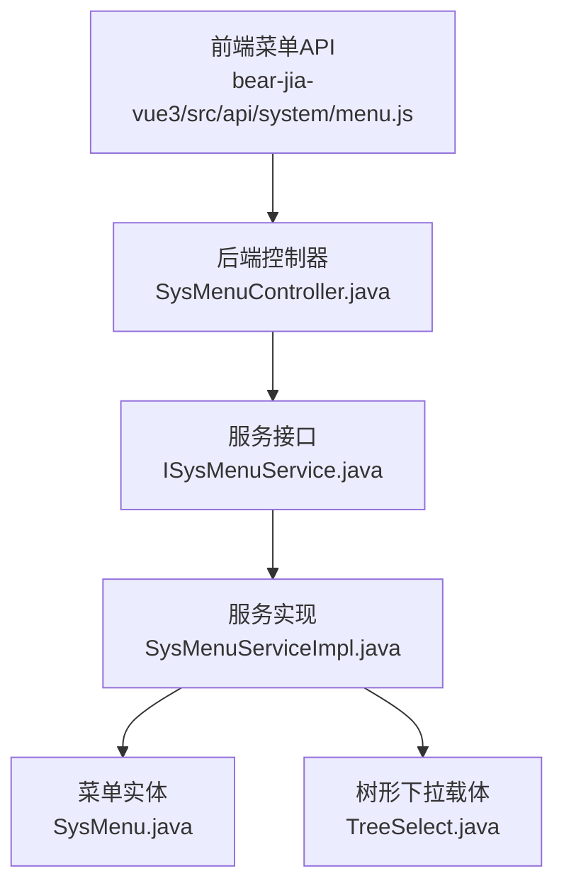
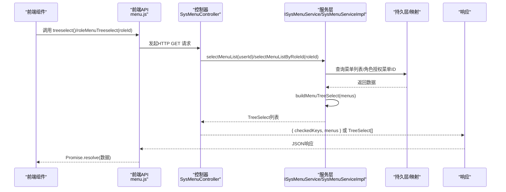
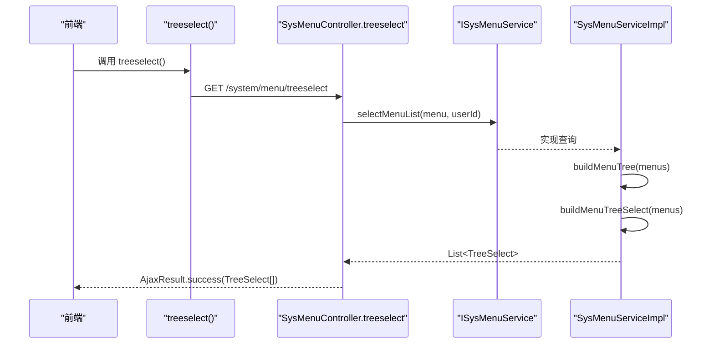
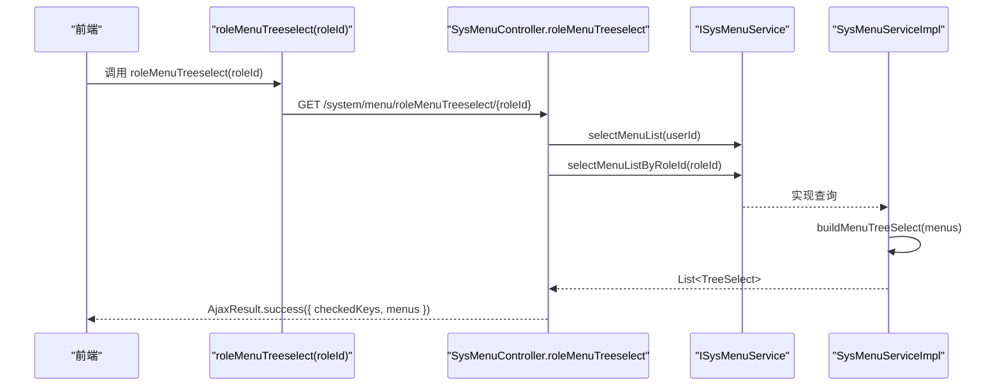
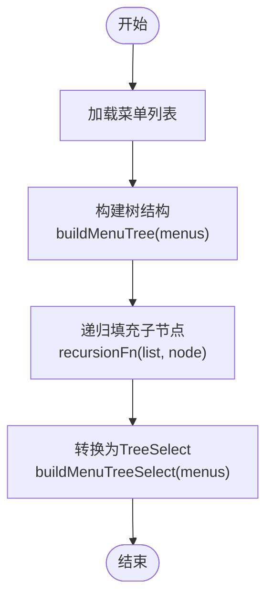
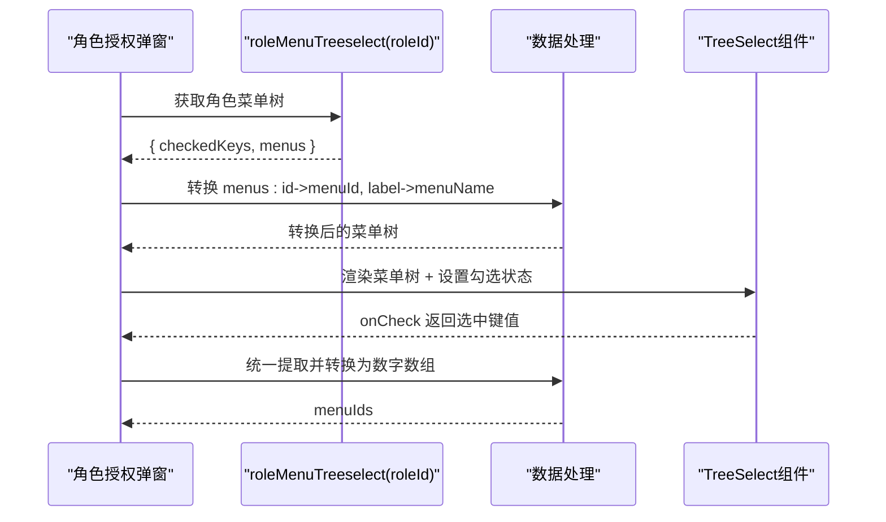
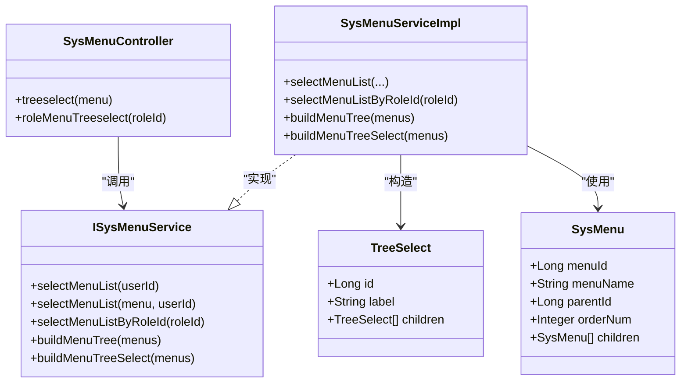

# 菜单树形结构API

<cite>
**本文引用的文件**
- [menu.js](file://bear-jia-vue3/src/api/system/menu.js)
- [SysMenuController.java](file://bearjia-admin-backend/src/main/java/com/javaxiaobear/module/system/controller/SysMenuController.java)
- [ISysMenuService.java](file://bearjia-admin-backend/src/main/java/com/javaxiaobear/module/system/service/ISysMenuService.java)
- [SysMenuServiceImpl.java](file://bearjia-admin-backend/src/main/java/com/javaxiaobear/module/system/service/impl/SysMenuServiceImpl.java)
- [TreeSelect.java](file://bearjia-admin-backend/src/main/java/com/javaxiaobear/base/framework/web/domain/TreeSelect.java)
- [SysMenu.java](file://bearjia-admin-backend/src/main/java/com/javaxiaobear/module/system/domain/SysMenu.java)
- [TreeEntity.java](file://bearjia-admin-backend/src/main/java/com/javaxiaobear/base/framework/web/domain/TreeEntity.java)
- [addUpdateModal.vue](file://bear-jia-vue3/src/views/system/role/addUpdateModal.vue)
- [index.vue](file://bear-jia-vue3/src/views/system/menu/index.vue)
</cite>

## 目录
1. [简介](#简介)
2. [项目结构](#项目结构)
3. [核心组件](#核心组件)
4. [架构总览](#架构总览)
5. [详细组件分析](#详细组件分析)
6. [依赖关系分析](#依赖关系分析)
7. [性能考量](#性能考量)
8. [故障排查指南](#故障排查指南)
9. [结论](#结论)
10. [附录](#附录)

## 简介
本文件聚焦于菜单树形结构相关API，重点覆盖以下两个端点：
- GET /system/menu/treeselect：根据当前登录用户的权限过滤，返回可用于“父级选择器”的菜单树（下拉树）。
- GET /system/menu/roleMenuTreeselect/{roleId}：返回角色授权页面所需的菜单树与已授权菜单ID集合，便于勾选/反显。

同时，文档深入解析后端服务层如何通过递归算法构建树形结构，并说明前端在角色授权弹窗中对返回数据的处理流程与集成方式。

## 项目结构
- 前端位于 bear-jia-vue3/src/api/system/menu.js，封装了菜单模块的HTTP请求。
- 后端位于 bearjia-admin-backend，控制器 SysMenuController 提供上述两个端点；服务层 ISysMenuService 与实现类 SysMenuServiceImpl 负责业务逻辑；TreeSelect 作为树形下拉的通用数据载体；SysMenu 为菜单实体。

图表来源
- [menu.js](file://bear-jia-vue3/src/api/system/menu.js#L28-L42)
- [SysMenuController.java](file://bearjia-admin-backend/src/main/java/com/javaxiaobear/module/system/controller/SysMenuController.java#L57-L78)
- [ISysMenuService.java](file://bearjia-admin-backend/src/main/java/com/javaxiaobear/module/system/service/ISysMenuService.java#L1-L145)
- [SysMenuServiceImpl.java](file://bearjia-admin-backend/src/main/java/com/javaxiaobear/module/system/service/impl/SysMenuServiceImpl.java#L1-L532)
- [TreeSelect.java](file://bearjia-admin-backend/src/main/java/com/javaxiaobear/base/framework/web/domain/TreeSelect.java#L1-L77)
- [SysMenu.java](file://bearjia-admin-backend/src/main/java/com/javaxiaobear/module/system/domain/SysMenu.java#L1-L120)

章节来源
- [menu.js](file://bear-jia-vue3/src/api/system/menu.js#L28-L42)
- [SysMenuController.java](file://bearjia-admin-backend/src/main/java/com/javaxiaobear/module/system/controller/SysMenuController.java#L57-L78)

## 核心组件
- 前端API封装：提供 treeselect 与 roleMenuTreeselect 方法，分别对应两个后端端点。
- 控制器端点：
  - GET /system/menu/treeselect：返回当前用户可访问的菜单树（TreeSelect列表）。
  - GET /system/menu/roleMenuTreeselect/{roleId}：返回 { checkedKeys, menus }，其中 checkedKeys 为角色已授权菜单ID列表，menus 为完整的菜单树。
- 服务层：
  - selectMenuList(userId)：按用户权限过滤菜单列表。
  - buildMenuTreeSelect(menus)：基于菜单列表构建树形下拉结构。
  - selectMenuListByRoleId(roleId)：查询角色已授权的菜单ID集合。
- 数据模型：
  - TreeSelect：树形下拉节点，包含 id、label、children 字段。
  - SysMenu：菜单实体，包含父子关系、排序等字段。

章节来源
- [menu.js](file://bear-jia-vue3/src/api/system/menu.js#L28-L42)
- [SysMenuController.java](file://bearjia-admin-backend/src/main/java/com/javaxiaobear/module/system/controller/SysMenuController.java#L57-L78)
- [ISysMenuService.java](file://bearjia-admin-backend/src/main/java/com/javaxiaobear/module/system/service/ISysMenuService.java#L1-L145)
- [SysMenuServiceImpl.java](file://bearjia-admin-backend/src/main/java/com/javaxiaobear/module/system/service/impl/SysMenuServiceImpl.java#L48-L120)
- [TreeSelect.java](file://bearjia-admin-backend/src/main/java/com/javaxiaobear/base/framework/web/domain/TreeSelect.java#L1-L77)
- [SysMenu.java](file://bearjia-admin-backend/src/main/java/com/javaxiaobear/module/system/domain/SysMenu.java#L1-L120)

## 架构总览
从请求到响应的关键调用链如下：

图表来源
- [menu.js](file://bear-jia-vue3/src/api/system/menu.js#L28-L42)
- [SysMenuController.java](file://bearjia-admin-backend/src/main/java/com/javaxiaobear/module/system/controller/SysMenuController.java#L57-L78)
- [ISysMenuService.java](file://bearjia-admin-backend/src/main/java/com/javaxiaobear/module/system/service/ISysMenuService.java#L1-L145)
- [SysMenuServiceImpl.java](file://bearjia-admin-backend/src/main/java/com/javaxiaobear/module/system/service/impl/SysMenuServiceImpl.java#L48-L120)

## 详细组件分析

### 接口一：GET /system/menu/treeselect
- 功能：返回当前登录用户可访问的菜单树，用于“父级选择器”或下拉树。
- 认证与权限：控制器方法标注访问权限注解，确保调用者具备相应菜单权限。
- 流程要点：
  - 通过 selectMenuList(menu, userId) 按用户权限过滤菜单。
  - 调用 buildMenuTreeSelect(menus) 构建树形下拉结构。
  - 返回 TreeSelect 列表（每个节点包含 id、label、children）。

图表来源
- [SysMenuController.java](file://bearjia-admin-backend/src/main/java/com/javaxiaobear/module/system/controller/SysMenuController.java#L57-L65)
- [ISysMenuService.java](file://bearjia-admin-backend/src/main/java/com/javaxiaobear/module/system/service/ISysMenuService.java#L73-L87)
- [SysMenuServiceImpl.java](file://bearjia-admin-backend/src/main/java/com/javaxiaobear/module/system/service/impl/SysMenuServiceImpl.java#L216-L255)

章节来源
- [SysMenuController.java](file://bearjia-admin-backend/src/main/java/com/javaxiaobear/module/system/controller/SysMenuController.java#L57-L65)
- [ISysMenuService.java](file://bearjia-admin-backend/src/main/java/com/javaxiaobear/module/system/service/ISysMenuService.java#L73-L87)
- [SysMenuServiceImpl.java](file://bearjia-admin-backend/src/main/java/com/javaxiaobear/module/system/service/impl/SysMenuServiceImpl.java#L216-L255)

### 接口二：GET /system/menu/roleMenuTreeselect/{roleId}
- 功能：返回角色授权页面所需的菜单树与已授权菜单ID集合。
- 响应结构：
  - checkedKeys：角色已授权的菜单ID数组（用于勾选/反显）。
  - menus：完整的菜单树（TreeSelect结构），用于授权树展示。
- 流程要点：
  - 通过 selectMenuList(userId) 获取当前用户可访问的菜单集合（用于限制可授权范围）。
  - 通过 selectMenuListByRoleId(roleId) 获取角色已授权的菜单ID集合。
  - 通过 buildMenuTreeSelect(menus) 构建树形下拉结构。
  - 返回 AjaxResult，包含 checkedKeys 与 menus。

图表来源
- [SysMenuController.java](file://bearjia-admin-backend/src/main/java/com/javaxiaobear/module/system/controller/SysMenuController.java#L67-L78)
- [ISysMenuService.java](file://bearjia-admin-backend/src/main/java/com/javaxiaobear/module/system/service/ISysMenuService.java#L63-L63)
- [SysMenuServiceImpl.java](file://bearjia-admin-backend/src/main/java/com/javaxiaobear/module/system/service/impl/SysMenuServiceImpl.java#L145-L156)
- [SysMenuServiceImpl.java](file://bearjia-admin-backend/src/main/java/com/javaxiaobear/module/system/service/impl/SysMenuServiceImpl.java#L244-L255)

章节来源
- [SysMenuController.java](file://bearjia-admin-backend/src/main/java/com/javaxiaobear/module/system/controller/SysMenuController.java#L67-L78)
- [ISysMenuService.java](file://bearjia-admin-backend/src/main/java/com/javaxiaobear/module/system/service/ISysMenuService.java#L63-L63)
- [SysMenuServiceImpl.java](file://bearjia-admin-backend/src/main/java/com/javaxiaobear/module/system/service/impl/SysMenuServiceImpl.java#L145-L156)
- [SysMenuServiceImpl.java](file://bearjia-admin-backend/src/main/java/com/javaxiaobear/module/system/service/impl/SysMenuServiceImpl.java#L244-L255)

### 后端服务层：递归构建菜单树与下拉树
- 构建树结构（buildMenuTree）：
  - 输入：扁平的 SysMenu 列表。
  - 算法：先收集所有节点ID，再遍历列表，对不在“父节点集合”中的节点作为根节点，递归填充其子节点。
  - 递归函数（recursionFn）：为每个节点设置 children，并继续向下递归。
- 构建下拉树（buildMenuTreeSelect）：
  - 在 buildMenuTree 的基础上，将每个 SysMenu 转换为 TreeSelect（id=label=children），形成前端 TreeSelect 结构。
- 查询角色已授权菜单（selectMenuListByRoleId）：
  - 依据角色配置的严格模式（menuCheckStrictly）决定授权策略，返回角色已授权的菜单ID集合。

图表来源
- [SysMenuServiceImpl.java](file://bearjia-admin-backend/src/main/java/com/javaxiaobear/module/system/service/impl/SysMenuServiceImpl.java#L216-L255)
- [SysMenuServiceImpl.java](file://bearjia-admin-backend/src/main/java/com/javaxiaobear/module/system/service/impl/SysMenuServiceImpl.java#L475-L520)

章节来源
- [SysMenuServiceImpl.java](file://bearjia-admin-backend/src/main/java/com/javaxiaobear/module/system/service/impl/SysMenuServiceImpl.java#L216-L255)
- [SysMenuServiceImpl.java](file://bearjia-admin-backend/src/main/java/com/javaxiaobear/module/system/service/impl/SysMenuServiceImpl.java#L475-L520)

### 前端集成与数据处理
- treeselect：用于“父级选择器”，返回 TreeSelect 列表，前端可直接绑定到 TreeSelect/Tree 组件。
- roleMenuTreeselect：
  - 前端接收 { checkedKeys, menus }。
  - checkedKeys 用于初始化勾选状态。
  - menus 用于渲染授权树。
  - 在角色授权弹窗中，前端会将 TreeSelect 的 id/label 转换为 menuId/menuName，以便与表单字段保持一致。
  - 支持多种 onCheck 形态（数组/对象），统一提取选中键值并转换为数字数组。

图表来源
- [addUpdateModal.vue](file://bear-jia-vue3/src/views/system/role/addUpdateModal.vue#L229-L250)
- [addUpdateModal.vue](file://bear-jia-vue3/src/views/system/role/addUpdateModal.vue#L376-L404)

章节来源
- [addUpdateModal.vue](file://bear-jia-vue3/src/views/system/role/addUpdateModal.vue#L229-L250)
- [addUpdateModal.vue](file://bear-jia-vue3/src/views/system/role/addUpdateModal.vue#L376-L404)

## 依赖关系分析
- 控制器依赖服务接口，服务实现依赖持久层映射。
- TreeSelect 与 SysMenu 之间存在映射关系，TreeSelect 由 SysMenu 构造而来。
- 前端 API 仅依赖控制器提供的端点，不直接依赖服务层。

图表来源
- [SysMenuController.java](file://bearjia-admin-backend/src/main/java/com/javaxiaobear/module/system/controller/SysMenuController.java#L57-L78)
- [ISysMenuService.java](file://bearjia-admin-backend/src/main/java/com/javaxiaobear/module/system/service/ISysMenuService.java#L1-L145)
- [SysMenuServiceImpl.java](file://bearjia-admin-backend/src/main/java/com/javaxiaobear/module/system/service/impl/SysMenuServiceImpl.java#L1-L532)
- [TreeSelect.java](file://bearjia-admin-backend/src/main/java/com/javaxiaobear/base/framework/web/domain/TreeSelect.java#L1-L77)
- [SysMenu.java](file://bearjia-admin-backend/src/main/java/com/javaxiaobear/module/system/domain/SysMenu.java#L1-L120)

章节来源
- [SysMenuController.java](file://bearjia-admin-backend/src/main/java/com/javaxiaobear/module/system/controller/SysMenuController.java#L57-L78)
- [ISysMenuService.java](file://bearjia-admin-backend/src/main/java/com/javaxiaobear/module/system/service/ISysMenuService.java#L1-L145)
- [SysMenuServiceImpl.java](file://bearjia-admin-backend/src/main/java/com/javaxiaobear/module/system/service/impl/SysMenuServiceImpl.java#L1-L532)
- [TreeSelect.java](file://bearjia-admin-backend/src/main/java/com/javaxiaobear/base/framework/web/domain/TreeSelect.java#L1-L77)
- [SysMenu.java](file://bearjia-admin-backend/src/main/java/com/javaxiaobear/module/system/domain/SysMenu.java#L1-L120)

## 性能考量
- 树构建复杂度：buildMenuTree 对扁平列表进行一次遍历并递归填充子节点，时间复杂度近似 O(n)，空间复杂度 O(n)。
- 权限过滤：selectMenuList(userId) 在管理员与普通用户场景下分别走不同SQL路径，避免不必要的全量扫描。
- 前端渲染：TreeSelect 仅包含 id/label/children，数据体量较小，适合在前端直接渲染树组件。
- 缓存建议：若菜单树稳定且访问频繁，可在前端对 treeselect 结果进行缓存；角色授权树可按 roleId 缓存。

## 故障排查指南
- treeselect 返回为空：
  - 检查当前用户是否具备菜单权限。
  - 确认数据库中是否存在有效菜单记录。
- roleMenuTreeselect 返回异常：
  - 检查 roleId 是否有效。
  - 确认 selectMenuListByRoleId(roleId) 是否返回预期的菜单ID集合。
- 勾选状态异常：
  - 确认 checkedKeys 与 menus 的 id/label 字段映射正确。
  - 检查前端 onCheck 的返回形态（数组/对象），确保统一提取逻辑生效。
- 树渲染错乱：
  - 确认菜单父子关系字段（parentId/orderNum）正确无误。
  - 检查 TreeSelect 的 children 是否按层级正确填充。

章节来源
- [SysMenuController.java](file://bearjia-admin-backend/src/main/java/com/javaxiaobear/module/system/controller/SysMenuController.java#L57-L78)
- [ISysMenuService.java](file://bearjia-admin-backend/src/main/java/com/javaxiaobear/module/system/service/ISysMenuService.java#L63-L63)
- [SysMenuServiceImpl.java](file://bearjia-admin-backend/src/main/java/com/javaxiaobear/module/system/service/impl/SysMenuServiceImpl.java#L216-L255)
- [addUpdateModal.vue](file://bear-jia-vue3/src/views/system/role/addUpdateModal.vue#L376-L404)

## 结论
- /system/menu/treeselect 与 /system/menu/roleMenuTreeselect/{roleId} 两个端点分别服务于“父级选择器”与“角色授权页面”的菜单树需求。
- 后端通过 selectMenuList(userId) 过滤权限，再以 buildMenuTree/buildMenuTreeSelect 构建树形结构，最终以 TreeSelect 形式返回，满足前端 TreeSelect/Tree 组件的字段约定。
- 前端在角色授权弹窗中对返回数据进行字段转换与勾选状态初始化，确保用户体验与数据一致性。

## 附录

### 接口定义与调用示例
- GET /system/menu/treeselect
  - 描述：返回当前用户可访问的菜单树，用于父级选择器。
  - 响应：TreeSelect 列表（包含 id、label、children）。
  - 前端调用：treeselect()。
  - 参考路径：[menu.js](file://bear-jia-vue3/src/api/system/menu.js#L28-L34)

- GET /system/menu/roleMenuTreeselect/{roleId}
  - 描述：返回角色授权页面所需数据 { checkedKeys, menus }。
  - 响应：AjaxResult，包含 checkedKeys（数组）与 menus（TreeSelect树）。
  - 前端调用：roleMenuTreeselect(roleId)。
  - 参考路径：[menu.js](file://bear-jia-vue3/src/api/system/menu.js#L36-L42)

### 前端典型集成步骤
- 获取全量菜单树（父级选择器）：
  - 调用 treeselect()，将返回的 TreeSelect 列表直接绑定到 TreeSelect/Tree 组件。
  - 参考路径：[index.vue](file://bear-jia-vue3/src/views/system/menu/index.vue#L1-L35)

- 获取角色授权树并初始化勾选：
  - 调用 roleMenuTreeselect(roleId)，得到 { checkedKeys, menus }。
  - 将 menus 中的 id/label 转换为 menuId/menuName，赋给树组件。
  - 将 checkedKeys 赋予勾选状态。
  - 参考路径：[addUpdateModal.vue](file://bear-jia-vue3/src/views/system/role/addUpdateModal.vue#L229-L250)