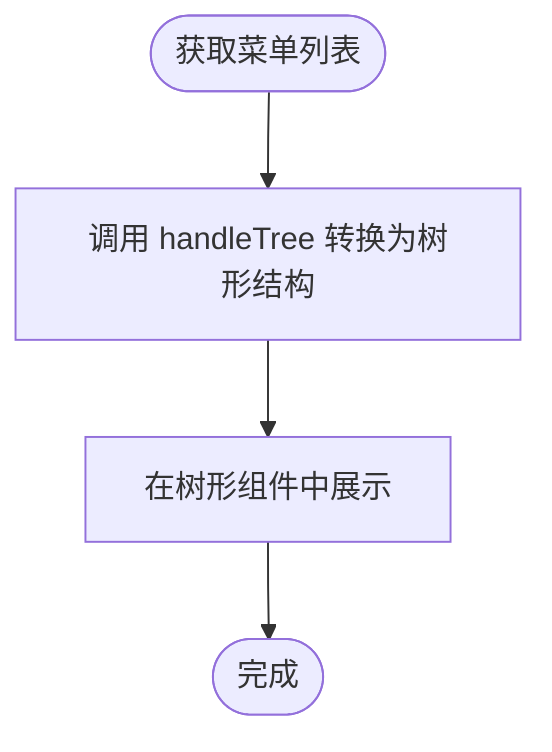
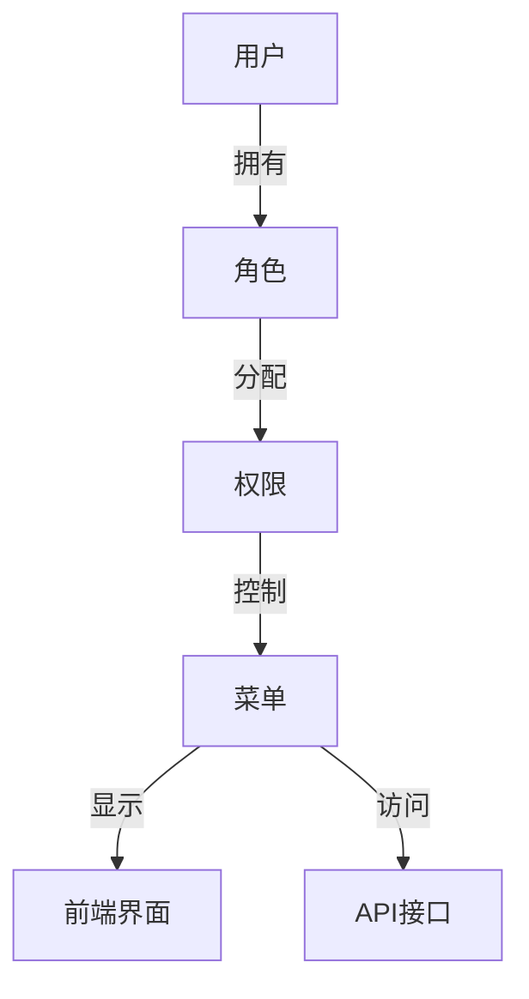

# 菜单管理API

<cite>
**本文档引用的文件**
- [menu.js](file://bear-jia-vue3\src\api\system\menu.js)
- [SysMenuController.java](file://bearjia-admin-backend\src\main\java\com\javaxiaobear\module\system\controller\SysMenuController.java)
- [ISysMenuService.java](file://bearjia-admin-backend\src\main\java\com\javaxiaobear\module\system\service\ISysMenuService.java)
- [bear_jia.sql](file://bearjia-admin-backend\src\main\resources\sql\bear_jia.sql)
- [index.vue](file://bear-jia-vue3\src\views\system\menu\index.vue)
- [addUpdateModal.vue](file://bear-jia-vue3\src\views\system\menu\addUpdateModal.vue)
- [bearjia.js](file://bear-jia-vue3\src\utils\bearjia.js)
- [errorCode.js](file://bear-jia-vue3\src\utils\errorCode.js)
</cite>

## 目录
1. [简介](#简介)
2. [API端点](#api端点)
   1. [获取菜单列表](#获取菜单列表)
   2. [查询菜单详细信息](#查询菜单详细信息)
   3. [查询菜单下拉树结构](#查询菜单下拉树结构)
   4. [根据角色ID查询菜单下拉树结构](#根据角色id查询菜单下拉树结构)
   5. [新增菜单](#新增菜单)
   6. [修改菜单](#修改菜单)
   7. [删除菜单](#删除菜单)
3. [菜单树形结构构建](#菜单树形结构构建)
4. [权限控制逻辑](#权限控制逻辑)
5. [通用错误码](#通用错误码)
6. [API调用最佳实践](#api调用最佳实践)
7. [请求与响应示例](#请求与响应示例)

## 简介
菜单管理API提供了对系统菜单的完整管理功能，包括菜单的查询、新增、修改、删除以及菜单树的构建。该API支持基于角色的菜单权限控制，确保用户只能访问其权限范围内的菜单项。所有API端点都需要JWT Token进行认证，确保系统的安全性。

## API端点

### 获取菜单列表
获取菜单列表，支持按菜单名称、显示状态和菜单状态进行过滤。

**HTTP方法**: `GET`  
**URL路径**: `/system/menu/list`  
**认证要求**: JWT Token  
**请求参数**:
- **查询参数**:
  - `menuName` (string, 可选): 菜单名称，支持模糊查询
  - `visible` (string, 可选): 是否显示，`0`表示显示，`1`表示隐藏
  - `status` (string, 可选): 菜单状态，`0`表示正常，`1`表示停用

**响应数据结构**:
```json
{
  "code": 200,
  "msg": "操作成功",
  "data": [
    {
      "menuId": 1,
      "menuName": "系统管理",
      "parentId": 0,
      "orderNum": 1,
      "path": "system",
      "component": null,
      "query": "",
      "isFrame": 1,
      "isCache": 0,
      "menuType": "M",
      "visible": "0",
      "status": "0",
      "perms": "",
      "icon": "system",
      "createBy": "admin",
      "createTime": "2025-08-17 19:48:21",
      "updateBy": "",
      "updateTime": null,
      "remark": "系统管理目录"
    }
  ]
}
```

**错误响应**:
- `401`: 认证失败，无法访问系统资源
- `403`: 当前操作没有权限

**Section sources**
- [SysMenuController.java](file://bearjia-admin-backend\src\main\java\com\javaxiaobear\module\system\controller\SysMenuController.java#L36-L45)
- [menu.js](file://bear-jia-vue3\src\api\system\menu.js#L11-L18)

### 查询菜单详细信息
根据菜单ID查询菜单的详细信息。

**HTTP方法**: `GET`  
**URL路径**: `/system/menu/{menuId}`  
**认证要求**: JWT Token  
**路径参数**:
- `menuId` (long): 菜单ID

**响应数据结构**:
```json
{
  "code": 200,
  "msg": "操作成功",
  "data": {
    "menuId": 1,
    "menuName": "系统管理",
    "parentId": 0,
    "orderNum": 1,
    "path": "system",
    "component": null,
    "query": "",
    "isFrame": 1,
    "isCache": 0,
    "menuType": "M",
    "visible": "0",
    "status": "0",
    "perms": "",
    "icon": "system",
    "createBy": "admin",
    "createTime": "2025-08-17 19:48:21",
    "updateBy": "",
    "updateTime": null,
    "remark": "系统管理目录"
  }
}
```

**错误响应**:
- `401`: 认证失败，无法访问系统资源
- `403`: 当前操作没有权限
- `404`: 访问资源不存在

**Section sources**
- [SysMenuController.java](file://bearjia-admin-backend\src\main\java\com\javaxiaobear\module\system\controller\SysMenuController.java#L47-L55)
- [menu.js](file://bear-jia-vue3\src\api\system\menu.js#L20-L26)

### 查询菜单下拉树结构
获取菜单的下拉树结构，用于在表单中选择上级菜单。

**HTTP方法**: `GET`  
**URL路径**: `/system/menu/treeselect`  
**认证要求**: JWT Token  
**请求参数**: 无

**响应数据结构**:
```json
{
  "code": 200,
  "msg": "操作成功",
  "data": [
    {
      "id": 1,
      "label": "系统管理",
      "children": [
        {
          "id": 100,
          "label": "用户管理",
          "children": []
        }
      ]
    }
  ]
}
```

**错误响应**:
- `401`: 认证失败，无法访问系统资源
- `403`: 当前操作没有权限

**Section sources**
- [SysMenuController.java](file://bearjia-admin-backend\src\main\java\com\javaxiaobear\module\system\controller\SysMenuController.java#L57-L65)
- [menu.js](file://bear-jia-vue3\src\api\system\menu.js#L28-L34)

### 根据角色ID查询菜单下拉树结构
根据角色ID获取菜单的下拉树结构，同时返回该角色已分配的菜单ID。

**HTTP方法**: `GET`  
**URL路径**: `/system/menu/roleMenuTreeselect/{roleId}`  
**认证要求**: JWT Token  
**路径参数**:
- `roleId` (long): 角色ID

**响应数据结构**:
```json
{
  "code": 200,
  "msg": "操作成功",
  "checkedKeys": [1, 100, 101],
  "menus": [
    {
      "id": 1,
      "label": "系统管理",
      "children": [
        {
          "id": 100,
          "label": "用户管理",
          "children": []
        }
      ]
    }
  ]
}
```

**错误响应**:
- `401`: 认证失败，无法访问系统资源
- `403`: 当前操作没有权限

**Section sources**
- [SysMenuController.java](file://bearjia-admin-backend\src\main\java\com\javaxiaobear\module\system\controller\SysMenuController.java#L67-L78)
- [menu.js](file://bear-jia-vue3\src\api\system\menu.js#L36-L42)

### 新增菜单
新增一个菜单项。

**HTTP方法**: `POST`  
**URL路径**: `/system/menu`  
**认证要求**: JWT Token  
**请求体**:
```json
{
  "menuName": "菜单名称",
  "parentId": 0,
  "orderNum": 1,
  "path": "menu-path",
  "component": "views/system/menu/index",
  "query": "",
  "isFrame": "1",
  "isCache": 0,
  "menuType": "C",
  "visible": "0",
  "status": "0",
  "perms": "system:menu:list",
  "icon": "menu-icon",
  "remark": "备注信息"
}
```

**响应数据结构**:
```json
{
  "code": 200,
  "msg": "操作成功"
}
```

**错误响应**:
- `400`: 新增菜单失败，菜单名称已存在
- `400`: 新增菜单失败，地址必须以http(s)://开头
- `401`: 认证失败，无法访问系统资源
- `403`: 当前操作没有权限

**Section sources**
- [SysMenuController.java](file://bearjia-admin-backend\src\main\java\com\javaxiaobear\module\system\controller\SysMenuController.java#L80-L98)
- [menu.js](file://bear-jia-vue3\src\api\system\menu.js#L44-L51)

### 修改菜单
修改一个菜单项。

**HTTP方法**: `PUT`  
**URL路径**: `/system/menu`  
**认证要求**: JWT Token  
**请求体**:
```json
{
  "menuId": 1,
  "menuName": "修改后的菜单名称",
  "parentId": 0,
  "orderNum": 1,
  "path": "menu-path",
  "component": "views/system/menu/index",
  "query": "",
  "isFrame": "1",
  "isCache": 0,
  "menuType": "C",
  "visible": "0",
  "status": "0",
  "perms": "system:menu:list",
  "icon": "menu-icon",
  "remark": "修改后的备注信息"
}
```

**响应数据结构**:
```json
{
  "code": 200,
  "msg": "操作成功"
}
```

**错误响应**:
- `400`: 修改菜单失败，菜单名称已存在
- `400`: 修改菜单失败，地址必须以http(s)://开头
- `400`: 修改菜单失败，上级菜单不能选择自己
- `401`: 认证失败，无法访问系统资源
- `403`: 当前操作没有权限

**Section sources**
- [SysMenuController.java](file://bearjia-admin-backend\src\main\java\com\javaxiaobear\module\system\controller\SysMenuController.java#L100-L122)
- [menu.js](file://bear-jia-vue3\src\api\system\menu.js#L53-L60)

### 删除菜单
删除一个菜单项。

**HTTP方法**: `DELETE`  
**URL路径**: `/system/menu/{menuId}`  
**认证要求**: JWT Token  
**路径参数**:
- `menuId` (long): 菜单ID

**响应数据结构**:
```json
{
  "code": 200,
  "msg": "操作成功"
}
```

**错误响应**:
- `400`: 存在子菜单，不允许删除
- `400`: 菜单已分配，不允许删除
- `401`: 认证失败，无法访问系统资源
- `403`: 当前操作没有权限

**Section sources**
- [SysMenuController.java](file://bearjia-admin-backend\src\main\java\com\javaxiaobear\module\system\controller\SysMenuController.java#L124-L141)
- [menu.js](file://bear-jia-vue3\src\api\system\menu.js#L62-L68)

## 菜单树形结构构建
菜单树形结构的构建是通过后端服务将扁平的菜单数据转换为树形结构。前端在获取菜单列表后，使用`handleTree`工具函数将数据转换为树形结构，以便在树形组件中展示。

**构建逻辑**:
1. 后端返回的菜单数据是扁平的，包含`menuId`和`parentId`字段。
2. 前端使用`handleTree`函数，根据`parentId`字段将数据组织成树形结构。
3. `handleTree`函数通过递归遍历数据，将每个菜单项的子菜单添加到`children`数组中。

**父子节点校验规则**:
- 上级菜单不能选择自己作为父节点。
- 删除菜单时，如果存在子菜单，则不允许删除。
- 菜单名称在同一层级下必须唯一。



**Diagram sources**
- [bearjia.js](file://bear-jia-vue3\src\utils\bearjia.js#L156-L199)
- [index.vue](file://bear-jia-vue3\src\views\system\menu\index.vue#L108-L112)

## 权限控制逻辑
权限控制通过菜单的`perms`字段和用户的权限进行匹配。每个菜单项可以配置一个权限标识，用户在访问菜单时，系统会检查用户是否拥有该权限。

**实现方式**:
1. 用户登录后，系统根据用户的角色获取其拥有的权限列表。
2. 前端在渲染菜单时，过滤掉用户没有权限的菜单项。
3. 后端在处理API请求时，通过`@PreAuthorize`注解检查用户权限。

**权限过滤**:
- 前端通过`v-hasPermi`指令控制按钮的显示。
- 后端通过`@PreAuthorize("@ss.hasPermi('system:menu:list')")`注解控制API访问。



**Diagram sources**
- [SysMenuController.java](file://bearjia-admin-backend\src\main\java\com\javaxiaobear\module\system\controller\SysMenuController.java#L39-L40)
- [addUpdateModal.vue](file://bear-jia-vue3\src\views\system\menu\addUpdateModal.vue#L15-L21)

## 通用错误码
通用错误码用于标准化API的错误响应，便于前端统一处理。

| 错误码 | 含义 | 菜单管理场景下的具体含义 |
|------|------|----------------------|
| 401 | 认证失败，无法访问系统资源 | JWT Token无效或过期，用户未登录 |
| 403 | 当前操作没有权限 | 用户没有操作菜单的权限，如新增、修改、删除 |
| 404 | 访问资源不存在 | 请求的菜单ID不存在 |
| 500 | 系统未知错误，请反馈给管理员 | 后端处理异常，如数据库连接失败 |

**Section sources**
- [errorCode.js](file://bear-jia-vue3\src\utils\errorCode.js#L1-L6)

## API调用最佳实践
为了确保菜单管理API的高效和稳定使用，建议遵循以下最佳实践：

1. **菜单排序**: 使用`orderNum`字段控制菜单的显示顺序，数值越小越靠前。
2. **层级管理**: 菜单层级不宜过深，建议不超过3层，以保证用户体验。
3. **权限标识**: 权限标识应遵循`模块:操作`的命名规范，如`system:menu:add`。
4. **图标选择**: 使用系统提供的图标库，避免自定义图标导致样式不一致。
5. **缓存策略**: 对于频繁访问的菜单数据，建议在前端进行缓存，减少API调用次数。

## 请求与响应示例

### 获取菜单列表
**请求**:
```http
GET /system/menu/list?menuName=系统 HTTP/1.1
Authorization: Bearer <JWT Token>
```

**响应**:
```json
{
  "code": 200,
  "msg": "操作成功",
  "data": [
    {
      "menuId": 1,
      "menuName": "系统管理",
      "parentId": 0,
      "orderNum": 1,
      "path": "system",
      "component": null,
      "query": "",
      "isFrame": 1,
      "isCache": 0,
      "menuType": "M",
      "visible": "0",
      "status": "0",
      "perms": "",
      "icon": "system",
      "createBy": "admin",
      "createTime": "2025-08-17 19:48:21",
      "updateBy": "",
      "updateTime": null,
      "remark": "系统管理目录"
    }
  ]
}
```

### 新增菜单
**请求**:
```http
POST /system/menu HTTP/1.1
Authorization: Bearer <JWT Token>
Content-Type: application/json

{
  "menuName": "新菜单",
  "parentId": 1,
  "orderNum": 1,
  "path": "new-menu",
  "component": "views/system/new-menu",
  "menuType": "C",
  "visible": "0",
  "status": "0",
  "perms": "system:menu:new",
  "icon": "plus"
}
```

**响应**:
```json
{
  "code": 200,
  "msg": "操作成功"
}
```

### 构建角色菜单树
**请求**:
```http
GET /system/menu/roleMenuTreeselect/1 HTTP/1.1
Authorization: Bearer <JWT Token>
```

**响应**:
```json
{
  "code": 200,
  "msg": "操作成功",
  "checkedKeys": [1, 100],
  "menus": [
    {
      "id": 1,
      "label": "系统管理",
      "children": [
        {
          "id": 100,
          "label": "用户管理",
          "children": []
        }
      ]
    }
  ]
}
```