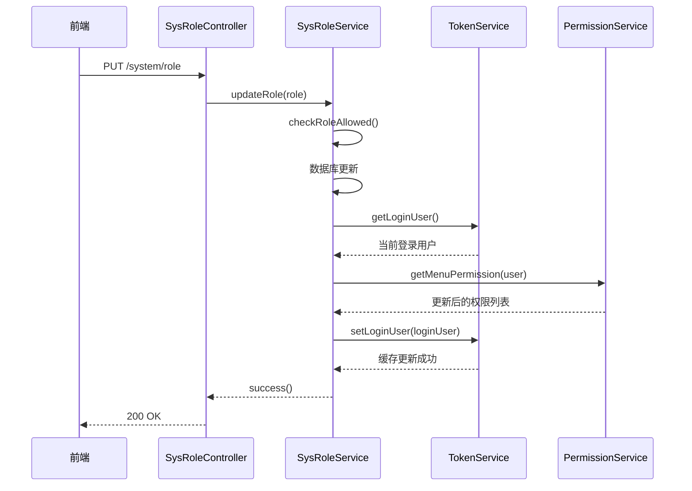

# 角色CRUD操作API

<cite>
**本文档引用的文件**  
- [role.js](file://bear-jia-vue3/src/api/system/role.js)
- [SysRoleController.java](file://bearjia-admin-backend/src/main/java/com/javaxiaobear/module/system/controller/SysRoleController.java)
- [SysRoleServiceImpl.java](file://bearjia-admin-backend/src/main/java/com/javaxiaobear/module/system/service/impl/SysRoleServiceImpl.java)
- [SysRole.java](file://bearjia-admin-backend/src/main/java/com/javaxiaobear/module/system/domain/SysRole.java)
- [bear_jia.sql](file://bearjia-admin-backend/src/main/resources/sql/bear_jia.sql)
</cite>

## 目录
1. [简介](#简介)
2. [角色查询](#角色查询)
3. [新增角色](#新增角色)
4. [修改角色](#修改角色)
5. [删除角色](#删除角色)
6. [状态变更](#状态变更)
7. [权限校验](#权限校验)
8. [请求示例](#请求示例)
9. [唯一性校验](#唯一性校验)
10. [缓存更新机制](#缓存更新机制)
11. [最佳实践](#最佳实践)

## 简介
本API文档详细描述了系统中角色管理的CRUD（创建、读取、更新、删除）操作，涵盖角色的查询、新增、修改、删除和状态变更功能。所有操作均通过RESTful API实现，遵循统一的请求/响应格式，并集成权限控制机制。

**Section sources**
- [role.js](file://bear-jia-vue3/src/api/system/role.js#L1-L112)

## 角色查询
提供分页查询角色列表的功能，支持按角色名称、角色标识等条件过滤。

### 接口信息
- **HTTP方法**: `GET`
- **URL路径**: `/system/role/list`

### 请求参数
| 参数名 | 类型 | 必填 | 说明 |
|-------|------|------|------|
| pageNum | int | 是 | 当前页码 |
| pageSize | int | 是 | 每页条数 |
| roleName | string | 否 | 角色名称（模糊匹配） |
| roleKey | string | 否 | 角色权限标识（精确匹配） |
| status | string | 否 | 角色状态（0正常 1停用） |

### 响应结构
```json
{
  "code": 200,
  "msg": "查询成功",
  "data": {
    "rows": [
      {
        "roleId": 1,
        "roleName": "管理员",
        "roleKey": "admin",
        "roleSort": 1,
        "status": "0",
        "remark": "系统管理员"
      }
    ],
    "total": 1
  }
}
```

**Section sources**
- [role.js](file://bear-jia-vue3/src/api/system/role.js#L3-L10)
- [SysRoleController.java](file://bearjia-admin-backend/src/main/java/com/javaxiaobear/module/system/controller/SysRoleController.java#L59-L64)

## 新增角色
创建新的角色记录，系统会进行唯一性校验。

### 接口信息
- **HTTP方法**: `POST`
- **URL路径**: `/system/role`

### 请求体字段
| 字段名 | 类型 | 必填 | 说明 |
|-------|------|------|------|
| roleName | string | 是 | 角色名称（需唯一） |
| roleKey | string | 是 | 角色权限标识（需唯一） |
| roleSort | int | 是 | 显示顺序 |
| status | string | 是 | 角色状态（0正常 1停用） |
| remark | string | 否 | 备注 |

### 响应结构
成功时返回：
```json
{
  "code": 200,
  "msg": "新增角色成功"
}
```

**Section sources**
- [role.js](file://bear-jia-vue3/src/api/system/role.js#L20-L27)
- [SysRoleController.java](file://bearjia-admin-backend/src/main/java/com/javaxiaobear/module/system/controller/SysRoleController.java#L78-L87)

## 修改角色
更新现有角色的信息。

### 接口信息
- **HTTP方法**: `PUT`
- **URL路径**: `/system/role`

### 请求体字段
包含角色ID在内的所有可修改字段：
| 字段名 | 类型 | 必填 | 说明 |
|-------|------|------|------|
| roleId | long | 是 | 角色ID |
| roleName | string | 是 | 角色名称 |
| roleKey | string | 是 | 角色权限标识 |
| roleSort | int | 是 | 显示顺序 |
| status | string | 是 | 角色状态 |
| remark | string | 否 | 备注 |

### 响应结构
```json
{
  "code": 200,
  "msg": "修改角色成功"
}
```

**Section sources**
- [role.js](file://bear-jia-vue3/src/api/system/role.js#L29-L36)
- [SysRoleController.java](file://bearjia-admin-backend/src/main/java/com/javaxiaobear/module/system/controller/SysRoleController.java#L118-L143)

## 删除角色
从系统中删除指定的角色。

### 接口信息
- **HTTP方法**: `DELETE`
- **URL路径**: `/system/role/{roleId}`

### 路径参数
| 参数名 | 类型 | 必填 | 说明 |
|-------|------|------|------|
| roleId | long | 是 | 要删除的角色ID |

### 响应结构
```json
{
  "code": 200,
  "msg": "删除角色成功"
}
```

**Section sources**
- [role.js](file://bear-jia-vue3/src/api/system/role.js#L60-L66)
- [SysRoleController.java](file://bearjia-admin-backend/src/main/java/com/javaxiaobear/module/system/controller/SysRoleController.java#L168-L177)

## 状态变更
修改角色的启用/停用状态。

### 接口信息
- **HTTP方法**: `PUT`
- **URL路径**: `/system/role/changeStatus`

### 请求体
```json
{
  "roleId": 1,
  "status": "1"
}
```

### 响应结构
```json
{
  "code": 200,
  "msg": "修改状态成功"
}
```

**Section sources**
- [role.js](file://bear-jia-vue3/src/api/system/role.js#L47-L58)
- [SysRoleController.java](file://bearjia-admin-backend/src/main/java/com/javaxiaobear/module/system/controller/SysRoleController.java#L158-L167)

## 权限校验
所有角色管理操作均使用Spring Security的`@PreAuthorize`注解进行权限控制。

### 权限标识
| 操作 | 权限标识 |
|------|----------|
| 查询角色列表 | `system:role:list` |
| 新增角色 | `system:role:add` |
| 修改角色 | `system:role:edit` |
| 删除角色 | `system:role:remove` |

### 实现方式
```java
@PreAuthorize("@ss.hasPermi('system:role:list')")
@GetMapping("/list")
public TableDataInfo list(SysRole role)
```

**Section sources**
- [SysRoleController.java](file://bearjia-admin-backend/src/main/java/com/javaxiaobear/module/system/controller/SysRoleController.java#L59)

## 请求示例

### 获取角色列表
```http
GET /system/role/list?pageNum=1&pageSize=10&roleName=管理员 HTTP/1.1
Authorization: Bearer <token>
```

### 新增系统管理员角色
```http
POST /system/role HTTP/1.1
Authorization: Bearer <token>
Content-Type: application/json

{
  "roleName": "系统管理员",
  "roleKey": "sys_admin",
  "roleSort": 1,
  "status": "0",
  "remark": "拥有系统最高权限"
}
```

### 禁用某角色
```http
PUT /system/role/changeStatus HTTP/1.1
Authorization: Bearer <token>
Content-Type: application/json

{
  "roleId": 2,
  "status": "1"
}
```

**Section sources**
- [role.js](file://bear-jia-vue3/src/api/system/role.js#L3-L112)

## 唯一性校验
在新增和修改角色时，系统会对关键字段进行唯一性校验。

### 校验逻辑
- **角色名称**: 不允许重复
- **角色标识**: 不允许重复
- **保留关键字**: 避免使用`admin`、`system`等敏感词作为roleKey

### 错误响应
当出现重复时：
```json
{
  "code": 500,
  "msg": "角色名称已存在"
}
```

**Section sources**
- [SysRoleServiceImpl.java](file://bearjia-admin-backend/src/main/java/com/javaxiaobear/module/system/service/impl/SysRoleServiceImpl.java#L82-L100)

## 缓存更新机制
当角色信息被修改后，系统会自动更新相关用户的权限缓存。

### 实现流程


**Diagram sources**
- [SysRoleController.java](file://bearjia-admin-backend/src/main/java/com/javaxiaobear/module/system/controller/SysRoleController.java#L118-L143)
- [SysRoleServiceImpl.java](file://bearjia-admin-backend/src/main/java/com/javaxiaobear/module/system/service/impl/SysRoleServiceImpl.java)

**Section sources**
- [SysRoleController.java](file://bearjia-admin-backend/src/main/java/com/javaxiaobear/module/system/controller/SysRoleController.java#L118-L143)
- [SysRoleServiceImpl.java](file://bearjia-admin-backend/src/main/java/com/javaxiaobear/module/system/service/impl/SysRoleServiceImpl.java)

## 最佳实践

### 避免保留关键字
不要使用以下保留关键字作为`roleKey`：
- `admin`
- `system`
- `root`
- `super`

### 批量删除传参
批量删除时，ID数组应通过请求体传递：
```json
{
  "roleIds": [1, 2, 3]
}
```

### 错误处理
常见错误情况及响应：
| 错误类型 | HTTP状态码 | 响应消息 |
|---------|-----------|---------|
| 角色名称重复 | 500 | 角色名称已存在 |
| 权限标识冲突 | 500 | 角色权限标识已存在 |
| 无操作权限 | 403 | 您没有权限执行此操作 |

**Section sources**
- [SysRole.java](file://bearjia-admin-backend/src/main/java/com/javaxiaobear/module/system/domain/SysRole.java)
- [bear_jia.sql](file://bearjia-admin-backend/src/main/resources/sql/bear_jia.sql#L623-L631)