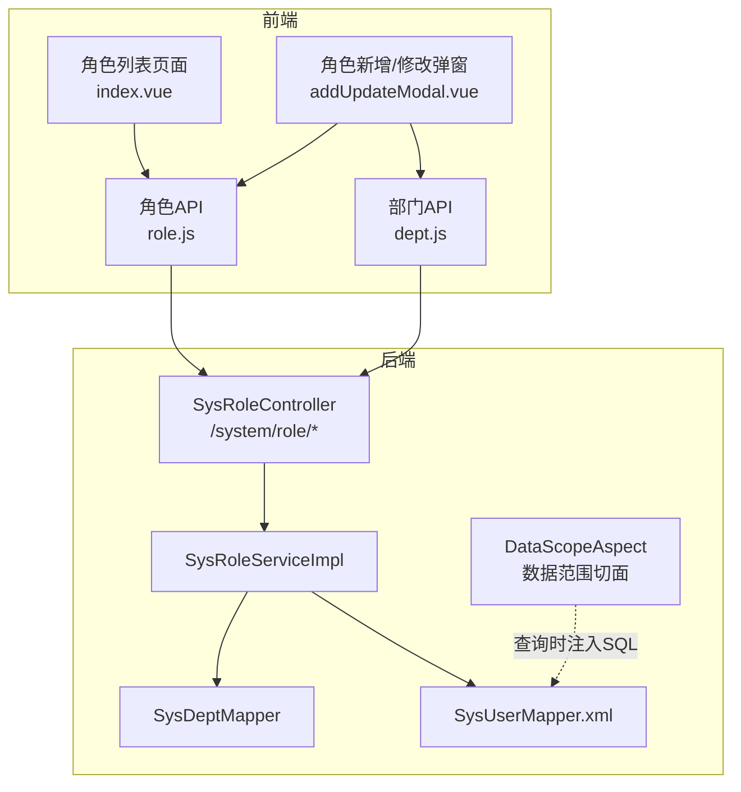
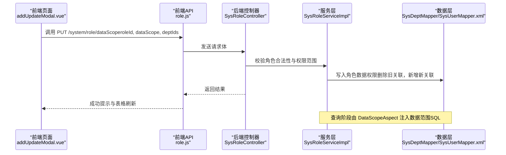
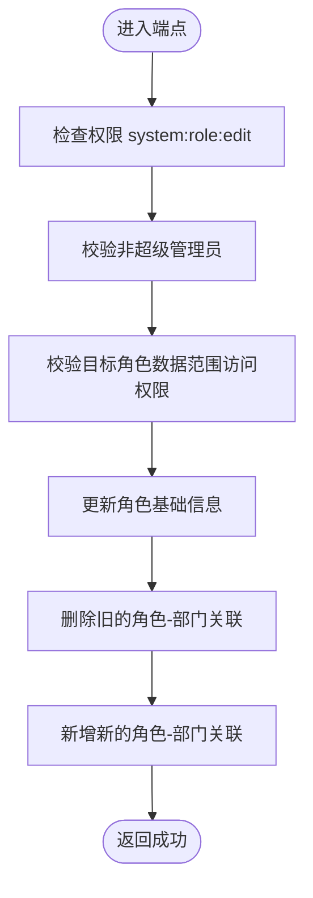
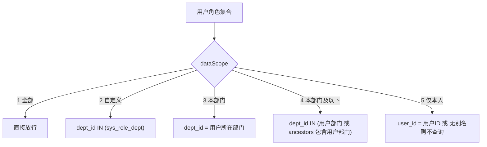
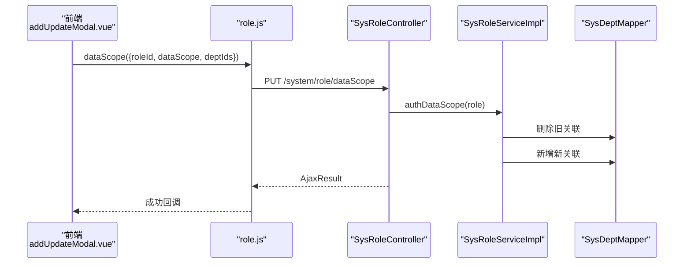
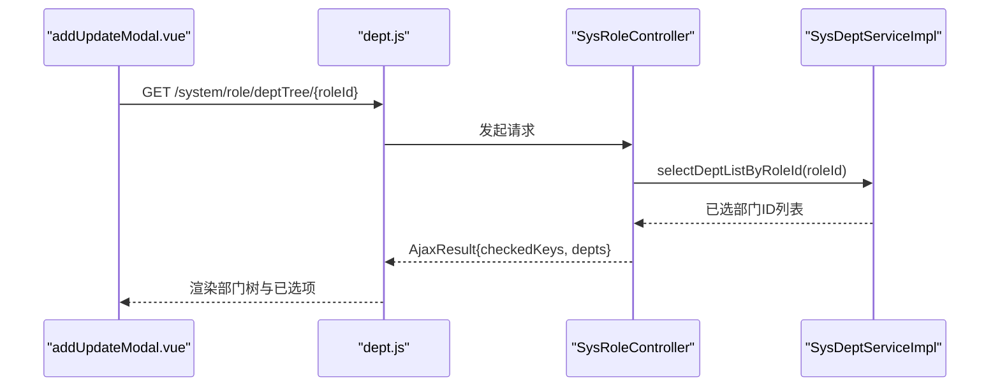
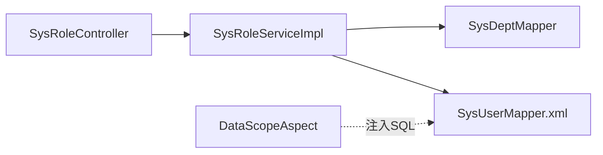

# 角色数据权限API

<cite>
**本文引用的文件**
- [SysRoleController.java](file://bearjia-admin-backend/src/main/java/com/javaxiaobear/module/system/controller/SysRoleController.java)
- [SysRoleServiceImpl.java](file://bearjia-admin-backend/src/main/java/com/javaxiaobear/module/system/service/impl/SysRoleServiceImpl.java)
- [DataScopeAspect.java](file://bearjia-admin-backend/src/main/java/com/javaxiaobear/base/framework/aspectj/DataScopeAspect.java)
- [SysRole.java](file://bearjia-admin-backend/src/main/java/com/javaxiaobear/module/system/domain/SysRole.java)
- [SysDeptServiceImpl.java](file://bearjia-admin-backend/src/main/java/com/javaxiaobear/module/system/service/impl/SysDeptServiceImpl.java)
- [SysDeptMapper.java](file://bearjia-admin-backend/src/main/java/com/javaxiaobear/module/system/mapper/SysDeptMapper.java)
- [SysUserMapper.xml](file://bearjia-admin-backend/src/main/resources/mybatis/system/SysUserMapper.xml)
- [SysDeptMapper.xml](file://bearjia-admin-backend/src/main/resources/mybatis/system/SysDeptMapper.xml)
- [role.js](file://bear-jia-vue3/src/api/system/role.js)
- [dept.js](file://bear-jia-vue3/src/api/system/dept.js)
- [index.vue](file://bear-jia-vue3/src/views/system/role/index.vue)
- [addUpdateModal.vue](file://bear-jia-vue3/src/views/system/role/addUpdateModal.vue)
</cite>

## 目录
1. [简介](#简介)
2. [项目结构](#项目结构)
3. [核心组件](#核心组件)
4. [架构总览](#架构总览)
5. [详细组件分析](#详细组件分析)
6. [依赖关系分析](#依赖关系分析)
7. [性能考量](#性能考量)
8. [故障排查指南](#故障排查指南)
9. [结论](#结论)
10. [附录](#附录)

## 简介
本文件聚焦于“角色数据权限”管理能力，围绕后端控制器端点 PUT /system/role/dataScope 的完整调用链路进行说明，涵盖：
- 请求参数与业务含义（roleId、dataScope、deptIds 等）
- dataScope 字段的枚举值与数据过滤规则
- 自定义部门数据权限的分配流程与后端校验
- 前端与后端的集成方式（权限校验、部门树组件）
- 安全与权限边界（system:role:edit）

## 项目结构
后端采用 Spring Boot + MyBatis，前端基于 Vue3 + Ant Design Vue。角色数据权限涉及的关键模块如下：
- 控制器层：SysRoleController 提供角色管理与数据权限分配端点
- 服务层：SysRoleServiceImpl 实现角色数据权限更新逻辑
- 切面层：DataScopeAspect 在查询时根据用户角色动态拼接数据范围 SQL
- 数据层：SysDeptMapper、SysUserMapper 提供部门与用户数据范围查询
- 前端：role.js、dept.js 提供 API 调用封装；index.vue、addUpdateModal.vue 提供界面交互与部门树集成

图表来源
- [SysRoleController.java](file://bearjia-admin-backend/src/main/java/com/javaxiaobear/module/system/controller/SysRoleController.java#L145-L167)
- [SysRoleServiceImpl.java](file://bearjia-admin-backend/src/main/java/com/javaxiaobear/module/system/service/impl/SysRoleServiceImpl.java#L274-L332)
- [DataScopeAspect.java](file://bearjia-admin-backend/src/main/java/com/javaxiaobear/base/framework/aspectj/DataScopeAspect.java#L82-L175)
- [SysDeptMapper.java](file://bearjia-admin-backend/src/main/java/com/javaxiaobear/module/system/mapper/SysDeptMapper.java#L24-L30)
- [SysUserMapper.xml](file://bearjia-admin-backend/src/main/resources/mybatis/system/SysUserMapper.xml#L68-L97)
- [role.js](file://bear-jia-vue3/src/api/system/role.js#L38-L45)
- [dept.js](file://bear-jia-vue3/src/api/system/dept.js#L36-L42)

章节来源
- [SysRoleController.java](file://bearjia-admin-backend/src/main/java/com/javaxiaobear/module/system/controller/SysRoleController.java#L145-L167)
- [role.js](file://bear-jia-vue3/src/api/system/role.js#L38-L45)

## 核心组件
- 后端端点：PUT /system/role/dataScope
- 前端 API：role.js 中的 dataScope 方法
- 数据模型：SysRole（包含 dataScope、deptIds、menuIds 等）
- 数据范围切面：DataScopeAspect（按角色 dataScope 动态拼接 SQL）
- 部门树接口：GET /system/role/deptTree/{roleId}

章节来源
- [SysRoleController.java](file://bearjia-admin-backend/src/main/java/com/javaxiaobear/module/system/controller/SysRoleController.java#L145-L167)
- [SysRole.java](file://bearjia-admin-backend/src/main/java/com/javaxiaobear/module/system/domain/SysRole.java#L38-L40)
- [DataScopeAspect.java](file://bearjia-admin-backend/src/main/java/com/javaxiaobear/base/framework/aspectj/DataScopeAspect.java#L28-L57)
- [role.js](file://bear-jia-vue3/src/api/system/role.js#L38-L45)

## 架构总览
角色数据权限分配的端到端流程如下：

图表来源
- [SysRoleController.java](file://bearjia-admin-backend/src/main/java/com/javaxiaobear/module/system/controller/SysRoleController.java#L145-L167)
- [SysRoleServiceImpl.java](file://bearjia-admin-backend/src/main/java/com/javaxiaobear/module/system/service/impl/SysRoleServiceImpl.java#L274-L332)
- [SysDeptMapper.java](file://bearjia-admin-backend/src/main/java/com/javaxiaobear/module/system/mapper/SysDeptMapper.java#L24-L30)
- [SysUserMapper.xml](file://bearjia-admin-backend/src/main/resources/mybatis/system/SysUserMapper.xml#L68-L97)

## 详细组件分析

### 后端端点：PUT /system/role/dataScope
- 权限要求：需要具备 system:role:edit 权限
- 请求体：SysRole 对象（roleId、dataScope、deptIds 等）
- 校验逻辑：
  - 角色不允许为超级管理员
  - 当前登录用户对目标角色具有数据范围访问权限
- 业务逻辑：
  - 更新角色基本信息
  - 删除旧的角色-部门关联
  - 新增新的角色-部门关联（即自定义数据权限）

图表来源
- [SysRoleController.java](file://bearjia-admin-backend/src/main/java/com/javaxiaobear/module/system/controller/SysRoleController.java#L145-L167)
- [SysRoleServiceImpl.java](file://bearjia-admin-backend/src/main/java/com/javaxiaobear/module/system/service/impl/SysRoleServiceImpl.java#L274-L332)

章节来源
- [SysRoleController.java](file://bearjia-admin-backend/src/main/java/com/javaxiaobear/module/system/controller/SysRoleController.java#L145-L167)
- [SysRoleServiceImpl.java](file://bearjia-admin-backend/src/main/java/com/javaxiaobear/module/system/service/impl/SysRoleServiceImpl.java#L274-L332)

### 数据范围枚举与过滤规则（dataScope）
- 枚举值与含义：
  - 1：全部数据权限
  - 2：自定义数据权限
  - 3：本部门数据权限
  - 4：本部门及以下数据权限
  - 5：仅本人数据权限
- 过滤规则（切面注入）：
  - 全部数据权限：直接放行
  - 自定义数据权限：按 sys_role_dept 关联的部门集合过滤
  - 本部门：按用户所在部门 dept_id 过滤
  - 本部门及以下：按 dept_id 与祖先路径 ancestors 过滤
  - 仅本人：按用户 user_id 过滤；无 userAlias 时会构造不查询任何数据的条件以确保安全

图表来源
- [DataScopeAspect.java](file://bearjia-admin-backend/src/main/java/com/javaxiaobear/base/framework/aspectj/DataScopeAspect.java#L28-L57)
- [DataScopeAspect.java](file://bearjia-admin-backend/src/main/java/com/javaxiaobear/base/framework/aspectj/DataScopeAspect.java#L108-L141)
- [SysDeptMapper.xml](file://bearjia-admin-backend/src/main/resources/mybatis/system/SysDeptMapper.xml#L50-L59)
- [SysUserMapper.xml](file://bearjia-admin-backend/src/main/resources/mybatis/system/SysUserMapper.xml#L68-L97)

章节来源
- [SysRole.java](file://bearjia-admin-backend/src/main/java/com/javaxiaobear/module/system/domain/SysRole.java#L38-L40)
- [DataScopeAspect.java](file://bearjia-admin-backend/src/main/java/com/javaxiaobear/base/framework/aspectj/DataScopeAspect.java#L28-L57)
- [SysDeptMapper.xml](file://bearjia-admin-backend/src/main/resources/mybatis/system/SysDeptMapper.xml#L50-L59)
- [SysUserMapper.xml](file://bearjia-admin-backend/src/main/resources/mybatis/system/SysUserMapper.xml#L68-L97)

### 自定义部门数据权限分配流程
- 前端：
  - 当 dataScope 为自定义（2）时，展示部门树组件（DeptTree），支持展开/折叠、全选/全不选、父子联动
  - 提交时将 deptIds 作为数组传给后端
- 后端：
  - 接收 SysRole（包含 roleId、dataScope、deptIds）
  - 服务层删除旧关联并新增新关联
  - 查询阶段由切面根据用户角色自动注入数据范围 SQL

图表来源
- [addUpdateModal.vue](file://bear-jia-vue3/src/views/system/role/addUpdateModal.vue#L63-L101)
- [role.js](file://bear-jia-vue3/src/api/system/role.js#L38-L45)
- [SysRoleController.java](file://bearjia-admin-backend/src/main/java/com/javaxiaobear/module/system/controller/SysRoleController.java#L145-L167)
- [SysRoleServiceImpl.java](file://bearjia-admin-backend/src/main/java/com/javaxiaobear/module/system/service/impl/SysRoleServiceImpl.java#L274-L332)
- [SysDeptMapper.java](file://bearjia-admin-backend/src/main/java/com/javaxiaobear/module/system/mapper/SysDeptMapper.java#L24-L30)

章节来源
- [addUpdateModal.vue](file://bear-jia-vue3/src/views/system/role/addUpdateModal.vue#L63-L101)
- [role.js](file://bear-jia-vue3/src/api/system/role.js#L38-L45)
- [SysRoleController.java](file://bearjia-admin-backend/src/main/java/com/javaxiaobear/module/system/controller/SysRoleController.java#L145-L167)
- [SysRoleServiceImpl.java](file://bearjia-admin-backend/src/main/java/com/javaxiaobear/module/system/service/impl/SysRoleServiceImpl.java#L274-L332)

### 前端部门树组件与接口集成
- 部门树数据接口：GET /system/role/deptTree/{roleId}
  - 返回结构：checkedKeys（已选部门ID列表）、depts（部门树）
- 前端集成：
  - 在角色新增/修改弹窗中，当 dataScope 为自定义时，调用该接口加载部门树与已选部门
  - 使用 DeptTree 组件展示树结构，并支持多选

图表来源
- [dept.js](file://bear-jia-vue3/src/api/system/dept.js#L36-L42)
- [SysRoleController.java](file://bearjia-admin-backend/src/main/java/com/javaxiaobear/module/system/controller/SysRoleController.java#L252-L262)
- [SysDeptServiceImpl.java](file://bearjia-admin-backend/src/main/java/com/javaxiaobear/module/system/service/impl/SysDeptServiceImpl.java#L110-L116)

章节来源
- [dept.js](file://bear-jia-vue3/src/api/system/dept.js#L36-L42)
- [SysRoleController.java](file://bearjia-admin-backend/src/main/java/com/javaxiaobear/module/system/controller/SysRoleController.java#L252-L262)
- [SysDeptServiceImpl.java](file://bearjia-admin-backend/src/main/java/com/javaxiaobear/module/system/service/impl/SysDeptServiceImpl.java#L110-L116)

## 依赖关系分析
- 控制器依赖服务层，服务层依赖数据层
- 查询阶段通过切面注入数据范围 SQL，避免硬编码
- 角色数据权限更新依赖角色-部门关联映射

图表来源
- [SysRoleController.java](file://bearjia-admin-backend/src/main/java/com/javaxiaobear/module/system/controller/SysRoleController.java#L145-L167)
- [SysRoleServiceImpl.java](file://bearjia-admin-backend/src/main/java/com/javaxiaobear/module/system/service/impl/SysRoleServiceImpl.java#L274-L332)
- [DataScopeAspect.java](file://bearjia-admin-backend/src/main/java/com/javaxiaobear/base/framework/aspectj/DataScopeAspect.java#L82-L175)
- [SysDeptMapper.java](file://bearjia-admin-backend/src/main/java/com/javaxiaobear/module/system/mapper/SysDeptMapper.java#L24-L30)
- [SysUserMapper.xml](file://bearjia-admin-backend/src/main/resources/mybatis/system/SysUserMapper.xml#L68-L97)

章节来源
- [SysRoleController.java](file://bearjia-admin-backend/src/main/java/com/javaxiaobear/module/system/controller/SysRoleController.java#L145-L167)
- [SysRoleServiceImpl.java](file://bearjia-admin-backend/src/main/java/com/javaxiaobear/module/system/service/impl/SysRoleServiceImpl.java#L274-L332)
- [DataScopeAspect.java](file://bearjia-admin-backend/src/main/java/com/javaxiaobear/base/framework/aspectj/DataScopeAspect.java#L82-L175)

## 性能考量
- 自定义数据权限：deptIds 数量较多时，批量写入角色-部门关联可减少多次往返
- 查询阶段：切面按角色聚合条件，避免重复计算；建议在高频查询场景下合理使用索引
- 前端：部门树全选/展开/折叠等操作应避免不必要的重渲染，保持交互流畅

[本节为通用指导，无需列出具体文件来源]

## 故障排查指南
- 无权限访问角色数据
  - 现象：调用 dataScope 返回权限不足或抛出异常
  - 原因：当前用户对目标角色无数据范围访问权限
  - 处理：确认当前用户是否具备目标角色的可见范围或提升权限
- 超级管理员不可操作
  - 现象：尝试修改超级管理员角色数据权限被拒绝
  - 原因：服务层对超级管理员角色有保护逻辑
  - 处理：不要对超级管理员角色执行数据权限变更
- 仅本人数据权限导致查询为空
  - 现象：启用“仅本人数据权限”后查询不到任何数据
  - 原因：切面在无 userAlias 时构造不查询任何数据的条件
  - 处理：确保查询接口提供 userAlias 或调整 dataScope

章节来源
- [SysRoleServiceImpl.java](file://bearjia-admin-backend/src/main/java/com/javaxiaobear/module/system/service/impl/SysRoleServiceImpl.java#L192-L211)
- [DataScopeAspect.java](file://bearjia-admin-backend/src/main/java/com/javaxiaobear/base/framework/aspectj/DataScopeAspect.java#L130-L141)

## 结论
- PUT /system/role/dataScope 是角色数据权限分配的核心端点，必须具备 system:role:edit 权限
- dataScope 的五种枚举值分别对应不同的数据过滤策略，其中自定义数据权限通过 deptIds 与角色-部门关联实现
- 前端通过部门树组件与 GET /system/role/deptTree/{roleId} 集成，实现直观的权限分配体验
- 切面机制在查询阶段自动注入数据范围 SQL，确保权限边界一致且可维护

[本节为总结性内容，无需列出具体文件来源]

## 附录

### API 定义与参数说明
- 端点：PUT /system/role/dataScope
- 权限：system:role:edit
- 请求体字段：
  - roleId：角色ID
  - dataScope：数据范围枚举（1-全部、2-自定义、3-本部门、4-本部门及以下、5-仅本人）
  - deptIds：自定义数据权限时的部门ID数组
  - menuIds：菜单权限（用于角色整体更新，非数据权限）
- 返回：AjaxResult（成功/失败）

章节来源
- [SysRoleController.java](file://bearjia-admin-backend/src/main/java/com/javaxiaobear/module/system/controller/SysRoleController.java#L145-L167)
- [SysRole.java](file://bearjia-admin-backend/src/main/java/com/javaxiaobear/module/system/domain/SysRole.java#L38-L40)
- [role.js](file://bear-jia-vue3/src/api/system/role.js#L38-L45)

### 前端集成要点
- 当 dataScope 为自定义（2）时，显示部门树组件并加载已选部门
- 提交时将 deptIds 作为数组传给后端
- 调用 dataScope 接口后刷新表格并提示成功

章节来源
- [addUpdateModal.vue](file://bear-jia-vue3/src/views/system/role/addUpdateModal.vue#L63-L101)
- [role.js](file://bear-jia-vue3/src/api/system/role.js#L38-L45)