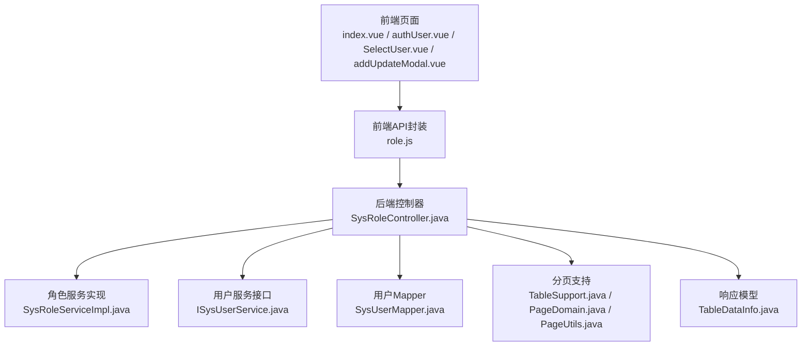
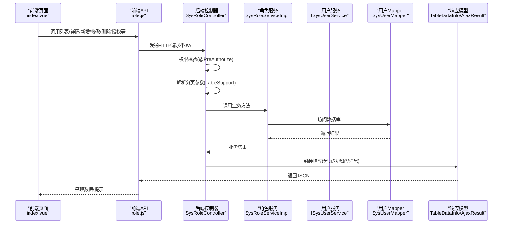
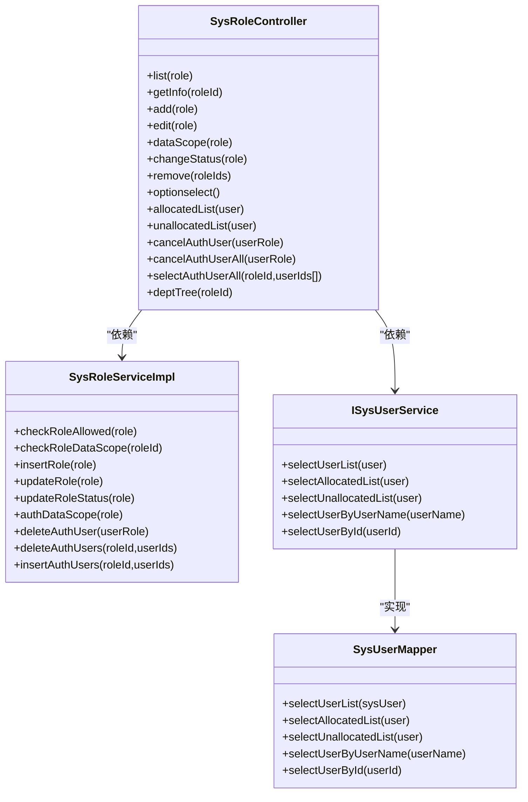

# 角色权限API

<cite>
**本文档引用的文件**
- [role.js](file://bear-jia-vue3/src/api/system/role.js)
- [SysRoleController.java](file://bearjia-admin-backend/src/main/java/com/javaxiaobear/module/system/controller/SysRoleController.java)
- [index.vue](file://bear-jia-vue3/src/views/system/role/index.vue)
- [authUser.vue](file://bearjia-vue3/src/views/system/role/module/authUser.vue)
- [SelectUser.vue](file://bearjia-vue3/src/views/system/role/module/SelectUser.vue)
- [addUpdateModal.vue](file://bearjia-vue3/src/views/system/role/addUpdateModal.vue)
- [TableSupport.java](file://bearjia-admin-backend/src/main/java/com/javaxiaobear/base/framework/web/page/TableSupport.java)
- [PageDomain.java](file://bearjia-admin-backend/src/main/java/com/javaxiaobear/base/framework/web/page/PageDomain.java)
- [PageUtils.java](file://bearjia-admin-backend/src/main/java/com/javaxiaobear/base/common/utils/PageUtils.java)
- [TableDataInfo.java](file://bearjia-admin-backend/src/main/java/com/javaxiaobear/base/framework/web/page/TableDataInfo.java)
- [SysRoleServiceImpl.java](file://bearjia-admin-backend/src/main/java/com/javaxiaobear/module/system/service/impl/SysRoleServiceImpl.java)
- [ISysUserService.java](file://bearjia-admin-backend/src/main/java/com/javaxiaobear/module/system/service/ISysUserService.java)
- [SysUserMapper.java](file://bearjia-admin-backend/src/main/java/com/javaxiaobear/module/system/mapper/SysUserMapper.java)
- [messages.properties](file://bearjia-admin-backend/src/main/resources/i18n/messages.properties)
- [errorCode.js](file://bear-jia-vue3/src/utils/errorCode.js)
</cite>

## 目录
1. [简介](#简介)
2. [项目结构](#项目结构)
3. [核心组件](#核心组件)
4. [架构总览](#架构总览)
5. [详细组件分析](#详细组件分析)
6. [依赖关系分析](#依赖关系分析)
7. [性能考量](#性能考量)
8. [故障排查指南](#故障排查指南)
9. [结论](#结论)
10. [附录](#附录)

## 简介
本API文档面向前端与后端开发者，聚焦“角色权限管理”模块，覆盖角色查询、新增、修改、删除、数据权限分配、用户授权等核心能力。文档详细说明每个端点的HTTP方法、URL路径、请求参数（含路径参数、查询参数、请求体）、响应数据结构（成功与错误情形）、认证要求（JWT Token），并提供实际请求与响应示例路径、分页参数规范、通用错误码含义、权限控制逻辑（如角色数据范围校验）以及最佳实践（如角色权限变更后的缓存更新机制）。

## 项目结构
- 前端角色管理API封装位于：bear-jia-vue3/src/api/system/role.js
- 后端控制器位于：bearjia-admin-backend/src/main/java/com/javaxiaobear/module/system/controller/SysRoleController.java
- 前端页面与交互：
  - 角色列表页：bear-jia-vue3/src/views/system/role/index.vue
  - 已授权用户表格：bear-jia-vue3/src/views/system/role/module/authUser.vue
  - 未授权用户选择：bear-jia-vue3/src/views/system/role/module/SelectUser.vue
  - 新增/编辑弹窗（含数据权限分配流程）：bear-jia-vue3/src/views/system/role/addUpdateModal.vue
- 分页与响应模型：
  - 分页参数常量与构建：TableSupport.java、PageDomain.java、PageUtils.java
  - 分页响应模型：TableDataInfo.java
- 权限与服务：
  - 角色服务实现与数据范围校验：SysRoleServiceImpl.java
  - 用户服务接口与Mapper：ISysUserService.java、SysUserMapper.java
- 国际化与错误码：
  - 国际化消息：messages.properties
  - 前端通用错误码映射：errorCode.js

图表来源
- [role.js](file://bear-jia-vue3/src/api/system/role.js#L1-L112)
- [SysRoleController.java](file://bearjia-admin-backend/src/main/java/com/javaxiaobear/module/system/controller/SysRoleController.java#L1-L264)
- [SysRoleServiceImpl.java](file://bearjia-admin-backend/src/main/java/com/javaxiaobear/module/system/service/impl/SysRoleServiceImpl.java#L172-L225)
- [ISysUserService.java](file://bearjia-admin-backend/src/main/java/com/javaxiaobear/module/system/service/ISysUserService.java#L1-L56)
- [SysUserMapper.java](file://bearjia-admin-backend/src/main/java/com/javaxiaobear/module/system/mapper/SysUserMapper.java#L1-L58)
- [TableSupport.java](file://bearjia-admin-backend/src/main/java/com/javaxiaobear/base/framework/web/page/TableSupport.java#L1-L56)
- [PageDomain.java](file://bearjia-admin-backend/src/main/java/com/javaxiaobear/base/framework/web/page/PageDomain.java#L1-L67)
- [PageUtils.java](file://bearjia-admin-backend/src/main/java/com/javaxiaobear/base/common/utils/PageUtils.java#L1-L35)
- [TableDataInfo.java](file://bearjia-admin-backend/src/main/java/com/javaxiaobear/base/framework/web/page/TableDataInfo.java#L1-L85)

章节来源
- [role.js](file://bear-jia-vue3/src/api/system/role.js#L1-L112)
- [SysRoleController.java](file://bearjia-admin-backend/src/main/java/com/javaxiaobear/module/system/controller/SysRoleController.java#L1-L264)

## 核心组件
- 前端API封装：提供角色列表、详情、新增、修改、删除、数据权限分配、状态变更、已授权/未授权用户查询、取消授权、批量授权等方法。
- 后端控制器：统一暴露REST端点，进行权限校验（@PreAuthorize）、参数绑定、分页处理、业务调用与响应封装。
- 分页与响应：TableSupport/ PageDomain/ PageUtils负责分页参数解析与启动；TableDataInfo作为标准分页响应载体。
- 权限与数据范围：SysRoleServiceImpl对角色是否允许操作、角色数据范围访问进行校验，确保越权访问被拒绝。
- 前端页面：index.vue承载列表与导出；authUser.vue与SelectUser.vue承载用户授权相关表格与选择流程；addUpdateModal.vue在新增时先创建角色再分配数据权限。

章节来源
- [role.js](file://bear-jia-vue3/src/api/system/role.js#L1-L112)
- [SysRoleController.java](file://bearjia-admin-backend/src/main/java/com/javaxiaobear/module/system/controller/SysRoleController.java#L61-L249)
- [TableSupport.java](file://bearjia-admin-backend/src/main/java/com/javaxiaobear/base/framework/web/page/TableSupport.java#L16-L56)
- [PageDomain.java](file://bearjia-admin-backend/src/main/java/com/javaxiaobear/base/framework/web/page/PageDomain.java#L12-L67)
- [PageUtils.java](file://bearjia-admin-backend/src/main/java/com/javaxiaobear/base/common/utils/PageUtils.java#L18-L26)
- [TableDataInfo.java](file://bearjia-admin-backend/src/main/java/com/javaxiaobear/base/framework/web/page/TableDataInfo.java#L15-L85)
- [SysRoleServiceImpl.java](file://bearjia-admin-backend/src/main/java/com/javaxiaobear/module/system/service/impl/SysRoleServiceImpl.java#L172-L225)
- [index.vue](file://bear-jia-vue3/src/views/system/role/index.vue#L1-L129)
- [authUser.vue](file://bear-jia-vue3/src/views/system/role/module/authUser.vue#L1-L125)
- [SelectUser.vue](file://bear-jia-vue3/src/views/system/role/module/SelectUser.vue#L42-L96)
- [addUpdateModal.vue](file://bearjia-vue3/src/views/system/role/addUpdateModal.vue#L247-L286)

## 架构总览
角色权限管理采用前后端分离架构：前端通过role.js封装的HTTP请求调用后端控制器端点；控制器执行权限校验与参数绑定，调用服务层完成业务处理，并返回统一的AjaxResult或TableDataInfo响应；分页通过TableSupport/ PageDomain/ PageUtils链路解析pageNum/pageSize等参数。

图表来源
- [role.js](file://bear-jia-vue3/src/api/system/role.js#L1-L112)
- [SysRoleController.java](file://bearjia-admin-backend/src/main/java/com/javaxiaobear/module/system/controller/SysRoleController.java#L61-L249)
- [SysRoleServiceImpl.java](file://bearjia-admin-backend/src/main/java/com/javaxiaobear/module/system/service/impl/SysRoleServiceImpl.java#L172-L225)
- [ISysUserService.java](file://bearjia-admin-backend/src/main/java/com/javaxiaobear/module/system/service/ISysUserService.java#L1-L56)
- [SysUserMapper.java](file://bearjia-admin-backend/src/main/java/com/javaxiaobear/module/system/mapper/SysUserMapper.java#L1-L58)
- [TableSupport.java](file://bearjia-admin-backend/src/main/java/com/javaxiaobear/base/framework/web/page/TableSupport.java#L16-L56)
- [TableDataInfo.java](file://bearjia-admin-backend/src/main/java/com/javaxiaobear/base/framework/web/page/TableDataInfo.java#L15-L85)

## 详细组件分析

### 角色查询与分页
- 端点
  - GET /system/role/list
  - GET /system/role/{roleId}
- 请求参数
  - GET /system/role/list
    - 查询参数：pageNum、pageSize、orderByColumn、isAsc、reasonable（来自TableSupport常量）
    - 业务过滤：可携带角色名称、编码、状态等查询条件（由前端传入）
  - GET /system/role/{roleId}
    - 路径参数：roleId
- 响应
  - GET /system/role/list：TableDataInfo（rows、total、code、msg）
  - GET /system/role/{roleId}：AjaxResult（success/error，包含角色详情）
- 认证要求
  - 需要具备权限标识 system:role:list 或 system:role:query
- 示例
  - 请求：GET /system/role/list?pageNum=1&pageSize=10&status=0
  - 成功响应：rows为列表数据，total为总数，code=200
  - 失败响应：code非200，msg包含错误信息

章节来源
- [SysRoleController.java](file://bearjia-admin-backend/src/main/java/com/javaxiaobear/module/system/controller/SysRoleController.java#L61-L87)
- [TableSupport.java](file://bearjia-admin-backend/src/main/java/com/javaxiaobear/base/framework/web/page/TableSupport.java#L16-L56)
- [TableDataInfo.java](file://bearjia-admin-backend/src/main/java/com/javaxiaobear/base/framework/web/page/TableDataInfo.java#L15-L85)
- [index.vue](file://bear-jia-vue3/src/views/system/role/index.vue#L104-L113)

### 新增角色
- 端点
  - POST /system/role
- 请求体
  - SysRole对象（包含角色名称、编码、排序、状态、备注、菜单/部门等权限范围字段）
- 响应
  - AjaxResult（code=200表示成功）
- 认证要求
  - 需要具备权限标识 system:role:add
- 示例
  - 请求：POST /system/role（请求体为SysRole对象）
  - 成功响应：code=200，msg为“操作成功”

章节来源
- [SysRoleController.java](file://bearjia-admin-backend/src/main/java/com/javaxiaobear/module/system/controller/SysRoleController.java#L92-L108)
- [addUpdateModal.vue](file://bear-jia-vue3/src/views/system/role/addUpdateModal.vue#L276-L286)

### 修改角色
- 端点
  - PUT /system/role
- 请求体
  - SysRole对象（包含roleId等）
- 响应
  - AjaxResult（成功后会触发缓存更新）
- 认证要求
  - 需要具备权限标识 system:role:edit
- 缓存更新机制
  - 成功修改角色后，控制器会刷新当前登录用户的权限缓存与用户信息，确保权限即时生效

章节来源
- [SysRoleController.java](file://bearjia-admin-backend/src/main/java/com/javaxiaobear/module/system/controller/SysRoleController.java#L113-L143)
- [SysRoleServiceImpl.java](file://bearjia-admin-backend/src/main/java/com/javaxiaobear/module/system/service/impl/SysRoleServiceImpl.java#L172-L225)

### 删除角色
- 端点
  - DELETE /system/role/{roleIds}
- 路径参数
  - roleIds：支持多个角色ID（数组）
- 响应
  - AjaxResult（code=200表示成功）
- 认证要求
  - 需要具备权限标识 system:role:remove

章节来源
- [SysRoleController.java](file://bearjia-admin-backend/src/main/java/com/javaxiaobear/module/system/controller/SysRoleController.java#L172-L181)

### 角色状态修改
- 端点
  - PUT /system/role/changeStatus
- 请求体
  - SysRole对象（包含roleId、status）
- 响应
  - AjaxResult（code=200表示成功）
- 认证要求
  - 需要具备权限标识 system:role:edit

章节来源
- [SysRoleController.java](file://bearjia-admin-backend/src/main/java/com/javaxiaobear/module/system/controller/SysRoleController.java#L161-L169)

### 角色数据权限分配
- 端点
  - PUT /system/role/dataScope
- 请求体
  - SysRole对象（包含roleId、dataScope、menuIds、deptIds等）
- 响应
  - AjaxResult（code=200表示成功）
- 认证要求
  - 需要具备权限标识 system:role:edit
- 权限控制逻辑
  - 控制器在分配数据权限前会校验角色是否允许操作、是否具有数据范围访问权限

章节来源
- [SysRoleController.java](file://bearjia-admin-backend/src/main/java/com/javaxiaobear/module/system/controller/SysRoleController.java#L145-L156)
- [SysRoleServiceImpl.java](file://bearjia-admin-backend/src/main/java/com/javaxiaobear/module/system/service/impl/SysRoleServiceImpl.java#L172-L225)
- [addUpdateModal.vue](file://bear-jia-vue3/src/views/system/role/addUpdateModal.vue#L276-L286)

### 用户授权与取消授权
- 已授权用户列表
  - GET /system/role/authUser/allocatedList
  - 参数：pageNum、pageSize、orderByColumn、isAsc、reasonable、roleId（必填）
- 未授权用户列表
  - GET /system/role/authUser/unallocatedList
  - 参数：pageNum、pageSize、orderByColumn、isAsc、reasonable、roleId（必填）
- 取消单个用户授权
  - PUT /system/role/authUser/cancel
  - 请求体：SysUserRole（包含roleId、userId）
- 批量取消用户授权
  - PUT /system/role/authUser/cancelAll
  - 请求体：SysUserRole（包含roleId、userIds[]）
- 批量授权用户
  - PUT /system/role/authUser/selectAll
  - 参数：roleId（必填）、userIds[]（必填）
- 认证要求
  - 需要具备权限标识 system:role:list 与 system:role:edit
- 权限控制逻辑
  - 批量授权前会校验角色数据范围

章节来源
- [SysRoleController.java](file://bearjia-admin-backend/src/main/java/com/javaxiaobear/module/system/controller/SysRoleController.java#L193-L249)
- [ISysUserService.java](file://bearjia-admin-backend/src/main/java/com/javaxiaobear/module/system/service/ISysUserService.java#L19-L35)
- [SysUserMapper.java](file://bearjia-admin-backend/src/main/java/com/javaxiaobear/module/system/mapper/SysUserMapper.java#L16-L38)
- [authUser.vue](file://bear-jia-vue3/src/views/system/role/module/authUser.vue#L102-L117)
- [SelectUser.vue](file://bear-jia-vue3/src/views/system/role/module/SelectUser.vue#L79-L86)

### 分页参数规范与默认值
- 参数键
  - pageNum：当前页码，默认值见TableSupport与PageDomain
  - pageSize：每页记录数，默认值见TableSupport与PageDomain
  - orderByColumn：排序字段
  - isAsc：排序方向（asc/desc）
  - reasonable：分页参数合理化开关
- 默认值
  - pageNum：1
  - pageSize：10
  - isAsc：asc
  - reasonable：true
- 解析与启动
  - TableSupport.buildPageRequest()从请求中提取上述参数
  - PageUtils.startPage()基于参数启动分页（PageHelper）

章节来源
- [TableSupport.java](file://bearjia-admin-backend/src/main/java/com/javaxiaobear/base/framework/web/page/TableSupport.java#L16-L56)
- [PageDomain.java](file://bearjia-admin-backend/src/main/java/com/javaxiaobear/base/framework/web/page/PageDomain.java#L12-L67)
- [PageUtils.java](file://bearjia-admin-backend/src/main/java/com/javaxiaobear/base/common/utils/PageUtils.java#L18-L26)

### 权限控制逻辑（角色数据范围校验）
- 校验规则
  - 若当前用户不是超级管理员，访问角色详情或进行修改/状态变更/数据权限分配前，需校验其是否拥有该角色的数据范围访问权限
  - 若无权限，抛出业务异常（ServiceException），提示“没有权限访问角色数据！”
- 影响范围
  - GET /system/role/{roleId}
  - PUT /system/role（修改）
  - PUT /system/role/changeStatus（状态变更）
  - PUT /system/role/dataScope（数据权限分配）
  - PUT /system/role/authUser/selectAll（批量授权）

章节来源
- [SysRoleController.java](file://bearjia-admin-backend/src/main/java/com/javaxiaobear/module/system/controller/SysRoleController.java#L81-L87)
- [SysRoleController.java](file://bearjia-admin-backend/src/main/java/com/javaxiaobear/module/system/controller/SysRoleController.java#L113-L169)
- [SysRoleController.java](file://bearjia-admin-backend/src/main/java/com/javaxiaobear/module/system/controller/SysRoleController.java#L240-L249)
- [SysRoleServiceImpl.java](file://bearjia-admin-backend/src/main/java/com/javaxiaobear/module/system/service/impl/SysRoleServiceImpl.java#L192-L210)

### 前端调用最佳实践
- 新增角色后立即分配数据权限
  - 前端在新增角色成功后，立即调用数据权限分配端点，保证角色可用性
- 角色权限变更后的缓存更新
  - 修改角色成功后，后端会刷新当前登录用户的权限缓存与用户信息，确保权限即时生效
- 用户授权流程
  - 未授权用户选择：通过 unallocatedUserList 获取候选用户，再调用 selectAll 完成批量授权
  - 已授权用户取消：通过 allocatedList 获取已授权用户，再调用 cancel 或 cancelAll

章节来源
- [addUpdateModal.vue](file://bear-jia-vue3/src/views/system/role/addUpdateModal.vue#L276-L286)
- [SysRoleController.java](file://bearjia-admin-backend/src/main/java/com/javaxiaobear/module/system/controller/SysRoleController.java#L130-L141)
- [authUser.vue](file://bear-jia-vue3/src/views/system/role/module/authUser.vue#L102-L117)
- [SelectUser.vue](file://bear-jia-vue3/src/views/system/role/module/SelectUser.vue#L79-L86)

## 依赖关系分析

图表来源
- [SysRoleController.java](file://bearjia-admin-backend/src/main/java/com/javaxiaobear/module/system/controller/SysRoleController.java#L1-L264)
- [SysRoleServiceImpl.java](file://bearjia-admin-backend/src/main/java/com/javaxiaobear/module/system/service/impl/SysRoleServiceImpl.java#L172-L225)
- [ISysUserService.java](file://bearjia-admin-backend/src/main/java/com/javaxiaobear/module/system/service/ISysUserService.java#L1-L56)
- [SysUserMapper.java](file://bearjia-admin-backend/src/main/java/com/javaxiaobear/module/system/mapper/SysUserMapper.java#L1-L58)

章节来源
- [SysRoleController.java](file://bearjia-admin-backend/src/main/java/com/javaxiaobear/module/system/controller/SysRoleController.java#L1-L264)
- [SysRoleServiceImpl.java](file://bearjia-admin-backend/src/main/java/com/javaxiaobear/module/system/service/impl/SysRoleServiceImpl.java#L172-L225)
- [ISysUserService.java](file://bearjia-admin-backend/src/main/java/com/javaxiaobear/module/system/service/ISysUserService.java#L1-L56)
- [SysUserMapper.java](file://bearjia-admin-backend/src/main/java/com/javaxiaobear/module/system/mapper/SysUserMapper.java#L1-L58)

## 性能考量
- 分页参数合理化：建议默认启用reasonable，避免无效页码导致全表扫描
- 排序字段：尽量使用索引字段，避免对大表进行无索引排序
- 批量授权：优先使用selectAll接口一次性授权，减少多次往返
- 缓存更新：修改角色后及时刷新权限缓存，避免频繁重复鉴权

## 故障排查指南
- 通用错误码（前端映射）
  - 401：认证失败，无法访问系统资源
  - 403：当前操作没有权限
  - 404：访问资源不存在
  - default：系统未知错误，请反馈给管理员
- 国际化错误消息（后端）
  - 角色封禁、权限不足、数据范围校验失败等均有明确提示
- 常见问题定位
  - 403：检查权限标识 system:role:* 是否已授予
  - 404：检查URL路径是否正确（如 /system/role/{roleId}）
  - 数据范围校验失败：确认当前用户是否具备该角色的数据范围访问权限
  - 导出失败：确认具备 system:role:export 权限

章节来源
- [errorCode.js](file://bear-jia-vue3/src/utils/errorCode.js#L1-L7)
- [messages.properties](file://bearjia-admin-backend/src/main/resources/i18n/messages.properties#L1-L39)
- [SysRoleController.java](file://bearjia-admin-backend/src/main/java/com/javaxiaobear/module/system/controller/SysRoleController.java#L81-L87)

## 结论
本API文档系统梳理了角色权限管理模块的端点、参数、响应与权限控制逻辑，并结合前端页面与后端控制器的实现，给出了分页参数规范、通用错误码含义与最佳实践。通过严格的权限校验与数据范围控制，确保系统安全；通过缓存更新机制保障权限变更的即时生效。

## 附录

### API一览（按功能分类）
- 角色查询与分页
  - GET /system/role/list（查询角色列表）
  - GET /system/role/{roleId}（获取角色详情）
- 角色维护
  - POST /system/role（新增角色）
  - PUT /system/role（修改角色）
  - PUT /system/role/changeStatus（修改角色状态）
  - DELETE /system/role/{roleIds}（删除角色）
- 数据权限分配
  - PUT /system/role/dataScope（分配数据权限）
- 用户授权
  - GET /system/role/authUser/allocatedList（已授权用户列表）
  - GET /system/role/authUser/unallocatedList（未授权用户列表）
  - PUT /system/role/authUser/cancel（取消单个用户授权）
  - PUT /system/role/authUser/cancelAll（批量取消用户授权）
  - PUT /system/role/authUser/selectAll（批量授权用户）

章节来源
- [role.js](file://bear-jia-vue3/src/api/system/role.js#L1-L112)
- [SysRoleController.java](file://bearjia-admin-backend/src/main/java/com/javaxiaobear/module/system/controller/SysRoleController.java#L61-L249)