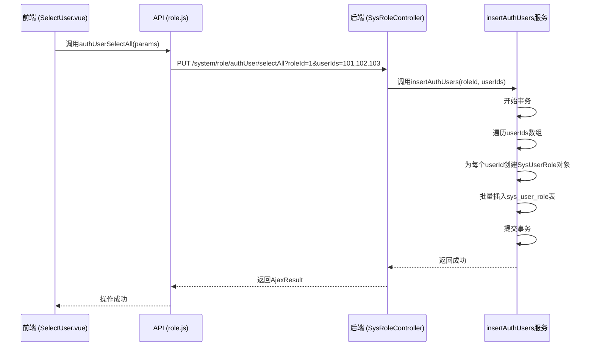

# 角色用户授权API

<cite>
**本文档引用文件**  
- [role.js](file://bear-jia-vue3\src\api\system\role.js)
- [authUser.vue](file://bear-jia-vue3\src\views\system\role\module\authUser.vue)
- [SelectUser.vue](file://bear-jia-vue3\src\views\system\role\module\SelectUser.vue)
- [SysRoleController.java](file://bearjia-admin-backend\src\main\java\com\javaxiaobear\module\system\controller\SysRoleController.java)
- [BusinessType.java](file://bearjia-admin-backend\src\main\java\com\javaxiaobear\base\framework\aspectj\lang\enums\BusinessType.java)
</cite>

## 目录
1. [简介](#简介)
2. [核心API端点](#核心api端点)
3. [权限控制与操作日志](#权限控制与操作日志)
4. [使用场景示例](#使用场景示例)
5. [性能建议与前端策略](#性能建议与前端策略)

## 简介

角色用户授权管理是系统权限体系的核心功能，允许管理员将用户分配给特定角色以授予相应的系统权限。本API文档详细说明了与角色用户关联操作相关的接口，包括查询已授权和未授权用户列表、取消单个或批量用户授权，以及批量授权用户等功能。这些接口构成了角色管理模块中"分配用户"功能的技术基础，支持通过角色进行权限的集中管理和分配。

**Section sources**
- [authUser.vue](file://bear-jia-vue3\src\views\system\role\module\authUser.vue#L1-L50)
- [SelectUser.vue](file://bear-jia-vue3\src\views\system\role\module\SelectUser.vue#L1-L50)

## 核心API端点

本节详细描述了用于管理角色与用户关联关系的五个核心API端点，包括其请求方式、参数、响应结构和业务逻辑。

### 查询已授权用户列表 (GET /system/role/authUser/allocatedList)

此接口用于查询已分配给指定角色的用户列表。

- **请求方式**: GET
- **请求参数**:
  - `roleId` (必填): 角色ID，用于指定要查询的角色。
  - `userName` (可选): 用户名称，用于模糊搜索。
  - `phonenumber` (可选): 手机号码，用于精确搜索。
  - 分页参数 (`pageNum`, `pageSize`): 用于控制返回结果的分页。
- **响应数据结构**: 返回一个包含分页信息的用户列表，每个用户对象包含`userId`, `userName`, `nickName`, `email`, `phonenumber`, `status`, `createTime`等字段。
- **前端调用**: 在`authUser.vue`组件中，通过`allocatedUserList`函数调用此接口，用于在"已授权用户"表格中展示数据。

**Section sources**
- [role.js](file://bear-jia-vue3\src\api\system\role.js#L69-L75)
- [SysRoleController.java](file://bearjia-admin-backend\src\main\java\com\javaxiaobear\module\system\controller\SysRoleController.java#L196-L203)

### 查询未授权用户列表 (GET /system/role/authUser/unallocatedList)

此接口用于查询尚未分配给指定角色的用户列表，通常在添加新用户到角色时使用。

- **请求方式**: GET
- **请求参数**: 与"已授权用户列表"接口相同，包括`roleId`, `userName`, `phonenumber`及分页参数。
- **响应数据结构**: 与"已授权用户列表"相同，返回一个分页的用户列表。
- **前端调用**: 在`SelectUser.vue`组件中，通过`unallocatedUserList`函数调用此接口，为管理员提供一个可选择的用户池。

**Section sources**
- [role.js](file://bear-jia-vue3\src\api\system\role.js#L78-L84)
- [SysRoleController.java](file://bearjia-admin-backend\src\main\java\com\javaxiaobear\module\system\controller\SysRoleController.java#L208-L215)

### 取消单个用户授权 (PUT /system/role/authUser/cancel)

此接口用于取消一个用户与特定角色的关联。

- **请求方式**: PUT
- **请求参数**: 以JSON格式在请求体中传递。
  - `userId`: 要取消授权的用户ID。
  - `roleId`: 目标角色ID。
- **响应**: 成功时返回标准的AjaxResult，表示操作成功。
- **前端调用**: 在`authUser.vue`组件中，当用户点击"取消授权"按钮时，会弹出确认对话框，并调用`authUserCancel`函数执行此操作。

**Section sources**
- [role.js](file://bear-jia-vue3\src\api\system\role.js#L87-L93)
- [authUser.vue](file://bear-jia-vue3\src\views\system\role\module\authUser.vue#L155-L172)

### 批量取消用户授权 (PUT /system/role/authUser/cancelAll)

此接口用于一次性取消多个用户与特定角色的关联。

- **请求方式**: PUT
- **请求参数**: 以JSON格式在请求体中传递。
  - `roleId`: 目标角色ID。
  - `userIds`: 一个包含多个用户ID的数组。
- **响应**: 成功时返回标准的AjaxResult。
- **前端调用**: 在`authUser.vue`组件中，当用户选中多个用户并点击"取消批量授权"按钮时，会调用`authUserCancelAll`函数执行此操作。

**Section sources**
- [role.js](file://bear-jia-vue3\src\api\system\role.js#L96-L102)
- [authUser.vue](file://bear-jia-vue3\src\views\system\role\module\authUser.vue#L175-L201)

### 批量授权用户 (PUT /system/role/authUser/selectAll)

此接口是批量授权的核心，用于将多个用户一次性分配给一个角色。

- **请求方式**: PUT
- **请求参数传递机制**: 与上述接口不同，此接口的参数通过URL查询参数（`@RequestParam`）传递，而不是请求体。
  - `roleId` (Long): 指定目标角色的ID。
  - `userIds` (Long[]): 一个包含要授权的用户ID的数组。
- **后端实现逻辑**: 后端`insertAuthUsers`服务会遍历`userIds`数组，为每个用户创建一条角色用户关联记录，并将其插入到`sys_user_role`关联表中。此操作在一个事务中完成，确保数据一致性。
- **前端调用**: 在`SelectUser.vue`组件中，当用户在选择用户模态框中确认选择后，会调用`authUserSelectAll`函数，并将`roleId`和`selectedRowKeys`（用户ID数组）作为参数传递。

**Diagram sources**
- [role.js](file://bear-jia-vue3\src\api\system\role.js#L105-L111)
- [SelectUser.vue](file://bear-jia-vue3\src\views\system\role\module\SelectUser.vue#L133-L138)
- [SysRoleController.java](file://bearjia-admin-backend\src\main\java\com\javaxiaobear\module\system\controller\SysRoleController.java#L240-L250)

**Section sources**
- [role.js](file://bear-jia-vue3\src\api\system\role.js#L105-L111)
- [SelectUser.vue](file://bear-jia-vue3\src\views\system\role\module\SelectUser.vue#L132-L140)

## 权限控制与操作日志

### 权限控制

所有与角色编辑相关的操作，包括用户授权，都受到严格的权限控制。根据代码分析，执行这些API需要`system:role:edit`权限。

- **实现方式**: 在后端`SysRoleController.java`中，使用`@PreAuthorize("@ss.hasPermi('system:role:edit')")`注解对`authUserSelectAll`、`authUserCancel`和`authUserCancelAll`等方法进行保护。
- **前端体现**: 在`authUser.vue`和`SelectUser.vue`组件中，通过`v-hasPermi="['system:role:add']"`和`v-hasPermi="['system:role:remove']"`指令控制"添加用户"和"取消批量授权"按钮的可见性，确保只有拥有相应权限的用户才能看到并操作这些功能。

**Section sources**
- [SysRoleController.java](file://bearjia-admin-backend\src\main\java\com\javaxiaobear\module\system\controller\SysRoleController.java#L239-L250)
- [authUser.vue](file://bear-jia-vue3\src\views\system\role\module\authUser.vue#L14-L26)

### 操作日志记录

系统会自动记录所有用户授权相关的操作，以便进行审计和追踪。

- **业务类型**: 所有授权操作（包括批量授权和取消授权）的`businessType`被记录为`GRANT`（授权）。
- **实现方式**: 在`SysRoleController.java`中，`authUserSelectAll`、`authUserCancel`和`authUserCancelAll`方法都使用了`@Log(title = "角色管理", businessType = BusinessType.GRANT)`注解。这会触发AOP切面，将操作记录到`sys_oper_log`表中。
- **日志内容**: 日志条目会包含操作人、操作时间、操作模块（"角色管理"）、业务类型（"授权"）、请求方法和参数等信息。

**Section sources**
- [SysRoleController.java](file://bearjia-admin-backend\src\main\java\com\javaxiaobear\module\system\controller\SysRoleController.java#L239-L250)
- [BusinessType.java](file://bearjia-admin-backend\src\main\java\com\javaxiaobear\base\framework\aspectj\lang\enums\BusinessType.java#L30-L34)

## 使用场景示例

### 为新角色批量分配用户

1.  **场景**: 创建了一个名为"项目管理员"的新角色，需要将10名核心团队成员分配给该角色。
2.  **操作流程**:
    - 管理员在角色列表中找到"项目管理员"角色，点击"分配用户"。
    - 系统跳转到`authUser`页面，显示该角色当前已授权的用户（初始为空）。
    - 管理员点击"添加用户"按钮，弹出`SelectUser`模态框。
    - 在模态框中，管理员可以通过用户名或手机号搜索目标用户，从"未授权用户"列表中勾选这10名成员。
    - 点击"确定"后，前端调用`authUserSelectAll`接口，将`roleId`和10个`userIds`作为参数发送。
    - 后端`insertAuthUsers`服务处理请求，批量创建关联记录。
    - 操作成功后，`SelectUser`模态框关闭，`authUser`页面的"已授权用户"列表自动刷新，显示新添加的10名用户。
3.  **日志记录**: 系统在操作日志中记录一条"角色管理-授权"的操作。

### 从角色中移除离职员工

1.  **场景**: 一名员工离职，需要将其从所有角色中移除，特别是从"财务专员"角色中移除。
2.  **操作流程**:
    - 管理员进入"财务专员"角色的"分配用户"页面。
    - 在"已授权用户"列表中，找到该离职员工的记录。
    - 点击该行记录的"取消授权"按钮。
    - 系统弹出确认对话框，管理员确认后，前端调用`authUserCancel`接口，发送该用户的`userId`和角色的`roleId`。
    - 后端处理请求，删除`sys_user_role`表中对应的关联记录。
    - 操作成功后，该用户的记录从"已授权用户"列表中消失。
3.  **日志记录**: 系统在操作日志中记录一条"角色管理-授权"的操作，表明该用户被取消了授权。

**Section sources**
- [authUser.vue](file://bear-jia-vue3\src\views\system\role\module\authUser.vue#L155-L201)
- [SelectUser.vue](file://bear-jia-vue3\src\views\system\role\module\SelectUser.vue#L126-L140)

## 性能建议与前端策略

### 性能建议

- **分页查询**: 当系统用户量较大时，查询已授权或未授权用户列表的接口必须使用分页（`pageNum`和`pageSize`参数）。这可以有效防止一次性加载过多数据导致的网络延迟和前端卡顿。建议默认`pageSize`设置为10或20。
- **后端优化**: 确保`sys_user`和`sys_user_role`表在`userId`和`roleId`字段上有适当的索引，以加速关联查询。

### 前端用户列表刷新策略

- **操作后自动刷新**: 在执行任何授权或取消授权操作成功后，前端应立即刷新相关的用户列表，以反映最新的授权状态。
    - **批量授权后**: 在`SelectUser.vue`组件的`handleOk`方法中，调用`proTableRef.value?.refresh()`来刷新`authUser`页面的"已授权用户"列表。
    - **取消授权后**: 在`authUser.vue`组件的`cancelAuthUser`和`cancelAuthUserAll`方法中，同样调用`proTableRef.value.refresh()`来刷新当前页面的列表。
- **用户体验**: 这种即时刷新策略提供了良好的用户体验，用户无需手动刷新页面即可看到操作结果。同时，通过`message.success()`显示操作成功的提示，增强了操作的反馈感。

**Section sources**
- [authUser.vue](file://bear-jia-vue3\src\views\system\role\module\authUser.vue#L167-L168)
- [SelectUser.vue](file://bear-jia-vue3\src\views\system\role\module\SelectUser.vue#L151-L152)