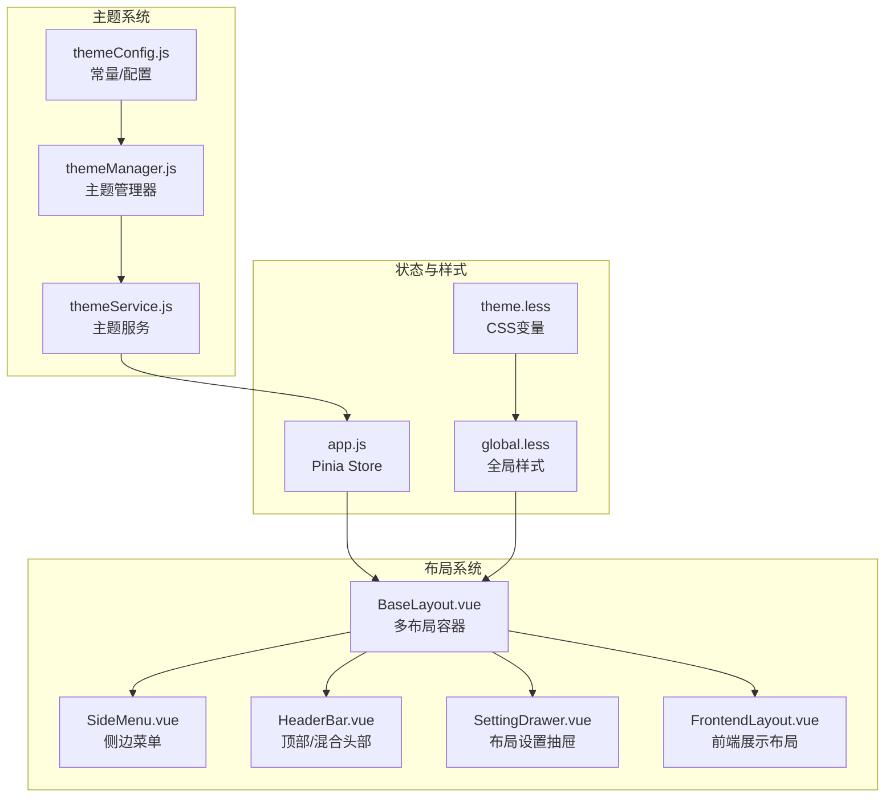
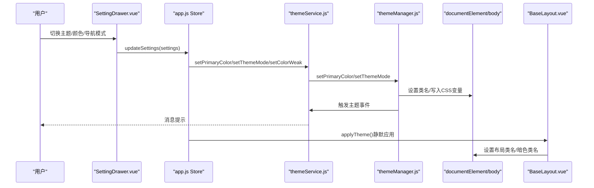
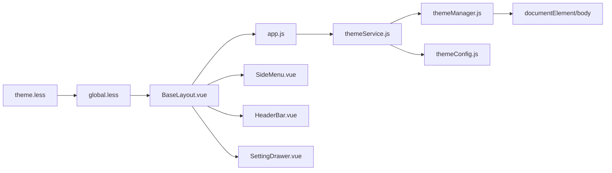

# 主题和布局

<cite>
**本文引用的文件**
- [themeService.js](file://bear-jia-vue3/src/utils/theme/themeService.js)
- [themeManager.js](file://bear-jia-vue3/src/utils/theme/themeManager.js)
- [themeConfig.js](file://bear-jia-vue3/src/utils/theme/themeConfig.js)
- [BaseLayout.vue](file://bear-jia-vue3/src/layout/BaseLayout.vue)
- [FrontendLayout.vue](file://bear-jia-vue3/src/layout/FrontendLayout.vue)
- [SideMenu.vue](file://bear-jia-vue3/src/components/layout/SideMenu.vue)
- [HeaderBar.vue](file://bear-jia-vue3/src/components/layout/HeaderBar.vue)
- [SettingDrawer.vue](file://bear-jia-vue3/src/components/layout/SettingDrawer.vue)
- [app.js](file://bear-jia-vue3/src/stores/app.js)
- [theme.less](file://bear-jia-vue3/src/style/theme.less)
- [global.less](file://bear-jia-vue3/src/style/global.less)
- [README.md（样式系统）](file://bear-jia-vue3/src/style/README.md)
</cite>

## 目录
1. [简介](#简介)
2. [项目结构](#项目结构)
3. [核心组件](#核心组件)
4. [架构总览](#架构总览)
5. [详细组件分析](#详细组件分析)
6. [依赖关系分析](#依赖关系分析)
7. [性能考量](#性能考量)
8. [故障排查指南](#故障排查指南)
9. [结论](#结论)
10. [附录](#附录)

## 简介
本文件系统性梳理 BearJia Admin 的主题与布局体系，涵盖：
- 主题管理机制：主题切换、颜色配置、样式变量组织与应用
- 主题服务：ThemeService 的职责、初始化流程、事件与持久化
- 布局系统：BaseLayout 的多布局模式（侧边、顶部、混合、分栏、抽屉）
- CSS 变量规范：如何通过 CSS 自定义属性实现主题切换
- 响应式策略与 API 文档：主题相关函数的参数与返回说明

## 项目结构
主题与布局相关的关键目录与文件：
- utils/theme：主题配置、主题管理器、主题服务
- layout：页面布局容器 BaseLayout、前端展示布局 FrontendLayout
- components/layout：侧边菜单、顶部菜单、头部栏、设置抽屉
- stores：Pinia Store，负责布局设置与主题应用
- style：主题变量、全局样式、布局模式样式

图表来源
- [themeService.js](file://bear-jia-vue3/src/utils/theme/themeService.js#L1-L558)
- [themeManager.js](file://bear-jia-vue3/src/utils/theme/themeManager.js#L1-L372)
- [themeConfig.js](file://bear-jia-vue3/src/utils/theme/themeConfig.js#L1-L234)
- [BaseLayout.vue](file://bear-jia-vue3/src/layout/BaseLayout.vue#L1-L260)
- [SideMenu.vue](file://bear-jia-vue3/src/components/layout/SideMenu.vue#L1-L120)
- [HeaderBar.vue](file://bear-jia-vue3/src/components/layout/HeaderBar.vue#L1-L120)
- [SettingDrawer.vue](file://bear-jia-vue3/src/components/layout/SettingDrawer.vue#L1-L120)
- [FrontendLayout.vue](file://bear-jia-vue3/src/layout/FrontendLayout.vue#L1-L120)
- [app.js](file://bear-jia-vue3/src/stores/app.js#L1-L180)
- [theme.less](file://bear-jia-vue3/src/style/theme.less#L1-L148)
- [global.less](file://bear-jia-vue3/src/style/global.less#L1-L120)

章节来源
- [themeService.js](file://bear-jia-vue3/src/utils/theme/themeService.js#L1-L120)
- [themeManager.js](file://bear-jia-vue3/src/utils/theme/themeManager.js#L1-L120)
- [themeConfig.js](file://bear-jia-vue3/src/utils/theme/themeConfig.js#L1-L120)
- [BaseLayout.vue](file://bear-jia-vue3/src/layout/BaseLayout.vue#L1-L120)
- [app.js](file://bear-jia-vue3/src/stores/app.js#L1-L120)
- [theme.less](file://bear-jia-vue3/src/style/theme.less#L1-L80)
- [global.less](file://bear-jia-vue3/src/style/global.less#L1-L80)

## 核心组件
- 主题配置：集中定义主题模式、布局模式、颜色预设、CSS 变量映射、事件与存储键名
- 主题管理器：负责主题色与模式的响应式状态、颜色变体生成、DOM 类名与 CSS 变量应用
- 主题服务：封装主题切换、事件派发、消息提示、导入导出、系统主题监听等高级能力
- Pinia Store：持久化布局设置，桥接主题服务与布局组件
- 布局容器：BaseLayout 根据 navMode 渲染侧边/顶部/混合/分栏/抽屉五种布局
- 布局组件：侧边菜单、顶部菜单、头部栏、设置抽屉
- 样式系统：theme.less 定义 CSS 变量；global.less 统一覆盖第三方组件样式

章节来源
- [themeConfig.js](file://bear-jia-vue3/src/utils/theme/themeConfig.js#L1-L234)
- [themeManager.js](file://bear-jia-vue3/src/utils/theme/themeManager.js#L1-L200)
- [themeService.js](file://bear-jia-vue3/src/utils/theme/themeService.js#L1-L200)
- [app.js](file://bear-jia-vue3/src/stores/app.js#L1-L120)
- [BaseLayout.vue](file://bear-jia-vue3/src/layout/BaseLayout.vue#L1-L120)
- [theme.less](file://bear-jia-vue3/src/style/theme.less#L1-L120)
- [global.less](file://bear-jia-vue3/src/style/global.less#L1-L120)

## 架构总览
主题与布局的运行时交互流程如下：

图表来源
- [SettingDrawer.vue](file://bear-jia-vue3/src/components/layout/SettingDrawer.vue#L520-L620)
- [app.js](file://bear-jia-vue3/src/stores/app.js#L66-L118)
- [themeService.js](file://bear-jia-vue3/src/utils/theme/themeService.js#L188-L243)
- [themeManager.js](file://bear-jia-vue3/src/utils/theme/themeManager.js#L103-L171)
- [BaseLayout.vue](file://bear-jia-vue3/src/layout/BaseLayout.vue#L758-L776)

## 详细组件分析

### 主题服务 ThemeService
- 职责
  - 初始化主题系统，加载用户偏好并应用
  - 主题模式切换（亮/暗）、主题色切换、色弱模式开关
  - 预设颜色与自定义颜色管理、颜色变体生成
  - 导入导出主题配置、系统主题监听、事件派发与消息提示
- 关键方法
  - init(options)：初始化并可选跟随系统主题
  - setThemeMode(mode, silent?)：切换主题模式
  - setPrimaryColor(color, silent?)：设置主题色
  - setColorWeak(enabled, silent?)：色弱模式
  - exportThemeConfig()/importThemeConfig()/downloadThemeConfig()/importThemeFromFile()
  - onEvent(eventName, callback)/emitEvent(eventName, detail)
  - getCurrentTheme()/isDarkMode()/isLightMode()
  - generateCSSVariables(color)/applyCSSVariables(vars)
- 数据持久化
  - 通过 themeManager 与 localStorage 同步主题配置
  - 兼容旧版键名，保证升级迁移

章节来源
- [themeService.js](file://bear-jia-vue3/src/utils/theme/themeService.js#L1-L558)

### 主题管理器 ThemeManager
- 职责
  - 维护主题配置的响应式状态（模式、主题色、预设与自定义颜色）
  - 应用主题到 DOM：类名与 CSS 变量
  - 生成颜色变体（hover/active/透明度）
  - 主题事件派发与监听
- 关键方法
  - setThemeMode(mode)/setPrimaryColor(color)
  - addCustomColor/removeCustomColor/getAllColors/resetTheme/importTheme/exportTheme
  - applyTheme()/applyPrimaryColor()/generateColorVariants()
  - onThemeChange(callback)/emitThemeChange()

章节来源
- [themeManager.js](file://bear-jia-vue3/src/utils/theme/themeManager.js#L1-L372)

### 主题配置 themeConfig
- 定义
  - 预设颜色、主题模式、布局模式、内容宽度模式
  - 默认主题配置、存储键名、CSS 变量映射、主题类名、事件名
  - 颜色工具：校验、转换、亮度调整、对比色、渐变生成
- 作用
  - 为 ThemeService/ThemeManager 提供统一常量与默认值
  - 为样式系统提供变量名与类名约定

章节来源
- [themeConfig.js](file://bear-jia-vue3/src/utils/theme/themeConfig.js#L1-L234)

### 布局容器 BaseLayout
- 多布局模式
  - 侧边栏模式（默认）：SideMenu + HeaderBar + 内容区
  - 顶部菜单模式：HeaderBar（顶部菜单）+ 内容区
  - 混合模式：HeaderBar（顶部菜单）+ MixSideMenu + 内容区
  - 分栏模式：左右两列菜单 + HeaderBar + 内容区
  - 抽屉模式：HeaderBar + 内容区 + 自定义抽屉菜单
- 关键点
  - 通过 layoutSettings.navMode 切换布局
  - 通过 layoutClasses 动态绑定布局类名与暗色/色弱类
  - 主题变量通过 themeVars 计算，最终由 appStore.applyTheme() 统一应用
  - 抽屉模式下修复背景色以适配暗色主题

章节来源
- [BaseLayout.vue](file://bear-jia-vue3/src/layout/BaseLayout.vue#L1-L260)
- [BaseLayout.vue](file://bear-jia-vue3/src/layout/BaseLayout.vue#L377-L390)
- [BaseLayout.vue](file://bear-jia-vue3/src/layout/BaseLayout.vue#L508-L535)

### 侧边菜单 SideMenu
- 功能
  - 渲染工作台与后端扁平化菜单树
  - 支持外链菜单（新窗口打开）
  - 三级菜单处理与激活状态同步
- 样式
  - 使用 CSS 变量控制背景与文字颜色
  - 暗色主题下覆盖 Ant Design 默认背景

章节来源
- [SideMenu.vue](file://bear-jia-vue3/src/components/layout/SideMenu.vue#L1-L120)
- [SideMenu.vue](file://bear-jia-vue3/src/components/layout/SideMenu.vue#L308-L386)

### 顶部/混合头部 HeaderBar
- 功能
  - 根据布局模式显示折叠按钮、Logo、面包屑或顶部菜单
  - 提供搜索、消息、聊天、全屏、刷新、设置、用户下拉等能力
- 交互
  - 与 SettingDrawer 通信，触发布局设置更新
  - 与菜单组件通信，传递菜单选择事件

章节来源
- [HeaderBar.vue](file://bear-jia-vue3/src/components/layout/HeaderBar.vue#L1-L120)
- [HeaderBar.vue](file://bear-jia-vue3/src/components/layout/HeaderBar.vue#L267-L277)

### 设置抽屉 SettingDrawer
- 功能
  - 主题模式切换（亮/暗）
  - 主题色选择（预设颜色）
  - 导航模式切换（side/top/mix/column/drawer）
  - 布局设置（内容宽度、固定 Header/Sidebar、隐藏 Footer、多页签等）
  - 系统配置（标题、版权、版本等）
  - 表格通用样式设置
  - 配置导出/导入/重置
- 与主题服务集成
  - 使用 useThemeComposition 获取预设颜色与主题操作
  - 调用 themeService 进行主题切换与重置

章节来源
- [SettingDrawer.vue](file://bear-jia-vue3/src/components/layout/SettingDrawer.vue#L1-L120)
- [SettingDrawer.vue](file://bear-jia-vue3/src/components/layout/SettingDrawer.vue#L490-L566)
- [SettingDrawer.vue](file://bear-jia-vue3/src/components/layout/SettingDrawer.vue#L713-L783)

### 前端展示布局 FrontendLayout
- 功能
  - 顶部导航、移动端菜单、回到顶部
  - 主题切换（通过 appStore.updateSettings)
  - 响应式设计与暗色主题样式覆盖
- 与主题系统的关系
  - 通过 appStore.layoutSettings.darkMode 控制暗色类名
  - 使用 CSS 变量统一主题色

章节来源
- [FrontendLayout.vue](file://bear-jia-vue3/src/layout/FrontendLayout.vue#L1-L120)
- [FrontendLayout.vue](file://bear-jia-vue3/src/layout/FrontendLayout.vue#L147-L237)

### 样式系统与 CSS 变量
- theme.less
  - 定义 CSS 变量：主题色、背景色层次、文字色、边框色、菜单与按钮色
  - 暗色主题变量覆盖与过渡动画
  - 色弱模式滤镜
- global.less
  - 全局覆盖第三方组件样式，确保统一使用 CSS 变量
  - 暗色主题下组件背景、边框、文本颜色的统一适配
  - 滚动条美化与布局容器背景覆盖

章节来源
- [theme.less](file://bear-jia-vue3/src/style/theme.less#L1-L148)
- [global.less](file://bear-jia-vue3/src/style/global.less#L1-L120)
- [README.md（样式系统）](file://bear-jia-vue3/src/style/README.md#L1-L120)

## 依赖关系分析

图表来源
- [themeService.js](file://bear-jia-vue3/src/utils/theme/themeService.js#L1-L120)
- [themeManager.js](file://bear-jia-vue3/src/utils/theme/themeManager.js#L1-L120)
- [themeConfig.js](file://bear-jia-vue3/src/utils/theme/themeConfig.js#L1-L120)
- [app.js](file://bear-jia-vue3/src/stores/app.js#L1-L120)
- [BaseLayout.vue](file://bear-jia-vue3/src/layout/BaseLayout.vue#L1-L120)
- [SideMenu.vue](file://bear-jia-vue3/src/components/layout/SideMenu.vue#L1-L120)
- [HeaderBar.vue](file://bear-jia-vue3/src/components/layout/HeaderBar.vue#L1-L120)
- [SettingDrawer.vue](file://bear-jia-vue3/src/components/layout/SettingDrawer.vue#L1-L120)
- [theme.less](file://bear-jia-vue3/src/style/theme.less#L1-L80)
- [global.less](file://bear-jia-vue3/src/style/global.less#L1-L80)

章节来源
- [themeService.js](file://bear-jia-vue3/src/utils/theme/themeService.js#L1-L120)
- [themeManager.js](file://bear-jia-vue3/src/utils/theme/themeManager.js#L1-L120)
- [app.js](file://bear-jia-vue3/src/stores/app.js#L1-L120)
- [BaseLayout.vue](file://bear-jia-vue3/src/layout/BaseLayout.vue#L1-L120)

## 性能考量
- 主题切换
  - 使用 CSS 变量与类名切换，避免频繁重排重绘
  - 颜色变体通过 color-mix 计算，减少 JS 循环
- 布局切换
  - 通过 computed 计算布局类名，减少 DOM 操作
  - 抽屉模式背景修复采用 nextTick，避免闪烁
- 样式覆盖
  - 通过全局样式统一覆盖第三方组件，减少局部样式冲突
  - 暗色主题样式集中在 :root 与 .dark-theme，便于维护

[本节为通用指导，无需列出具体文件来源]

## 故障排查指南
- 主题切换无效
  - 检查 appStore.updateSettings 是否正确调用 themeService.setPrimaryColor/setThemeMode
  - 确认 BaseLayout.applyTheme() 是否被调用
- 背景色异常（抽屉模式）
  - 检查 BaseLayout 的 fixDrawerLayoutStyles 是否执行
- 颜色不生效
  - 确认 CSS 变量是否在 :root 或 .dark-theme 中定义
  - 检查 global.less 是否正确覆盖第三方组件背景
- 颜色变体不一致
  - 检查 themeManager.generateColorVariants 与 themeService.generateCSSVariables 的计算逻辑
- 预设颜色不可用
  - 检查 SettingDrawer 的 colorList 与 useThemeComposition 的 presetColors

章节来源
- [app.js](file://bear-jia-vue3/src/stores/app.js#L66-L118)
- [BaseLayout.vue](file://bear-jia-vue3/src/layout/BaseLayout.vue#L508-L535)
- [theme.less](file://bear-jia-vue3/src/style/theme.less#L1-L148)
- [global.less](file://bear-jia-vue3/src/style/global.less#L1-L120)
- [SettingDrawer.vue](file://bear-jia-vue3/src/components/layout/SettingDrawer.vue#L490-L566)

## 结论
该主题与布局系统以 CSS 变量为核心，结合主题服务与 Pinia Store 实现了灵活的主题切换与多布局模式。通过统一的配置与样式规范，确保了跨组件的一致性与可维护性。建议在新增主题方案时，遵循 CSS 变量命名与类名约定，并在 SettingDrawer 中补充预设颜色与布局选项。

[本节为总结性内容，无需列出具体文件来源]

## 附录

### API 文档（主题相关）

- 主题服务 ThemeService
  - init(options)
    - 参数：options.followSystem: boolean
    - 返回：Promise<void>
  - setThemeMode(mode, silent?)
    - 参数：mode: 'light'|'dark'，silent?: boolean
    - 返回：void
  - setPrimaryColor(color, silent?)
    - 参数：color: string（十六进制），silent?: boolean
    - 返回：void
  - setColorWeak(enabled, silent?)
    - 参数：enabled: boolean，silent?: boolean
    - 返回：void
  - exportThemeConfig()
    - 返回：object（含导出时间与版本）
  - importThemeConfig(config)
    - 参数：config: object
    - 返回：void
  - downloadThemeConfig()
    - 返回：void
  - importThemeFromFile(file)
    - 参数：file: File
    - 返回：Promise<object>
  - onEvent(eventName, callback)
    - 返回：取消监听函数
  - getCurrentTheme()
    - 返回：{ mode, primaryColor, isDark, isLight }
  - generateCSSVariables(color)
    - 返回：CSS 变量对象
  - applyCSSVariables(variables)
    - 返回：void

- 主题管理器 ThemeManager
  - setThemeMode(mode)
  - setPrimaryColor(color)
  - addCustomColor(color, name)
  - removeCustomColor(color)
  - getAllColors()
  - resetTheme()
  - exportTheme()
  - importTheme(themeConfig)
  - onThemeChange(callback)
  - emitThemeChange()

- Pinia Store app.js
  - updateSettings(settings)
  - applyTheme()
  - resetSettings()
  - exportSettings()
  - importSettings(config)

章节来源
- [themeService.js](file://bear-jia-vue3/src/utils/theme/themeService.js#L188-L558)
- [themeManager.js](file://bear-jia-vue3/src/utils/theme/themeManager.js#L188-L372)
- [app.js](file://bear-jia-vue3/src/stores/app.js#L66-L178)

### 主题配置文件结构说明
- 主题模式：'light'|'dark'
- 布局模式：'side'|'top'|'mix'|'column'|'drawer'
- 内容宽度：'fluid'|'fixed'
- 默认主题配置字段：mode、primaryColor、layout、colorWeak、transition、compact
- 存储键名：theme-config、theme-mode、theme-color、theme-layout、旧版键名兼容
- CSS 变量映射：主题色、背景色、文字色、边框色、Ant Design 兼容变量
- 主题类名：dark-theme、light-theme、color-weak、theme-transition、compact-mode
- 事件名：themeChange、themeModeChange、themeColorChange、themeLayoutChange

章节来源
- [themeConfig.js](file://bear-jia-vue3/src/utils/theme/themeConfig.js#L1-L234)

### CSS 变量使用规范
- 优先使用 CSS 变量，避免硬编码颜色值
- 遵循背景色层次：页面主背景 -> 组件背景 -> 侧边栏背景
- 文字色与边框色统一使用变量，保持一致性
- 暗色主题通过 .dark-theme 覆盖变量，确保组件背景与文本颜色一致
- 色弱模式通过 filter 实现，注意对图片与图标的处理

章节来源
- [theme.less](file://bear-jia-vue3/src/style/theme.less#L1-L148)
- [global.less](file://bear-jia-vue3/src/style/global.less#L1-L120)
- [README.md（样式系统）](file://bear-jia-vue3/src/style/README.md#L1-L120)

### 响应式设计策略
- 布局容器使用 CSS 变量统一背景，避免白块残留
- 暗色主题下滚动条颜色与 hover 状态适配
- 移动端菜单在 FrontendLayout 中通过媒体查询控制显示
- 抽屉模式下修复背景色，确保内容区域与容器背景一致

章节来源
- [BaseLayout.vue](file://bear-jia-vue3/src/layout/BaseLayout.vue#L508-L535)
- [FrontendLayout.vue](file://bear-jia-vue3/src/layout/FrontendLayout.vue#L1-L120)
- [global.less](file://bear-jia-vue3/src/style/global.less#L431-L466)