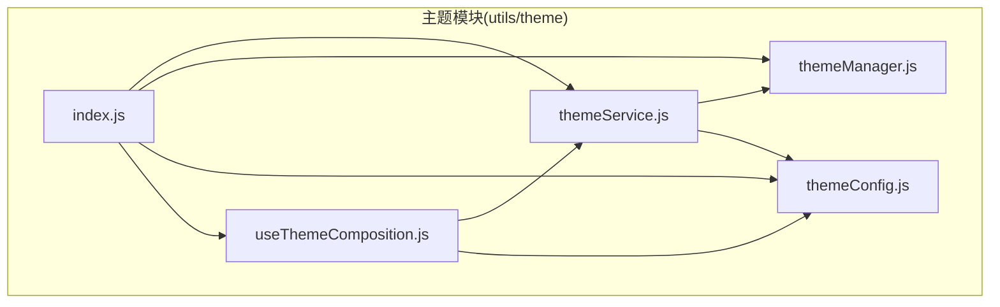
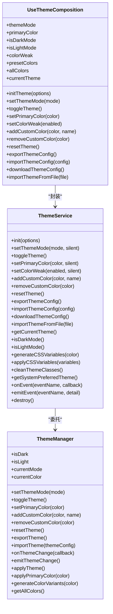
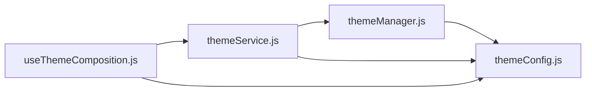

# API接口

<cite>
**本文引用的文件**
- [themeService.js](file://bear-jia-vue3/src/utils/theme/themeService.js)
- [useThemeComposition.js](file://bear-jia-vue3/src/utils/theme/composables/useThemeComposition.js)
- [themeManager.js](file://bear-jia-vue3/src/utils/theme/themeManager.js)
- [themeConfig.js](file://bear-jia-vue3/src/utils/theme/themeConfig.js)
- [index.js](file://bear-jia-vue3/src/utils/theme/index.js)
- [SettingDrawer.vue](file://bear-jia-vue3/src/components/layout/SettingDrawer.vue)
- [BaseLayout.vue](file://bear-jia-vue3/src/layout/BaseLayout.vue)
</cite>

## 目录
1. [简介](#简介)
2. [项目结构](#项目结构)
3. [核心组件](#核心组件)
4. [架构总览](#架构总览)
5. [详细组件分析](#详细组件分析)
6. [依赖关系分析](#依赖关系分析)
7. [性能考量](#性能考量)
8. [故障排查指南](#故障排查指南)
9. [结论](#结论)
10. [附录](#附录)

## 简介
本文件面向主题系统API接口，系统性梳理主题服务与组合式函数的能力边界、参数与返回值、副作用与事件机制，并提供在组件中的使用示例与错误处理建议。重点覆盖以下能力：
- 主题服务对外暴露的方法：init、setThemeMode、toggleTheme、setPrimaryColor、setColorWeak、addCustomColor、removeCustomColor、resetTheme、exportThemeConfig、importThemeConfig、downloadThemeConfig、importThemeFromFile、getCurrentTheme、isDarkMode、isLightMode、generateCSSVariables、applyCSSVariables、cleanThemeClasses、getSystemPreferredTheme、destroy、onEvent、emitEvent。
- 组合式函数 useThemeComposition 提供的响应式状态与操作方法：themeMode、primaryColor、isDarkMode、isLightMode、colorWeak、presetColors、allColors、currentTheme、initTheme、setThemeMode、toggleTheme、setPrimaryColor、setColorWeak、addCustomColor、removeCustomColor、resetTheme、exportThemeConfig、importThemeConfig、downloadThemeConfig、importThemeFromFile。
- 事件系统：onEvent、emitEvent；以及主题管理器内部的 onThemeChange 事件。
- 在组件中的使用示例：SettingDrawer.vue 中对主题色与主题模式的交互；BaseLayout.vue 中对主题类名与 CSS 变量的应用。
- 错误处理与非法参数行为：参数校验、异常捕获、消息提示与降级策略。

## 项目结构
主题系统位于 utils/theme 目录，采用“服务层 + 管理器 + 组合式API + 配置”的分层设计：
- themeService.js：主题服务，负责初始化、持久化、事件派发、主题切换、色弱模式、导出导入等。
- themeManager.js：主题管理器，负责响应式主题状态、主题类名与 CSS 变量应用、事件触发。
- useThemeComposition.js：Vue 组合式 API，封装响应式状态与主题操作，便于在组件中直接使用。
- themeConfig.js：主题常量、事件、存储键、CSS 变量映射、颜色工具等。
- index.js：主题模块入口，统一导出主题服务、管理器、配置与组合式 API。

图表来源
- [themeService.js](file://bear-jia-vue3/src/utils/theme/themeService.js#L1-L558)
- [themeManager.js](file://bear-jia-vue3/src/utils/theme/themeManager.js#L1-L372)
- [useThemeComposition.js](file://bear-jia-vue3/src/utils/theme/composables/useThemeComposition.js#L1-L280)
- [themeConfig.js](file://bear-jia-vue3/src/utils/theme/themeConfig.js#L1-L234)
- [index.js](file://bear-jia-vue3/src/utils/theme/index.js#L1-L34)

章节来源
- [index.js](file://bear-jia-vue3/src/utils/theme/index.js#L1-L34)

## 核心组件
本节聚焦主题服务与组合式函数的公共接口，逐项说明参数、取值范围、返回值与副作用。

- 主题服务 themeService
  - init(options): 初始化主题服务，加载用户偏好、应用初始主题、可选监听系统主题变化。options 可包含 followSystem 布尔值。无返回值；副作用：读取 localStorage、应用主题类名与 CSS 变量、绑定系统主题监听。
  - setThemeMode(mode, silent=false): 设置主题模式（light/dark）。silent 控制是否显示消息提示。无返回值；副作用：保存偏好、触发模式变更事件、消息提示。
  - toggleTheme(): 切换主题模式（亮/暗）。无返回值；副作用：调用 setThemeMode。
  - setPrimaryColor(color, silent=false): 设置主题色（HEX 校验）。silent 控制是否显示消息提示。无返回值；副作用：保存偏好、触发颜色变更事件、消息提示。
  - setColorWeak(enabled, silent=false): 设置色弱模式（添加/移除 color-weak 类）。silent 控制是否显示消息提示。无返回值；副作用：写入 localStorage、消息提示。
  - addCustomColor(color, name): 添加自定义颜色（HEX 校验）。无返回值；副作用：保存偏好、消息提示。
  - removeCustomColor(color): 删除自定义颜色。无返回值；副作用：保存偏好、消息提示。
  - resetTheme(): 重置为主题默认值。无返回值；副作用：保存偏好、消息提示。
  - exportThemeConfig(): 导出主题配置对象（含导出时间与版本）。返回配置对象。
  - importThemeConfig(config): 导入主题配置对象。无返回值；副作用：保存偏好、消息提示。
  - downloadThemeConfig(): 下载主题配置为 JSON 文件。无返回值；副作用：创建 Blob、触发下载、消息提示。
  - importThemeFromFile(file): 从文件导入主题配置。返回 Promise；成功解析并导入后消息提示，失败抛出错误。
  - getCurrentTheme(): 返回当前主题信息（mode、primaryColor、isDark、isLight）。返回对象。
  - isDarkMode()/isLightMode(): 返回布尔值，判断当前主题模式。
  - generateCSSVariables(color): 生成一组 CSS 变量（主色、hover、active、透明度变体）。返回变量对象。
  - applyCSSVariables(variables): 批量应用 CSS 变量到 :root。无返回值；副作用：设置 documentElement.style。
  - cleanThemeClasses(): 清理主题相关类名。无返回值；副作用：移除 root 与 body 上的主题类。
  - getSystemPreferredTheme(): 获取系统偏好主题（light/dark 或 null）。返回字符串或 null。
  - onEvent(eventName, callback)/emitEvent(eventName, detail): 事件监听与派发（基于 window.CustomEvent）。返回取消监听函数；副作用：window.addEventListener/removeEventListener。
  - destroy(): 销毁主题服务，清理定时器与事件监听。无返回值；副作用：清理资源、重置初始化标志。

- 组合式函数 useThemeComposition
  - 响应式状态：themeMode、primaryColor、isDarkMode、isLightMode、colorWeak、presetColors（只读）、allColors（只读）、currentTheme（只读）。
  - 方法：initTheme(options)、setThemeMode(mode)、toggleTheme()、setPrimaryColor(color)、setColorWeak(enabled)、addCustomColor(color, name)、removeCustomColor(color)、resetTheme()、exportThemeConfig()、importThemeConfig(config)、downloadThemeConfig()、importThemeFromFile(file)。
  - 事件监听：组件挂载时自动监听 themeChange、themeModeChange、themeColorChange 事件并更新响应式状态；组件卸载时自动清理。

章节来源
- [themeService.js](file://bear-jia-vue3/src/utils/theme/themeService.js#L1-L558)
- [useThemeComposition.js](file://bear-jia-vue3/src/utils/theme/composables/useThemeComposition.js#L1-L280)

## 架构总览
主题系统采用“服务层 + 管理器 + 组合式API + 配置”的分层架构：
- 服务层（themeService）：聚合主题管理器与配置，负责持久化、事件派发、导出导入、系统主题监听、消息提示等。
- 管理器（themeManager）：维护响应式主题配置，应用主题类名与 CSS 变量，触发主题变更事件。
- 组合式 API（useThemeComposition）：在组件中提供响应式状态与主题操作方法，自动监听主题事件并更新状态。
- 配置（themeConfig）：集中定义主题常量、事件、存储键、CSS 变量映射与颜色工具。

图表来源
- [themeService.js](file://bear-jia-vue3/src/utils/theme/themeService.js#L1-L558)
- [themeManager.js](file://bear-jia-vue3/src/utils/theme/themeManager.js#L1-L372)
- [useThemeComposition.js](file://bear-jia-vue3/src/utils/theme/composables/useThemeComposition.js#L1-L280)

## 详细组件分析

### 主题服务 themeService 接口详解
- 参数与取值范围
  - mode：必须为 THEME_MODES 中的枚举值（light/dark）。
  - color：必须为合法 HEX 颜色值（/^#[0-9A-F]{6}$/i）。
  - enabled：布尔值，控制色弱模式开关。
  - silent：布尔值，控制是否显示消息提示。
  - options：init 的可选参数，包含 followSystem（布尔）。
  - file：File 对象，用于导入主题配置文件。
- 返回值
  - exportThemeConfig：返回主题配置对象。
  - getCurrentTheme：返回包含 mode、primaryColor、isDark、isLight 的对象。
  - isDarkMode/isLightMode：返回布尔值。
  - importThemeFromFile：返回 Promise，成功解析并导入后 resolve，失败 reject。
- 副作用
  - setThemeMode/setPrimaryColor：保存偏好到 localStorage、触发主题事件、消息提示。
  - setColorWeak：添加/移除 documentElement 上的 color-weak 类、保存到 localStorage。
  - export/download/import：与 localStorage、Blob、FileReader、window 下载交互。
  - onEvent/emitEvent：基于 window.CustomEvent 的事件监听与派发。
  - init：加载用户偏好、应用主题、绑定系统主题监听。
- 错误处理
  - 非法参数：对无效 mode/color 输出警告并提前返回。
  - 导入失败：importThemeConfig 捕获异常并提示错误。
  - FileReader 异常：importThemeFromFile onerror 时 reject。
  - 系统主题监听：matchMedia 不可用时直接返回。

章节来源
- [themeService.js](file://bear-jia-vue3/src/utils/theme/themeService.js#L1-L558)
- [themeConfig.js](file://bear-jia-vue3/src/utils/theme/themeConfig.js#L1-L234)

### 组合式函数 useThemeComposition
- 响应式状态
  - themeMode：当前主题模式（light/dark）。
  - primaryColor：当前主题色（HEX）。
  - isDarkMode/isLightMode：当前主题模式的布尔判断。
  - colorWeak：色弱模式开关。
  - presetColors/allColors：预设颜色与全部颜色列表（预设+自定义）。
  - currentTheme：当前主题信息快照。
- 方法
  - initTheme(options)：初始化主题服务并更新响应式状态。
  - setThemeMode(mode)/toggleTheme()/setPrimaryColor(color)/setColorWeak(enabled)：调用主题服务并更新响应式状态。
  - addCustomColor/removeCustomColor/resetTheme/export/import/download/importFromFile：封装主题服务对应方法。
- 事件监听
  - 组件挂载时订阅 themeChange、themeModeChange、themeColorChange 事件，自动更新响应式状态；组件卸载时取消订阅。

章节来源
- [useThemeComposition.js](file://bear-jia-vue3/src/utils/theme/composables/useThemeComposition.js#L1-L280)

### 事件系统 API
- 主题服务事件
  - onEvent(eventName, callback)：监听主题事件（如 THEME_EVENTS.CHANGE、MODE_CHANGE、COLOR_CHANGE），返回取消监听函数。
  - emitEvent(eventName, detail)：派发主题事件。
- 主题管理器事件
  - onThemeChange(callback)：监听主题变更事件（themeChange），返回取消监听函数。
  - emitThemeChange()：触发主题变更事件。
- 使用场景
  - 组件通过 useThemeComposition 自动监听主题事件并更新 UI。
  - 开发者可通过 onEvent 自定义扩展主题事件处理逻辑。

章节来源
- [themeService.js](file://bear-jia-vue3/src/utils/theme/themeService.js#L391-L411)
- [themeManager.js](file://bear-jia-vue3/src/utils/theme/themeManager.js#L287-L309)
- [themeConfig.js](file://bear-jia-vue3/src/utils/theme/themeConfig.js#L117-L123)

### 在组件中的使用示例
- SettingDrawer.vue
  - 使用 useThemeComposition 获取 presetColors、setThemeMode、setPrimaryColor、setColorWeak、resetTheme。
  - 示例路径：
    - [useThemeComposition 引入与解构](file://bear-jia-vue3/src/components/layout/SettingDrawer.vue#L375-L497)
    - [主题模式切换处理](file://bear-jia-vue3/src/components/layout/SettingDrawer.vue#L519-L535)
    - [主题色切换处理](file://bear-jia-vue3/src/components/layout/SettingDrawer.vue#L537-L552)
    - [重置主题处理](file://bear-jia-vue3/src/components/layout/SettingDrawer.vue#L785-L800)
- BaseLayout.vue
  - 通过布局类名与 CSS 变量应用主题：dark-theme、color-weak、var(--bg-color)、var(--component-background)、var(--text-primary)、var(--text-secondary)、var(--primary-color) 等。
  - 示例路径：
    - [布局类名计算（含 dark-theme、color-weak）](file://bear-jia-vue3/src/layout/BaseLayout.vue#L377-L390)
    - [CSS 变量应用（var(--bg-color)、var(--component-background) 等）](file://bear-jia-vue3/src/layout/BaseLayout.vue#L360-L372)
    - [初始化时应用主题类名](file://bear-jia-vue3/src/layout/BaseLayout.vue#L768-L771)

章节来源
- [SettingDrawer.vue](file://bear-jia-vue3/src/components/layout/SettingDrawer.vue#L375-L800)
- [BaseLayout.vue](file://bear-jia-vue3/src/layout/BaseLayout.vue#L358-L390)

## 依赖关系分析
- 主题服务依赖主题管理器与主题配置，负责持久化、事件派发与导出导入。
- 组合式函数依赖主题服务，提供响应式状态与事件监听。
- 主题管理器依赖 Vue 响应式系统，负责应用主题类名与 CSS 变量。
- 主题配置集中定义常量、事件、存储键与颜色工具。

图表来源
- [themeService.js](file://bear-jia-vue3/src/utils/theme/themeService.js#L1-L558)
- [themeManager.js](file://bear-jia-vue3/src/utils/theme/themeManager.js#L1-L372)
- [useThemeComposition.js](file://bear-jia-vue3/src/utils/theme/composables/useThemeComposition.js#L1-L280)
- [themeConfig.js](file://bear-jia-vue3/src/utils/theme/themeConfig.js#L1-L234)

章节来源
- [themeService.js](file://bear-jia-vue3/src/utils/theme/themeService.js#L1-L558)
- [themeManager.js](file://bear-jia-vue3/src/utils/theme/themeManager.js#L1-L372)
- [useThemeComposition.js](file://bear-jia-vue3/src/utils/theme/composables/useThemeComposition.js#L1-L280)
- [themeConfig.js](file://bear-jia-vue3/src/utils/theme/themeConfig.js#L1-L234)

## 性能考量
- 防抖消息提示：主题服务对消息提示使用定时器与 lastMessage 去重，避免频繁提示带来的 UI 抖动。
- 响应式更新：useThemeComposition 通过 computed 与 watch 仅在必要时更新状态，减少不必要的渲染。
- CSS 变量批量应用：generateCSSVariables 与 applyCSSVariables 将颜色变体一次性生成与应用，降低多次 DOM 操作成本。
- 事件监听清理：组件卸载时自动取消主题事件监听，避免内存泄漏。

章节来源
- [themeService.js](file://bear-jia-vue3/src/utils/theme/themeService.js#L160-L185)
- [useThemeComposition.js](file://bear-jia-vue3/src/utils/theme/composables/useThemeComposition.js#L1-L280)

## 故障排查指南
- 非法参数
  - setThemeMode：传入非 light/dark 值会输出警告并提前返回。
  - setPrimaryColor：传入非 HEX 颜色会输出警告并提前返回。
  - addCustomColor：传入非 HEX 颜色会提示错误并提前返回。
- 导入失败
  - importThemeConfig：捕获异常并提示错误。
  - importThemeFromFile：reader.onerror 时 reject，调用方需处理 Promise。
- 系统主题监听
  - matchMedia 不可用时直接返回，不会抛错。
- 存储异常
  - localStorage 读写异常会被捕获并记录错误，不影响主线程运行。
- 组件使用问题
  - 若主题切换无效，检查组件是否正确调用 useThemeComposition 的方法并监听事件。
  - 若色弱模式不生效，检查 documentElement 是否包含 color-weak 类。

章节来源
- [themeService.js](file://bear-jia-vue3/src/utils/theme/themeService.js#L192-L209)
- [themeService.js](file://bear-jia-vue3/src/utils/theme/themeService.js#L225-L243)
- [themeService.js](file://bear-jia-vue3/src/utils/theme/themeService.js#L296-L304)
- [themeService.js](file://bear-jia-vue3/src/utils/theme/themeService.js#L341-L349)
- [themeService.js](file://bear-jia-vue3/src/utils/theme/themeService.js#L372-L389)
- [useThemeComposition.js](file://bear-jia-vue3/src/utils/theme/composables/useThemeComposition.js#L118-L139)

## 结论
主题系统通过服务层、管理器与组合式 API 的清晰分层，提供了完善的主题切换、持久化、事件派发与导出导入能力。开发者可在组件中通过 useThemeComposition 快速获得响应式状态与操作方法，并通过 onEvent 自定义扩展主题事件处理。系统内置参数校验、异常捕获与消息提示，确保在非法输入与异常情况下仍能稳定运行。

## 附录
- 常量与事件
  - 主题模式：THEME_MODES.light、THEME_MODES.dark
  - 主题事件：THEME_EVENTS.change、THEME_EVENTS.modeChange、THEME_EVENTS.colorChange、THEME_EVENTS.layoutChange
  - 存储键：THEME_STORAGE_KEYS.config、THEME_STORAGE_KEYS.darkMode、THEME_STORAGE_KEYS.primaryColor 等
  - CSS 变量映射：CSS_VARIABLES.primaryColor、CSS_VARIABLES.primaryColorHover、CSS_VARIABLES.primaryColorActive、CSS_VARIABLES.bgColor、CSS_VARIABLES.textPrimary 等
- 颜色工具
  - ColorUtils.isValidHex、hexToRgb、rgbToHex、adjustBrightness、getContrastColor、generateGradient

章节来源
- [themeConfig.js](file://bear-jia-vue3/src/utils/theme/themeConfig.js#L1-L234)