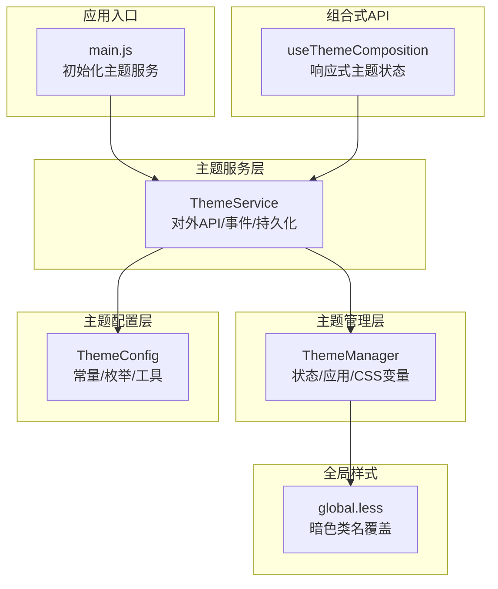
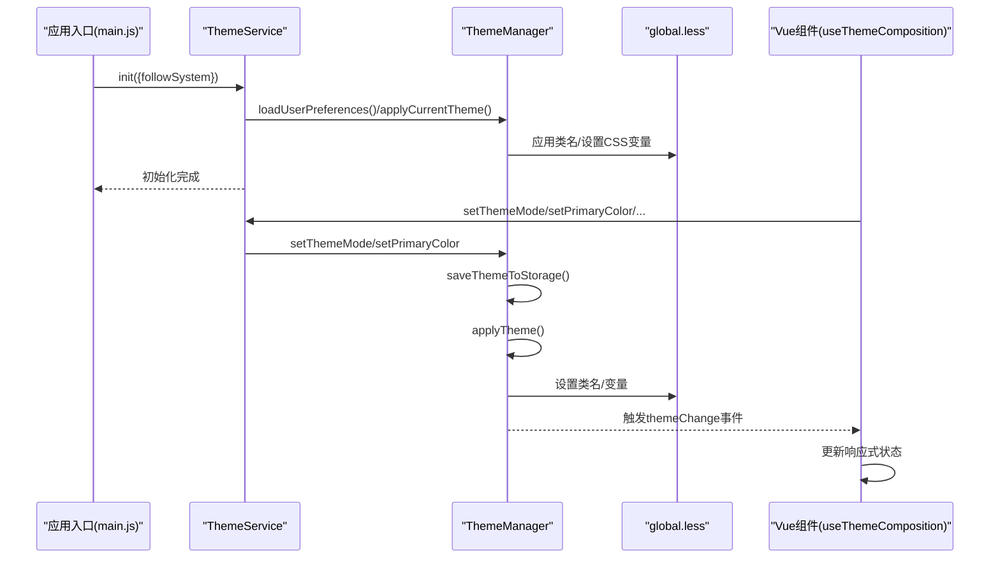
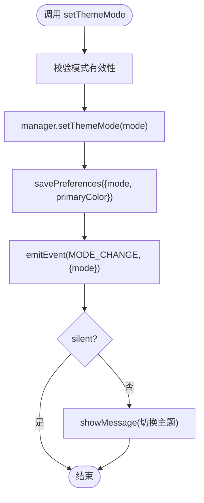
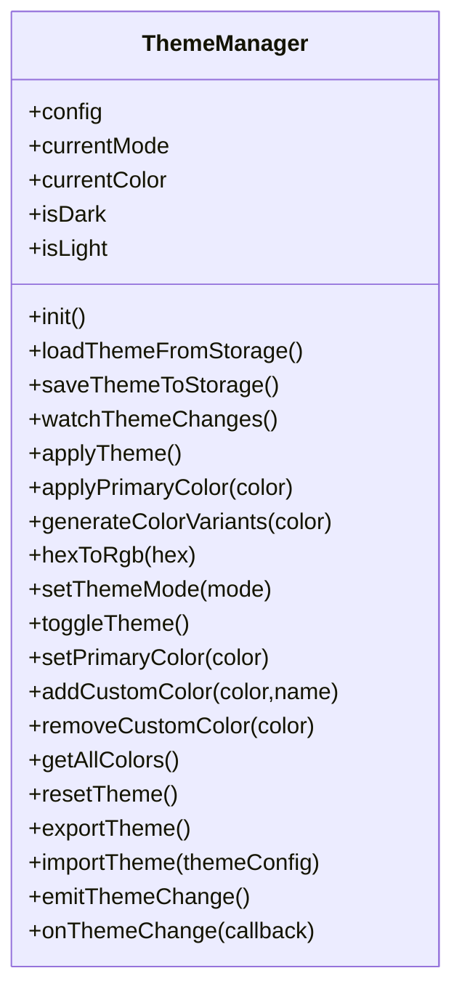
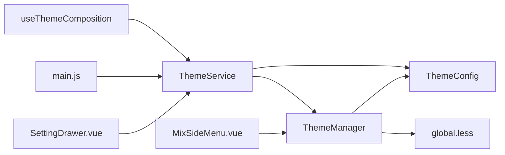

# 主题系统

<cite>
**本文引用的文件**
- [themeService.js](file://bear-jia-vue3/src/utils/theme/themeService.js)
- [themeManager.js](file://bear-jia-vue3/src/utils/theme/themeManager.js)
- [themeConfig.js](file://bear-jia-vue3/src/utils/theme/themeConfig.js)
- [index.js](file://bear-jia-vue3/src/utils/theme/index.js)
- [useThemeComposition.js](file://bear-jia-vue3/src/utils/theme/composables/useThemeComposition.js)
- [main.js](file://bear-jia-vue3/src/main.js)
- [global.less](file://bear-jia-vue3/src/style/global.less)
- [SettingDrawer.vue](file://bear-jia-vue3/src/components/layout/SettingDrawer.vue)
- [MixSideMenu.vue](file://bear-jia-vue3/src/components/layout/MixSideMenu.vue)
</cite>

## 目录
1. [简介](#简介)
2. [项目结构](#项目结构)
3. [核心组件](#核心组件)
4. [架构总览](#架构总览)
5. [详细组件分析](#详细组件分析)
6. [依赖关系分析](#依赖关系分析)
7. [性能考量](#性能考量)
8. [故障排查指南](#故障排查指南)
9. [结论](#结论)
10. [附录：API 文档](#附录api-文档)

## 简介
本主题系统围绕“主题服务”“主题管理器”“主题配置”三大模块构建，提供主题初始化、模式切换（亮/暗）、主题色设置、色弱模式控制、自定义颜色方案、主题事件系统、持久化存储与导入导出等能力。系统通过 CSS 变量驱动 UI 组件样式，并在全局样式中以类名方式对暗色主题进行覆盖，确保组件在不同模式下具有一致的视觉表现。

## 项目结构
主题系统位于 utils/theme 目录，采用“服务层 + 管理层 + 配置层 + 组合式 API”的分层设计：
- 主题服务：对外暴露统一 API，负责初始化、持久化、事件分发、消息提示、系统主题监听等。
- 主题管理器：封装主题状态与应用逻辑，负责将主题状态转换为 DOM 类名与 CSS 变量。
- 主题配置：集中定义预设颜色、模式枚举、CSS 变量名、类名、事件名、存储键名及颜色工具。
- 组合式 API：为 Vue 组件提供响应式主题状态与便捷方法，自动监听主题事件并更新视图。

图表来源
- [themeService.js](file://bear-jia-vue3/src/utils/theme/themeService.js#L1-L120)
- [themeManager.js](file://bear-jia-vue3/src/utils/theme/themeManager.js#L1-L120)
- [themeConfig.js](file://bear-jia-vue3/src/utils/theme/themeConfig.js#L1-L120)
- [useThemeComposition.js](file://bear-jia-vue3/src/utils/theme/composables/useThemeComposition.js#L1-L120)
- [global.less](file://bear-jia-vue3/src/style/global.less#L1-L120)
- [main.js](file://bear-jia-vue3/src/main.js#L45-L55)

章节来源
- [themeService.js](file://bear-jia-vue3/src/utils/theme/themeService.js#L1-L120)
- [themeManager.js](file://bear-jia-vue3/src/utils/theme/themeManager.js#L1-L120)
- [themeConfig.js](file://bear-jia-vue3/src/utils/theme/themeConfig.js#L1-L120)
- [useThemeComposition.js](file://bear-jia-vue3/src/utils/theme/composables/useThemeComposition.js#L1-L120)
- [global.less](file://bear-jia-vue3/src/style/global.less#L1-L120)
- [main.js](file://bear-jia-vue3/src/main.js#L45-L55)

## 核心组件
- 主题服务（ThemeService）
  - 职责：初始化、系统主题监听、持久化、事件分发、消息提示、主题导出导入、色弱模式控制、颜色变体生成与应用。
  - 关键方法：init、setThemeMode、toggleTheme、setPrimaryColor、setColorWeak、addCustomColor、removeCustomColor、resetTheme、exportThemeConfig、importThemeConfig、downloadThemeConfig、importThemeFromFile、onEvent、getCurrentTheme、generateCSSVariables、applyCSSVariables、cleanThemeClasses、getSystemPreferredTheme、destroy。
- 主题管理器（ThemeManager）
  - 职责：维护主题配置（模式、主色、预设色、自定义色），将配置应用为 DOM 类名与 CSS 变量，触发主题变更事件。
  - 关键方法：setThemeMode、toggleTheme、setPrimaryColor、addCustomColor、removeCustomColor、getAllColors、resetTheme、exportTheme、importTheme、onThemeChange、emitThemeChange。
- 主题配置（ThemeConfig）
  - 职责：集中定义预设颜色、主题模式、布局模式、内容宽度模式、默认主题配置、存储键名、CSS 变量名、主题类名、事件名、颜色工具函数。
- 组合式 API（useThemeComposition）
  - 职责：在 Vue 组件中提供响应式主题状态与便捷方法，自动监听主题事件并更新视图；提供简化版与主题色选择器、模式切换器等组合式函数。

章节来源
- [themeService.js](file://bear-jia-vue3/src/utils/theme/themeService.js#L1-L200)
- [themeManager.js](file://bear-jia-vue3/src/utils/theme/themeManager.js#L1-L120)
- [themeConfig.js](file://bear-jia-vue3/src/utils/theme/themeConfig.js#L1-L120)
- [useThemeComposition.js](file://bear-jia-vue3/src/utils/theme/composables/useThemeComposition.js#L1-L120)

## 架构总览
主题系统通过“服务层”协调“管理器”与“配置”，并在“全局样式”中以类名与 CSS 变量实现跨组件的主题渲染。应用启动时在入口处初始化主题服务，随后组件通过组合式 API 获取主题状态并响应主题事件。

图表来源
- [main.js](file://bear-jia-vue3/src/main.js#L45-L55)
- [themeService.js](file://bear-jia-vue3/src/utils/theme/themeService.js#L36-L80)
- [themeManager.js](file://bear-jia-vue3/src/utils/theme/themeManager.js#L90-L142)
- [global.less](file://bear-jia-vue3/src/style/global.less#L1-L120)
- [useThemeComposition.js](file://bear-jia-vue3/src/utils/theme/composables/useThemeComposition.js#L118-L139)

## 详细组件分析

### 主题服务（ThemeService）
- 初始化与系统主题监听
  - 读取用户偏好并应用当前主题；可选择跟随系统深色模式；初始化完成后触发日志。
- 主题模式与颜色管理
  - setThemeMode/toggleTheme：切换亮/暗模式；持久化到 localStorage 并触发模式变化事件。
  - setPrimaryColor：设置主题色，校验十六进制格式，持久化并触发颜色变化事件。
- 色弱模式
  - setColorWeak：通过给 html/root 添加/移除类名实现色弱模式开关，并持久化到 localStorage。
- 自定义颜色与主题导出导入
  - addCustomColor/removeCustomColor：管理自定义颜色；resetTheme：重置为主题默认值。
  - exportThemeConfig/downloadThemeConfig/importThemeConfig/importThemeFromFile：主题配置的导出/导入与文件导入。
- 事件系统
  - emitEvent/onEvent：基于 window.CustomEvent 实现主题事件的触发与监听；ThemeService 还会派发 MODE_CHANGE/COLOR_CHANGE 等事件。
- CSS 变量生成与应用
  - generateCSSVariables：根据主色生成 hover/active/透明度等变体；applyCSSVariables：批量设置 documentElement.styleProperty。
- 消息提示与防抖
  - showMessage：带防抖的消息提示，避免重复提示与闪烁。

图表来源
- [themeService.js](file://bear-jia-vue3/src/utils/theme/themeService.js#L187-L210)

章节来源
- [themeService.js](file://bear-jia-vue3/src/utils/theme/themeService.js#L36-L210)
- [themeService.js](file://bear-jia-vue3/src/utils/theme/themeService.js#L212-L314)
- [themeService.js](file://bear-jia-vue3/src/utils/theme/themeService.js#L315-L489)
- [themeService.js](file://bear-jia-vue3/src/utils/theme/themeService.js#L490-L558)

### 主题管理器（ThemeManager）
- 主题状态与持久化
  - 通过响应式配置维护模式、主色、预设色与自定义色；深度监听配置变化，自动保存到 localStorage 并应用主题。
- 应用主题
  - 在 documentElement/body 上添加/移除“dark-theme”类名；设置 --primary-color 等 CSS 变量；生成颜色变体（hover/active/透明度）。
- 自定义颜色与重置
  - addCustomColor/removeCustomColor：去重后写入 localStorage；resetTheme：恢复默认配置。
- 事件系统
  - emitThemeChange/onThemeChange：基于 window.CustomEvent 的主题变更事件。

图表来源
- [themeManager.js](file://bear-jia-vue3/src/utils/theme/themeManager.js#L1-L372)

章节来源
- [themeManager.js](file://bear-jia-vue3/src/utils/theme/themeManager.js#L1-L120)
- [themeManager.js](file://bear-jia-vue3/src/utils/theme/themeManager.js#L120-L212)
- [themeManager.js](file://bear-jia-vue3/src/utils/theme/themeManager.js#L212-L342)

### 主题配置（ThemeConfig）
- 预设颜色与模式枚举
  - PRESET_COLORS：内置多组预设颜色；THEME_MODES/LAYOUT_MODES/CONTENT_WIDTH_MODES：主题模式与布局模式枚举。
- 默认主题配置
  - DEFAULT_THEME_CONFIG：包含模式、主色、布局设置、色弱模式、过渡动画、紧凑模式等。
- 存储键名与 CSS 变量
  - THEME_STORAGE_KEYS：主题配置、模式、颜色、布局等存储键名；CSS_VARIABLES：主题色、背景、文字、边框等 CSS 变量名。
- 主题类名与事件
  - THEME_CLASSES：dark/light/color-weak/theme-transition/compact 等类名；THEME_EVENTS：主题变更、模式变更、颜色变更、布局变更事件名。
- 颜色工具
  - isValidHex/hexToRgb/rgbToHex/adjustBrightness/getContrastColor/generateGradient：颜色格式校验、转换、亮度调整、对比色与渐变生成。

章节来源
- [themeConfig.js](file://bear-jia-vue3/src/utils/theme/themeConfig.js#L1-L120)
- [themeConfig.js](file://bear-jia-vue3/src/utils/theme/themeConfig.js#L120-L234)

### 组合式 API（useThemeComposition）
- 响应式主题状态
  - themeMode/primaryColor/isDarkMode/isLightMode/colorWeak/presetColors/allColors/currentTheme：从 ThemeService 获取当前主题状态。
- 生命周期与事件监听
  - onMounted 时初始化主题并订阅主题变更事件（CHANGE/MODE_CHANGE/COLOR_CHANGE），onUnmounted 时取消订阅。
- 方法代理
  - setThemeMode/toggleTheme/setPrimaryColor/setColorWeak/addCustomColor/removeCustomColor/resetTheme/exportThemeConfig/importThemeConfig/downloadThemeConfig/importThemeFromFile：均代理到 ThemeService。
- 简化版与主题色选择器/模式切换器
  - useSimpleTheme/useThemeColorPicker/useThemeModeToggle：提供更聚焦的常用功能封装。
- 响应式 CSS 变量
  - useThemeCSSVariables：监听主色变化，生成并返回 CSS 变量对象。

章节来源
- [useThemeComposition.js](file://bear-jia-vue3/src/utils/theme/composables/useThemeComposition.js#L1-L165)
- [useThemeComposition.js](file://bear-jia-vue3/src/utils/theme/composables/useThemeComposition.js#L166-L280)

### 全局样式与类名覆盖（global.less）
- 暗色主题类名
  - .dark-theme：对 body、布局容器、卡片、表格、菜单、下拉、模态框、开关、分割线、树组件、通知、消息、标签、步骤条、警告框、标签、时间选择器等组件背景、边框、文本颜色进行统一覆盖，使用 CSS 变量保证与主题色一致。
- 过渡动画类名
  - .theme-transition：为背景、文字、边框、阴影等提供平滑过渡动画。
- 滚动条样式
  - 全局与暗色主题下的滚动条样式，确保在不同模式下滚动条视觉一致。

章节来源
- [global.less](file://bear-jia-vue3/src/style/global.less#L1-L120)
- [global.less](file://bear-jia-vue3/src/style/global.less#L569-L580)
- [global.less](file://bear-jia-vue3/src/style/global.less#L431-L466)

### 应用入口与组件集成
- 应用入口初始化
  - main.js 中在应用挂载后异步初始化主题服务，并传入 followSystem=true 以跟随系统深色模式。
- 设置抽屉与菜单组件
  - SettingDrawer.vue：提供主题模式与主题色选择界面，内部通过本地状态与 ThemeService 交互。
  - MixSideMenu.vue：根据布局设置动态切换菜单主题（light/dark），并为侧边栏容器添加 dark-theme 类名。

章节来源
- [main.js](file://bear-jia-vue3/src/main.js#L45-L55)
- [SettingDrawer.vue](file://bear-jia-vue3/src/components/layout/SettingDrawer.vue#L1-L120)
- [MixSideMenu.vue](file://bear-jia-vue3/src/components/layout/MixSideMenu.vue#L1-L20)

## 依赖关系分析
- 主题服务依赖主题管理器与主题配置，负责对外 API、事件与持久化。
- 主题管理器依赖主题配置中的 CSS 变量与类名，负责将状态应用到 DOM。
- 组合式 API 依赖主题服务，为组件提供响应式主题状态与便捷方法。
- 全局样式依赖主题管理器设置的 CSS 变量与类名，实现跨组件的主题渲染。
- 应用入口依赖主题服务，负责初始化与系统主题监听。

图表来源
- [themeService.js](file://bear-jia-vue3/src/utils/theme/themeService.js#L1-L60)
- [themeManager.js](file://bear-jia-vue3/src/utils/theme/themeManager.js#L1-L60)
- [themeConfig.js](file://bear-jia-vue3/src/utils/theme/themeConfig.js#L1-L120)
- [useThemeComposition.js](file://bear-jia-vue3/src/utils/theme/composables/useThemeComposition.js#L1-L60)
- [global.less](file://bear-jia-vue3/src/style/global.less#L1-L120)
- [main.js](file://bear-jia-vue3/src/main.js#L45-L55)
- [SettingDrawer.vue](file://bear-jia-vue3/src/components/layout/SettingDrawer.vue#L1-L60)
- [MixSideMenu.vue](file://bear-jia-vue3/src/components/layout/MixSideMenu.vue#L1-L20)

章节来源
- [index.js](file://bear-jia-vue3/src/utils/theme/index.js#L1-L34)

## 性能考量
- 消息提示防抖：ThemeService 中对消息提示进行防抖，减少频繁提示带来的 UI 抖动。
- 深度监听与持久化：ThemeManager 使用深度监听配置变化并立即保存，避免状态丢失；建议在高频操作场景下合并多次变更后再持久化。
- CSS 变量计算：ThemeManager 使用 color-mix 与透明度变体生成，现代浏览器支持良好；若需兼容旧浏览器，可考虑回退策略。
- 事件监听清理：ThemeService.destroy 与 useThemeComposition 的 onUnmounted 清理，避免内存泄漏。

[本节为通用指导，无需特定文件来源]

## 故障排查指南
- 主题未生效
  - 检查是否正确初始化主题服务；确认 documentElement/body 是否存在 dark-theme 类名；检查全局样式是否加载。
- 主题色无效
  - 确认输入颜色为合法十六进制格式；检查 ThemeService.setPrimaryColor 是否被调用；查看 ThemeManager 是否保存到 localStorage。
- 系统主题未跟随
  - 确认 main.js 初始化时 followSystem=true；检查浏览器 prefers-color-scheme 支持情况。
- 色弱模式无效
  - 检查 html/root 是否存在 color-weak 类名；确认 localStorage 中 colorWeak 键值。
- 事件未触发
  - 确认 onEvent 订阅是否在组件生命周期内注册；检查事件名是否与 THEME_EVENTS 一致。

章节来源
- [themeService.js](file://bear-jia-vue3/src/utils/theme/themeService.js#L140-L157)
- [themeManager.js](file://bear-jia-vue3/src/utils/theme/themeManager.js#L90-L142)
- [global.less](file://bear-jia-vue3/src/style/global.less#L1-L120)

## 结论
该主题系统通过“服务层 + 管理层 + 配置层 + 组合式 API”的清晰分层，实现了主题初始化、模式切换、颜色管理、色弱模式、自定义颜色、事件系统与持久化等完整能力。配合全局样式中的类名覆盖与 CSS 变量，确保了跨组件的一致主题体验。建议在实际使用中结合业务场景合理组织主题配置与事件监听，以获得最佳的用户体验与开发效率。

[本节为总结，无需特定文件来源]

## 附录：API 文档

### 主题服务（ThemeService）
- 初始化
  - init(options?: { followSystem?: boolean }): Promise<void>
    - 作用：加载用户偏好并应用当前主题；可选择跟随系统主题。
    - 返回：无（Promise）。
- 模式与颜色
  - setThemeMode(mode: string, silent?: boolean): void
    - 作用：设置主题模式（light/dark）；silent=false 时显示消息。
    - 返回：无。
  - toggleTheme(): void
    - 作用：在亮/暗之间切换。
    - 返回：无。
  - setPrimaryColor(color: string, silent?: boolean): void
    - 作用：设置主题色（十六进制）；silent=false 时显示消息。
    - 返回：无。
  - setColorWeak(enabled: boolean, silent?: boolean): void
    - 作用：启用/禁用色弱模式；silent=false 时显示消息。
    - 返回：无。
- 自定义颜色与重置
  - addCustomColor(color: string, name: string): void
    - 作用：添加自定义颜色。
    - 返回：无。
  - removeCustomColor(color: string): void
    - 作用：删除自定义颜色。
    - 返回：无。
  - resetTheme(): void
    - 作用：重置为主题默认值。
    - 返回：无。
- 导出与导入
  - exportThemeConfig(): object
    - 作用：导出当前主题配置（含导出时间与版本）。
    - 返回：配置对象。
  - downloadThemeConfig(): void
    - 作用：下载主题配置为 JSON 文件。
    - 返回：无。
  - importThemeConfig(config: object): void
    - 作用：导入主题配置。
    - 返回：无。
  - importThemeFromFile(file: File): Promise<object>
    - 作用：从文件导入主题配置。
    - 返回：Promise 解析为导入的配置对象。
- 事件系统
  - onEvent(eventName: string, callback: (detail: object) => void): () => void
    - 作用：订阅主题事件；返回取消订阅函数。
    - 返回：取消订阅函数。
  - emitEvent(eventName: string, detail: object): void
    - 作用：触发主题事件。
    - 返回：无。
- 查询与工具
  - getCurrentTheme(): { mode, primaryColor, isDark, isLight }
    - 作用：获取当前主题信息。
    - 返回：主题信息对象。
  - isDarkMode(): boolean
  - isLightMode(): boolean
  - getPresetColors(): Array
  - getAllColors(): Array
  - generateCSSVariables(color: string): object
    - 作用：生成颜色变体（hover/active/透明度）。
    - 返回：CSS 变量对象。
  - applyCSSVariables(variables: object): void
    - 作用：批量设置 CSS 变量。
    - 返回：无。
  - cleanThemeClasses(): void
    - 作用：清理主题相关类名。
    - 返回：无。
  - getSystemPreferredTheme(): string|null
    - 作用：获取系统偏好主题。
    - 返回：light/dark 或 null。
  - destroy(): void
    - 作用：销毁主题服务（清理定时器与事件监听）。
    - 返回：无。

章节来源
- [themeService.js](file://bear-jia-vue3/src/utils/theme/themeService.js#L36-L210)
- [themeService.js](file://bear-jia-vue3/src/utils/theme/themeService.js#L212-L314)
- [themeService.js](file://bear-jia-vue3/src/utils/theme/themeService.js#L315-L489)
- [themeService.js](file://bear-jia-vue3/src/utils/theme/themeService.js#L490-L558)

### 主题管理器（ThemeManager）
- 状态与应用
  - setThemeMode(mode: string): void
  - toggleTheme(): void
  - setPrimaryColor(color: string): void
  - applyTheme(): void
  - applyPrimaryColor(color: string): void
  - generateColorVariants(color: string): object
  - hexToRgb(hex: string): object|null
- 自定义颜色与重置
  - addCustomColor(color: string, name: string): void
  - removeCustomColor(color: string): void
  - getAllColors(): Array
  - resetTheme(): void
- 导出与导入
  - exportTheme(): object
  - importTheme(themeConfig: object): void
- 事件系统
  - onThemeChange(callback: (detail: object) => void): () => void
  - emitThemeChange(): void
- 响应式属性
  - currentMode: string
  - currentColor: string
  - isDark: boolean
  - isLight: boolean

章节来源
- [themeManager.js](file://bear-jia-vue3/src/utils/theme/themeManager.js#L186-L342)

### 组合式 API（useThemeComposition）
- 响应式状态
  - themeMode: Ref<string>
  - primaryColor: Ref<string>
  - isDarkMode: Ref<boolean>
  - isLightMode: Ref<boolean>
  - colorWeak: Ref<boolean>
  - presetColors: ComputedRef<Array>
  - allColors: ComputedRef<Array>
  - currentTheme: ComputedRef<object>
- 方法
  - initTheme(options?: object): Promise<void>
  - setThemeMode(mode: string): void
  - toggleTheme(): void
  - setPrimaryColor(color: string): void
  - setColorWeak(enabled: boolean): void
  - addCustomColor(color: string, name: string): void
  - removeCustomColor(color: string): void
  - resetTheme(): void
  - exportThemeConfig(): object
  - importThemeConfig(config: object): void
  - downloadThemeConfig(): void
  - importThemeFromFile(file: File): Promise<void>
- 简化版与主题色选择器/模式切换器
  - useSimpleTheme(): object
  - useThemeColorPicker(): object
  - useThemeModeToggle(): object
- 响应式 CSS 变量
  - useThemeCSSVariables(): { cssVariables: Ref<object> }

章节来源
- [useThemeComposition.js](file://bear-jia-vue3/src/utils/theme/composables/useThemeComposition.js#L1-L165)
- [useThemeComposition.js](file://bear-jia-vue3/src/utils/theme/composables/useThemeComposition.js#L166-L280)

### 主题配置（ThemeConfig）
- 常量与枚举
  - PRESET_COLORS: Array
  - THEME_MODES: { LIGHT: 'light', DARK: 'dark' }
  - LAYOUT_MODES: { SIDE, TOP, MIX, COLUMN, DRAWER }
  - CONTENT_WIDTH_MODES: { FLUID, FIXED }
  - DEFAULT_THEME_CONFIG: object
  - THEME_STORAGE_KEYS: object
  - CSS_VARIABLES: object
  - THEME_CLASSES: object
  - THEME_EVENTS: object
- 颜色工具
  - isValidHex(color: string): boolean
  - hexToRgb(hex: string): object|null
  - rgbToHex(r: number, g: number, b: number): string
  - adjustBrightness(color: string, percent: number): string
  - getContrastColor(color: string): string
  - generateGradient(startColor: string, endColor: string, steps: number): Array

章节来源
- [themeConfig.js](file://bear-jia-vue3/src/utils/theme/themeConfig.js#L1-L234)