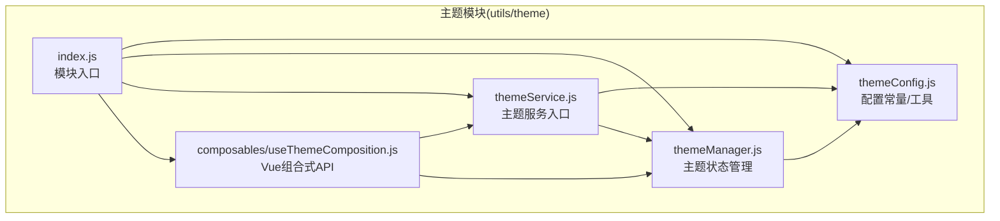
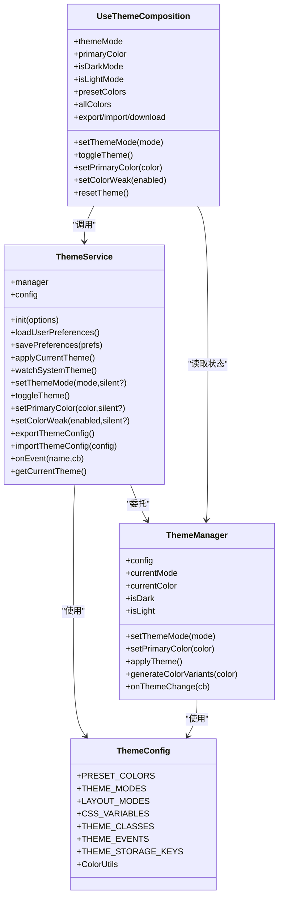
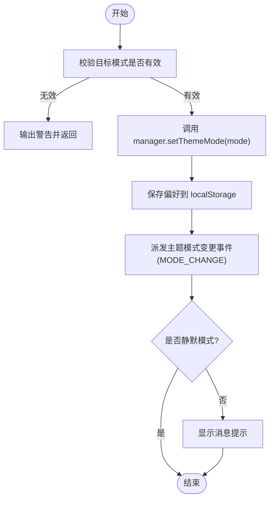
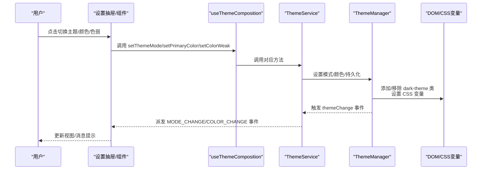
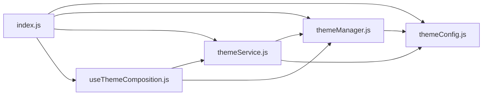

# 核心管理

<cite>
**本文引用的文件**
- [themeService.js](file://bear-jia-vue3/src/utils/theme/themeService.js)
- [themeManager.js](file://bear-jia-vue3/src/utils/theme/themeManager.js)
- [themeConfig.js](file://bear-jia-vue3/src/utils/theme/themeConfig.js)
- [index.js](file://bear-jia-vue3/src/utils/theme/index.js)
- [useThemeComposition.js](file://bear-jia-vue3/src/utils/theme/composables/useThemeComposition.js)
- [SettingDrawer.vue](file://bear-jia-vue3/src/components/layout/SettingDrawer.vue)
</cite>

## 目录
1. [简介](#简介)
2. [项目结构](#项目结构)
3. [核心组件](#核心组件)
4. [架构总览](#架构总览)
5. [详细组件分析](#详细组件分析)
6. [依赖关系分析](#依赖关系分析)
7. [性能考量](#性能考量)
8. [故障排查指南](#故障排查指南)
9. [结论](#结论)
10. [附录](#附录)

## 简介
本文件聚焦于主题管理的核心实现，围绕 themeService.js 与 themeManager.js 的职责边界、协作关系与运行机制展开，帮助读者理解：
- 主题服务如何作为统一入口，提供模式切换、颜色设置、持久化存储、事件通知与系统偏好监听；
- 主题管理器如何管理主题状态、通过 CSS 变量动态更新界面样式，并处理初始化与应用；
- 亮/暗主题切换的逻辑（CSS 类名添加/移除与事件触发）；
- 色弱模式的实现原理与切换机制；
- 主题状态管理的端到端流程图，从用户操作到样式更新的数据流。

## 项目结构
主题模块位于 utils/theme 目录，采用“配置常量 + 管理器 + 服务层 + 组合式 API + 入口导出”的分层组织方式，便于在 Vue 组件与纯 JS 场景复用。

图表来源
- [index.js](file://bear-jia-vue3/src/utils/theme/index.js#L1-L34)
- [themeConfig.js](file://bear-jia-vue3/src/utils/theme/themeConfig.js#L1-L234)
- [themeManager.js](file://bear-jia-vue3/src/utils/theme/themeManager.js#L1-L372)
- [themeService.js](file://bear-jia-vue3/src/utils/theme/themeService.js#L1-L558)
- [useThemeComposition.js](file://bear-jia-vue3/src/utils/theme/composables/useThemeComposition.js#L1-L280)

章节来源
- [index.js](file://bear-jia-vue3/src/utils/theme/index.js#L1-L34)

## 核心组件
- 主题配置（themeConfig.js）：集中定义主题模式、布局模式、CSS 变量映射、主题类名、事件名、存储键名与颜色工具函数。
- 主题管理器（themeManager.js）：负责主题状态的响应式存储、持久化、应用与事件派发；通过 CSS 变量驱动界面样式。
- 主题服务（themeService.js）：作为统一入口，封装用户偏好加载/保存、系统主题监听、消息提示、事件派发、导出/导入配置等功能。
- 组合式 API（useThemeComposition.js）：在 Vue 组件中提供响应式主题状态与便捷方法，订阅主题事件并更新视图。
- 入口导出（index.js）：统一导出主题管理器、服务与配置，便于按需引入。

章节来源
- [themeConfig.js](file://bear-jia-vue3/src/utils/theme/themeConfig.js#L1-L234)
- [themeManager.js](file://bear-jia-vue3/src/utils/theme/themeManager.js#L1-L372)
- [themeService.js](file://bear-jia-vue3/src/utils/theme/themeService.js#L1-L558)
- [useThemeComposition.js](file://bear-jia-vue3/src/utils/theme/composables/useThemeComposition.js#L1-L280)
- [index.js](file://bear-jia-vue3/src/utils/theme/index.js#L1-L34)

## 架构总览
主题系统采用“配置常量层 + 状态管理层 + 服务协调层 + 视图绑定层”的分层架构：
- 配置常量层：提供主题模式、类名、事件、存储键与颜色工具；
- 状态管理层：以响应式数据为核心，负责主题状态的变更、持久化与应用；
- 服务协调层：对外暴露统一 API，负责偏好加载、系统主题监听、消息提示与事件派发；
- 视图绑定层：通过组合式 API 将主题状态与 UI 绑定，监听主题事件并更新视图。

图表来源
- [themeConfig.js](file://bear-jia-vue3/src/utils/theme/themeConfig.js#L1-L234)
- [themeManager.js](file://bear-jia-vue3/src/utils/theme/themeManager.js#L1-L372)
- [themeService.js](file://bear-jia-vue3/src/utils/theme/themeService.js#L1-L558)
- [useThemeComposition.js](file://bear-jia-vue3/src/utils/theme/composables/useThemeComposition.js#L1-L280)

## 详细组件分析

### 主题服务（ThemeService）
- 职责边界
  - 作为主题管理的统一入口，聚合主题管理器与配置常量；
  - 负责用户偏好加载/保存、系统主题监听、消息提示、事件派发、导出/导入配置；
  - 提供便捷的 setThemeMode、toggleTheme、setPrimaryColor、setColorWeak 等方法。
- 关键能力
  - 初始化：加载用户偏好、应用初始主题、可选监听系统主题；
  - 模式切换：校验模式、持久化、派发事件、消息提示；
  - 颜色管理：校验颜色、持久化、派发事件、消息提示；
  - 色弱模式：基于 CSS 类名切换，持久化到 localStorage；
  - 配置管理：导出/导入主题配置，支持文件下载/读取；
  - 事件系统：统一派发与监听主题相关事件（CHANGE/MODE_CHANGE/COLOR_CHANGE）。
- 数据持久化
  - 用户偏好：同时写入新旧键，保证兼容；
  - 色弱模式：写入 colorWeak 键；
  - 主题配置：写入 theme-config 键。
- 系统主题监听
  - 通过 matchMedia 监听 prefers-color-scheme，自动切换亮/暗模式。

章节来源
- [themeService.js](file://bear-jia-vue3/src/utils/theme/themeService.js#L1-L558)
- [themeConfig.js](file://bear-jia-vue3/src/utils/theme/themeConfig.js#L1-L234)

### 主题管理器（ThemeManager）
- 职责边界
  - 维护主题状态（模式、主色、预设色、自定义色），负责状态变更与持久化；
  - 应用主题到 DOM（添加/移除 dark-theme 类名、设置 CSS 变量）；
  - 生成颜色变体（hover/active/透明度等），并通过 CSS color-mix 或 RGB 计算；
  - 派发主题变更事件，供外部监听。
- 关键实现
  - 响应式配置：ref + watch 深度监听，变更即应用主题并持久化；
  - 主题应用：根据模式添加/移除 dark-theme 类名，设置 --primary-color 等 CSS 变量；
  - 颜色变体：优先使用 color-mix，其次回退到 RGB 计算；
  - 自定义色：支持增删，持久化到 theme-config。
- 状态查询
  - currentMode/currentColor/isDark/isLight 提供只读访问。

章节来源
- [themeManager.js](file://bear-jia-vue3/src/utils/theme/themeManager.js#L1-L372)
- [themeConfig.js](file://bear-jia-vue3/src/utils/theme/themeConfig.js#L1-L234)

### 主题配置（themeConfig.js）
- 主题模式与布局模式：LIGHT/DARK、SIDE/TOP/MIX/COLUMN/DRAWER 等；
- CSS 变量映射：主色、Hover/Active、透明度变体、背景/文字/边框等；
- 主题类名：dark-theme、light-theme、color-weak、transition、compact；
- 事件名：themeChange、themeModeChange、themeColorChange、themeLayoutChange；
- 存储键名：theme-config、theme-mode、theme-color、theme-layout 等，含旧键兼容；
- 颜色工具：HEX 校验、HEX↔RGB 转换、亮度调整、对比色、渐变生成。

章节来源
- [themeConfig.js](file://bear-jia-vue3/src/utils/theme/themeConfig.js#L1-L234)

### 组合式 API（useThemeComposition.js）
- 在 Vue 组件中提供响应式主题状态与便捷方法；
- 订阅主题事件（CHANGE/MODE_CHANGE/COLOR_CHANGE），实时更新组件状态；
- 与主题服务/管理器协同工作，实现 UI 与主题状态的双向绑定；
- 提供简化版与色选择器/模式切换器等专用组合式函数。

章节来源
- [useThemeComposition.js](file://bear-jia-vue3/src/utils/theme/composables/useThemeComposition.js#L1-L280)
- [themeService.js](file://bear-jia-vue3/src/utils/theme/themeService.js#L1-L558)
- [themeManager.js](file://bear-jia-vue3/src/utils/theme/themeManager.js#L1-L372)

### 主题模式切换流程（亮/暗）

图表来源
- [themeService.js](file://bear-jia-vue3/src/utils/theme/themeService.js#L187-L210)
- [themeManager.js](file://bear-jia-vue3/src/utils/theme/themeManager.js#L188-L201)
- [themeConfig.js](file://bear-jia-vue3/src/utils/theme/themeConfig.js#L1-L234)

### 色弱模式切换机制
- 实现原理：通过给 documentElement/body 添加/移除 color-weak 类名，配合样式规则降低色彩饱和度；
- 切换逻辑：检测当前状态，决定添加或移除类名，同时持久化到 localStorage；
- 触发时机：用户在设置抽屉中点击色弱开关或通过组合式 API 调用 setColorWeak。

章节来源
- [themeService.js](file://bear-jia-vue3/src/utils/theme/themeService.js#L245-L273)
- [themeConfig.js](file://bear-jia-vue3/src/utils/theme/themeConfig.js#L1-L234)

### 主题状态管理端到端流程（用户操作到样式更新）

图表来源
- [SettingDrawer.vue](file://bear-jia-vue3/src/components/layout/SettingDrawer.vue#L490-L552)
- [useThemeComposition.js](file://bear-jia-vue3/src/utils/theme/composables/useThemeComposition.js#L1-L280)
- [themeService.js](file://bear-jia-vue3/src/utils/theme/themeService.js#L1-L558)
- [themeManager.js](file://bear-jia-vue3/src/utils/theme/themeManager.js#L1-L372)

## 依赖关系分析
- 模块导出
  - index.js 统一导出 themeManager、themeService、themeConfig 与组合式 API；
  - themeService 依赖 themeManager 与 themeConfig；
  - themeManager 依赖 themeConfig；
  - useThemeComposition 依赖 themeService 与 themeManager。
- 组件集成
  - SettingDrawer.vue 通过 useThemeComposition 使用主题服务，实现主题/颜色/色弱的交互与持久化。

图表来源
- [index.js](file://bear-jia-vue3/src/utils/theme/index.js#L1-L34)
- [themeService.js](file://bear-jia-vue3/src/utils/theme/themeService.js#L1-L558)
- [themeManager.js](file://bear-jia-vue3/src/utils/theme/themeManager.js#L1-L372)
- [themeConfig.js](file://bear-jia-vue3/src/utils/theme/themeConfig.js#L1-L234)
- [useThemeComposition.js](file://bear-jia-vue3/src/utils/theme/composables/useThemeComposition.js#L1-L280)

章节来源
- [index.js](file://bear-jia-vue3/src/utils/theme/index.js#L1-L34)
- [SettingDrawer.vue](file://bear-jia-vue3/src/components/layout/SettingDrawer.vue#L490-L552)

## 性能考量
- 响应式监听与深度持久化：ThemeManager 使用深监听，确保每次变更都应用主题并持久化，建议在高频变更场景下避免不必要的频繁调用；
- CSS 变量计算：ThemeManager 优先使用 color-mix，回退到 RGB 计算，减少复杂颜色推导开销；
- 事件派发：ThemeService 与 ThemeManager 均通过自定义事件进行解耦，避免全局状态污染；
- 消息提示防抖：ThemeService 内置消息防抖，避免短时间内重复提示造成 UI 抖动。

[本节为通用指导，无需特定文件引用]

## 故障排查指南
- 主题未生效
  - 检查是否正确调用 ThemeService.init 并完成 applyCurrentTheme；
  - 确认 DOM 上是否存在 dark-theme 类名；
  - 检查 CSS 变量是否被设置（如 --primary-color）。
- 颜色无效
  - 确认传入颜色符合 HEX 格式校验；
  - 检查 ColorUtils 的 HEX 校验与转换逻辑。
- 系统主题监听无效
  - 确认浏览器支持 matchMedia；
  - 检查 followSystem 选项是否开启。
- 色弱模式不生效
  - 确认 color-weak 类名是否正确添加/移除；
  - 检查 localStorage 中 colorWeak 键值。
- 事件未触发
  - 确认 onEvent 订阅是否正确；
  - 检查事件名是否匹配（CHANGE/MODE_CHANGE/COLOR_CHANGE）。

章节来源
- [themeService.js](file://bear-jia-vue3/src/utils/theme/themeService.js#L1-L558)
- [themeManager.js](file://bear-jia-vue3/src/utils/theme/themeManager.js#L1-L372)
- [themeConfig.js](file://bear-jia-vue3/src/utils/theme/themeConfig.js#L1-L234)

## 结论
themeService 与 themeManager 形成清晰的职责分工：前者作为统一入口，负责偏好、系统主题、事件与持久化；后者专注状态管理与样式应用。二者配合 themeConfig 的常量与工具，构建了可扩展、可维护的主题体系。通过组合式 API，主题状态与 UI 实现自然绑定，端到端流程清晰可控。

[本节为总结性内容，无需特定文件引用]

## 附录
- 入口导出一览：index.js 提供主题管理器、服务与配置的统一导出，便于按需引入；
- 组件集成示例：SettingDrawer.vue 展示了主题模式、颜色与色弱的交互实现与持久化策略。

章节来源
- [index.js](file://bear-jia-vue3/src/utils/theme/index.js#L1-L34)
- [SettingDrawer.vue](file://bear-jia-vue3/src/components/layout/SettingDrawer.vue#L490-L552)