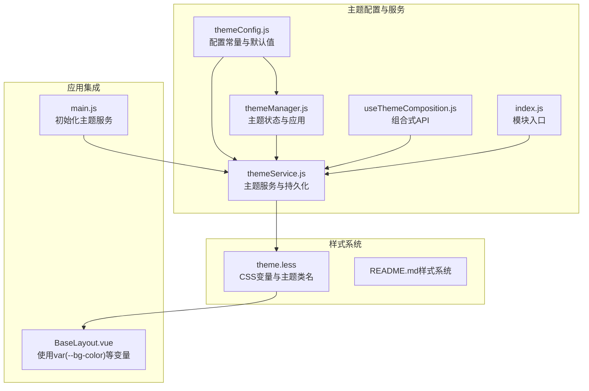
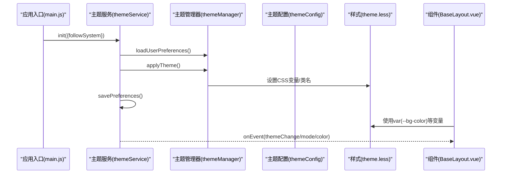
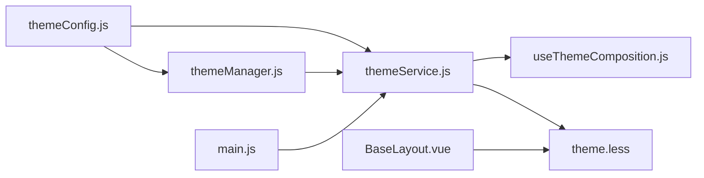

# 配置管理

<cite>
**本文引用的文件**
- [themeConfig.js](file://bear-jia-vue3/src/utils/theme/themeConfig.js)
- [themeManager.js](file://bear-jia-vue3/src/utils/theme/themeManager.js)
- [themeService.js](file://bear-jia-vue3/src/utils/theme/themeService.js)
- [useThemeComposition.js](file://bear-jia-vue3/src/utils/theme/composables/useThemeComposition.js)
- [index.js](file://bear-jia-vue3/src/utils/theme/index.js)
- [theme.less](file://bear-jia-vue3/src/style/theme.less)
- [README.md（样式系统）](file://bear-jia-vue3/src/style/README.md)
- [README.md（主题模块）](file://bear-jia-vue3/src/utils/theme/README.md)
- [main.js](file://bear-jia-vue3/src/main.js)
- [BaseLayout.vue](file://bear-jia-vue3/src/layout/BaseLayout.vue)
</cite>

## 目录
1. [简介](#简介)
2. [项目结构](#项目结构)
3. [核心组件](#核心组件)
4. [架构总览](#架构总览)
5. [详细组件分析](#详细组件分析)
6. [依赖关系分析](#依赖关系分析)
7. [性能考量](#性能考量)
8. [故障排查指南](#故障排查指南)
9. [结论](#结论)
10. [附录](#附录)

## 简介
本文件面向主题配置管理，聚焦于 themeConfig.js 中的各项配置与约定，系统性说明预设主题色、CSS 变量命名规范与层级结构、主题类名约定、预设主题组织方式（默认、暗色、色弱），并给出配置项清单与扩展指导。同时结合主题服务与管理器的工作流，帮助开发者快速理解与定制主题系统。

## 项目结构
主题配置与应用涉及以下关键文件：
- 配置与常量：themeConfig.js
- 主题管理器：themeManager.js
- 主题服务：themeService.js
- 组合式API：useThemeComposition.js
- 模块入口：index.js
- 样式变量与主题类名：theme.less
- 样式系统规范：README.md（样式系统）
- 主题模块文档：README.md（主题模块）
- 应用入口初始化：main.js
- 布局组件中对 CSS 变量的使用示例：BaseLayout.vue

图表来源
- [themeConfig.js](file://bear-jia-vue3/src/utils/theme/themeConfig.js#L1-L234)
- [themeManager.js](file://bear-jia-vue3/src/utils/theme/themeManager.js#L1-L372)
- [themeService.js](file://bear-jia-vue3/src/utils/theme/themeService.js#L1-L558)
- [useThemeComposition.js](file://bear-jia-vue3/src/utils/theme/composables/useThemeComposition.js#L1-L280)
- [index.js](file://bear-jia-vue3/src/utils/theme/index.js#L1-L34)
- [theme.less](file://bear-jia-vue3/src/style/theme.less#L1-L148)
- [README.md（样式系统）](file://bear-jia-vue3/src/style/README.md#L1-L319)
- [README.md（主题模块）](file://bear-jia-vue3/src/utils/theme/README.md#L1-L267)
- [main.js](file://bear-jia-vue3/src/main.js#L1-L62)
- [BaseLayout.vue](file://bear-jia-vue3/src/layout/BaseLayout.vue#L1-L200)

章节来源
- [themeConfig.js](file://bear-jia-vue3/src/utils/theme/themeConfig.js#L1-L234)
- [themeManager.js](file://bear-jia-vue3/src/utils/theme/themeManager.js#L1-L372)
- [themeService.js](file://bear-jia-vue3/src/utils/theme/themeService.js#L1-L558)
- [useThemeComposition.js](file://bear-jia-vue3/src/utils/theme/composables/useThemeComposition.js#L1-L280)
- [index.js](file://bear-jia-vue3/src/utils/theme/index.js#L1-L34)
- [theme.less](file://bear-jia-vue3/src/style/theme.less#L1-L148)
- [README.md（样式系统）](file://bear-jia-vue3/src/style/README.md#L1-L319)
- [README.md（主题模块）](file://bear-jia-vue3/src/utils/theme/README.md#L1-L267)
- [main.js](file://bear-jia-vue3/src/main.js#L1-L62)
- [BaseLayout.vue](file://bear-jia-vue3/src/layout/BaseLayout.vue#L1-L200)

## 核心组件
- 主题配置常量与默认值：定义预设主题色、主题模式、布局模式、内容宽度模式、默认主题配置、CSS变量映射、主题类名、事件名、颜色工具函数等。
- 主题管理器：负责主题状态的响应式管理、本地存储、颜色变体生成、主题类名应用、事件派发等。
- 主题服务：封装对外API，负责初始化、系统主题监听、偏好持久化、主题事件派发、导出/导入配置、消息提示等。
- 组合式API：为Vue组件提供便捷的主题状态与方法，支持主题模式切换、主题色选择、色弱模式、配置导入导出等。
- 样式系统：通过CSS变量与主题类名实现主题切换；BaseLayout.vue等组件直接使用var(--bg-color)等变量。

章节来源
- [themeConfig.js](file://bear-jia-vue3/src/utils/theme/themeConfig.js#L1-L234)
- [themeManager.js](file://bear-jia-vue3/src/utils/theme/themeManager.js#L1-L372)
- [themeService.js](file://bear-jia-vue3/src/utils/theme/themeService.js#L1-L558)
- [useThemeComposition.js](file://bear-jia-vue3/src/utils/theme/composables/useThemeComposition.js#L1-L280)
- [theme.less](file://bear-jia-vue3/src/style/theme.less#L1-L148)
- [BaseLayout.vue](file://bear-jia-vue3/src/layout/BaseLayout.vue#L1-L200)

## 架构总览
主题系统采用“配置常量 + 管理器 + 服务 + 组合式API + 样式变量”的分层设计。配置常量提供默认值与约定；管理器负责状态与应用；服务负责持久化与事件；组合式API为组件提供响应式能力；样式系统通过CSS变量与类名实现视觉切换。

图表来源
- [main.js](file://bear-jia-vue3/src/main.js#L45-L55)
- [themeService.js](file://bear-jia-vue3/src/utils/theme/themeService.js#L36-L129)
- [themeManager.js](file://bear-jia-vue3/src/utils/theme/themeManager.js#L103-L142)
- [theme.less](file://bear-jia-vue3/src/style/theme.less#L1-L148)
- [BaseLayout.vue](file://bear-jia-vue3/src/layout/BaseLayout.vue#L1-L200)

## 详细组件分析

### 主题配置常量（themeConfig.js）
- 预设主题色：包含颜色值与名称，用于颜色选择器与预设列表。
- 主题模式：LIGHT/DARK。
- 布局模式：SIDE/TOP/MIX/COLUMN/DRAWER。
- 内容宽度模式：FLUID/FIXED。
- 默认主题配置：包含mode、primaryColor、layout（含多子项）、colorWeak、transition、compact。
- 存储键名：theme-config、theme-mode、theme-color、theme-layout、兼容旧键darkMode、primaryColor、navMode、layoutSettings。
- CSS变量映射：定义--primary-color系列、Ant Design兼容变量、背景色、文本色、边框色等。
- 主题类名：dark-theme、light-theme、color-weak、theme-transition、compact-mode。
- 事件名：themeChange、themeModeChange、themeColorChange、themeLayoutChange。
- 颜色工具：校验十六进制、十六进制转RGB、RGB转十六进制、调整亮度、对比色、生成渐变。

章节来源
- [themeConfig.js](file://bear-jia-vue3/src/utils/theme/themeConfig.js#L1-L234)

### 主题管理器（themeManager.js）
- 状态：mode、primaryColor、presetColors、customColors。
- 生命周期：init（加载本地存储、监听变化、应用主题）。
- 本地存储：loadThemeFromStorage、saveThemeToStorage（兼容旧键）。
- 主题应用：applyTheme（根据mode添加/移除dark-theme类名，应用主题色及变体）。
- 颜色变体：generateColorVariants（基于color-mix与透明度生成变体）。
- 主题模式切换：setThemeMode、toggleTheme。
- 主题色设置：setPrimaryColor（校验十六进制）。
- 自定义颜色：addCustomColor、removeCustomColor、getAllColors。
- 导出/导入/重置：exportTheme、importTheme、resetTheme。
- 事件：emitThemeChange、onThemeChange。
- 只读状态：currentMode、currentColor、isDark、isLight。

章节来源
- [themeManager.js](file://bear-jia-vue3/src/utils/theme/themeManager.js#L1-L372)

### 主题服务（themeService.js）
- 初始化：init（加载用户偏好、应用主题、可选跟随系统主题）。
- 偏好持久化：getStoredPreferences、savePreferences（兼容旧键）。
- 主题操作：setThemeMode、toggleTheme、setPrimaryColor、setColorWeak。
- 颜色工具：ColorUtils（来自themeConfig）。
- 颜色变体生成：generateCSSVariables（基于工具函数生成hover/active/透明度变体）。
- 配置管理：exportThemeConfig、importThemeConfig、downloadThemeConfig、importThemeFromFile。
- 事件：emitEvent、onEvent。
- 系统主题监听：watchSystemTheme。
- 清理：cleanThemeClasses、destroy。

章节来源
- [themeService.js](file://bear-jia-vue3/src/utils/theme/themeService.js#L1-L558)
- [themeConfig.js](file://bear-jia-vue3/src/utils/theme/themeConfig.js#L126-L220)

### 组合式API（useThemeComposition.js）
- 提供主题状态与方法：themeMode、primaryColor、isDarkMode、isLightMode、colorWeak、presetColors、allColors、currentTheme。
- 初始化：initTheme（调用themeService.init）。
- 主题操作：setThemeMode、toggleTheme、setPrimaryColor、setColorWeak、addCustomColor、removeCustomColor、resetTheme、exportThemeConfig、importThemeConfig、downloadThemeConfig、importThemeFromFile。
- 事件监听：订阅themeChange、modeChange、colorChange事件并更新状态。
- 简化API：useSimpleTheme、useThemeColorPicker、useThemeModeToggle。
- 响应式CSS变量：useThemeCSSVariables（监听primaryColor变化并生成CSS变量）。

章节来源
- [useThemeComposition.js](file://bear-jia-vue3/src/utils/theme/composables/useThemeComposition.js#L1-L280)

### 样式系统（theme.less）
- CSS变量：--ant-primary-color系列、--primary-color系列、背景色层级、文字色、边框色、菜单与按钮颜色等。
- 暗色主题：.dark-theme下覆盖背景、文字、边框、菜单、按钮等变量。
- 主题切换动画：.theme-transition。
- 色弱模式：.color-weak通过filter实现高对比度适配。
- 组件使用示例：BaseLayout.vue中使用var(--bg-color)等变量。

章节来源
- [theme.less](file://bear-jia-vue3/src/style/theme.less#L1-L148)
- [BaseLayout.vue](file://bear-jia-vue3/src/layout/BaseLayout.vue#L1-L200)

### 应用入口初始化（main.js）
- 在应用挂载后异步初始化主题服务，并可选择跟随系统主题。
- 初始化完成后执行其他配置初始化与监听。

章节来源
- [main.js](file://bear-jia-vue3/src/main.js#L45-L55)

## 依赖关系分析
- themeConfig.js 为所有模块提供常量与默认值。
- themeManager.js 依赖 themeConfig 的常量与颜色工具，负责状态与应用。
- themeService.js 依赖 themeManager 与 themeConfig，提供对外API与持久化。
- useThemeComposition.js 依赖 themeService，为组件提供响应式主题能力。
- 样式系统通过CSS变量与类名与主题管理器联动。
- 应用入口在启动阶段初始化主题服务。

图表来源
- [themeConfig.js](file://bear-jia-vue3/src/utils/theme/themeConfig.js#L1-L234)
- [themeManager.js](file://bear-jia-vue3/src/utils/theme/themeManager.js#L1-L372)
- [themeService.js](file://bear-jia-vue3/src/utils/theme/themeService.js#L1-L558)
- [useThemeComposition.js](file://bear-jia-vue3/src/utils/theme/composables/useThemeComposition.js#L1-L280)
- [theme.less](file://bear-jia-vue3/src/style/theme.less#L1-L148)
- [main.js](file://bear-jia-vue3/src/main.js#L45-L55)
- [BaseLayout.vue](file://bear-jia-vue3/src/layout/BaseLayout.vue#L1-L200)

章节来源
- [index.js](file://bear-jia-vue3/src/utils/theme/index.js#L1-L34)
- [themeConfig.js](file://bear-jia-vue3/src/utils/theme/themeConfig.js#L1-L234)
- [themeManager.js](file://bear-jia-vue3/src/utils/theme/themeManager.js#L1-L372)
- [themeService.js](file://bear-jia-vue3/src/utils/theme/themeService.js#L1-L558)
- [useThemeComposition.js](file://bear-jia-vue3/src/utils/theme/composables/useThemeComposition.js#L1-L280)
- [theme.less](file://bear-jia-vue3/src/style/theme.less#L1-L148)
- [main.js](file://bear-jia-vue3/src/main.js#L45-L55)
- [BaseLayout.vue](file://bear-jia-vue3/src/layout/BaseLayout.vue#L1-L200)

## 性能考量
- CSS变量与color-mix：通过CSS变量与color-mix减少JavaScript计算开销，提升主题切换性能。
- 事件与监听：主题事件采用window.CustomEvent，避免频繁DOM重绘；组合式API仅在需要时监听事件。
- 本地存储：主题配置持久化至localStorage，避免每次刷新重新计算。
- 样式覆盖：通过类名切换（如dark-theme、color-weak）实现整体样式切换，避免逐元素修改。

[本节为通用性能讨论，不直接分析具体文件]

## 故障排查指南
- 主题切换后组件样式未更新
  - 检查组件是否使用CSS变量而非硬编码颜色。
  - 确认根节点存在dark-theme或color-weak类名。
- 主题配置未持久化
  - 检查浏览器localStorage可用性与容量。
  - 确认使用新版键名theme-config，必要时兼容旧键。
- 主题切换动画异常
  - 检查是否存在theme-transition类名。
- 色弱模式无效
  - 确认已添加color-weak类名，且样式中filter规则生效。
- 主题服务未初始化
  - 确认在应用启动后调用themeService.init。

章节来源
- [README.md（主题模块）](file://bear-jia-vue3/src/utils/theme/README.md#L237-L267)
- [themeService.js](file://bear-jia-vue3/src/utils/theme/themeService.js#L112-L129)
- [theme.less](file://bear-jia-vue3/src/style/theme.less#L128-L148)

## 结论
该主题配置体系以themeConfig.js为核心，配合themeManager.js与themeService.js实现主题状态管理、持久化与事件派发，再由useThemeComposition.js为组件提供响应式能力，最终通过theme.less的CSS变量与类名实现视觉切换。整体架构清晰、职责分离、易于扩展与维护。

[本节为总结性内容，不直接分析具体文件]

## 附录

### 主题配置项清单（来自themeConfig.js与themeManager.js）
- 主题模式
  - 名称：mode
  - 类型：字符串
  - 默认值：light
  - 用途：控制亮/暗主题
  - 取值：light/dark
- 主题色
  - 名称：primaryColor
  - 类型：字符串（十六进制颜色）
  - 默认值：#1677ff
  - 用途：主色调，生成hover/active/透明度变体
- 布局设置
  - 名称：layout.mode
  - 类型：字符串
  - 默认值：side
  - 用途：侧边/顶部/混合/分栏/抽屉布局
  - 取值：side/top/mix/column/drawer
  - 名称：layout.contentWidth
  - 类型：字符串
  - 默认值：fluid
  - 用途：内容宽度模式
  - 取值：fluid/fixed
  - 名称：layout.fixedHeader
  - 类型：布尔
  - 默认值：true
  - 用途：固定头部
  - 名称：layout.fixedSidebar
  - 类型：布尔
  - 默认值：true
  - 用途：固定侧边栏
  - 名称：layout.splitMenus
  - 类型：布尔
  - 默认值：false
  - 用途：分割菜单
  - 名称：layout.multiTab
  - 类型：布尔
  - 默认值：true
  - 用途：多页签
  - 名称：layout.hideFooter
  - 类型：布尔
  - 默认值：false
  - 用途：隐藏底部
- 色弱模式
  - 名称：colorWeak
  - 类型：布尔
  - 默认值：false
  - 用途：启用色弱模式（通过类名color-weak）
- 过渡动画
  - 名称：transition
  - 类型：布尔
  - 默认值：true
  - 用途：启用主题切换动画（通过类名theme-transition）
- 紧凑模式
  - 名称：compact
  - 类型：布尔
  - 默认值：false
  - 用途：紧凑布局（预留）

章节来源
- [themeConfig.js](file://bear-jia-vue3/src/utils/theme/themeConfig.js#L42-L63)
- [themeManager.js](file://bear-jia-vue3/src/utils/theme/themeManager.js#L11-L33)

### 预设主题色方案
- 预设颜色列表（来自themeConfig.js）
  - 默认蓝、薄暮红、火山橙、日暮黄、明青色、极光绿、酱紫色、粉红色、拂晓蓝、天空蓝
- 颜色工具
  - 校验十六进制、十六进制转RGB、RGB转十六进制、调整亮度、对比色、生成渐变
- 自定义颜色
  - 支持添加/删除自定义颜色，持久化至本地存储

章节来源
- [themeConfig.js](file://bear-jia-vue3/src/utils/theme/themeConfig.js#L6-L18)
- [themeConfig.js](file://bear-jia-vue3/src/utils/theme/themeConfig.js#L126-L220)
- [themeManager.js](file://bear-jia-vue3/src/utils/theme/themeManager.js#L213-L235)

### CSS变量命名规范与层级结构
- 命名规范
  - 主题色：--primary-color、--primary-color-hover、--primary-color-active、--primary-1
  - Ant Design兼容：--ant-primary-color、--ant-primary-color-hover、--ant-primary-color-active、--ant-primary-1
  - 背景色：--bg-color、--component-background、--sidebar-background
  - 文字色：--text-primary、--text-secondary、--text-disabled
  - 边框色：--border-color、--border-color-base、--border-color-split
- 层级结构
  - 背景层级：页面主背景（最深层）、组件背景（中间层）、侧边栏背景（特殊用途）
  - 文字层级：主要文字、次要文字、禁用文字
  - 边框层级：基础边框、分割线、分隔符
- 使用原则
  - 优先使用CSS变量，避免硬编码颜色值
  - 遵循层次结构，保持一致性
  - 保留必要的别名变量

章节来源
- [themeConfig.js](file://bear-jia-vue3/src/utils/theme/themeConfig.js#L78-L106)
- [theme.less](file://bear-jia-vue3/src/style/theme.less#L1-L148)
- [README.md（样式系统）](file://bear-jia-vue3/src/style/README.md#L22-L47)

### 主题类名约定
- 主题模式类名：dark-theme、light-theme
- 特殊模式类名：color-weak
- 动画类名：theme-transition
- 紧凑模式类名：compact-mode
- 应用方式
  - 通过主题管理器在documentElement与body上添加/移除类名
  - 样式系统通过类名覆盖变量实现主题切换

章节来源
- [themeConfig.js](file://bear-jia-vue3/src/utils/theme/themeConfig.js#L108-L116)
- [themeManager.js](file://bear-jia-vue3/src/utils/theme/themeManager.js#L111-L118)
- [theme.less](file://bear-jia-vue3/src/style/theme.less#L128-L148)

### 预设颜色方案组织方式
- 默认主题：默认亮色模式与默认主色
- 暗色主题：通过dark-theme类名覆盖背景、文字、边框等变量
- 色弱主题：通过color-weak类名启用高对比度滤镜
- 过渡动画：通过theme-transition类名启用主题切换动画
- 紧凑模式：预留类名，便于后续扩展

章节来源
- [theme.less](file://bear-jia-vue3/src/style/theme.less#L77-L148)
- [themeConfig.js](file://bear-jia-vue3/src/utils/theme/themeConfig.js#L108-L116)

### 配置项完整列表（来自themeConfig.js与themeManager.js）
- 预设主题色：PRESET_COLORS（数组）
- 主题模式：THEME_MODES（LIGHT/DARK）
- 布局模式：LAYOUT_MODES（SIDE/TOP/MIX/COLUMN/DRAWER）
- 内容宽度模式：CONTENT_WIDTH_MODES（FLUID/FIXED）
- 默认主题配置：DEFAULT_THEME_CONFIG（包含mode、primaryColor、layout、colorWeak、transition、compact）
- 存储键名：THEME_STORAGE_KEYS（theme-config、theme-mode、theme-color、theme-layout、兼容旧键）
- CSS变量映射：CSS_VARIABLES（主色、Ant兼容、背景、文字、边框）
- 主题类名：THEME_CLASSES（dark/light/color-weak/transition/compact）
- 事件名：THEME_EVENTS（themeChange、themeModeChange、themeColorChange、themeLayoutChange）
- 颜色工具：ColorUtils（校验、转换、亮度调整、对比色、渐变）

章节来源
- [themeConfig.js](file://bear-jia-vue3/src/utils/theme/themeConfig.js#L6-L116)
- [themeConfig.js](file://bear-jia-vue3/src/utils/theme/themeConfig.js#L117-L234)

### 如何扩展配置以支持更多自定义主题
- 添加预设主题色
  - 在themeConfig.js的PRESET_COLORS中新增颜色项
  - 或在运行时通过themeManager.addCustomColor添加自定义颜色
- 自定义CSS变量
  - 在theme.less中扩展变量定义，遵循命名规范与层级结构
  - 在组件中使用var(--your-var)引用
- 扩展主题类名
  - 在themeConfig.js的THEME_CLASSES中新增类名键值
  - 在theme.less中为新类名编写覆盖规则
- 扩展主题模式
  - 在themeConfig.js的THEME_MODES中新增模式键值
  - 在themeManager.js与themeService.js中扩展对应逻辑
- 事件扩展
  - 在themeConfig.js的THEME_EVENTS中新增事件名
  - 在themeManager.js与themeService.js中派发与监听新事件
- 组件接入
  - 使用useThemeComposition提供的组合式API在组件中响应主题变化
  - 在模板中使用var(--bg-color)等变量确保主题切换生效

章节来源
- [themeConfig.js](file://bear-jia-vue3/src/utils/theme/themeConfig.js#L6-L116)
- [themeManager.js](file://bear-jia-vue3/src/utils/theme/themeManager.js#L213-L235)
- [theme.less](file://bear-jia-vue3/src/style/theme.less#L1-L148)
- [useThemeComposition.js](file://bear-jia-vue3/src/utils/theme/composables/useThemeComposition.js#L1-L280)