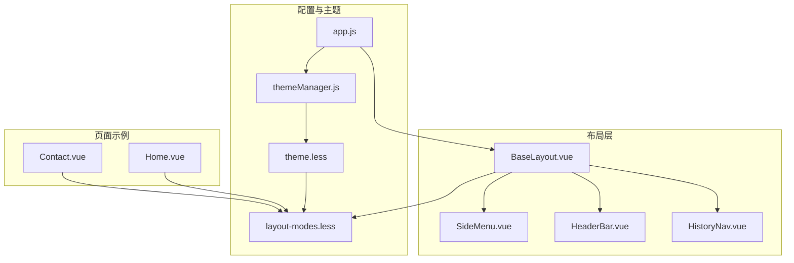
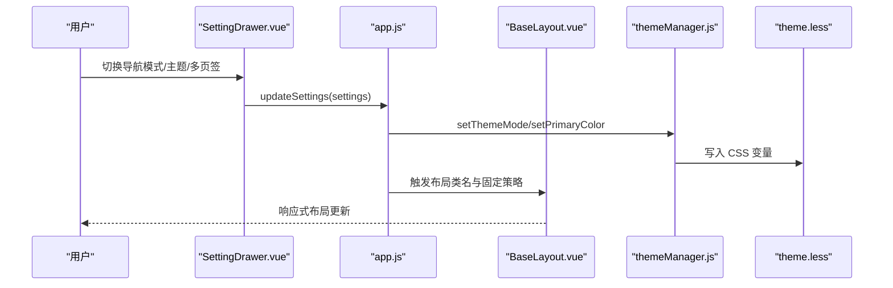
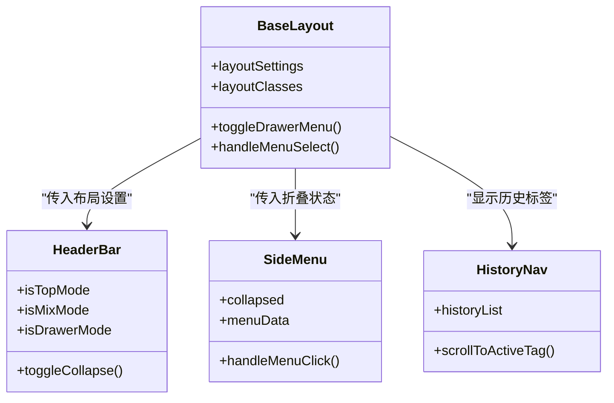
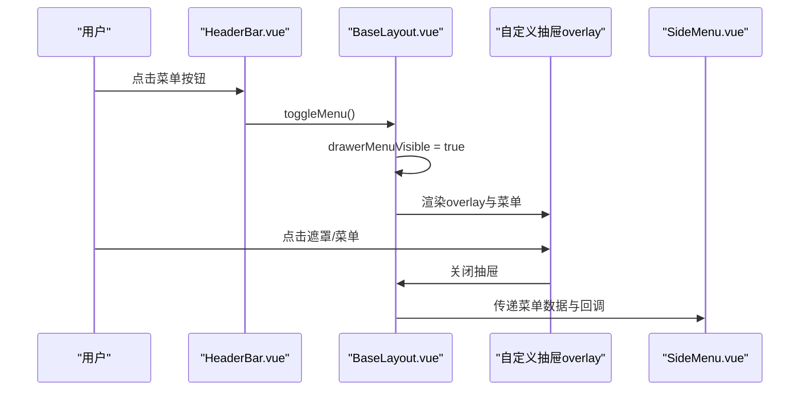
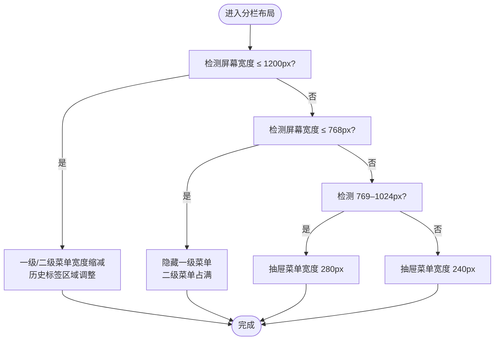
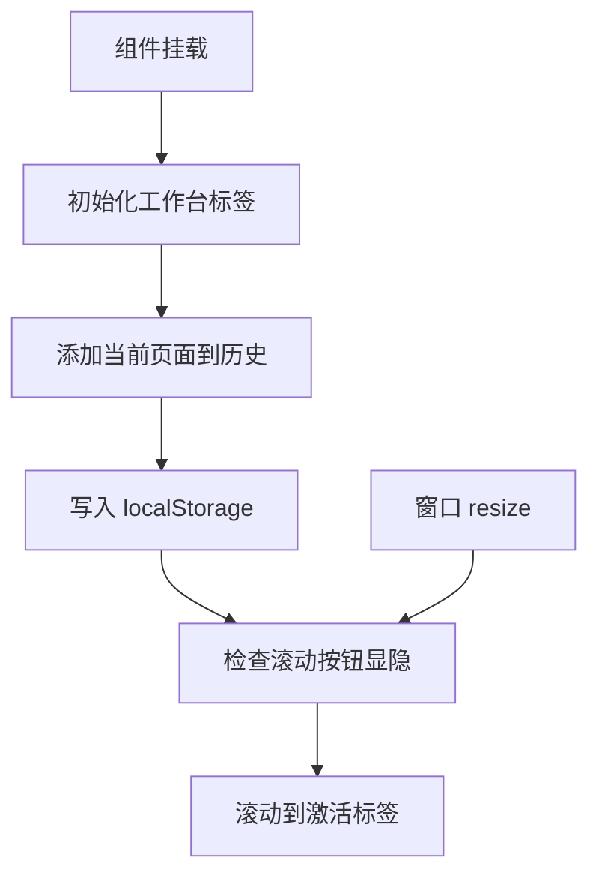
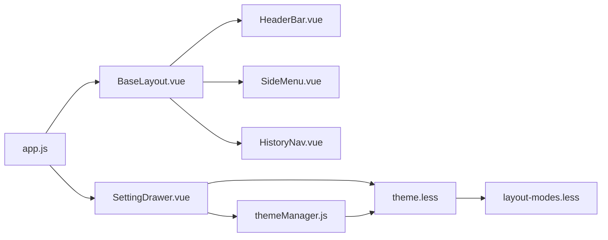

# 响应式设计

<cite>
**本文引用的文件**
- [BaseLayout.vue](file://bear-jia-vue3/src/layout/BaseLayout.vue)
- [SettingDrawer.vue](file://bear-jia-vue3/src/components/layout/SettingDrawer.vue)
- [HeaderBar.vue](file://bear-jia-vue3/src/components/layout/HeaderBar.vue)
- [SideMenu.vue](file://bear-jia-vue3/src/components/layout/SideMenu.vue)
- [HistoryNav.vue](file://bear-jia-vue3/src/components/layout/HistoryNav.vue)
- [app.js](file://bear-jia-vue3/src/stores/app.js)
- [theme.less](file://bear-jia-vue3/src/style/theme.less)
- [layout-modes.less](file://bear-jia-vue3/src/style/layout-modes.less)
- [themeManager.js](file://bear-jia-vue3/src/utils/theme/themeManager.js)
- [configInit.js](file://bear-jia-vue3/src/utils/configInit.js)
- [Home.vue](file://bear-jia-vue3/src/views/frontend/Home.vue)
- [Contact.vue](file://bear-jia-vue3/src/views/frontend/Contact.vue)
- [README.md](file://bear-jia-vue3/src/style/README.md)
</cite>

## 目录
1. [简介](#简介)
2. [项目结构](#项目结构)
3. [核心组件](#核心组件)
4. [架构总览](#架构总览)
5. [详细组件分析](#详细组件分析)
6. [依赖关系分析](#依赖关系分析)
7. [性能考量](#性能考量)
8. [故障排查指南](#故障排查指南)
9. [结论](#结论)
10. [附录](#附录)

## 简介
本文件聚焦于系统的响应式设计策略，涵盖布局系统在不同屏幕尺寸下的自适应机制。系统通过：
- CSS 变量与主题系统统一色彩与层级
- Flex/Grid 布局与媒体查询实现移动端与桌面端差异化展示
- Vue 响应式数据驱动布局模式切换与抽屉菜单行为
- 多标签页（multiTab）在不同布局下的显示策略与配置控制

目标是在小屏设备上实现“抽屉菜单 + 流式内容”的移动端优先体验，在大屏设备上提供“侧边栏 + 多标签页 + 分栏菜单”等丰富布局能力。

## 项目结构
系统采用“布局容器 + 多布局模式 + 主题与变量 + 响应式样式”的分层组织：
- 布局容器：BaseLayout.vue 根据 layoutSettings.navMode 渲染不同布局
- 布局模式：侧边栏、顶部菜单、混合布局、分栏布局、抽屉布局
- 主题与变量：theme.less 定义 CSS 变量；themeManager.js 与 app.js 管理主题与持久化
- 响应式样式：layout-modes.less 提供各布局的媒体查询与断点适配
- 多标签页：HistoryNav.vue 实现标签滚动与移动端优化

图表来源
- [BaseLayout.vue](file://bear-jia-vue3/src/layout/BaseLayout.vue#L1-L120)
- [SideMenu.vue](file://bear-jia-vue3/src/components/layout/SideMenu.vue#L1-L60)
- [HeaderBar.vue](file://bear-jia-vue3/src/components/layout/HeaderBar.vue#L1-L120)
- [HistoryNav.vue](file://bear-jia-vue3/src/components/layout/HistoryNav.vue#L1-L60)
- [app.js](file://bear-jia-vue3/src/stores/app.js#L1-L120)
- [themeManager.js](file://bear-jia-vue3/src/utils/theme/themeManager.js#L1-L120)
- [theme.less](file://bear-jia-vue3/src/style/theme.less#L1-L80)
- [layout-modes.less](file://bear-jia-vue3/src/style/layout-modes.less#L474-L540)
- [Home.vue](file://bear-jia-vue3/src/views/frontend/Home.vue#L348-L400)
- [Contact.vue](file://bear-jia-vue3/src/views/frontend/Contact.vue#L323-L382)

章节来源
- [BaseLayout.vue](file://bear-jia-vue3/src/layout/BaseLayout.vue#L1-L120)
- [layout-modes.less](file://bear-jia-vue3/src/style/layout-modes.less#L474-L540)

## 核心组件
- 布局容器 BaseLayout.vue：根据 layoutSettings.navMode 渲染侧边栏、顶部菜单、混合布局、分栏布局、抽屉布局，并通过类名与 CSS 变量控制主题与固定策略。
- 设置抽屉 SettingDrawer.vue：提供主题模式、主题色、导航模式、布局设置、多页签开关等配置项，实时影响 BaseLayout 的布局与样式。
- 顶部栏 HeaderBar.vue：在不同布局模式下调整左侧折叠按钮、Logo、面包屑与右侧工具区布局。
- 侧边栏 SideMenu.vue：支持折叠、暗色主题适配、外链标识等，配合 BaseLayout 的折叠状态联动。
- 多标签页 HistoryNav.vue：在不同布局下以滚动与按钮控制标签显示，移动端进一步缩小标签宽度与字号。
- 主题系统：theme.less 定义 CSS 变量；themeManager.js 与 app.js 负责主题色与模式的持久化与应用。

章节来源
- [BaseLayout.vue](file://bear-jia-vue3/src/layout/BaseLayout.vue#L1-L120)
- [SettingDrawer.vue](file://bear-jia-vue3/src/components/layout/SettingDrawer.vue#L1-L120)
- [HeaderBar.vue](file://bear-jia-vue3/src/components/layout/HeaderBar.vue#L1-L120)
- [SideMenu.vue](file://bear-jia-vue3/src/components/layout/SideMenu.vue#L1-L60)
- [HistoryNav.vue](file://bear-jia-vue3/src/components/layout/HistoryNav.vue#L1-L60)
- [theme.less](file://bear-jia-vue3/src/style/theme.less#L1-L80)
- [themeManager.js](file://bear-jia-vue3/src/utils/theme/themeManager.js#L1-L120)
- [app.js](file://bear-jia-vue3/src/stores/app.js#L1-L120)

## 架构总览
系统通过“配置驱动 + 主题变量 + 媒体查询”的方式实现响应式：
- 配置驱动：layoutSettings 来源于 Pinia store，包含 navMode、fixedHeader、fixedSidebar、multiTab 等关键字段
- 主题变量：CSS 变量集中定义于 theme.less，运行时由 themeManager.js 与 app.js 动态写入 documentElement.style
- 媒体查询：layout-modes.less 针对不同布局提供断点适配，如分栏布局在 1200px、768px、1024px 区间的宽度与显示策略

图表来源
- [SettingDrawer.vue](file://bear-jia-vue3/src/components/layout/SettingDrawer.vue#L555-L606)
- [app.js](file://bear-jia-vue3/src/stores/app.js#L66-L118)
- [themeManager.js](file://bear-jia-vue3/src/utils/theme/themeManager.js#L106-L142)
- [theme.less](file://bear-jia-vue3/src/style/theme.less#L1-L80)
- [BaseLayout.vue](file://bear-jia-vue3/src/layout/BaseLayout.vue#L378-L390)

## 详细组件分析

### 布局容器与导航模式
- 侧边栏布局：默认模式，HeaderBar 提供折叠按钮，SideMenu 支持折叠与暗色主题
- 顶部菜单布局：HeaderBar 以顶部菜单为主，HistoryNav 位于顶部下方
- 混合布局：顶部提供一级菜单，左侧提供二级菜单，适合中等屏幕
- 分栏布局：左侧一级菜单、右侧二级菜单，移动端隐藏一级菜单，二级菜单占满宽度
- 抽屉布局：HeaderBar 提供菜单按钮，点击弹出自定义抽屉菜单，内容区域点击关闭抽屉

图表来源
- [BaseLayout.vue](file://bear-jia-vue3/src/layout/BaseLayout.vue#L1-L120)
- [HeaderBar.vue](file://bear-jia-vue3/src/components/layout/HeaderBar.vue#L267-L323)
- [SideMenu.vue](file://bear-jia-vue3/src/components/layout/SideMenu.vue#L127-L215)
- [HistoryNav.vue](file://bear-jia-vue3/src/components/layout/HistoryNav.vue#L1-L60)

章节来源
- [BaseLayout.vue](file://bear-jia-vue3/src/layout/BaseLayout.vue#L1-L120)
- [HeaderBar.vue](file://bear-jia-vue3/src/components/layout/HeaderBar.vue#L267-L323)
- [SideMenu.vue](file://bear-jia-vue3/src/components/layout/SideMenu.vue#L127-L215)
- [HistoryNav.vue](file://bear-jia-vue3/src/components/layout/HistoryNav.vue#L1-L60)

### 抽屉布局与移动端体验
- 抽屉菜单：通过自定义 overlay 与 slideIn 动画实现，点击遮罩或内容区域关闭
- 移动端优化：在 768px 以下，抽屉菜单宽度自适应为 100%，提升触摸交互体验
- 内容区域：点击空白处自动关闭抽屉，避免误触

图表来源
- [HeaderBar.vue](file://bear-jia-vue3/src/components/layout/HeaderBar.vue#L267-L323)
- [BaseLayout.vue](file://bear-jia-vue3/src/layout/BaseLayout.vue#L538-L560)
- [layout-modes.less](file://bear-jia-vue3/src/style/layout-modes.less#L519-L539)

章节来源
- [BaseLayout.vue](file://bear-jia-vue3/src/layout/BaseLayout.vue#L538-L560)
- [layout-modes.less](file://bear-jia-vue3/src/style/layout-modes.less#L519-L539)

### 分栏布局与断点策略
- 1200px 以下：一级菜单宽度从 80px 缩减至 70px，二级菜单从 200px 缩减至 180px，历史标签区域相应调整
- 768px 以下：隐藏一级菜单，二级菜单宽度占满，适配窄屏
- 769–1024px：抽屉菜单宽度为 280px
- 1025px 以上：抽屉菜单宽度为 240px

图表来源
- [layout-modes.less](file://bear-jia-vue3/src/style/layout-modes.less#L474-L540)

章节来源
- [layout-modes.less](file://bear-jia-vue3/src/style/layout-modes.less#L474-L540)

### 多标签页（multiTab）在不同屏幕尺寸下的显示策略
- 标签容器：HistoryNav.vue 使用水平滚动与左右按钮控制可见范围
- 移动端优化：在 768px 以下，标签最大宽度与字号减小，按钮尺寸缩小，提升可读性与可点击性
- 交互细节：窗口 resize 时动态计算滚动按钮显隐；激活标签不在可视范围内时自动居中滚动

图表来源
- [HistoryNav.vue](file://bear-jia-vue3/src/components/layout/HistoryNav.vue#L352-L396)
- [HistoryNav.vue](file://bear-jia-vue3/src/components/layout/HistoryNav.vue#L131-L190)
- [HistoryNav.vue](file://bear-jia-vue3/src/components/layout/HistoryNav.vue#L534-L548)

章节来源
- [HistoryNav.vue](file://bear-jia-vue3/src/components/layout/HistoryNav.vue#L131-L190)
- [HistoryNav.vue](file://bear-jia-vue3/src/components/layout/HistoryNav.vue#L352-L396)
- [HistoryNav.vue](file://bear-jia-vue3/src/components/layout/HistoryNav.vue#L534-L548)

### CSS 变量、Flex 与 Grid 技术
- CSS 变量：theme.less 定义主色、背景、文字、边框、菜单、按钮等变量，dark-theme 类切换整体配色
- Flex 布局：HeaderBar.vue 使用 Flex 实现左右分区与垂直居中；HistoryNav.vue 使用 Flex 控制标签排列与间距
- Grid 布局：页面示例 Home.vue、Contact.vue 使用 CSS Grid 实现两列布局，并在 768px 以下切换为单列

章节来源
- [theme.less](file://bear-jia-vue3/src/style/theme.less#L1-L148)
- [HeaderBar.vue](file://bear-jia-vue3/src/components/layout/HeaderBar.vue#L366-L532)
- [HistoryNav.vue](file://bear-jia-vue3/src/components/layout/HistoryNav.vue#L439-L492)
- [Home.vue](file://bear-jia-vue3/src/views/frontend/Home.vue#L348-L363)
- [Contact.vue](file://bear-jia-vue3/src/views/frontend/Contact.vue#L330-L340)

### 布局设置与响应式行为控制
- layoutSettings 来源于 app.js，包含 primaryColor、darkMode、navMode、fixedHeader、fixedSidebar、multiTab 等
- SettingDrawer.vue 提供开关与下拉选择，实时更新 layoutSettings 并持久化
- BaseLayout.vue 根据 layoutSettings 计算布局类名与固定策略，同时在抽屉模式下修复背景色一致性

章节来源
- [app.js](file://bear-jia-vue3/src/stores/app.js#L1-L120)
- [SettingDrawer.vue](file://bear-jia-vue3/src/components/layout/SettingDrawer.vue#L100-L161)
- [BaseLayout.vue](file://bear-jia-vue3/src/layout/BaseLayout.vue#L358-L390)
- [BaseLayout.vue](file://bear-jia-vue3/src/layout/BaseLayout.vue#L508-L535)

## 依赖关系分析
- BaseLayout.vue 依赖 HeaderBar.vue、SideMenu.vue、HistoryNav.vue、layout-modes.less
- SettingDrawer.vue 依赖 app.js、themeManager.js、theme.less
- HistoryNav.vue 依赖 app.js、permission store（菜单标题解析）
- 主题系统：themeManager.js 与 app.js 共同维护主题色与模式，theme.less 提供变量基础

图表来源
- [BaseLayout.vue](file://bear-jia-vue3/src/layout/BaseLayout.vue#L1-L120)
- [SettingDrawer.vue](file://bear-jia-vue3/src/components/layout/SettingDrawer.vue#L1-L120)
- [app.js](file://bear-jia-vue3/src/stores/app.js#L1-L120)
- [themeManager.js](file://bear-jia-vue3/src/utils/theme/themeManager.js#L1-L120)
- [theme.less](file://bear-jia-vue3/src/style/theme.less#L1-L80)
- [layout-modes.less](file://bear-jia-vue3/src/style/layout-modes.less#L474-L540)

章节来源
- [BaseLayout.vue](file://bear-jia-vue3/src/layout/BaseLayout.vue#L1-L120)
- [SettingDrawer.vue](file://bear-jia-vue3/src/components/layout/SettingDrawer.vue#L1-L120)
- [app.js](file://bear-jia-vue3/src/stores/app.js#L1-L120)
- [themeManager.js](file://bear-jia-vue3/src/utils/theme/themeManager.js#L1-L120)
- [theme.less](file://bear-jia-vue3/src/style/theme.less#L1-L80)
- [layout-modes.less](file://bear-jia-vue3/src/style/layout-modes.less#L474-L540)

## 性能考量
- CSS 变量与主题：通过一次性写入 documentElement.style，减少重复计算与重排
- 布局切换：使用类名切换而非频繁 DOM 操作，降低渲染成本
- 多标签页：HistoryNav.vue 仅在 resize 或滚动时更新按钮显隐，避免高频重绘
- 抽屉布局：自定义 overlay 使用 transform 动画，利用 GPU 加速

章节来源
- [themeManager.js](file://bear-jia-vue3/src/utils/theme/themeManager.js#L106-L142)
- [layout-modes.less](file://bear-jia-vue3/src/style/layout-modes.less#L326-L473)
- [HistoryNav.vue](file://bear-jia-vue3/src/components/layout/HistoryNav.vue#L131-L190)

## 故障排查指南
- 主题色不生效：检查 themeManager.js 是否正确写入 CSS 变量，确认 theme.less 中变量存在
- 抽屉背景色异常：BaseLayout.vue 在抽屉模式下提供修复函数，检查是否执行
- 多标签页按钮不显示：确认 HistoryNav.vue 的 scrollWidth/clientWidth 计算逻辑与容器尺寸
- 响应式断点不生效：核对 layout-modes.less 的媒体查询范围与布局类名是否匹配

章节来源
- [themeManager.js](file://bear-jia-vue3/src/utils/theme/themeManager.js#L106-L142)
- [BaseLayout.vue](file://bear-jia-vue3/src/layout/BaseLayout.vue#L508-L535)
- [HistoryNav.vue](file://bear-jia-vue3/src/components/layout/HistoryNav.vue#L131-L190)
- [layout-modes.less](file://bear-jia-vue3/src/style/layout-modes.less#L474-L540)

## 结论
该系统通过“配置驱动 + 主题变量 + 媒体查询”的响应式架构，实现了从移动端到桌面端的无缝适配。侧边栏、顶部菜单、混合布局、分栏布局与抽屉布局在不同断点下具备明确的行为策略；多标签页在窄屏下通过滚动与按钮控制保证可用性；主题系统以 CSS 变量为核心，确保视觉一致性与性能表现。

## 附录

### 断点与适配方案
- 分栏布局断点
  - 1200px 以下：一级菜单 70px、二级菜单 180px，历史标签区域相应调整
  - 768px 以下：隐藏一级菜单，二级菜单占满
  - 769–1024px：抽屉菜单 280px
  - 1025px 以上：抽屉菜单 240px
- 多标签页断点
  - 768px 以下：标签最大宽度与字号减小，按钮尺寸缩小

章节来源
- [layout-modes.less](file://bear-jia-vue3/src/style/layout-modes.less#L474-L540)
- [HistoryNav.vue](file://bear-jia-vue3/src/components/layout/HistoryNav.vue#L534-L548)

### 主题变量与颜色体系
- 主题变量集中在 theme.less，包含主色、背景、文字、边框、菜单、按钮等
- 暗色主题通过 .dark-theme 类切换整体配色与交互状态颜色
- 主题色变体通过 CSS color-mix 动态生成 hover/active/透明度系列

章节来源
- [theme.less](file://bear-jia-vue3/src/style/theme.less#L1-L148)
- [themeManager.js](file://bear-jia-vue3/src/utils/theme/themeManager.js#L144-L170)
- [configInit.js](file://bear-jia-vue3/src/utils/configInit.js#L122-L165)

### 布局设置项与控制
- layoutSettings 字段（来自 app.js）：primaryColor、darkMode、navMode、layout、contentWidth、fixedHeader、fixedSidebar、splitMenus、colorWeak、multiTab、hideFooter、tableStriped、tableShowHeader
- SettingDrawer.vue 提供可视化开关与下拉选择，实时更新并持久化

章节来源
- [app.js](file://bear-jia-vue3/src/stores/app.js#L1-L120)
- [SettingDrawer.vue](file://bear-jia-vue3/src/components/layout/SettingDrawer.vue#L100-L161)