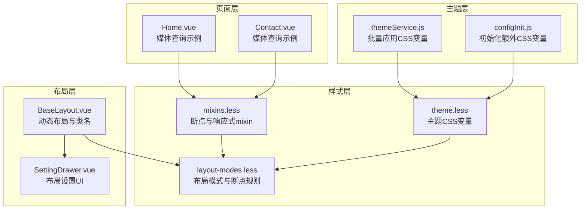
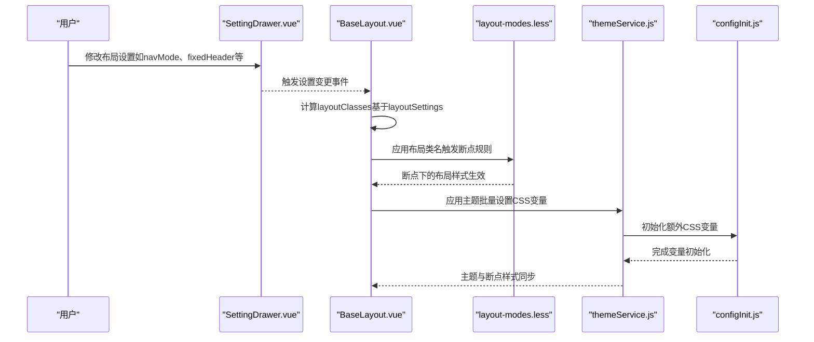
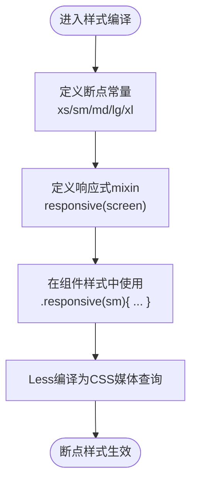
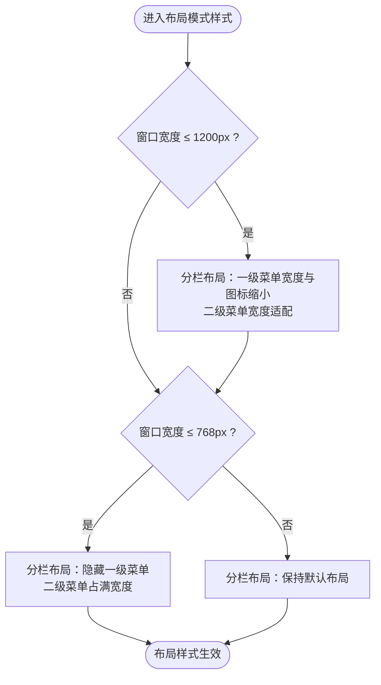
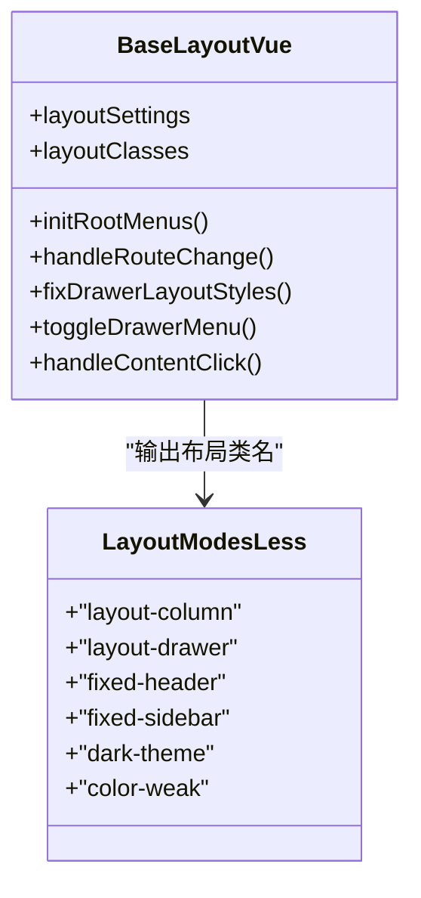
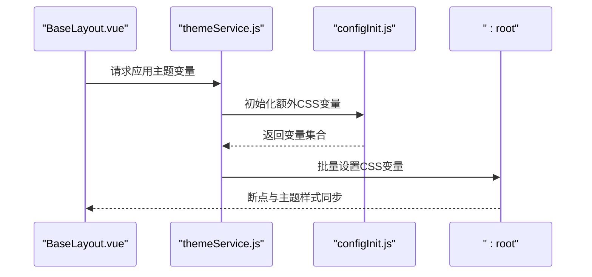
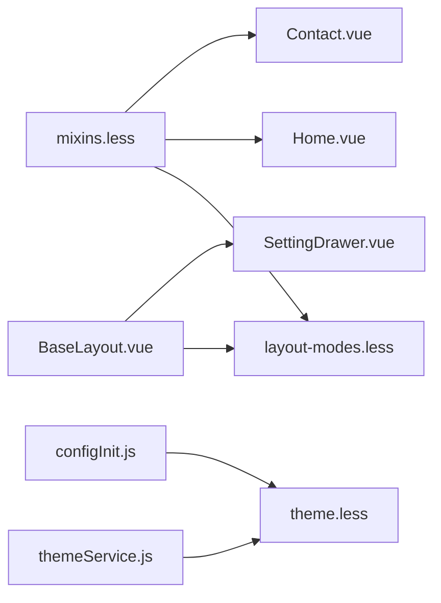

# 断点设置

<cite>
**本文引用的文件**
- [theme.less](file://bear-jia-vue3/src/style/theme.less)
- [mixins.less](file://bear-jia-vue3/src/style/mixins.less)
- [layout-modes.less](file://bear-jia-vue3/src/style/layout-modes.less)
- [BaseLayout.vue](file://bear-jia-vue3/src/layout/BaseLayout.vue)
- [SettingDrawer.vue](file://bear-jia-vue3/src/components/layout/SettingDrawer.vue)
- [themeService.js](file://bear-jia-vue3/src/utils/theme/themeService.js)
- [configInit.js](file://bear-jia-vue3/src/utils/configInit.js)
- [Home.vue](file://bear-jia-vue3/src/views/frontend/Home.vue)
- [Contact.vue](file://bear-jia-vue3/src/views/frontend/Contact.vue)
</cite>

## 目录
1. [简介](#简介)
2. [项目结构](#项目结构)
3. [核心组件](#核心组件)
4. [架构总览](#架构总览)
5. [详细组件分析](#详细组件分析)
6. [依赖分析](#依赖分析)
7. [性能考量](#性能考量)
8. [故障排查指南](#故障排查指南)
9. [结论](#结论)
10. [附录](#附录)

## 简介
本文件聚焦系统中“断点设置”与“响应式行为”的实现与协同机制，目标是帮助开发者：
- 明确系统中使用的CSS媒体查询断点及对应的设计规范；
- 理解在不同屏幕尺寸下（移动端、平板、桌面端）的布局切换逻辑；
- 掌握侧边栏折叠、菜单显示方式等响应式行为；
- 理解断点设置与 layoutSettings 中配置项的协同工作方式；
- 学会通过修改CSS变量来自定义断点值与主题色系。

## 项目结构
断点与响应式能力主要分布在以下位置：
- 样式层：断点常量与响应式mixin定义在样式文件中；布局模式样式中包含针对断点的布局切换规则。
- 布局层：BaseLayout.vue 根据 layoutSettings 动态挂载不同布局，并在运行时根据断点触发样式切换。
- 主题层：主题服务负责批量应用CSS变量，保证断点与主题色系的一致性。
- 页面层：部分页面示例中使用了媒体查询进行局部响应式调整。

图表来源
- [theme.less](file://bear-jia-vue3/src/style/theme.less#L1-L148)
- [mixins.less](file://bear-jia-vue3/src/style/mixins.less#L216-L256)
- [layout-modes.less](file://bear-jia-vue3/src/style/layout-modes.less#L474-L540)
- [BaseLayout.vue](file://bear-jia-vue3/src/layout/BaseLayout.vue#L378-L389)
- [SettingDrawer.vue](file://bear-jia-vue3/src/components/layout/SettingDrawer.vue#L63-L161)
- [themeService.js](file://bear-jia-vue3/src/utils/theme/themeService.js#L448-L487)
- [configInit.js](file://bear-jia-vue3/src/utils/configInit.js#L122-L165)
- [Home.vue](file://bear-jia-vue3/src/views/frontend/Home.vue#L348-L407)
- [Contact.vue](file://bear-jia-vue3/src/views/frontend/Contact.vue#L323-L382)

章节来源
- [theme.less](file://bear-jia-vue3/src/style/theme.less#L1-L148)
- [mixins.less](file://bear-jia-vue3/src/style/mixins.less#L216-L256)
- [layout-modes.less](file://bear-jia-vue3/src/style/layout-modes.less#L474-L540)
- [BaseLayout.vue](file://bear-jia-vue3/src/layout/BaseLayout.vue#L378-L389)
- [SettingDrawer.vue](file://bear-jia-vue3/src/components/layout/SettingDrawer.vue#L63-L161)
- [themeService.js](file://bear-jia-vue3/src/utils/theme/themeService.js#L448-L487)
- [configInit.js](file://bear-jia-vue3/src/utils/configInit.js#L122-L165)
- [Home.vue](file://bear-jia-vue3/src/views/frontend/Home.vue#L348-L407)
- [Contact.vue](file://bear-jia-vue3/src/views/frontend/Contact.vue#L323-L382)

## 核心组件
- 断点常量与响应式mixin：在 mixins.less 中定义了标准断点常量与响应式媒体查询mixin，供样式层统一使用。
- 布局模式与断点规则：layout-modes.less 在不同断点下对分栏布局与抽屉布局进行宽度、可见性与显示方式的调整。
- 动态布局与类名：BaseLayout.vue 根据 layoutSettings 的 navMode、fixedHeader、fixedSidebar 等配置动态挂载布局并输出布局类名，配合样式层断点规则生效。
- 主题服务与CSS变量：themeService.js 与 configInit.js 负责批量应用CSS变量，保证断点切换时主题色系与布局样式的一致性。

章节来源
- [mixins.less](file://bear-jia-vue3/src/style/mixins.less#L216-L256)
- [layout-modes.less](file://bear-jia-vue3/src/style/layout-modes.less#L474-L540)
- [BaseLayout.vue](file://bear-jia-vue3/src/layout/BaseLayout.vue#L378-L389)
- [themeService.js](file://bear-jia-vue3/src/utils/theme/themeService.js#L448-L487)
- [configInit.js](file://bear-jia-vue3/src/utils/configInit.js#L122-L165)

## 架构总览
断点与响应式行为的总体流程如下：
- 样式层定义断点常量与mixin；
- 布局层根据 layoutSettings 输出布局类名；
- 布局模式样式在断点下对菜单宽度、可见性、显示方式进行调整；
- 主题服务在运行时批量应用CSS变量，确保断点切换时主题色系一致；
- 页面层可按需使用媒体查询进行局部响应式调整。

图表来源
- [SettingDrawer.vue](file://bear-jia-vue3/src/components/layout/SettingDrawer.vue#L63-L161)
- [BaseLayout.vue](file://bear-jia-vue3/src/layout/BaseLayout.vue#L378-L389)
- [layout-modes.less](file://bear-jia-vue3/src/style/layout-modes.less#L474-L540)
- [themeService.js](file://bear-jia-vue3/src/utils/theme/themeService.js#L448-L487)
- [configInit.js](file://bear-jia-vue3/src/utils/configInit.js#L122-L165)

## 详细组件分析

### 断点常量与响应式mixin
- 断点常量：在 mixins.less 中定义了 xs、sm、md、lg、xl 五个断点阈值，作为响应式开发的基础。
- 响应式mixin：提供 responsive(screen) 的条件编译式mixin，可在 Less 中以 .responsive(sm){ ... } 的形式按断点注入样式。
- 设计规范：该断点体系适用于移动端、平板、桌面端的常见布局切换场景，便于统一维护。

图表来源
- [mixins.less](file://bear-jia-vue3/src/style/mixins.less#L216-L256)

章节来源
- [mixins.less](file://bear-jia-vue3/src/style/mixins.less#L216-L256)

### 布局模式与断点规则
- 分栏布局（column）：
  - 在断点 1200px 以下时，一级菜单宽度与图标尺寸缩小，二级菜单占满宽度；
  - 在断点 768px 以下时，一级菜单隐藏，二级菜单宽度占满。
- 抽屉布局（drawer）：
  - 在断点 768px 以下时，抽屉菜单宽度占满；
  - 在断点 769px–1024px 之间时，抽屉菜单宽度为固定值；
  - 在断点 1025px 及以上时，抽屉菜单宽度为另一个固定值。

图表来源
- [layout-modes.less](file://bear-jia-vue3/src/style/layout-modes.less#L474-L540)

章节来源
- [layout-modes.less](file://bear-jia-vue3/src/style/layout-modes.less#L474-L540)

### 动态布局与类名（BaseLayout.vue）
- BaseLayout.vue 基于 layoutSettings 计算布局类名，包括 navMode（side/top/mix/column/drawer）、fixedHeader、fixedSidebar、darkTheme、colorWeak 等。
- 这些类名与 layout-modes.less 中的布局类名配合，使断点规则在运行时生效。

图表来源
- [BaseLayout.vue](file://bear-jia-vue3/src/layout/BaseLayout.vue#L378-L389)
- [layout-modes.less](file://bear-jia-vue3/src/style/layout-modes.less#L1-L739)

章节来源
- [BaseLayout.vue](file://bear-jia-vue3/src/layout/BaseLayout.vue#L378-L389)
- [layout-modes.less](file://bear-jia-vue3/src/style/layout-modes.less#L1-L739)

### 主题服务与CSS变量（themeService.js、configInit.js）
- themeService.js 提供批量应用CSS变量的能力，确保断点切换时主题色系与布局样式同步。
- configInit.js 在初始化阶段设置额外的CSS变量，保证颜色透明度系列变量可用。

图表来源
- [themeService.js](file://bear-jia-vue3/src/utils/theme/themeService.js#L448-L487)
- [configInit.js](file://bear-jia-vue3/src/utils/configInit.js#L122-L165)

章节来源
- [themeService.js](file://bear-jia-vue3/src/utils/theme/themeService.js#L448-L487)
- [configInit.js](file://bear-jia-vue3/src/utils/configInit.js#L122-L165)

### 页面层媒体查询示例
- Home.vue 与 Contact.vue 在局部区域使用了媒体查询（如 max-width: 768px），对网格布局、按钮排列、字体大小等进行响应式调整。
- 这些示例展示了如何在页面层面补充断点规则，与全局断点体系协同工作。

章节来源
- [Home.vue](file://bear-jia-vue3/src/views/frontend/Home.vue#L348-L407)
- [Contact.vue](file://bear-jia-vue3/src/views/frontend/Contact.vue#L323-L382)

## 依赖分析
- 断点常量与mixin（mixins.less）是样式层的基础设施，被 layout-modes.less 与页面样式广泛使用。
- BaseLayout.vue 通过 layoutSettings 与布局类名联动，间接依赖断点规则。
- 主题服务（themeService.js）与初始化脚本（configInit.js）保障断点切换时主题色系的一致性。
- SettingDrawer.vue 提供用户界面，允许修改 layoutSettings，从而影响断点行为。

图表来源
- [mixins.less](file://bear-jia-vue3/src/style/mixins.less#L216-L256)
- [layout-modes.less](file://bear-jia-vue3/src/style/layout-modes.less#L474-L540)
- [BaseLayout.vue](file://bear-jia-vue3/src/layout/BaseLayout.vue#L378-L389)
- [SettingDrawer.vue](file://bear-jia-vue3/src/components/layout/SettingDrawer.vue#L63-L161)
- [themeService.js](file://bear-jia-vue3/src/utils/theme/themeService.js#L448-L487)
- [configInit.js](file://bear-jia-vue3/src/utils/configInit.js#L122-L165)
- [Home.vue](file://bear-jia-vue3/src/views/frontend/Home.vue#L348-L407)
- [Contact.vue](file://bear-jia-vue3/src/views/frontend/Contact.vue#L323-L382)

章节来源
- [mixins.less](file://bear-jia-vue3/src/style/mixins.less#L216-L256)
- [layout-modes.less](file://bear-jia-vue3/src/style/layout-modes.less#L474-L540)
- [BaseLayout.vue](file://bear-jia-vue3/src/layout/BaseLayout.vue#L378-L389)
- [SettingDrawer.vue](file://bear-jia-vue3/src/components/layout/SettingDrawer.vue#L63-L161)
- [themeService.js](file://bear-jia-vue3/src/utils/theme/themeService.js#L448-L487)
- [configInit.js](file://bear-jia-vue3/src/utils/configInit.js#L122-L165)
- [Home.vue](file://bear-jia-vue3/src/views/frontend/Home.vue#L348-L407)
- [Contact.vue](file://bear-jia-vue3/src/views/frontend/Contact.vue#L323-L382)

## 性能考量
- 断点规则集中在样式层，避免在JS中频繁计算屏幕尺寸，降低运行时开销。
- 主题服务批量应用CSS变量，减少DOM属性变更次数，提升断点切换时的视觉流畅度。
- 布局类名在运行时一次性计算并应用，避免重复渲染。

## 故障排查指南
- 断点不生效
  - 检查 mixins.less 中断点常量是否正确；
  - 确认 layout-modes.less 中断点规则是否覆盖目标布局；
  - 确认 BaseLayout.vue 是否输出了正确的布局类名。
- 主题色系与断点不一致
  - 检查 themeService.js 是否在断点切换后批量应用CSS变量；
  - 确认 configInit.js 是否初始化了额外的CSS变量。
- 布局设置UI无效
  - 检查 SettingDrawer.vue 是否正确绑定 layoutSettings 并触发变更事件；
  - 确认 BaseLayout.vue 是否监听到设置变更并重新计算布局类名。

章节来源
- [mixins.less](file://bear-jia-vue3/src/style/mixins.less#L216-L256)
- [layout-modes.less](file://bear-jia-vue3/src/style/layout-modes.less#L474-L540)
- [BaseLayout.vue](file://bear-jia-vue3/src/layout/BaseLayout.vue#L378-L389)
- [SettingDrawer.vue](file://bear-jia-vue3/src/components/layout/SettingDrawer.vue#L63-L161)
- [themeService.js](file://bear-jia-vue3/src/utils/theme/themeService.js#L448-L487)
- [configInit.js](file://bear-jia-vue3/src/utils/configInit.js#L122-L165)

## 结论
本系统的断点与响应式行为通过“样式层断点常量与mixin + 布局模式样式 + 动态布局类名 + 主题服务批量应用CSS变量”的协同机制实现。开发者可通过修改 mixins.less 中的断点常量与 layout-modes.less 中的断点规则来定制响应式策略，同时通过 layoutSettings 与 SettingDrawer.vue 进行可视化配置，最终由 BaseLayout.vue 与主题服务共同保证断点切换时的视觉一致性与性能稳定性。

## 附录

### 断点数值与设备类型对照
- xs：480px
- sm：768px
- md：992px
- lg：1200px
- xl：1600px

设备类型划分建议（基于断点）：
- 移动端：≤ 768px
- 平板：769px – 1024px
- 桌面端：≥ 1025px

章节来源
- [mixins.less](file://bear-jia-vue3/src/style/mixins.less#L216-L256)

### 断点与布局切换逻辑摘要
- 分栏布局（column）
  - ≤ 1200px：一级菜单宽度与图标缩小，二级菜单宽度适配；
  - ≤ 768px：隐藏一级菜单，二级菜单占满宽度。
- 抽屉布局（drawer）
  - ≤ 768px：抽屉菜单宽度占满；
  - 769px–1024px：抽屉菜单宽度固定；
  - ≥ 1025px：抽屉菜单宽度固定。

章节来源
- [layout-modes.less](file://bear-jia-vue3/src/style/layout-modes.less#L474-L540)

### 与 layoutSettings 的协同
- BaseLayout.vue 基于 layoutSettings 动态输出布局类名，配合 layout-modes.less 的断点规则；
- SettingDrawer.vue 提供 UI 修改 layoutSettings，从而影响断点行为；
- 主题服务在断点切换时批量应用CSS变量，确保主题色系与布局样式一致。

章节来源
- [BaseLayout.vue](file://bear-jia-vue3/src/layout/BaseLayout.vue#L378-L389)
- [SettingDrawer.vue](file://bear-jia-vue3/src/components/layout/SettingDrawer.vue#L63-L161)
- [themeService.js](file://bear-jia-vue3/src/utils/theme/themeService.js#L448-L487)