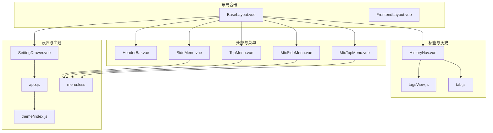
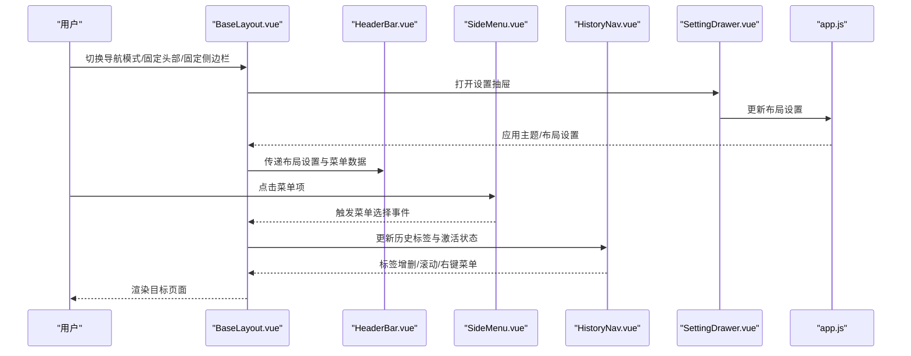
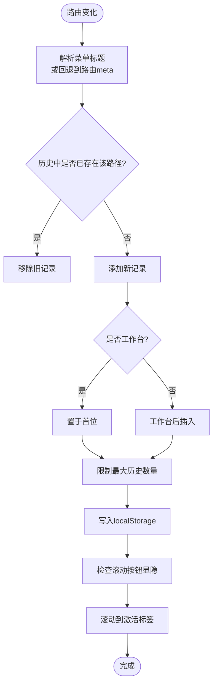
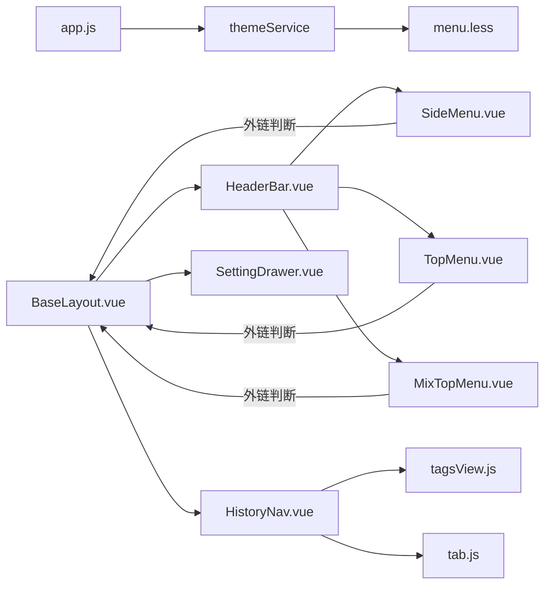

# 桌面端优化

<cite>
**本文引用的文件**
- [BaseLayout.vue](file://bear-jia-vue3/src/layout/BaseLayout.vue)
- [FrontendLayout.vue](file://bear-jia-vue3/src/layout/FrontendLayout.vue)
- [HeaderBar.vue](file://bear-jia-vue3/src/components/layout/HeaderBar.vue)
- [SideMenu.vue](file://bear-jia-vue3/src/components/layout/SideMenu.vue)
- [TopMenu.vue](file://bear-jia-vue3/src/components/layout/TopMenu.vue)
- [MixSideMenu.vue](file://bear-jia-vue3/src/components/layout/MixSideMenu.vue)
- [MixTopMenu.vue](file://bear-jia-vue3/src/components/layout/MixTopMenu.vue)
- [HistoryNav.vue](file://bear-jia-vue3/src/components/layout/HistoryNav.vue)
- [SettingDrawer.vue](file://bear-jia-vue3/src/components/layout/SettingDrawer.vue)
- [tagsView.js](file://bear-jia-vue3/src/stores/tagsView.js)
- [tab.js](file://bear-jia-vue3/src/plugins/tab.js)
- [app.js](file://bear-jia-vue3/src/stores/app.js)
- [menu.less](file://bear-jia-vue3/src/style/components/menu.less)
- [theme/index.js](file://bear-jia-vue3/src/utils/theme/index.js)
</cite>

## 目录
1. [简介](#简介)
2. [项目结构](#项目结构)
3. [核心组件](#核心组件)
4. [架构总览](#架构总览)
5. [详细组件分析](#详细组件分析)
6. [依赖关系分析](#依赖关系分析)
7. [性能考量](#性能考量)
8. [故障排查指南](#故障排查指南)
9. [结论](#结论)
10. [附录](#附录)

## 简介
本文件聚焦桌面端优化，系统阐述在大屏幕设备上布局与交互的高级能力，包括侧边栏布局、顶部菜单布局、混合布局、分栏布局四种模式的设计理念与适用场景；多标签页（multiTab）在桌面端的实现方式（动态增删、右键菜单、滚动与可视控制）；以及固定头部、固定侧边栏等高级配置对用户体验的影响与性能调优建议。文档同时给出可视化图示与源码定位，便于开发者快速理解与落地。

## 项目结构
- 布局层：BaseLayout 作为统一容器，按导航模式条件渲染不同布局；FrontendLayout 用于前端展示型页面。
- 菜单层：SideMenu、TopMenu、MixTopMenu、MixSideMenu 提供不同模式下的菜单与交互。
- 头部层：HeaderBar 统一承载菜单、搜索、消息、全屏、刷新、设置、用户下拉等能力。
- 标签与历史：HistoryNav 实现多标签页的动态增删、滚动与右键菜单；tagsView.js 与 tab.js 提供标签生命周期与快捷操作。
- 设置抽屉：SettingDrawer 提供主题、导航模式、布局、系统配置、表格配置等开关与持久化。
- 主题与样式：app.js 管理布局设置与主题应用；menu.less 提供菜单样式与暗色适配。

图表来源
- [BaseLayout.vue](file://bear-jia-vue3/src/layout/BaseLayout.vue#L1-L258)
- [HeaderBar.vue](file://bear-jia-vue3/src/components/layout/HeaderBar.vue#L1-L163)
- [SideMenu.vue](file://bear-jia-vue3/src/components/layout/SideMenu.vue#L1-L125)
- [TopMenu.vue](file://bear-jia-vue3/src/components/layout/TopMenu.vue#L1-L83)
- [MixTopMenu.vue](file://bear-jia-vue3/src/components/layout/MixTopMenu.vue#L1-L31)
- [MixSideMenu.vue](file://bear-jia-vue3/src/components/layout/MixSideMenu.vue#L1-L92)
- [HistoryNav.vue](file://bear-jia-vue3/src/components/layout/HistoryNav.vue#L1-L54)
- [SettingDrawer.vue](file://bear-jia-vue3/src/components/layout/SettingDrawer.vue#L1-L120)
- [app.js](file://bear-jia-vue3/src/stores/app.js#L1-L120)
- [menu.less](file://bear-jia-vue3/src/style/components/menu.less#L1-L172)
- [theme/index.js](file://bear-jia-vue3/src/utils/theme/index.js#L1-L34)

章节来源
- [BaseLayout.vue](file://bear-jia-vue3/src/layout/BaseLayout.vue#L1-L258)
- [app.js](file://bear-jia-vue3/src/stores/app.js#L1-L120)

## 核心组件
- BaseLayout：根据 layoutSettings.navMode 条件渲染侧边栏、顶部菜单、混合布局、分栏布局、抽屉布局五种模式；统一注入 HeaderBar、HistoryNav、SettingDrawer；支持固定头部与固定侧边栏类名绑定。
- HeaderBar：在不同导航模式下显示不同的菜单组件（SideMenu/TopMenu/MixTopMenu），并提供搜索、消息、聊天、全屏、刷新、设置、用户下拉等能力。
- SideMenu/TopMenu/MixTopMenu/MixSideMenu：分别对应侧边栏、顶部菜单、混合顶部菜单、混合侧边栏的菜单渲染与交互。
- HistoryNav：多标签页容器，支持动态增删、滚动按钮、右键菜单（刷新、关闭、关闭其他、关闭全部）、自动滚动至激活标签。
- SettingDrawer：主题模式、主题色、导航模式、布局设置、系统配置、表格配置、配置导入导出与重置。
- app.js：布局设置与系统配置的持久化与应用；主题服务集成。
- menu.less：菜单样式与暗色主题适配。

章节来源
- [BaseLayout.vue](file://bear-jia-vue3/src/layout/BaseLayout.vue#L1-L258)
- [HeaderBar.vue](file://bear-jia-vue3/src/components/layout/HeaderBar.vue#L1-L163)
- [SideMenu.vue](file://bear-jia-vue3/src/components/layout/SideMenu.vue#L1-L125)
- [TopMenu.vue](file://bear-jia-vue3/src/components/layout/TopMenu.vue#L1-L83)
- [MixTopMenu.vue](file://bear-jia-vue3/src/components/layout/MixTopMenu.vue#L1-L31)
- [MixSideMenu.vue](file://bear-jia-vue3/src/components/layout/MixSideMenu.vue#L1-L92)
- [HistoryNav.vue](file://bear-jia-vue3/src/components/layout/HistoryNav.vue#L1-L54)
- [SettingDrawer.vue](file://bear-jia-vue3/src/components/layout/SettingDrawer.vue#L1-L120)
- [app.js](file://bear-jia-vue3/src/stores/app.js#L1-L120)
- [menu.less](file://bear-jia-vue3/src/style/components/menu.less#L1-L172)

## 架构总览
桌面端优化围绕“布局容器 + 头部 + 菜单 + 标签 + 设置抽屉”的组合展开。BaseLayout 依据导航模式选择性渲染组件树，HeaderBar 作为统一入口聚合交互能力，HistoryNav 作为多标签容器贯穿页面切换与状态管理，SettingDrawer 提供全局配置开关与持久化。

图表来源
- [BaseLayout.vue](file://bear-jia-vue3/src/layout/BaseLayout.vue#L1-L258)
- [HeaderBar.vue](file://bear-jia-vue3/src/components/layout/HeaderBar.vue#L1-L163)
- [SideMenu.vue](file://bear-jia-vue3/src/components/layout/SideMenu.vue#L1-L125)
- [HistoryNav.vue](file://bear-jia-vue3/src/components/layout/HistoryNav.vue#L1-L54)
- [SettingDrawer.vue](file://bear-jia-vue3/src/components/layout/SettingDrawer.vue#L1-L120)
- [app.js](file://bear-jia-vue3/src/stores/app.js#L1-L120)

## 详细组件分析

### 布局模式与适用场景
- 侧边栏布局（navMode: side）
  - 设计理念：经典的 PC 端布局，适合功能层级较深、菜单较多的后台系统。通过固定头部与可折叠侧边栏提升空间利用率。
  - 适用场景：后台管理、内容管理、权限体系复杂的系统。
  - 关键实现：BaseLayout 条件渲染侧边栏与内容区；HeaderBar 顶部显示面包屑标题；SideMenu 支持外链标记与三级菜单渲染。
- 顶部菜单布局（navMode: top）
  - 设计理念：顶部导航主导，内容区最大化，适合功能相对扁平、强调浏览体验的系统。
  - 适用场景：仪表盘、报表、轻后台。
  - 关键实现：HeaderBar 渲染 TopMenu；TopMenu 支持二级/三级菜单与外链标记。
- 混合布局（navMode: mix）
  - 设计理念：顶部横向导航 + 侧边二级菜单联动，兼顾导航效率与空间利用。
  - 适用场景：中大型后台，需要快速切换一级分类并细粒度定位二级/三级功能。
  - 关键实现：HeaderBar 渲染 MixTopMenu；MixSideMenu 仅渲染当前一级菜单的子菜单；BaseLayout 统一处理菜单选择与路由跳转。
- 分栏布局（navMode: column）
  - 设计理念：左侧一级菜单 + 中间二级菜单 + 右侧内容区的三栏结构，适合强分类、强目录化的系统。
  - 适用场景：知识库、文档系统、分类明确的业务平台。
  - 关键实现：BaseLayout 自定义两列侧栏与内容区；MixTopMenu 与 MixSideMenu 协同；HeaderBar 与 HistoryNav 独立于分栏头部。
- 抽屉布局（navMode: drawer）
  - 设计理念：移动端抽屉菜单在桌面端的替代方案，通过点击触发菜单，适合极简风格或临时性导航。
  - 适用场景：轻量后台或演示系统。
  - 关键实现：BaseLayout 自定义 overlay 与菜单面板；HeaderBar 提供菜单按钮；抽屉样式修复逻辑。

章节来源
- [BaseLayout.vue](file://bear-jia-vue3/src/layout/BaseLayout.vue#L1-L258)
- [HeaderBar.vue](file://bear-jia-vue3/src/components/layout/HeaderBar.vue#L1-L163)
- [SideMenu.vue](file://bear-jia-vue3/src/components/layout/SideMenu.vue#L1-L125)
- [TopMenu.vue](file://bear-jia-vue3/src/components/layout/TopMenu.vue#L1-L83)
- [MixTopMenu.vue](file://bear-jia-vue3/src/components/layout/MixTopMenu.vue#L1-L31)
- [MixSideMenu.vue](file://bear-jia-vue3/src/components/layout/MixSideMenu.vue#L1-L92)

### 多标签页（multiTab）实现
- 动态增删
  - HistoryNav 在路由变化时动态添加历史标签，限制最大数量并保留工作台；支持删除当前标签、关闭其他、关闭全部。
  - 标签标题优先从菜单树解析，其次回退到路由 meta.title，最后降级为“未知页面”。
- 右键菜单
  - 激活标签右下角下拉菜单提供“刷新页面、关闭页面、关闭其他、关闭全部”。
- 滚动与可视控制
  - 标签容器水平滚动，左右按钮在滚动边界显示；窗口尺寸变化时动态检测按钮显隐；滚动到激活标签并居中。
- 与标签存储协作
  - tagsView.js 提供 visitedViews/cachedViews 的增删改查与“固定页签”策略；tab.js 提供刷新、关闭、打开、更新等快捷操作。
- 与设置联动
  - SettingDrawer 中“多页签模式”开关与 app.js 的 multiTab 设置联动，影响 BaseLayout 的布局类名与渲染。

图表来源
- [HistoryNav.vue](file://bear-jia-vue3/src/components/layout/HistoryNav.vue#L191-L391)
- [tagsView.js](file://bear-jia-vue3/src/stores/tagsView.js#L1-L106)
- [tab.js](file://bear-jia-vue3/src/plugins/tab.js#L1-L69)

章节来源
- [HistoryNav.vue](file://bear-jia-vue3/src/components/layout/HistoryNav.vue#L1-L54)
- [HistoryNav.vue](file://bear-jia-vue3/src/components/layout/HistoryNav.vue#L191-L391)
- [tagsView.js](file://bear-jia-vue3/src/stores/tagsView.js#L1-L106)
- [tab.js](file://bear-jia-vue3/src/plugins/tab.js#L1-L69)

### 固定头部与固定侧边栏
- 固定头部（fixedHeader: true）
  - BaseLayout 为根容器添加 fixed-header 类名，HeaderBar 固定在视口顶部，保证导航与工具栏始终可见。
- 固定侧边栏（fixedSidebar: true）
  - 在侧边栏布局下，侧边栏容器固定，配合内容区高度计算，避免滚动时菜单丢失。
- 顶部菜单布局下禁用固定侧边栏
  - SettingDrawer 在切换到顶部菜单时自动取消固定侧边栏，避免布局冲突。

章节来源
- [BaseLayout.vue](file://bear-jia-vue3/src/layout/BaseLayout.vue#L378-L390)
- [SettingDrawer.vue](file://bear-jia-vue3/src/components/layout/SettingDrawer.vue#L554-L571)
- [app.js](file://bear-jia-vue3/src/stores/app.js#L66-L88)

### 菜单交互与外链处理
- 外链识别与处理
  - SideMenu、TopMenu、MixTopMenu、MixSideMenu 在菜单点击前均调用外链判断，若是外链则在新窗口打开，不触发路由跳转。
- 三级菜单与父子路径拼接
  - BaseLayout 在处理三级菜单时，支持“完整路径”与“相对路径”两种情况，确保路由跳转正确。
- 菜单激活状态恢复
  - 各菜单组件提供 setCurrentMenu，用于页面刷新后根据当前 fullPath 恢复选中与展开状态。

章节来源
- [SideMenu.vue](file://bear-jia-vue3/src/components/layout/SideMenu.vue#L160-L214)
- [TopMenu.vue](file://bear-jia-vue3/src/components/layout/TopMenu.vue#L180-L213)
- [MixSideMenu.vue](file://bear-jia-vue3/src/components/layout/MixSideMenu.vue#L176-L222)
- [BaseLayout.vue](file://bear-jia-vue3/src/layout/BaseLayout.vue#L658-L730)

### 设置抽屉与主题系统
- 主题模式与主题色
  - SettingDrawer 提供暗色/亮色切换与主题色选择；app.js 通过主题服务应用主题并持久化。
- 导航模式与布局设置
  - 支持切换 side/top/mix/column/drawer；顶部菜单布局下自动取消固定侧边栏；内容宽度、隐藏 Footer、多页签模式等。
- 系统配置与表格配置
  - 系统标题、版权、版本等；表格通用样式（大小、边框、固定表头、列宽调整、分页选项、斑马条纹、显示表头等）。
- 配置导入导出与重置
  - 支持导出/导入/重置所有配置，便于团队协作与环境迁移。

章节来源
- [SettingDrawer.vue](file://bear-jia-vue3/src/components/layout/SettingDrawer.vue#L1-L120)
- [SettingDrawer.vue](file://bear-jia-vue3/src/components/layout/SettingDrawer.vue#L554-L586)
- [SettingDrawer.vue](file://bear-jia-vue3/src/components/layout/SettingDrawer.vue#L690-L741)
- [app.js](file://bear-jia-vue3/src/stores/app.js#L66-L118)
- [theme/index.js](file://bear-jia-vue3/src/utils/theme/index.js#L1-L34)

## 依赖关系分析
- 组件耦合
  - BaseLayout 与 HeaderBar、SideMenu/TopMenu/MixTopMenu/MixSideMenu、HistoryNav、SettingDrawer 形成高层耦合；通过 props 与 emits 解耦具体交互。
  - HistoryNav 与 tagsView.js、tab.js 通过 Pinia 与插件协作，形成数据与行为的分离。
- 主题与样式
  - app.js 与 themeService 协作，menu.less 提供菜单样式与暗色适配，形成“主题配置 -> 主题服务 -> 样式变量”的链路。
- 外链与路由
  - 各菜单组件在点击前统一校验外链，避免破坏路由栈；BaseLayout 在三级菜单路径拼接时兼容多种路径格式。

图表来源
- [app.js](file://bear-jia-vue3/src/stores/app.js#L1-L120)
- [menu.less](file://bear-jia-vue3/src/style/components/menu.less#L1-L172)
- [BaseLayout.vue](file://bear-jia-vue3/src/layout/BaseLayout.vue#L1-L258)
- [HeaderBar.vue](file://bear-jia-vue3/src/components/layout/HeaderBar.vue#L1-L163)
- [SideMenu.vue](file://bear-jia-vue3/src/components/layout/SideMenu.vue#L1-L125)
- [TopMenu.vue](file://bear-jia-vue3/src/components/layout/TopMenu.vue#L1-L83)
- [MixTopMenu.vue](file://bear-jia-vue3/src/components/layout/MixTopMenu.vue#L1-L31)
- [HistoryNav.vue](file://bear-jia-vue3/src/components/layout/HistoryNav.vue#L1-L54)
- [tagsView.js](file://bear-jia-vue3/src/stores/tagsView.js#L1-L106)
- [tab.js](file://bear-jia-vue3/src/plugins/tab.js#L1-L69)

## 性能考量
- 标签页性能
  - 限制历史标签数量（如 MAX_HISTORY），避免 DOM 节点过多导致滚动与渲染卡顿。
  - 使用 keep-alive 缓存页面组件（前端布局中已有示例），减少频繁创建销毁带来的开销。
  - 滚动到激活标签采用平滑滚动与可视检测，避免不必要的重排。
- 菜单渲染
  - 侧边栏菜单使用内联模式与自定义滚动条，减少滚动条闪烁与重绘。
  - 混合布局下仅渲染当前一级菜单的子菜单，降低 DOM 层级与渲染压力。
- 主题与样式
  - 主题变量通过主题服务集中管理，避免频繁 DOM 操作；暗色模式下菜单背景强制覆盖，减少样式冲突。
- 路由与导航
  - 外链直接新开窗口，避免路由栈污染；三级菜单路径拼接时做严格校验，减少无效跳转。
- 设置抽屉
  - 设置项变更通过 watch 同步到 localStorage 与 store，避免多次重绘；批量保存与导入导出减少交互成本。

章节来源
- [HistoryNav.vue](file://bear-jia-vue3/src/components/layout/HistoryNav.vue#L191-L391)
- [menu.less](file://bear-jia-vue3/src/style/components/menu.less#L1-L172)
- [BaseLayout.vue](file://bear-jia-vue3/src/layout/BaseLayout.vue#L658-L730)
- [SettingDrawer.vue](file://bear-jia-vue3/src/components/layout/SettingDrawer.vue#L588-L626)

## 故障排查指南
- 多标签页无法关闭或关闭异常
  - 检查 HistoryNav 是否正确解析菜单标题；若标题为“加载中...”，不会添加历史记录。
  - 确认工作台标签不可删除的逻辑是否生效。
- 菜单点击无反应或外链未打开
  - 检查 isExternal 判断逻辑是否正确；确认菜单路径是否为外链。
- 顶部菜单布局下侧边栏固定无效
  - SettingDrawer 在切换到顶部菜单时会自动取消固定侧边栏，属预期行为。
- 主题切换后样式未生效
  - 确认 app.js 的 applyTheme 是否被调用；检查主题服务是否初始化成功。
- 分栏布局样式异常
  - 检查 BaseLayout 中分栏布局的样式类名与容器结构；抽屉模式下需执行样式修复逻辑。

章节来源
- [HistoryNav.vue](file://bear-jia-vue3/src/components/layout/HistoryNav.vue#L88-L129)
- [SettingDrawer.vue](file://bear-jia-vue3/src/components/layout/SettingDrawer.vue#L554-L571)
- [app.js](file://bear-jia-vue3/src/stores/app.js#L105-L118)
- [BaseLayout.vue](file://bear-jia-vue3/src/layout/BaseLayout.vue#L509-L535)

## 结论
该系统在桌面端提供了完善的布局与交互能力：通过五种导航模式满足不同业务形态的需求；多标签页实现动态增删与右键菜单，结合滚动与可视控制提升复杂页面的可操作性；固定头部与固定侧边栏等高级配置显著改善了大屏体验；主题系统与样式层解耦，便于维护与扩展。建议在实际项目中结合业务复杂度选择合适布局模式，并针对复杂页面启用 keep-alive 与标签数量限制，以获得更佳的性能与体验。

## 附录
- 快速定位
  - 布局容器与模式切换：[BaseLayout.vue](file://bear-jia-vue3/src/layout/BaseLayout.vue#L1-L258)
  - 头部与菜单：[HeaderBar.vue](file://bear-jia-vue3/src/components/layout/HeaderBar.vue#L1-L163)、[SideMenu.vue](file://bear-jia-vue3/src/components/layout/SideMenu.vue#L1-L125)、[TopMenu.vue](file://bear-jia-vue3/src/components/layout/TopMenu.vue#L1-L83)、[MixTopMenu.vue](file://bear-jia-vue3/src/components/layout/MixTopMenu.vue#L1-L31)、[MixSideMenu.vue](file://bear-jia-vue3/src/components/layout/MixSideMenu.vue#L1-L92)
  - 多标签页：[HistoryNav.vue](file://bear-jia-vue3/src/components/layout/HistoryNav.vue#L1-L54)、[tagsView.js](file://bear-jia-vue3/src/stores/tagsView.js#L1-L106)、[tab.js](file://bear-jia-vue3/src/plugins/tab.js#L1-L69)
  - 设置抽屉与主题：[SettingDrawer.vue](file://bear-jia-vue3/src/components/layout/SettingDrawer.vue#L1-L120)、[app.js](file://bear-jia-vue3/src/stores/app.js#L1-L120)、[menu.less](file://bear-jia-vue3/src/style/components/menu.less#L1-L172)