# 移动端适配

<cite>
**本文档引用的文件**   
- [BaseLayout.vue](file://bear-jia-vue3/src/layout/BaseLayout.vue)
- [HeaderBar.vue](file://bear-jia-vue3/src/components/layout/HeaderBar.vue)
- [SideMenu.vue](file://bear-jia-vue3/src/components/layout/SideMenu.vue)
- [layout-modes.less](file://bear-jia-vue3/src/style/layout-modes.less)
- [menu.less](file://bear-jia-vue3/src/style/components/menu.less)
- [README.md](file://bear-jia-vue3/src/style/README.md)
- [FrontendLayout.vue](file://bear-jia-vue3/src/layout/FrontendLayout.vue)
</cite>

## 目录
1. [引言](#引言)
2. [抽屉布局工作机制](#抽屉布局工作机制)
3. [移动端UI组件调整](#移动端ui组件调整)
4. [响应式设计策略](#响应式设计策略)
5. [性能优化建议](#性能优化建议)
6. [结论](#结论)

## 引言
本系统通过多种布局模式和响应式设计策略，为小屏幕设备提供了优化的用户体验。系统支持侧边栏、顶部菜单、混合、分栏和抽屉等多种布局模式，其中抽屉布局（drawer模式）特别针对移动端进行了优化。通过分析代码实现，本文档详细阐述了移动端适配的核心策略，包括抽屉布局的工作机制、UI组件的移动端调整、响应式设计原则以及性能优化建议。

**Section sources**
- [BaseLayout.vue](file://bear-jia-vue3/src/layout/BaseLayout.vue)

## 抽屉布局工作机制
抽屉布局（drawer模式）是系统为移动端设备设计的核心导航模式，通过滑动展开、遮罩层交互和点击外部关闭等机制，提供流畅的移动端用户体验。

### 菜单滑动展开机制
抽屉布局的菜单滑动展开通过CSS动画和Vue响应式状态管理实现。当用户点击头部导航栏的菜单按钮时，系统会触发`toggleDrawerMenu`方法，改变`drawerMenuVisible`状态变量。该状态控制着抽屉菜单的显示与隐藏。

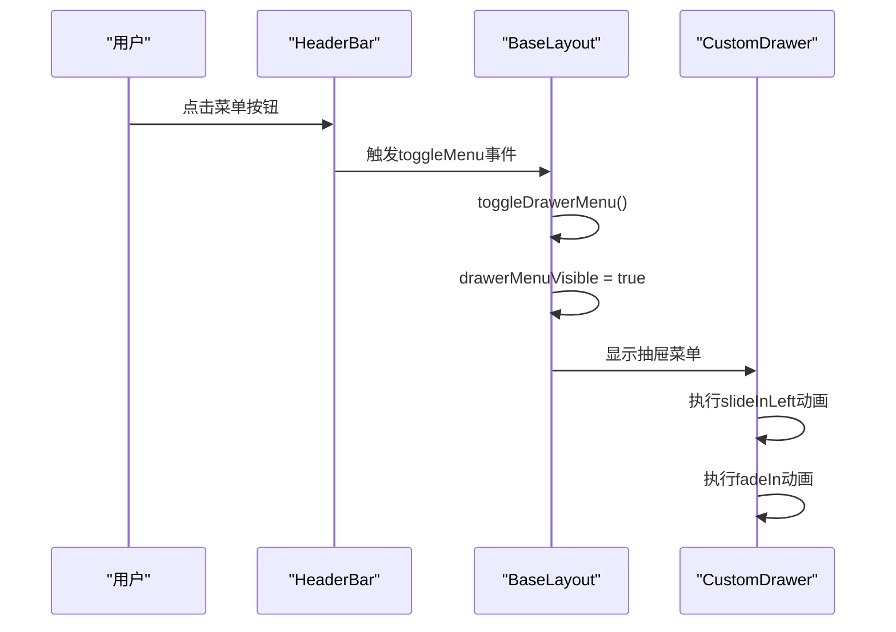

**Diagram sources**
- [BaseLayout.vue](file://bear-jia-vue3/src/layout/BaseLayout.vue#L217-L252)
- [HeaderBar.vue](file://bear-jia-vue3/src/components/layout/HeaderBar.vue#L21-L25)

### 遮罩层交互与点击外部关闭
系统通过自定义的遮罩层组件实现点击外部关闭功能。遮罩层包含两部分：半透明背景层和菜单容器。点击背景层会触发关闭操作，而点击菜单容器本身则会阻止事件冒泡，防止菜单意外关闭。

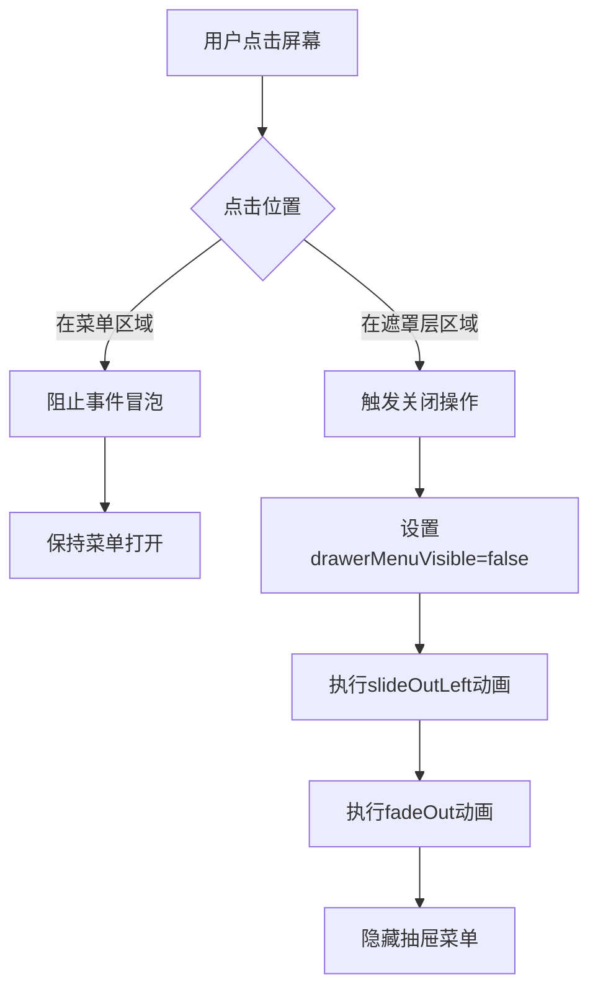

**Diagram sources**
- [BaseLayout.vue](file://bear-jia-vue3/src/layout/BaseLayout.vue#L240-L252)

### 抽屉布局样式实现
抽屉布局的样式通过CSS动画和响应式设计实现，确保在不同屏幕尺寸下都有良好的用户体验。

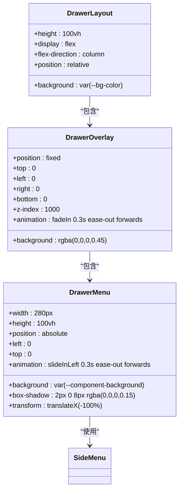

**Diagram sources**
- [layout-modes.less](file://bear-jia-vue3/src/style/layout-modes.less#L259-L472)

**Section sources**
- [BaseLayout.vue](file://bear-jia-vue3/src/layout/BaseLayout.vue#L217-L257)
- [layout-modes.less](file://bear-jia-vue3/src/style/layout-modes.less#L259-L739)

## 移动端UI组件调整
系统针对移动端设备对UI组件进行了多项优化调整，包括头部导航简化、图标按钮优化布局和触摸操作支持等。

### 头部导航简化
移动端的头部导航进行了简化设计，移除了复杂的下拉菜单和多级导航，采用扁平化的单层结构。通过条件渲染，系统根据布局模式显示不同的导航元素。

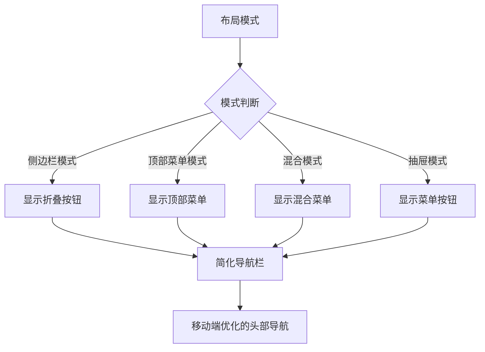

**Diagram sources**
- [HeaderBar.vue](file://bear-jia-vue3/src/components/layout/HeaderBar.vue#L5-L38)

### 图标按钮优化布局
系统对移动端的图标按钮进行了优化布局，采用更紧凑的间距和更大的点击区域，提升触摸操作的便捷性。

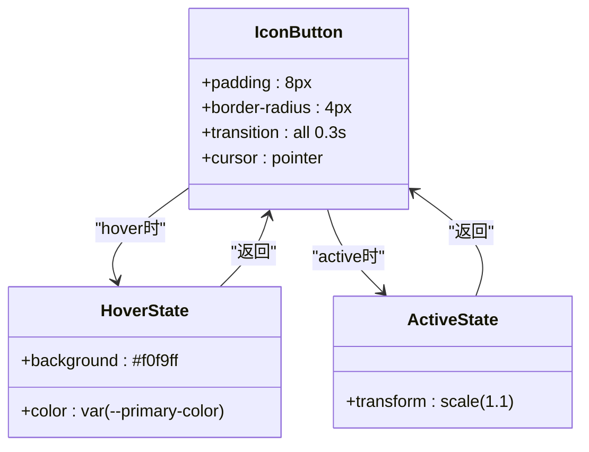

**Diagram sources**
- [HeaderBar.vue](file://bear-jia-vue3/src/components/layout/HeaderBar.vue#L452-L471)

### 触摸操作支持
系统通过添加触摸事件支持和优化触摸反馈，提升了移动端的交互体验。所有可点击元素都具有适当的触摸反馈效果。

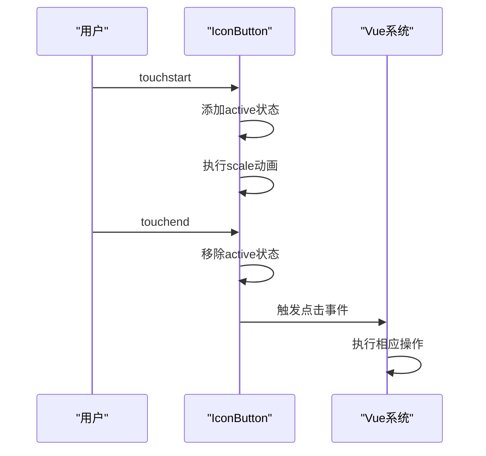

**Diagram sources**
- [HeaderBar.vue](file://bear-jia-vue3/src/components/layout/HeaderBar.vue#L464-L470)

**Section sources**
- [HeaderBar.vue](file://bear-jia-vue3/src/components/layout/HeaderBar.vue#L60-L147)
- [FrontendLayout.vue](file://bear-jia-vue3/src/layout/FrontendLayout.vue#L14-L60)

## 响应式设计策略
系统采用响应式设计确保内容在不同屏幕尺寸下都具有良好的可读性和操作便捷性。

### 媒体查询实现
系统通过CSS媒体查询实现响应式布局，在不同屏幕尺寸下应用不同的样式规则。

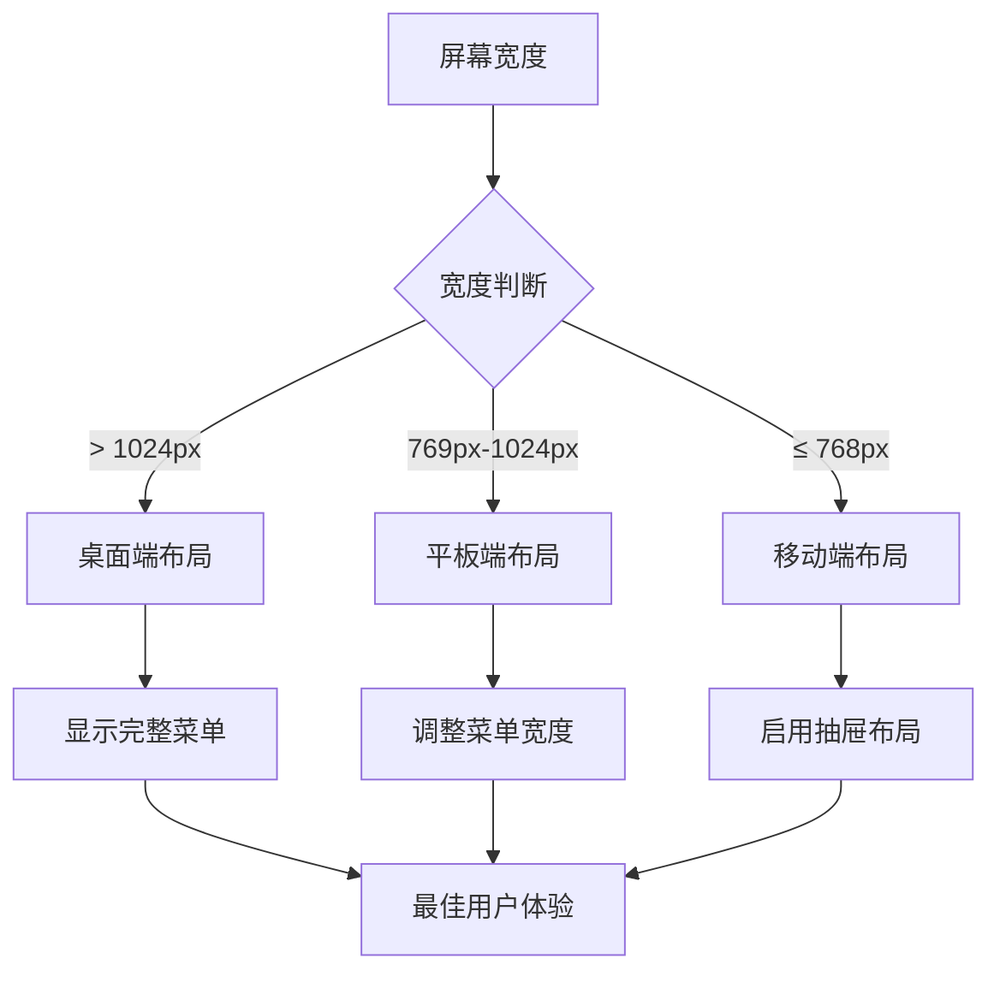

**Diagram sources**
- [layout-modes.less](file://bear-jia-vue3/src/style/layout-modes.less#L507-L523)

### 布局模式切换
系统支持多种布局模式的动态切换，用户可以根据设备类型选择最适合的布局方式。

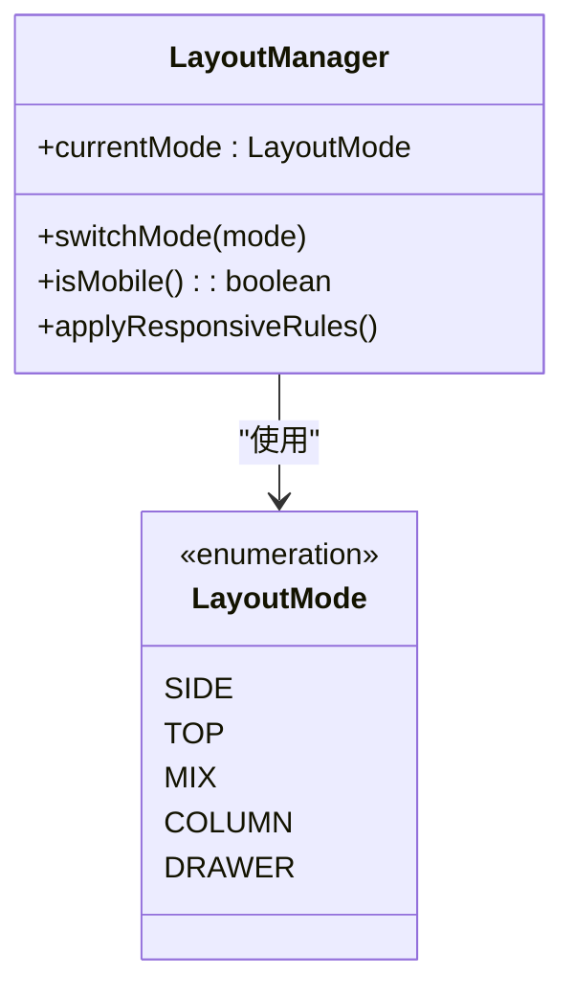

**Diagram sources**
- [BaseLayout.vue](file://bear-jia-vue3/src/layout/BaseLayout.vue#L4-L257)

### 内容可读性优化
系统通过字体大小调整、行高优化和间距控制，确保内容在小屏幕上具有良好的可读性。

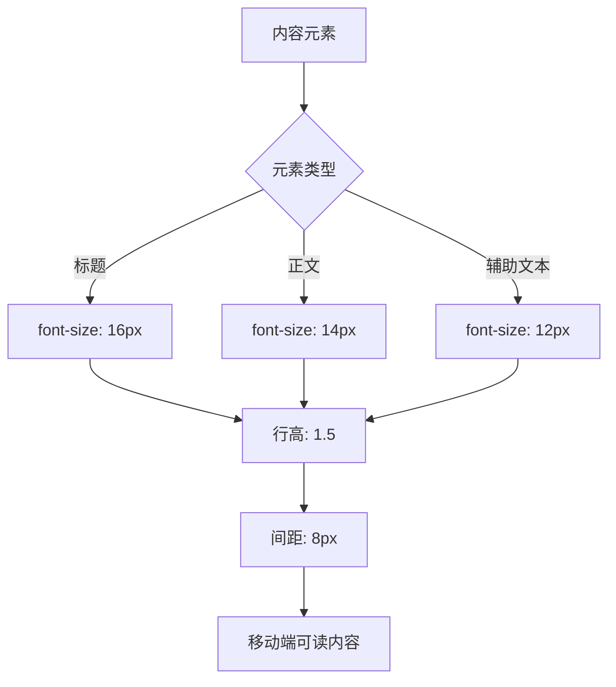

**Diagram sources**
- [layout-modes.less](file://bear-jia-vue3/src/style/layout-modes.less#L274-L323)

**Section sources**
- [layout-modes.less](file://bear-jia-vue3/src/style/layout-modes.less#L474-L523)
- [README.md](file://bear-jia-vue3/src/style/README.md#L169-L176)

## 性能优化建议
为提升移动端加载速度和运行性能，系统采用了多项优化策略。

### 资源加载优化
系统通过代码分割和懒加载技术，减少初始加载的资源体积。

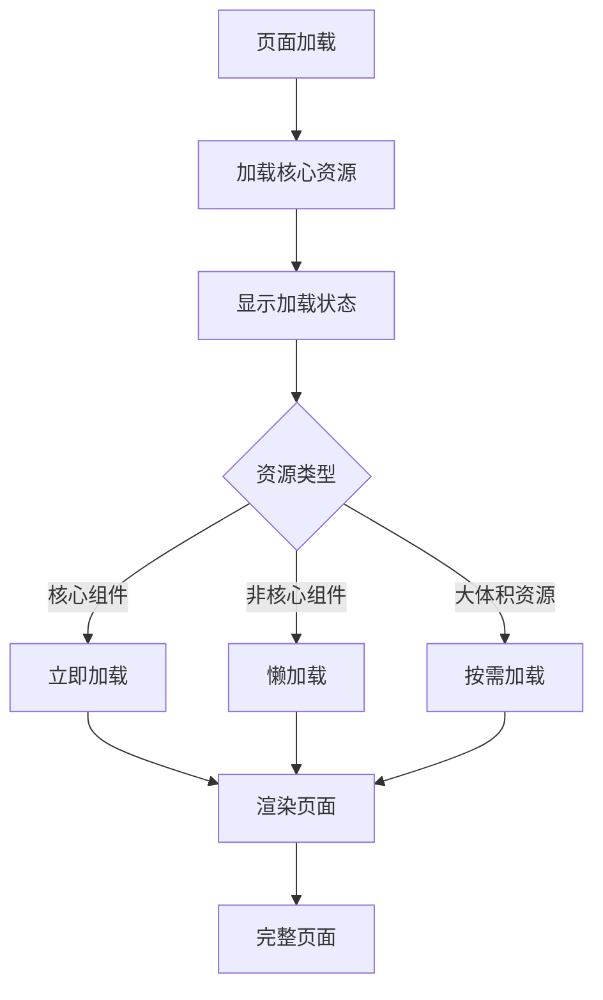

### 组件性能优化
系统通过虚拟滚动和列表优化技术，提升长列表的渲染性能。

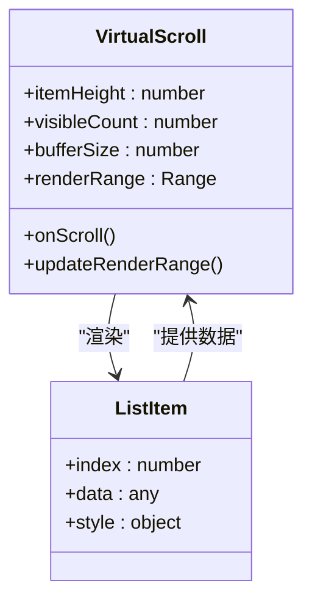

**Diagram sources**
- [menu.less](file://bear-jia-vue3/src/style/components/menu.less#L9-L30)

### 缓存策略
系统采用多层缓存策略，减少重复请求和计算。

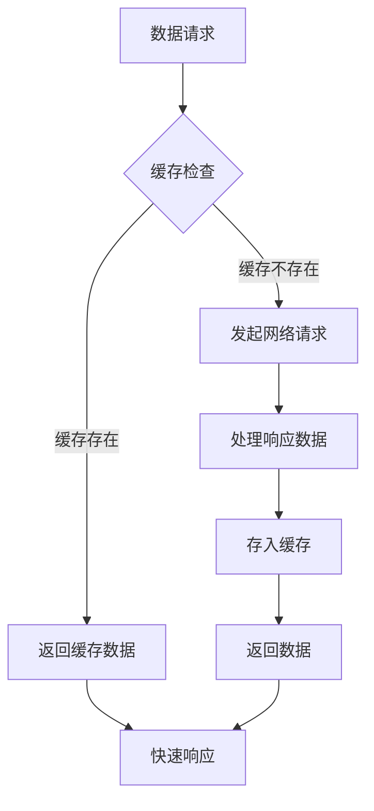

**Section sources**
- [menu.less](file://bear-jia-vue3/src/style/components/menu.less#L1-L172)
- [README.md](file://bear-jia-vue3/src/style/README.md#L277-L294)

## 结论
本系统通过抽屉布局、响应式设计和性能优化等策略，为移动端设备提供了优秀的用户体验。抽屉布局通过滑动展开、遮罩层交互和点击外部关闭等机制，实现了流畅的导航体验。UI组件针对移动端进行了简化和优化，提升了操作便捷性。响应式设计确保内容在不同屏幕尺寸下都具有良好的可读性。性能优化建议有助于提升移动端的加载速度和运行效率。这些策略共同构成了系统完整的移动端适配方案。