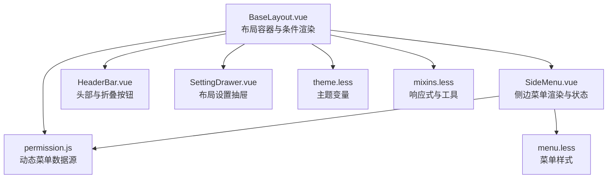
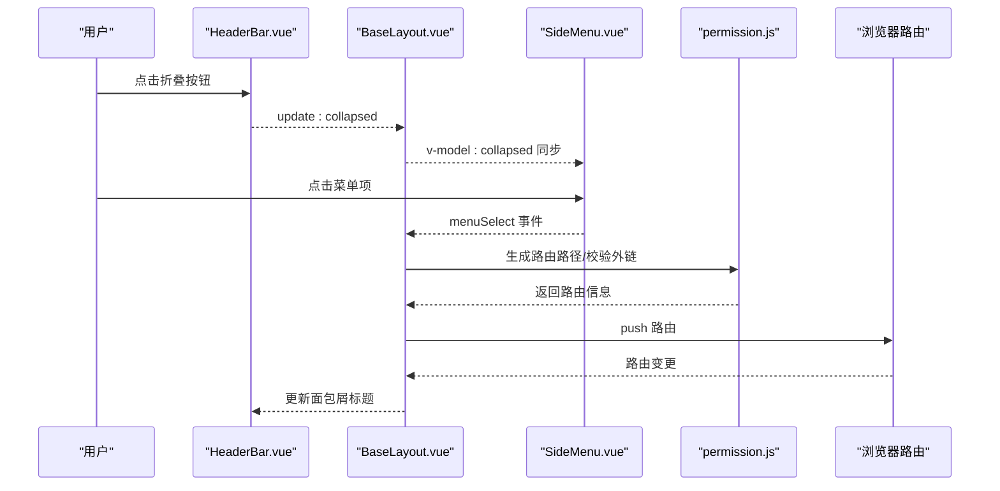
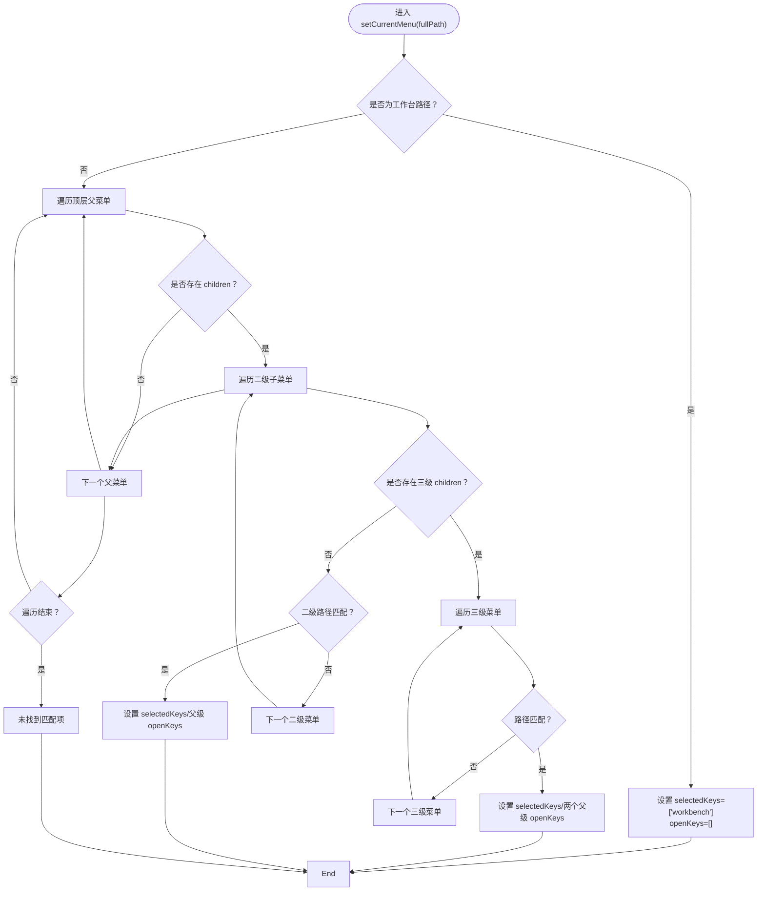
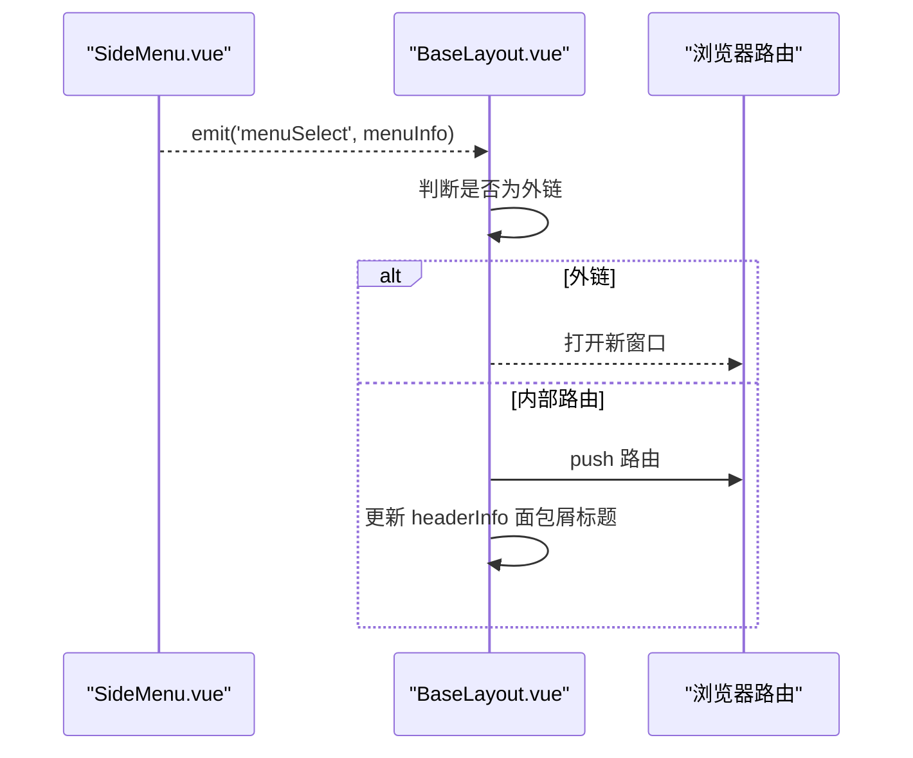
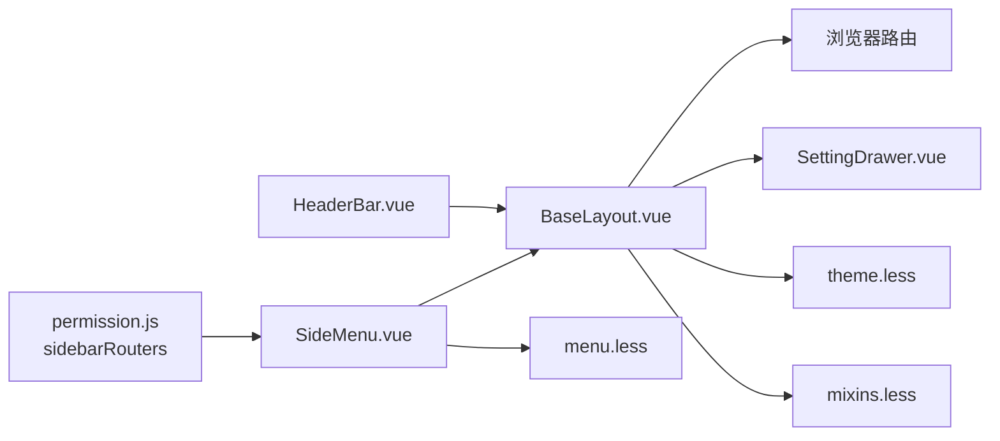

# 侧边栏布局

<cite>
**本文引用的文件**
- [BaseLayout.vue](file://bear-jia-vue3/src/layout/BaseLayout.vue)
- [SideMenu.vue](file://bear-jia-vue3/src/components/layout/SideMenu.vue)
- [HeaderBar.vue](file://bear-jia-vue3/src/components/layout/HeaderBar.vue)
- [permission.js](file://bear-jia-vue3/src/stores/permission.js)
- [menu.less](file://bear-jia-vue3/src/style/components/menu.less)
- [theme.less](file://bear-jia-vue3/src/style/theme.less)
- [mixins.less](file://bear-jia-vue3/src/style/mixins.less)
- [SettingDrawer.vue](file://bear-jia-vue3/src/components/layout/SettingDrawer.vue)
</cite>

## 目录
1. [简介](#简介)
2. [项目结构](#项目结构)
3. [核心组件](#核心组件)
4. [架构总览](#架构总览)
5. [详细组件分析](#详细组件分析)
6. [依赖关系分析](#依赖关系分析)
7. [性能考量](#性能考量)
8. [故障排查指南](#故障排查指南)
9. [结论](#结论)
10. [附录](#附录)

## 简介
本文件面向企业级管理系统，系统性阐述“侧边栏布局”模式的UI结构与交互逻辑，重点覆盖：
- SideMenu.vue 如何实现菜单的递归渲染与选中状态管理
- BaseLayout.vue 通过 v-if 条件渲染实现侧边栏布局的切换机制
- 菜单折叠展开的实现原理（含 CSS 过渡动画与 JavaScript 状态控制）
- 不同屏幕尺寸下的响应式表现与 HeaderBar.vue 的协同工作机制
- 通过 layoutSettings 中 navMode 属性设置为 'side' 启用该布局模式的实际方法

该布局适用于需要多级菜单导航的企业级后台系统，强调清晰的层级关系与稳定的交互体验。

## 项目结构
侧边栏布局由三层协作构成：
- 布局容器层：BaseLayout.vue 负责根据 layoutSettings.navMode 切换不同布局模式，并承载 HeaderBar 与 SideMenu
- 菜单渲染层：SideMenu.vue 负责递归渲染多级菜单、维护选中与展开状态、处理外链跳转
- 头部协同层：HeaderBar.vue 提供折叠按钮、面包屑标题、用户下拉等头部功能，并与侧边栏联动

图表来源
- [BaseLayout.vue](file://bear-jia-vue3/src/layout/BaseLayout.vue#L1-L120)
- [SideMenu.vue](file://bear-jia-vue3/src/components/layout/SideMenu.vue#L1-L125)
- [HeaderBar.vue](file://bear-jia-vue3/src/components/layout/HeaderBar.vue#L1-L120)
- [permission.js](file://bear-jia-vue3/src/stores/permission.js#L210-L263)
- [SettingDrawer.vue](file://bear-jia-vue3/src/components/layout/SettingDrawer.vue#L34-L96)
- [menu.less](file://bear-jia-vue3/src/style/components/menu.less#L1-L172)
- [theme.less](file://bear-jia-vue3/src/style/theme.less#L1-L148)
- [mixins.less](file://bear-jia-vue3/src/style/mixins.less#L216-L256)

章节来源
- [BaseLayout.vue](file://bear-jia-vue3/src/layout/BaseLayout.vue#L1-L120)
- [SideMenu.vue](file://bear-jia-vue3/src/components/layout/SideMenu.vue#L1-L125)
- [HeaderBar.vue](file://bear-jia-vue3/src/components/layout/HeaderBar.vue#L1-L120)
- [permission.js](file://bear-jia-vue3/src/stores/permission.js#L210-L263)

## 核心组件
- BaseLayout.vue
  - 依据 layoutSettings.navMode 切换布局模式（side/top/mix/column/drawer）
  - 作为容器承载 HeaderBar 与 SideMenu，并负责菜单选中事件的处理与路由跳转
  - 维护折叠状态 collapsed 与头部标题 headerInfo
- SideMenu.vue
  - 以 Ant Design Menu 组件为核心，支持 inline 模式与多级子菜单
  - 维护 selectedKeys/openKeys 实现选中与展开状态
  - 处理外链菜单的新开窗口跳转
- HeaderBar.vue
  - 提供侧边栏折叠按钮（在 side/mix 模式下）
  - 展示面包屑标题 currentFatherMenuTitle/currentMenuTitle
  - 与 BaseLayout 通过 v-model:collapsed 协同控制折叠状态

章节来源
- [BaseLayout.vue](file://bear-jia-vue3/src/layout/BaseLayout.vue#L1-L120)
- [SideMenu.vue](file://bear-jia-vue3/src/components/layout/SideMenu.vue#L1-L125)
- [HeaderBar.vue](file://bear-jia-vue3/src/components/layout/HeaderBar.vue#L1-L120)

## 架构总览
侧边栏布局的核心流程如下：
- BaseLayout 读取 layoutSettings.navMode，当 navMode 为 'side' 时渲染侧边栏布局
- SideMenu 接收 menuData（来自 permissionStore.sidebarRouters），基于菜单树进行递归渲染
- HeaderBar 提供折叠按钮，通过 v-model:collapsed 与 BaseLayout/SideMenu 同步
- 用户点击菜单项触发 BaseLayout.handleMenuSelect，完成路由跳转与标题更新

图表来源
- [BaseLayout.vue](file://bear-jia-vue3/src/layout/BaseLayout.vue#L288-L356)
- [SideMenu.vue](file://bear-jia-vue3/src/components/layout/SideMenu.vue#L127-L215)
- [HeaderBar.vue](file://bear-jia-vue3/src/components/layout/HeaderBar.vue#L325-L359)
- [permission.js](file://bear-jia-vue3/src/stores/permission.js#L234-L263)

## 详细组件分析

### SideMenu.vue：递归渲染与选中状态管理
- 递归渲染策略
  - 顶层父菜单：根据 children 数量与 alwaysShow 标记决定是否渲染为 SubMenu 或直接渲染 MenuItem
  - 二级菜单：若存在 children 则渲染为 SubMenu；否则直接渲染 MenuItem
  - 三级菜单：在二级 SubMenu 内部逐项渲染 MenuItem
  - 外链菜单：通过 isExternal 判断，点击时在新窗口打开，不触发路由跳转
- 选中与展开状态
  - selectedKeys：当前选中的菜单项键集合
  - openKeys：当前展开的父级菜单键集合
  - handleOpenChange：限制同时展开层级，确保只保留最新一层
  - setCurrentMenu：根据当前路由路径精确匹配并设置选中/展开状态
- 事件与交互
  - handleMenuClick：处理二级菜单点击，设置选中与展开，并通过 menuSelect 事件向上抛出
  - handleThreeLevelMenuClick：处理三级菜单点击，设置选中与展开，并通过 menuSelect 事件向上抛出

图表来源
- [SideMenu.vue](file://bear-jia-vue3/src/components/layout/SideMenu.vue#L216-L306)

章节来源
- [SideMenu.vue](file://bear-jia-vue3/src/components/layout/SideMenu.vue#L1-L125)
- [SideMenu.vue](file://bear-jia-vue3/src/components/layout/SideMenu.vue#L127-L215)
- [SideMenu.vue](file://bear-jia-vue3/src/components/layout/SideMenu.vue#L216-L306)

### BaseLayout.vue：v-if 条件渲染与菜单切换机制
- 布局切换
  - v-if="!layoutSettings.navMode || layoutSettings.navMode === 'side'" 渲染侧边栏布局
  - v-else-if 等分支渲染顶部菜单、混合布局、分栏布局与抽屉布局
- 菜单事件处理
  - @menu-select="handleMenuSelect" 接收来自 SideMenu 的菜单选择事件
  - clickMenuItem/clickThreeLevelMenuItem：根据菜单类型与外链判断执行路由跳转或外链打开
- 路由与标题
  - watch 路由变化，调用 updateMenuActiveState 以同步菜单激活状态
  - 更新 headerInfo.currentFatherMenuTitle/currentMenuTitle 以显示面包屑标题

图表来源
- [BaseLayout.vue](file://bear-jia-vue3/src/layout/BaseLayout.vue#L592-L730)
- [BaseLayout.vue](file://bear-jia-vue3/src/layout/BaseLayout.vue#L796-L820)

章节来源
- [BaseLayout.vue](file://bear-jia-vue3/src/layout/BaseLayout.vue#L1-L120)
- [BaseLayout.vue](file://bear-jia-vue3/src/layout/BaseLayout.vue#L288-L356)
- [BaseLayout.vue](file://bear-jia-vue3/src/layout/BaseLayout.vue#L592-L730)
- [BaseLayout.vue](file://bear-jia-vue3/src/layout/BaseLayout.vue#L796-L820)

### HeaderBar.vue：折叠按钮与面包屑协同
- 折叠按钮
  - 在 side/mix 模式下显示折叠/展开图标，点击触发 HeaderBar.emit('update:collapsed', !collapsed)
  - BaseLayout 与 SideMenu 通过 v-model:collapsed 接收并同步折叠状态
- 面包屑标题
  - 展示 currentFatherMenuTitle/currentMenuTitle，随路由变化更新
- 与侧边栏的协同
  - HeaderBar 与 SideMenu 的主题一致（通过 layoutSettings.darkMode 控制）

章节来源
- [HeaderBar.vue](file://bear-jia-vue3/src/components/layout/HeaderBar.vue#L1-L120)
- [HeaderBar.vue](file://bear-jia-vue3/src/components/layout/HeaderBar.vue#L325-L359)

### 菜单折叠展开：CSS 过渡与 JS 状态控制
- 折叠控制
  - SideMenu.vue 使用 :collapsed 与 collapsible 属性控制侧边栏宽度与内容显示
  - HeaderBar.vue 的折叠按钮通过 v-model:collapsed 与 BaseLayout 同步
- CSS 样式
  - menu.less 中定义了侧边栏滚动条、亮/暗主题菜单样式
  - theme.less 定义了主题变量，支持暗色模式与色弱模式
  - mixins.less 提供响应式断点与工具 mixin，便于在不同屏幕尺寸下调整布局

章节来源
- [SideMenu.vue](file://bear-jia-vue3/src/components/layout/SideMenu.vue#L1-L125)
- [HeaderBar.vue](file://bear-jia-vue3/src/components/layout/HeaderBar.vue#L325-L359)
- [menu.less](file://bear-jia-vue3/src/style/components/menu.less#L1-L172)
- [theme.less](file://bear-jia-vue3/src/style/theme.less#L1-L148)
- [mixins.less](file://bear-jia-vue3/src/style/mixins.less#L216-L256)

### 响应式表现与 HeaderBar.vue 协同
- 响应式断点
  - mixins.less 定义 xs/sm/md/lg/xl 断点，可用于在 Less 中按需调整布局细节
- HeaderBar.vue 的自适应
  - 根据 navMode 切换布局类名，控制左右区域宽度与 logo/标题展示
  - 在 side/mix 模式下显示折叠按钮，在 drawer 模式下显示菜单按钮

章节来源
- [mixins.less](file://bear-jia-vue3/src/style/mixins.less#L216-L256)
- [HeaderBar.vue](file://bear-jia-vue3/src/components/layout/HeaderBar.vue#L267-L277)

### 通过 layoutSettings 启用侧边栏布局
- 设置方式
  - 在应用布局设置中将 navMode 设为 'side'，即可启用侧边栏布局
  - SettingDrawer.vue 提供可视化切换导航模式，包括 side/top/mix/column/drawer
- 默认行为
  - BaseLayout.vue 默认使用侧边栏布局（当 navMode 未设置或为 'side'）

章节来源
- [BaseLayout.vue](file://bear-jia-vue3/src/layout/BaseLayout.vue#L288-L356)
- [SettingDrawer.vue](file://bear-jia-vue3/src/components/layout/SettingDrawer.vue#L34-L96)

## 依赖关系分析
- 数据来源
  - permissionStore.sidebarRouters：动态生成的菜单树，作为 SideMenu 的 menuData
- 组件耦合
  - BaseLayout 与 SideMenu 通过 v-model:collapsed 与 @menu-select 事件双向通信
  - HeaderBar 与 BaseLayout 通过 v-model:collapsed 协同控制折叠
- 样式依赖
  - menu.less 与 theme.less/mixins.less 共同提供菜单主题与响应式能力

图表来源
- [permission.js](file://bear-jia-vue3/src/stores/permission.js#L234-L263)
- [SideMenu.vue](file://bear-jia-vue3/src/components/layout/SideMenu.vue#L1-L125)
- [BaseLayout.vue](file://bear-jia-vue3/src/layout/BaseLayout.vue#L1-L120)
- [HeaderBar.vue](file://bear-jia-vue3/src/components/layout/HeaderBar.vue#L1-L120)
- [SettingDrawer.vue](file://bear-jia-vue3/src/components/layout/SettingDrawer.vue#L34-L96)
- [menu.less](file://bear-jia-vue3/src/style/components/menu.less#L1-L172)
- [theme.less](file://bear-jia-vue3/src/style/theme.less#L1-L148)
- [mixins.less](file://bear-jia-vue3/src/style/mixins.less#L216-L256)

## 性能考量
- 菜单渲染
  - 采用递归渲染，建议控制菜单层级深度，避免过深导致渲染压力
  - 外链菜单直接在新窗口打开，减少不必要的路由切换
- 状态管理
  - selectedKeys/openKeys 仅在必要时更新，避免频繁重渲染
  - BaseLayout.watch 路由变化后再更新菜单激活状态，减少抖动
- 样式与主题
  - 使用 CSS 变量与 mixin，减少重复样式定义，提升主题切换性能

[本节为通用指导，无需列出具体文件来源]

## 故障排查指南
- 菜单不显示或空白
  - 检查 permissionStore.sidebarRouters 是否正确生成并传递给 SideMenu
  - 确认菜单树结构是否包含 children 字段，以及 meta.title/meta.icon 是否存在
- 菜单无法选中
  - 检查 BaseLayout.updateMenuActiveState 是否被路由监听触发
  - 确认 SideMenu.setCurrentMenu 的路径匹配逻辑与路由路径一致
- 折叠按钮无效
  - 检查 HeaderBar.vue 的 update:collapsed 事件是否正确传递至 BaseLayout
  - 确认 BaseLayout 与 SideMenu 的 v-model:collapsed 是否同步
- 外链点击无反应
  - 确认 isExternal 判断逻辑与菜单 path 是否为外链
  - 若为外链，应直接在新窗口打开，不应触发路由跳转

章节来源
- [permission.js](file://bear-jia-vue3/src/stores/permission.js#L234-L263)
- [BaseLayout.vue](file://bear-jia-vue3/src/layout/BaseLayout.vue#L796-L820)
- [SideMenu.vue](file://bear-jia-vue3/src/components/layout/SideMenu.vue#L216-L306)
- [HeaderBar.vue](file://bear-jia-vue3/src/components/layout/HeaderBar.vue#L325-L359)

## 结论
侧边栏布局通过 BaseLayout 的条件渲染与 HeaderBar 的折叠协同，结合 SideMenu 的递归渲染与状态管理，为企业级系统提供了稳定、清晰且可扩展的导航体验。配合 layoutSettings.navMode='side' 的配置与 SettingDrawer 的可视化设置，开发者可快速启用并定制该布局模式，满足多级菜单导航的复杂业务需求。

[本节为总结性内容，无需列出具体文件来源]

## 附录
- 启用侧边栏布局
  - 在应用布局设置中将 navMode 设为 'side'
  - 或在 SettingDrawer 中选择侧边菜单布局图标
- 适用场景
  - 需要多级菜单导航的企业后台系统
  - 对菜单层级与面包屑标题有明确要求的管理平台

章节来源
- [BaseLayout.vue](file://bear-jia-vue3/src/layout/BaseLayout.vue#L288-L356)
- [SettingDrawer.vue](file://bear-jia-vue3/src/components/layout/SettingDrawer.vue#L34-L96)