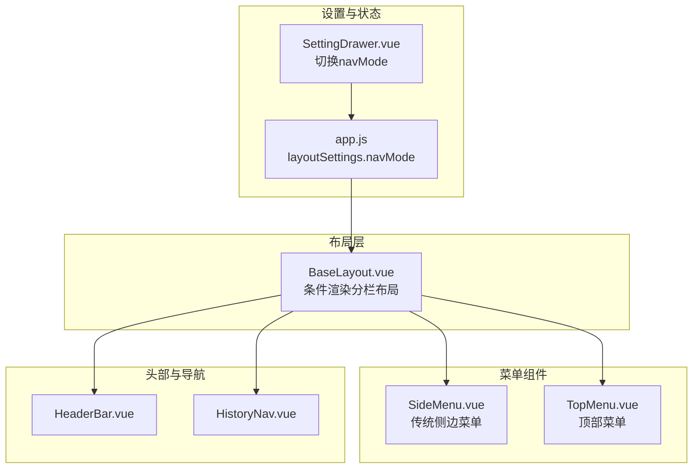
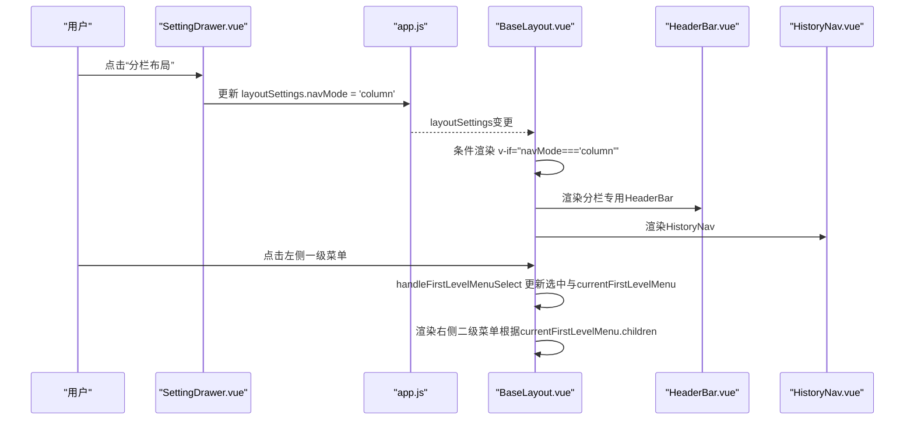
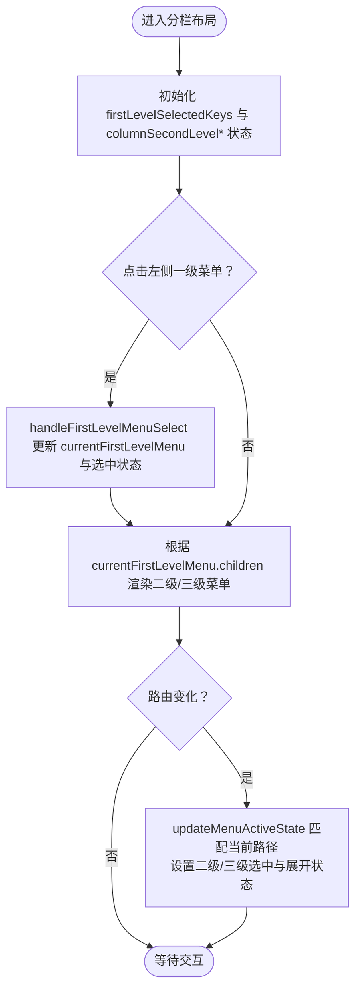
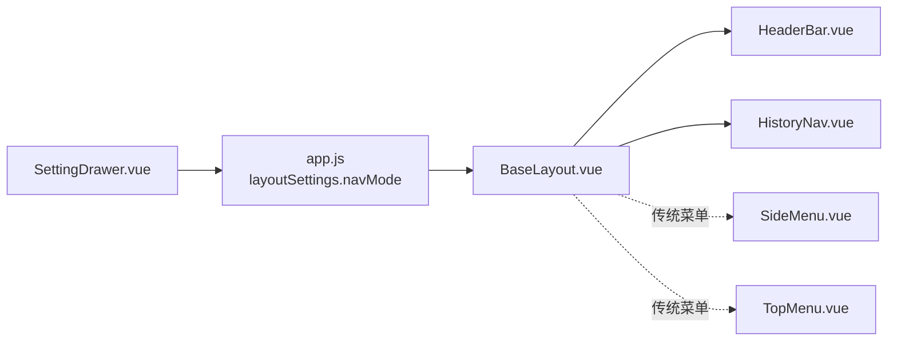

# 分栏布局

<cite>
**本文引用的文件**
- [BaseLayout.vue](file://bear-jia-vue3/src/layout/BaseLayout.vue)
- [SideMenu.vue](file://bear-jia-vue3/src/components/layout/SideMenu.vue)
- [TopMenu.vue](file://bear-jia-vue3/src/components/layout/TopMenu.vue)
- [SettingDrawer.vue](file://bear-jia-vue3/src/components/layout/SettingDrawer.vue)
- [app.js](file://bear-jia-vue3/src/stores/app.js)
- [HeaderBar.vue](file://bear-jia-vue3/src/components/layout/HeaderBar.vue)
- [HistoryNav.vue](file://bear-jia-vue3/src/components/layout/HistoryNav.vue)
</cite>

## 目录
1. [简介](#简介)
2. [项目结构](#项目结构)
3. [核心组件](#核心组件)
4. [架构总览](#架构总览)
5. [详细组件分析](#详细组件分析)
6. [依赖关系分析](#依赖关系分析)
7. [性能与响应式特性](#性能与响应式特性)
8. [故障排查指南](#故障排查指南)
9. [结论](#结论)
10. [附录](#附录)

## 简介
本文件面向需要在管理后台中快速切换多个一级业务模块的场景，系统性说明“分栏布局”模式的UI结构、交互逻辑与实现要点。该模式通过BaseLayout.vue中的条件渲染，启用“顶部多标签分栏显示”的双列菜单体系：左侧为一级菜单（顶部多标签），右侧为二级/三级菜单（分栏内菜单）。同时，内容区域采用独立头部与历史导航条，配合路由跳转实现模块间快速切换与定位。

## 项目结构
分栏布局位于布局层，由BaseLayout.vue根据layoutSettings.navMode动态选择渲染分支；菜单组件SideMenu.vue与TopMenu.vue分别用于传统侧边与顶部菜单场景；SettingDrawer.vue提供可视化切换入口；应用状态由Pinia store app.js维护。

图表来源
- [BaseLayout.vue](file://bear-jia-vue3/src/layout/BaseLayout.vue#L88-L215)
- [SettingDrawer.vue](file://bear-jia-vue3/src/components/layout/SettingDrawer.vue#L63-L96)
- [app.js](file://bear-jia-vue3/src/stores/app.js#L13-L28)
- [HeaderBar.vue](file://bear-jia-vue3/src/components/layout/HeaderBar.vue)
- [HistoryNav.vue](file://bear-jia-vue3/src/components/layout/HistoryNav.vue)

章节来源
- [BaseLayout.vue](file://bear-jia-vue3/src/layout/BaseLayout.vue#L88-L215)
- [SettingDrawer.vue](file://bear-jia-vue3/src/components/layout/SettingDrawer.vue#L63-L96)
- [app.js](file://bear-jia-vue3/src/stores/app.js#L13-L28)

## 核心组件
- BaseLayout.vue：根据layoutSettings.navMode选择渲染分支，其中分栏布局包含“一级菜单栏（左侧）+ 二级菜单栏（中间）+ 内容区域（右侧）”，并引入HeaderBar与HistoryNav。
- SideMenu.vue：传统侧边菜单，支持工作台、父子三级菜单的渲染与激活状态同步。
- TopMenu.vue：顶部横向菜单，支持工作台与父子三级菜单的渲染与激活状态同步。
- SettingDrawer.vue：提供布局切换入口，支持将navMode设为'column'以启用分栏布局。
- app.js：Pinia store，保存layoutSettings.navMode等全局布局设置，并持久化到localStorage。

章节来源
- [BaseLayout.vue](file://bear-jia-vue3/src/layout/BaseLayout.vue#L88-L215)
- [SideMenu.vue](file://bear-jia-vue3/src/components/layout/SideMenu.vue#L1-L125)
- [TopMenu.vue](file://bear-jia-vue3/src/components/layout/TopMenu.vue#L1-L82)
- [SettingDrawer.vue](file://bear-jia-vue3/src/components/layout/SettingDrawer.vue#L63-L96)
- [app.js](file://bear-jia-vue3/src/stores/app.js#L13-L28)

## 架构总览
分栏布局的核心思想是“顶部多标签分栏显示”。BaseLayout.vue在检测到navMode为'column'时，渲染三列结构：
- 左侧：一级菜单栏（仅显示图标与提示，选中状态由firstLevelSelectedKeys控制）
- 中间：二级菜单栏（根据当前一级菜单动态生成，支持二级/三级菜单）
- 右侧：内容区域（含HeaderBar与HistoryNav）

图表来源
- [SettingDrawer.vue](file://bear-jia-vue3/src/components/layout/SettingDrawer.vue#L63-L96)
- [app.js](file://bear-jia-vue3/src/stores/app.js#L66-L88)
- [BaseLayout.vue](file://bear-jia-vue3/src/layout/BaseLayout.vue#L88-L215)
- [HeaderBar.vue](file://bear-jia-vue3/src/components/layout/HeaderBar.vue)
- [HistoryNav.vue](file://bear-jia-vue3/src/components/layout/HistoryNav.vue)

## 详细组件分析

### BaseLayout.vue（分栏布局）
- 分栏布局分支：当layoutSettings.navMode为'column'时，渲染包含一级菜单栏、二级菜单栏与内容区域的三列结构。
- 一级菜单栏（左侧）：使用Ant Design的Menu组件，遍历sidebarRouters生成菜单项，点击事件触发handleFirstLevelMenuSelect，更新firstLevelSelectedKeys与currentFirstLevelMenu。
- 二级菜单栏（中间）：根据currentFirstLevelMenu.children动态生成，支持以下三种情况：
  - 有多个三级菜单或设置了alwaysShow的二级菜单：渲染为Submenu，展开时显示三级菜单列表。
  - 仅有一个三级菜单且设置了alwaysShow：同样渲染为Submenu。
  - 无三级菜单的二级菜单：渲染为普通MenuItem。
- 内容区域（右侧）：包含分栏专用HeaderBar与HistoryNav，router-view承载页面内容。
- 菜单激活状态：在更新路由后，通过updateMenuActiveState逻辑，基于当前路径匹配二级/三级菜单并设置columnSecondLevelSelectedKeys与columnSecondLevelOpenKeys。

图表来源
- [BaseLayout.vue](file://bear-jia-vue3/src/layout/BaseLayout.vue#L88-L215)
- [BaseLayout.vue](file://bear-jia-vue3/src/layout/BaseLayout.vue#L866-L890)

章节来源
- [BaseLayout.vue](file://bear-jia-vue3/src/layout/BaseLayout.vue#L88-L215)
- [BaseLayout.vue](file://bear-jia-vue3/src/layout/BaseLayout.vue#L866-L890)

### SideMenu.vue（传统侧边菜单）
- 支持工作台、父子三级菜单的渲染与激活状态同步。
- 通过selectedKeys与openKeys维护当前选中与展开状态，点击事件通过emit传递给父组件。
- 对外暴露setCurrentMenu方法，供外部根据当前路由路径设置激活状态。

章节来源
- [SideMenu.vue](file://bear-jia-vue3/src/components/layout/SideMenu.vue#L1-L125)
- [SideMenu.vue](file://bear-jia-vue3/src/components/layout/SideMenu.vue#L216-L306)

### TopMenu.vue（顶部菜单）
- 支持工作台与父子三级菜单的渲染与激活状态同步。
- 通过selectedKeys与openKeys维护当前选中与展开状态，点击事件通过emit传递给父组件。
- 对外暴露setCurrentMenu方法，供外部根据当前路由路径设置激活状态。

章节来源
- [TopMenu.vue](file://bear-jia-vue3/src/components/layout/TopMenu.vue#L1-L82)
- [TopMenu.vue](file://bear-jia-vue3/src/components/layout/TopMenu.vue#L112-L164)

### SettingDrawer.vue（布局切换入口）
- 提供布局切换按钮，点击后调用handleNavModeChange更新navMode，从而驱动BaseLayout.vue的条件渲染分支。

章节来源
- [SettingDrawer.vue](file://bear-jia-vue3/src/components/layout/SettingDrawer.vue#L63-L96)

### app.js（布局设置与持久化）
- 默认navMode为'side'，支持通过updateSettings更新navMode并持久化到localStorage。
- 应用主题时使用主题服务，但navMode与布局设置由localStorage直接生效。

章节来源
- [app.js](file://bear-jia-vue3/src/stores/app.js#L13-L28)
- [app.js](file://bear-jia-vue3/src/stores/app.js#L66-L88)

## 依赖关系分析
- BaseLayout.vue依赖：
  - layoutSettings来自app.js，决定渲染分支。
  - HeaderBar与HistoryNav作为内容区头部与历史导航。
  - SideMenu与TopMenu作为传统布局的菜单组件（在分栏布局中不直接使用，但同属布局体系）。
- SettingDrawer.vue依赖app.js的layoutSettings，通过updateSettings修改navMode。
- SideMenu.vue与TopMenu.vue均依赖menuData与外部事件，用于菜单渲染与激活状态同步。

图表来源
- [app.js](file://bear-jia-vue3/src/stores/app.js#L13-L28)
- [BaseLayout.vue](file://bear-jia-vue3/src/layout/BaseLayout.vue#L88-L215)
- [SettingDrawer.vue](file://bear-jia-vue3/src/components/layout/SettingDrawer.vue#L63-L96)
- [HeaderBar.vue](file://bear-jia-vue3/src/components/layout/HeaderBar.vue)
- [HistoryNav.vue](file://bear-jia-vue3/src/components/layout/HistoryNav.vue)
- [SideMenu.vue](file://bear-jia-vue3/src/components/layout/SideMenu.vue#L1-L125)
- [TopMenu.vue](file://bear-jia-vue3/src/components/layout/TopMenu.vue#L1-L82)

章节来源
- [app.js](file://bear-jia-vue3/src/stores/app.js#L13-L28)
- [BaseLayout.vue](file://bear-jia-vue3/src/layout/BaseLayout.vue#L88-L215)
- [SettingDrawer.vue](file://bear-jia-vue3/src/components/layout/SettingDrawer.vue#L63-L96)

## 性能与响应式特性
- 菜单渲染策略：分栏布局的二级/三级菜单按需渲染，仅在currentFirstLevelMenu存在时生成，减少不必要的DOM。
- 激活状态匹配：updateMenuActiveState在路由变化后进行一次匹配，避免重复计算。
- 交互反馈：点击一级菜单后立即更新选中状态，提升视觉反馈；二级菜单的展开状态与选中状态联动，便于用户定位当前模块。
- 响应式布局：分栏布局的宽度通过a-layout-sider的width属性固定，保证左右两列的稳定布局。

章节来源
- [BaseLayout.vue](file://bear-jia-vue3/src/layout/BaseLayout.vue#L88-L215)
- [BaseLayout.vue](file://bear-jia-vue3/src/layout/BaseLayout.vue#L866-L890)

## 故障排查指南
- 无法切换到分栏布局
  - 检查SettingDrawer.vue是否正确调用handleNavModeChange更新navMode。
  - 检查app.js的updateSettings是否持久化了navMode。
  - 确认BaseLayout.vue的条件渲染分支是否命中'column'。
- 二级/三级菜单不显示
  - 检查currentFirstLevelMenu是否存在且包含children。
  - 检查菜单项的alwaysShow与children数量逻辑是否满足渲染Submenu的条件。
- 菜单激活状态不正确
  - 检查updateMenuActiveState的路径匹配逻辑，确认路由路径与菜单项路径一致。
  - 确认router-view已正确渲染目标页面，以便匹配当前路径。
- 外链菜单无法跳转
  - 分栏布局的菜单点击会触发handleMenuSelect，若为外链，应由父组件逻辑处理外链打开；请检查handleMenuSelect与clickMenuItem/clickThreeLevelMenuItem的外链判断逻辑。

章节来源
- [SettingDrawer.vue](file://bear-jia-vue3/src/components/layout/SettingDrawer.vue#L63-L96)
- [app.js](file://bear-jia-vue3/src/stores/app.js#L66-L88)
- [BaseLayout.vue](file://bear-jia-vue3/src/layout/BaseLayout.vue#L88-L215)
- [BaseLayout.vue](file://bear-jia-vue3/src/layout/BaseLayout.vue#L562-L730)
- [BaseLayout.vue](file://bear-jia-vue3/src/layout/BaseLayout.vue#L866-L890)

## 结论
分栏布局通过“顶部多标签分栏显示”的双列菜单体系，显著提升了多一级业务模块场景下的导航效率。BaseLayout.vue在navMode='column'时，将一级菜单置于左侧，二级/三级菜单置于中间，右侧为内容区，配合HeaderBar与HistoryNav形成清晰的层级与上下文。SettingDrawer.vue与app.js共同提供了便捷的布局切换与持久化能力。对于需要快速切换多个一级模块的管理系统，分栏布局是一个高效实用的选择。

## 附录

### 如何启用分栏布局
- 在界面设置抽屉中选择“分栏布局”，或通过编程方式更新layoutSettings.navMode为'column'，随后BaseLayout.vue将自动渲染分栏布局分支。

章节来源
- [SettingDrawer.vue](file://bear-jia-vue3/src/components/layout/SettingDrawer.vue#L63-L96)
- [app.js](file://bear-jia-vue3/src/stores/app.js#L66-L88)
- [BaseLayout.vue](file://bear-jia-vue3/src/layout/BaseLayout.vue#L88-L215)