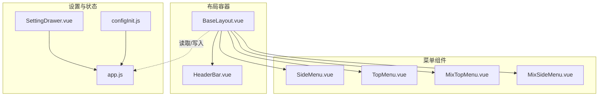
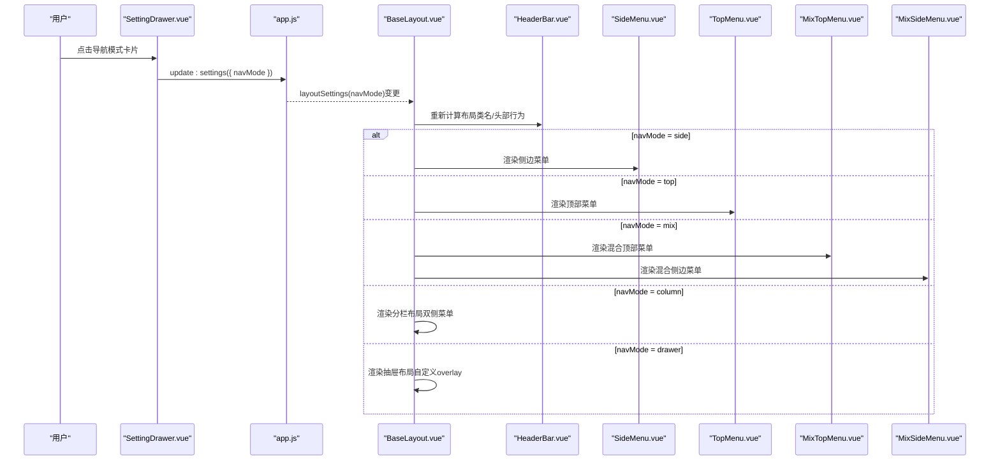
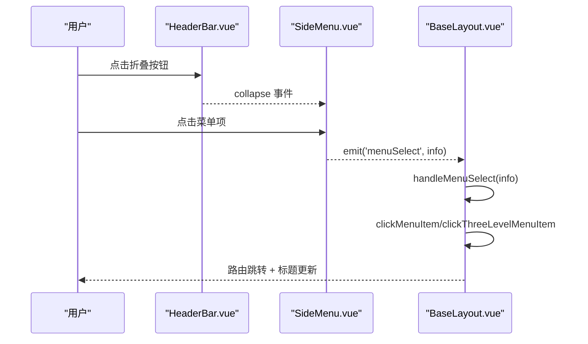
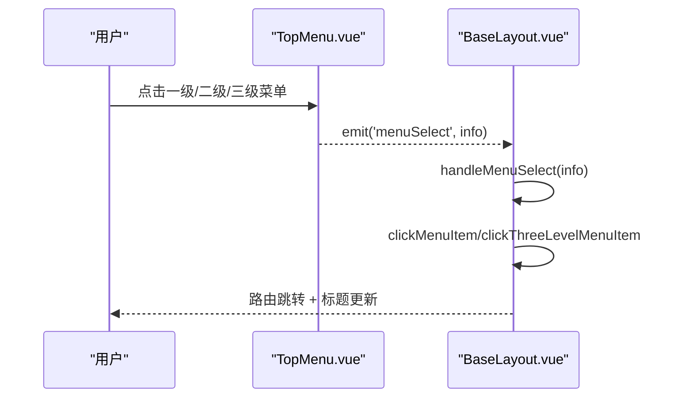
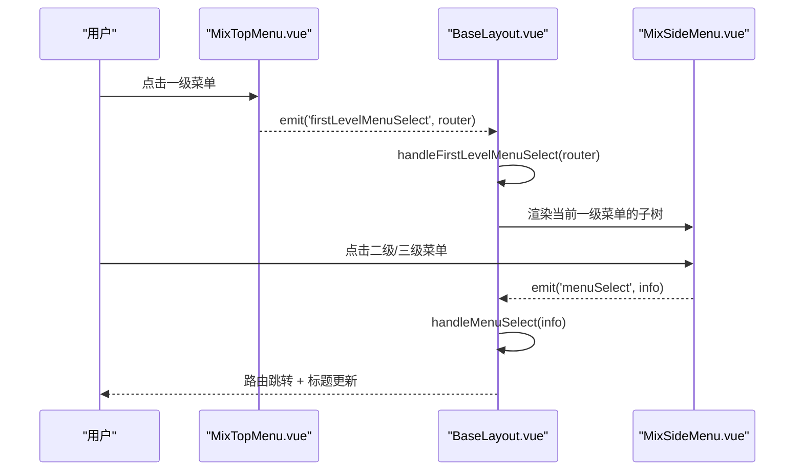
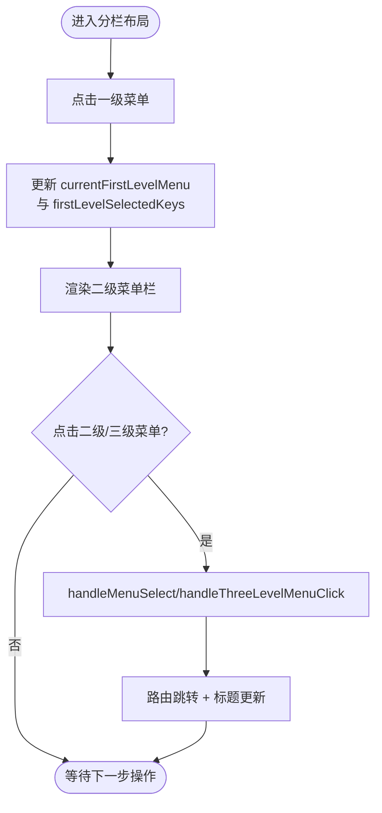
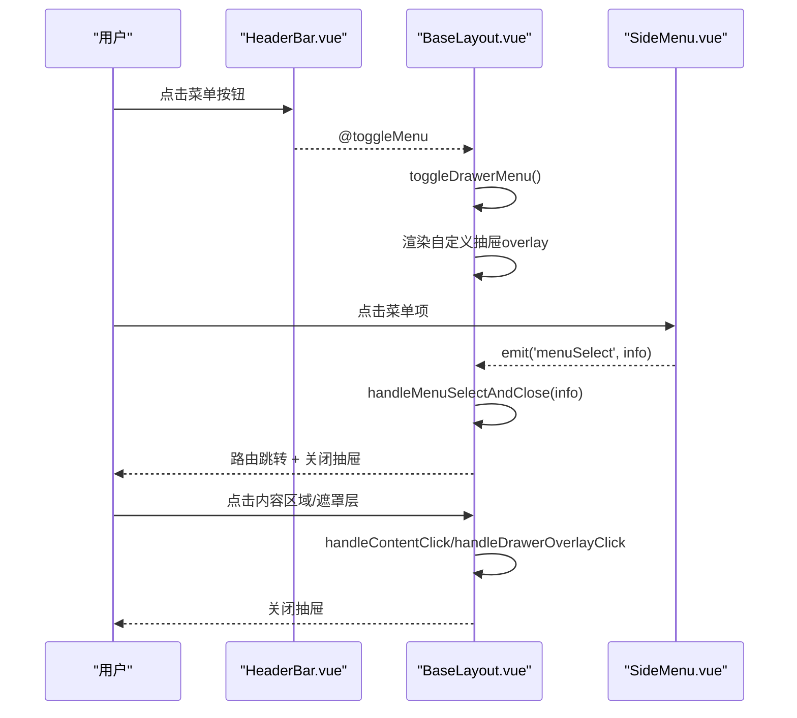
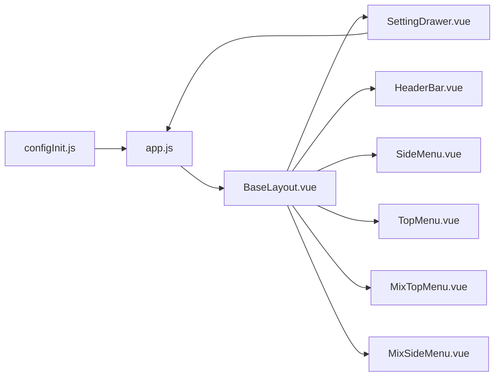

# 布局模式

<cite>
**本文引用的文件**
- [BaseLayout.vue](file://bear-jia-vue3/src/layout/BaseLayout.vue)
- [SideMenu.vue](file://bear-jia-vue3/src/components/layout/SideMenu.vue)
- [TopMenu.vue](file://bear-jia-vue3/src/components/layout/TopMenu.vue)
- [MixTopMenu.vue](file://bear-jia-vue3/src/components/layout/MixTopMenu.vue)
- [MixSideMenu.vue](file://bear-jia-vue3/src/components/layout/MixSideMenu.vue)
- [HeaderBar.vue](file://bear-jia-vue3/src/components/layout/HeaderBar.vue)
- [SettingDrawer.vue](file://bear-jia-vue3/src/components/layout/SettingDrawer.vue)
- [app.js](file://bear-jia-vue3/src/stores/app.js)
- [configInit.js](file://bear-jia-vue3/src/utils/configInit.js)
- [themeConfig.js](file://bear-jia-vue3/src/utils/theme/themeConfig.js)
</cite>

## 目录
1. [简介](#简介)
2. [项目结构](#项目结构)
3. [核心组件](#核心组件)
4. [架构总览](#架构总览)
5. [详细组件分析](#详细组件分析)
6. [依赖关系分析](#依赖关系分析)
7. [性能与体验考量](#性能与体验考量)
8. [故障排查指南](#故障排查指南)
9. [结论](#结论)
10. [附录](#附录)

## 简介
本文件系统性梳理项目支持的五种布局模式：侧边栏、顶部菜单、混合、分栏和抽屉。围绕 BaseLayout.vue 的 v-if 条件渲染机制，解释各模式的 UI 结构、交互逻辑与数据流；结合菜单组件与设置抽屉，说明如何通过 layoutSettings 中的 navMode 属性动态切换布局，并给出在不同屏幕尺寸下的表现差异与最佳实践建议。

## 项目结构
- 布局入口与模式切换
  - BaseLayout.vue 作为顶层布局容器，依据 layoutSettings.navMode 渲染不同布局分支。
- 菜单与头部
  - HeaderBar.vue 提供统一头部区域，包含折叠/展开、菜单切换、个人中心、刷新等能力。
  - SideMenu.vue、TopMenu.vue、MixTopMenu.vue、MixSideMenu.vue 分别对应侧边、顶部、混合顶部与混合侧边的菜单实现。
- 设置抽屉
  - SettingDrawer.vue 提供主题、导航模式、布局设置等可视化配置入口，并通过 update:settings 事件回写到 store。
- 状态与持久化
  - app.js 管理 layoutSettings，默认 navMode 为 'side'，并负责主题与设置的持久化。
  - configInit.js 在应用启动时从 localStorage 加载布局设置并应用主题。

图表来源
- [BaseLayout.vue](file://bear-jia-vue3/src/layout/BaseLayout.vue#L1-L120)
- [HeaderBar.vue](file://bear-jia-vue3/src/components/layout/HeaderBar.vue#L1-L60)
- [SideMenu.vue](file://bear-jia-vue3/src/components/layout/SideMenu.vue#L1-L60)
- [TopMenu.vue](file://bear-jia-vue3/src/components/layout/TopMenu.vue#L1-L60)
- [MixTopMenu.vue](file://bear-jia-vue3/src/components/layout/MixTopMenu.vue#L1-L60)
- [MixSideMenu.vue](file://bear-jia-vue3/src/components/layout/MixSideMenu.vue#L1-L60)
- [SettingDrawer.vue](file://bear-jia-vue3/src/components/layout/SettingDrawer.vue#L1-L120)
- [app.js](file://bear-jia-vue3/src/stores/app.js#L1-L40)
- [configInit.js](file://bear-jia-vue3/src/utils/configInit.js#L1-L40)

章节来源
- [BaseLayout.vue](file://bear-jia-vue3/src/layout/BaseLayout.vue#L1-L120)
- [app.js](file://bear-jia-vue3/src/stores/app.js#L1-L40)
- [configInit.js](file://bear-jia-vue3/src/utils/configInit.js#L1-L40)

## 核心组件
- BaseLayout.vue
  - 通过 layoutSettings.navMode 控制渲染分支，分别挂载侧边栏、顶部菜单、混合、分栏、抽屉五种布局。
  - 统一注入 HeaderBar、HistoryNav、router-view，承载头部、历史导航与内容视图。
- SettingDrawer.vue
  - 提供导航模式切换入口（side/top/mix/column/drawer），并同步更新 layoutSettings。
- app.js
  - 默认 layoutSettings.navMode = 'side'，支持主题色、暗色模式、固定 Header/Sidebar、多页签等设置的持久化与应用。
- configInit.js
  - 应用启动时从 localStorage 加载布局设置并应用主题。

章节来源
- [BaseLayout.vue](file://bear-jia-vue3/src/layout/BaseLayout.vue#L1-L120)
- [SettingDrawer.vue](file://bear-jia-vue3/src/components/layout/SettingDrawer.vue#L48-L120)
- [app.js](file://bear-jia-vue3/src/stores/app.js#L12-L30)
- [configInit.js](file://bear-jia-vue3/src/utils/configInit.js#L16-L30)

## 架构总览
五种布局模式均以 BaseLayout.vue 为根容器，通过 v-if 条件渲染实现“按需加载”。每种模式在 HeaderBar 的配合下，提供一致的头部交互与面包屑/标题展示；菜单组件根据模式职责分别承担一级/二级/三级菜单的渲染与选择。

图表来源
- [SettingDrawer.vue](file://bear-jia-vue3/src/components/layout/SettingDrawer.vue#L554-L571)
- [app.js](file://bear-jia-vue3/src/stores/app.js#L66-L88)
- [BaseLayout.vue](file://bear-jia-vue3/src/layout/BaseLayout.vue#L1-L120)
- [HeaderBar.vue](file://bear-jia-vue3/src/components/layout/HeaderBar.vue#L1-L60)
- [SideMenu.vue](file://bear-jia-vue3/src/components/layout/SideMenu.vue#L1-L60)
- [TopMenu.vue](file://bear-jia-vue3/src/components/layout/TopMenu.vue#L1-L60)
- [MixTopMenu.vue](file://bear-jia-vue3/src/components/layout/MixTopMenu.vue#L1-L60)
- [MixSideMenu.vue](file://bear-jia-vue3/src/components/layout/MixSideMenu.vue#L1-L60)

## 详细组件分析

### 侧边栏布局（side）
- UI 结构
  - 左侧为 SideMenu.vue，支持 inline 模式、父子菜单展开、外链标识等。
  - 右侧为 HeaderBar + HistoryNav + router-view 的内容区。
- 交互逻辑
  - HeaderBar 提供折叠/展开按钮，SideMenu 支持 openKeys 与 selectedKeys 管理展开与选中状态。
  - 菜单点击通过 emit('menuSelect') 传递给 BaseLayout，再由 handleMenuSelect 统一处理路由跳转与标题更新。
- 适用场景与体验
  - 适合功能层级较深、需要快速定位与切换的后台系统；折叠后节省空间，适合大屏桌面端。
- 不同屏幕尺寸
  - 小屏设备上建议使用抽屉或顶部菜单模式以提升可读性。

图表来源
- [HeaderBar.vue](file://bear-jia-vue3/src/components/layout/HeaderBar.vue#L1-L60)
- [SideMenu.vue](file://bear-jia-vue3/src/components/layout/SideMenu.vue#L120-L215)
- [BaseLayout.vue](file://bear-jia-vue3/src/layout/BaseLayout.vue#L592-L730)

章节来源
- [BaseLayout.vue](file://bear-jia-vue3/src/layout/BaseLayout.vue#L1-L60)
- [SideMenu.vue](file://bear-jia-vue3/src/components/layout/SideMenu.vue#L1-L120)
- [HeaderBar.vue](file://bear-jia-vue3/src/components/layout/HeaderBar.vue#L1-L60)

### 顶部菜单布局（top）
- UI 结构
  - HeaderBar 顶部放置 TopMenu.vue，横向展示一级菜单，支持下拉显示二级/三级菜单。
- 交互逻辑
  - TopMenu.vue 通过 @select/@openChange 管理选中与展开状态；点击菜单项通过 emit('menuSelect') 通知 BaseLayout。
  - BaseLayout.handleMenuSelect 统一处理路由跳转与标题更新。
- 适用场景与体验
  - 适合导航层级较浅、强调顶部信息流的场景；适合移动端或窄屏环境。
- 不同屏幕尺寸
  - 建议在小屏设备上优先考虑抽屉或混合模式，避免顶部菜单拥挤。

图表来源
- [TopMenu.vue](file://bear-jia-vue3/src/components/layout/TopMenu.vue#L1-L120)
- [BaseLayout.vue](file://bear-jia-vue3/src/layout/BaseLayout.vue#L592-L730)

章节来源
- [TopMenu.vue](file://bear-jia-vue3/src/components/layout/TopMenu.vue#L1-L120)
- [BaseLayout.vue](file://bear-jia-vue3/src/layout/BaseLayout.vue#L29-L53)

### 混合布局（mix）
- UI 结构
  - 顶部为 MixTopMenu.vue，仅展示一级菜单；左侧为 MixSideMenu.vue，展示当前一级菜单的二级/三级菜单。
- 交互逻辑
  - MixTopMenu.vue 通过 emit('firstLevelMenuSelect') 通知 BaseLayout 切换当前一级菜单；BaseLayout.handleFirstLevelMenuSelect 更新 currentFirstLevelMenu 并同步分栏布局选中状态。
  - MixSideMenu.vue 仅渲染当前一级菜单的子树，点击二级/三级菜单通过 emit('menuSelect') 交由 BaseLayout 处理。
- 适用场景与体验
  - 适合“先选一级分类，再看该分类下的二级/三级菜单”的强分类场景；兼顾顶部导航与侧边菜单优势。
- 不同屏幕尺寸
  - 建议在小屏设备上减少一级菜单数量，或切换为抽屉/顶部菜单模式。

图表来源
- [MixTopMenu.vue](file://bear-jia-vue3/src/components/layout/MixTopMenu.vue#L120-L151)
- [BaseLayout.vue](file://bear-jia-vue3/src/layout/BaseLayout.vue#L472-L489)
- [MixSideMenu.vue](file://bear-jia-vue3/src/components/layout/MixSideMenu.vue#L160-L223)

章节来源
- [MixTopMenu.vue](file://bear-jia-vue3/src/components/layout/MixTopMenu.vue#L1-L120)
- [MixSideMenu.vue](file://bear-jia-vue3/src/components/layout/MixSideMenu.vue#L1-L120)
- [BaseLayout.vue](file://bear-jia-vue3/src/layout/BaseLayout.vue#L55-L86)

### 分栏布局（column）
- UI 结构
  - 左侧为“一级菜单栏”（a-layout-sider width=80），右侧为“二级菜单栏”（a-layout-sider width=200），顶部为 HeaderBar + HistoryNav + router-view。
- 交互逻辑
  - 一级菜单栏通过 selectedKeys 与 handleFirstLevelMenuSelect 切换 currentFirstLevelMenu；二级菜单栏根据 currentFirstLevelMenu 渲染其 children，支持 alwaysShow 与三级菜单的下拉展示。
  - 二级/三级菜单点击通过 handleMenuClick/handleThreeLevelMenuClick 统一交给 BaseLayout.handleMenuSelect 处理。
- 适用场景与体验
  - 适合“强两级分类”的系统，用户可快速在一级分类间切换，同时在二级菜单中浏览具体功能。
- 不同屏幕尺寸
  - 在窄屏设备上建议隐藏二级菜单栏或切换为抽屉/顶部菜单模式。

图表来源
- [BaseLayout.vue](file://bear-jia-vue3/src/layout/BaseLayout.vue#L88-L215)
- [BaseLayout.vue](file://bear-jia-vue3/src/layout/BaseLayout.vue#L472-L506)

章节来源
- [BaseLayout.vue](file://bear-jia-vue3/src/layout/BaseLayout.vue#L88-L215)

### 抽屉布局（drawer）
- UI 结构
  - HeaderBar 顶部提供“菜单按钮”，点击后通过自定义 overlay 展示 SideMenu.vue；点击内容区域或遮罩层可关闭抽屉。
- 交互逻辑
  - HeaderBar 在抽屉模式下显示菜单按钮；BaseLayout.toggleDrawerMenu 控制 drawerMenuVisible；handleContentClick/handleDrawerOverlayClick 实现点击外部关闭。
  - 菜单点击后通过 handleMenuSelectAndClose 关闭抽屉并跳转路由。
- 适用场景与体验
  - 适合移动端或窄屏设备，最大化内容可视面积；抽屉滑出方式符合移动端交互习惯。
- 不同屏幕尺寸
  - 在桌面端建议作为移动端补充方案；在移动端作为默认首选。

图表来源
- [HeaderBar.vue](file://bear-jia-vue3/src/components/layout/HeaderBar.vue#L1-L60)
- [BaseLayout.vue](file://bear-jia-vue3/src/layout/BaseLayout.vue#L217-L253)
- [BaseLayout.vue](file://bear-jia-vue3/src/layout/BaseLayout.vue#L537-L561)
- [SideMenu.vue](file://bear-jia-vue3/src/components/layout/SideMenu.vue#L120-L215)

章节来源
- [BaseLayout.vue](file://bear-jia-vue3/src/layout/BaseLayout.vue#L217-L253)
- [HeaderBar.vue](file://bear-jia-vue3/src/components/layout/HeaderBar.vue#L1-L60)

## 依赖关系分析
- BaseLayout.vue 依赖
  - app.js 提供 layoutSettings（含 navMode），computed 计算 layoutClasses 与 cssVars。
  - 各菜单组件通过 props 接收 menuData 与 layoutSettings，并通过 emit 与 BaseLayout 通信。
  - SettingDrawer.vue 通过 update:settings 事件回写 layoutSettings。
- 菜单组件内部依赖
  - SideMenu.vue/TopMenu.vue/MixTopMenu.vue/MixSideMenu.vue 内部维护 selectedKeys/openKeys，负责菜单激活态与展开态。
- 主题与持久化
  - themeConfig.js 定义 LAYOUT_MODES 常量；configInit.js 从 localStorage 加载 layoutSettings 并应用主题。

图表来源
- [app.js](file://bear-jia-vue3/src/stores/app.js#L12-L30)
- [BaseLayout.vue](file://bear-jia-vue3/src/layout/BaseLayout.vue#L1-L120)
- [SettingDrawer.vue](file://bear-jia-vue3/src/components/layout/SettingDrawer.vue#L554-L571)
- [configInit.js](file://bear-jia-vue3/src/utils/configInit.js#L16-L30)

章节来源
- [app.js](file://bear-jia-vue3/src/stores/app.js#L12-L30)
- [themeConfig.js](file://bear-jia-vue3/src/utils/theme/themeConfig.js#L26-L33)

## 性能与体验考量
- 渲染策略
  - BaseLayout.vue 使用 v-if 分支渲染，避免同时挂载多个菜单组件，降低内存与重绘成本。
- 菜单激活态
  - 各菜单组件内部维护 selectedKeys/openKeys，建议在路由变化时通过 setCurrentMenu 恢复激活态，保证一致性。
- 抽屉模式样式修复
  - BaseLayout.vue 在抽屉模式下提供 fixDrawerLayoutStyles 辅助函数，确保背景色与内容区背景一致。
- 主题与设置
  - app.js.updateSettings 会持久化设置项并调用 applyTheme；configInit.js 在启动时加载并应用设置，避免重复提示。

章节来源
- [BaseLayout.vue](file://bear-jia-vue3/src/layout/BaseLayout.vue#L508-L535)
- [app.js](file://bear-jia-vue3/src/stores/app.js#L66-L88)
- [configInit.js](file://bear-jia-vue3/src/utils/configInit.js#L16-L30)

## 故障排查指南
- 切换导航模式后布局未生效
  - 检查 SettingDrawer.vue 是否正确触发 update:settings，并确认 app.js.updateSettings 是否被调用。
  - 确认 BaseLayout.vue 的 layoutSettings 是否被 computed 读取。
- 菜单点击无响应
  - 检查菜单组件是否正确 emit('menuSelect')，以及 BaseLayout.handleMenuSelect 是否存在。
  - 若为外链，检查 isExternal 判断逻辑，避免误拦截。
- 分栏布局二级菜单不显示
  - 确认 currentFirstLevelMenu 是否正确设置；检查 MixSideMenu.vue 的 currentMenuChildren 计算与 watch。
- 抽屉布局点击遮罩无法关闭
  - 检查 handleContentClick/handleDrawerOverlayClick 是否被触发，以及 drawerMenuVisible 状态是否更新。

章节来源
- [SettingDrawer.vue](file://bear-jia-vue3/src/components/layout/SettingDrawer.vue#L554-L571)
- [BaseLayout.vue](file://bear-jia-vue3/src/layout/BaseLayout.vue#L537-L561)
- [MixSideMenu.vue](file://bear-jia-vue3/src/components/layout/MixSideMenu.vue#L112-L122)

## 结论
- 五种布局模式通过 BaseLayout.vue 的 v-if 条件渲染实现清晰解耦，菜单组件与头部组件职责明确。
- 通过 SettingDrawer.vue 与 app.js 的协同，navMode 可即时切换并持久化，满足多场景需求。
- 在不同屏幕尺寸下，建议优先选择抽屉/顶部菜单模式以提升移动端体验；桌面端可灵活采用侧边/混合/分栏模式以优化信息密度与导航效率。

## 附录
- 如何通过 layoutSettings 切换布局模式
  - 在界面右上角打开设置抽屉，点击“导航模式”卡片，选择 side/top/mix/column/drawer。
  - SettingDrawer.vue 会通过 update:settings 将 navMode 写入 app.js.layoutSettings，BaseLayout.vue 随之重新渲染对应分支。
- 常见问题定位清单
  - SettingDrawer 未触发 update:settings → 检查 handleNavModeChange 与 handleSettingChange。
  - BaseLayout 未响应 navMode 变化 → 检查 layoutSettings 的 computed 与 layoutClasses。
  - 菜单点击无路由跳转 → 检查 isExternal 判断与 handleMenuSelect/clickMenuItem。

章节来源
- [SettingDrawer.vue](file://bear-jia-vue3/src/components/layout/SettingDrawer.vue#L554-L571)
- [app.js](file://bear-jia-vue3/src/stores/app.js#L66-L88)
- [BaseLayout.vue](file://bear-jia-vue3/src/layout/BaseLayout.vue#L1-L120)