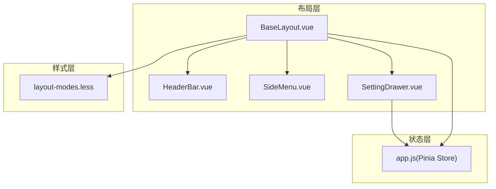
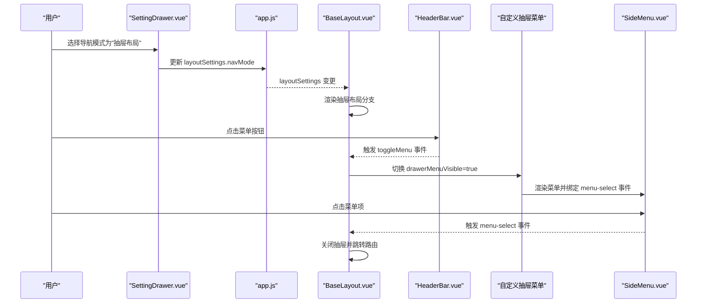
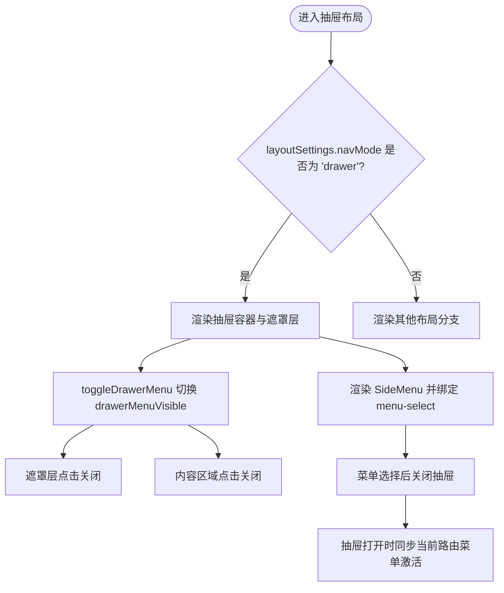
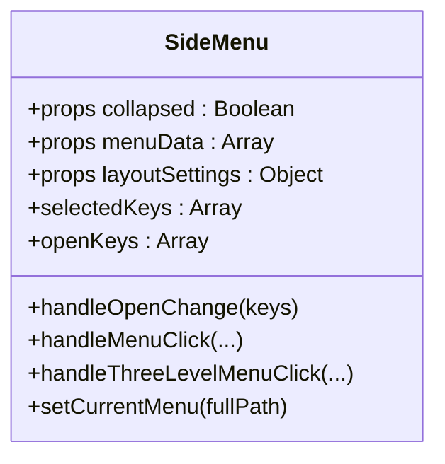
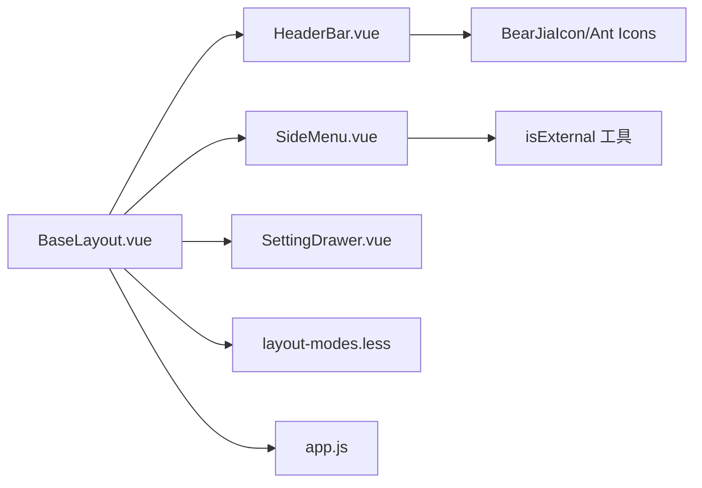

# 抽屉布局

<cite>
**本文引用的文件**
- [BaseLayout.vue](file://bear-jia-vue3/src/layout/BaseLayout.vue)
- [SideMenu.vue](file://bear-jia-vue3/src/components/layout/SideMenu.vue)
- [HeaderBar.vue](file://bear-jia-vue3/src/components/layout/HeaderBar.vue)
- [SettingDrawer.vue](file://bear-jia-vue3/src/components/layout/SettingDrawer.vue)
- [layout-modes.less](file://bear-jia-vue3/src/style/layout-modes.less)
- [app.js](file://bear-jia-vue3/src/stores/app.js)
</cite>

## 目录
1. [简介](#简介)
2. [项目结构](#项目结构)
3. [核心组件](#核心组件)
4. [架构总览](#架构总览)
5. [组件详解](#组件详解)
6. [依赖关系分析](#依赖关系分析)
7. [性能与体验特性](#性能与体验特性)
8. [故障排查指南](#故障排查指南)
9. [结论](#结论)

## 简介
本篇文档聚焦于“抽屉布局”模式，系统性说明该布局模式的UI结构、交互逻辑与实现细节。重点涵盖：
- BaseLayout.vue 如何通过自定义抽屉组件实现菜单的滑动展开效果
- SideMenu.vue 在抽屉中的渲染方式与菜单激活同步机制
- 抽屉布局的触发机制：移动端手势滑动与桌面端按钮点击的联动
- 遮罩层的点击关闭与动画过渡效果的实现原理
- 通过 layoutSettings 中的 navMode 属性设置为 'drawer' 来启用该布局模式
- 适用场景：移动端或需要最大化内容显示区域的紧凑型界面

## 项目结构
抽屉布局模式位于前端布局层，由 BaseLayout.vue 作为容器，HeaderBar.vue 提供触发入口，SideMenu.vue 作为菜单渲染组件，配合样式文件实现抽屉动画与遮罩层效果；布局模式切换由 SettingDrawer.vue 提供可视化入口，最终持久化到 Pinia store 中。

图表来源
- [BaseLayout.vue](file://bear-jia-vue3/src/layout/BaseLayout.vue#L217-L253)
- [HeaderBar.vue](file://bear-jia-vue3/src/components/layout/HeaderBar.vue#L1-L40)
- [SideMenu.vue](file://bear-jia-vue3/src/components/layout/SideMenu.vue#L1-L125)
- [SettingDrawer.vue](file://bear-jia-vue3/src/components/layout/SettingDrawer.vue#L49-L96)
- [layout-modes.less](file://bear-jia-vue3/src/style/layout-modes.less#L326-L471)
- [app.js](file://bear-jia-vue3/src/stores/app.js#L13-L28)

章节来源
- [BaseLayout.vue](file://bear-jia-vue3/src/layout/BaseLayout.vue#L217-L253)
- [HeaderBar.vue](file://bear-jia-vue3/src/components/layout/HeaderBar.vue#L1-L40)
- [SideMenu.vue](file://bear-jia-vue3/src/components/layout/SideMenu.vue#L1-L125)
- [SettingDrawer.vue](file://bear-jia-vue3/src/components/layout/SettingDrawer.vue#L49-L96)
- [layout-modes.less](file://bear-jia-vue3/src/style/layout-modes.less#L326-L471)
- [app.js](file://bear-jia-vue3/src/stores/app.js#L13-L28)

## 核心组件
- BaseLayout.vue：根据 layoutSettings.navMode 渲染不同布局；当 navMode 为 'drawer' 时，渲染抽屉布局容器与自定义抽屉菜单，并提供遮罩层、内容区点击关闭等交互。
- SideMenu.vue：通用侧边菜单渲染组件，支持多级菜单、外链识别、菜单激活同步（setCurrentMenu）。
- HeaderBar.vue：在抽屉模式下提供菜单按钮触发器，点击后向父组件发出 toggleMenu 事件。
- SettingDrawer.vue：提供导航模式切换入口，其中包含 'drawer' 模式选项。
- layout-modes.less：定义抽屉遮罩层与抽屉菜单的动画与样式，包括淡入淡出与从左滑入滑出的动画。
- app.js：Pinia store，维护 layoutSettings 并持久化到本地存储，包含 navMode 默认值。

章节来源
- [BaseLayout.vue](file://bear-jia-vue3/src/layout/BaseLayout.vue#L217-L253)
- [SideMenu.vue](file://bear-jia-vue3/src/components/layout/SideMenu.vue#L1-L125)
- [HeaderBar.vue](file://bear-jia-vue3/src/components/layout/HeaderBar.vue#L1-L40)
- [SettingDrawer.vue](file://bear-jia-vue3/src/components/layout/SettingDrawer.vue#L49-L96)
- [layout-modes.less](file://bear-jia-vue3/src/style/layout-modes.less#L326-L471)
- [app.js](file://bear-jia-vue3/src/stores/app.js#L13-L28)

## 架构总览
抽屉布局的运行时流程如下：
- 用户在设置抽屉中选择“抽屉布局”，SettingDrawer.vue 更新 layoutSettings.navMode
- BaseLayout.vue 监听 layoutSettings 变化，切换到抽屉布局渲染分支
- HeaderBar.vue 在抽屉模式下渲染菜单按钮，点击后通过 toggleMenu 事件通知 BaseLayout.vue
- BaseLayout.vue 切换 drawerMenuVisible 控制自定义抽屉菜单的显示/隐藏
- 自定义抽屉菜单内部渲染 SideMenu.vue，用于菜单选择与路由跳转
- 点击遮罩层或内容区域可关闭抽屉；菜单项被选中后自动关闭抽屉

图表来源
- [SettingDrawer.vue](file://bear-jia-vue3/src/components/layout/SettingDrawer.vue#L49-L96)
- [app.js](file://bear-jia-vue3/src/stores/app.js#L66-L88)
- [BaseLayout.vue](file://bear-jia-vue3/src/layout/BaseLayout.vue#L217-L253)
- [HeaderBar.vue](file://bear-jia-vue3/src/components/layout/HeaderBar.vue#L1-L40)
- [layout-modes.less](file://bear-jia-vue3/src/style/layout-modes.less#L326-L471)

## 组件详解

### BaseLayout.vue：抽屉布局容器与交互
- 布局分支：当 layoutSettings.navMode === 'drawer' 时，渲染抽屉布局容器与自定义抽屉菜单
- 自定义抽屉菜单：
  - 通过 v-if 控制显示/隐藏
  - 遮罩层点击回调 handleDrawerOverlayClick 关闭抽屉
  - 内容区域点击回调 handleContentClick 在抽屉打开时关闭抽屉
  - 菜单渲染：SideMenu.vue 作为抽屉内的菜单组件，绑定 menu-select 事件
- 菜单激活同步：监听 drawerMenuVisible，抽屉打开时通过 ref 调用 SideMenu 的 setCurrentMenu，将当前路由对应菜单高亮
- 样式修复：fixDrawerLayoutStyles 修正抽屉模式下的背景色一致性

图表来源
- [BaseLayout.vue](file://bear-jia-vue3/src/layout/BaseLayout.vue#L217-L253)
- [BaseLayout.vue](file://bear-jia-vue3/src/layout/BaseLayout.vue#L537-L560)
- [BaseLayout.vue](file://bear-jia-vue3/src/layout/BaseLayout.vue#L544-L554)
- [BaseLayout.vue](file://bear-jia-vue3/src/layout/BaseLayout.vue#L970-L984)

章节来源
- [BaseLayout.vue](file://bear-jia-vue3/src/layout/BaseLayout.vue#L217-L253)
- [BaseLayout.vue](file://bear-jia-vue3/src/layout/BaseLayout.vue#L537-L560)
- [BaseLayout.vue](file://bear-jia-vue3/src/layout/BaseLayout.vue#L544-L554)
- [BaseLayout.vue](file://bear-jia-vue3/src/layout/BaseLayout.vue#L970-L984)

### SideMenu.vue：抽屉中的菜单渲染与激活
- 渲染策略：根据 menuData 动态生成菜单树，支持工作台、二级菜单、三级菜单与外链识别
- 事件发射：点击菜单项时发射 menuSelect 事件，携带父子菜单信息
- 激活同步：暴露 setCurrentMenu 方法，接收完整路径，自动设置 selectedKeys 与 openKeys，使菜单高亮并展开
- 外链处理：检测 isExternal，若是外链则在新窗口打开，不触发路由跳转

图表来源
- [SideMenu.vue](file://bear-jia-vue3/src/components/layout/SideMenu.vue#L1-L125)
- [SideMenu.vue](file://bear-jia-vue3/src/components/layout/SideMenu.vue#L160-L214)
- [SideMenu.vue](file://bear-jia-vue3/src/components/layout/SideMenu.vue#L216-L306)

章节来源
- [SideMenu.vue](file://bear-jia-vue3/src/components/layout/SideMenu.vue#L1-L125)
- [SideMenu.vue](file://bear-jia-vue3/src/components/layout/SideMenu.vue#L160-L214)
- [SideMenu.vue](file://bear-jia-vue3/src/components/layout/SideMenu.vue#L216-L306)

### HeaderBar.vue：抽屉模式的触发入口
- 在抽屉模式下，左侧区域渲染菜单按钮（menu-outlined），点击后通过 $emit('toggleMenu') 通知父组件
- 在其他布局模式下，渲染折叠/展开按钮或顶部模式的 Logo 与标题

章节来源
- [HeaderBar.vue](file://bear-jia-vue3/src/components/layout/HeaderBar.vue#L1-L40)

### SettingDrawer.vue：导航模式切换入口
- 提供多种布局模式的可视化选择，其中包含“抽屉布局”
- 点击后调用 handleNavModeChange，更新本地设置并持久化

章节来源
- [SettingDrawer.vue](file://bear-jia-vue3/src/components/layout/SettingDrawer.vue#L49-L96)

### layout-modes.less：遮罩层与动画
- 自定义抽屉遮罩层 custom-drawer-overlay：固定定位、半透明背景、初始透明度为 0，使用 fadeIn 动画渐显
- 抽屉菜单 custom-drawer-menu：绝对定位在左侧，初始 translateX(-100%)，使用 slideInLeft 动画滑入
- 关闭时使用 slideOutLeft 与 fadeOut 动画滑出并淡出
- 响应式宽度：在不同屏幕宽度下调整抽屉宽度

章节来源
- [layout-modes.less](file://bear-jia-vue3/src/style/layout-modes.less#L326-L471)
- [layout-modes.less](file://bear-jia-vue3/src/style/layout-modes.less#L519-L540)

## 依赖关系分析
- BaseLayout.vue 依赖：
  - HeaderBar.vue（触发器）、SideMenu.vue（抽屉内菜单）、SettingDrawer.vue（设置入口）
  - app.js（layoutSettings、主题与设置持久化）
  - layout-modes.less（抽屉动画与遮罩层样式）
- SideMenu.vue 依赖：
  - isExternal 工具（外链识别）
  - BearJiaIcon 图标组件
- HeaderBar.vue 依赖：
  - SYSTEM_INFO 系统信息
  - Ant Design Vue 图标组件

图表来源
- [BaseLayout.vue](file://bear-jia-vue3/src/layout/BaseLayout.vue#L217-L253)
- [HeaderBar.vue](file://bear-jia-vue3/src/components/layout/HeaderBar.vue#L1-L40)
- [SideMenu.vue](file://bear-jia-vue3/src/components/layout/SideMenu.vue#L1-L125)
- [SettingDrawer.vue](file://bear-jia-vue3/src/components/layout/SettingDrawer.vue#L49-L96)
- [layout-modes.less](file://bear-jia-vue3/src/style/layout-modes.less#L326-L471)
- [app.js](file://bear-jia-vue3/src/stores/app.js#L13-L28)

## 性能与体验特性
- 动画流畅：遮罩层与抽屉菜单采用 CSS 动画，初始透明度与位移，避免闪烁
- 菜单激活同步：抽屉打开时自动定位当前路由对应的菜单项，减少用户寻找成本
- 外链处理：外链直接在新窗口打开，避免不必要的路由跳转
- 样式修复：抽屉模式下统一背景色，保证视觉一致性
- 响应式宽度：根据屏幕宽度动态调整抽屉宽度，兼顾移动端与桌面端体验

章节来源
- [layout-modes.less](file://bear-jia-vue3/src/style/layout-modes.less#L326-L471)
- [BaseLayout.vue](file://bear-jia-vue3/src/layout/BaseLayout.vue#L508-L535)
- [SideMenu.vue](file://bear-jia-vue3/src/components/layout/SideMenu.vue#L160-L214)

## 故障排查指南
- 无法切换到抽屉布局
  - 检查 SettingDrawer.vue 是否正确更新 layoutSettings.navMode
  - 确认 app.js 中 layoutSettings 的 navMode 默认值与持久化逻辑
- 抽屉无法关闭
  - 检查 handleContentClick 与 handleDrawerOverlayClick 是否被调用
  - 确认 drawerMenuVisible 的状态是否被正确切换
- 菜单未高亮
  - 检查 BaseLayout.vue 中监听 drawerMenuVisible 的 watcher 是否触发
  - 确认 SideMenu.vue 的 setCurrentMenu 是否被调用且传入完整路径
- 外链未在新窗口打开
  - 检查 isExternal 判定逻辑与 SideMenu.vue 的外链处理分支

章节来源
- [SettingDrawer.vue](file://bear-jia-vue3/src/components/layout/SettingDrawer.vue#L49-L96)
- [app.js](file://bear-jia-vue3/src/stores/app.js#L66-L88)
- [BaseLayout.vue](file://bear-jia-vue3/src/layout/BaseLayout.vue#L537-L560)
- [BaseLayout.vue](file://bear-jia-vue3/src/layout/BaseLayout.vue#L970-L984)
- [SideMenu.vue](file://bear-jia-vue3/src/components/layout/SideMenu.vue#L160-L214)

## 结论
抽屉布局通过“自定义遮罩层 + 从左滑入的菜单面板”的组合，在移动端与紧凑型界面中实现了极简的导航体验。其实现要点包括：
- 通过 layoutSettings.navMode = 'drawer' 启用抽屉布局
- HeaderBar 在抽屉模式下提供菜单按钮，点击后由 BaseLayout 控制抽屉显示
- 自定义遮罩层与 CSS 动画提供顺滑的开合体验
- SideMenu 在抽屉中渲染菜单并支持外链与菜单激活同步
- 内容区域点击与遮罩层点击均可关闭抽屉，提升交互效率

该模式特别适用于移动端或需要最大化内容显示区域的场景，既保留了导航能力，又减少了空间占用。