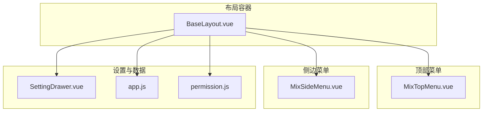
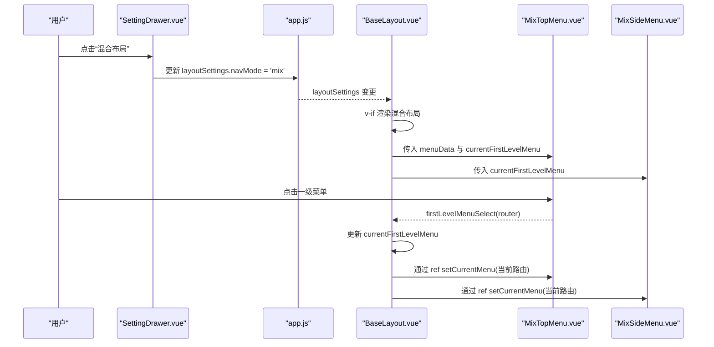
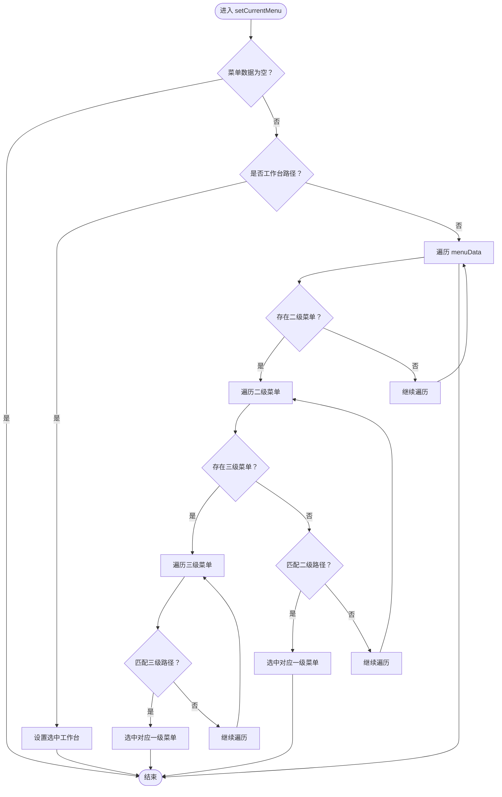
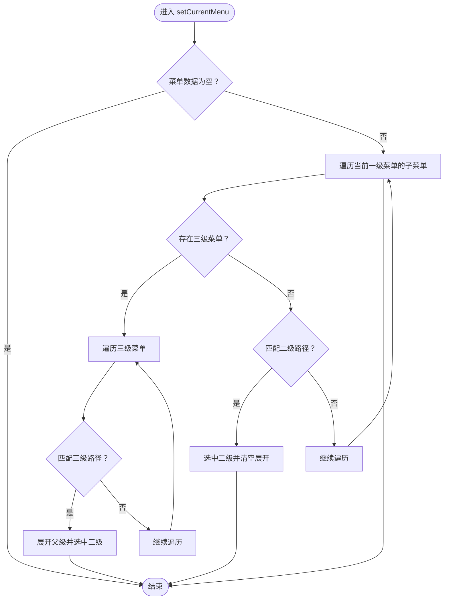
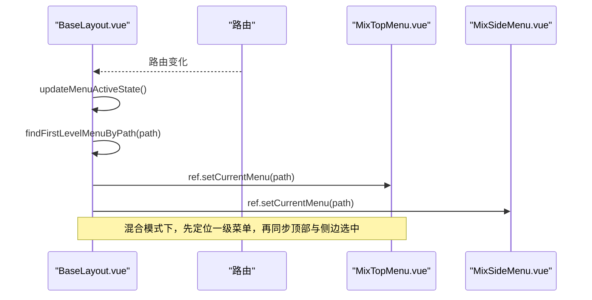
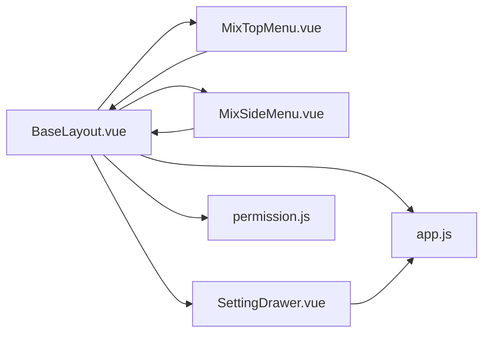

# 混合布局

<cite>
**本文引用的文件**
- [BaseLayout.vue](file://bear-jia-vue3/src/layout/BaseLayout.vue)
- [MixSideMenu.vue](file://bear-jia-vue3/src/components/layout/MixSideMenu.vue)
- [MixTopMenu.vue](file://bear-jia-vue3/src/components/layout/MixTopMenu.vue)
- [app.js](file://bear-jia-vue3/src/stores/app.js)
- [permission.js](file://bear-jia-vue3/src/stores/permission.js)
- [SettingDrawer.vue](file://bear-jia-vue3/src/components/layout/SettingDrawer.vue)
</cite>

## 目录
1. [简介](#简介)
2. [项目结构](#项目结构)
3. [核心组件](#核心组件)
4. [架构总览](#架构总览)
5. [详细组件分析](#详细组件分析)
6. [依赖关系分析](#依赖关系分析)
7. [性能考量](#性能考量)
8. [故障排查指南](#故障排查指南)
9. [结论](#结论)
10. [附录](#附录)

## 简介
本文件面向企业级后台管理系统，系统性阐述“混合布局”模式的设计与实现。该模式将一级菜单置于顶部导航，二级菜单置于侧边栏，兼顾顶部导航的高效直达与侧边菜单的层级深度，适合需要在有限空间内承载多级业务模块的企业应用。文档重点说明：
- MixSideMenu.vue 与 MixTopMenu.vue 如何协同工作，实现一级菜单在顶部、二级菜单在侧边的混合导航。
- BaseLayout.vue 通过 v-if 条件渲染实现不同布局模式的切换，并在混合模式下完成两级菜单的联动与激活状态同步。
- 菜单激活状态的同步更新机制，包括路由变化时自动展开对应侧边菜单的功能实现。
- 通过 layoutSettings 中的 navMode 属性设置为 'mix' 启用混合布局，并给出适用场景说明。

## 项目结构
混合布局涉及的核心文件位于以下目录：
- 布局容器：BaseLayout.vue
- 顶部混合菜单：MixTopMenu.vue
- 侧边混合菜单：MixSideMenu.vue
- 布局设置抽屉：SettingDrawer.vue（用于切换 navMode）
- 应用设置 Store：app.js（读取/写入 layoutSettings）
- 权限与菜单数据：permission.js（生成 sidebarRouters）

图表来源
- [BaseLayout.vue](file://bear-jia-vue3/src/layout/BaseLayout.vue#L55-L86)
- [MixTopMenu.vue](file://bear-jia-vue3/src/components/layout/MixTopMenu.vue#L1-L30)
- [MixSideMenu.vue](file://bear-jia-vue3/src/components/layout/MixSideMenu.vue#L1-L20)
- [SettingDrawer.vue](file://bear-jia-vue3/src/components/layout/SettingDrawer.vue#L63-L96)
- [app.js](file://bear-jia-vue3/src/stores/app.js#L100-L143)
- [permission.js](file://bear-jia-vue3/src/stores/permission.js#L221-L263)

章节来源
- [BaseLayout.vue](file://bear-jia-vue3/src/layout/BaseLayout.vue#L55-L86)
- [MixTopMenu.vue](file://bear-jia-vue3/src/components/layout/MixTopMenu.vue#L1-L30)
- [MixSideMenu.vue](file://bear-jia-vue3/src/components/layout/MixSideMenu.vue#L1-L20)
- [SettingDrawer.vue](file://bear-jia-vue3/src/components/layout/SettingDrawer.vue#L63-L96)
- [app.js](file://bear-jia-vue3/src/stores/app.js#L100-L143)
- [permission.js](file://bear-jia-vue3/src/stores/permission.js#L221-L263)

## 核心组件
- BaseLayout.vue：负责根据 layoutSettings.navMode 渲染不同布局；在混合模式下同时挂载 MixTopMenu 与 MixSideMenu，并在路由变化时同步两级菜单的激活状态。
- MixTopMenu.vue：水平顶部导航，仅展示一级菜单；支持工作台快捷入口与一级菜单点击事件，向父组件发出 firstLevelMenuSelect 与 menuSelect。
- MixSideMenu.vue：侧边栏菜单，仅展示当前选中一级菜单的二级/三级菜单；支持外链处理与菜单点击事件，向父组件发出 menuSelect。
- SettingDrawer.vue：提供布局切换入口，当选择 'mix' 时将 layoutSettings.navMode 设为 'mix'。
- app.js：提供应用设置的读取、重置与主题应用能力，包含默认 layoutSettings（含 navMode）。
- permission.js：生成 sidebarRouters（菜单树），供 BaseLayout 与各菜单组件消费。

章节来源
- [BaseLayout.vue](file://bear-jia-vue3/src/layout/BaseLayout.vue#L55-L86)
- [MixTopMenu.vue](file://bear-jia-vue3/src/components/layout/MixTopMenu.vue#L1-L30)
- [MixSideMenu.vue](file://bear-jia-vue3/src/components/layout/MixSideMenu.vue#L1-L20)
- [SettingDrawer.vue](file://bear-jia-vue3/src/components/layout/SettingDrawer.vue#L63-L96)
- [app.js](file://bear-jia-vue3/src/stores/app.js#L100-L143)
- [permission.js](file://bear-jia-vue3/src/stores/permission.js#L221-L263)

## 架构总览
混合布局的运行时架构如下：
- 用户在 SettingDrawer 中选择“混合布局”，触发 layoutSettings.navMode = 'mix'。
- BaseLayout.vue 通过 v-if 渲染混合布局容器，挂载 HeaderBar（顶部）、MixTopMenu（顶部一级菜单）、MixSideMenu（侧边二级/三级菜单）与内容区。
- MixTopMenu 与 MixSideMenu 通过事件与 props 协同：MixTopMenu 选择一级菜单后，BaseLayout 更新 currentFirstLevelMenu；MixSideMenu 依据 currentFirstLevelMenu 渲染对应子菜单。
- 路由变化时，BaseLayout 自动解析当前路径所属的一级菜单，同步激活顶部与侧边菜单。

图表来源
- [SettingDrawer.vue](file://bear-jia-vue3/src/components/layout/SettingDrawer.vue#L63-L96)
- [app.js](file://bear-jia-vue3/src/stores/app.js#L100-L143)
- [BaseLayout.vue](file://bear-jia-vue3/src/layout/BaseLayout.vue#L55-L86)
- [MixTopMenu.vue](file://bear-jia-vue3/src/components/layout/MixTopMenu.vue#L137-L151)
- [MixSideMenu.vue](file://bear-jia-vue3/src/components/layout/MixSideMenu.vue#L124-L165)

## 详细组件分析

### MixTopMenu.vue（顶部一级菜单）
- 职责
  - 仅展示一级菜单项，不展开下拉。
  - 提供工作台快捷入口。
  - 通过 firstLevelMenuSelect 通知父组件一级菜单切换。
  - 通过 menuSelect 通知父组件工作台点击。
- 关键点
  - 选中态：基于 selectedKeys，监听 currentFirstLevelMenu 变化以同步选中。
  - 激活恢复：setCurrentMenu(fullPath) 支持页面刷新后恢复选中，优先匹配工作台，否则按路径归属一级菜单。
  - 事件：handleFirstLevelMenuClick(router) -> emit('firstLevelMenuSelect', router)；handleWorkbenchClick() -> emit('menuSelect', ...) 并清空一级菜单选择。

图表来源
- [MixTopMenu.vue](file://bear-jia-vue3/src/components/layout/MixTopMenu.vue#L64-L111)

章节来源
- [MixTopMenu.vue](file://bear-jia-vue3/src/components/layout/MixTopMenu.vue#L1-L30)
- [MixTopMenu.vue](file://bear-jia-vue3/src/components/layout/MixTopMenu.vue#L48-L88)
- [MixTopMenu.vue](file://bear-jia-vue3/src/components/layout/MixTopMenu.vue#L112-L151)

### MixSideMenu.vue（侧边二级/三级菜单）
- 职责
  - 仅展示当前选中一级菜单的子菜单（二级/三级）。
  - 支持外链直接打开，不触发路由跳转。
  - 通过 menuSelect 事件向上汇报二级/三级菜单点击。
- 关键点
  - 选中态：selectedKeys/openKeys 由组件内部维护；watch(currentFirstLevelMenu) 重置状态。
  - 激活恢复：setCurrentMenu(fullPath) 支持页面刷新后恢复选中，优先匹配三级菜单，再回退到二级菜单。
  - 事件：handleMenuClick(...) 与 handleThreeLevelMenuClick(...) -> emit('menuSelect', ...)。

图表来源
- [MixSideMenu.vue](file://bear-jia-vue3/src/components/layout/MixSideMenu.vue#L124-L165)

章节来源
- [MixSideMenu.vue](file://bear-jia-vue3/src/components/layout/MixSideMenu.vue#L1-L20)
- [MixSideMenu.vue](file://bear-jia-vue3/src/components/layout/MixSideMenu.vue#L107-L122)
- [MixSideMenu.vue](file://bear-jia-vue3/src/components/layout/MixSideMenu.vue#L164-L200)
- [MixSideMenu.vue](file://bear-jia-vue3/src/components/layout/MixSideMenu.vue#L202-L223)

### BaseLayout.vue（混合布局容器与联动）
- v-if 条件渲染
  - layoutSettings.navMode 为 'mix' 时，渲染 HeaderBar + MixTopMenu + MixSideMenu + 内容区。
- 两级菜单联动
  - MixTopMenu 通过 firstLevelMenuSelect(router) 通知 BaseLayout 更新 currentFirstLevelMenu。
  - MixSideMenu 依赖 currentFirstLevelMenu 渲染对应子菜单。
- 路由变化激活同步
  - watch(vueRoute.path) 触发 updateMenuActiveState()：
    - 混合模式：findFirstLevelMenuByPath(currentPath) 定位一级菜单，随后分别调用 MixTopMenu.setCurrentMenu 与 MixSideMenu.setCurrentMenu。
  - findFirstLevelMenuByPath：遍历 sidebarRouters，按路径匹配归属一级菜单。
- 设置变更与主题应用
  - watch(layoutSettings)：持久化设置、应用主题、布局切换后延迟重算激活状态。

图表来源
- [BaseLayout.vue](file://bear-jia-vue3/src/layout/BaseLayout.vue#L796-L898)
- [BaseLayout.vue](file://bear-jia-vue3/src/layout/BaseLayout.vue#L928-L934)
- [BaseLayout.vue](file://bear-jia-vue3/src/layout/BaseLayout.vue#L935-L968)

章节来源
- [BaseLayout.vue](file://bear-jia-vue3/src/layout/BaseLayout.vue#L55-L86)
- [BaseLayout.vue](file://bear-jia-vue3/src/layout/BaseLayout.vue#L796-L898)
- [BaseLayout.vue](file://bear-jia-vue3/src/layout/BaseLayout.vue#L900-L927)
- [BaseLayout.vue](file://bear-jia-vue3/src/layout/BaseLayout.vue#L928-L968)

### SettingDrawer.vue（布局切换入口）
- 提供多种布局模式选择，其中“混合布局”对应 navMode = 'mix'。
- 点击后通过 handleNavModeChange('mix') 更新本地设置，最终由 BaseLayout 监听并生效。

章节来源
- [SettingDrawer.vue](file://bear-jia-vue3/src/components/layout/SettingDrawer.vue#L63-L96)

### app.js（应用设置与默认值）
- 默认 layoutSettings 包含 navMode: 'side'，但允许外部覆盖。
- 提供 applyTheme() 应用主题与颜色弱视等设置。

章节来源
- [app.js](file://bear-jia-vue3/src/stores/app.js#L100-L143)

### permission.js（菜单数据生成）
- 生成 sidebarRouters（菜单树），供 BaseLayout 与各菜单组件消费。
- 过滤外链与动态路由，保证菜单显示与路由跳转一致。

章节来源
- [permission.js](file://bear-jia-vue3/src/stores/permission.js#L221-L263)

## 依赖关系分析
- BaseLayout.vue 依赖
  - MixTopMenu.vue 与 MixSideMenu.vue（作为子组件）
  - SettingDrawer.vue（设置入口）
  - app.js（layoutSettings）
  - permission.js（sidebarRouters）
- MixTopMenu.vue 依赖
  - menuData（来自 BaseLayout）
  - currentFirstLevelMenu（来自 BaseLayout）
- MixSideMenu.vue 依赖
  - currentFirstLevelMenu（来自 BaseLayout）
  - layoutSettings（来自 BaseLayout）
- SettingDrawer.vue 依赖
  - app.js（更新 layoutSettings）

图表来源
- [BaseLayout.vue](file://bear-jia-vue3/src/layout/BaseLayout.vue#L55-L86)
- [MixTopMenu.vue](file://bear-jia-vue3/src/components/layout/MixTopMenu.vue#L1-L30)
- [MixSideMenu.vue](file://bear-jia-vue3/src/components/layout/MixSideMenu.vue#L1-L20)
- [SettingDrawer.vue](file://bear-jia-vue3/src/components/layout/SettingDrawer.vue#L63-L96)
- [app.js](file://bear-jia-vue3/src/stores/app.js#L100-L143)
- [permission.js](file://bear-jia-vue3/src/stores/permission.js#L221-L263)

## 性能考量
- 菜单激活同步采用 nextTick 与 setTimeout 延迟，确保新布局渲染完成后再激活，避免组件尚未挂载导致的空引用。
- 混合模式下，仅在 currentFirstLevelMenu 变化时重置 MixSideMenu 的选中状态，减少不必要的重绘。
- 外链菜单直接 window.open，避免路由跳转带来的额外开销。
- 路由守卫与错误处理在 BaseLayout 中集中处理，降低各菜单组件的复杂度。

## 故障排查指南
- 问题：切换到混合布局后，侧边菜单无内容
  - 检查是否正确设置 layoutSettings.navMode = 'mix'。
  - 确认 MixTopMenu 是否发出 firstLevelMenuSelect(router)，从而更新 BaseLayout 的 currentFirstLevelMenu。
  - 确认 MixSideMenu 的 currentFirstLevelMenu 是否被正确传入。
- 问题：路由变化后，顶部与侧边未同步高亮
  - 检查 BaseLayout 的 updateMenuActiveState() 是否被触发（watch(vueRoute.path)）。
  - 确认 findFirstLevelMenuByPath 能否正确匹配到一级菜单。
  - 确认 MixTopMenu.setCurrentMenu 与 MixSideMenu.setCurrentMenu 是否被调用。
- 问题：外链点击未生效
  - 检查 isExternal 判断逻辑与 MixSideMenu/MixTopMenu 的外链处理分支。
- 问题：布局切换后主题未更新
  - 确认 appStore.applyTheme() 是否被调用（watch(layoutSettings) 中会触发）。

章节来源
- [BaseLayout.vue](file://bear-jia-vue3/src/layout/BaseLayout.vue#L796-L898)
- [BaseLayout.vue](file://bear-jia-vue3/src/layout/BaseLayout.vue#L935-L968)
- [MixSideMenu.vue](file://bear-jia-vue3/src/components/layout/MixSideMenu.vue#L176-L223)
- [MixTopMenu.vue](file://bear-jia-vue3/src/components/layout/MixTopMenu.vue#L120-L151)
- [app.js](file://bear-jia-vue3/src/stores/app.js#L100-L143)

## 结论
混合布局通过“顶部一级菜单 + 侧边二级/三级菜单”的组合，在有限空间内实现了高效直达与深度导航的平衡。BaseLayout 以 v-if 条件渲染实现布局切换，MixTopMenu 与 MixSideMenu 通过 props 与事件实现双向联动，配合路由变化的激活同步机制，确保用户体验的一致性与连贯性。通过 SettingDrawer 的可视化切换与 app.js 的默认设置，开发者可快速启用并定制该布局模式。

## 附录
- 启用步骤
  - 在设置抽屉中选择“混合布局”，将 layoutSettings.navMode 设为 'mix'。
  - 或在应用初始化时将 appStore.layoutSettings.navMode 设为 'mix'。
- 适用场景
  - 需要在顶部快速切换业务大类，同时在侧边深度组织子模块的企业后台系统。
  - 业务线较多、菜单层级较深，但又希望顶部导航简洁高效的系统。

章节来源
- [SettingDrawer.vue](file://bear-jia-vue3/src/components/layout/SettingDrawer.vue#L63-L96)
- [app.js](file://bear-jia-vue3/src/stores/app.js#L100-L143)
- [BaseLayout.vue](file://bear-jia-vue3/src/layout/BaseLayout.vue#L55-L86)