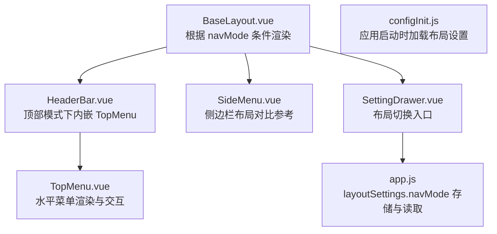
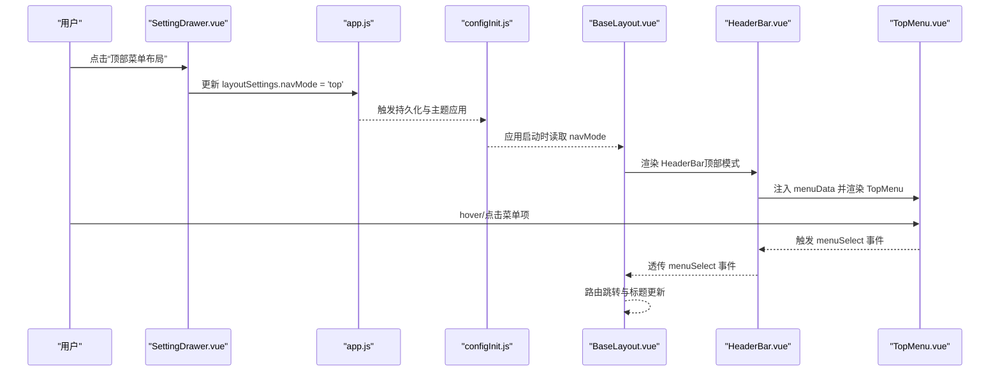
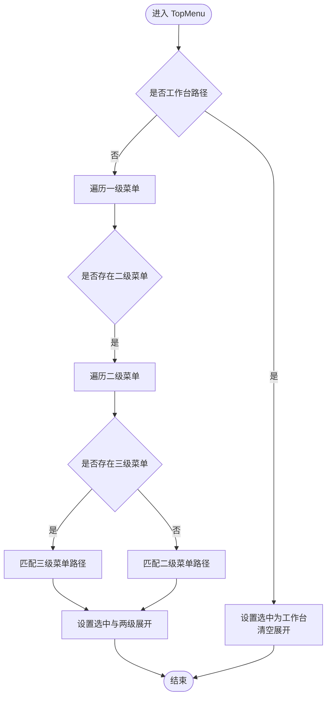
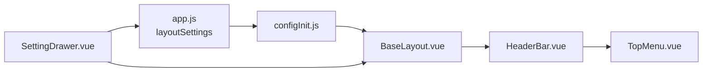

# 顶部菜单布局

<cite>
**本文引用的文件**
- [BaseLayout.vue](file://bear-jia-vue3/src/layout/BaseLayout.vue)
- [TopMenu.vue](file://bear-jia-vue3/src/components/layout/TopMenu.vue)
- [HeaderBar.vue](file://bear-jia-vue3/src/components/layout/HeaderBar.vue)
- [app.js](file://bear-jia-vue3/src/stores/app.js)
- [SettingDrawer.vue](file://bear-jia-vue3/src/components/layout/SettingDrawer.vue)
- [configInit.js](file://bear-jia-vue3/src/utils/configInit.js)
</cite>

## 目录
1. [简介](#简介)
2. [项目结构](#项目结构)
3. [核心组件](#核心组件)
4. [架构总览](#架构总览)
5. [详细组件分析](#详细组件分析)
6. [依赖关系分析](#依赖关系分析)
7. [性能考量](#性能考量)
8. [故障排查指南](#故障排查指南)
9. [结论](#结论)
10. [附录](#附录)

## 简介
本文件面向“顶部菜单布局”模式，系统性说明该布局模式的UI结构、交互逻辑与实现细节。重点覆盖：
- TopMenu.vue 如何实现水平菜单渲染与下拉交互
- BaseLayout.vue 通过 v-if 条件渲染实现顶部菜单布局的切换机制
- 菜单项 hover 与点击交互、下拉子菜单的显示/隐藏逻辑及 CSS 动画过渡
- 屏幕宽度变化时的响应式处理策略
- 与 HeaderBar.vue 的集成方式
- 通过 layoutSettings 中 navMode 属性设置为 'top' 启用该布局模式的方法
- 适用场景：菜单层级较浅、强调横向导航的业务系统

## 项目结构
顶部菜单布局由三层协同构成：
- 布局容器层：BaseLayout.vue 根据 layoutSettings.navMode 切换不同布局
- 头部集成层：HeaderBar.vue 在顶部模式下内嵌 TopMenu.vue
- 菜单渲染层：TopMenu.vue 渲染水平菜单并处理选择与展开事件

图表来源
- [BaseLayout.vue](file://bear-jia-vue3/src/layout/BaseLayout.vue#L24-L60)
- [HeaderBar.vue](file://bear-jia-vue3/src/components/layout/HeaderBar.vue#L40-L58)
- [TopMenu.vue](file://bear-jia-vue3/src/components/layout/TopMenu.vue#L1-L83)
- [SettingDrawer.vue](file://bear-jia-vue3/src/components/layout/SettingDrawer.vue#L63-L96)
- [app.js](file://bear-jia-vue3/src/stores/app.js#L13-L28)
- [configInit.js](file://bear-jia-vue3/src/utils/configInit.js#L12-L41)

章节来源
- [BaseLayout.vue](file://bear-jia-vue3/src/layout/BaseLayout.vue#L24-L60)
- [HeaderBar.vue](file://bear-jia-vue3/src/components/layout/HeaderBar.vue#L40-L58)
- [TopMenu.vue](file://bear-jia-vue3/src/components/layout/TopMenu.vue#L1-L83)
- [SettingDrawer.vue](file://bear-jia-vue3/src/components/layout/SettingDrawer.vue#L63-L96)
- [app.js](file://bear-jia-vue3/src/stores/app.js#L13-L28)
- [configInit.js](file://bear-jia-vue3/src/utils/configInit.js#L12-L41)

## 核心组件
- BaseLayout.vue：根据 layoutSettings.navMode 切换布局，顶部模式下直接渲染 HeaderBar 并注入菜单数据与事件
- HeaderBar.vue：在顶部模式下渲染 TopMenu，并承载头部其他功能区；同时根据 navMode 切换头部布局样式
- TopMenu.vue：水平菜单渲染、hover/点击交互、下拉展开控制、菜单激活状态同步
- app.js：持久化存储 layoutSettings，其中 navMode 控制布局模式
- SettingDrawer.vue：提供可视化布局切换入口，支持将 navMode 设为 'top'

章节来源
- [BaseLayout.vue](file://bear-jia-vue3/src/layout/BaseLayout.vue#L24-L60)
- [HeaderBar.vue](file://bear-jia-vue3/src/components/layout/HeaderBar.vue#L267-L276)
- [TopMenu.vue](file://bear-jia-vue3/src/components/layout/TopMenu.vue#L1-L83)
- [app.js](file://bear-jia-vue3/src/stores/app.js#L13-L28)
- [SettingDrawer.vue](file://bear-jia-vue3/src/components/layout/SettingDrawer.vue#L63-L96)

## 架构总览
顶部菜单布局的运行流程如下：
- 应用启动时，configInit.js 从 localStorage 加载 layoutSettings 并应用主题
- BaseLayout.vue 依据 layoutSettings.navMode 渲染对应布局
- 顶部模式下，HeaderBar.vue 内嵌 TopMenu.vue，接收菜单数据与事件
- 用户通过 SettingDrawer.vue 或界面设置切换 navMode 为 'top'
- TopMenu.vue 处理菜单选择与展开事件，BaseLayout.vue 负责路由跳转与面包屑标题更新

图表来源
- [SettingDrawer.vue](file://bear-jia-vue3/src/components/layout/SettingDrawer.vue#L555-L571)
- [app.js](file://bear-jia-vue3/src/stores/app.js#L66-L88)
- [configInit.js](file://bear-jia-vue3/src/utils/configInit.js#L12-L41)
- [BaseLayout.vue](file://bear-jia-vue3/src/layout/BaseLayout.vue#L24-L60)
- [HeaderBar.vue](file://bear-jia-vue3/src/components/layout/HeaderBar.vue#L40-L58)
- [TopMenu.vue](file://bear-jia-vue3/src/components/layout/TopMenu.vue#L103-L110)

## 详细组件分析

### TopMenu.vue：水平菜单渲染与交互
- 渲染模式：水平模式（horizontal），支持多级菜单
- 菜单结构规则：
  - 一级菜单：来源于传入的 menuData
  - 二级菜单：当一级菜单存在 children 且满足条件时以子菜单形式下拉
  - 三级菜单：当二级菜单存在 children 时以子菜单形式下拉
- 交互逻辑：
  - 选择事件：@select 绑定 handleMenuSelect，维护 selectedKeys
  - 展开事件：@openChange 绑定 handleOpenChange，维护 openKeys
  - 点击事件：工作台、二级菜单、三级菜单分别触发不同处理函数并通过 emit('menuSelect', ...) 传递数据
- 激活状态同步：暴露 setCurrentMenu 方法，供外部根据当前路由路径设置选中与展开状态

图表来源
- [TopMenu.vue](file://bear-jia-vue3/src/components/layout/TopMenu.vue#L112-L161)

章节来源
- [TopMenu.vue](file://bear-jia-vue3/src/components/layout/TopMenu.vue#L1-L83)
- [TopMenu.vue](file://bear-jia-vue3/src/components/layout/TopMenu.vue#L103-L110)
- [TopMenu.vue](file://bear-jia-vue3/src/components/layout/TopMenu.vue#L112-L161)
- [TopMenu.vue](file://bear-jia-vue3/src/components/layout/TopMenu.vue#L166-L213)

### HeaderBar.vue：顶部模式下的菜单集成
- 顶部模式判断：通过 computed 计算 isTopMode，当 layoutSettings.navMode === 'top' 时渲染顶部菜单区域
- 菜单集成：在顶部模式下引入 TopMenu，绑定 menuData，并透传 menuSelect 事件
- 响应式布局：根据 isTopMode/isMixMode 调整左侧 Logo/标题与右侧功能区的宽度占比
- 其他功能：加载动画、搜索、消息、聊天、全屏、刷新、设置、用户下拉等

章节来源
- [HeaderBar.vue](file://bear-jia-vue3/src/components/layout/HeaderBar.vue#L40-L58)
- [HeaderBar.vue](file://bear-jia-vue3/src/components/layout/HeaderBar.vue#L267-L276)
- [HeaderBar.vue](file://bear-jia-vue3/src/components/layout/HeaderBar.vue#L361-L533)

### BaseLayout.vue：顶部菜单布局的切换机制
- 条件渲染：基于 layoutSettings.navMode 切换布局容器
- 顶部模式渲染：当 navMode === 'top' 时，渲染 HeaderBar 并注入菜单数据与事件
- 激活状态同步：在 onMounted 生命周期中，根据当前路由路径调用 TopMenu 的 setCurrentMenu 完成选中与展开状态初始化
- 路由跳转：接收 menuSelect 事件后，根据菜单信息执行路由跳转并更新面包屑标题

章节来源
- [BaseLayout.vue](file://bear-jia-vue3/src/layout/BaseLayout.vue#L24-L60)
- [BaseLayout.vue](file://bear-jia-vue3/src/layout/BaseLayout.vue#L796-L841)

### SettingDrawer.vue 与 app.js：navMode 的持久化与切换
- SettingDrawer.vue：提供“顶部菜单布局”选项，点击后将 localSettings.navMode 设为 'top'，并触发 handleSettingChange
- app.js：updateSettings 将设置写入 localStorage 并应用主题；configInit.js 在应用启动时从 localStorage 加载布局设置
- 默认 navMode：localStorage 不存在时，默认为 'side'

章节来源
- [SettingDrawer.vue](file://bear-jia-vue3/src/components/layout/SettingDrawer.vue#L63-L96)
- [SettingDrawer.vue](file://bear-jia-vue3/src/components/layout/SettingDrawer.vue#L555-L571)
- [app.js](file://bear-jia-vue3/src/stores/app.js#L13-L28)
- [app.js](file://bear-jia-vue3/src/stores/app.js#L66-L88)
- [configInit.js](file://bear-jia-vue3/src/utils/configInit.js#L12-L41)

## 依赖关系分析
- BaseLayout.vue 依赖 app.js 提供的 layoutSettings，依赖 HeaderBar.vue 与 SideMenu.vue
- HeaderBar.vue 依赖 TopMenu.vue，在顶部模式下内嵌 TopMenu
- TopMenu.vue 依赖 BearJiaIcon 图标组件，依赖菜单数据 menuData
- SettingDrawer.vue 通过 update:settings 事件与 app.js 通信，间接影响 BaseLayout.vue 的渲染

图表来源
- [app.js](file://bear-jia-vue3/src/stores/app.js#L13-L28)
- [configInit.js](file://bear-jia-vue3/src/utils/configInit.js#L12-L41)
- [BaseLayout.vue](file://bear-jia-vue3/src/layout/BaseLayout.vue#L24-L60)
- [HeaderBar.vue](file://bear-jia-vue3/src/components/layout/HeaderBar.vue#L40-L58)
- [TopMenu.vue](file://bear-jia-vue3/src/components/layout/TopMenu.vue#L1-L83)
- [SettingDrawer.vue](file://bear-jia-vue3/src/components/layout/SettingDrawer.vue#L589-L592)

## 性能考量
- 菜单渲染复杂度：TopMenu.vue 采用 v-for 渲染，层级较深时建议保持菜单层级扁平，减少 DOM 层级与嵌套循环
- 激活状态同步：BaseLayout.vue 在 mounted 后通过 nextTick 调用 TopMenu 的 setCurrentMenu，避免首屏闪烁
- 事件冒泡与透传：HeaderBar.vue 对 menuSelect 事件进行透传，减少中间层逻辑开销
- 主题与持久化：app.js 与 configInit.js 将布局设置持久化，避免每次启动重复计算

[本节为通用指导，无需具体文件分析]

## 故障排查指南
- navMode 未生效
  - 检查 SettingDrawer.vue 是否正确将 navMode 设为 'top'，并触发 handleSettingChange
  - 确认 app.js 的 updateSettings 是否写入 localStorage
  - 确认 configInit.js 是否在启动时读取了 localStorage
- 菜单未高亮
  - 检查 BaseLayout.vue 的 updateMenuActiveState 是否在 mounted 后调用 TopMenu.setCurrentMenu
  - 确认当前路由路径与菜单路径匹配（含工作台路径）
- 下拉菜单无法展开
  - 检查 TopMenu.vue 的 handleOpenChange 是否正确维护 openKeys
  - 确认菜单数据 menuData 结构是否符合预期（children/alwaysShow）

章节来源
- [SettingDrawer.vue](file://bear-jia-vue3/src/components/layout/SettingDrawer.vue#L555-L571)
- [app.js](file://bear-jia-vue3/src/stores/app.js#L66-L88)
- [configInit.js](file://bear-jia-vue3/src/utils/configInit.js#L12-L41)
- [BaseLayout.vue](file://bear-jia-vue3/src/layout/BaseLayout.vue#L796-L841)
- [TopMenu.vue](file://bear-jia-vue3/src/components/layout/TopMenu.vue#L108-L110)

## 结论
顶部菜单布局通过 TopMenu.vue 的水平渲染与下拉交互、HeaderBar.vue 的顶部集成、BaseLayout.vue 的条件渲染与激活状态同步，形成一套清晰、可扩展的横向导航方案。结合 SettingDrawer.vue 与 app.js 的持久化能力，用户可便捷地在不同布局间切换。该布局适合菜单层级较浅、强调横向导航的业务系统。

[本节为总结，无需具体文件分析]

## 附录

### 启用顶部菜单布局的操作步骤
- 在界面中打开“布局设置”，选择“顶部菜单布局”
- 系统会将 layoutSettings.navMode 设为 'top' 并持久化
- 应用重启后，BaseLayout.vue 根据 navMode 渲染顶部菜单布局

章节来源
- [SettingDrawer.vue](file://bear-jia-vue3/src/components/layout/SettingDrawer.vue#L63-L96)
- [SettingDrawer.vue](file://bear-jia-vue3/src/components/layout/SettingDrawer.vue#L555-L571)
- [app.js](file://bear-jia-vue3/src/stores/app.js#L13-L28)
- [configInit.js](file://bear-jia-vue3/src/utils/configInit.js#L12-L41)
- [BaseLayout.vue](file://bear-jia-vue3/src/layout/BaseLayout.vue#L24-L60)

### 适用场景
- 菜单层级较浅（通常不超过三级）
- 强调横向导航与快速切换
- 需要在顶部集中展示主要功能入口

[本节为概念说明，无需具体文件分析]