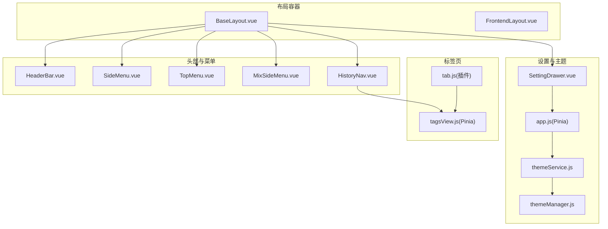
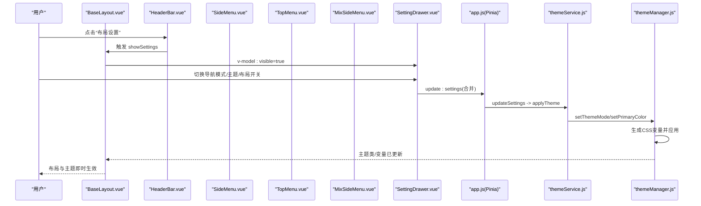
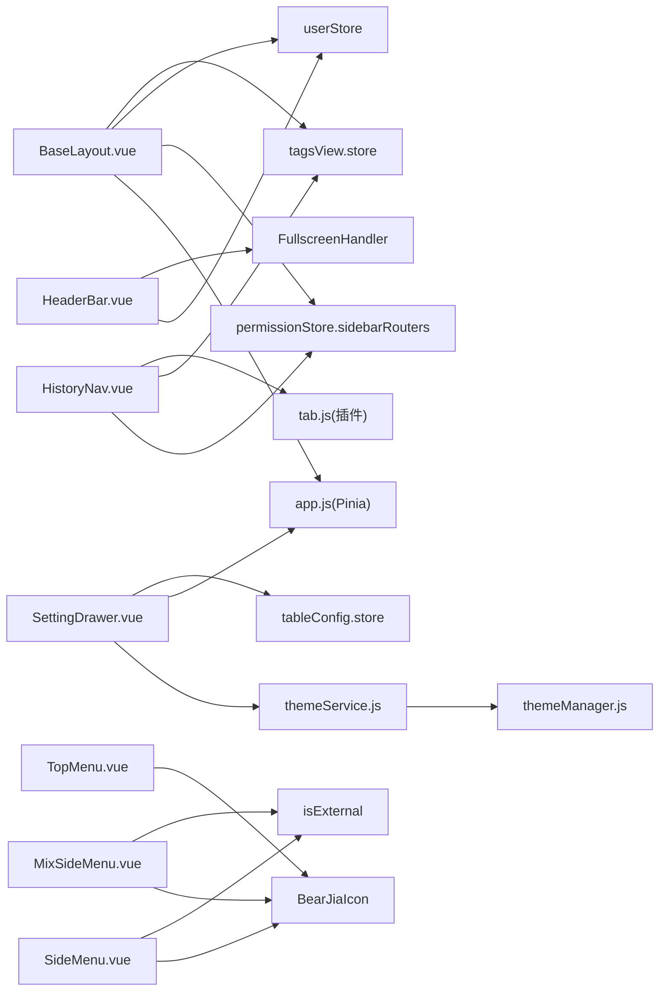

# 布局系统

<cite>
**本文引用的文件**
- [BaseLayout.vue](file://bear-jia-vue3/src/layout/BaseLayout.vue)
- [FrontendLayout.vue](file://bear-jia-vue3/src/layout/FrontendLayout.vue)
- [HeaderBar.vue](file://bear-jia-vue3/src/components/layout/HeaderBar.vue)
- [SideMenu.vue](file://bear-jia-vue3/src/components/layout/SideMenu.vue)
- [TopMenu.vue](file://bear-jia-vue3/src/components/layout/TopMenu.vue)
- [MixSideMenu.vue](file://bear-jia-vue3/src/components/layout/MixSideMenu.vue)
- [SettingDrawer.vue](file://bear-jia-vue3/src/components/layout/SettingDrawer.vue)
- [HistoryNav.vue](file://bear-jia-vue3/src/components/layout/HistoryNav.vue)
- [app.js](file://bear-jia-vue3/src/stores/app.js)
- [tagsView.js](file://bear-jia-vue3/src/stores/tagsView.js)
- [themeService.js](file://bear-jia-vue3/src/utils/theme/themeService.js)
- [themeManager.js](file://bear-jia-vue3/src/utils/theme/themeManager.js)
- [index.js](file://bear-jia-vue3/src/utils/theme/index.js)
- [tab.js](file://bear-jia-vue3/src/plugins/tab.js)
</cite>

## 目录
1. [简介](#简介)
2. [项目结构](#项目结构)
3. [核心组件](#核心组件)
4. [架构总览](#架构总览)
5. [详细组件分析](#详细组件分析)
6. [依赖关系分析](#依赖关系分析)
7. [性能考量](#性能考量)
8. [故障排查指南](#故障排查指南)
9. [结论](#结论)
10. [附录](#附录)

## 简介
本文件系统化梳理了项目的页面布局架构，重点围绕 BaseLayout.vue 的结构设计与动态布局模式切换机制，解释侧边栏、顶部菜单、混合、分栏、抽屉五种布局模式的 UI 结构与交互逻辑；阐述 layoutSettings 中各参数的作用与持久化策略；说明 HeaderBar、SideMenu、SettingDrawer 等组件在布局系统中的协作关系；给出响应式设计策略与多标签页（multiTab）功能的实现原理与配置方式。

## 项目结构
- 布局入口位于 BaseLayout.vue，负责根据 layoutSettings.navMode 动态渲染不同布局容器，并协调 HeaderBar、SideMenu、TopMenu、MixSideMenu、HistoryNav、SettingDrawer 等组件。
- FrontendLayout.vue 提供前端展示页面的独立布局，与后台 BaseLayout 形成互补。
- 主题系统通过 themeService 与 themeManager 实现主题色、暗色模式、色弱模式等的统一管理，并与 Pinia store 的 app.js 协同持久化。
- 多标签页功能由 HistoryNav.vue 与 tagsView store、tab 插件共同实现。

图表来源
- [BaseLayout.vue](file://bear-jia-vue3/src/layout/BaseLayout.vue#L1-L258)
- [FrontendLayout.vue](file://bear-jia-vue3/src/layout/FrontendLayout.vue#L1-L145)
- [HeaderBar.vue](file://bear-jia-vue3/src/components/layout/HeaderBar.vue#L1-L163)
- [SideMenu.vue](file://bear-jia-vue3/src/components/layout/SideMenu.vue#L1-L125)
- [TopMenu.vue](file://bear-jia-vue3/src/components/layout/TopMenu.vue#L1-L83)
- [MixSideMenu.vue](file://bear-jia-vue3/src/components/layout/MixSideMenu.vue#L1-L92)
- [HistoryNav.vue](file://bear-jia-vue3/src/components/layout/HistoryNav.vue#L1-L54)
- [SettingDrawer.vue](file://bear-jia-vue3/src/components/layout/SettingDrawer.vue#L1-L120)
- [themeService.js](file://bear-jia-vue3/src/utils/theme/themeService.js#L1-L120)
- [themeManager.js](file://bear-jia-vue3/src/utils/theme/themeManager.js#L1-L120)
- [app.js](file://bear-jia-vue3/src/stores/app.js#L1-L80)
- [tagsView.js](file://bear-jia-vue3/src/stores/tagsView.js#L1-L40)
- [tab.js](file://bear-jia-vue3/src/plugins/tab.js#L1-L30)

章节来源
- [BaseLayout.vue](file://bear-jia-vue3/src/layout/BaseLayout.vue#L1-L258)
- [FrontendLayout.vue](file://bear-jia-vue3/src/layout/FrontendLayout.vue#L1-L145)

## 核心组件
- BaseLayout.vue：布局容器，依据 layoutSettings.navMode 渲染侧边栏、顶部菜单、混合、分栏、抽屉五种布局模式；协调 HeaderBar、SideMenu、TopMenu、MixSideMenu、HistoryNav、SettingDrawer；维护菜单激活状态与路由跳转。
- HeaderBar.vue：头部工具栏，支持折叠按钮、顶部/混合模式下的顶部菜单、用户下拉、全屏、刷新、布局设置、全局搜索、消息中心、聊天面板等。
- SideMenu.vue：侧边菜单，支持内联模式、外链识别、工作台、多级菜单渲染与激活状态同步。
- TopMenu.vue：顶部横向菜单，与侧边菜单一致的多级菜单渲染策略。
- MixSideMenu.vue：混合模式的侧边菜单，基于当前一级菜单动态渲染其子菜单。
- SettingDrawer.vue：布局设置抽屉，支持主题模式、主题色、导航模式、布局开关、系统配置、表格配置、配置导入导出与重置。
- HistoryNav.vue：历史导航与多标签页，支持标签滚动、关闭、刷新、关闭其他/全部等操作。
- app.js(Pinia)：布局与主题设置的持久化存储，提供 updateSettings、applyTheme、resetSettings 等动作。
- themeService.js / themeManager.js：主题服务与管理器，统一管理主题色、暗色模式、色弱模式、CSS变量应用与事件广播。
- tagsView.js(Pinia)：多标签页状态管理，提供添加、删除、缓存、更新等动作。
- tab.js(插件)：多标签页操作封装，提供刷新、关闭、打开、修改等快捷方法。

章节来源
- [BaseLayout.vue](file://bear-jia-vue3/src/layout/BaseLayout.vue#L259-L800)
- [HeaderBar.vue](file://bear-jia-vue3/src/components/layout/HeaderBar.vue#L165-L360)
- [SideMenu.vue](file://bear-jia-vue3/src/components/layout/SideMenu.vue#L127-L215)
- [TopMenu.vue](file://bear-jia-vue3/src/components/layout/TopMenu.vue#L85-L164)
- [MixSideMenu.vue](file://bear-jia-vue3/src/components/layout/MixSideMenu.vue#L94-L175)
- [SettingDrawer.vue](file://bear-jia-vue3/src/components/layout/SettingDrawer.vue#L370-L571)
- [HistoryNav.vue](file://bear-jia-vue3/src/components/layout/HistoryNav.vue#L55-L130)
- [app.js](file://bear-jia-vue3/src/stores/app.js#L1-L120)
- [themeService.js](file://bear-jia-vue3/src/utils/theme/themeService.js#L1-L120)
- [themeManager.js](file://bear-jia-vue3/src/utils/theme/themeManager.js#L1-L120)
- [tagsView.js](file://bear-jia-vue3/src/stores/tagsView.js#L1-L40)
- [tab.js](file://bear-jia-vue3/src/plugins/tab.js#L1-L30)

## 架构总览
BaseLayout 作为布局中枢，通过 layoutSettings 控制布局模式与主题行为；HeaderBar 负责头部交互与菜单事件回传；SideMenu/TopMenu/MixSideMenu 负责菜单渲染与激活状态同步；SettingDrawer 提供布局与主题设置入口；HistoryNav 提供多标签页导航；app.js 与 themeService/themeManager 协同实现主题持久化与应用。

图表来源
- [BaseLayout.vue](file://bear-jia-vue3/src/layout/BaseLayout.vue#L732-L750)
- [HeaderBar.vue](file://bear-jia-vue3/src/components/layout/HeaderBar.vue#L103-L147)
- [SettingDrawer.vue](file://bear-jia-vue3/src/components/layout/SettingDrawer.vue#L588-L607)
- [app.js](file://bear-jia-vue3/src/stores/app.js#L66-L118)
- [themeService.js](file://bear-jia-vue3/src/utils/theme/themeService.js#L188-L243)
- [themeManager.js](file://bear-jia-vue3/src/utils/theme/themeManager.js#L106-L142)

## 详细组件分析

### BaseLayout.vue：布局容器与动态模式切换
- 动态布局模式
  - navMode 为 side：默认侧边栏布局，包含 SideMenu 与 HeaderBar。
  - navMode 为 top：顶部菜单布局，HeaderBar 内嵌 TopMenu。
  - navMode 为 mix：混合布局，HeaderBar 内嵌 MixTopMenu，左侧 MixSideMenu 基于当前一级菜单渲染。
  - navMode 为 column：分栏布局，左侧一级菜单栏，中间二级菜单栏，右侧内容区含 HeaderBar 与 HistoryNav。
  - navMode 为 drawer：抽屉布局，HeaderBar 顶部菜单按钮触发自定义抽屉菜单，内容区点击关闭抽屉。
- 菜单选择与路由跳转
  - handleMenuSelect 与 clickMenuItem/clickThreeLevelMenuItem 统一处理菜单点击，支持外链检测与路由跳转。
  - 顶部/混合模式下，HeaderBar 通过 @menu-select 与 @first-level-menu-select 事件回传给 BaseLayout。
- 布局设置与主题
  - layoutSettings 来源于 appStore.layoutSettings，默认值包含 primaryColor、darkMode、navMode、menuTheme、layout、contentWidth、fixedHeader、fixedSidebar、splitMenus、colorWeak、multiTab 等。
  - layoutClasses 计算类名，控制 fixed-header、fixed-sidebar、dark-theme、color-weak 等样式开关。
  - themeVars 计算主题变量，通过 themeService 应用到 CSS 变量。
- 响应式与抽屉模式样式修复
  - 抽屉模式下通过 fixDrawerLayoutStyles 修正背景色，保证抽屉关闭时内容区背景一致。
- 多标签页集成
  - HistoryNav 位于各布局模式的内容区上方，用于历史导航与标签页管理。

章节来源
- [BaseLayout.vue](file://bear-jia-vue3/src/layout/BaseLayout.vue#L1-L258)
- [BaseLayout.vue](file://bear-jia-vue3/src/layout/BaseLayout.vue#L340-L390)
- [BaseLayout.vue](file://bear-jia-vue3/src/layout/BaseLayout.vue#L592-L731)
- [BaseLayout.vue](file://bear-jia-vue3/src/layout/BaseLayout.vue#L732-L750)
- [BaseLayout.vue](file://bear-jia-vue3/src/layout/BaseLayout.vue#L758-L794)

### HeaderBar.vue：头部工具栏与菜单桥接
- 模式感知
  - 通过 layoutSettings.navMode 切换 HeaderBar 样式与布局，区分顶部/混合/侧边模式。
- 顶部/混合菜单
  - 顶部模式：渲染 TopMenu 并转发 @menu-select。
  - 混合模式：渲染 MixTopMenu 并转发 @menu-select 与 @first-level-menu-select。
- 交互功能
  - 折叠按钮（侧边模式）、菜单按钮（抽屉模式）、全屏、刷新、布局设置、用户下拉菜单、全局搜索、消息中心、聊天面板等。
- 与 BaseLayout 的协作
  - 通过 emits 将菜单选择、刷新、设置、个人中心、登出等事件回传给 BaseLayout 处理。

章节来源
- [HeaderBar.vue](file://bear-jia-vue3/src/components/layout/HeaderBar.vue#L1-L163)
- [HeaderBar.vue](file://bear-jia-vue3/src/components/layout/HeaderBar.vue#L165-L360)

### SideMenu.vue：侧边菜单渲染与激活同步
- 菜单渲染策略
  - 工作台菜单固定在首位。
  - 一级菜单多子菜单或设置 alwaysShow 时，渲染为 SubMenu；否则按二级/三级菜单渲染。
  - 外链菜单通过 isExternal 判断并在新窗口打开。
- 激活状态
  - selectedKeys/openKeys 与 BaseLayout 的菜单状态联动，setCurrentMenu 支持根据完整路径定位激活项。
- 主题适配
  - 根据 layoutSettings.darkMode 切换菜单主题色。

章节来源
- [SideMenu.vue](file://bear-jia-vue3/src/components/layout/SideMenu.vue#L1-L125)
- [SideMenu.vue](file://bear-jia-vue3/src/components/layout/SideMenu.vue#L127-L215)
- [SideMenu.vue](file://bear-jia-vue3/src/components/layout/SideMenu.vue#L216-L306)

### TopMenu.vue：顶部横向菜单
- 渲染策略与 SideMenu 一致，支持工作台、多级菜单、外链处理。
- 通过 setCurrentMenu 支持根据路径激活对应菜单项。

章节来源
- [TopMenu.vue](file://bear-jia-vue3/src/components/layout/TopMenu.vue#L1-L83)
- [TopMenu.vue](file://bear-jia-vue3/src/components/layout/TopMenu.vue#L85-L164)
- [TopMenu.vue](file://bear-jia-vue3/src/components/layout/TopMenu.vue#L165-L213)

### MixSideMenu.vue：混合模式侧边菜单
- 基于当前一级菜单（currentFirstLevelMenu）动态渲染其子菜单（二级/三级）。
- 与 HeaderBar 的 MixTopMenu 协作，实现一级菜单联动二级/三级菜单。

章节来源
- [MixSideMenu.vue](file://bear-jia-vue3/src/components/layout/MixSideMenu.vue#L1-L92)
- [MixSideMenu.vue](file://bear-jia-vue3/src/components/layout/MixSideMenu.vue#L94-L175)
- [MixSideMenu.vue](file://bear-jia-vue3/src/components/layout/MixSideMenu.vue#L176-L223)

### SettingDrawer.vue：布局与主题设置抽屉
- 主题模式与主题色：通过 useThemeComposition 与 themeService 切换暗/亮色与主题色。
- 导航模式：支持 side/top/mix/column/drawer 切换，顶部模式自动禁用固定侧边栏。
- 布局开关：内容宽度、固定 Header、固定侧边栏、隐藏 Footer、多页签模式等。
- 系统配置：系统标题、版权、版本等。
- 表格配置：表格大小、边框、固定表头、列宽调整、分页大小与显示项等。
- 配置管理：保存所有配置、导出配置、导入配置、重置所有配置。

章节来源
- [SettingDrawer.vue](file://bear-jia-vue3/src/components/layout/SettingDrawer.vue#L1-L120)
- [SettingDrawer.vue](file://bear-jia-vue3/src/components/layout/SettingDrawer.vue#L370-L571)
- [SettingDrawer.vue](file://bear-jia-vue3/src/components/layout/SettingDrawer.vue#L572-L800)

### HistoryNav.vue：历史导航与多标签页
- 标签页管理
  - 历史列表维护、滚动按钮显示、点击跳转、右键菜单（刷新、关闭、关闭其他、关闭全部）。
  - 工作台标签始终在首位，限制最大历史数量。
- 与多标签页 store 的协作
  - 通过 tagsView store 的动作实现标签的添加、删除、缓存与更新。
- 与 tab 插件协作
  - 提供刷新、关闭、打开、修改等操作的快捷方法。

章节来源
- [HistoryNav.vue](file://bear-jia-vue3/src/components/layout/HistoryNav.vue#L1-L130)
- [HistoryNav.vue](file://bear-jia-vue3/src/components/layout/HistoryNav.vue#L131-L238)
- [HistoryNav.vue](file://bear-jia-vue3/src/components/layout/HistoryNav.vue#L239-L351)
- [tagsView.js](file://bear-jia-vue3/src/stores/tagsView.js#L1-L106)
- [tab.js](file://bear-jia-vue3/src/plugins/tab.js#L1-L69)

## 依赖关系分析
- BaseLayout 依赖 app.js 的 layoutSettings 与主题应用；依赖 permissionStore.sidebarRouters 生成菜单数据；依赖 userStore、tagsViewStore 等。
- HeaderBar 依赖 userStore 获取头像与昵称；依赖 FullscreenHandler 实现全屏。
- SideMenu/TopMenu/MixSideMenu 依赖 BearJiaIcon、isExternal 外链判断。
- SettingDrawer 依赖 useThemeComposition 与 themeService；依赖 app.js 的系统配置；依赖 tableConfig store。
- HistoryNav 依赖 permissionStore.sidebarRouters 获取菜单标题；依赖 tagsView store 与 tab 插件。
- 主题系统通过 themeService 与 themeManager 统一管理 CSS 变量与类名，避免直接操作 DOM。

图表来源
- [BaseLayout.vue](file://bear-jia-vue3/src/layout/BaseLayout.vue#L259-L390)
- [HeaderBar.vue](file://bear-jia-vue3/src/components/layout/HeaderBar.vue#L165-L214)
- [SideMenu.vue](file://bear-jia-vue3/src/components/layout/SideMenu.vue#L127-L175)
- [TopMenu.vue](file://bear-jia-vue3/src/components/layout/TopMenu.vue#L85-L130)
- [MixSideMenu.vue](file://bear-jia-vue3/src/components/layout/MixSideMenu.vue#L94-L140)
- [SettingDrawer.vue](file://bear-jia-vue3/src/components/layout/SettingDrawer.vue#L370-L474)
- [HistoryNav.vue](file://bear-jia-vue3/src/components/layout/HistoryNav.vue#L55-L130)
- [themeService.js](file://bear-jia-vue3/src/utils/theme/themeService.js#L1-L120)
- [themeManager.js](file://bear-jia-vue3/src/utils/theme/themeManager.js#L1-L120)
- [app.js](file://bear-jia-vue3/src/stores/app.js#L1-L80)
- [tagsView.js](file://bear-jia-vue3/src/stores/tagsView.js#L1-L40)
- [tab.js](file://bear-jia-vue3/src/plugins/tab.js#L1-L30)

## 性能考量
- 菜单渲染与激活
  - 通过 computed 与响应式 ref 减少不必要的重渲染；菜单选择时仅更新 selectedKeys/openKeys。
- 主题应用
  - 通过 themeManager 一次性批量设置 CSS 变量，避免频繁 DOM 操作；主题切换采用事件广播，减少耦合。
- 多标签页
  - HistoryNav 限制最大历史数量，避免内存膨胀；滚动与激活标签自动定位减少重排。
- 抽屉模式样式修复
  - 通过 nextTick 与条件判断，仅在抽屉模式下修正背景色，避免全局样式污染。

[本节为通用指导，无需代码引用]

## 故障排查指南
- 菜单无法激活或跳转异常
  - 检查菜单路径是否正确，是否为外链；确认 handleMenuSelect/clickMenuItem/clickThreeLevelMenuItem 的参数传递。
  - 参考路径：[BaseLayout.vue](file://bear-jia-vue3/src/layout/BaseLayout.vue#L592-L731)
- 主题切换无效
  - 确认 appStore.updateSettings 是否被调用；检查 themeService.setThemeMode/setPrimaryColor 是否执行；查看 themeManager.applyTheme 是否应用 CSS 变量。
  - 参考路径：[app.js](file://bear-jia-vue3/src/stores/app.js#L66-L118)、[themeService.js](file://bear-jia-vue3/src/utils/theme/themeService.js#L188-L243)、[themeManager.js](file://bear-jia-vue3/src/utils/theme/themeManager.js#L106-L142)
- 抽屉模式背景色异常
  - 检查 fixDrawerLayoutStyles 是否在 onMounted 后执行；确认 dark-theme 类是否正确添加。
  - 参考路径：[BaseLayout.vue](file://bear-jia-vue3/src/layout/BaseLayout.vue#L508-L535)
- 多标签页无法关闭或刷新
  - 检查 HistoryNav 的 removeHistory/refreshPage/close* 方法；确认 tagsView store 的动作是否正确执行。
  - 参考路径：[HistoryNav.vue](file://bear-jia-vue3/src/components/layout/HistoryNav.vue#L285-L351)、[tagsView.js](file://bear-jia-vue3/src/stores/tagsView.js#L1-L106)、[tab.js](file://bear-jia-vue3/src/plugins/tab.js#L1-L69)

章节来源
- [BaseLayout.vue](file://bear-jia-vue3/src/layout/BaseLayout.vue#L508-L535)
- [app.js](file://bear-jia-vue3/src/stores/app.js#L66-L118)
- [themeService.js](file://bear-jia-vue3/src/utils/theme/themeService.js#L188-L243)
- [themeManager.js](file://bear-jia-vue3/src/utils/theme/themeManager.js#L106-L142)
- [HistoryNav.vue](file://bear-jia-vue3/src/components/layout/HistoryNav.vue#L285-L351)
- [tagsView.js](file://bear-jia-vue3/src/stores/tagsView.js#L1-L106)
- [tab.js](file://bear-jia-vue3/src/plugins/tab.js#L1-L69)

## 结论
该布局系统以 BaseLayout 为核心，结合 HeaderBar、SideMenu/TopMenu/MixSideMenu、SettingDrawer、HistoryNav 等组件，实现了侧边栏、顶部菜单、混合、分栏、抽屉五种布局模式的灵活切换；通过 app.js 与 themeService/themeManager 的主题持久化与应用机制，确保主题与布局设置的一致性；HistoryNav 与 tagsView/store、tab 插件共同提供了完善的多标签页体验。整体架构清晰、职责明确、扩展性强，适合在复杂后台系统中复用与演进。

[本节为总结，无需代码引用]

## 附录

### 布局配置系统与参数说明
- primaryColor：主题主色，通过 themeManager 生成 hover/active/透明度变体并写入 CSS 变量。
- darkMode：暗色模式开关，影响根节点类名与组件主题色。
- navMode：导航模式，支持 side/top/mix/column/drawer。
- menuTheme：菜单主题（light/dark），影响 SideMenu/TopMenu/MixSideMenu 的外观。
- layout：布局类型（mix 等），与 navMode 协同决定 UI 结构。
- contentWidth：内容区域宽度（Fluid/Fixed），在顶部模式下可选。
- fixedHeader：固定头部。
- fixedSidebar：固定侧边菜单（顶部模式下禁用）。
- splitMenus：是否分割菜单（与布局相关）。
- colorWeak：色弱模式开关。
- multiTab：多页签模式开关。

章节来源
- [app.js](file://bear-jia-vue3/src/stores/app.js#L1-L80)
- [SettingDrawer.vue](file://bear-jia-vue3/src/components/layout/SettingDrawer.vue#L100-L158)
- [themeManager.js](file://bear-jia-vue3/src/utils/theme/themeManager.js#L106-L142)
- [themeService.js](file://bear-jia-vue3/src/utils/theme/themeService.js#L220-L243)

### 响应式设计策略
- 移动端适配：FrontendLayout.vue 对移动端菜单进行了折叠与样式调整；HistoryNav.vue 在小屏下缩小标签宽度与字号。
- 抽屉模式：在抽屉模式下修正背景色，确保内容区视觉一致性。
- 顶部/混合模式：HeaderBar 根据 navMode 切换布局与图标，保证头部交互一致。

章节来源
- [FrontendLayout.vue](file://bear-jia-vue3/src/layout/FrontendLayout.vue#L388-L571)
- [HeaderBar.vue](file://bear-jia-vue3/src/components/layout/HeaderBar.vue#L412-L451)
- [BaseLayout.vue](file://bear-jia-vue3/src/layout/BaseLayout.vue#L508-L535)
- [HistoryNav.vue](file://bear-jia-vue3/src/components/layout/HistoryNav.vue#L534-L548)

### 多标签页（multiTab）实现原理与配置
- 实现原理
  - HistoryNav 维护历史列表，支持滚动、关闭、刷新、关闭其他/全部等操作。
  - tagsView store 管理 visitedViews 与 cachedViews，配合 tab 插件提供快捷操作。
- 配置方式
  - 在 SettingDrawer 中开启 multiTab 开关，或通过 appStore.updateSettings 动态更新。
  - 通过 tab.js 提供的 openPage、closePage、closeOtherPage、refreshPage 等方法进行编程式操作。

章节来源
- [HistoryNav.vue](file://bear-jia-vue3/src/components/layout/HistoryNav.vue#L1-L130)
- [tagsView.js](file://bear-jia-vue3/src/stores/tagsView.js#L1-L106)
- [tab.js](file://bear-jia-vue3/src/plugins/tab.js#L1-L69)
- [SettingDrawer.vue](file://bear-jia-vue3/src/components/layout/SettingDrawer.vue#L147-L157)
- [app.js](file://bear-jia-vue3/src/stores/app.js#L66-L118)