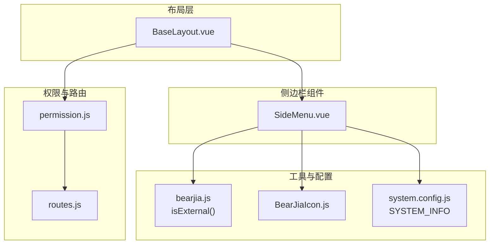
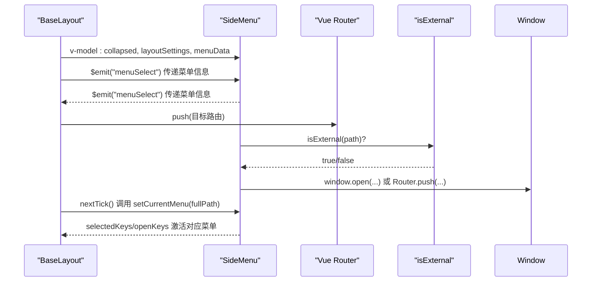
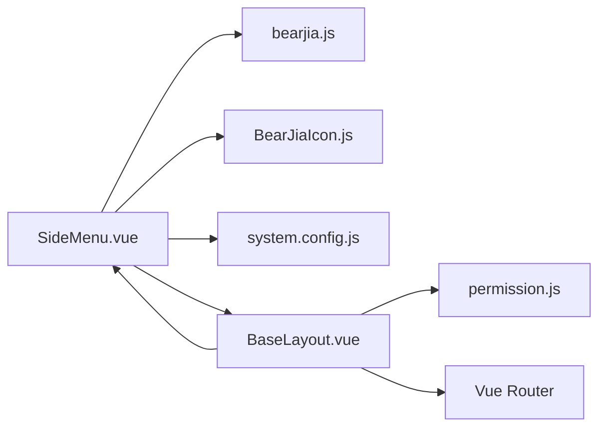
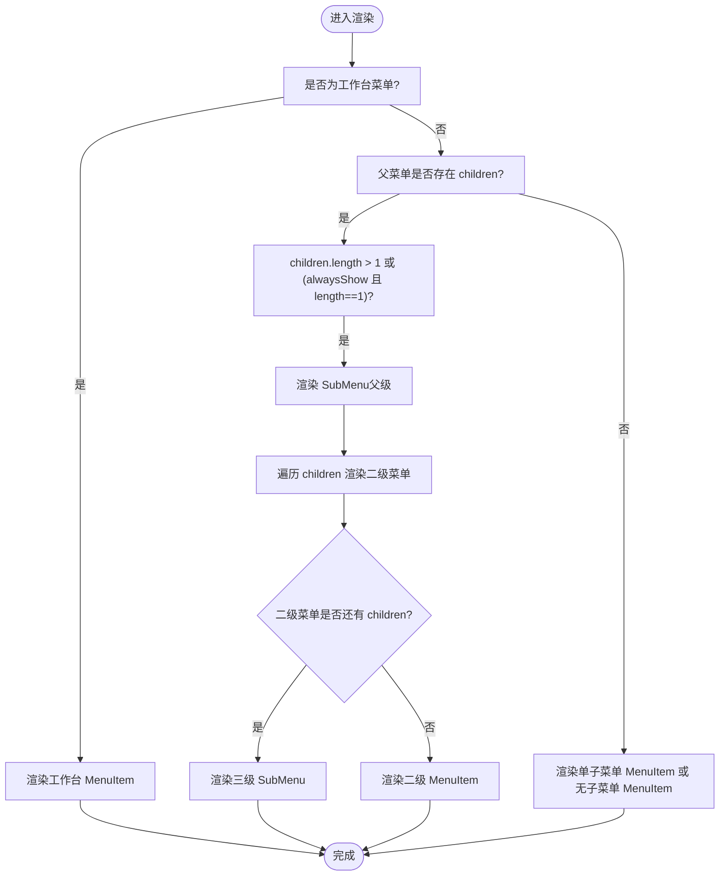

# 侧边栏

<cite>
**本文引用的文件**
- [SideMenu.vue](file://bear-jia-vue3/src/components/layout/SideMenu.vue)
- [BaseLayout.vue](file://bear-jia-vue3/src/layout/BaseLayout.vue)
- [permission.js](file://bear-jia-vue3/src/stores/permission.js)
- [bearjia.js](file://bear-jia-vue3/src/utils/bearjia.js)
- [BearJiaIcon.js](file://bear-jia-vue3/src/utils/BearJiaIcon.js)
- [system.config.js](file://bear-jia-vue3/src/config/system.config.js)
- [routes.js](file://bear-jia-vue3/src/router/routes.js)
</cite>

## 目录
1. [简介](#简介)
2. [项目结构](#项目结构)
3. [核心组件](#核心组件)
4. [架构总览](#架构总览)
5. [详细组件分析](#详细组件分析)
6. [依赖关系分析](#依赖关系分析)
7. [性能考量](#性能考量)
8. [故障排查指南](#故障排查指南)
9. [结论](#结论)
10. [附录](#附录)

## 简介
本篇文档聚焦于侧边栏组件 SideMenu 的实现机制，系统性阐述其如何接收 menuData 渲染动态菜单，覆盖工作台、多级子菜单、单子菜单、无子菜单等场景；说明 handleOpenChange 如何管理展开/折叠状态，setCurrentMenu 如何根据当前路由路径激活对应菜单项；解释外链菜单的特殊渲染与点击行为；并梳理 SideMenu 与 BaseLayout 的通信机制（通过 props 接收 collapsed 和 layoutSettings，通过 $emit 触发 menuSelect 通知父组件）。最后给出 menuData 数据结构说明与最佳实践建议。

## 项目结构
SideMenu 位于布局组件目录，作为 BaseLayout 的子组件之一参与不同布局模式的渲染。menuData 来源于权限路由 store，经过过滤与路径拼接后注入 SideMenu。

图表来源
- [BaseLayout.vue](file://bear-jia-vue3/src/layout/BaseLayout.vue#L1-L120)
- [SideMenu.vue](file://bear-jia-vue3/src/components/layout/SideMenu.vue#L1-L120)
- [permission.js](file://bear-jia-vue3/src/stores/permission.js#L230-L261)
- [routes.js](file://bear-jia-vue3/src/router/routes.js#L41-L69)
- [bearjia.js](file://bear-jia-vue3/src/utils/bearjia.js#L1-L10)
- [BearJiaIcon.js](file://bear-jia-vue3/src/utils/BearJiaIcon.js#L1-L91)
- [system.config.js](file://bear-jia-vue3/src/config/system.config.js#L1-L30)

章节来源
- [BaseLayout.vue](file://bear-jia-vue3/src/layout/BaseLayout.vue#L1-L120)
- [SideMenu.vue](file://bear-jia-vue3/src/components/layout/SideMenu.vue#L1-L120)
- [permission.js](file://bear-jia-vue3/src/stores/permission.js#L230-L261)
- [routes.js](file://bear-jia-vue3/src/router/routes.js#L41-L69)

## 核心组件
- SideMenu：负责渲染侧边栏菜单、管理展开/折叠状态、根据路由激活菜单、处理外链点击。
- BaseLayout：负责布局切换、监听路由变化、调用 SideMenu 的 setCurrentMenu、通过 menuSelect 事件驱动路由跳转。
- permission store：生成 sidebarRouters（含外链保留策略），供 SideMenu 渲染。
- 工具函数 isExternal：识别外链，决定点击行为（新窗口打开 vs 路由跳转）。
- BearJiaIcon：动态渲染 Ant Design 图标。
- SYSTEM_INFO：Logo 与标题展示。

章节来源
- [SideMenu.vue](file://bear-jia-vue3/src/components/layout/SideMenu.vue#L1-L120)
- [BaseLayout.vue](file://bear-jia-vue3/src/layout/BaseLayout.vue#L790-L898)
- [permission.js](file://bear-jia-vue3/src/stores/permission.js#L230-L261)
- [bearjia.js](file://bear-jia-vue3/src/utils/bearjia.js#L1-L10)
- [BearJiaIcon.js](file://bear-jia-vue3/src/utils/BearJiaIcon.js#L1-L91)
- [system.config.js](file://bear-jia-vue3/src/config/system.config.js#L1-L30)

## 架构总览
SideMenu 与 BaseLayout 的交互流程如下：

图表来源
- [BaseLayout.vue](file://bear-jia-vue3/src/layout/BaseLayout.vue#L790-L898)
- [SideMenu.vue](file://bear-jia-vue3/src/components/layout/SideMenu.vue#L144-L214)
- [bearjia.js](file://bear-jia-vue3/src/utils/bearjia.js#L1-L10)

## 详细组件分析

### SideMenu 渲染与菜单类型分支
SideMenu 通过 v-for 遍历 menuData，按以下规则渲染：
- 多级子菜单：父菜单 children 长度大于 1，或满足 alwaysShow 且仅有一个子菜单时，渲染为可折叠 SubMenu，并在其中嵌套二级/三级菜单。
- 单子菜单：父菜单仅有一个子菜单且未设置 alwaysShow 时，直接渲染为 MenuItem，点击即跳转。
- 无子菜单：父菜单无 children 或长度为 0 时，渲染为 MenuItem。
- 工作台：固定 key 为 workbench 的 MenuItem，点击后激活工作台并清空展开状态。

此外，对于父菜单、二级菜单、三级菜单，若其 path 为外链，会在标题右侧显示外链图标。

章节来源
- [SideMenu.vue](file://bear-jia-vue3/src/components/layout/SideMenu.vue#L34-L122)

### 展开/折叠状态管理 handleOpenChange
- 限制同时展开层级：当 keys 长度超过 1 时，仅保留最新一次展开的顶层父菜单 key，避免多层同时展开。
- 顶层判定：通过比对最新 key 是否与某顶层父菜单的 key 匹配，决定是否仅保留该顶层 key。

章节来源
- [SideMenu.vue](file://bear-jia-vue3/src/components/layout/SideMenu.vue#L144-L158)

### 菜单项点击与外链处理
- 二级菜单点击：handleMenuClick 根据父子路径构造 selectedKeys/openKeys，并通过 $emit('menuSelect') 通知父组件。
- 三级菜单点击：handleThreeLevelMenuClick 依据三级菜单上下文构造 selectedKeys/openKeys，并通过 $emit('menuSelect') 通知父组件。
- 外链判断：点击前检查 isExternal(path)，若是外链则直接 window.open 在新窗口打开，不再触发路由跳转。
- 工作台：点击 workbench 时，selectedKeys 设为 'workbench'，openKeys 清空。

章节来源
- [SideMenu.vue](file://bear-jia-vue3/src/components/layout/SideMenu.vue#L160-L214)
- [bearjia.js](file://bear-jia-vue3/src/utils/bearjia.js#L1-L10)

### 根据路由激活菜单 setCurrentMenu
- 工作台：当 fullPath 为 '/home/workbench' 时，激活 'workbench' 并清空展开。
- 三层匹配：优先匹配三级菜单（相对路径与完整路径两种形式），命中后设置三级菜单 key 与两级父级 openKeys。
- 二级匹配：匹配二级菜单（相对路径与完整路径两种形式），命中后设置二级菜单 key 与父级 openKeys。
- 单子菜单：当父菜单仅有一个子菜单且未设置 alwaysShow 时，命中后设置单子菜单 wrapper key，父级无需展开。
- 未匹配：记录日志并输出菜单数据示例，便于调试。

章节来源
- [SideMenu.vue](file://bear-jia-vue3/src/components/layout/SideMenu.vue#L216-L305)

### 与 BaseLayout 的通信机制
- 接收 props：
  - collapsed：来自 BaseLayout 的 v-model:collapsed，控制侧边栏折叠状态。
  - layoutSettings：主题、导航模式、暗色开关等布局设置。
  - menuData：由 permission store 生成的 sidebarRouters，包含外链保留策略。
- 触发事件：
  - @openChange：向 BaseLayout 传递折叠/展开状态变化（用于同步折叠状态）。
  - @menuSelect：向上抛出菜单选择信息，BaseLayout 监听并执行路由跳转。
- 被 BaseLayout 调用：
  - BaseLayout 在路由变化后，通过 ref 调用 SideMenu.expose 的 setCurrentMenu，使菜单与当前路径保持一致。

章节来源
- [BaseLayout.vue](file://bear-jia-vue3/src/layout/BaseLayout.vue#L1-L120)
- [BaseLayout.vue](file://bear-jia-vue3/src/layout/BaseLayout.vue#L790-L898)
- [SideMenu.vue](file://bear-jia-vue3/src/components/layout/SideMenu.vue#L1-L120)

### menuData 数据结构说明与最佳实践
- 结构要点
  - 顶层数组：每个元素代表一个父菜单，包含 path、name、meta（title/icon/alwaysShow 等）、children（可选）。
  - children：可为二级菜单；若存在三级菜单，children 中的元素可再包含 children。
  - 外链：若 path 以 http/https/mailto/tel 开头，视为外链；在菜单中显示外链图标，点击时在新窗口打开。
  - alwaysShow：当父菜单仅有一个子菜单但设置了 alwaysShow 时，仍渲染为可折叠 SubMenu，便于展示多级结构。
- 最佳实践
  - 为每个菜单提供 meta.title 与 meta.icon，保证 UI 一致性。
  - 外链应明确以协议开头，避免误判为内部路由。
  - 为复杂菜单提供 meta.alwaysShow，确保即使只有一个子菜单也显示为可折叠父级，提升导航体验。
  - 路径拼接遵循后端返回的扁平化规则，避免重复斜杠与前缀缺失。
  - 侧边栏路由生成时保留外链（用于菜单显示），但不将其加入 Vue Router，避免路由冲突。

章节来源
- [permission.js](file://bear-jia-vue3/src/stores/permission.js#L230-L261)
- [permission.js](file://bear-jia-vue3/src/stores/permission.js#L75-L103)
- [permission.js](file://bear-jia-vue3/src/stores/permission.js#L144-L175)
- [routes.js](file://bear-jia-vue3/src/router/routes.js#L41-L69)
- [bearjia.js](file://bear-jia-vue3/src/utils/bearjia.js#L1-L10)

## 依赖关系分析
- SideMenu 依赖
  - bearjia.js：外链判断 isExternal。
  - BearJiaIcon.js：动态图标渲染。
  - system.config.js：SYSTEM_INFO 用于 Logo 与标题展示。
  - BaseLayout：通过 props 传入 collapsed/layoutSettings/menuData，通过 $emit('menuSelect') 与父组件通信。
- BaseLayout 依赖
  - permission store：提供 sidebarRouters。
  - Vue Router：执行路由跳转。
  - isExternal：统一外链判断入口。
  - SideMenu：通过 ref 调用 setCurrentMenu，保持菜单与路由一致。

图表来源
- [SideMenu.vue](file://bear-jia-vue3/src/components/layout/SideMenu.vue#L1-L120)
- [BaseLayout.vue](file://bear-jia-vue3/src/layout/BaseLayout.vue#L1-L120)
- [permission.js](file://bear-jia-vue3/src/stores/permission.js#L230-L261)
- [bearjia.js](file://bear-jia-vue3/src/utils/bearjia.js#L1-L10)
- [BearJiaIcon.js](file://bear-jia-vue3/src/utils/BearJiaIcon.js#L1-L91)
- [system.config.js](file://bear-jia-vue3/src/config/system.config.js#L1-L30)

章节来源
- [SideMenu.vue](file://bear-jia-vue3/src/components/layout/SideMenu.vue#L1-L120)
- [BaseLayout.vue](file://bear-jia-vue3/src/layout/BaseLayout.vue#L1-L120)
- [permission.js](file://bear-jia-vue3/src/stores/permission.js#L230-L261)

## 性能考量
- 渲染优化
  - 通过 v-model:selectedKeys/v-model:openKeys 控制菜单状态，减少不必要的重渲染。
  - 外链点击直接 window.open，避免进入路由守卫与组件挂载流程，降低开销。
- 路由匹配
  - setCurrentMenu 采用两层循环与路径拼接，建议 menuData 规模可控；若菜单规模较大，可在上游 store 层建立索引映射以加速定位。
- 主题与样式
  - 暗色模式下通过 CSS 变量与深色主题覆盖，避免频繁 DOM 操作带来的抖动。

[本节为通用指导，不直接分析具体文件]

## 故障排查指南
- 现象：点击菜单无响应
  - 检查是否为外链（以 http/https/mailto/tel 开头），外链会直接打开新窗口，不会触发路由跳转。
  - 检查 menuSelect 事件是否被 BaseLayout 正确监听与处理。
- 现象：菜单未高亮
  - 确认 BaseLayout 在路由变化后调用了 SideMenu.setCurrentMenu。
  - 检查 fullPath 与菜单路径是否匹配（相对路径与完整路径两种形式均需考虑）。
- 现象：展开异常
  - 检查 handleOpenChange 的逻辑是否正确保留顶层父级 key。
  - 确认 alwaysShow 与 children 数量的组合是否符合预期。
- 现象：外链图标未显示
  - 确认父/子菜单 path 为外链，且渲染逻辑未被条件分支覆盖。

章节来源
- [SideMenu.vue](file://bear-jia-vue3/src/components/layout/SideMenu.vue#L144-L214)
- [SideMenu.vue](file://bear-jia-vue3/src/components/layout/SideMenu.vue#L216-L305)
- [BaseLayout.vue](file://bear-jia-vue3/src/layout/BaseLayout.vue#L790-L898)
- [bearjia.js](file://bear-jia-vue3/src/utils/bearjia.js#L1-L10)

## 结论
SideMenu 通过清晰的菜单类型分支、严格的展开状态管理、完善的外链处理与与 BaseLayout 的紧密协作，实现了灵活、稳定的侧边栏导航。配合 permission store 的外链保留策略与路径拼接规则，既能满足复杂多级菜单场景，又能兼容外链需求。建议在实际业务中规范 menuData 结构与 meta 字段，确保渲染与交互体验一致。

[本节为总结性内容，不直接分析具体文件]

## 附录

### 菜单渲染流程图（代码级）

图表来源
- [SideMenu.vue](file://bear-jia-vue3/src/components/layout/SideMenu.vue#L34-L122)