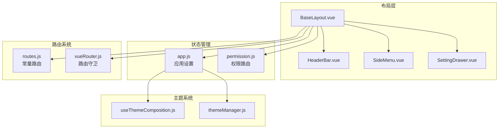
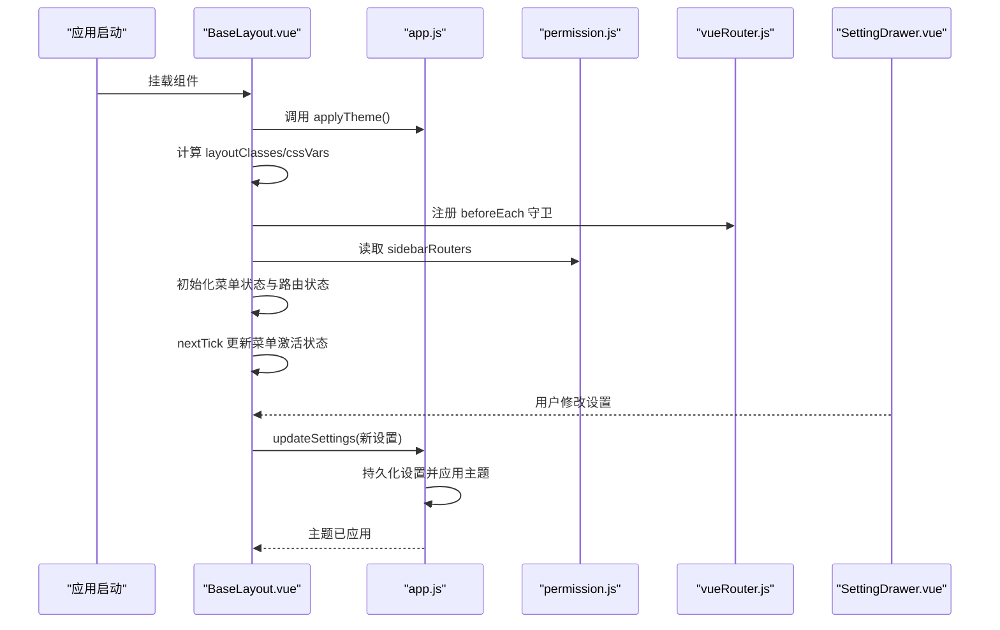
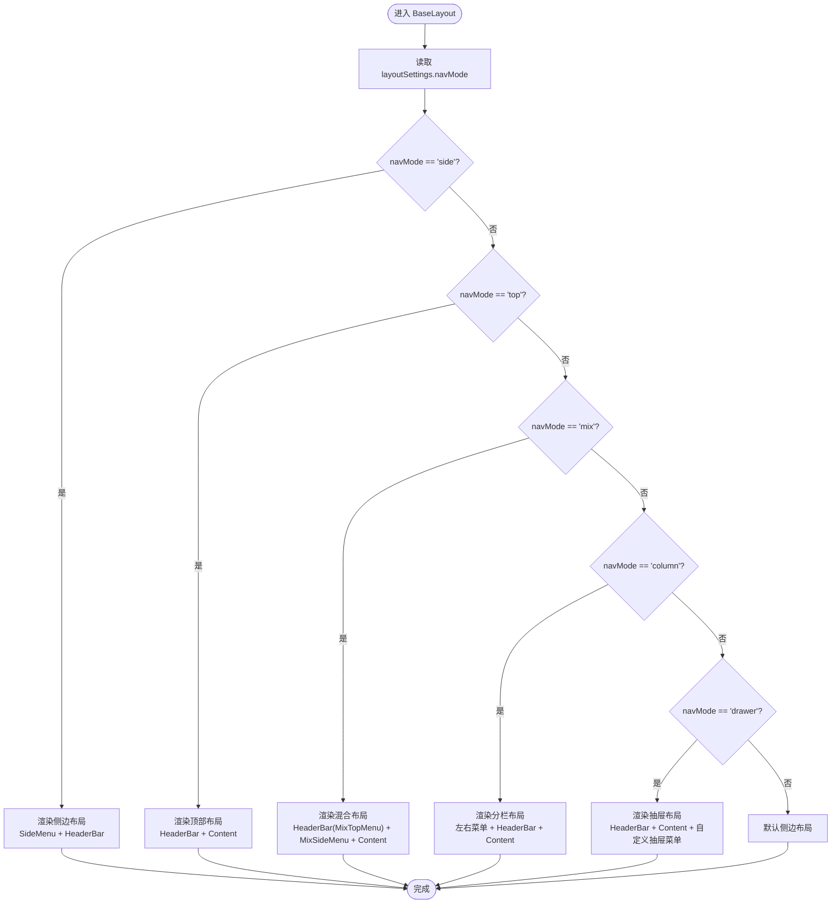
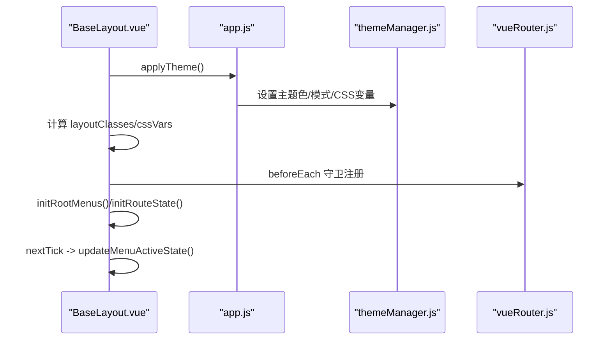
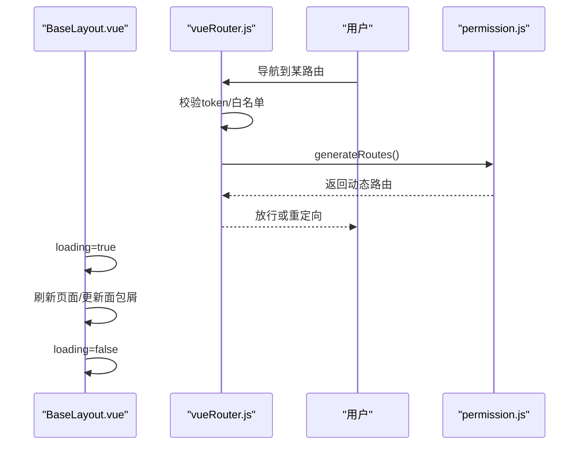
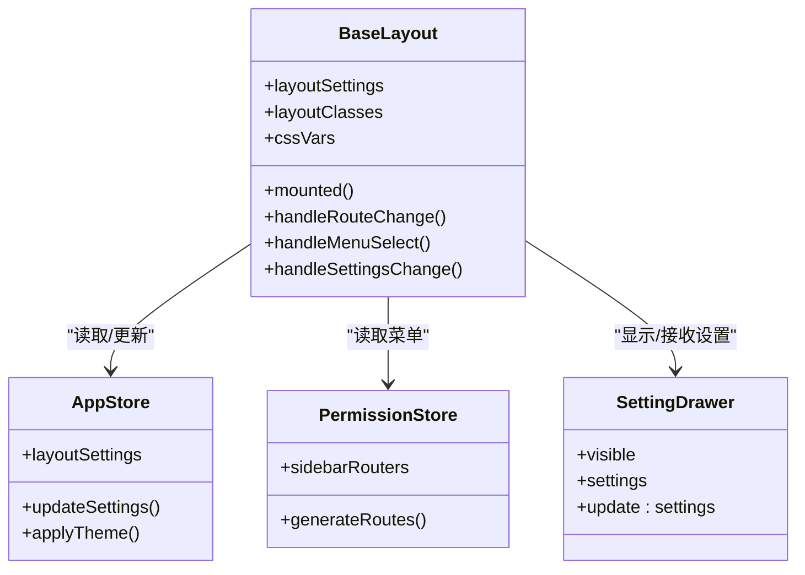
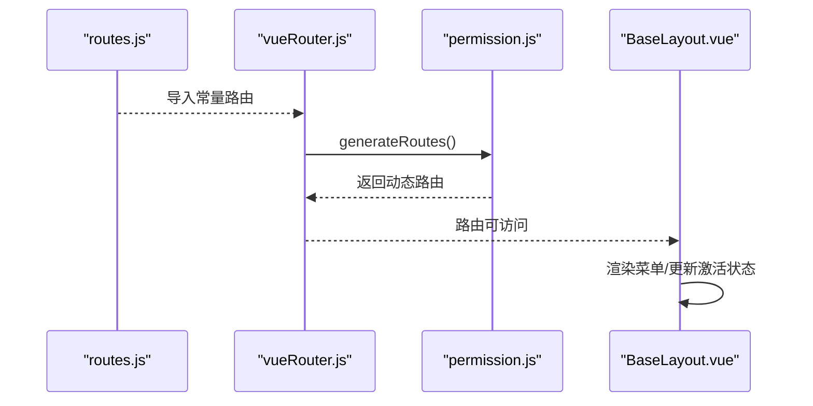
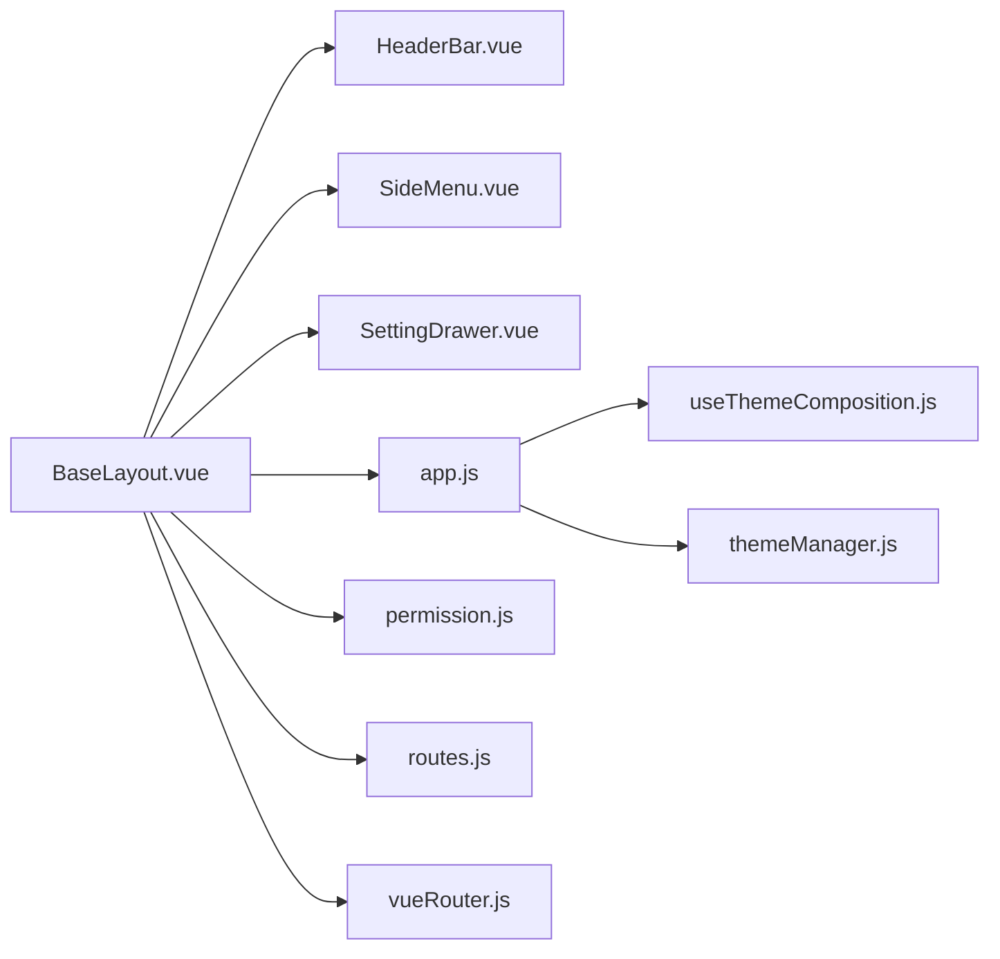

# 基础布局

<cite>
**本文档引用的文件**
- [BaseLayout.vue](file://bear-jia-vue3/src/layout/BaseLayout.vue)
- [HeaderBar.vue](file://bear-jia-vue3/src/components/layout/HeaderBar.vue)
- [SideMenu.vue](file://bear-jia-vue3/src/components/layout/SideMenu.vue)
- [SettingDrawer.vue](file://bear-jia-vue3/src/components/layout/SettingDrawer.vue)
- [app.js](file://bear-jia-vue3/src/stores/app.js)
- [permission.js](file://bear-jia-vue3/src/stores/permission.js)
- [vueRouter.js](file://bear-jia-vue3/src/router/vueRouter.js)
- [routes.js](file://bear-jia-vue3/src/router/routes.js)
- [useThemeComposition.js](file://bear-jia-vue3/src/utils/theme/composables/useThemeComposition.js)
- [themeManager.js](file://bear-jia-vue3/src/utils/theme/themeManager.js)
- [FrontendLayout.vue](file://bear-jia-vue3/src/layout/FrontendLayout.vue)
</cite>

## 目录
1. [引言](#引言)
2. [项目结构](#项目结构)
3. [核心组件](#核心组件)
4. [架构总览](#架构总览)
5. [详细组件分析](#详细组件分析)
6. [依赖关系分析](#依赖关系分析)
7. [性能考量](#性能考量)
8. [故障排查指南](#故障排查指南)
9. [结论](#结论)

## 引言
本文件围绕 BaseLayout.vue 作为应用整体布局容器的核心职责展开，系统阐述其如何依据 layoutSettings 中的 navMode 配置（side/top/mix/column/drawer）动态渲染不同布局结构；如何协调侧边栏、头部栏、内容区域与设置抽屉之间的关系；在 mounted 生命周期中完成主题初始化、应用布局设置与路由守卫注册的完整流程；以及通过计算属性 layoutClasses 与 cssVars 实现动态样式控制。同时，文档还说明 BaseLayout 与路由系统、状态管理（Pinia Store）的集成方式，并给出页面加载状态与错误边界的最佳实践建议。

## 项目结构
BaseLayout 位于 src/layout 目录，是后台管理系统的主布局容器，负责承载头部栏、侧边菜单、内容区域与设置抽屉等模块，并通过 Pinia 状态管理与路由系统协同工作。

图表来源
- [BaseLayout.vue](file://bear-jia-vue3/src/layout/BaseLayout.vue#L1-L120)
- [HeaderBar.vue](file://bear-jia-vue3/src/components/layout/HeaderBar.vue#L1-L120)
- [SideMenu.vue](file://bear-jia-vue3/src/components/layout/SideMenu.vue#L1-L120)
- [SettingDrawer.vue](file://bear-jia-vue3/src/components/layout/SettingDrawer.vue#L1-L120)
- [app.js](file://bear-jia-vue3/src/stores/app.js#L1-L120)
- [permission.js](file://bear-jia-vue3/src/stores/permission.js#L210-L264)
- [routes.js](file://bear-jia-vue3/src/router/routes.js#L1-L100)
- [vueRouter.js](file://bear-jia-vue3/src/router/vueRouter.js#L1-L130)
- [useThemeComposition.js](file://bear-jia-vue3/src/utils/theme/composables/useThemeComposition.js#L1-L120)
- [themeManager.js](file://bear-jia-vue3/src/utils/theme/themeManager.js#L1-L120)

章节来源
- [BaseLayout.vue](file://bear-jia-vue3/src/layout/BaseLayout.vue#L1-L120)
- [routes.js](file://bear-jia-vue3/src/router/routes.js#L1-L100)

## 核心组件
- BaseLayout.vue：应用主布局容器，根据 navMode 渲染不同布局，协调头部、侧边、内容与设置抽屉，负责主题初始化、路由守卫注册与菜单激活状态维护。
- HeaderBar.vue：头部栏组件，支持侧边/顶部/混合/抽屉模式下的不同布局与交互。
- SideMenu.vue：侧边菜单组件，支持多级菜单、外链识别与菜单激活状态。
- SettingDrawer.vue：布局设置抽屉，提供主题模式、主题色、导航模式、布局开关与系统配置等设置入口。
- app.js：应用设置 Store，持久化 layoutSettings 并统一应用主题。
- permission.js：权限路由 Store，生成动态路由与侧边栏路由数据。
- vueRouter.js：全局路由守卫，鉴权与错误处理。
- routes.js：常量路由表，定义登录、404、首页与系统路由等。
- useThemeComposition.js：主题组合式 API，封装主题模式、颜色与事件监听。
- themeManager.js：主题管理器，集中管理主题色、模式与 CSS 变量应用。

章节来源
- [BaseLayout.vue](file://bear-jia-vue3/src/layout/BaseLayout.vue#L259-L390)
- [HeaderBar.vue](file://bear-jia-vue3/src/components/layout/HeaderBar.vue#L165-L210)
- [SideMenu.vue](file://bear-jia-vue3/src/components/layout/SideMenu.vue#L127-L210)
- [SettingDrawer.vue](file://bear-jia-vue3/src/components/layout/SettingDrawer.vue#L370-L470)
- [app.js](file://bear-jia-vue3/src/stores/app.js#L1-L120)
- [permission.js](file://bear-jia-vue3/src/stores/permission.js#L210-L264)
- [vueRouter.js](file://bear-jia-vue3/src/router/vueRouter.js#L37-L109)
- [routes.js](file://bear-jia-vue3/src/router/routes.js#L1-L100)
- [useThemeComposition.js](file://bear-jia-vue3/src/utils/theme/composables/useThemeComposition.js#L1-L120)
- [themeManager.js](file://bear-jia-vue3/src/utils/theme/themeManager.js#L1-L120)

## 架构总览
BaseLayout 作为布局中枢，通过 Pinia 的 appStore 读取 layoutSettings，结合 permissionStore 的 sidebarRouters 与路由系统，动态渲染不同导航模式的布局结构。其 mounted 生命周期中完成主题初始化、应用布局设置与全局路由守卫注册；通过计算属性 layoutClasses 与 cssVars 控制样式；通过 SettingDrawer 与 appStore.updateSettings 实现设置变更的持久化与主题应用。

图表来源
- [BaseLayout.vue](file://bear-jia-vue3/src/layout/BaseLayout.vue#L757-L794)
- [app.js](file://bear-jia-vue3/src/stores/app.js#L105-L118)
- [permission.js](file://bear-jia-vue3/src/stores/permission.js#L234-L261)
- [vueRouter.js](file://bear-jia-vue3/src/router/vueRouter.js#L37-L99)
- [SettingDrawer.vue](file://bear-jia-vue3/src/components/layout/SettingDrawer.vue#L588-L596)

## 详细组件分析

### BaseLayout：布局容器与导航模式渲染
- 导航模式分支：根据 layoutSettings.navMode 渲染 side/top/mix/column/drawer 五种布局，分别绑定对应的菜单组件与头部栏。
- 头部栏与侧边栏协作：HeaderBar 在不同模式下渲染 TopMenu 或 MixTopMenu，并通过事件回调与 BaseLayout 的菜单选择逻辑联动；SideMenu/MixSideMenu 负责菜单项的点击与激活状态。
- 内容区域：统一通过 router-view 渲染当前路由页面，Ant Design Vue ConfigProvider 设置 zhCN 语言环境。
- 设置抽屉：SettingDrawer 通过 v-model:visible 控制显隐，接收 update:settings 事件以更新 layoutSettings。
- 菜单激活状态：mounted 与 watch 监听 layoutSettings/navMode 变化，调用各菜单组件的 setCurrentMenu 方法，确保当前路由高亮。

图表来源
- [BaseLayout.vue](file://bear-jia-vue3/src/layout/BaseLayout.vue#L1-L258)

章节来源
- [BaseLayout.vue](file://bear-jia-vue3/src/layout/BaseLayout.vue#L1-L258)

### BaseLayout：生命周期与主题初始化
- mounted 流程：
  - 调用 appStore.applyTheme() 应用主题；
  - nextTick 触发 themeVars 计算，确保主题变量生效；
  - 注册全局路由守卫 beforeEach，基于 handleRouteChange 校验路由有效性；
  - 初始化根菜单与路由状态，随后 nextTick 调用 updateMenuActiveState 同步菜单激活状态。
- 主题变量：通过 themeVars 计算 primaryColor 及其 hover/active/variant，交由主题服务统一应用 CSS 变量。
- 样式控制：layoutClasses 计算类名，如 layout-side/layout-top/layout-mix/layout-column/layout-drawer、fixed-header/fixed-sidebar/dark-theme/color-weak 等，用于控制布局外观与行为。

图表来源
- [BaseLayout.vue](file://bear-jia-vue3/src/layout/BaseLayout.vue#L757-L794)
- [app.js](file://bear-jia-vue3/src/stores/app.js#L105-L118)
- [themeManager.js](file://bear-jia-vue3/src/utils/theme/themeManager.js#L103-L142)
- [vueRouter.js](file://bear-jia-vue3/src/router/vueRouter.js#L37-L99)

章节来源
- [BaseLayout.vue](file://bear-jia-vue3/src/layout/BaseLayout.vue#L757-L794)
- [app.js](file://bear-jia-vue3/src/stores/app.js#L105-L118)
- [themeManager.js](file://bear-jia-vue3/src/utils/theme/themeManager.js#L103-L142)

### BaseLayout：路由守卫与页面加载状态
- 全局守卫：在 beforeEach 中校验 token、拉取用户信息与动态路由，处理白名单与错误场景；对路由不存在的情况弹窗提示并跳转 404。
- 页面加载状态：HeaderBar 的 loading 与 BaseLayout 的 loading 共同控制加载指示器；BaseLayout.refreshCurrentPage 通过替换查询参数或调用组件 fetchData 方式刷新当前页面，避免路由重定向导致的数据丢失。
- 错误边界：handleError 与 router.onError 统一处理异常，message 提示与通知提醒用户。

图表来源
- [vueRouter.js](file://bear-jia-vue3/src/router/vueRouter.js#L37-L109)
- [permission.js](file://bear-jia-vue3/src/stores/permission.js#L234-L261)
- [BaseLayout.vue](file://bear-jia-vue3/src/layout/BaseLayout.vue#L443-L471)

章节来源
- [vueRouter.js](file://bear-jia-vue3/src/router/vueRouter.js#L37-L109)
- [permission.js](file://bear-jia-vue3/src/stores/permission.js#L234-L261)
- [BaseLayout.vue](file://bear-jia-vue3/src/layout/BaseLayout.vue#L443-L471)

### BaseLayout：与状态管理（Pinia）的集成
- 应用设置：appStore.layoutSettings 提供 navMode、fixedHeader、fixedSidebar、darkMode、colorWeak、multiTab 等配置；updateSettings 持久化到 localStorage 并调用 applyTheme。
- 权限路由：permissionStore.sidebarRouters 作为菜单数据源，BaseLayout 通过 computed 读取并在不同菜单组件间共享。
- 设置抽屉：SettingDrawer 接收 BaseLayout 的 layoutSettings，用户修改后通过 update:settings 事件回传，BaseLayout 调用 appStore.updateSettings 完成持久化与主题应用。

图表来源
- [BaseLayout.vue](file://bear-jia-vue3/src/layout/BaseLayout.vue#L340-L390)
- [app.js](file://bear-jia-vue3/src/stores/app.js#L66-L118)
- [permission.js](file://bear-jia-vue3/src/stores/permission.js#L234-L261)
- [SettingDrawer.vue](file://bear-jia-vue3/src/components/layout/SettingDrawer.vue#L475-L511)

章节来源
- [BaseLayout.vue](file://bear-jia-vue3/src/layout/BaseLayout.vue#L340-L390)
- [app.js](file://bear-jia-vue3/src/stores/app.js#L66-L118)
- [permission.js](file://bear-jia-vue3/src/stores/permission.js#L234-L261)
- [SettingDrawer.vue](file://bear-jia-vue3/src/components/layout/SettingDrawer.vue#L475-L511)

### BaseLayout：与路由系统（Vue Router）的集成
- 常量路由：routes.js 定义登录、404、首页与系统路由，其中首页重定向至工作台。
- 动态路由：permission.js 生成动态路由并注入到 router；BaseLayout 通过 permissionStore.sidebarRouters 渲染菜单。
- 全局守卫：vueRouter.js 在 beforeEach 中处理鉴权、白名单与动态路由缺失时的重新生成，afterEach 中保存/恢复页面滚动位置与进度条。

图表来源
- [routes.js](file://bear-jia-vue3/src/router/routes.js#L1-L100)
- [vueRouter.js](file://bear-jia-vue3/src/router/vueRouter.js#L37-L109)
- [permission.js](file://bear-jia-vue3/src/stores/permission.js#L234-L261)
- [BaseLayout.vue](file://bear-jia-vue3/src/layout/BaseLayout.vue#L337-L340)

章节来源
- [routes.js](file://bear-jia-vue3/src/router/routes.js#L1-L100)
- [vueRouter.js](file://bear-jia-vue3/src/router/vueRouter.js#L37-L109)
- [permission.js](file://bear-jia-vue3/src/stores/permission.js#L234-L261)
- [BaseLayout.vue](file://bear-jia-vue3/src/layout/BaseLayout.vue#L337-L340)

### BaseLayout：动态样式控制（layoutClasses 与 cssVars）
- layoutClasses：根据 navMode、fixedHeader、fixedSidebar、darkMode、colorWeak 等设置生成类名，用于切换布局样式与主题模式。
- cssVars：当前实现中返回空对象，主题变量通过 documentElement 上的 CSS 变量由主题服务集中管理。
- 主题变量：themeVars 计算 primaryColor 及 hover/active/variant，配合主题服务统一写入 CSS 变量，确保组件与布局一致的主题效果。

章节来源
- [BaseLayout.vue](file://bear-jia-vue3/src/layout/BaseLayout.vue#L374-L390)
- [themeManager.js](file://bear-jia-vue3/src/utils/theme/themeManager.js#L103-L142)

### BaseLayout：与前端布局（FrontendLayout）的关系
- FrontendLayout.vue 用于前台展示页面，采用独立的头部与内容结构，与 BaseLayout 的后台布局解耦。
- 两者均使用 SYSTEM_INFO 与主题系统，但 FrontendLayout 更关注前台导航与展示。

章节来源
- [FrontendLayout.vue](file://bear-jia-vue3/src/layout/FrontendLayout.vue#L1-L120)

## 依赖关系分析
- 组件耦合：
  - BaseLayout 与 HeaderBar、SideMenu、SettingDrawer 为强耦合关系，通过 props 与事件通信。
  - BaseLayout 与 appStore、permissionStore 为状态依赖关系，通过 computed 与 actions 协同。
- 外部依赖：
  - Vue Router：全局守卫与路由表。
  - Ant Design Vue：ConfigProvider、Spin、Modal、Notification 等 UI 组件。
  - 主题服务：useThemeComposition 与 themeManager 统一主题色与模式。

图表来源
- [BaseLayout.vue](file://bear-jia-vue3/src/layout/BaseLayout.vue#L259-L390)
- [HeaderBar.vue](file://bear-jia-vue3/src/components/layout/HeaderBar.vue#L165-L210)
- [SideMenu.vue](file://bear-jia-vue3/src/components/layout/SideMenu.vue#L127-L210)
- [SettingDrawer.vue](file://bear-jia-vue3/src/components/layout/SettingDrawer.vue#L370-L470)
- [app.js](file://bear-jia-vue3/src/stores/app.js#L1-L120)
- [permission.js](file://bear-jia-vue3/src/stores/permission.js#L210-L264)
- [routes.js](file://bear-jia-vue3/src/router/routes.js#L1-L100)
- [vueRouter.js](file://bear-jia-vue3/src/router/vueRouter.js#L1-L130)
- [useThemeComposition.js](file://bear-jia-vue3/src/utils/theme/composables/useThemeComposition.js#L1-L120)
- [themeManager.js](file://bear-jia-vue3/src/utils/theme/themeManager.js#L1-L120)

章节来源
- [BaseLayout.vue](file://bear-jia-vue3/src/layout/BaseLayout.vue#L259-L390)
- [app.js](file://bear-jia-vue3/src/stores/app.js#L1-L120)
- [permission.js](file://bear-jia-vue3/src/stores/permission.js#L210-L264)
- [vueRouter.js](file://bear-jia-vue3/src/router/vueRouter.js#L1-L130)

## 性能考量
- 菜单激活状态更新：通过 nextTick 与 setTimeout 延迟确保新布局渲染完成后再激活菜单，避免不必要的重绘与闪烁。
- 路由守卫：在动态路由缺失时重新生成，避免频繁 addRoute 导致的性能问题；白名单与已存在路由判断减少无效处理。
- 主题应用：集中通过主题服务设置 CSS 变量，避免在组件内部重复计算与写入，降低样式抖动风险。
- 页面滚动：afterEach 中保存/恢复滚动位置，提升用户体验并减少页面跳动。

[本节为通用指导，无需特定文件引用]

## 故障排查指南
- 路由不存在或权限不足：
  - 现象：导航后提示“页面不存在”或被重定向至 404。
  - 排查：检查 vueRouter.js 的 beforeEach 逻辑与 permission.js 的 generateRoutes 是否正确执行。
- 菜单不激活或高亮异常：
  - 现象：切换布局或刷新后菜单未高亮。
  - 排查：确认 updateMenuActiveState 与各菜单组件的 setCurrentMenu 是否被调用；检查 navMode 切换后的 nextTick 延迟。
- 主题色/模式不生效：
  - 现象：设置抽屉切换主题后界面无变化。
  - 排查：确认 appStore.updateSettings 是否持久化设置并调用 applyTheme；检查 themeManager 是否正确写入 CSS 变量。
- 页面刷新失败：
  - 现象：刷新当前页面报错或数据未更新。
  - 排查：检查 BaseLayout.refreshCurrentPage 的实现，确认是否调用组件的 fetchData 或通过查询参数刷新。

章节来源
- [BaseLayout.vue](file://bear-jia-vue3/src/layout/BaseLayout.vue#L443-L471)
- [vueRouter.js](file://bear-jia-vue3/src/router/vueRouter.js#L37-L109)
- [permission.js](file://bear-jia-vue3/src/stores/permission.js#L234-L261)
- [app.js](file://bear-jia-vue3/src/stores/app.js#L66-L118)
- [themeManager.js](file://bear-jia-vue3/src/utils/theme/themeManager.js#L103-L142)

## 结论
BaseLayout 作为后台管理应用的布局中枢，通过 navMode 驱动多种导航模式的动态渲染，协调头部栏、侧边菜单、内容区域与设置抽屉，借助 Pinia 与路由系统实现主题初始化、路由守卫与菜单激活状态的统一管理。其计算属性与主题服务共同实现了灵活的样式控制与良好的用户体验。遵循本文档的最佳实践，可进一步提升布局的稳定性与可维护性。