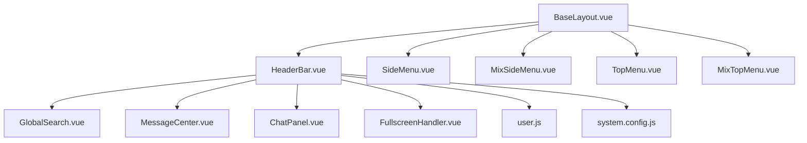
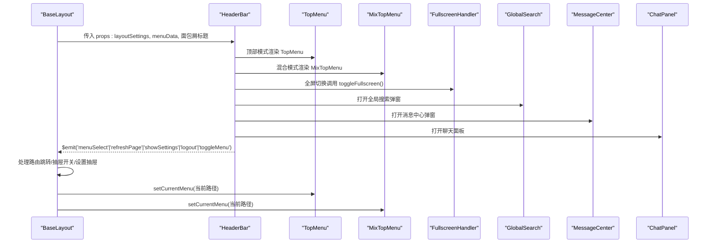
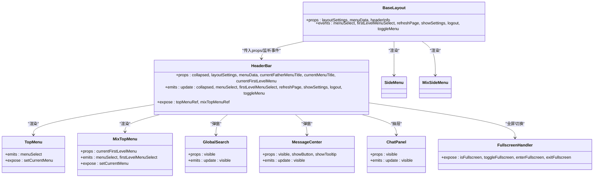

# 头栏

<cite>
**本文档引用的文件**
- [HeaderBar.vue](file://bear-jia-vue3/src/components/layout/HeaderBar.vue)
- [BaseLayout.vue](file://bear-jia-vue3/src/layout/BaseLayout.vue)
- [TopMenu.vue](file://bear-jia-vue3/src/components/layout/TopMenu.vue)
- [MixTopMenu.vue](file://bear-jia-vue3/src/components/layout/MixTopMenu.vue)
- [GlobalSearch.vue](file://bear-jia-vue3/src/components/common/GlobalSearch.vue)
- [MessageCenter.vue](file://bear-jia-vue3/src/components/common/MessageCenter.vue)
- [ChatPanel.vue](file://bear-jia-vue3/src/components/common/ChatPanel.vue)
- [FullscreenHandler.vue](file://bear-jia-vue3/src/components/common/FullscreenHandler.vue)
- [SideMenu.vue](file://bear-jia-vue3/src/components/layout/SideMenu.vue)
- [MixSideMenu.vue](file://bear-jia-vue3/src/components/layout/MixSideMenu.vue)
- [user.js](file://bear-jia-vue3/src/stores/user.js)
- [system.config.js](file://bear-jia-vue3/src/config/system.config.js)
</cite>

## 目录
1. [简介](#简介)
2. [项目结构](#项目结构)
3. [核心组件](#核心组件)
4. [架构总览](#架构总览)
5. [组件详解](#组件详解)
6. [依赖关系分析](#依赖关系分析)
7. [性能考量](#性能考量)
8. [故障排查指南](#故障排查指南)
9. [结论](#结论)

## 简介
本文件面向“头部栏”组件（HeaderBar）的使用与扩展，系统性说明其在不同布局模式（side/top/mix/drawer）下的UI呈现与功能差异，并阐述其与全局搜索、消息通知、在线聊天、全屏切换、页面刷新、布局设置等实用功能的集成方式。同时，文档详细解释HeaderBar如何通过props接收用户信息并实现智能头像的生成与显示；说明其与BaseLayout之间的双向绑定（collapsed）与事件通信（$emit）机制；以及如何通过ref暴露内部组件引用以供父组件调用。

## 项目结构
HeaderBar位于布局组件目录中，作为BaseLayout的子组件之一，配合侧边栏、顶部菜单、混合菜单、抽屉模式等共同构成完整的页面头部体验。其右侧集成了全局搜索、消息中心、在线聊天、全屏切换、页面刷新、布局设置等常用工具；左侧在不同模式下展示折叠按钮、面包屑或Logo与标题；顶部模式下渲染TopMenu，混合模式下渲染MixTopMenu。

图表来源
- [BaseLayout.vue](file://bear-jia-vue3/src/layout/BaseLayout.vue#L1-L258)
- [HeaderBar.vue](file://bear-jia-vue3/src/components/layout/HeaderBar.vue#L1-L163)
- [TopMenu.vue](file://bear-jia-vue3/src/components/layout/TopMenu.vue#L1-L250)
- [MixTopMenu.vue](file://bear-jia-vue3/src/components/layout/MixTopMenu.vue#L1-L182)
- [GlobalSearch.vue](file://bear-jia-vue3/src/components/common/GlobalSearch.vue#L1-L318)
- [MessageCenter.vue](file://bear-jia-vue3/src/components/common/MessageCenter.vue#L1-L511)
- [ChatPanel.vue](file://bear-jia-vue3/src/components/common/ChatPanel.vue#L1-L469)
- [FullscreenHandler.vue](file://bear-jia-vue3/src/components/common/FullscreenHandler.vue#L1-L147)
- [SideMenu.vue](file://bear-jia-vue3/src/components/layout/SideMenu.vue#L1-L386)
- [MixSideMenu.vue](file://bear-jia-vue3/src/components/layout/MixSideMenu.vue#L1-L275)
- [user.js](file://bear-jia-vue3/src/stores/user.js#L1-L83)
- [system.config.js](file://bear-jia-vue3/src/config/system.config.js#L1-L272)

章节来源
- [BaseLayout.vue](file://bear-jia-vue3/src/layout/BaseLayout.vue#L1-L258)
- [HeaderBar.vue](file://bear-jia-vue3/src/components/layout/HeaderBar.vue#L1-L163)

## 核心组件
- HeaderBar：头部栏组件，负责在不同navMode下渲染不同的UI元素与交互，承载全局搜索、消息通知、在线聊天、全屏切换、页面刷新、布局设置等工具入口，并提供智能头像展示与下拉菜单。
- TopMenu：顶部模式下的水平菜单，支持工作台、多级菜单与外链处理。
- MixTopMenu：混合模式下的顶部一级菜单，配合侧边栏二级/三级菜单联动。
- GlobalSearch：全局搜索弹窗，支持快捷操作与搜索历史。
- MessageCenter：消息中心弹窗，支持标签筛选与未读计数。
- ChatPanel：右侧抽屉式聊天面板，支持联系人列表与消息对话。
- FullscreenHandler：全屏切换处理器，封装浏览器全屏API与键盘事件。
- SideMenu / MixSideMenu：侧边栏菜单组件，分别在side与mix模式下提供菜单树。
- BaseLayout：布局容器，根据layoutSettings.navMode决定渲染哪一种头部与侧边栏组合，并与HeaderBar进行双向绑定与事件通信。
- user.js：用户状态存储，提供头像、昵称等信息。
- system.config.js：系统配置，提供SYSTEM_INFO等常量。

章节来源
- [HeaderBar.vue](file://bear-jia-vue3/src/components/layout/HeaderBar.vue#L1-L163)
- [TopMenu.vue](file://bear-jia-vue3/src/components/layout/TopMenu.vue#L1-L250)
- [MixTopMenu.vue](file://bear-jia-vue3/src/components/layout/MixTopMenu.vue#L1-L182)
- [GlobalSearch.vue](file://bear-jia-vue3/src/components/common/GlobalSearch.vue#L1-L318)
- [MessageCenter.vue](file://bear-jia-vue3/src/components/common/MessageCenter.vue#L1-L511)
- [ChatPanel.vue](file://bear-jia-vue3/src/components/common/ChatPanel.vue#L1-L469)
- [FullscreenHandler.vue](file://bear-jia-vue3/src/components/common/FullscreenHandler.vue#L1-L147)
- [SideMenu.vue](file://bear-jia-vue3/src/components/layout/SideMenu.vue#L1-L386)
- [MixSideMenu.vue](file://bear-jia-vue3/src/components/layout/MixSideMenu.vue#L1-L275)
- [BaseLayout.vue](file://bear-jia-vue3/src/layout/BaseLayout.vue#L1-L258)
- [user.js](file://bear-jia-vue3/src/stores/user.js#L1-L83)
- [system.config.js](file://bear-jia-vue3/src/config/system.config.js#L1-L272)

## 架构总览
HeaderBar与BaseLayout之间通过props与$emit建立松耦合的通信：
- BaseLayout将layoutSettings.navMode、menuData、当前面包屑标题等传入HeaderBar；
- HeaderBar根据navMode动态渲染不同UI，并通过$emit向上抛出菜单选择、刷新、设置、登出、抽屉开关等事件；
- BaseLayout监听这些事件并执行路由跳转、抽屉开关、设置抽屉显示等操作；
- HeaderBar通过defineExpose暴露topMenuRef与mixTopMenuRef，便于父组件调用其setCurrentMenu等方法恢复菜单高亮。

图表来源
- [BaseLayout.vue](file://bear-jia-vue3/src/layout/BaseLayout.vue#L1-L258)
- [HeaderBar.vue](file://bear-jia-vue3/src/components/layout/HeaderBar.vue#L1-L163)
- [TopMenu.vue](file://bear-jia-vue3/src/components/layout/TopMenu.vue#L1-L250)
- [MixTopMenu.vue](file://bear-jia-vue3/src/components/layout/MixTopMenu.vue#L1-L182)
- [FullscreenHandler.vue](file://bear-jia-vue3/src/components/common/FullscreenHandler.vue#L1-L147)
- [GlobalSearch.vue](file://bear-jia-vue3/src/components/common/GlobalSearch.vue#L1-L318)
- [MessageCenter.vue](file://bear-jia-vue3/src/components/common/MessageCenter.vue#L1-L511)
- [ChatPanel.vue](file://bear-jia-vue3/src/components/common/ChatPanel.vue#L1-L469)

## 组件详解

### HeaderBar：不同布局模式下的UI与功能差异
- 侧边栏模式（navMode为side）
  - 左侧显示折叠按钮（展开/折叠图标随collapsed状态切换），点击触发update:collapsed；
  - 左侧显示面包屑标题（父级/当前菜单标题）；
  - 右侧提供全局搜索、消息通知、在线聊天、全屏切换、页面刷新、布局设置、用户下拉菜单等工具。
- 顶部菜单模式（navMode为top）
  - 左侧显示Logo与系统名称；
  - 中部渲染TopMenu，支持工作台、多级菜单与外链；
  - 右侧提供与侧边栏模式相同的工具集合。
- 混合模式（navMode为mix）
  - 左侧显示Logo与系统名称；
  - 中部渲染MixTopMenu，仅展示一级菜单，点击后由父组件更新currentFirstLevelMenu并联动MixSideMenu；
  - 右侧提供与侧边栏模式相同的工具集合。
- 抽屉模式（navMode为drawer）
  - 左侧显示菜单按钮（菜单图标），点击触发toggleMenu事件；
  - 右侧提供与侧边栏模式相同的工具集合；
  - BaseLayout使用自定义抽屉菜单替代Antd Drawer，点击内容区或遮罩层自动关闭。

章节来源
- [HeaderBar.vue](file://bear-jia-vue3/src/components/layout/HeaderBar.vue#L1-L163)
- [BaseLayout.vue](file://bear-jia-vue3/src/layout/BaseLayout.vue#L217-L258)

### 智能头像与用户信息
- HeaderBar通过useUserStore获取用户头像与昵称/用户名，若头像加载失败则回退到智能头像：根据用户名生成固定哈希，映射到预设颜色数组，显示首字母作为占位头像。
- 头像加载失败时会记录错误状态并在头像变更时重置，确保下次尝试加载。
- 用户下拉菜单提供个人中心、布局设置、退出登录等操作，均通过$emit向上通知父组件。

章节来源
- [HeaderBar.vue](file://bear-jia-vue3/src/components/layout/HeaderBar.vue#L193-L303)
- [user.js](file://bear-jia-vue3/src/stores/user.js#L1-L83)

### 全局搜索、消息通知、在线聊天、全屏切换、页面刷新、布局设置
- 全局搜索：点击搜索按钮打开GlobalSearch弹窗，支持输入搜索、快捷操作与搜索历史，点击结果或快捷项后路由跳转并关闭弹窗。
- 消息通知：点击消息按钮打开MessageCenter弹窗，支持标签筛选、未读计数、一键已读、点击消息标记已读等。
- 在线聊天：点击聊天按钮打开ChatPanel抽屉，支持联系人列表、搜索联系人、进入对话、发送消息与模拟回复。
- 全屏切换：点击全屏按钮调用FullscreenHandler.toggleFullscreen，支持ESC键退出全屏与提示层。
- 页面刷新：点击刷新按钮触发refreshPage事件，父组件处理刷新逻辑。
- 布局设置：点击设置按钮触发showSettings事件，父组件显示设置抽屉。

章节来源
- [HeaderBar.vue](file://bear-jia-vue3/src/components/layout/HeaderBar.vue#L60-L163)
- [GlobalSearch.vue](file://bear-jia-vue3/src/components/common/GlobalSearch.vue#L1-L318)
- [MessageCenter.vue](file://bear-jia-vue3/src/components/common/MessageCenter.vue#L1-L511)
- [ChatPanel.vue](file://bear-jia-vue3/src/components/common/ChatPanel.vue#L1-L469)
- [FullscreenHandler.vue](file://bear-jia-vue3/src/components/common/FullscreenHandler.vue#L1-L147)

### 与BaseLayout的双向绑定与事件通信
- 双向绑定（collapsed）
  - HeaderBar通过v-model:collapsed与父组件同步侧边栏折叠状态；
  - BaseLayout在不同布局模式下均绑定collapsed，确保侧边栏与头部一致。
- 事件通信（$emit）
  - HeaderBar向上抛出：menuSelect、firstLevelMenuSelect、refreshPage、showSettings、logout、toggleMenu；
  - BaseLayout监听并处理：路由跳转、抽屉开关、设置抽屉显示、退出登录、刷新页面等。
- ref暴露
  - HeaderBar通过defineExpose暴露topMenuRef与mixTopMenuRef，父组件可调用其setCurrentMenu以恢复菜单高亮。

章节来源
- [BaseLayout.vue](file://bear-jia-vue3/src/layout/BaseLayout.vue#L1-L258)
- [HeaderBar.vue](file://bear-jia-vue3/src/components/layout/HeaderBar.vue#L1-L163)

### 与菜单组件的协作
- 顶部模式：HeaderBar渲染TopMenu，菜单选择事件由TopMenu发出，HeaderBar再转发至BaseLayout。
- 混合模式：HeaderBar渲染MixTopMenu，菜单选择事件由MixTopMenu发出，HeaderBar转发至BaseLayout，并额外发出firstLevelMenuSelect事件以更新当前一级菜单。
- 侧边栏与混合侧边栏：SideMenu与MixSideMenu各自处理菜单选择与外链跳转，HeaderBar不直接渲染它们，但通过BaseLayout协调。

章节来源
- [HeaderBar.vue](file://bear-jia-vue3/src/components/layout/HeaderBar.vue#L40-L108)
- [TopMenu.vue](file://bear-jia-vue3/src/components/layout/TopMenu.vue#L1-L250)
- [MixTopMenu.vue](file://bear-jia-vue3/src/components/layout/MixTopMenu.vue#L1-L182)
- [SideMenu.vue](file://bear-jia-vue3/src/components/layout/SideMenu.vue#L1-L386)
- [MixSideMenu.vue](file://bear-jia-vue3/src/components/layout/MixSideMenu.vue#L1-L275)

## 依赖关系分析
- HeaderBar依赖：
  - 布局设置：layoutSettings.navMode决定UI分支；
  - 用户信息：useUserStore提供头像与昵称；
  - 系统信息：SYSTEM_INFO提供Logo与系统名称；
  - 子组件：TopMenu、MixTopMenu、GlobalSearch、MessageCenter、ChatPanel、FullscreenHandler；
  - 父组件：BaseLayout，负责事件处理与菜单高亮恢复。
- BaseLayout依赖：
  - HeaderBar（多种模式下传参与事件监听）；
  - SideMenu、MixSideMenu（侧边栏）；
  - SettingDrawer（布局设置抽屉）；
  - 路由与权限：根据菜单数据渲染顶部/侧边栏菜单。

图表来源
- [BaseLayout.vue](file://bear-jia-vue3/src/layout/BaseLayout.vue#L1-L258)
- [HeaderBar.vue](file://bear-jia-vue3/src/components/layout/HeaderBar.vue#L1-L163)
- [TopMenu.vue](file://bear-jia-vue3/src/components/layout/TopMenu.vue#L1-L250)
- [MixTopMenu.vue](file://bear-jia-vue3/src/components/layout/MixTopMenu.vue#L1-L182)
- [GlobalSearch.vue](file://bear-jia-vue3/src/components/common/GlobalSearch.vue#L1-L318)
- [MessageCenter.vue](file://bear-jia-vue3/src/components/common/MessageCenter.vue#L1-L511)
- [ChatPanel.vue](file://bear-jia-vue3/src/components/common/ChatPanel.vue#L1-L469)
- [FullscreenHandler.vue](file://bear-jia-vue3/src/components/common/FullscreenHandler.vue#L1-L147)
- [SideMenu.vue](file://bear-jia-vue3/src/components/layout/SideMenu.vue#L1-L386)
- [MixSideMenu.vue](file://bear-jia-vue3/src/components/layout/MixSideMenu.vue#L1-L275)

## 性能考量
- 头部工具按钮采用轻量级弹窗/抽屉组件，避免频繁重渲染；
- 全屏切换通过FullscreenHandler集中处理，减少重复逻辑；
- 智能头像使用用户名哈希与预设颜色数组，计算成本低；
- 菜单高亮恢复通过expose的setCurrentMenu方法，避免复杂DOM遍历；
- 建议在高频路由切换场景下，将菜单数据与面包屑标题缓存于store或本地存储，减少重复计算。

## 故障排查指南
- 头像不显示或一直显示占位头像
  - 检查useUserStore中avatar是否正确赋值；
  - 若头像加载失败，确认handleAvatarError是否被触发，以及watch对avatar的监听是否生效。
- 全屏无法退出或提示不出现
  - 检查FullscreenHandler的事件监听是否挂载，ESC键处理是否生效；
  - 确认浏览器全屏API支持情况。
- 菜单高亮未恢复
  - 确认BaseLayout在路由跳转后调用对应菜单组件的setCurrentMenu；
  - 检查传入的fullPath是否与菜单路径一致（含父路径）。
- 抽屉模式菜单不响应
  - 确认BaseLayout的toggleDrawerMenu与handleContentClick/handleDrawerOverlayClick逻辑；
  - 检查自定义抽屉遮罩层与菜单容器的点击事件冒泡与阻止。

章节来源
- [HeaderBar.vue](file://bear-jia-vue3/src/components/layout/HeaderBar.vue#L294-L359)
- [FullscreenHandler.vue](file://bear-jia-vue3/src/components/common/FullscreenHandler.vue#L1-L147)
- [BaseLayout.vue](file://bear-jia-vue3/src/layout/BaseLayout.vue#L537-L560)

## 结论
HeaderBar作为系统头部的核心组件，围绕layoutSettings.navMode实现了灵活的UI适配与功能集成。通过与BaseLayout的双向绑定与事件通信，HeaderBar将用户信息、全局搜索、消息通知、在线聊天、全屏切换、页面刷新、布局设置等能力无缝整合，并以智能头像与菜单高亮增强用户体验。对于扩展与定制，建议遵循现有事件与暴露接口，确保与BaseLayout及菜单组件的协同一致性。