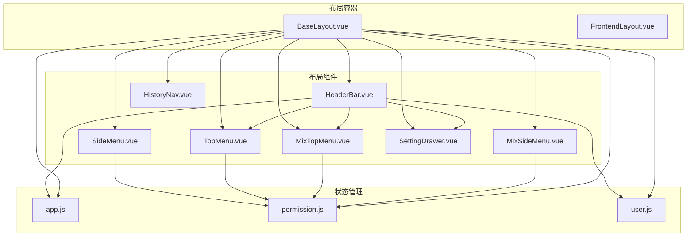
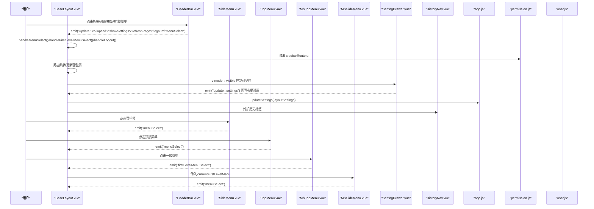
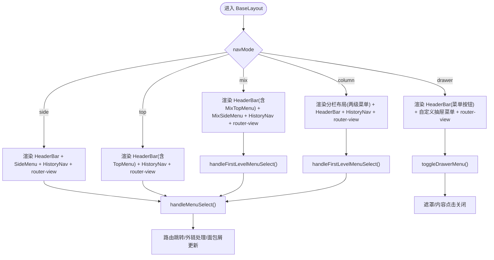
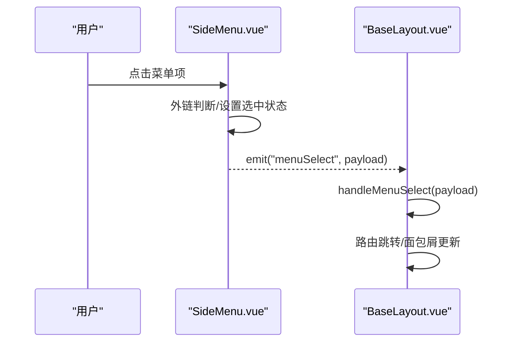
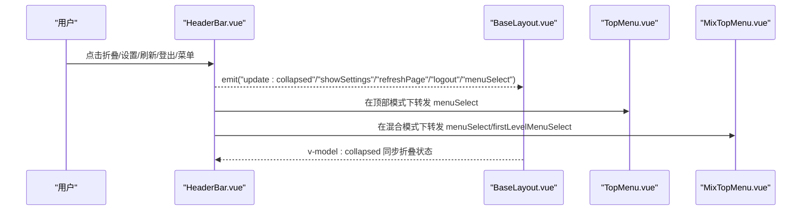
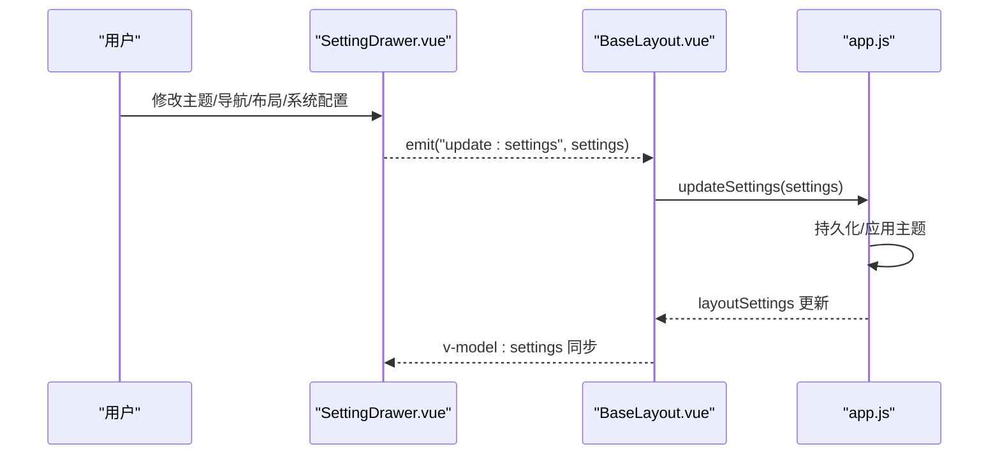
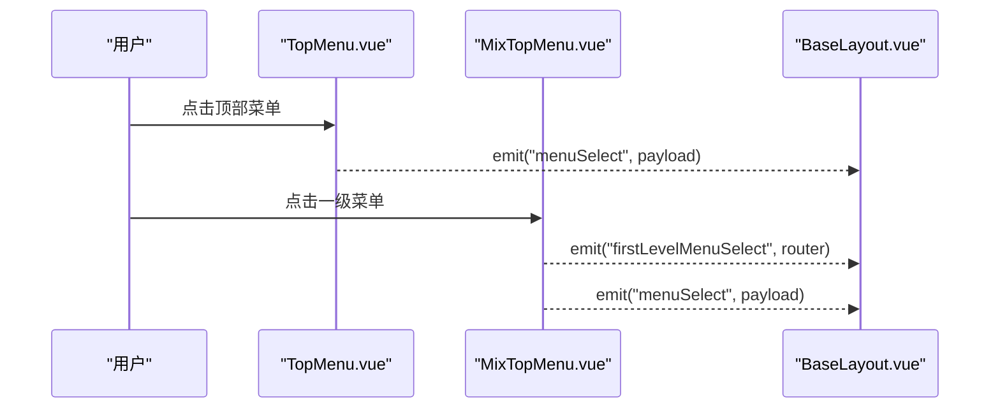
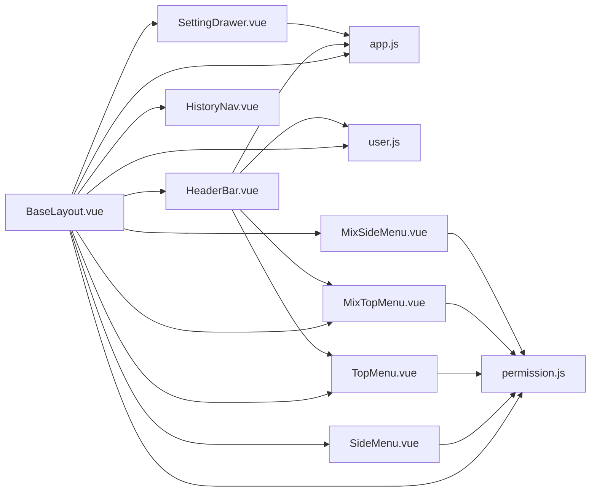

# 组件协作

<cite>
**本文引用的文件**
- [BaseLayout.vue](file://bear-jia-vue3/src/layout/BaseLayout.vue)
- [FrontendLayout.vue](file://bear-jia-vue3/src/layout/FrontendLayout.vue)
- [SideMenu.vue](file://bear-jia-vue3/src/components/layout/SideMenu.vue)
- [HeaderBar.vue](file://bear-jia-vue3/src/components/layout/HeaderBar.vue)
- [SettingDrawer.vue](file://bear-jia-vue3/src/components/layout/SettingDrawer.vue)
- [TopMenu.vue](file://bear-jia-vue3/src/components/layout/TopMenu.vue)
- [MixTopMenu.vue](file://bear-jia-vue3/src/components/layout/MixTopMenu.vue)
- [MixSideMenu.vue](file://bear-jia-vue3/src/components/layout/MixSideMenu.vue)
- [HistoryNav.vue](file://bear-jia-vue3/src/components/layout/HistoryNav.vue)
- [app.js](file://bear-jia-vue3/src/stores/app.js)
- [permission.js](file://bear-jia-vue3/src/stores/permission.js)
- [user.js](file://bear-jia-vue3/src/stores/user.js)
</cite>

## 目录
1. [简介](#简介)
2. [项目结构](#项目结构)
3. [核心组件](#核心组件)
4. [架构总览](#架构总览)
5. [详细组件分析](#详细组件分析)
6. [依赖关系分析](#依赖关系分析)
7. [性能考量](#性能考量)
8. [故障排查指南](#故障排查指南)
9. [结论](#结论)

## 简介
本文件聚焦于布局系统的组件协作关系，围绕 BaseLayout.vue 作为布局容器，协同 SideMenu、HeaderBar、SettingDrawer、TopMenu、MixTopMenu、MixSideMenu、HistoryNav 等组件，实现多布局模式（侧边栏、顶部菜单、混合、分栏、抽屉）下的菜单渲染、折叠状态管理、菜单选择与路由跳转、面包屑与历史标签、以及布局配置的可视化设置。文档同时梳理 props 与 events 的通信机制、状态管理与事件处理的完整流程，帮助读者快速理解并扩展布局能力。

## 项目结构
布局系统主要位于 bear-jia-vue3/src/layout 与 bear-jia-vue3/src/components/layout 两个目录：
- 容器与页面布局：BaseLayout.vue、FrontendLayout.vue
- 布局组件：SideMenu、HeaderBar、SettingDrawer、TopMenu、MixTopMenu、MixSideMenu、HistoryNav
- 状态管理：app.js、permission.js、user.js

图表来源
- [BaseLayout.vue](file://bear-jia-vue3/src/layout/BaseLayout.vue#L1-L260)
- [HeaderBar.vue](file://bear-jia-vue3/src/components/layout/HeaderBar.vue#L1-L163)
- [SideMenu.vue](file://bear-jia-vue3/src/components/layout/SideMenu.vue#L1-L125)
- [TopMenu.vue](file://bear-jia-vue3/src/components/layout/TopMenu.vue#L1-L83)
- [MixTopMenu.vue](file://bear-jia-vue3/src/components/layout/MixTopMenu.vue#L1-L30)
- [MixSideMenu.vue](file://bear-jia-vue3/src/components/layout/MixSideMenu.vue#L1-L23)
- [SettingDrawer.vue](file://bear-jia-vue3/src/components/layout/SettingDrawer.vue#L1-L120)
- [HistoryNav.vue](file://bear-jia-vue3/src/components/layout/HistoryNav.vue#L1-L54)
- [app.js](file://bear-jia-vue3/src/stores/app.js#L1-L120)
- [permission.js](file://bear-jia-vue3/src/stores/permission.js#L210-L264)
- [user.js](file://bear-jia-vue3/src/stores/user.js#L1-L40)

章节来源
- [BaseLayout.vue](file://bear-jia-vue3/src/layout/BaseLayout.vue#L1-L260)
- [FrontendLayout.vue](file://bear-jia-vue3/src/layout/FrontendLayout.vue#L1-L145)

## 核心组件
- BaseLayout.vue：布局容器，按 navMode 渲染不同布局（side/top/mix/column/drawer），协调 HeaderBar、SideMenu、TopMenu、MixTopMenu、MixSideMenu、HistoryNav、SettingDrawer 的显示与交互；负责菜单选择、路由跳转、抽屉模式、分栏布局等。
- HeaderBar.vue：头部工具栏，依据布局模式显示不同 UI（侧边栏折叠按钮、顶部菜单、混合模式顶部菜单、面包屑、用户下拉菜单、设置抽屉按钮等），通过事件向上抛出折叠、刷新、设置、登出、菜单选择等动作。
- SideMenu.vue：侧边栏菜单，支持 inline 模式、父子菜单层级、外链识别、工作台入口、菜单激活状态与外链处理，通过 menuSelect 事件向上汇报选择结果。
- TopMenu.vue：顶部菜单，水平模式，与 BaseLayout 的顶部模式配合，处理菜单选择事件。
- MixTopMenu.vue：混合模式顶部菜单，仅展示一级菜单，负责一级菜单选择与菜单选择事件。
- MixSideMenu.vue：混合模式侧边栏菜单，基于当前一级菜单动态渲染其子菜单，处理二级/三级菜单选择。
- SettingDrawer.vue：布局配置抽屉，提供主题、导航模式、布局设置、系统配置、表格配置、导入导出与重置等功能，通过 update:settings 事件回写布局设置。
- HistoryNav.vue：历史标签导航，维护标签页列表、滚动与交互、刷新/关闭等操作。

章节来源
- [BaseLayout.vue](file://bear-jia-vue3/src/layout/BaseLayout.vue#L1-L260)
- [HeaderBar.vue](file://bear-jia-vue3/src/components/layout/HeaderBar.vue#L1-L163)
- [SideMenu.vue](file://bear-jia-vue3/src/components/layout/SideMenu.vue#L1-L125)
- [TopMenu.vue](file://bear-jia-vue3/src/components/layout/TopMenu.vue#L1-L83)
- [MixTopMenu.vue](file://bear-jia-vue3/src/components/layout/MixTopMenu.vue#L1-L30)
- [MixSideMenu.vue](file://bear-jia-vue3/src/components/layout/MixSideMenu.vue#L1-L23)
- [SettingDrawer.vue](file://bear-jia-vue3/src/components/layout/SettingDrawer.vue#L1-L120)
- [HistoryNav.vue](file://bear-jia-vue3/src/components/layout/HistoryNav.vue#L1-L54)

## 架构总览
BaseLayout 作为中枢，根据 layoutSettings.navMode 决定渲染哪一组组件：
- 侧边栏模式：HeaderBar + SideMenu + HistoryNav + router-view
- 顶部菜单模式：HeaderBar（内置 TopMenu）+ HistoryNav + router-view
- 混合模式：HeaderBar（内置 MixTopMenu）+ MixSideMenu + HistoryNav + router-view
- 分栏模式：HeaderBar（分栏头部）+ 两级菜单 + HistoryNav + router-view
- 抽屉模式：HeaderBar（带菜单按钮）+ 自定义抽屉菜单 + router-view

图表来源
- [BaseLayout.vue](file://bear-jia-vue3/src/layout/BaseLayout.vue#L260-L592)
- [HeaderBar.vue](file://bear-jia-vue3/src/components/layout/HeaderBar.vue#L256-L360)
- [SideMenu.vue](file://bear-jia-vue3/src/components/layout/SideMenu.vue#L133-L215)
- [TopMenu.vue](file://bear-jia-vue3/src/components/layout/TopMenu.vue#L85-L120)
- [MixTopMenu.vue](file://bear-jia-vue3/src/components/layout/MixTopMenu.vue#L32-L70)
- [MixSideMenu.vue](file://bear-jia-vue3/src/components/layout/MixSideMenu.vue#L94-L122)
- [SettingDrawer.vue](file://bear-jia-vue3/src/components/layout/SettingDrawer.vue#L475-L596)
- [HistoryNav.vue](file://bear-jia-vue3/src/components/layout/HistoryNav.vue#L191-L263)
- [app.js](file://bear-jia-vue3/src/stores/app.js#L66-L118)
- [permission.js](file://bear-jia-vue3/src/stores/permission.js#L234-L264)
- [user.js](file://bear-jia-vue3/src/stores/user.js#L64-L83)

## 详细组件分析

### BaseLayout：布局容器与协调者
- 多布局模式渲染：根据 layoutSettings.navMode 渲染 side/top/mix/column/drawer，分别组合 HeaderBar、SideMenu、TopMenu、MixTopMenu、MixSideMenu、HistoryNav、SettingDrawer。
- 菜单选择与路由跳转：handleMenuSelect/handleFirstLevelMenuSelect 统一处理菜单选择，支持工作台、二级/三级菜单路径拼接、外链处理、面包屑标题更新、路由跳转。
- 抽屉模式：toggleDrawerMenu/toggleDrawerMenuAndClose/handleContentClick/handleDrawerOverlayClick 实现抽屉开关与遮罩点击关闭。
- 分栏布局：维护一级/二级/三级菜单选中状态，提供工作台点击与三级菜单点击处理。
- 设置抽屉：v-model:visible 控制 SettingDrawer，@update:settings 接收布局设置变更并回写至 app.js。
- 状态来源：layoutSettings 来自 app.js；sidebarRouters 来自 permission.js；用户信息来自 user.js。

图表来源
- [BaseLayout.vue](file://bear-jia-vue3/src/layout/BaseLayout.vue#L1-L260)
- [BaseLayout.vue](file://bear-jia-vue3/src/layout/BaseLayout.vue#L592-L730)
- [BaseLayout.vue](file://bear-jia-vue3/src/layout/BaseLayout.vue#L732-L758)

章节来源
- [BaseLayout.vue](file://bear-jia-vue3/src/layout/BaseLayout.vue#L1-L260)
- [BaseLayout.vue](file://bear-jia-vue3/src/layout/BaseLayout.vue#L592-L758)

### SideMenu：菜单渲染与折叠状态管理
- 菜单层级：支持工作台、一级菜单（含 alwaysShow）、二级菜单（含三级）、外链识别与处理。
- 折叠状态：v-model:collapsed 与 @collapse 向上同步折叠状态。
- 选择事件：handleMenuClick/handleThreeLevelMenuClick 发射 menuSelect，携带父子菜单信息与组件路径。
- 激活状态：setCurrentMenu 根据 fullPath 匹配并设置 selectedKeys/openKeys，支持工作台与多级路径。

图表来源
- [SideMenu.vue](file://bear-jia-vue3/src/components/layout/SideMenu.vue#L133-L215)
- [BaseLayout.vue](file://bear-jia-vue3/src/layout/BaseLayout.vue#L592-L730)

章节来源
- [SideMenu.vue](file://bear-jia-vue3/src/components/layout/SideMenu.vue#L1-L125)
- [SideMenu.vue](file://bear-jia-vue3/src/components/layout/SideMenu.vue#L160-L215)

### HeaderBar：头部工具栏与菜单集成
- 模式适配：根据 layoutSettings.navMode 切换 UI（侧边栏折叠按钮、顶部菜单、混合模式菜单、面包屑标题）。
- 事件桥接：toggleCollapse/refreshCurrentPage/showSearch/showMessages/showChat/toggleFullscreen 等内部功能通过 emit 上抛；用户下拉菜单触发 personalCenter/logout/showSettings/menuSelect 等事件。
- 顶部菜单：在 top/mix 模式下嵌入 TopMenu/MixTopMenu，转发 menuSelect 与 firstLevelMenuSelect 事件。
- 抽屉模式：提供 toggleMenu 事件以控制自定义抽屉菜单。

图表来源
- [HeaderBar.vue](file://bear-jia-vue3/src/components/layout/HeaderBar.vue#L1-L163)
- [HeaderBar.vue](file://bear-jia-vue3/src/components/layout/HeaderBar.vue#L256-L360)
- [TopMenu.vue](file://bear-jia-vue3/src/components/layout/TopMenu.vue#L85-L120)
- [MixTopMenu.vue](file://bear-jia-vue3/src/components/layout/MixTopMenu.vue#L32-L70)

章节来源
- [HeaderBar.vue](file://bear-jia-vue3/src/components/layout/HeaderBar.vue#L1-L163)
- [HeaderBar.vue](file://bear-jia-vue3/src/components/layout/HeaderBar.vue#L256-L360)

### SettingDrawer：布局配置与持久化
- 主题与导航：主题模式、主题色、导航模式（side/top/mix/column/drawer）切换，自动禁用/启用相关设置。
- 布局设置：内容宽度、固定 Header/Sidebar、隐藏 Footer、多页签、表格样式等。
- 系统配置：系统标题、版权、版本等，支持实时更新与持久化。
- 导入导出与重置：支持导出/导入配置、重置所有设置，调用 app.js 的 resetSettings 与主题服务。
- 数据流：v-model:visible 控制可见性；@update:settings 将变更回写至 BaseLayout，再由 app.js 持久化与应用主题。

图表来源
- [SettingDrawer.vue](file://bear-jia-vue3/src/components/layout/SettingDrawer.vue#L475-L596)
- [SettingDrawer.vue](file://bear-jia-vue3/src/components/layout/SettingDrawer.vue#L598-L710)
- [app.js](file://bear-jia-vue3/src/stores/app.js#L66-L118)

章节来源
- [SettingDrawer.vue](file://bear-jia-vue3/src/components/layout/SettingDrawer.vue#L1-L120)
- [SettingDrawer.vue](file://bear-jia-vue3/src/components/layout/SettingDrawer.vue#L598-L710)
- [app.js](file://bear-jia-vue3/src/stores/app.js#L66-L118)

### TopMenu 与 MixTopMenu：顶部菜单与混合模式顶部菜单
- TopMenu：水平顶部菜单，支持工作台、多级菜单、外链识别，通过 menuSelect 事件上报。
- MixTopMenu：仅展示一级菜单，负责一级菜单选择与菜单选择事件；setCurrentMenu 支持根据 fullPath 激活对应一级菜单。

图表来源
- [TopMenu.vue](file://bear-jia-vue3/src/components/layout/TopMenu.vue#L85-L120)
- [MixTopMenu.vue](file://bear-jia-vue3/src/components/layout/MixTopMenu.vue#L32-L70)
- [BaseLayout.vue](file://bear-jia-vue3/src/layout/BaseLayout.vue#L472-L489)

章节来源
- [TopMenu.vue](file://bear-jia-vue3/src/components/layout/TopMenu.vue#L1-L83)
- [MixTopMenu.vue](file://bear-jia-vue3/src/components/layout/MixTopMenu.vue#L1-L30)

### MixSideMenu：混合模式侧边栏菜单
- 数据来源：基于 currentFirstLevelMenu.children 动态渲染二级/三级菜单。
- 选择事件：handleMenuClick/handleThreeLevelMenuClick 发射 menuSelect，支持外链处理。
- 激活状态：setCurrentMenu 根据 fullPath 匹配二级/三级菜单并设置选中。

章节来源
- [MixSideMenu.vue](file://bear-jia-vue3/src/components/layout/MixSideMenu.vue#L1-L23)
- [MixSideMenu.vue](file://bear-jia-vue3/src/components/layout/MixSideMenu.vue#L164-L223)

### HistoryNav：历史标签导航
- 标签维护：监听路由变化，动态添加/移除标签，限制最大数量，保证工作台始终在首位。
- 交互能力：左右滚动按钮、标签点击跳转、右键菜单（刷新/关闭/关闭其他/关闭全部）。
- 状态来源：从 permission.js.sidebarRouters 解析菜单标题，若未解析到则回退到路由 meta 或“未知页面”。

章节来源
- [HistoryNav.vue](file://bear-jia-vue3/src/components/layout/HistoryNav.vue#L191-L263)
- [permission.js](file://bear-jia-vue3/src/stores/permission.js#L234-L264)

## 依赖关系分析
- BaseLayout 依赖 app.js 提供 layoutSettings，依赖 permission.js 提供 sidebarRouters，依赖 user.js 提供用户信息。
- HeaderBar 依赖 app.js 提供 layoutSettings，依赖 user.js 提供头像/昵称，依赖 TopMenu/MixTopMenu 组合。
- SideMenu/TopMenu/MixTopMenu/MixSideMenu 依赖 permission.js.sidebarRouters 渲染菜单树。
- SettingDrawer 依赖 app.js 更新系统配置与布局设置，依赖主题服务应用主题。
- HistoryNav 依赖 permission.js.sidebarRouters 解析菜单标题，依赖路由与本地存储维护历史。

图表来源
- [BaseLayout.vue](file://bear-jia-vue3/src/layout/BaseLayout.vue#L260-L592)
- [HeaderBar.vue](file://bear-jia-vue3/src/components/layout/HeaderBar.vue#L165-L255)
- [SideMenu.vue](file://bear-jia-vue3/src/components/layout/SideMenu.vue#L127-L143)
- [TopMenu.vue](file://bear-jia-vue3/src/components/layout/TopMenu.vue#L85-L96)
- [MixTopMenu.vue](file://bear-jia-vue3/src/components/layout/MixTopMenu.vue#L32-L47)
- [MixSideMenu.vue](file://bear-jia-vue3/src/components/layout/MixSideMenu.vue#L94-L105)
- [SettingDrawer.vue](file://bear-jia-vue3/src/components/layout/SettingDrawer.vue#L370-L428)
- [app.js](file://bear-jia-vue3/src/stores/app.js#L1-L120)
- [permission.js](file://bear-jia-vue3/src/stores/permission.js#L234-L264)
- [user.js](file://bear-jia-vue3/src/stores/user.js#L1-L40)

章节来源
- [BaseLayout.vue](file://bear-jia-vue3/src/layout/BaseLayout.vue#L260-L592)
- [app.js](file://bear-jia-vue3/src/stores/app.js#L1-L120)
- [permission.js](file://bear-jia-vue3/src/stores/permission.js#L234-L264)
- [user.js](file://bear-jia-vue3/src/stores/user.js#L1-L40)

## 性能考量
- 菜单渲染：SideMenu/TopMenu/MixTopMenu/MixSideMenu 采用 v-for 渲染，建议在菜单层级较深时避免不必要的重渲染，可通过 key 设计与 computed 缓存减少开销。
- 外链处理：外链直接 window.open，避免路由跳转与页面抖动，提升交互流畅度。
- 折叠与抽屉：v-model:collapsed 与自定义抽屉菜单通过布尔状态控制，尽量减少 DOM 切换频率。
- 历史标签：HistoryNav 使用本地存储与节流滚动，注意在大量标签场景下避免频繁 DOM 操作。
- 主题应用：app.js.applyTheme 通过主题服务统一应用，避免重复设置 CSS 变量导致的重绘。

## 故障排查指南
- 菜单选择无响应
  - 检查 SideMenu/TopMenu/MixTopMenu 是否正确发射 menuSelect 事件，BaseLayout.handleMenuSelect 是否接收并处理。
  - 若为外链，确认 isExternal 判断逻辑与 window.open 调用。
- 路由跳转失败
  - 检查 BaseLayout.clickMenuItem/clickThreeLevelMenuItem 中路径拼接与路由是否存在。
  - 确认 permission.js.generateRoutes 是否正确生成并注入 sidebarRouters。
- 折叠状态不同步
  - 确认 HeaderBar.toggleCollapse 是否正确 emit update:collapsed，BaseLayout 是否接收并更新 collapsed。
- 设置抽屉不生效
  - 检查 SettingDrawer.emit("update:settings") 是否回写至 BaseLayout，app.js.updateSettings 是否持久化并应用主题。
- 历史标签异常
  - 检查 HistoryNav.getMenuTitle 是否能从 permission.js.sidebarRouters 解析到标题，或回退到路由 meta。

章节来源
- [BaseLayout.vue](file://bear-jia-vue3/src/layout/BaseLayout.vue#L592-L758)
- [permission.js](file://bear-jia-vue3/src/stores/permission.js#L234-L264)
- [app.js](file://bear-jia-vue3/src/stores/app.js#L66-L118)
- [HistoryNav.vue](file://bear-jia-vue3/src/components/layout/HistoryNav.vue#L88-L129)

## 结论
该布局系统通过 BaseLayout 作为中枢，将 HeaderBar、SideMenu、TopMenu、MixTopMenu、MixSideMenu、SettingDrawer、HistoryNav 等组件有机整合，形成多布局模式下的统一交互体验。组件间通过 props 传递数据（如 layoutSettings、menuData、collapsed、current*MenuTitle 等），通过 events 传递动作（如 menuSelect、update:collapsed、showSettings、logout 等）。状态管理由 app.js、permission.js、user.js 提供，确保主题、布局、菜单与用户信息的一致性与持久化。遵循本文的数据流与事件流分析，可快速定位问题并扩展新的布局模式与交互能力。