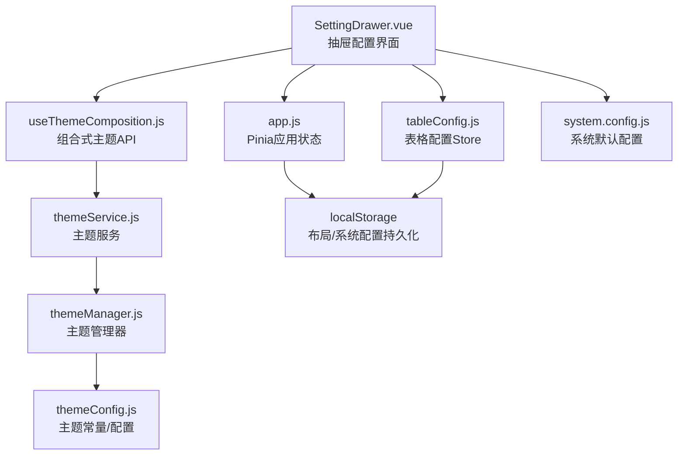
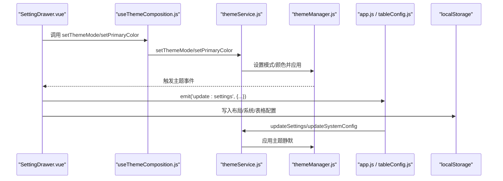
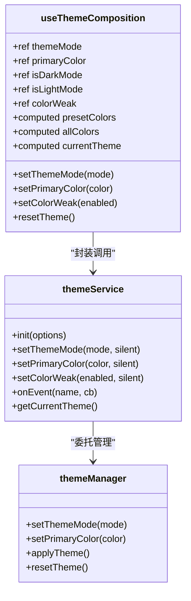
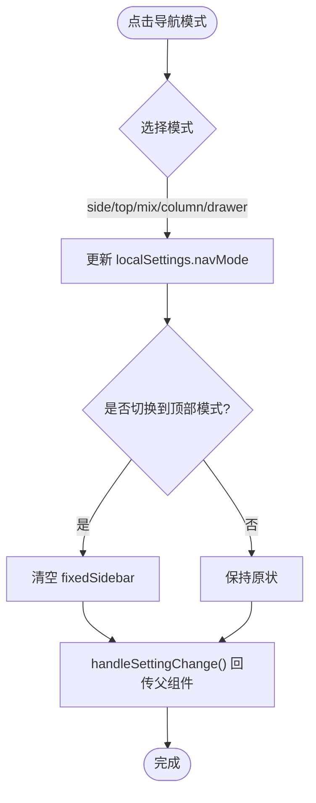
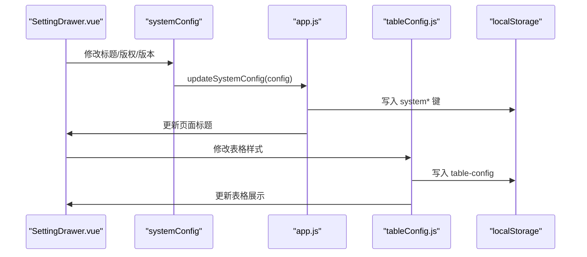
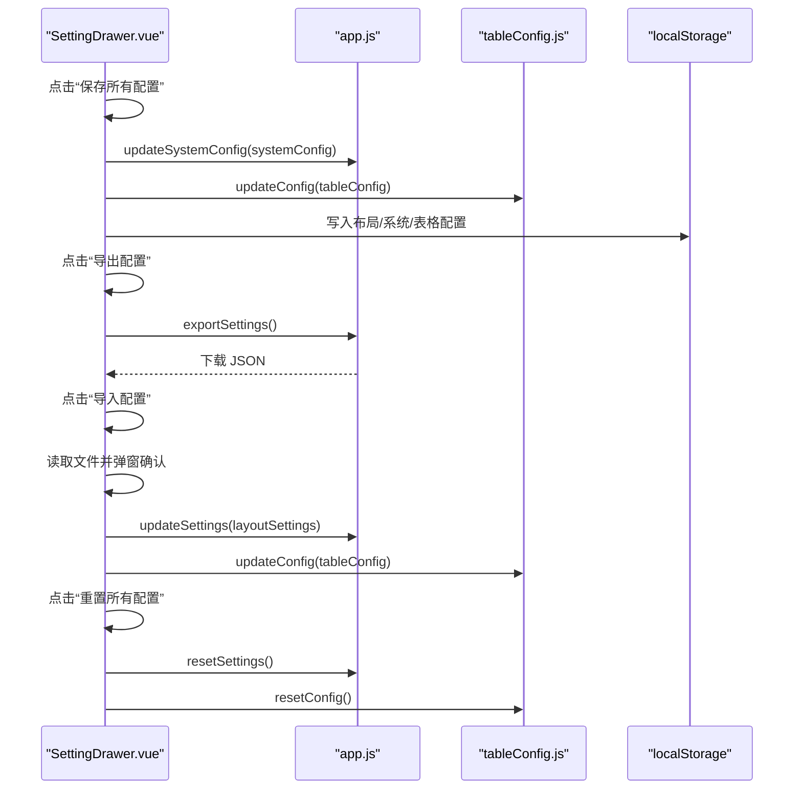
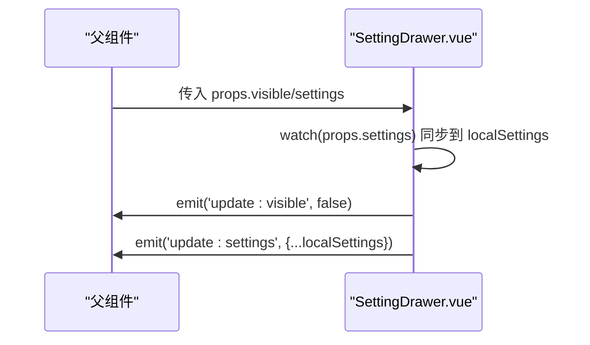
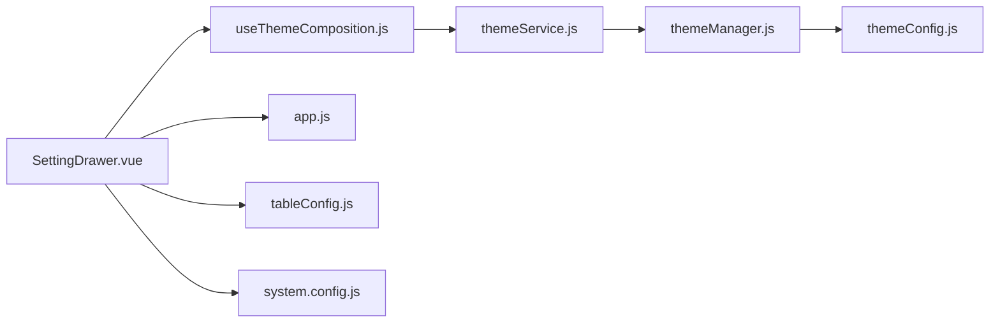

# 设置抽屉

<cite>
**本文引用的文件**
- [SettingDrawer.vue](file://bear-jia-vue3/src/components/layout/SettingDrawer.vue)
- [useThemeComposition.js](file://bear-jia-vue3/src/utils/theme/composables/useThemeComposition.js)
- [themeService.js](file://bear-jia-vue3/src/utils/theme/themeService.js)
- [themeManager.js](file://bear-jia-vue3/src/utils/theme/themeManager.js)
- [themeConfig.js](file://bear-jia-vue3/src/utils/theme/themeConfig.js)
- [app.js](file://bear-jia-vue3/src/stores/app.js)
- [tableConfig.js](file://bear-jia-vue3/src/stores/tableConfig.js)
- [system.config.js](file://bear-jia-vue3/src/config/system.config.js)
</cite>

## 目录
1. [简介](#简介)
2. [项目结构](#项目结构)
3. [核心组件](#核心组件)
4. [架构总览](#架构总览)
5. [详细组件分析](#详细组件分析)
6. [依赖关系分析](#依赖关系分析)
7. [性能考量](#性能考量)
8. [故障排查指南](#故障排查指南)
9. [结论](#结论)
10. [附录](#附录)

## 简介
本文件面向前端开发者与产品运营人员，系统化说明 SettingDrawer 组件的全方位布局与系统配置能力。该组件以抽屉形式提供主题模式与主题色切换、导航模式（侧边/顶部/混合/分栏/抽屉）、布局设置（内容宽度、固定Header/侧边栏等）、系统配置（标题、版权、版本等）以及表格样式设置，并通过 useThemeComposition 组合式函数实现主题与颜色的动态切换。同时，组件提供“保存/重置所有配置”、“导出/导入配置文件”的完整流程，并通过 props 接收 settings，使用 watch 监听其变化，再通过 $emit 将更新后的设置回传给父组件。文档还给出配置持久化（localStorage）与状态管理（Pinia store）集成的最佳实践建议。

## 项目结构
SettingDrawer 位于布局组件目录下，配合主题服务、主题管理器、主题配置、Pinia store 与系统配置共同工作，形成“视图层配置 -> 主题服务 -> 状态持久化”的闭环。

图表来源
- [SettingDrawer.vue](file://bear-jia-vue3/src/components/layout/SettingDrawer.vue#L370-L820)
- [useThemeComposition.js](file://bear-jia-vue3/src/utils/theme/composables/useThemeComposition.js#L1-L165)
- [themeService.js](file://bear-jia-vue3/src/utils/theme/themeService.js#L1-L120)
- [themeManager.js](file://bear-jia-vue3/src/utils/theme/themeManager.js#L1-L120)
- [themeConfig.js](file://bear-jia-vue3/src/utils/theme/themeConfig.js#L1-L120)
- [app.js](file://bear-jia-vue3/src/stores/app.js#L1-L120)
- [tableConfig.js](file://bear-jia-vue3/src/stores/tableConfig.js#L1-L120)
- [system.config.js](file://bear-jia-vue3/src/config/system.config.js#L1-L80)

章节来源
- [SettingDrawer.vue](file://bear-jia-vue3/src/components/layout/SettingDrawer.vue#L370-L820)
- [app.js](file://bear-jia-vue3/src/stores/app.js#L1-L120)
- [tableConfig.js](file://bear-jia-vue3/src/stores/tableConfig.js#L1-L120)
- [system.config.js](file://bear-jia-vue3/src/config/system.config.js#L1-L80)

## 核心组件
SettingDrawer 是一个基于抽屉的配置面板，提供以下能力：
- 主题模式与主题色切换：通过 useThemeComposition 与 themeService 实现主题模式与颜色的即时切换与持久化。
- 导航模式切换：支持 side/top/mix/column/drawer 五种导航模式，切换时自动处理固定侧边栏逻辑。
- 布局设置：内容宽度、固定Header、固定侧边栏、隐藏Footer、多页签模式等。
- 系统配置：系统标题、版权、版本等，写入 Pinia appStore 并持久化到 localStorage。
- 表格样式设置：表格尺寸、边框、固定表头、允许调整列宽、分页大小、显示总数/分页选择器/快速跳转、斑马条纹、显示表头等；支持保存/重置表格配置。
- 配置管理：保存所有配置、导出配置文件、导入配置文件、重置所有配置（含主题、布局、系统、表格）。

章节来源
- [SettingDrawer.vue](file://bear-jia-vue3/src/components/layout/SettingDrawer.vue#L1-L360)
- [SettingDrawer.vue](file://bear-jia-vue3/src/components/layout/SettingDrawer.vue#L360-L760)
- [SettingDrawer.vue](file://bear-jia-vue3/src/components/layout/SettingDrawer.vue#L760-L999)

## 架构总览
SettingDrawer 采用“视图层 + 主题服务 + 状态管理 + 持久化”的分层架构：
- 视图层：SettingDrawer.vue 负责渲染配置项、绑定双向数据、触发动作。
- 主题层：useThemeComposition 提供主题模式/颜色/色弱等组合式API；themeService 负责主题应用、事件广播、持久化；themeManager 管理主题状态与CSS变量。
- 状态层：Pinia store（app.js、tableConfig.js）负责全局状态与表格配置的集中管理。
- 持久化层：localStorage 用于布局/系统/表格配置的跨会话保留。

图表来源
- [SettingDrawer.vue](file://bear-jia-vue3/src/components/layout/SettingDrawer.vue#L520-L620)
- [useThemeComposition.js](file://bear-jia-vue3/src/utils/theme/composables/useThemeComposition.js#L56-L110)
- [themeService.js](file://bear-jia-vue3/src/utils/theme/themeService.js#L188-L243)
- [themeManager.js](file://bear-jia-vue3/src/utils/theme/themeManager.js#L103-L142)
- [app.js](file://bear-jia-vue3/src/stores/app.js#L66-L118)
- [tableConfig.js](file://bear-jia-vue3/src/stores/tableConfig.js#L33-L105)

## 详细组件分析

### 主题与颜色动态切换（useThemeComposition）
- 组合式函数提供主题模式、主题色、色弱模式、预设颜色列表、当前主题信息等响应式状态与方法。
- 通过 themeService 统一设置主题模式与颜色，内部持久化到 localStorage，并触发主题事件。
- 组件在 mounted 时订阅主题事件，实时更新本地状态，确保 UI 与主题状态一致。

图表来源
- [useThemeComposition.js](file://bear-jia-vue3/src/utils/theme/composables/useThemeComposition.js#L1-L165)
- [themeService.js](file://bear-jia-vue3/src/utils/theme/themeService.js#L188-L243)
- [themeManager.js](file://bear-jia-vue3/src/utils/theme/themeManager.js#L186-L212)

章节来源
- [useThemeComposition.js](file://bear-jia-vue3/src/utils/theme/composables/useThemeComposition.js#L1-L165)
- [themeService.js](file://bear-jia-vue3/src/utils/theme/themeService.js#L188-L243)
- [themeManager.js](file://bear-jia-vue3/src/utils/theme/themeManager.js#L186-L212)

### 导航模式与布局设置
- 导航模式切换：支持 side/top/mix/column/drawer，切换时根据模式自动处理固定侧边栏。
- 布局设置：内容宽度（Fluid/Fixed，部分模式禁用）、固定Header、固定侧边栏、隐藏Footer、多页签模式。
- 通过 handleSettingChange 将本地设置回传给父组件，父组件可据此更新全局布局。

图表来源
- [SettingDrawer.vue](file://bear-jia-vue3/src/components/layout/SettingDrawer.vue#L554-L586)
- [SettingDrawer.vue](file://bear-jia-vue3/src/components/layout/SettingDrawer.vue#L588-L596)

章节来源
- [SettingDrawer.vue](file://bear-jia-vue3/src/components/layout/SettingDrawer.vue#L554-L586)
- [SettingDrawer.vue](file://bear-jia-vue3/src/components/layout/SettingDrawer.vue#L588-L596)

### 系统配置与表格样式设置
- 系统配置：标题、版权、版本等，写入 appStore 并持久化到 localStorage，同时更新 document.title。
- 表格样式：表格尺寸、边框、固定表头、允许调整列宽、分页大小、显示总数/分页选择器/快速跳转、斑马条纹、显示表头等。
- 表格配置支持保存/重置：保存时同步到 localStorage 与 tableConfigStore；重置时恢复默认值并同步。

图表来源
- [SettingDrawer.vue](file://bear-jia-vue3/src/components/layout/SettingDrawer.vue#L403-L426)
- [SettingDrawer.vue](file://bear-jia-vue3/src/components/layout/SettingDrawer.vue#L674-L687)
- [SettingDrawer.vue](file://bear-jia-vue3/src/components/layout/SettingDrawer.vue#L610-L626)
- [SettingDrawer.vue](file://bear-jia-vue3/src/components/layout/SettingDrawer.vue#L629-L672)
- [app.js](file://bear-jia-vue3/src/stores/app.js#L90-L118)
- [tableConfig.js](file://bear-jia-vue3/src/stores/tableConfig.js#L108-L124)

章节来源
- [SettingDrawer.vue](file://bear-jia-vue3/src/components/layout/SettingDrawer.vue#L403-L426)
- [SettingDrawer.vue](file://bear-jia-vue3/src/components/layout/SettingDrawer.vue#L610-L672)
- [app.js](file://bear-jia-vue3/src/stores/app.js#L90-L118)
- [tableConfig.js](file://bear-jia-vue3/src/stores/tableConfig.js#L108-L124)

### 配置管理（保存/重置/导出/导入）
- 保存所有配置：向父组件回传 settings，更新系统配置与表格配置，并提示成功。
- 导出配置：优先调用 appStore.exportSettings；若不存在，则手动拼装 layoutSettings/systemConfig/tableConfig 并下载 JSON。
- 导入配置：读取 JSON 文件，弹窗确认后分别更新布局、系统与表格配置。
- 重置所有配置：重置主题（使用主题服务），重置布局设置（appStore.resetSettings），重置系统配置与表格配置。

图表来源
- [SettingDrawer.vue](file://bear-jia-vue3/src/components/layout/SettingDrawer.vue#L689-L741)
- [SettingDrawer.vue](file://bear-jia-vue3/src/components/layout/SettingDrawer.vue#L743-L783)
- [SettingDrawer.vue](file://bear-jia-vue3/src/components/layout/SettingDrawer.vue#L785-L817)
- [app.js](file://bear-jia-vue3/src/stores/app.js#L152-L178)
- [tableConfig.js](file://bear-jia-vue3/src/stores/tableConfig.js#L72-L105)

章节来源
- [SettingDrawer.vue](file://bear-jia-vue3/src/components/layout/SettingDrawer.vue#L689-L741)
- [SettingDrawer.vue](file://bear-jia-vue3/src/components/layout/SettingDrawer.vue#L743-L783)
- [SettingDrawer.vue](file://bear-jia-vue3/src/components/layout/SettingDrawer.vue#L785-L817)
- [app.js](file://bear-jia-vue3/src/stores/app.js#L152-L178)
- [tableConfig.js](file://bear-jia-vue3/src/stores/tableConfig.js#L72-L105)

### Props、Watch 与 $emit 的交互
- props 接收 visible 与 settings，组件内部维护 localSettings 作为本地副本。
- watch(props.settings) 将外部设置变化同步到本地，保证抽屉与父组件状态一致。
- 通过 emit('update:visible', false) 关闭抽屉；通过 emit('update:settings', {...}) 将本地设置回传父组件。

图表来源
- [SettingDrawer.vue](file://bear-jia-vue3/src/components/layout/SettingDrawer.vue#L475-L490)
- [SettingDrawer.vue](file://bear-jia-vue3/src/components/layout/SettingDrawer.vue#L507-L511)
- [SettingDrawer.vue](file://bear-jia-vue3/src/components/layout/SettingDrawer.vue#L588-L596)

章节来源
- [SettingDrawer.vue](file://bear-jia-vue3/src/components/layout/SettingDrawer.vue#L475-L490)
- [SettingDrawer.vue](file://bear-jia-vue3/src/components/layout/SettingDrawer.vue#L507-L511)
- [SettingDrawer.vue](file://bear-jia-vue3/src/components/layout/SettingDrawer.vue#L588-L596)

## 依赖关系分析
- SettingDrawer 依赖 useThemeComposition 与 themeService 实现主题切换；依赖 appStore 与 tableConfigStore 管理全局与表格配置；依赖 system.config.js 提供系统默认信息。
- themeService 依赖 themeManager 与 themeConfig；themeManager 依赖 themeConfig 的常量与 CSS 变量映射。
- appStore 与 tableConfigStore 依赖 localStorage 进行持久化。

图表来源
- [SettingDrawer.vue](file://bear-jia-vue3/src/components/layout/SettingDrawer.vue#L370-L420)
- [useThemeComposition.js](file://bear-jia-vue3/src/utils/theme/composables/useThemeComposition.js#L1-L165)
- [themeService.js](file://bear-jia-vue3/src/utils/theme/themeService.js#L1-L120)
- [themeManager.js](file://bear-jia-vue3/src/utils/theme/themeManager.js#L1-L120)
- [themeConfig.js](file://bear-jia-vue3/src/utils/theme/themeConfig.js#L1-L120)
- [app.js](file://bear-jia-vue3/src/stores/app.js#L1-L120)
- [tableConfig.js](file://bear-jia-vue3/src/stores/tableConfig.js#L1-L120)
- [system.config.js](file://bear-jia-vue3/src/config/system.config.js#L1-L80)

章节来源
- [SettingDrawer.vue](file://bear-jia-vue3/src/components/layout/SettingDrawer.vue#L370-L420)
- [app.js](file://bear-jia-vue3/src/stores/app.js#L1-L120)
- [tableConfig.js](file://bear-jia-vue3/src/stores/tableConfig.js#L1-L120)
- [system.config.js](file://bear-jia-vue3/src/config/system.config.js#L1-L80)

## 性能考量
- 主题切换与配置更新均通过组合式函数与服务层进行，避免在组件内直接操作 DOM，降低复杂度。
- 表格配置使用 Pinia store 与 localStorage 双通道同步，减少不必要的渲染与 IO。
- 导入导出采用 Blob 与 URL.createObjectURL，避免大体积字符串在内存中反复复制。
- 建议：对频繁变更的配置（如表格分页）使用节流/防抖策略，减少多次写入 localStorage 的开销。

## 故障排查指南
- 主题切换失败：检查 themeService.setThemeMode 与 themeManager.setThemeMode 的调用链，确认 localStorage 写入与事件触发是否正常。
- 配置保存失败：确认 appStore.updateSettings 与 tableConfigStore.updateConfig 是否被正确调用，检查 localStorage 权限与容量。
- 导入配置报错：确认 JSON 格式是否合法，导入前先弹窗确认，避免误操作覆盖。
- 重置配置无效：检查 appStore.resetSettings 是否调用了 themeService.resetTheme，确保主题恢复默认。

章节来源
- [SettingDrawer.vue](file://bear-jia-vue3/src/components/layout/SettingDrawer.vue#L519-L552)
- [SettingDrawer.vue](file://bear-jia-vue3/src/components/layout/SettingDrawer.vue#L689-L741)
- [SettingDrawer.vue](file://bear-jia-vue3/src/components/layout/SettingDrawer.vue#L743-L783)
- [SettingDrawer.vue](file://bear-jia-vue3/src/components/layout/SettingDrawer.vue#L785-L817)
- [app.js](file://bear-jia-vue3/src/stores/app.js#L120-L178)
- [tableConfig.js](file://bear-jia-vue3/src/stores/tableConfig.js#L72-L124)

## 结论
SettingDrawer 通过清晰的分层设计与完善的主题/状态/持久化机制，提供了全面而易用的布局与系统配置能力。结合 useThemeComposition 与 themeService，实现了主题模式与颜色的动态切换；通过 Pinia store 与 localStorage，保障了配置的跨会话一致性与可恢复性。建议在实际项目中遵循本文最佳实践，进一步优化性能与用户体验。

## 附录
- 最佳实践建议
  - 主题切换：使用 useThemeComposition 的 setThemeMode/setPrimaryColor，避免直接操作 DOM 或 CSS 变量。
  - 配置持久化：统一通过 themeService 与 appStore/tableConfigStore 的持久化方法，避免分散写入。
  - 导入导出：始终弹窗确认，导入前备份当前配置，导出时包含时间戳与版本信息。
  - 表格配置：将分页与表格样式解耦，独立更新，避免一次性大量写入。
  - 错误处理：对 localStorage 异常、JSON 解析异常、网络请求异常进行统一捕获与提示。