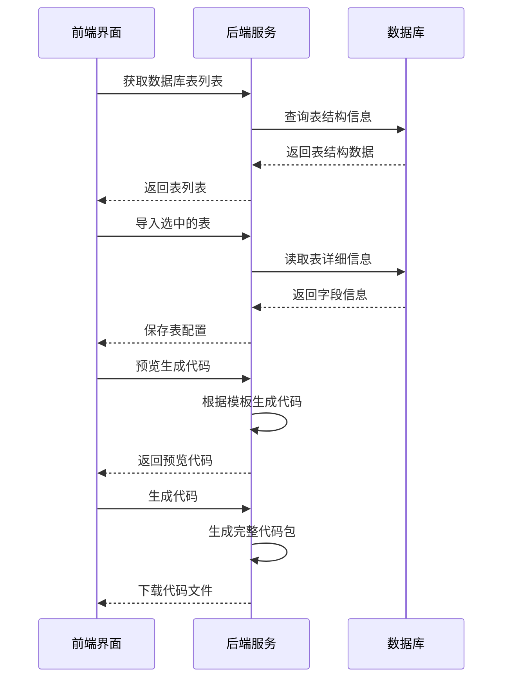
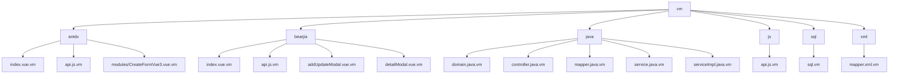
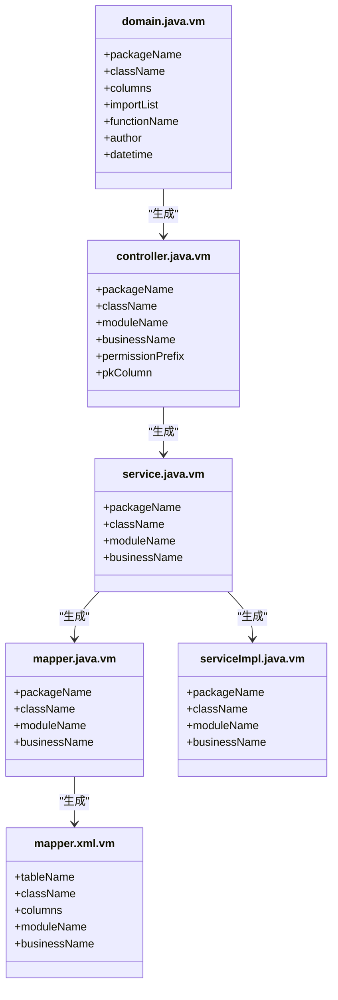
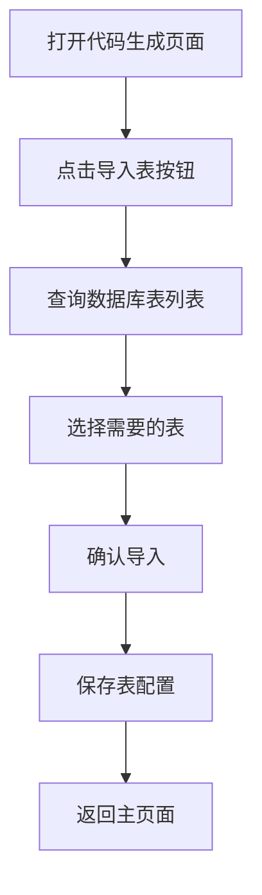
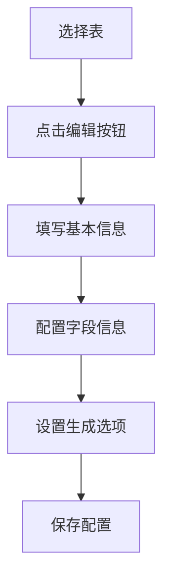
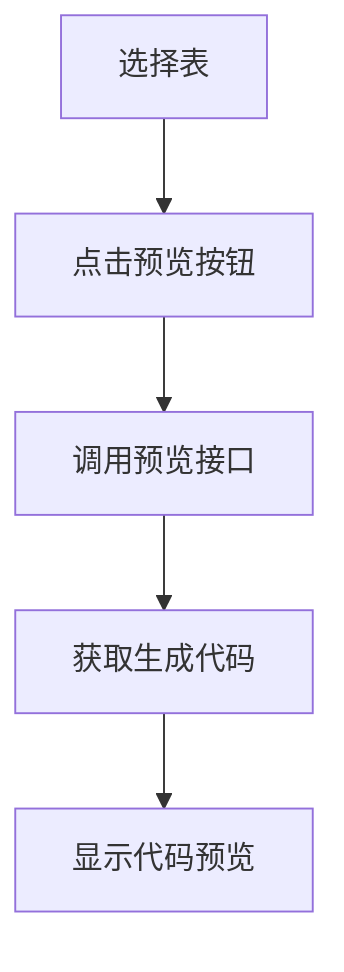
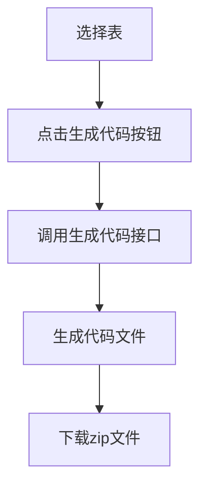
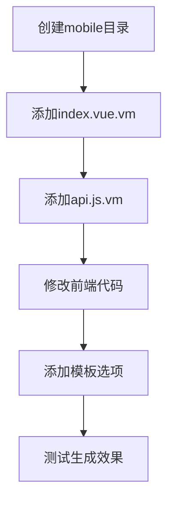
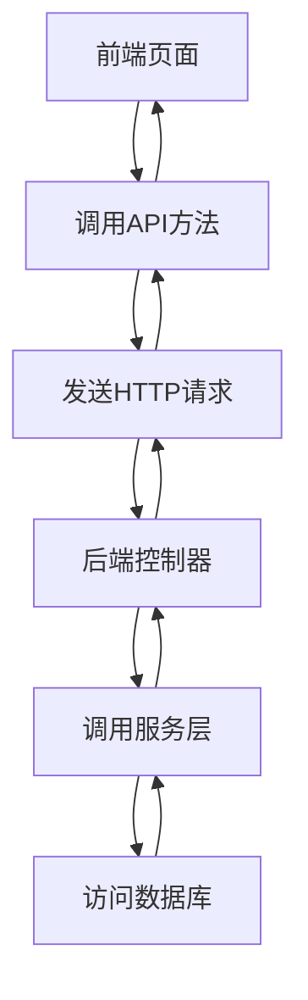
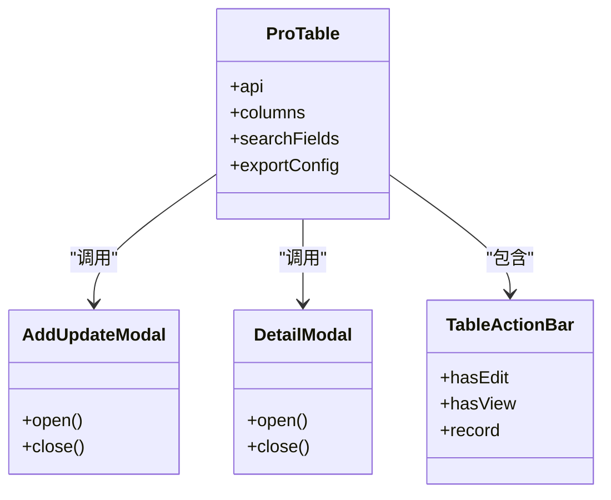

# 代码生成

<cite>
**本文档引用文件**  
- [index.vue](file://bear-jia-vue3\src\views\tool\gen\index.vue)
- [importTables.vue](file://bear-jia-vue3\src\views\tool\gen\importTables.vue)
- [genCodeConfigUpdate.vue](file://bear-jia-vue3\src\views\tool\gen\genCodeConfigUpdate.vue)
- [genCodePreview.vue](file://bear-jia-vue3\src\views\tool\gen\genCodePreview.vue)
- [gen.js](file://bear-jia-vue3\src\api\tool\gen.js)
- [GenController.java](file://bearjia-admin-backend\src\main\java\com\javaxiaobear\module\tool\gen\controller\GenController.java)
- [api.js.vm](file://bearjia-admin-backend\src\main\resources\vm\bearjia\api.js.vm)
- [index.vue.vm](file://bearjia-admin-backend\src\main\resources\vm\bearjia\index.vue.vm)
- [domain.java.vm](file://bearjia-admin-backend\src\main\resources\vm\java\domain.java.vm)
- [controller.java.vm](file://bearjia-admin-backend\src\main\resources\vm\java\controller.java.vm)
- [README.md](file://bearjia-admin-backend\src\main\resources\vm\README.md)
</cite>

## 目录
1. [简介](#简介)
2. [代码生成器工作原理](#代码生成器工作原理)
3. [模板系统](#模板系统)
4. [模板变量与语法](#模板变量与语法)
5. [代码生成配置](#代码生成配置)
6. [使用步骤](#使用步骤)
7. [生成代码示例](#生成代码示例)
8. [扩展机制](#扩展机制)
9. [前后端代码集成](#前后端代码集成)
10. [总结](#总结)

## 简介

本系统提供了一套完整的代码自动生成功能，基于数据库表结构自动生成前后端代码。系统通过分析数据库表的元数据信息，结合预定义的模板文件，能够快速生成符合项目规范的Java后端代码和Vue3前端代码。代码生成器支持多种模板类型，包括标准Ant Design Vue模板和BearJia定制模板，满足不同项目架构的需求。

**Section sources**
- [index.vue](file://bear-jia-vue3\src\views\tool\gen\index.vue#L1-L348)

## 代码生成器工作原理

代码生成器的工作流程基于前后端分离架构，通过REST API接口实现数据交互。前端界面提供数据库表选择、配置设置和代码生成操作，后端服务根据配置信息和模板文件生成相应的代码。



**Diagram sources**
- [GenController.java](file://bearjia-admin-backend\src\main\java\com\javaxiaobear\module\tool\gen\controller\GenController.java#L53-L258)
- [gen.js](file://bear-jia-vue3\src\api\tool\gen.js#L1-L94)

**Section sources**
- [GenController.java](file://bearjia-admin-backend\src\main\java\com\javaxiaobear\module\tool\gen\controller\GenController.java#L53-L258)
- [gen.js](file://bear-jia-vue3\src\api\tool\gen.js#L1-L94)

## 模板系统

代码生成器采用Velocity模板引擎（.vm文件）作为模板系统，支持前后端代码的生成。模板文件按照功能和架构进行组织，位于后端项目的`src/main/resources/vm`目录下。

### 模板组织结构



**Diagram sources**
- [README.md](file://bearjia-admin-backend\src\main\resources\vm\README.md#L1-L225)

### 前端模板

前端模板分为两套体系：antdv模板和bearjia模板，分别适用于不同的前端架构。

- **antdv模板**：适用于标准Ant Design Vue项目，使用原生组件构建
- **bearjia模板**：适用于BearJia Vue3管理系统，基于封装的ProTable组件

**Section sources**
- [README.md](file://bearjia-admin-backend\src\main\resources\vm\README.md#L1-L225)

### 后端模板

后端模板包含完整的Java代码生成文件，覆盖领域模型、控制器、服务层和数据访问层。



**Diagram sources**
- [domain.java.vm](file://bearjia-admin-backend\src\main\resources\vm\java\domain.java.vm#L1-L104)
- [controller.java.vm](file://bearjia-admin-backend\src\main\resources\vm\java\controller.java.vm#L1-L116)

**Section sources**
- [domain.java.vm](file://bearjia-admin-backend\src\main\resources\vm\java\domain.java.vm#L1-L104)
- [controller.java.vm](file://bearjia-admin-backend\src\main\resources\vm\java\controller.java.vm#L1-L116)

## 模板变量与语法

模板系统使用Velocity模板引擎，支持变量替换、条件判断和循环等语法特性。

### 模板变量

模板中使用的变量主要来源于数据库表结构和用户配置，分为以下几类：

| 变量名 | 说明 | 示例值 |
|--------|------|--------|
| ${packageName} | Java包路径 | com.javaxiaobear.system |
| ${className} | 实体类名 | SysUser |
| ${BusinessName} | 业务名称 | user |
| ${moduleName} | 模块名称 | system |
| ${functionName} | 功能名称 | 用户管理 |
| ${author} | 作者 | javaxiaobear |
| ${datetime} | 生成时间 | 2023-08-20 |
| ${tableName} | 数据库表名 | sys_user |
| ${pkColumn.javaField} | 主键字段名 | userId |
| ${columns} | 字段列表 | List<GenTableColumn> |

**Section sources**
- [domain.java.vm](file://bearjia-admin-backend\src\main\resources\vm\java\domain.java.vm#L1-L104)
- [controller.java.vm](file://bearjia-admin-backend\src\main\resources\vm\java\controller.java.vm#L1-L116)
- [api.js.vm](file://bearjia-admin-backend\src\main\resources\vm\bearjia\api.js.vm#L1-L45)

### 模板语法

模板支持Velocity引擎的完整语法特性，包括变量替换、条件判断和循环。

#### 变量替换

使用`${variable}`语法进行变量替换，这是最基本的模板功能。

```vm
// Java包声明
package ${packageName}.domain;

// 类名
public class ${ClassName} extends BaseEntity
```

#### 条件判断

使用`#if`、`#elseif`、`#else`和`#end`进行条件判断。

```vm
#if($tplCategory == 'tree')
  :isTreeTable="true"
#end

#if($isInsert == 1)
  <a-button type="primary" @click="handleAdd">新增</a-button>
#end
```

#### 循环遍历

使用`#foreach`和`#end`对集合进行遍历。

```vm
#foreach($column in $columns)
  {
    title: '${column.columnComment}',
    dataIndex: '${column.javaField}',
    key: '${column.javaField}'
  },
#end
```

#### 变量赋值

使用`#set`语法进行变量赋值。

```vm
#set($isInsert=0)
#set($isEdit=0)
#foreach($column in $columns)
  #if($column.insert)
    #set($isInsert=1)
  #end
  #if($column.edit)
    #set($isEdit=1)
  #end
#end
```

**Section sources**
- [index.vue.vm](file://bearjia-admin-backend\src\main\resources\vm\bearjia\index.vue.vm#L1-L294)
- [domain.java.vm](file://bearjia-admin-backend\src\main\resources\vm\java\domain.java.vm#L1-L104)

## 代码生成配置

代码生成器提供丰富的配置选项，允许用户自定义生成的代码。

### 基本配置

在生成代码前，需要配置以下基本信息：

| 配置项 | 说明 | 必填 |
|--------|------|------|
| 表名 | 数据库表名 | 是 |
| 表描述 | 表的中文描述 | 是 |
| 实体类名 | Java实体类名 | 是 |
| 作者 | 开发者姓名 | 否 |
| 备注 | 附加说明 | 否 |
| 生成模板 | 选择模板类型 | 是 |
| 生成前端模板 | 选择前端模板 | 是 |
| 生成包路径 | Java包路径 | 是 |
| 生成模块名 | 模块名称 | 是 |
| 生成业务名 | 业务名称 | 是 |
| 生成功能名 | 功能中文名 | 是 |
| 上级菜单 | 菜单归属 | 否 |
| 生成代码方式 | zip压缩包或自定义路径 | 是 |
| 自定义路径 | 代码生成路径 | 否（当选择自定义路径时） |

**Section sources**
- [genCodeConfigUpdate.vue](file://bear-jia-vue3\src\views\tool\gen\genCodeConfigUpdate.vue#L1-L516)

### 字段配置

对表的每个字段进行详细配置，控制其在代码中的行为。

| 配置项 | 说明 |
|--------|------|
| 字段列名 | 数据库字段名 |
| 字段描述 | 字段中文描述 |
| 物理类型 | 数据库字段类型 |
| Java类型 | 对应的Java类型 |
| java属性 | Java属性名 |
| 插入 | 是否作为插入字段 |
| 编辑 | 是否作为编辑字段 |
| 列表 | 是否在列表中显示 |
| 查询 | 是否作为查询条件 |
| 查询方式 | 查询操作符（=、!=、>、>=、<、<=、LIKE、BETWEEN） |
| 必填 | 是否必填字段 |
| 显示类型 | 前端控件类型（文本框、数字框、文本域、下拉框、树形下拉框、树形控件、单选框、复选框、日期控件、图片上传、文件上传、富文本控件） |
| 字典类型 | 关联的数据字典 |

**Section sources**
- [genCodeConfigUpdate.vue](file://bear-jia-vue3\src\views\tool\gen\genCodeConfigUpdate.vue#L1-L516)

## 使用步骤

代码生成的完整流程包括以下几个步骤：

### 1. 进入代码生成页面

在系统菜单中导航到【系统工具】->【代码生成】，进入代码生成管理页面。

### 2. 导入数据库表

点击【导入表】按钮，选择需要生成代码的数据库表。



**Diagram sources**
- [index.vue](file://bear-jia-vue3\src\views\tool\gen\index.vue#L1-L348)
- [importTables.vue](file://bear-jia-vue3\src\views\tool\gen\importTables.vue#L1-L203)

### 3. 配置生成信息

选择导入的表，点击【编辑】按钮，配置代码生成的各项参数。



**Diagram sources**
- [genCodeConfigUpdate.vue](file://bear-jia-vue3\src\views\tool\gen\genCodeConfigUpdate.vue#L1-L516)

### 4. 预览生成代码

在表操作中点击【预览】按钮，查看即将生成的代码内容。



**Diagram sources**
- [genCodePreview.vue](file://bear-jia-vue3\src\views\tool\gen\genCodePreview.vue#L1-L300)

### 5. 生成代码

点击【生成代码】按钮，下载生成的代码文件。



**Diagram sources**
- [index.vue](file://bear-jia-vue3\src\views\tool\gen\index.vue#L1-L348)
- [GenController.java](file://bearjia-admin-backend\src\main\java\com\javaxiaobear\module\tool\gen\controller\GenController.java#L198-L207)

**Section sources**
- [index.vue](file://bear-jia-vue3\src\views\tool\gen\index.vue#L1-L348)
- [GenController.java](file://bearjia-admin-backend\src\main\java\com\javaxiaobear\module\tool\gen\controller\GenController.java#L198-L207)

## 生成代码示例

### API接口模板与生成结果

**模板文件**: api.js.vm

```vm
import request from '@/utils/request'

// 查询${functionName}列表
export function list${BusinessName}(query) {
  return request({
    url: '/${moduleName}/${businessName}/list',
    method: 'get',
    params: query
  })
}

// 查询${functionName}详细
export function get${BusinessName}(${pkColumn.javaField}) {
  return request({
    url: '/${moduleName}/${businessName}/' + ${pkColumn.javaField},
    method: 'get'
  })
}

// 新增${functionName}
export function add${BusinessName}(data) {
  return request({
    url: '/${moduleName}/${businessName}',
    method: 'post',
    data: data
  })
}

// 修改${functionName}
export function update${BusinessName}(data) {
  return request({
    url: '/${moduleName}/${businessName}',
    method: 'put',
    data: data
  })
}

// 删除${functionName}
export function del${BusinessName}(${pkColumn.javaField}) {
  return request({
    url: '/${moduleName}/${businessName}/' + ${pkColumn.javaField},
    method: 'delete'
  })
}
```

**生成结果**: user.js

```javascript
import request from '@/utils/request'

// 查询用户管理列表
export function listUser(query) {
  return request({
    url: '/system/user/list',
    method: 'get',
    params: query
  })
}

// 查询用户管理详细
export function getUser(userId) {
  return request({
    url: '/system/user/' + userId,
    method: 'get'
  })
}

// 新增用户管理
export function addUser(data) {
  return request({
    url: '/system/user',
    method: 'post',
    data: data
  })
}

// 修改用户管理
export function updateUser(data) {
  return request({
    url: '/system/user',
    method: 'put',
    data: data
  })
}

// 删除用户管理
export function delUser(userId) {
  return request({
    url: '/system/user/' + userId,
    method: 'delete'
  })
}
```

**Section sources**
- [api.js.vm](file://bearjia-admin-backend\src\main\resources\vm\bearjia\api.js.vm#L1-L45)

### 主页面模板与生成结果

**模板文件**: index.vue.vm

```vm
<template>
  <div class="app-container">
    <ProTable
      ref="proTableRef"
      :api="tableApi"
      :columns="columns"
      :searchFields="searchFields"
      :initialSearchParams="initialSearchParams"
      :exportConfig="exportConfig"
#if($tplCategory == 'tree')
      :isTreeTable="true"
#end
      rowKey="${pkColumn.javaField}"
    >
      <!-- 自定义操作按钮 -->
      <template #actions="{ selectedRowKeys, selectedRows }">
#set($isInsert=0)
#set($isEdit=0)
#foreach($column in $columns)
#if($column.insert)
#set($isInsert=1)
#end
#if($column.edit)
#set($isEdit=1)
#end
#end
#if($isInsert == 1)
        <a-button type="primary" @click="handleAdd" v-hasPermi="['${moduleName}:${businessName}:add']">
          <BearJiaIcon icon="plus-outlined" />
          新增
        </a-button>
#end
#if($isEdit == 1)
        <a-button 
          type="primary" 
          :disabled="selectedRowKeys.length !== 1" 
          @click="handleEdit(selectedRows[0])" 
          v-hasPermi="['${moduleName}:${businessName}:edit']"
        >
          <BearJiaIcon icon="edit-outlined" />
          修改
        </a-button>
#end
        <a-button 
          type="primary" 
          danger 
          :disabled="selectedRowKeys.length === 0" 
          @click="handleDelete(selectedRowKeys)" 
          v-hasPermi="['${moduleName}:${businessName}:remove']"
        >
          <BearJiaIcon icon="delete-outlined" />
          删除
        </a-button>
      </template>
    </ProTable>
  </div>
</template>
```

**生成结果**: index.vue

```vue
<template>
  <div class="app-container">
    <ProTable
      ref="proTableRef"
      :api="tableApi"
      :columns="columns"
      :searchFields="searchFields"
      :initialSearchParams="initialSearchParams"
      :exportConfig="exportConfig"
      rowKey="userId"
    >
      <!-- 自定义操作按钮 -->
      <template #actions="{ selectedRowKeys, selectedRows }">
        <a-button type="primary" @click="handleAdd" v-hasPermi="['system:user:add']">
          <BearJiaIcon icon="plus-outlined" />
          新增
        </a-button>
        <a-button 
          type="primary" 
          :disabled="selectedRowKeys.length !== 1" 
          @click="handleEdit(selectedRows[0])" 
          v-hasPermi="['system:user:edit']"
        >
          <BearJiaIcon icon="edit-outlined" />
          修改
        </a-button>
        <a-button 
          type="primary" 
          danger 
          :disabled="selectedRowKeys.length === 0" 
          @click="handleDelete(selectedRowKeys)" 
          v-hasPermi="['system:user:remove']"
        >
          <BearJiaIcon icon="delete-outlined" />
          删除
        </a-button>
      </template>
    </ProTable>
  </div>
</template>
```

**Section sources**
- [index.vue.vm](file://bearjia-admin-backend\src\main\resources\vm\bearjia\index.vue.vm#L1-L294)

## 扩展机制

代码生成器提供了灵活的扩展机制，允许开发者自定义新的模板。

### 自定义模板步骤

1. **创建模板目录**：在`vm`目录下创建新的模板文件夹
2. **编写模板文件**：使用Velocity语法编写模板文件
3. **配置模板选项**：在前端代码中添加新的模板选项
4. **测试模板**：使用实际数据表测试模板生成效果

### 模板扩展示例

假设需要创建一个移动端模板，可以按照以下步骤：



**Section sources**
- [README.md](file://bearjia-admin-backend\src\main\resources\vm\README.md#L1-L225)

## 前后端代码集成

生成的前后端代码通过REST API接口进行集成，形成完整的业务功能。

### API接口集成

前端通过生成的API文件调用后端接口，实现数据交互。



**Diagram sources**
- [api.js.vm](file://bearjia-admin-backend\src\main\resources\vm\bearjia\api.js.vm#L1-L45)
- [controller.java.vm](file://bearjia-admin-backend\src\main\resources\vm\java\controller.java.vm#L1-L116)

### 组件集成

前端组件通过ProTable等封装组件实现功能集成。



**Diagram sources**
- [index.vue.vm](file://bearjia-admin-backend\src\main\resources\vm\bearjia\index.vue.vm#L1-L294)

**Section sources**
- [index.vue.vm](file://bearjia-admin-backend\src\main\resources\vm\bearjia\index.vue.vm#L1-L294)

## 总结

本代码生成系统通过模板化的方式，实现了从数据库表结构到前后端代码的自动化生成。系统具有以下特点：

- **高效性**：基于模板快速生成代码，提高开发效率
- **灵活性**：支持多种模板类型，适应不同项目需求
- **可扩展性**：提供模板扩展机制，支持自定义模板
- **一致性**：生成的代码符合项目规范，保证代码风格统一
- **集成性**：前后端代码无缝集成，形成完整业务功能

通过合理使用代码生成器，可以显著减少重复性编码工作，让开发者专注于业务逻辑的实现。

[无来源，此部分为总结性内容]