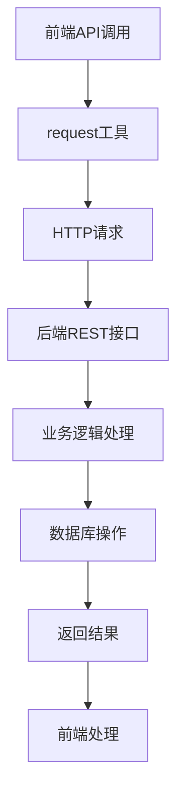
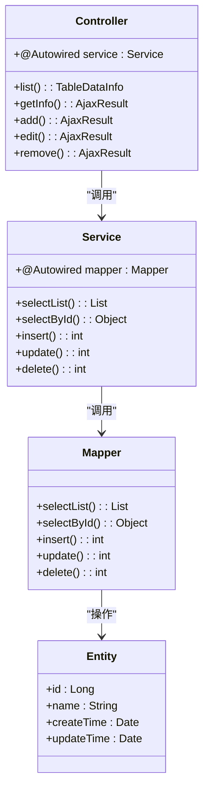
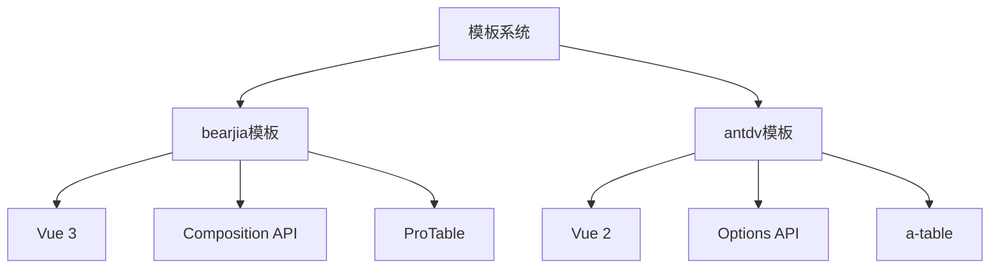

# 模板系统

<cite>
**本文档引用的文件**  
- [index.vue.vm](file://bear-jia-vue3\docs\bearjia\index.vue.vm)
- [api.js.vm](file://bear-jia-vue3\docs\bearjia\api.js.vm)
- [addUpdateModal.vue.vm](file://bear-jia-vue3\docs\bearjia\addUpdateModal.vue.vm)
- [detailModal.vue.vm](file://bear-jia-vue3\docs\bearjia\detailModal.vue.vm)
- [index.vue.vm](file://bearjia-admin-backend\src\main\resources\vm\bearjia\index.vue.vm)
- [api.js.vm](file://bearjia-admin-backend\src\main\resources\vm\bearjia\api.js.vm)
- [controller.java.vm](file://bearjia-admin-backend\src\main\resources\vm\java\controller.java.vm)
- [service.java.vm](file://bearjia-admin-backend\src\main\resources\vm\java\service.java.vm)
- [mapper.java.vm](file://bearjia-admin-backend\src\main\resources\vm\java\mapper.java.vm)
- [serviceImpl.java.vm](file://bearjia-admin-backend\src\main\resources\vm\java\serviceImpl.java.vm)
- [index.vue.vm](file://bearjia-admin-backend\src\main\resources\vm\antdv\index.vue.vm)
- [api.js.vm](file://bearjia-admin-backend\src\main\resources\vm\antdv\api.js.vm)
- [application.yml](file://bearjia-admin-backend\src\main\resources\application.yml)
- [BaseController.java](file://bearjia-admin-backend\src\main\java\com\javaxiaobear\base\framework\web\controller\BaseController.java)
</cite>

## 目录
1. [简介](#简介)
2. [模板引擎机制](#模板引擎机制)
3. [前端模板结构](#前端模板结构)
4. [后端模板结构](#后端模板结构)
5. [模板分类](#模板分类)
6. [模板编写规范](#模板编写规范)
7. [UI框架模板差异分析](#ui框架模板差异分析)
8. [模板继承与复用机制](#模板继承与复用机制)
9. [模板变量与元数据引用](#模板变量与元数据引用)
10. [实际模板示例与生成结果对照](#实际模板示例与生成结果对照)

## 简介
模板系统是代码生成器的核心组件，基于Velocity模板引擎实现。该系统通过预定义的模板文件，结合数据库表结构的元数据信息，自动生成前后端代码。模板系统支持多种UI框架和后端架构，能够根据不同的业务需求生成相应的代码结构。系统通过变量替换、条件判断和循环控制等机制，实现了高度灵活的代码生成能力。

## 模板引擎机制
模板系统采用Velocity模板引擎作为核心渲染引擎。Velocity是一种基于Java的模板引擎，允许通过简单的模板语言引用Java对象的属性和方法。在代码生成过程中，系统将数据库表结构的元数据作为上下文数据注入到Velocity引擎中，然后通过模板文件中的${}表达式引用这些数据，最终生成目标代码。

Velocity引擎的主要特性包括：
- 变量引用：通过${variable}语法引用上下文中的变量
- 条件控制：使用#if()...#end指令实现条件逻辑
- 循环迭代：使用#foreach()...#end指令遍历集合数据
- 宏定义：支持自定义宏来复用代码片段
- 字符串处理：提供字符串截取、大小写转换等内置函数

模板引擎的工作流程如下：
1. 解析数据库表结构，提取字段名、类型、注释等元数据
2. 将元数据组织成Velocity上下文对象
3. 加载相应的模板文件
4. 通过Velocity引擎渲染模板，生成最终代码
5. 将生成的代码写入指定文件路径

**Section sources**
- [application.yml](file://bearjia-admin-backend\src\main\resources\application.yml#L126-L134)

## 前端模板结构
前端模板主要包含Vue组件模板和API接口模板，用于生成前端页面和数据访问层代码。

### Vue组件模板
Vue组件模板（如index.vue.vm）定义了前端页面的基本结构，包括表格展示、搜索条件、操作按钮等UI元素。模板采用Vue 3的组合式API语法，通过<script setup>标签组织代码逻辑。

模板结构主要包括：
- `<template>`部分：定义页面的HTML结构和Vue组件
- `<script setup>`部分：定义组件的逻辑和数据绑定
- `<style>`部分：定义组件的样式

模板通过${}表达式引用表结构元数据，如${functionName}表示功能名称，${moduleName}表示模块名称，${businessName}表示业务名称等。通过#foreach指令遍历字段集合，动态生成表格列和表单字段。

**Section sources**
- [index.vue.vm](file://bear-jia-vue3\docs\bearjia\index.vue.vm#L1-L294)
- [addUpdateModal.vue.vm](file://bear-jia-vue3\docs\bearjia\addUpdateModal.vue.vm#L1-L309)
- [detailModal.vue.vm](file://bear-jia-vue3\docs\bearjia\detailModal.vue.vm#L1-L142)

### API接口模板
API接口模板（如api.js.vm）定义了前端与后端交互的API方法。模板生成标准的RESTful API调用函数，包括查询、新增、修改、删除等操作。

每个API函数都通过import request from '@/utils/request'引入请求工具，然后使用request配置对象定义请求参数。模板通过${}表达式动态生成URL路径和参数名称，确保与后端接口保持一致。



**Diagram sources**
- [api.js.vm](file://bear-jia-vue3\docs\bearjia\api.js.vm#L1-L45)

## 后端模板结构
后端模板主要包含Java实体类、Mapper接口、Service层和Controller层的模板文件，用于生成后端业务代码。

### Java实体类模板
Java实体类模板（domain.java.vm）定义了数据模型的结构。模板生成标准的POJO类，包含字段声明、getter/setter方法、toString方法等。通过${packageName}、${ClassName}等变量动态生成包名和类名。

实体类模板还支持注解生成，如JPA注解、MyBatis Plus注解等，可以根据配置生成相应的持久化注解。字段类型通过${column.javaType}变量从数据库元数据中获取，确保类型匹配。

### Mapper接口模板
Mapper接口模板（mapper.java.vm）定义了数据访问层的接口方法。模板生成基于MyBatis的Mapper接口，包含基本的CRUD操作方法。通过${pkColumn.javaField}、${pkColumn.javaType}等变量引用主键字段的名称和类型。

模板支持条件查询、分页查询等高级功能，通过泛型参数<T>确保类型安全。对于关联表，模板还生成批量操作方法，如批量删除、批量插入等。

### Service层模板
Service层模板（service.java.vm和serviceImpl.java.vm）定义了业务逻辑层的接口和实现。接口模板（service.java.vm）声明业务方法，实现模板（serviceImpl.java.vm）提供具体实现。

Service实现类通过@Autowired注入Mapper组件，然后在方法中调用Mapper的方法完成数据操作。模板支持事务管理，通过@Transactional注解确保数据一致性。对于包含子表的业务，模板生成级联保存和删除的逻辑。

### Controller层模板
Controller层模板（controller.java.vm）定义了RESTful API的端点。模板生成基于Spring MVC的控制器类，通过@RequestMapping注解定义URL映射。

控制器方法使用@GetMapping、@PostMapping等注解定义HTTP方法，通过@RequestBody接收请求体，@PathVariable接收路径参数。模板集成权限控制，通过@PreAuthorize注解实现基于角色的访问控制。



**Diagram sources**
- [controller.java.vm](file://bearjia-admin-backend\src\main\resources\vm\java\controller.java.vm#L1-L116)
- [service.java.vm](file://bearjia-admin-backend\src\main\resources\vm\java\service.java.vm#L1-L62)
- [mapper.java.vm](file://bearjia-admin-backend\src\main\resources\vm\java\mapper.java.vm#L1-L92)
- [serviceImpl.java.vm](file://bearjia-admin-backend\src\main\resources\vm\java\serviceImpl.java.vm#L1-L170)

## 模板分类
模板系统根据功能和用途分为多个类别，每个类别对应特定的代码生成任务。

### 前端视图模板
前端视图模板用于生成Vue组件，主要包括：
- 列表页面模板（index.vue.vm）：生成数据表格页面
- 新增/编辑弹窗模板（addUpdateModal.vue.vm）：生成表单输入界面
- 详情弹窗模板（detailModal.vue.vm）：生成数据详情展示界面

这些模板基于Ant Design Vue组件库构建，确保UI风格的一致性。模板通过条件判断支持不同字段类型的渲染，如文本输入、下拉选择、日期选择、富文本编辑器等。

### API接口模板
API接口模板（api.js.vm）生成前端调用后端API的JavaScript函数。每个模板包含五个基本操作：
- list${BusinessName}：查询列表数据
- get${BusinessName}：获取单条记录
- add${BusinessName}：新增记录
- update${BusinessName}：更新记录
- del${BusinessName}：删除记录

模板通过模块化设计，确保API函数的可维护性。生成的API函数可以直接在Vue组件中导入使用。

### Java实体类模板
Java实体类模板（domain.java.vm）生成JPA实体类或MyBatis实体类。模板包含：
- 包声明：通过${packageName}变量生成
- 类声明：通过${ClassName}变量生成
- 字段声明：遍历列集合生成私有字段
- getter/setter方法：为每个字段生成访问方法
- 构造函数：生成无参和全参构造函数
- toString方法：生成对象字符串表示

### Mapper接口模板
Mapper接口模板（mapper.java.vm）生成MyBatis Mapper接口。模板包含：
- 包声明：通过${packageName}.mapper生成
- 接口声明：通过${ClassName}Mapper生成
- CRUD方法：为每个操作生成对应的方法
- 自定义查询方法：根据业务需求生成特定查询

### Service层模板
Service层模板分为接口模板（service.java.vm）和实现模板（serviceImpl.java.vm）。接口模板定义业务契约，实现模板提供具体实现。模板包含：
- 业务方法声明：定义增删改查等操作
- 事务管理：通过@Transactional注解确保数据一致性
- 异常处理：统一处理业务异常
- 日志记录：记录关键操作日志

### Controller层模板
Controller层模板（controller.java.vm）生成Spring MVC控制器。模板包含：
- RESTful端点：定义标准的CRUD接口
- 参数绑定：处理路径参数、查询参数、请求体
- 权限控制：集成Spring Security进行访问控制
- 日志记录：通过@Log注解记录操作日志
- 异常处理：统一返回AjaxResult格式的响应

**Section sources**
- [index.vue.vm](file://bear-jia-vue3\docs\bearjia\index.vue.vm#L1-L294)
- [api.js.vm](file://bear-jia-vue3\docs\bearjia\api.js.vm#L1-L45)
- [controller.java.vm](file://bearjia-admin-backend\src\main\resources\vm\java\controller.java.vm#L1-L116)
- [service.java.vm](file://bearjia-admin-backend\src\main\resources\vm\java\service.java.vm#L1-L62)
- [mapper.java.vm](file://bearjia-admin-backend\src\main\resources\vm\java\mapper.java.vm#L1-L92)

## 模板编写规范
为了确保模板的可维护性和一致性，制定了以下编写规范。

### 命名约定
模板文件采用统一的命名约定：
- 前缀：表示模板类型，如index、addUpdateModal、api等
- 中缀：表示业务名称，如user、role、menu等
- 后缀：.vm表示Velocity模板文件

Java类名采用大驼峰命名法，变量名采用小驼峰命名法，确保与Java编码规范一致。模块名称采用小写字母，多个单词用连字符分隔。

### 逻辑控制
模板中使用Velocity的控制指令实现条件判断和循环迭代：
- #if()...#end：条件判断，用于控制可选功能的生成
- #foreach()...#end：循环迭代，用于遍历字段集合
- #set()：变量赋值，用于临时存储计算结果

条件判断应尽量简洁，避免嵌套过深。循环迭代应明确指定集合变量和迭代变量，确保代码可读性。

### 代码格式化
模板生成的代码应符合标准的代码格式规范：
- 缩进：使用4个空格进行缩进
- 换行：每行代码不超过120个字符
- 空行：在方法之间、逻辑块之间添加空行
- 注释：为关键逻辑添加注释说明

模板中的HTML标签应正确闭合，JavaScript代码应遵循ESLint规范，Java代码应遵循Checkstyle规范。

### 最佳实践
- 避免在模板中编写复杂逻辑，尽量将复杂计算放在数据准备阶段
- 使用有意义的变量名，避免使用单字母变量
- 为模板添加必要的注释，说明模板的用途和注意事项
- 定期重构模板，消除重复代码，提高可维护性
- 测试模板生成的代码，确保语法正确性和功能完整性

**Section sources**
- [index.vue.vm](file://bear-jia-vue3\docs\bearjia\index.vue.vm#L1-L294)
- [controller.java.vm](file://bearjia-admin-backend\src\main\resources\vm\java\controller.java.vm#L1-L116)

## UI框架模板差异分析
模板系统支持多种UI框架，主要对比分析bearjia和antdv两个目录下的模板差异。

### bearjia模板特点
bearjia模板基于Ant Design Vue 3构建，具有以下特点：
- 使用Composition API：采用<script setup>语法，代码更简洁
- 响应式设计：通过ref和reactive创建响应式数据
- 组件化：高度组件化设计，如ProTable、TableActionBar等
- 样式现代化：使用Less预处理器，支持scoped样式

bearjia模板的列表页面采用ProTable组件，封装了分页、排序、搜索等通用功能。表单页面使用a-form组件，支持数据验证和错误提示。

### antdv模板特点
antdv模板基于Ant Design Vue 2构建，具有以下特点：
- 使用Options API：采用传统的Vue组件选项
- 配置化：通过配置对象定义表格列和搜索条件
- 模块化：将表单逻辑拆分为独立的CreateForm组件
- 样式传统：使用普通的CSS样式

antdv模板的列表页面采用a-table组件，通过slot-scope实现列渲染。搜索条件支持展开/收起功能，适合字段较多的场景。

### 主要差异对比
| 特性 | bearjia模板 | antdv模板 |
|------|------------|----------|
| Vue版本 | Vue 3 | Vue 2 |
| API风格 | Composition API | Options API |
| 组件库 | Ant Design Vue 3 | Ant Design Vue 2 |
| 表格组件 | ProTable | a-table |
| 表单组件 | a-form | a-form |
| 状态管理 | ref/reactive | data选项 |
| 生命周期 | onMounted等 | mounted等 |

bearjia模板更适合现代化的Vue 3项目，代码更简洁，性能更好。antdv模板兼容性更好，适合维护现有的Vue 2项目。



**Diagram sources**
- [index.vue.vm](file://bear-jia-vue3\docs\bearjia\index.vue.vm#L1-L294)
- [index.vue.vm](file://bearjia-admin-backend\src\main\resources\vm\antdv\index.vue.vm#L1-L428)

## 模板继承与复用机制
模板系统通过多种机制实现代码复用，减少重复代码。

### 公共片段复用
系统将通用的UI组件和逻辑封装为公共片段，通过模板包含机制复用。例如：
- 表格操作按钮：封装新增、修改、删除按钮的通用逻辑
- 分页组件：封装分页控件的配置和事件处理
- 搜索表单：封装条件搜索的布局和验证规则

公共片段通过Velocity的#include指令引入，确保在多个模板中保持一致。这种方式避免了代码复制，提高了维护效率。

### 模板继承
模板系统支持基于配置的模板继承。通过在application.yml中配置模板路径，系统可以加载不同的模板变体。例如：
```yaml
gen:
  templatePath: classpath:/vm/bearjia/
```

当需要定制化模板时，可以在项目中创建同名模板文件，系统会优先使用项目中的模板。这种机制实现了模板的继承和覆盖，既保持了通用性，又支持个性化定制。

### 配置驱动复用
系统通过配置文件驱动模板行为，实现逻辑复用。例如：
- tplCategory：区分普通表和树形表，生成不同的代码逻辑
- htmlType：根据字段类型生成相应的UI组件
- queryType：根据查询类型生成不同的搜索条件

这种配置驱动的方式，使得同一个模板可以适应多种业务场景，大大提高了模板的复用率。

**Section sources**
- [application.yml](file://bearjia-admin-backend\src\main\resources\application.yml#L126-L134)

## 模板变量与元数据引用
模板系统通过${}表达式引用表结构元数据，实现动态代码生成。

### 核心变量
模板系统提供以下核心变量：
- ${functionName}：功能名称，用于界面显示
- ${moduleName}：模块名称，用于URL路径和包名
- ${businessName}：业务名称，用于类名和方法名
- ${ClassName}：大驼峰类名，用于Java类定义
- ${className}：小驼峰类名，用于变量名

### 字段元数据
通过$columns集合引用字段元数据，每个字段包含以下属性：
- ${column.javaField}：Java字段名
- ${column.javaType}：Java类型
- ${column.columnComment}：字段注释
- ${column.dictType}：字典类型
- ${column.htmlType}：UI组件类型
- ${column.query}：是否作为查询条件
- ${column.list}：是否在列表显示
- ${column.insert}：是否可新增
- ${column.edit}：是否可编辑

### 主键元数据
通过${pkColumn}引用主键字段的元数据：
- ${pkColumn.javaField}：主键字段名
- ${pkColumn.javaType}：主键字段类型
- ${pkColumn.capJavaField}：主键字段大驼峰名

### 配置元数据
通过系统配置引用全局元数据：
- ${packageName}：Java包名
- ${author}：作者信息
- ${datetime}：生成时间
- ${permissionPrefix}：权限前缀

这些变量在代码生成时被实际值替换，确保生成的代码符合项目规范。

**Section sources**
- [index.vue.vm](file://bear-jia-vue3\docs\bearjia\index.vue.vm#L1-L294)
- [controller.java.vm](file://bearjia-admin-backend\src\main\resources\vm\java\controller.java.vm#L1-L116)

## 实际模板示例与生成结果对照
通过具体示例展示模板如何生成实际代码。

### 列表页面模板示例
以index.vue.vm为例，展示模板片段与生成结果的对照：

**模板片段：**
```
<template>
  <div class="app-container">
    <ProTable
      ref="proTableRef"
      :api="tableApi"
      :columns="columns"
      :searchFields="searchFields"
      :initialSearchParams="initialSearchParams"
      :exportConfig="exportConfig"
#if($tplCategory == 'tree')
      :isTreeTable="true"
#end
      rowKey="${pkColumn.javaField}"
    >
```

**生成结果：**
```
<template>
  <div class="app-container">
    <ProTable
      ref="proTableRef"
      :api="tableApi"
      :columns="columns"
      :searchFields="searchFields"
      :initialSearchParams="initialSearchParams"
      :exportConfig="exportConfig"
      rowKey="deptId"
    >
```

### API接口模板示例
以api.js.vm为例：

**模板片段：**
```
// 查询${functionName}列表
export function list${BusinessName}(query) {
  return request({
    url: '/${moduleName}/${businessName}/list',
    method: 'get',
    params: query
  })
}
```

**生成结果：**
```
// 查询部门列表
export function listDept(query) {
  return request({
    url: '/system/dept/list',
    method: 'get',
    params: query
  })
}
```

### Controller模板示例
以controller.java.vm为例：

**模板片段：**
```
/**
 * 查询${functionName}列表
 */
@PreAuthorize("@ss.hasPermi('${permissionPrefix}:list')")
@GetMapping("/list")
#if($table.crud || $table.sub)
public TableDataInfo list(${ClassName} ${className})
{
    startPage();
    List<${ClassName}> list = ${className}Service.select${ClassName}List(${className});
    return getDataTable(list);
}
```

**生成结果：**
```
/**
 * 查询部门列表
 */
@PreAuthorize("@ss.hasPermi('system:dept:list')")
@GetMapping("/list")
public TableDataInfo list(Dept dept)
{
    startPage();
    List<Dept> list = deptService.selectDeptList(dept);
    return getDataTable(list);
}
```

这些示例展示了模板系统如何通过变量替换和条件控制，将通用模板转化为具体的业务代码。通过这种方式，系统能够高效地生成大量标准化的代码，提高开发效率。

**Section sources**
- [index.vue.vm](file://bear-jia-vue3\docs\bearjia\index.vue.vm#L1-L294)
- [api.js.vm](file://bear-jia-vue3\docs\bearjia\api.js.vm#L1-L45)
- [controller.java.vm](file://bearjia-admin-backend\src\main\resources\vm\java\controller.java.vm#L1-L116)