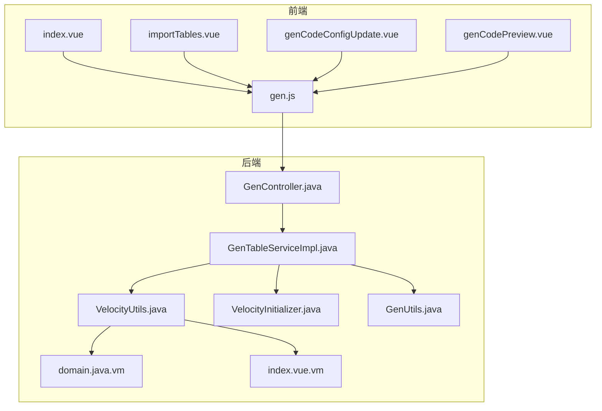
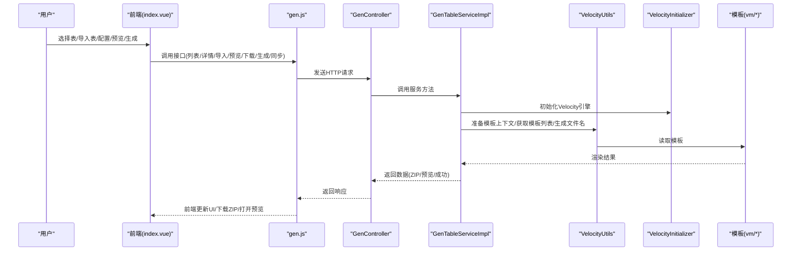
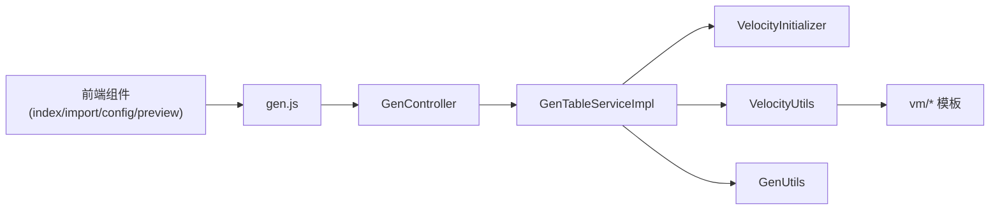

# 生成流程

<cite>
**本文引用的文件**
- [index.vue](file://bear-jia-vue3/src/views/tool/gen/index.vue)
- [importTables.vue](file://bear-jia-vue3/src/views/tool/gen/importTables.vue)
- [genCodePreview.vue](file://bear-jia-vue3/src/views/tool/gen/genCodePreview.vue)
- [genCodeConfigUpdate.vue](file://bear-jia-vue3/src/views/tool/gen/genCodeConfigUpdate.vue)
- [gen.js](file://bear-jia-vue3/src/api/tool/gen.js)
- [GenController.java](file://bearjia-admin-backend/src/main/java/com/javaxiaobear/module/tool/gen/controller/GenController.java)
- [GenTableServiceImpl.java](file://bearjia-admin-backend/src/main/java/com/javaxiaobear/module/tool/gen/service/GenTableServiceImpl.java)
- [VelocityUtils.java](file://bearjia-admin-backend/src/main/java/com/javaxiaobear/module/tool/gen/util/VelocityUtils.java)
- [VelocityInitializer.java](file://bearjia-admin-backend/src/main/java/com/javaxiaobear/module/tool/gen/util/VelocityInitializer.java)
- [GenUtils.java](file://bearjia-admin-backend/src/main/java/com/javaxiaobear/module/tool/gen/util/GenUtils.java)
- [domain.java.vm](file://bearjia-admin-backend/src/main/resources/vm/java/domain.java.vm)
- [index.vue.vm](file://bearjia-admin-backend/src/main/resources/vm/antdv/index.vue.vm)
</cite>

## 目录
1. [简介](#简介)
2. [项目结构](#项目结构)
3. [核心组件](#核心组件)
4. [架构总览](#架构总览)
5. [详细组件分析](#详细组件分析)
6. [依赖关系分析](#依赖关系分析)
7. [性能考量](#性能考量)
8. [故障排查指南](#故障排查指南)
9. [结论](#结论)

## 简介
本文件面向“从数据库表选择到代码输出”的完整生成流程，覆盖前端界面（index.vue）展示数据库表、用户选择后调用后端 GenController 获取表结构信息；表配置阶段（importTables.vue、genCodeConfigUpdate.vue）完成包名、模块名、业务名、作者等元数据与字段级配置（是否主键、是否必填等）；代码预览功能（genCodePreview.vue）通过请求后端模板渲染结果进行展示；后端 GenTableServiceImpl 整合表结构与 Velocity 模板引擎渲染；最终以 ZIP 包形式返回给前端下载或按自定义路径生成。文末提供流程时序图与常见问题排查方法。

## 项目结构
- 前端位于 bear-jia-vue3/src/views/tool/gen，包含生成流程的四个关键页面组件与 API 封装。
- 后端位于 bearjia-admin-backend，包含控制器 GenController、服务实现 GenTableServiceImpl、Velocity 工具 VelocityUtils、引擎初始化 VelocityInitializer、代码生成工具 GenUtils，以及模板资源 vm/*。

图表来源
- [index.vue](file://bear-jia-vue3/src/views/tool/gen/index.vue#L1-L348)
- [importTables.vue](file://bear-jia-vue3/src/views/tool/gen/importTables.vue#L1-L203)
- [genCodeConfigUpdate.vue](file://bear-jia-vue3/src/views/tool/gen/genCodeConfigUpdate.vue#L1-L516)
- [genCodePreview.vue](file://bear-jia-vue3/src/views/tool/gen/genCodePreview.vue#L1-L300)
- [gen.js](file://bear-jia-vue3/src/api/tool/gen.js#L1-L93)
- [GenController.java](file://bearjia-admin-backend/src/main/java/com/javaxiaobear/module/tool/gen/controller/GenController.java#L1-L258)
- [GenTableServiceImpl.java](file://bearjia-admin-backend/src/main/java/com/javaxiaobear/module/tool/gen/service/GenTableServiceImpl.java#L1-L554)
- [VelocityUtils.java](file://bearjia-admin-backend/src/main/java/com/javaxiaobear/module/tool/gen/util/VelocityUtils.java#L1-L497)
- [VelocityInitializer.java](file://bearjia-admin-backend/src/main/java/com/javaxiaobear/module/tool/gen/util/VelocityInitializer.java#L1-L35)
- [GenUtils.java](file://bearjia-admin-backend/src/main/java/com/javaxiaobear/module/tool/gen/util/GenUtils.java#L1-L258)
- [domain.java.vm](file://bearjia-admin-backend/src/main/resources/vm/java/domain.java.vm#L1-L104)
- [index.vue.vm](file://bearjia-admin-backend/src/main/resources/vm/antdv/index.vue.vm#L1-L428)

章节来源
- [index.vue](file://bear-jia-vue3/src/views/tool/gen/index.vue#L1-L348)
- [gen.js](file://bear-jia-vue3/src/api/tool/gen.js#L1-L93)
- [GenController.java](file://bearjia-admin-backend/src/main/java/com/javaxiaobear/module/tool/gen/controller/GenController.java#L1-L258)
- [GenTableServiceImpl.java](file://bearjia-admin-backend/src/main/java/com/javaxiaobear/module/tool/gen/service/GenTableServiceImpl.java#L1-L554)

## 核心组件
- 前端入口与表格展示：index.vue 提供表格、导入、批量生成、同步、创建表等功能入口，并通过 API 请求后端接口。
- 表配置与字段编辑：importTables.vue 用于从数据库导入表；genCodeConfigUpdate.vue 用于配置生成信息与字段级属性（是否插入/编辑/列表/查询、查询方式、是否必填、HTML 显示类型、字典类型等）。
- 代码预览：genCodePreview.vue 调用后端预览接口，将模板渲染结果以标签页形式展示，支持复制与逐文件下载。
- 后端控制器：GenController 提供列表、详情、导入、预览、下载、生成、同步、批量生成等接口。
- 服务实现：GenTableServiceImpl 负责表结构查询、模板上下文准备、Velocity 渲染、ZIP 打包、自定义路径生成、同步数据库等。
- 模板与工具：VelocityUtils 负责模板列表、文件名生成、导入包、权限前缀、树/子表上下文注入；VelocityInitializer 初始化引擎；GenUtils 负责表/列初始化与默认策略。

章节来源
- [index.vue](file://bear-jia-vue3/src/views/tool/gen/index.vue#L1-L348)
- [importTables.vue](file://bear-jia-vue3/src/views/tool/gen/importTables.vue#L1-L203)
- [genCodeConfigUpdate.vue](file://bear-jia-vue3/src/views/tool/gen/genCodeConfigUpdate.vue#L1-L516)
- [genCodePreview.vue](file://bear-jia-vue3/src/views/tool/gen/genCodePreview.vue#L1-L300)
- [gen.js](file://bear-jia-vue3/src/api/tool/gen.js#L1-L93)
- [GenController.java](file://bearjia-admin-backend/src/main/java/com/javaxiaobear/module/tool/gen/controller/GenController.java#L1-L258)
- [GenTableServiceImpl.java](file://bearjia-admin-backend/src/main/java/com/javaxiaobear/module/tool/gen/service/GenTableServiceImpl.java#L1-L554)
- [VelocityUtils.java](file://bearjia-admin-backend/src/main/java/com/javaxiaobear/module/tool/gen/util/VelocityUtils.java#L1-L497)
- [VelocityInitializer.java](file://bearjia-admin-backend/src/main/java/com/javaxiaobear/module/tool/gen/util/VelocityInitializer.java#L1-L35)
- [GenUtils.java](file://bearjia-admin-backend/src/main/java/com/javaxiaobear/module/tool/gen/util/GenUtils.java#L1-L258)

## 架构总览
从前端到后端的生成流程分为以下阶段：
- 表选择与导入：前端 index.vue 展示生成表列表；importTables.vue 从数据库导入表并保存至代码生成表。
- 表配置：genCodeConfigUpdate.vue 展示表与字段信息，允许配置包名、模块名、业务名、作者、模板类别、前端模板类型、生成方式（ZIP/自定义路径）、上级菜单、字段级属性（插入/编辑/列表/查询、查询方式、必填、HTML 类型、字典类型）。
- 代码预览：genCodePreview.vue 调用后端预览接口，后端通过 Velocity 渲染模板，返回各模板渲染结果，前端以标签页展示。
- 代码生成与下载：后端根据模板类别与前端模板类型选择模板列表，渲染后写入 ZIP 或按自定义路径生成文件。
- 同步数据库：当数据库结构变化时，可通过同步接口将数据库列与代码生成配置对齐。

图表来源
- [index.vue](file://bear-jia-vue3/src/views/tool/gen/index.vue#L1-L348)
- [gen.js](file://bear-jia-vue3/src/api/tool/gen.js#L1-L93)
- [GenController.java](file://bearjia-admin-backend/src/main/java/com/javaxiaobear/module/tool/gen/controller/GenController.java#L1-L258)
- [GenTableServiceImpl.java](file://bearjia-admin-backend/src/main/java/com/javaxiaobear/module/tool/gen/service/GenTableServiceImpl.java#L1-L554)
- [VelocityUtils.java](file://bearjia-admin-backend/src/main/java/com/javaxiaobear/module/tool/gen/util/VelocityUtils.java#L1-L497)
- [VelocityInitializer.java](file://bearjia-admin-backend/src/main/java/com/javaxiaobear/module/tool/gen/util/VelocityInitializer.java#L1-L35)
- [domain.java.vm](file://bearjia-admin-backend/src/main/resources/vm/java/domain.java.vm#L1-L104)
- [index.vue.vm](file://bearjia-admin-backend/src/main/resources/vm/antdv/index.vue.vm#L1-L428)

## 详细组件分析

### 前端：index.vue（表选择与操作）
- 功能要点
  - 表格展示生成表列表，支持搜索（表名、注释、创建时间范围）。
  - 操作区提供导入表、创建表、批量生成、删除、生成代码、同步数据库。
  - 生成代码支持两种方式：ZIP 下载或自定义路径生成；批量生成将多个表打包为一个 ZIP。
- 关键交互
  - 生成代码：根据 genType 决定走 ZIP 或自定义路径；ZIP 通过工具方法下载。
  - 同步数据库：调用后端同步接口，成功后刷新表格。
  - 创建表：解析 SQL 并导入，随后刷新表格。

章节来源
- [index.vue](file://bear-jia-vue3/src/views/tool/gen/index.vue#L1-L348)
- [gen.js](file://bear-jia-vue3/src/api/tool/gen.js#L1-L93)

### 前端：importTables.vue（从数据库导入表）
- 功能要点
  - 查询数据库中的表（支持分页与筛选）。
  - 多选导入，调用后端导入接口保存为代码生成表。
  - 导入成功后触发父页面刷新。
- 关键交互
  - 查询：调用后端数据库表列表接口。
  - 导入：将选中的表名拼接传给后端导入接口。

章节来源
- [importTables.vue](file://bear-jia-vue3/src/views/tool/gen/importTables.vue#L1-L203)
- [gen.js](file://bear-jia-vue3/src/api/tool/gen.js#L1-L93)

### 前端：genCodeConfigUpdate.vue（表配置与字段编辑）
- 功能要点
  - 标签页一：生成信息（表名、表描述、实体类名、作者、模板类别、前端模板类型、包路径、模块名、业务名、功能名、上级菜单、生成方式、自定义路径）。
  - 标签页二：字段信息（字段注释、Java 类型、java 属性、插入/编辑/列表/查询、查询方式、必填、HTML 类型、字典类型）。
  - 保存：将表与字段配置提交后端，成功后刷新父页面。
- 关键交互
  - 获取详情：调用后端获取表与字段详情，填充表单。
  - 保存：将表配置与字段列表合并提交后端。

章节来源
- [genCodeConfigUpdate.vue](file://bear-jia-vue3/src/views/tool/gen/genCodeConfigUpdate.vue#L1-L516)
- [gen.js](file://bear-jia-vue3/src/api/tool/gen.js#L1-L93)

### 前端：genCodePreview.vue（代码预览）
- 功能要点
  - 调用后端预览接口，接收模板渲染结果。
  - 以标签页展示每个模板的渲染内容，支持复制与逐文件下载。
- 关键交互
  - 预览：根据 tableId 请求后端预览接口，填充 tabs。
  - 复制：使用 Clipboard API 或回退方案复制当前代码。
  - 下载：将当前代码以 Blob 形式下载为对应文件名。

章节来源
- [genCodePreview.vue](file://bear-jia-vue3/src/views/tool/gen/genCodePreview.vue#L1-L300)
- [gen.js](file://bear-jia-vue3/src/api/tool/gen.js#L1-L93)

### 后端：GenController（接口层）
- 职责
  - 列表查询、详情获取、数据库表列表、字段列表、导入表、创建表、预览、下载、生成、同步、批量生成。
- 关键方法
  - 预览：调用服务层 previewCode，返回模板渲染结果 Map。
  - 下载/批量生成：调用服务层 downloadCode，返回 ZIP 流。
  - 生成（自定义路径）：调用服务层 generatorCode。
  - 同步：调用服务层 synchDb。
  - 导入：解析表名数组，导入数据库表结构并保存为代码生成表。

章节来源
- [GenController.java](file://bearjia-admin-backend/src/main/java/com/javaxiaobear/module/tool/gen/controller/GenController.java#L1-L258)

### 后端：GenTableServiceImpl（服务层）
- 职责
  - 查询表与字段、导入表、预览、下载、生成、同步、校验、设置主键/子表、生成路径。
- 关键流程
  - 预览：准备 VelocityContext，获取模板列表，逐模板渲染，返回 Map。
  - 下载：遍历模板渲染后写入 ZIP，解决重复文件名冲突。
  - 生成（自定义路径）：渲染模板并写入目标路径。
  - 同步：对比数据库列与代码生成列，保留必要配置，插入/更新/删除列。
  - 主键/子表：设置主键列与子表信息，确保树/子表模板上下文完整。

章节来源
- [GenTableServiceImpl.java](file://bearjia-admin-backend/src/main/java/com/javaxiaobear/module/tool/gen/service/GenTableServiceImpl.java#L1-L554)

### 模板与工具：VelocityUtils、VelocityInitializer、GenUtils
- VelocityUtils
  - prepareContext：注入模板变量（包名、模块名、业务名、作者、时间、主键列、导入包、权限前缀、列集合、树/子表上下文等）。
  - getTemplateList：根据模板类别与前端模板类型返回模板清单（Java/SQL/Vue/JS 等）。
  - getFileName：根据模板与表信息生成目标文件名，避免重复。
  - getImportList/getDicts/getPermissionPrefix：辅助生成导入包、字典组、权限前缀。
- VelocityInitializer
  - 初始化 Velocity 引擎，设置字符集与资源加载器。
- GenUtils
  - initTable/initColumnField：初始化表与列的默认值（类名、模块名、业务名、Java 类型、HTML 类型、查询方式、是否插入/编辑/列表/查询、是否必填等）。

章节来源
- [VelocityUtils.java](file://bearjia-admin-backend/src/main/java/com/javaxiaobear/module/tool/gen/util/VelocityUtils.java#L1-L497)
- [VelocityInitializer.java](file://bearjia-admin-backend/src/main/java/com/javaxiaobear/module/tool/gen/util/VelocityInitializer.java#L1-L35)
- [GenUtils.java](file://bearjia-admin-backend/src/main/java/com/javaxiaobear/module/tool/gen/util/GenUtils.java#L1-L258)

### 模板示例：domain.java.vm 与 index.vue.vm
- domain.java.vm：根据上下文生成实体类，包含导入包、注解、字段、getter/setter、toString 等。
- index.vue.vm：根据上下文生成前端页面，包含查询表单、表格、操作按钮、分页、字典渲染、权限控制等。

章节来源
- [domain.java.vm](file://bearjia-admin-backend/src/main/resources/vm/java/domain.java.vm#L1-L104)
- [index.vue.vm](file://bearjia-admin-backend/src/main/resources/vm/antdv/index.vue.vm#L1-L428)

## 依赖关系分析
- 前端组件依赖 gen.js 的统一接口封装，减少对具体后端路由的耦合。
- 后端控制器依赖服务层；服务层依赖工具类与模板资源。
- VelocityUtils 与 VelocityInitializer 解耦模板加载与上下文准备。
- GenUtils 与数据库列类型映射规则解耦，便于扩展。

图表来源
- [gen.js](file://bear-jia-vue3/src/api/tool/gen.js#L1-L93)
- [GenController.java](file://bearjia-admin-backend/src/main/java/com/javaxiaobear/module/tool/gen/controller/GenController.java#L1-L258)
- [GenTableServiceImpl.java](file://bearjia-admin-backend/src/main/java/com/javaxiaobear/module/tool/gen/service/GenTableServiceImpl.java#L1-L554)
- [VelocityUtils.java](file://bearjia-admin-backend/src/main/java/com/javaxiaobear/module/tool/gen/util/VelocityUtils.java#L1-L497)
- [VelocityInitializer.java](file://bearjia-admin-backend/src/main/java/com/javaxiaobear/module/tool/gen/util/VelocityInitializer.java#L1-L35)
- [GenUtils.java](file://bearjia-admin-backend/src/main/java/com/javaxiaobear/module/tool/gen/util/GenUtils.java#L1-L258)

## 性能考量
- 模板渲染：Velocity 渲染在服务端进行，前端仅负责展示与下载，避免大体积模板在前端渲染导致卡顿。
- ZIP 生成：服务端一次性写入 ZIP，避免多次 IO；重复文件名冲突处理采用模板路径后缀，保证稳定性。
- 批量生成：后端对多个表循环渲染并写入同一 ZIP，减少网络往返。
- 字段默认策略：GenUtils 对列类型与 HTML 类型、查询方式、必填等进行默认映射，降低前端配置负担。

## 故障排查指南
- 表结构获取失败
  - 现象：导入表列表为空或导入失败。
  - 排查：确认数据库连接正常；检查后端导入接口是否抛出异常；查看日志定位异常原因。
  - 参考
    - [GenController.java](file://bearjia-admin-backend/src/main/java/com/javaxiaobear/module/tool/gen/controller/GenController.java#L110-L121)
    - [GenTableServiceImpl.java](file://bearjia-admin-backend/src/main/java/com/javaxiaobear/module/tool/gen/service/GenTableServiceImpl.java#L168-L194)
- 字段映射错误
  - 现象：生成的 Java 类型、HTML 类型、查询方式与期望不符。
  - 排查：检查 GenUtils 中的类型映射规则；确认数据库列类型与长度；在前端字段配置页手动调整。
  - 参考
    - [GenUtils.java](file://bearjia-admin-backend/src/main/java/com/javaxiaobear/module/tool/gen/util/GenUtils.java#L32-L131)
    - [genCodeConfigUpdate.vue](file://bear-jia-vue3/src/views/tool/gen/genCodeConfigUpdate.vue#L110-L173)
- 预览为空或模板缺失
  - 现象：预览接口返回空或部分模板未渲染。
  - 排查：确认模板类别与前端模板类型组合是否正确；检查 VelocityUtils.getTemplateList 返回的模板清单；确认模板文件存在。
  - 参考
    - [VelocityUtils.java](file://bearjia-admin-backend/src/main/java/com/javaxiaobear/module/tool/gen/util/VelocityUtils.java#L130-L168)
    - [GenController.java](file://bearjia-admin-backend/src/main/java/com/javaxiaobear/module/tool/gen/controller/GenController.java#L186-L194)
- ZIP 下载失败
  - 现象：下载后文件损坏或无法打开。
  - 排查：确认服务端 ZIP 写入与关闭顺序；检查文件名重复处理逻辑；确认响应头设置正确。
  - 参考
    - [GenTableServiceImpl.java](file://bearjia-admin-backend/src/main/java/com/javaxiaobear/module/tool/gen/service/GenTableServiceImpl.java#L364-L424)
    - [GenController.java](file://bearjia-admin-backend/src/main/java/com/javaxiaobear/module/tool/gen/controller/GenController.java#L232-L258)
- 自定义路径生成失败
  - 现象：生成方式为自定义路径但未生成文件。
  - 排查：确认 genPath 配置；检查服务端写入路径是否存在权限问题；查看异常日志。
  - 参考
    - [GenTableServiceImpl.java](file://bearjia-admin-backend/src/main/java/com/javaxiaobear/module/tool/gen/service/GenTableServiceImpl.java#L250-L285)
    - [genCodeConfigUpdate.vue](file://bear-jia-vue3/src/views/tool/gen/genCodeConfigUpdate.vue#L92-L107)

## 结论
该生成流程以清晰的前后端职责划分实现从数据库表到代码输出的自动化：前端负责交互与展示，后端负责数据与模板渲染。Velocity 模板体系与工具类配合，确保生成产物的一致性与可维护性。通过预览与批量生成能力，提升开发效率；通过同步接口保障代码与数据库结构的持续一致。