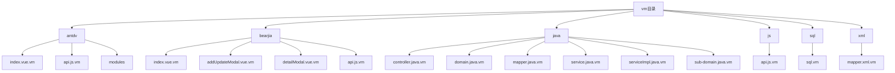
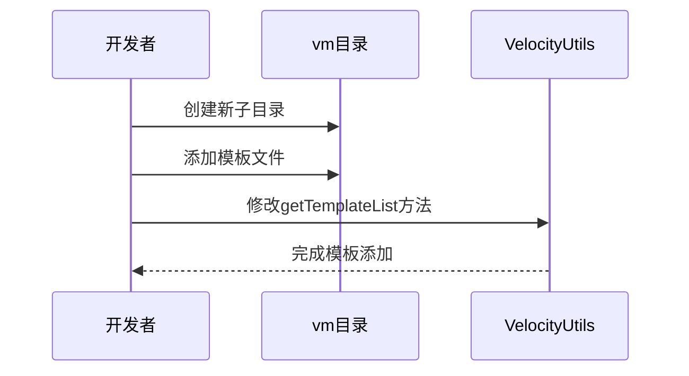

# 自定义扩展

<cite>
**本文档引用文件**   
- [GenUtils.java](file://bearjia-admin-backend\src\main\java\com\javaxiaobear\module\tool\gen\util\GenUtils.java)
- [VelocityInitializer.java](file://bearjia-admin-backend\src\main\java\com\javaxiaobear\module\tool\gen\util\VelocityInitializer.java)
- [VelocityUtils.java](file://bearjia-admin-backend\src\main\java\com\javaxiaobear\module\tool\gen\util\VelocityUtils.java)
- [GenTableServiceImpl.java](file://bearjia-admin-backend\src\main\java\com\javaxiaobear\module\tool\gen\service\GenTableServiceImpl.java)
- [GenTable.java](file://bearjia-admin-backend\src\main\java\com\javaxiaobear\module\tool\gen\domain\GenTable.java)
- [GenConstants.java](file://bearjia-admin-backend\src\main\java\com\javaxiaobear\base\common\constant\GenConstants.java)
- [GenConfig.java](file://bearjia-admin-backend\src\main\java\com\javaxiaobear\base\framework\config\GenConfig.java)
- [genCodeConfigUpdate.vue](file://bear-jia-vue3\src\views\tool\gen\genCodeConfigUpdate.vue)
- [vm目录](file://bearjia-admin-backend\src\main\resources\vm)
- [bear_jia.sql](file://bearjia-admin-backend\src\main\resources\sql\bear_jia.sql)
</cite>

## 目录

1. [简介](#简介)
2. [模板扩展](#模板扩展)
3. [代码生成核心工具](#代码生成核心工具)
4. [模板加载机制](#模板加载机制)
5. [前端生成配置扩展](#前端生成配置扩展)
6. [自定义模板调试方法](#自定义模板调试方法)
7. [扩展案例](#扩展案例)
8. [结论](#结论)

## 简介

本文档旨在指导开发者如何扩展和定制代码生成器，以满足特定项目需求。通过深入分析现有代码生成器的架构和实现，我们将详细介绍如何添加新的模板类型、扩展核心工具类、修改前端配置以及调试自定义模板。文档将涵盖从模板文件存放位置到实际扩展案例的完整流程，帮助开发者快速掌握代码生成器的定制方法。

## 模板扩展

### 模板文件存放位置

代码生成器的模板文件存放在 `vm` 目录下，该目录位于后端项目的资源路径中，具体路径为 `bearjia-admin-backend\src\main\resources\vm`。该目录包含了多套前端代码生成模板，分别适用于不同的前端架构。



**Diagram sources**
- [vm目录](file://bearjia-admin-backend\src\main\resources\vm)

**Section sources**
- [vm目录](file://bearjia-admin-backend\src\main\resources\vm)

### 模板类型

`vm` 目录下包含两套前端代码生成模板：

1. **antdv模板**：适用于标准的 Ant Design Vue 项目，使用 Vue3 + Composition API。
2. **bearjia模板**：适用于 BearJia Vue3 管理系统，基于 ProTable 统一表格组件。

此外，还包含 Java、JavaScript、SQL 和 XML 等后端模板。

### 添加新模板类型

要添加新的模板类型，如移动端 H5 页面模板或微服务 YAML 配置模板，可以按照以下步骤操作：

1. 在 `vm` 目录下创建新的子目录，如 `h5` 或 `microservice`。
2. 在新目录中添加相应的模板文件，如 `index.vue.vm`、`api.js.vm` 等。
3. 修改 `VelocityUtils.java` 中的 `getTemplateList` 方法，以包含新模板的路径。



**Diagram sources**
- [vm目录](file://bearjia-admin-backend\src\main\resources\vm)
- [VelocityUtils.java](file://bearjia-admin-backend\src\main\java\com\javaxiaobear\module\tool\gen\util\VelocityUtils.java)

**Section sources**
- [vm目录](file://bearjia-admin-backend\src\main\resources\vm)
- [VelocityUtils.java](file://bearjia-admin-backend\src\main\java\com\javaxiaobear\module\tool\gen\util\VelocityUtils.java)

### 模板变量定义规范

模板变量在 `VelocityUtils.java` 的 `prepareContext` 方法中定义，主要包括：

- `tplCategory`：模板分类
- `tableName`：表名
- `functionName`：功能名
- `ClassName`：类名（首字母大写）
- `className`：类名（首字母小写）
- `moduleName`：模块名
- `BusinessName`：业务名（首字母大写）
- `businessName`：业务名（首字母小写）
- `basePackage`：基础包路径
- `packageName`：包路径
- `author`：作者
- `datetime`：生成时间
- `pkColumn`：主键列
- `importList`：导入列表
- `permissionPrefix`：权限前缀
- `columns`：列信息列表

这些变量在模板中通过 `$variableName` 的方式引用。

**Section sources**
- [VelocityUtils.java](file://bearjia-admin-backend\src\main\java\com\javaxiaobear\module\tool\gen\util\VelocityUtils.java)

## 代码生成核心工具

### GenUtils.java 核心工具方法

`GenUtils.java` 是代码生成器的核心工具类，提供了列名转换、数据类型映射等关键功能。

#### 列名转换

`convertClassName` 方法负责将数据库表名转换为 Java 类名。该方法支持自动去除表前缀，通过 `GenConfig` 类中的配置来控制。

```java
public static String convertClassName(String tableName)
{
    boolean autoRemovePre = GenConfig.getAutoRemovePre();
    String tablePrefix = GenConfig.getTablePrefix();
    if (autoRemovePre && StringUtils.isNotEmpty(tablePrefix))
    {
        String[] searchList = StringUtils.split(tablePrefix, ",");
        tableName = replaceFirst(tableName, searchList);
    }
    return StringUtils.convertToCamelCase(tableName);
}
```

#### 数据类型映射

`initColumnField` 方法负责将数据库字段类型映射到 Java 类型和前端显示类型。该方法根据字段类型、长度和名称进行智能判断。

```java
public static void initColumnField(GenTableColumn column, GenTable table)
{
    String dataType = getDbType(column.getColumnType());
    String columnName = column.getColumnName();
    // ... 其他代码
    if (arraysContains(GenConstants.COLUMNTYPE_STR, dataType) || arraysContains(GenConstants.COLUMNTYPE_TEXT, dataType))
    {
        Integer columnLength = getColumnLength(column.getColumnType());
        String htmlType = columnLength >= 500 || arraysContains(GenConstants.COLUMNTYPE_TEXT, dataType) ? GenConstants.HTML_TEXTAREA : GenConstants.HTML_INPUT;
        column.setHtmlType(htmlType);
    }
    else if (arraysContains(GenConstants.COLUMNTYPE_TIME, dataType))
    {
        column.setJavaType(GenConstants.TYPE_DATE);
        column.setHtmlType(GenConstants.HTML_DATETIME);
    }
    else if (arraysContains(GenConstants.COLUMNTYPE_NUMBER, dataType))
    {
        column.setHtmlType(GenConstants.HTML_INPUT);
        String[] str = StringUtils.split(StringUtils.substringBetween(column.getColumnType(), "(", ")"), ",");
        if (str != null && str.length == 2 && Integer.parseInt(str[1]) > 0)
        {
            column.setJavaType(GenConstants.TYPE_BIGDECIMAL);
        }
        else if (str != null && str.length == 1 && Integer.parseInt(str[0]) <= 10)
        {
            column.setJavaType(GenConstants.TYPE_INTEGER);
        }
        else
        {
            column.setJavaType(GenConstants.TYPE_LONG);
        }
    }
    // ... 其他代码
}
```

#### 扩展新数据库类型

要支持新的数据库类型，可以修改 `GenConstants.java` 中的常量数组，如 `COLUMNTYPE_STR`、`COLUMNTYPE_TEXT`、`COLUMNTYPE_TIME` 和 `COLUMNTYPE_NUMBER`。这些数组定义了不同数据库类型的分类。

```java
public class GenConstants
{
    /** 数据库字符串类型 */
    public static final String[] COLUMNTYPE_STR = { "char", "varchar", "nvarchar", "varchar2" };

    /** 数据库文本类型 */
    public static final String[] COLUMNTYPE_TEXT = { "tinytext", "text", "mediumtext", "longtext" };

    /** 数据库时间类型 */
    public static final String[] COLUMNTYPE_TIME = { "datetime", "time", "date", "timestamp" };

    /** 数据库数字类型 */
    public static final String[] COLUMNTYPE_NUMBER = { "int", "integer", "tinyint", "smallint", "mediumint", "bigint", "float", "double", "decimal" };
    // ... 其他代码
}
```

**Section sources**
- [GenUtils.java](file://bearjia-admin-backend\src\main\java\com\javaxiaobear\module\tool\gen\util\GenUtils.java)
- [GenConstants.java](file://bearjia-admin-backend\src\main\java\com\javaxiaobear\base\common\constant\GenConstants.java)

## 模板加载机制

### VelocityInitializer.java

`VelocityInitializer.java` 负责初始化 Velocity 引擎，加载模板文件。

```java
public class VelocityInitializer
{
    /**
     * 初始化vm方法
     */
    public static void initVelocity()
    {
        Properties p = new Properties();
        try
        {
            // 加载classpath目录下的vm文件
            p.setProperty("resource.loader.file.class", "org.apache.velocity.runtime.resource.loader.ClasspathResourceLoader");
            // 定义字符集
            p.setProperty(Velocity.INPUT_ENCODING, Constants.UTF8);
            // 初始化Velocity引擎，指定配置Properties
            Velocity.init(p);
        }
        catch (Exception e)
        {
            throw new RuntimeException(e);
        }
    }
}
```

该类通过设置 `resource.loader.file.class` 属性为 `ClasspathResourceLoader`，使得 Velocity 能够从 classpath 中加载模板文件。同时，设置了输入编码为 UTF-8，确保模板文件的正确读取。

### 注册自定义工具类

要注册自定义工具类供模板使用，可以在 `VelocityInitializer.java` 的 `initVelocity` 方法中添加自定义的工具类。例如，可以添加一个日期格式化工具类：

```java
p.setProperty("userdirective", "com.javaxiaobear.module.tool.gen.util.DateFormatter");
```

然后在模板中使用该工具类：

```vm
$dateFormatter.format($datetime, "yyyy-MM-dd HH:mm:ss")
```

**Section sources**
- [VelocityInitializer.java](file://bearjia-admin-backend\src\main\java\com\javaxiaobear\module\tool\gen\util\VelocityInitializer.java)

## 前端生成配置扩展

### genCodeConfigUpdate.vue

`genCodeConfigUpdate.vue` 是前端生成配置的界面，允许用户修改生成配置。

#### 添加新的生成选项

要在生成配置中添加新的选项，如是否生成 Swagger 注解，可以修改 `genCodeConfigUpdate.vue` 文件。

1. 在 `pageDataObj` 中添加新的数据属性：

```javascript
const pageDataObj = reactive({
    visible: false,
    optionselectDict: [],
    javaTypeDict: [],
    queryTypeDict: [],
    htmlTypeDict: [],
    tplCategoryDict: [],
    menusDict: [],
    deptTreeData: [],
    generateSwagger: true  // 新增的生成选项
});
```

2. 在模板中添加新的表单项：

```vue
<a-form-item name="generateSwagger" label="生成Swagger注解">
    <a-switch v-model:checked="pageDataObj.generateSwagger" checked-children="是" un-checked-children="否" />
</a-form-item>
```

3. 在 `clickModalOk` 方法中将新的选项传递给后端：

```javascript
const clickModalOk = (e) => {
    updateFormRef.value
        .validateFields()
        .then((values) => {
            const genTable = Object.assign({}, updateFormObj.data);
            genTable.columns = tableData.dataSource;
            genTable.params = {
                parentMenuId: updateFormObj.data.parentMenuId,
                generateSwagger: pageDataObj.generateSwagger  // 传递新的选项
            };
            updateGenTable(genTable).then((res) => {
                // ... 其他代码
            });
        })
        .catch((info) => {
            // ... 其他代码
        });
};
```

**Section sources**
- [genCodeConfigUpdate.vue](file://bear-jia-vue3\src\views\tool\gen\genCodeConfigUpdate.vue)

## 自定义模板调试方法

### 日志输出

在模板中可以使用 `#set($log = $velocityLogger.info("调试信息"))` 来输出日志。这些日志将显示在应用服务器的日志文件中。

### 模板语法检查

在生成代码时，如果模板语法有误，系统会记录操作日志。例如，在 `bear_jia.sql` 文件中可以看到以下日志：

```sql
INSERT INTO `sys_oper_log` (`oper_id`, `title`, `business_type`, `method`, `request_method`, `operator_type`, `oper_name`, `dept_name`, `oper_url`, `oper_ip`, `oper_location`, `oper_param`, `json_result`, `status`, `error_msg`, `oper_time`, `cost_time`) VALUES (101, '代码生成', 8, 'com.javaxiaobear.module.tool.gen.controller.GenController.batchGenCode()', 'GET', 1, 'admin', '研发部门', '/tool/gen/batchGenCode', '127.0.0.1', '内网IP', '{\"tables\":\"sys_config\"}', NULL, 1, 'Lexical error,   Encountered: \"(\" (40), after : \"\" at vm/antdv/index.vue.vm[line 397, column 43]', '2025-08-17 20:27:30', 44);
```

该日志显示了模板语法错误的具体位置和原因。

### 调试步骤

1. 检查操作日志中的错误信息。
2. 根据错误信息定位到具体的模板文件和行号。
3. 修正模板语法错误。
4. 重新生成代码并验证结果。

**Section sources**
- [bear_jia.sql](file://bearjia-admin-backend\src\main\resources\sql\bear_jia.sql)

## 扩展案例

### 添加Excel导出功能

以下是一个实际的扩展案例，展示如何将 Excel 导出功能添加到生成的代码中。

1. 在 `vm` 目录下创建 `excel` 子目录。
2. 在 `excel` 目录中添加 `export.js.vm` 模板文件：

```vm
import { exportExcel } from '@/utils/excel'

export function export${ClassName}(data) {
    return exportExcel({
        filename: '${functionName}列表',
        sheet: '${functionName}',
        columns: ${columns},
        data: data
    })
}
```

3. 修改 `VelocityUtils.java` 中的 `getTemplateList` 方法，添加 Excel 导出模板：

```java
public static List<String> getTemplateList(String tplCategory, String tplWebType)
{
    List<String> templates = new ArrayList<String>();
    // ... 其他模板
    if (GenConstants.TPL_CRUD.equals(tplCategory) || GenConstants.TPL_TREE.equals(tplCategory))
    {
        // ... 其他模板
        templates.add("vm/excel/export.js.vm");
    }
    return templates;
}
```

4. 在 `genCodeConfigUpdate.vue` 中添加是否生成 Excel 导出功能的选项。

通过以上步骤，生成的代码将包含 Excel 导出功能，用户可以直接调用相关方法导出数据。

**Section sources**
- [vm目录](file://bearjia-admin-backend\src\main\resources\vm)
- [VelocityUtils.java](file://bearjia-admin-backend\src\main\java\com\javaxiaobear\module\tool\gen\util\VelocityUtils.java)
- [genCodeConfigUpdate.vue](file://bear-jia-vue3\src\views\tool\gen\genCodeConfigUpdate.vue)

## 结论

本文档详细介绍了如何扩展和定制代码生成器，涵盖了模板扩展、核心工具修改、前端配置扩展和调试方法等多个方面。通过遵循本文档的指导，开发者可以轻松地添加新的模板类型、支持新的数据库类型、扩展生成配置，并实现复杂的业务功能。代码生成器的灵活性和可扩展性为快速开发提供了强大的支持，有助于提高开发效率和代码质量。