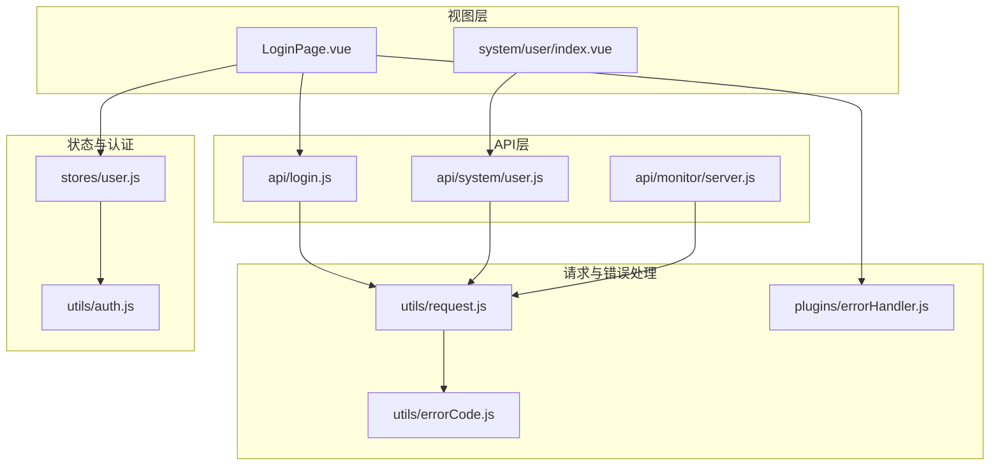
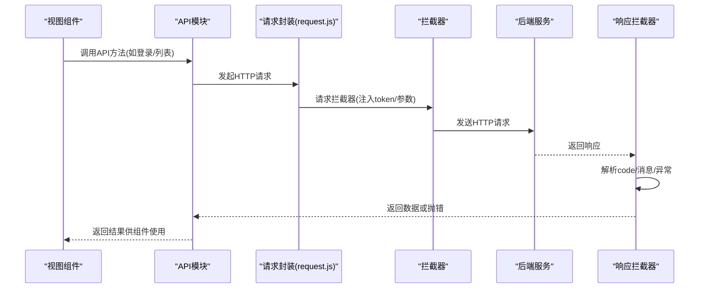
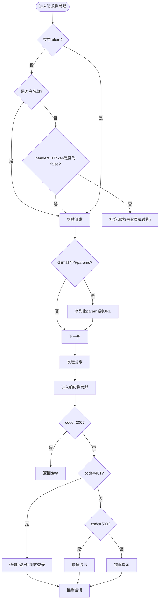
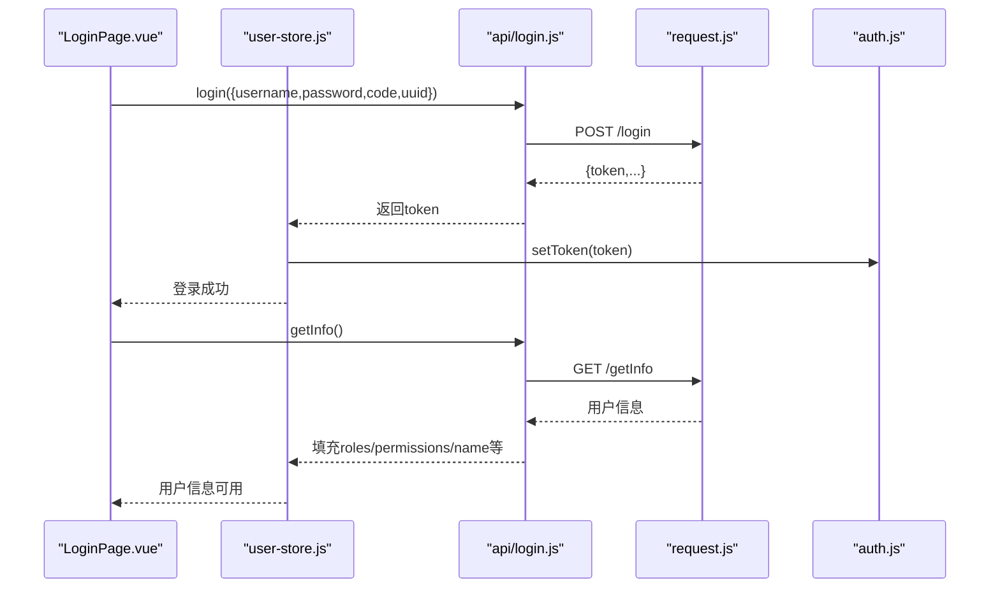
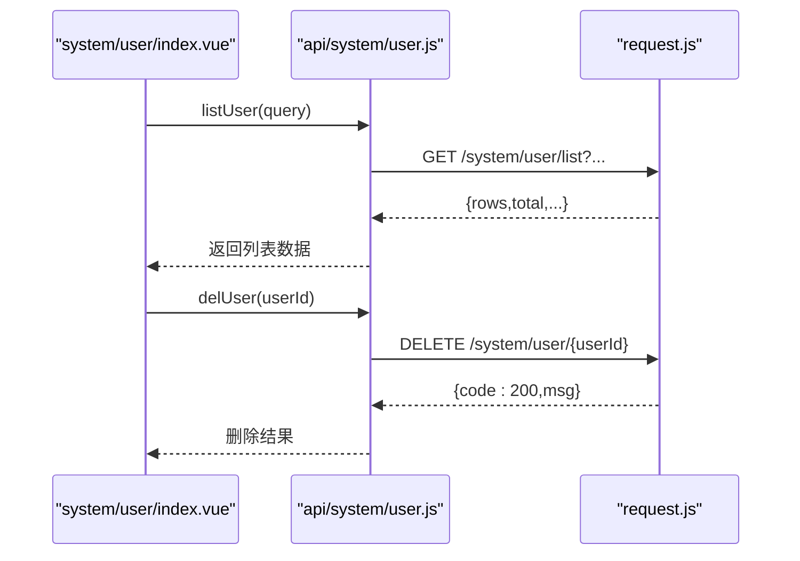
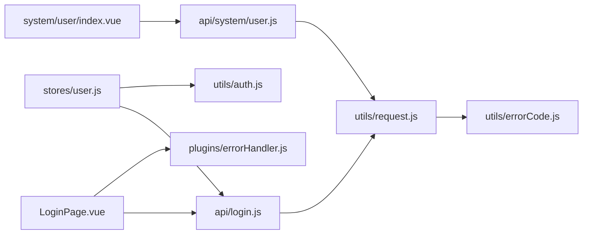

# API集成

<cite>
**本文引用的文件**
- [request.js](file://bear-jia-vue3/src/utils/request.js)
- [errorCode.js](file://bear-jia-vue3/src/utils/errorCode.js)
- [login.js](file://bear-jia-vue3/src/api/login.js)
- [user.js](file://bear-jia-vue3/src/api/system/user.js)
- [server.js](file://bear-jia-vue3/src/api/monitor/server.js)
- [auth.js](file://bear-jia-vue3/src/utils/auth.js)
- [user-store.js](file://bear-jia-vue3/src/stores/user.js)
- [errorHandler.js](file://bear-jia-vue3/src/plugins/errorHandler.js)
- [LoginPage.vue](file://bear-jia-vue3/src/views/LoginPage.vue)
- [index.vue](file://bear-jia-vue3/src/views/system/user/index.vue)
- [upload.js](file://h5/src/utils/upload.js)
- [bearjia.js](file://bear-jia-vue3/src/utils/bearjia.js)
</cite>

## 目录
1. [简介](#简介)
2. [项目结构](#项目结构)
3. [核心组件](#核心组件)
4. [架构总览](#架构总览)
5. [详细组件分析](#详细组件分析)
6. [依赖关系分析](#依赖关系分析)
7. [性能考量](#性能考量)
8. [故障排查指南](#故障排查指南)
9. [结论](#结论)
10. [附录](#附录)

## 简介
本文件面向前端开发者与集成工程师，系统性梳理本项目的API集成方案，重点覆盖：
- 基于 axios 的请求封装与拦截器机制（请求头注入、白名单、参数序列化、下载）
- 统一错误码体系与响应拦截处理
- 各模块API文件的组织结构与方法命名规范
- 登录认证流程（从登录请求到 token 存储与用户信息拉取）
- 文件上传、分页查询等常见API模式
- 结合 errorHandler 插件的网络异常与业务异常处理策略
- API 调用时序图，展示从组件到数据返回的完整链路

## 项目结构
前端采用按功能域划分的模块化组织方式：API 层位于 src/api 下，按业务模块拆分；请求封装与错误码位于 src/utils；全局状态管理使用 Pinia Store；登录页与业务页面位于 src/views；错误处理插件位于 src/plugins。

图表来源
- [LoginPage.vue](file://bear-jia-vue3/src/views/LoginPage.vue#L1-L170)
- [index.vue](file://bear-jia-vue3/src/views/system/user/index.vue#L94-L178)
- [login.js](file://bear-jia-vue3/src/api/login.js#L1-L57)
- [user.js](file://bear-jia-vue3/src/api/system/user.js#L1-L131)
- [server.js](file://bear-jia-vue3/src/api/monitor/server.js#L1-L9)
- [request.js](file://bear-jia-vue3/src/utils/request.js#L1-L165)
- [errorCode.js](file://bear-jia-vue3/src/utils/errorCode.js#L1-L7)
- [errorHandler.js](file://bear-jia-vue3/src/plugins/errorHandler.js#L1-L194)
- [user-store.js](file://bear-jia-vue3/src/stores/user.js#L1-L83)
- [auth.js](file://bear-jia-vue3/src/utils/auth.js#L1-L16)

章节来源
- [request.js](file://bear-jia-vue3/src/utils/request.js#L1-L165)
- [login.js](file://bear-jia-vue3/src/api/login.js#L1-L57)
- [user.js](file://bear-jia-vue3/src/api/system/user.js#L1-L131)
- [server.js](file://bear-jia-vue3/src/api/monitor/server.js#L1-L9)
- [user-store.js](file://bear-jia-vue3/src/stores/user.js#L1-L83)
- [auth.js](file://bear-jia-vue3/src/utils/auth.js#L1-L16)
- [errorHandler.js](file://bear-jia-vue3/src/plugins/errorHandler.js#L1-L194)
- [LoginPage.vue](file://bear-jia-vue3/src/views/LoginPage.vue#L1-L170)
- [index.vue](file://bear-jia-vue3/src/views/system/user/index.vue#L94-L178)

## 核心组件
- 请求封装与拦截器：统一基地址、超时、请求头注入 Authorization、白名单放行、GET 参数序列化、响应错误码映射与统一提示、下载能力
- 错误码体系：集中定义业务错误码与默认提示
- API 模块：按业务域组织，方法命名遵循动词+名词语义，支持 GET/POST/PUT/DELETE
- 登录认证：登录请求、token 存储、用户信息拉取、登出清理
- 错误处理插件：全局网络/业务/运行时/验证错误处理，统一提示与日志
- 上传与下载：通用下载与 H5 上传封装，均复用统一错误码与提示

章节来源
- [request.js](file://bear-jia-vue3/src/utils/request.js#L1-L165)
- [errorCode.js](file://bear-jia-vue3/src/utils/errorCode.js#L1-L7)
- [login.js](file://bear-jia-vue3/src/api/login.js#L1-L57)
- [user.js](file://bear-jia-vue3/src/api/system/user.js#L1-L131)
- [errorHandler.js](file://bear-jia-vue3/src/plugins/errorHandler.js#L1-L194)

## 架构总览
从前端到后端的调用路径：组件触发 API -> API 方法封装 -> 请求拦截器注入 token/参数 -> 发送请求 -> 响应拦截器统一处理 -> 返回数据或抛出错误 -> 组件消费结果。

图表来源
- [LoginPage.vue](file://bear-jia-vue3/src/views/LoginPage.vue#L120-L150)
- [login.js](file://bear-jia-vue3/src/api/login.js#L1-L57)
- [request.js](file://bear-jia-vue3/src/utils/request.js#L24-L123)

## 详细组件分析

### 请求封装与拦截器（request.js）
- 基础配置：baseURL 来自环境变量、默认 Content-Type、超时时间
- 白名单：登录、验证码等无需 token
- 请求拦截器：
  - 注入 Authorization: Bearer token
  - 校验是否需要 token（headers.isToken=false 覆盖）
  - GET 请求参数序列化到 URL
- 响应拦截器：
  - 读取 data.code，映射 errorCode 或默认提示
  - 401：通知+清空会话+跳转登录
  - 500：错误提示+拒绝
  - 非 200：错误提示+拒绝
  - 200：透传 data
- 网络异常：统一转换为“连接异常/超时/状态码异常”提示
- 下载能力：transformRequest 序列化参数、Blob 校验、非登录数据保存、错误提示

图表来源
- [request.js](file://bear-jia-vue3/src/utils/request.js#L18-L123)

章节来源
- [request.js](file://bear-jia-vue3/src/utils/request.js#L1-L165)

### 统一错误码与处理（errorCode.js）
- 定义常见业务错误码与默认提示
- 在请求拦截器与下载流程中统一映射与提示

章节来源
- [errorCode.js](file://bear-jia-vue3/src/utils/errorCode.js#L1-L7)
- [request.js](file://bear-jia-vue3/src/utils/request.js#L70-L105)
- [request.js](file://bear-jia-vue3/src/utils/request.js#L125-L162)

### API 模块组织与命名规范
- login.js：登录、注册、获取用户信息、退出、验证码
- system/user.js：用户列表、详情、新增/修改/删除、重置密码、状态变更、个人信息、密码修改、头像上传、授权角色
- monitor/server.js：服务器监控
- 命名规范：动词+名词，如 listUser、getUser、addUser、updateUser、delUser、resetUserPwd、changeUserStatus、getUserProfile、updateUserProfile、updateUserPwd、uploadAvatar、getAuthRole、updateAuthRole
- 参数传递：GET 使用 params，POST/PUT/DELETE 使用 data；部分上传场景设置 multipart/form-data

章节来源
- [login.js](file://bear-jia-vue3/src/api/login.js#L1-L57)
- [user.js](file://bear-jia-vue3/src/api/system/user.js#L1-L131)
- [server.js](file://bear-jia-vue3/src/api/monitor/server.js#L1-L9)

### 登录认证流程（从 login.js 到 token 存储）
- 视图层 LoginPage.vue：
  - 获取验证码图片、校验表单、提交登录
  - 调用 user-store.login 将 token 写入 Cookie 并同步到 store
  - 拉取用户信息并生成路由
- store 层 user-store.js：
  - 调用 api/login 的 login 接口，写入 token
  - 调用 getInfo 拉取用户信息并填充 store
  - logout 清理 token 与 store
- 工具层 auth.js：
  - 通过 js-cookie 读写 Admin-Token

图表来源
- [LoginPage.vue](file://bear-jia-vue3/src/views/LoginPage.vue#L120-L150)
- [user-store.js](file://bear-jia-vue3/src/stores/user.js#L30-L82)
- [login.js](file://bear-jia-vue3/src/api/login.js#L1-L57)
- [request.js](file://bear-jia-vue3/src/utils/request.js#L24-L123)
- [auth.js](file://bear-jia-vue3/src/utils/auth.js#L1-L16)

章节来源
- [LoginPage.vue](file://bear-jia-vue3/src/views/LoginPage.vue#L1-L170)
- [user-store.js](file://bear-jia-vue3/src/stores/user.js#L1-L83)
- [login.js](file://bear-jia-vue3/src/api/login.js#L1-L57)
- [auth.js](file://bear-jia-vue3/src/utils/auth.js#L1-L16)

### 分页查询与表格数据模式
- system/user/index.vue 使用 ProTable 组件，通过 tableApi 指定 list/del 方法
- 列表查询通过 api/system/user.js 的 listUser(query) GET 请求
- 初始搜索参数 initialSearchParams 与搜索表单 searchFields 对齐
- 删除通过 delUser(userId) 调用

图表来源
- [index.vue](file://bear-jia-vue3/src/views/system/user/index.vue#L120-L170)
- [user.js](file://bear-jia-vue3/src/api/system/user.js#L1-L45)
- [request.js](file://bear-jia-vue3/src/utils/request.js#L24-L123)

章节来源
- [index.vue](file://bear-jia-vue3/src/views/system/user/index.vue#L94-L178)
- [user.js](file://bear-jia-vue3/src/api/system/user.js#L1-L45)

### 文件上传与下载模式
- 通用下载：
  - 调用 request.download(url, params, filename)
  - transformRequest 序列化参数、设置 x-www-form-urlencoded、responseType: blob
  - blobValidate 校验是否登录态，非登录态走错误提示
- H5 上传（对比参考）：
  - upload.js 封装 uni.uploadFile，同样注入 Authorization、GET 参数序列化、错误码映射与提示
  - 401 时弹窗确认并跳转登录

章节来源
- [request.js](file://bear-jia-vue3/src/utils/request.js#L125-L162)
- [upload.js](file://h5/src/utils/upload.js#L1-L71)
- [bearjia.js](file://bear-jia-vue3/src/utils/bearjia.js#L200-L238)

### 错误处理插件（errorHandler.js）
- 类型分类：NETWORK/API/RUNTIME/VALIDATION
- 网络错误：离线、404、5xx 等差异化提示
- API 错误：根据 code 显示不同提示，401 可触发登出逻辑
- 运行时错误：记录组件、信息、错误详情，统一提示
- 验证错误：聚合表单验证错误消息
- 全局安装：设置 app.config.errorHandler、window.unhandledrejection，统一处理未捕获异常

章节来源
- [errorHandler.js](file://bear-jia-vue3/src/plugins/errorHandler.js#L1-L194)

## 依赖关系分析
- API 模块依赖 request.js，间接依赖 errorCode.js
- 视图层组件依赖 API 模块与 Pinia Store
- Store 依赖 api/login 与 utils/auth
- errorHandler 插件作为全局错误处理扩展

图表来源
- [LoginPage.vue](file://bear-jia-vue3/src/views/LoginPage.vue#L1-L170)
- [index.vue](file://bear-jia-vue3/src/views/system/user/index.vue#L94-L178)
- [login.js](file://bear-jia-vue3/src/api/login.js#L1-L57)
- [user.js](file://bear-jia-vue3/src/api/system/user.js#L1-L131)
- [request.js](file://bear-jia-vue3/src/utils/request.js#L1-L165)
- [errorCode.js](file://bear-jia-vue3/src/utils/errorCode.js#L1-L7)
- [errorHandler.js](file://bear-jia-vue3/src/plugins/errorHandler.js#L1-L194)
- [user-store.js](file://bear-jia-vue3/src/stores/user.js#L1-L83)
- [auth.js](file://bear-jia-vue3/src/utils/auth.js#L1-L16)

## 性能考量
- 请求超时与白名单：避免不必要的 token 校验与网络等待
- GET 参数序列化：减少后端解析负担，提升缓存命中
- 下载使用 Blob 校验：避免将登录态文本误当数据下载
- 统一错误提示：减少重复提示逻辑，降低 UI 重绘成本
- 插件级错误处理：集中处理未捕获异常，避免应用崩溃

## 故障排查指南
- 登录失败/401：
  - 检查验证码与 uuid 是否正确
  - 确认 Cookie 中 Admin-Token 是否写入
  - 查看响应拦截器对 401 的登出与跳转逻辑
- 网络异常：
  - 关注拦截器对 Network Error/timeout/status code 的统一提示
  - 使用 errorHandler 插件查看未处理 Promise 错误
- 业务错误：
  - 根据 errorCode 映射提示，核对后端返回 code/msg
- 下载失败：
  - 确认 blobValidate 校验是否为登录态
  - 检查 transformRequest 与 responseType 配置

章节来源
- [request.js](file://bear-jia-vue3/src/utils/request.js#L70-L123)
- [errorHandler.js](file://bear-jia-vue3/src/plugins/errorHandler.js#L140-L194)
- [errorCode.js](file://bear-jia-vue3/src/utils/errorCode.js#L1-L7)

## 结论
本项目通过 request.js 的统一拦截器与 errorCode.js 的错误码体系，实现了前后端交互的一致性与可维护性；API 模块按业务域清晰组织，命名规范明确；登录认证链路完整闭环，配合 errorHandler 插件形成完善的错误处理机制。分页查询、文件上传/下载等常见模式均有标准化实现，便于快速扩展与复用。

## 附录
- 环境变量：baseURL 通过 import.meta.env.VITE_APP_BASE_API 注入
- 参数序列化：tansParams 支持嵌套对象键值对拼接
- 下载工具：download 函数封装 Blob 保存与错误提示

章节来源
- [request.js](file://bear-jia-vue3/src/utils/request.js#L1-L23)
- [bearjia.js](file://bear-jia-vue3/src/utils/bearjia.js#L200-L238)